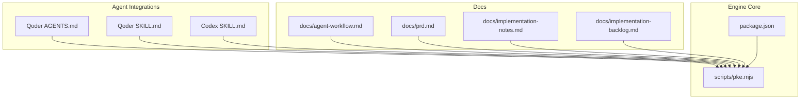
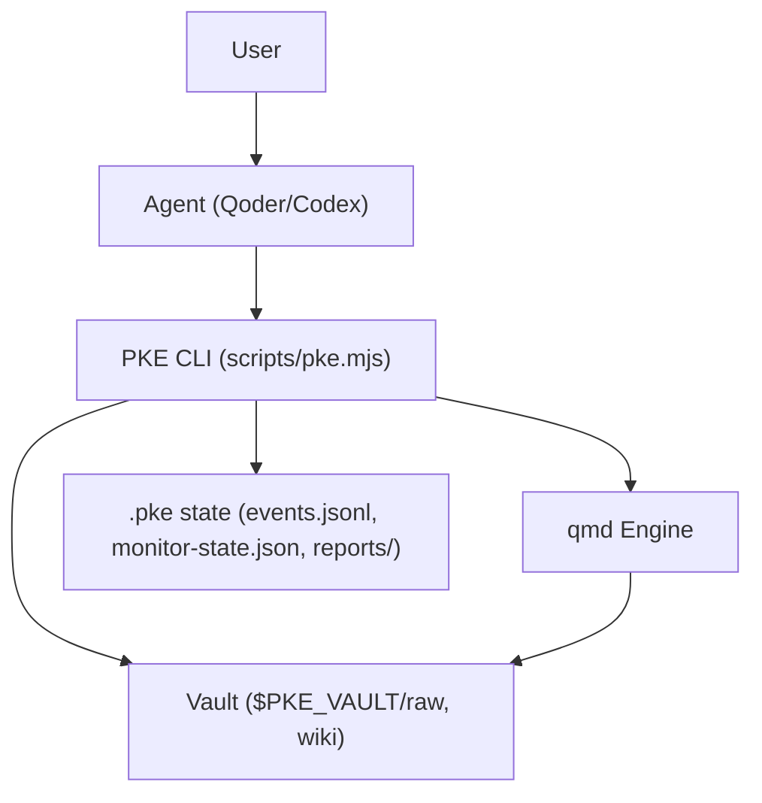
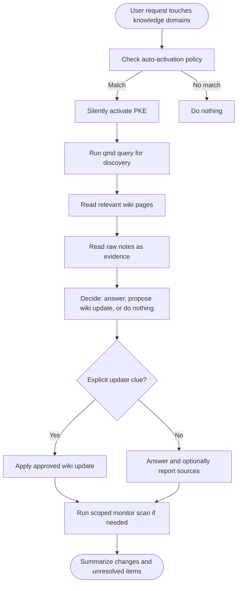
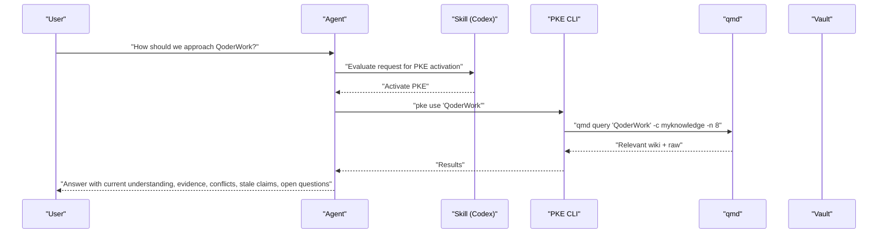
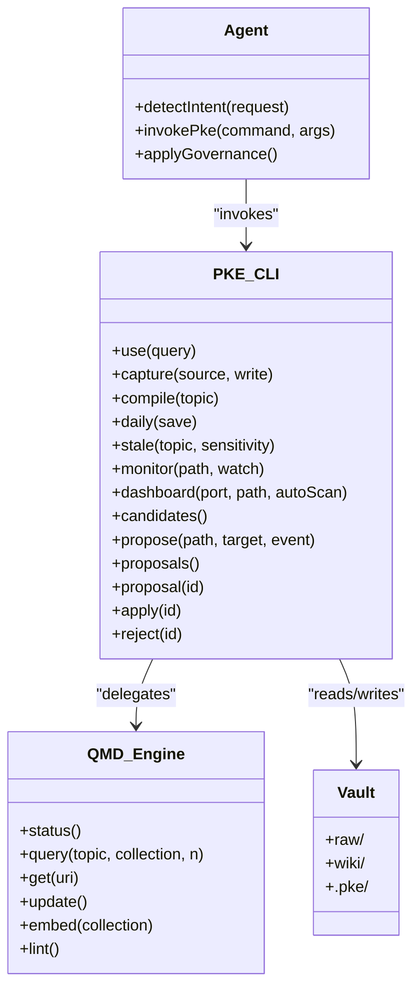
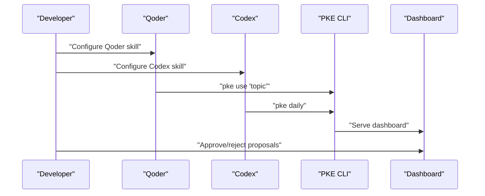
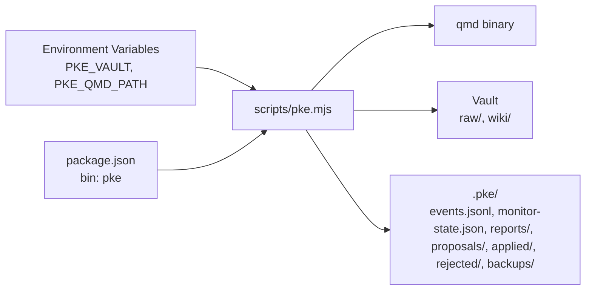

# Agent Integration

<cite>
**Referenced Files in This Document**
- [README.md](file://README.md)
- [package.json](file://package.json)
- [scripts/pke.mjs](file://scripts/pke.mjs)
- [integrations/qoder/AGENTS.md](file://integrations/qoder/AGENTS.md)
- [integrations/qoder/personal-knowledge-engine/SKILL.md](file://integrations/qoder/personal-knowledge-engine/SKILL.md)
- [skills/personal-knowledge-engine.SKILL.md](file://skills/personal-knowledge-engine.SKILL.md)
- [docs/agent-workflow.md](file://docs/agent-workflow.md)
- [docs/prd.md](file://docs/prd.md)
- [docs/implementation-notes.md](file://docs/implementation-notes.md)
- [docs/implementation-backlog.md](file://docs/implementation-backlog.md)
</cite>

## Table of Contents
1. [Introduction](#introduction)
2. [Project Structure](#project-structure)
3. [Core Components](#core-components)
4. [Architecture Overview](#architecture-overview)
5. [Detailed Component Analysis](#detailed-component-analysis)
6. [Dependency Analysis](#dependency-analysis)
7. [Performance Considerations](#performance-considerations)
8. [Troubleshooting Guide](#troubleshooting-guide)
9. [Conclusion](#conclusion)
10. [Appendices](#appendices)

## Introduction
This document explains how to integrate the Personal Knowledge Engine (PKE) as an agent capability for external AI assistants. It covers the Qoder agent workflow and skill configuration, the agent skill interface, auto-activation policies, and integration patterns with external tools. It also details the Codex skill instructions for automatic PKE usage, how agents can interact with the knowledge management system, setup instructions for agent platforms, best practices, troubleshooting, security considerations, rate limiting, and performance optimization.

## Project Structure
The repository organizes agent integration materials under dedicated directories and files:
- Agent instructions and skills:
  - Qoder integration: [integrations/qoder/AGENTS.md](file://integrations/qoder/AGENTS.md), [integrations/qoder/personal-knowledge-engine/SKILL.md](file://integrations/qoder/personal-knowledge-engine/SKILL.md)
  - Codex skill: [skills/personal-knowledge-engine.SKILL.md](file://skills/personal-knowledge-engine.SKILL.md)
- Agent workflow specification: [docs/agent-workflow.md](file://docs/agent-workflow.md)
- CLI and engine internals: [scripts/pke.mjs](file://scripts/pke.mjs)
- Product requirements and architecture: [docs/prd.md](file://docs/prd.md)
- Implementation notes and backlog: [docs/implementation-notes.md](file://docs/implementation-notes.md), [docs/implementation-backlog.md](file://docs/implementation-backlog.md)
- Package metadata: [package.json](file://package.json)

**Diagram sources**
- [scripts/pke.mjs](file://scripts/pke.mjs)
- [package.json](file://package.json)
- [integrations/qoder/AGENTS.md](file://integrations/qoder/AGENTS.md)
- [integrations/qoder/personal-knowledge-engine/SKILL.md](file://integrations/qoder/personal-knowledge-engine/SKILL.md)
- [skills/personal-knowledge-engine.SKILL.md](file://skills/personal-knowledge-engine.SKILL.md)
- [docs/agent-workflow.md](file://docs/agent-workflow.md)
- [docs/prd.md](file://docs/prd.md)
- [docs/implementation-notes.md](file://docs/implementation-notes.md)
- [docs/implementation-backlog.md](file://docs/implementation-backlog.md)

**Section sources**
- [README.md](file://README.md)
- [package.json](file://package.json)

## Core Components
- Agent skill configuration for Qoder and Codex:
  - Qoder skill definition and auto-use rules: [integrations/qoder/personal-knowledge-engine/SKILL.md](file://integrations/qoder/personal-knowledge-engine/SKILL.md)
  - Codex skill instructions for automatic PKE use: [skills/personal-knowledge-engine.SKILL.md](file://skills/personal-knowledge-engine.SKILL.md)
- Agent workflow specification:
  - Agent contract, modes, update governance, and common commands: [docs/agent-workflow.md](file://docs/agent-workflow.md)
- PKE CLI and engine:
  - Retrieval, capture, compile, monitor, dashboard, and proposal lifecycle: [scripts/pke.mjs](file://scripts/pke.mjs)
- Product requirements and architecture:
  - Data model, vault layout, and system architecture: [docs/prd.md](file://docs/prd.md)
- Implementation notes and backlog:
  - Defaults, safety model, expected workflow, and roadmap: [docs/implementation-notes.md](file://docs/implementation-notes.md), [docs/implementation-backlog.md](file://docs/implementation-backlog.md)

**Section sources**
- [integrations/qoder/personal-knowledge-engine/SKILL.md](file://integrations/qoder/personal-knowledge-engine/SKILL.md)
- [skills/personal-knowledge-engine.SKILL.md](file://skills/personal-knowledge-engine.SKILL.md)
- [docs/agent-workflow.md](file://docs/agent-workflow.md)
- [scripts/pke.mjs](file://scripts/pke.mjs)
- [docs/prd.md](file://docs/prd.md)
- [docs/implementation-notes.md](file://docs/implementation-notes.md)
- [docs/implementation-backlog.md](file://docs/implementation-backlog.md)

## Architecture Overview
The agent integration relies on the PKE CLI to orchestrate retrieval, capture, compile, and monitoring. Agents trigger PKE commands based on user intent and context, while PKE enforces strict governance to prevent silent wiki writes.

**Diagram sources**
- [scripts/pke.mjs](file://scripts/pke.mjs)
- [docs/prd.md](file://docs/prd.md)

## Detailed Component Analysis

### Qoder Agent Integration
- Purpose: Automatically engage PKE when working with knowledge domains such as QoderWork, product/business strategy, wiki pages, raw notes, stale/conflicting knowledge, or reusable synthesis.
- Auto-activation policy:
  - Trigger conditions include mentions of notes, wiki, memory, knowledge base, QoderWork, AI/LLM strategy, product thinking, enterprise AI, SaaS, connectors, or agent workflows.
  - Do not require the user to explicitly say “Use my Personal Knowledge Engine”; operate quietly and only mention activation when useful.
- Local system and commands:
  - Vault, wiki, raw notes locations, PKE CLI path, and qmd collection are defined for the Qoder skill.
  - Use qmd query for discovery and monitor for post-editing scans.
- Governance:
  - Raw files are evidence and rarely edited.
  - Wiki files are synthesized knowledge; updates require explicit user intent or approval.
  - Report changes, conflicts, stale claims, and unresolved items.

**Diagram sources**
- [integrations/qoder/AGENTS.md](file://integrations/qoder/AGENTS.md)
- [integrations/qoder/personal-knowledge-engine/SKILL.md](file://integrations/qoder/personal-knowledge-engine/SKILL.md)
- [docs/agent-workflow.md](file://docs/agent-workflow.md)

**Section sources**
- [integrations/qoder/AGENTS.md](file://integrations/qoder/AGENTS.md)
- [integrations/qoder/personal-knowledge-engine/SKILL.md](file://integrations/qoder/personal-knowledge-engine/SKILL.md)
- [docs/agent-workflow.md](file://docs/agent-workflow.md)

### Codex Skill Instructions
- Auto-activation policy:
  - Trigger when the user asks about notes, wiki, memory, knowledge base, QoderWork, AI/LLM strategy, product thinking, enterprise AI, SaaS, connectors, agent workflows, decisions with past thinking, stale assumptions, or knowledge upgrades.
  - Do not require explicit activation; operate quietly and only mention activation when useful.
- Mission and governance:
  - Operate as a compounding knowledge system: treat raw notes as evidence, wiki as synthesized knowledge, and separate current understanding, evidence, conflicts, stale claims, and open questions.
- Modes:
  - Research, Upgrade, Ingest, Decision, Staleness Review, Daily Compilation, Knowledge Monitor, Self-Improvement.
- Update rules:
  - Propose wiki updates for durable knowledge; do not write without a definite update clue.
- Page standard:
  - Use the 7-section template with YAML front matter.

**Diagram sources**
- [skills/personal-knowledge-engine.SKILL.md](file://skills/personal-knowledge-engine.SKILL.md)
- [scripts/pke.mjs](file://scripts/pke.mjs)

**Section sources**
- [skills/personal-knowledge-engine.SKILL.md](file://skills/personal-knowledge-engine.SKILL.md)
- [scripts/pke.mjs](file://scripts/pke.mjs)

### Agent Skill Interface and Auto-Activation
- Interface:
  - Agents call PKE commands based on detected intent:
    - Retrieval: `pke use "question"`
    - Capture evidence: `pke capture <path> [--write]`
    - Compile plan: `pke compile "topic"`
    - Daily compilation: `pke daily [--save]`
    - Staleness review: `pke stale "topic" [--sensitivity low|medium|high]`
    - Monitor: `pke monitor [--path <vault-relative>] [--watch]`
    - Dashboard: `pke dashboard [--port 8787] [--path <vault-relative>] [--auto-scan]`
    - Proposals: `pke candidates`, `pke propose`, `pke proposals`, `pke proposal <id>`, `pke apply <id>`, `pke reject <id>`
- Auto-activation:
  - Trigger on knowledge-domain topics; avoid generic coding or casual chat unless connected to the knowledge base.
  - Do not silently rewrite wiki pages; only propose or answer.

**Diagram sources**
- [scripts/pke.mjs](file://scripts/pke.mjs)
- [docs/prd.md](file://docs/prd.md)

**Section sources**
- [docs/agent-workflow.md](file://docs/agent-workflow.md)
- [scripts/pke.mjs](file://scripts/pke.mjs)

### Integration Patterns with External Tools
- Qoder:
  - Use qmd query for discovery and monitor for post-editing scans.
  - Respect governance: do not silently promote raw notes into wiki conclusions.
- Codex:
  - Follow the 7-section template and YAML front matter for wiki pages.
  - Use proposal-only compile and explicit approval for wiki updates.
- Browser dashboard:
  - Access via `pke dashboard` for live monitoring and proposal management.

**Diagram sources**
- [integrations/qoder/AGENTS.md](file://integrations/qoder/AGENTS.md)
- [integrations/qoder/personal-knowledge-engine/SKILL.md](file://integrations/qoder/personal-knowledge-engine/SKILL.md)
- [skills/personal-knowledge-engine.SKILL.md](file://skills/personal-knowledge-engine.SKILL.md)
- [scripts/pke.mjs](file://scripts/pke.mjs)

**Section sources**
- [integrations/qoder/AGENTS.md](file://integrations/qoder/AGENTS.md)
- [integrations/qoder/personal-knowledge-engine/SKILL.md](file://integrations/qoder/personal-knowledge-engine/SKILL.md)
- [skills/personal-knowledge-engine.SKILL.md](file://skills/personal-knowledge-engine.SKILL.md)
- [scripts/pke.mjs](file://scripts/pke.mjs)

## Dependency Analysis
- Environment and configuration:
  - PKE_VAULT, PKE_QMD_PATH environment variables control vault location and qmd runtime path.
  - Default values and overrides are defined in the CLI and implementation notes.
- CLI dependencies:
  - Node.js runtime, qmd binary, and local vault directories.
- Data dependencies:
  - events.jsonl, monitor-state.json, reports/, proposals/, applied/, rejected/, backups/ under .pke.

**Diagram sources**
- [package.json](file://package.json)
- [scripts/pke.mjs](file://scripts/pke.mjs)
- [docs/implementation-notes.md](file://docs/implementation-notes.md)

**Section sources**
- [package.json](file://package.json)
- [scripts/pke.mjs](file://scripts/pke.mjs)
- [docs/implementation-notes.md](file://docs/implementation-notes.md)

## Performance Considerations
- File scanning:
  - Vault scans are scoped when using `--path` to avoid watching unrelated files.
  - File size limit: 10 MB; larger files are skipped with warnings.
- Event logging:
  - Event log rotation caps at 100,000 entries; older events are archived.
  - Report retention: 90 days; older reports are archived.
- Proposal limits:
  - Pending proposals cap: 200; candidates cap: 100 with 30-day expiry.
  - Daily proposals rate-limited to 5 per run.
- Dashboard:
  - Lightweight HTTP server serving metrics and proposal controls; supports auto-scan on refresh for a scoped path.

**Section sources**
- [scripts/pke.mjs](file://scripts/pke.mjs)
- [docs/implementation-backlog.md](file://docs/implementation-backlog.md)
- [docs/implementation-notes.md](file://docs/implementation-notes.md)

## Troubleshooting Guide
- qmd connectivity:
  - Use `pke status` to verify qmd status and collection.
- Missing or invalid commands:
  - Use `pke help` to list all commands and options.
- Permission and governance:
  - Wiki writes are proposal-only; ensure explicit approval via `pke apply`.
- Monitor scope errors:
  - Watch mode requires a vault-relative path; ensure path is inside the configured vault.
- Oversized files:
  - Files > 10 MB are skipped; reduce file size or split content.
- Proposal caps:
  - If pending proposals exceed 200, review and act on older proposals.
- Dashboard issues:
  - Ensure port is free; use `--auto-scan` with a scoped path to enable automatic refresh.

**Section sources**
- [scripts/pke.mjs](file://scripts/pke.mjs)
- [docs/implementation-notes.md](file://docs/implementation-notes.md)
- [docs/implementation-backlog.md](file://docs/implementation-backlog.md)

## Conclusion
The Personal Knowledge Engine provides a governed, proposal-only knowledge system that agents can integrate seamlessly. Qoder and Codex skills define clear auto-activation policies and integration patterns, while the PKE CLI enforces strict governance and performance safeguards. By following the documented workflows and best practices, agents can augment user knowledge without polluting the knowledge base.

## Appendices

### Setup Instructions for Agent Platforms
- Qoder:
  - Configure the Qoder skill with the defined auto-use rules and local system paths.
  - Use qmd query and monitor commands after editing knowledge files.
- Codex:
  - Configure the Codex skill with the provided instructions.
  - Follow the 7-section template and YAML front matter for wiki pages.
- General:
  - Ensure Node.js and qmd are installed and discoverable in PATH.
  - Set PKE_VAULT and PKE_QMD_PATH as needed.

**Section sources**
- [integrations/qoder/AGENTS.md](file://integrations/qoder/AGENTS.md)
- [integrations/qoder/personal-knowledge-engine/SKILL.md](file://integrations/qoder/personal-knowledge-engine/SKILL.md)
- [skills/personal-knowledge-engine.SKILL.md](file://skills/personal-knowledge-engine.SKILL.md)
- [docs/implementation-notes.md](file://docs/implementation-notes.md)

### Security Considerations
- Proposal-only writes: Wiki updates require explicit approval; no silent writes occur.
- Audit trail: All proposal changes are archived with backups and qmd refresh attempts recorded.
- Safe sections: Append-only patch operations target Evidence, Open Questions, Conflicts / Evolution, and Stale Or Risky Claims.

**Section sources**
- [scripts/pke.mjs](file://scripts/pke.mjs)
- [docs/prd.md](file://docs/prd.md)

### Rate Limiting and Optimization
- Daily proposal cap: 5 per run.
- Pending proposals cap: 200; candidates cap: 100 with 30-day expiry.
- Event log rotation: 100,000 events; report retention: 90 days.
- File size limit: 10 MB; oversized files skipped with warnings.
- Scoped monitoring: Prefer `--path` to avoid unnecessary scanning.

**Section sources**
- [scripts/pke.mjs](file://scripts/pke.mjs)
- [docs/implementation-backlog.md](file://docs/implementation-backlog.md)
- [docs/implementation-notes.md](file://docs/implementation-notes.md)