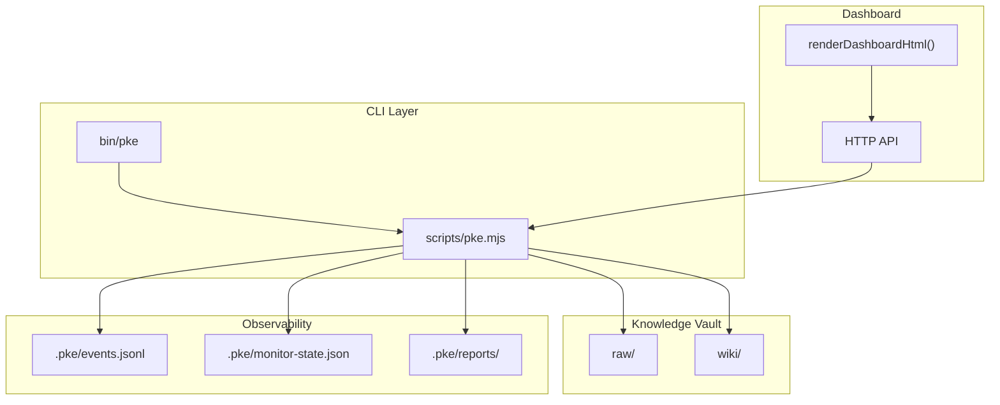
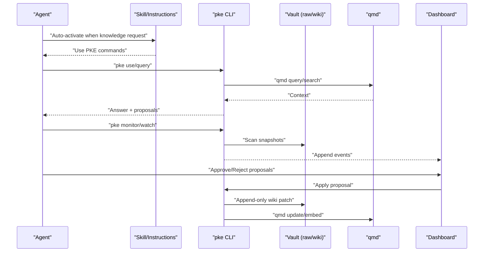
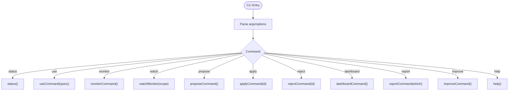
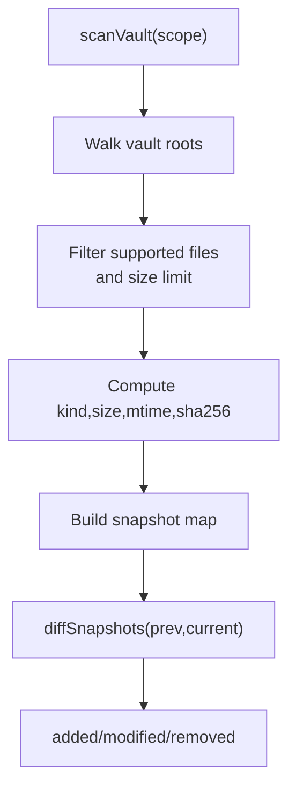
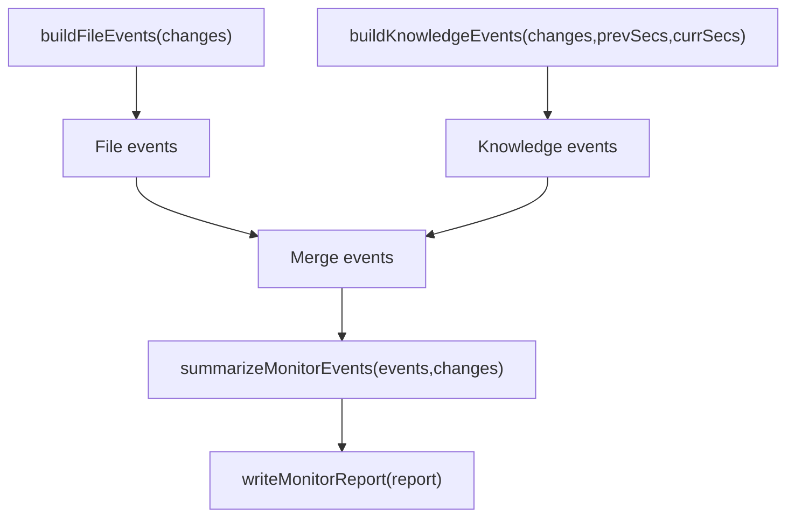
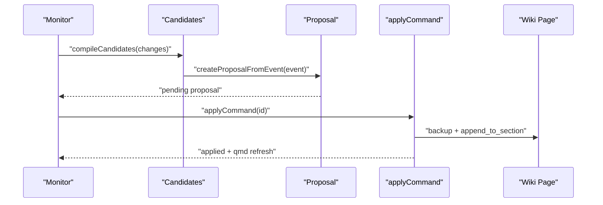
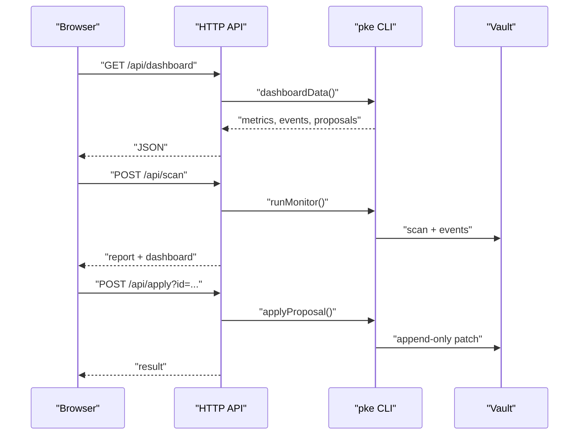
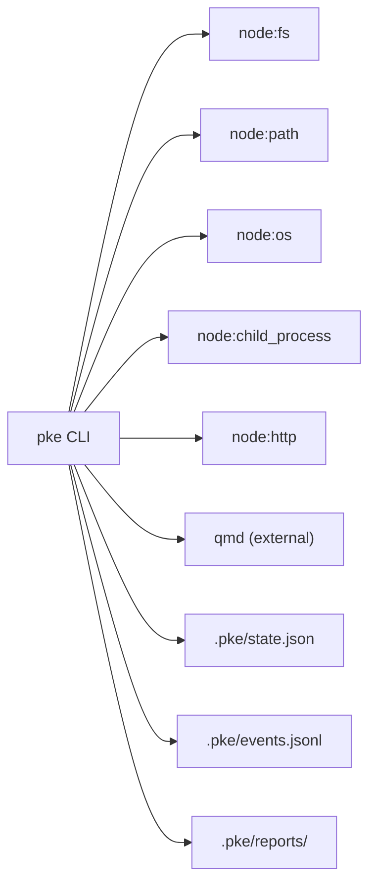
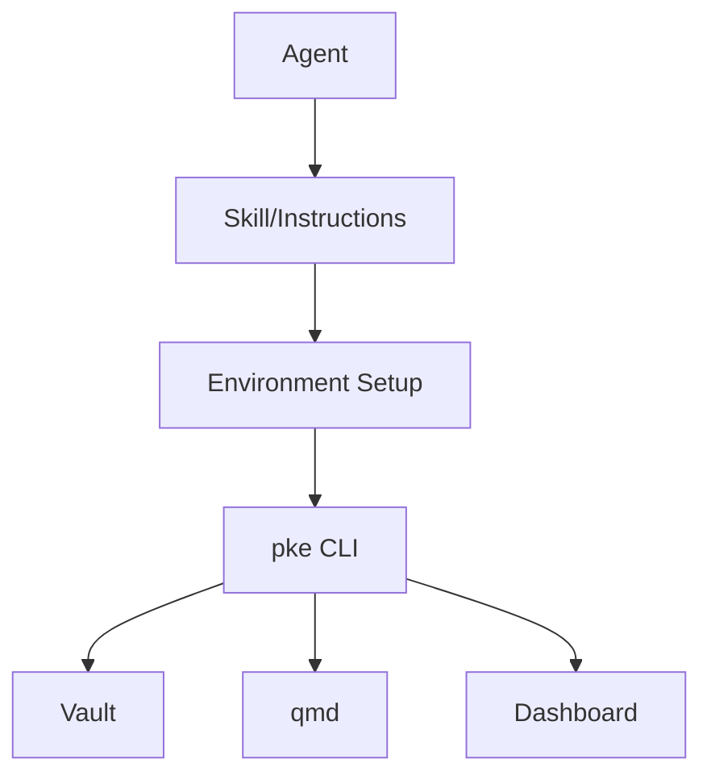

# Integration Best Practices

<cite>
**Referenced Files in This Document**
- [README.md](file://README.md)
- [agent-workflow.md](file://docs/agent-workflow.md)
- [AGENTS.md](file://integrations/qoder/AGENTS.md)
- [SKILL.md](file://integrations/qoder/personal-knowledge-engine/SKILL.md)
- [personal-knowledge-engine.SKILL.md](file://skills/personal-knowledge-engine.SKILL.md)
- [package.json](file://package.json)
- [pke.mjs](file://scripts/pke.mjs)
- [pke](file://bin/pke)
</cite>

## Table of Contents
1. [Introduction](#introduction)
2. [Project Structure](#project-structure)
3. [Core Components](#core-components)
4. [Architecture Overview](#architecture-overview)
5. [Detailed Component Analysis](#detailed-component-analysis)
6. [Dependency Analysis](#dependency-analysis)
7. [Performance Considerations](#performance-considerations)
8. [Security Considerations](#security-considerations)
9. [Rate Limiting and Optimization Strategies](#rate-limiting-and-optimization-strategies)
10. [Integration Patterns for Agent Platforms](#integration-patterns-for-agent-platforms)
11. [Monitoring and Logging Best Practices](#monitoring-and-logging-best-practices)
12. [Troubleshooting Guide](#troubleshooting-guide)
13. [Scalability and Cost Optimization](#scalability-and-cost-optimization)
14. [Testing and Validation Guidelines](#testing-and-validation-guidelines)
15. [Conclusion](#conclusion)

## Introduction
This document consolidates integration best practices and optimization strategies for agent-assisted workflows built on the Personal Knowledge Engine (PKE). It covers governance, security, rate limiting, performance optimization, platform integration patterns, monitoring/logging/alerting, troubleshooting, scalability, and testing. The guidance is grounded in the repository’s documented workflows, CLI implementation, and dashboard architecture.

## Project Structure
The repository organizes knowledge workflows around a local-first vault with raw evidence and curated wiki pages, a CLI for agent-assisted operations, and a dashboard for observability. Key elements:
- CLI entrypoint and routing
- Vault scanning and change detection
- Knowledge event modeling and reporting
- Proposal-driven self-improvement
- Dashboard for real-time monitoring and approvals

**Diagram sources**
- [pke.mjs:1-120](file://scripts/pke.mjs#L1-L120)
- [pke.mjs:674-736](file://scripts/pke.mjs#L674-L736)
- [pke.mjs:1735-1918](file://scripts/pke.mjs#L1735-L1918)

**Section sources**
- [README.md:1-211](file://README.md#L1-L211)
- [package.json:1-18](file://package.json#L1-L18)
- [pke.mjs:1-120](file://scripts/pke.mjs#L1-L120)

## Core Components
- CLI and Commands: Centralized command routing, option parsing, and environment configuration.
- Vault Scanner: Recursive traversal of raw and wiki directories with file filtering and checksumming.
- Change Detection: Snapshot comparison to compute added/modified/removed files.
- Knowledge Event Model: Structured events derived from file and section changes.
- Proposal Engine: Proposal creation, confidence adjustment, and application with backups.
- Dashboard: Real-time monitoring, event filtering, and proposal lifecycle controls.
- Governance: Append-only wiki updates, explicit approval gating, and staged self-improvement.

**Section sources**
- [pke.mjs:48-97](file://scripts/pke.mjs#L48-L97)
- [pke.mjs:824-875](file://scripts/pke.mjs#L824-L875)
- [pke.mjs:902-918](file://scripts/pke.mjs#L902-L918)
- [pke.mjs:1313-1377](file://scripts/pke.mjs#L1313-L1377)
- [pke.mjs:1454-1481](file://scripts/pke.mjs#L1454-L1481)
- [pke.mjs:1603-1633](file://scripts/pke.mjs#L1603-L1633)
- [pke.mjs:1667-1733](file://scripts/pke.mjs#L1667-L1733)

## Architecture Overview
The agent-assisted workflow integrates with external agents through:
- Skill-based auto-activation rules
- Platform-specific instructions and environment setup
- CLI commands invoked by agents to query, monitor, and propose wiki updates
- Dashboard for human-in-the-loop approvals and real-time inspection

**Diagram sources**
- [personal-knowledge-engine.SKILL.md:1-229](file://skills/personal-knowledge-engine.SKILL.md#L1-L229)
- [AGENTS.md:1-33](file://integrations/qoder/AGENTS.md#L1-L33)
- [pke.mjs:189-194](file://scripts/pke.mjs#L189-L194)
- [pke.mjs:738-785](file://scripts/pke.mjs#L738-L785)
- [pke.mjs:1603-1633](file://scripts/pke.mjs#L1603-L1633)

## Detailed Component Analysis

### CLI and Command Routing
- Centralized command dispatch with help, status, and operational commands.
- Environment variables for vault and qmd path.
- Options parsing for JSON output, scoping, and flags.

**Diagram sources**
- [pke.mjs:48-97](file://scripts/pke.mjs#L48-L97)
- [pke.mjs:1199-1214](file://scripts/pke.mjs#L1199-L1214)

**Section sources**
- [pke.mjs:48-157](file://scripts/pke.mjs#L48-L157)
- [pke.mjs:1199-1214](file://scripts/pke.mjs#L1199-L1214)

### Vault Scanning and Change Detection
- Recursively walks raw and wiki directories, filters supported files, computes SHA-256, and enforces file size limits.
- Computes diffs between snapshots to derive added/modified/removed lists.

**Diagram sources**
- [pke.mjs:824-875](file://scripts/pke.mjs#L824-L875)
- [pke.mjs:902-918](file://scripts/pke.mjs#L902-L918)

**Section sources**
- [pke.mjs:824-875](file://scripts/pke.mjs#L824-L875)
- [pke.mjs:902-918](file://scripts/pke.mjs#L902-L918)

### Knowledge Event Modeling and Reporting
- Builds file events from snapshot diffs and knowledge events from section-level changes.
- Summarizes events into counts and categories for reports and dashboards.

**Diagram sources**
- [pke.mjs:1313-1377](file://scripts/pke.mjs#L1313-L1377)
- [pke.mjs:1379-1388](file://scripts/pke.mjs#L1379-L1388)
- [pke.mjs:1930-1936](file://scripts/pke.mjs#L1930-L1936)

**Section sources**
- [pke.mjs:1313-1377](file://scripts/pke.mjs#L1313-L1377)
- [pke.mjs:1379-1388](file://scripts/pke.mjs#L1379-L1388)
- [pke.mjs:1930-1936](file://scripts/pke.mjs#L1930-L1936)

### Proposal Engine and Self-Improvement
- Generates proposals from events, adjusts confidence based on historical acceptance rates, and applies append-only patches with backups.
- Supports batch-safe approvals for high-confidence, append-only operations.

**Diagram sources**
- [pke.mjs:1153-1168](file://scripts/pke.mjs#L1153-L1168)
- [pke.mjs:1454-1481](file://scripts/pke.mjs#L1454-L1481)
- [pke.mjs:1603-1633](file://scripts/pke.mjs#L1603-L1633)

**Section sources**
- [pke.mjs:1153-1168](file://scripts/pke.mjs#L1153-L1168)
- [pke.mjs:1454-1481](file://scripts/pke.mjs#L1454-L1481)
- [pke.mjs:1603-1633](file://scripts/pke.mjs#L1603-L1633)

### Dashboard and Human-in-the-Loop Controls
- HTTP server exposing APIs for dashboard data, scanning, proposal creation, and approvals.
- Renders HTML with client-side controls to filter events and manage proposals.

**Diagram sources**
- [pke.mjs:674-736](file://scripts/pke.mjs#L674-L736)
- [pke.mjs:1667-1733](file://scripts/pke.mjs#L1667-L1733)
- [pke.mjs:1735-1918](file://scripts/pke.mjs#L1735-L1918)

**Section sources**
- [pke.mjs:674-736](file://scripts/pke.mjs#L674-L736)
- [pke.mjs:1667-1733](file://scripts/pke.mjs#L1667-L1733)
- [pke.mjs:1735-1918](file://scripts/pke.mjs#L1735-L1918)

## Dependency Analysis
- CLI depends on Node.js built-ins and spawns qmd for retrieval.
- Dashboard is embedded in the CLI server and serves static HTML with dynamic JSON endpoints.
- Governance and safety constraints are enforced in-memory and on disk via state and event logs.

**Diagram sources**
- [pke.mjs:1-8](file://scripts/pke.mjs#L1-L8)
- [pke.mjs:812-822](file://scripts/pke.mjs#L812-L822)

**Section sources**
- [pke.mjs:1-8](file://scripts/pke.mjs#L1-L8)
- [pke.mjs:812-822](file://scripts/pke.mjs#L812-L822)

## Performance Considerations
- File size limits: Skip files larger than 10 MB to prevent excessive processing.
- Scoped polling: Watch mode uses configurable intervals and scopes to reduce overhead.
- Event rotation: Cap event log size and archive older entries to control storage growth.
- Report retention: Archive reports older than 90 days to bound long-term storage.
- Batch-safe approvals: Fast-path for high-confidence, append-only proposals reduces latency and risk.

**Section sources**
- [pke.mjs:825-840](file://scripts/pke.mjs#L825-L840)
- [pke.mjs:800-810](file://scripts/pke.mjs#L800-L810)
- [pke.mjs:1396-1410](file://scripts/pke.mjs#L1396-L1410)
- [pke.mjs:1947-1961](file://scripts/pke.mjs#L1947-L1961)
- [pke.mjs:612-660](file://scripts/pke.mjs#L612-L660)

## Security Considerations
- Path scoping: Monitor watch requires a vault-relative path and validates scope to prevent traversal.
- Append-only patches: Wiki updates are restricted to append operations in designated sections.
- Backups: Automatic backup of target pages before applying proposals.
- Approval gating: Wiki writes require explicit user approval or scheduled workflows.

**Section sources**
- [pke.mjs:1268-1275](file://scripts/pke.mjs#L1268-L1275)
- [pke.mjs:1635-1641](file://scripts/pke.mjs#L1635-L1641)
- [pke.mjs:1643-1658](file://scripts/pke.mjs#L1643-L1658)
- [pke.mjs:1603-1633](file://scripts/pke.mjs#L1603-L1633)

## Rate Limiting and Optimization Strategies
- Daily proposal cap: Limit to 5 proposals per day to control write volume.
- Pending proposal cap: Warn when exceeding 200 pending proposals.
- Candidate caps and expiry: Limit candidates to 100 with 30-day expiry.
- Confidence adjustment: Adjust proposal confidence based on historical acceptance rates.
- Retrieval tuning: Proactively generate proposals to improve coverage for frequently accessed topics.

**Section sources**
- [pke.mjs:226-233](file://scripts/pke.mjs#L226-L233)
- [pke.mjs:1560-1567](file://scripts/pke.mjs#L1560-L1567)
- [pke.mjs:509-517](file://scripts/pke.mjs#L509-L517)
- [pke.mjs:924-980](file://scripts/pke.mjs#L924-L980)
- [pke.mjs:987-1059](file://scripts/pke.mjs#L987-L1059)

## Integration Patterns for Agent Platforms
- Qoder integration: Platform-specific instructions and environment setup for qmd.
- Skill-based activation: Auto-activation rules for knowledge-related requests.
- CLI invocation: Agents call pke commands for query, monitor, and proposal workflows.
- Environment configuration: Use PKE_VAULT and PKE_QMD_PATH to align with agent environments.

**Diagram sources**
- [AGENTS.md:1-33](file://integrations/qoder/AGENTS.md#L1-L33)
- [SKILL.md:1-59](file://integrations/qoder/personal-knowledge-engine/SKILL.md#L1-L59)
- [personal-knowledge-engine.SKILL.md:1-229](file://skills/personal-knowledge-engine.SKILL.md#L1-L229)
- [package.json:7-9](file://package.json#L7-L9)

**Section sources**
- [AGENTS.md:1-33](file://integrations/qoder/AGENTS.md#L1-L33)
- [SKILL.md:1-59](file://integrations/qoder/personal-knowledge-engine/SKILL.md#L1-L59)
- [personal-knowledge-engine.SKILL.md:1-229](file://skills/personal-knowledge-engine.SKILL.md#L1-L229)
- [package.json:7-9](file://package.json#L7-L9)

## Monitoring and Logging Best Practices
- Event logging: Append-only JSONL events with rotation to archive older entries.
- Report generation: Markdown reports with summaries and categorized findings.
- Dashboard: Real-time metrics, event filtering, and proposal management.
- Usage reports: Periodic analytics on events, proposals, and approval rates.

**Section sources**
- [pke.mjs:1390-1410](file://scripts/pke.mjs#L1390-L1410)
- [pke.mjs:1930-1936](file://scripts/pke.mjs#L1930-L1936)
- [pke.mjs:1667-1733](file://scripts/pke.mjs#L1667-L1733)
- [pke.mjs:1100-1138](file://scripts/pke.mjs#L1100-L1138)

## Troubleshooting Guide
Common issues and remedies:
- Oversized files: Skip files larger than 10 MB; consider splitting content.
- Watch path errors: Ensure --path is vault-relative and exists.
- Proposal not found: Verify proposal ID and status.
- Target page missing: Recreate proposal with --target or create the target page.
- qmd failures: Check qmd availability and PATH configuration.

**Section sources**
- [pke.mjs:838-840](file://scripts/pke.mjs#L838-L840)
- [pke.mjs:788-791](file://scripts/pke.mjs#L788-L791)
- [pke.mjs:1569-1573](file://scripts/pke.mjs#L1569-L1573)
- [pke.mjs:1607-1609](file://scripts/pke.mjs#L1607-L1609)
- [pke.mjs:812-822](file://scripts/pke.mjs#L812-L822)

## Scalability and Cost Optimization
- Scoped monitoring: Use --path to limit scan scope and polling intervals.
- Event and report retention: Archive and prune to control storage costs.
- Proposal caps: Enforce limits to prevent unbounded proposal queues.
- Batch-safe approvals: Automate safe, high-confidence updates to reduce manual workload.
- Resource management: Tune Node.js buffer sizes and child process limits for qmd.

**Section sources**
- [pke.mjs:787-810](file://scripts/pke.mjs#L787-L810)
- [pke.mjs:1396-1410](file://scripts/pke.mjs#L1396-L1410)
- [pke.mjs:1947-1961](file://scripts/pke.mjs#L1947-L1961)
- [pke.mjs:1560-1567](file://scripts/pke.mjs#L1560-L1567)
- [pke.mjs:812-822](file://scripts/pke.mjs#L812-L822)

## Testing and Validation Guidelines
- Smoke tests: Use npm script to validate CLI help and basic operations.
- Functional tests: Exercise commands (status, use, monitor, propose, apply, reject) with representative vault content.
- Governance checks: Verify that wiki writes occur only after explicit approval and that raw files remain append-only.
- Dashboard validation: Confirm event rendering, proposal filtering, and approval workflows.
- Regression checks: Monitor event log rotation and report archival behavior.

**Section sources**
- [package.json:10-12](file://package.json#L10-L12)
- [pke.mjs:159-187](file://scripts/pke.mjs#L159-L187)
- [pke.mjs:674-736](file://scripts/pke.mjs#L674-L736)

## Conclusion
The Personal Knowledge Engine provides a robust foundation for agent-assisted knowledge workflows with strong governance, observability, and safety controls. Integrators should focus on platform-specific environment setup, adherence to approval gates, and leveraging rate-limiting and batch-safe mechanisms to scale safely. The dashboard and reporting features enable continuous monitoring and iterative improvement of the knowledge system.