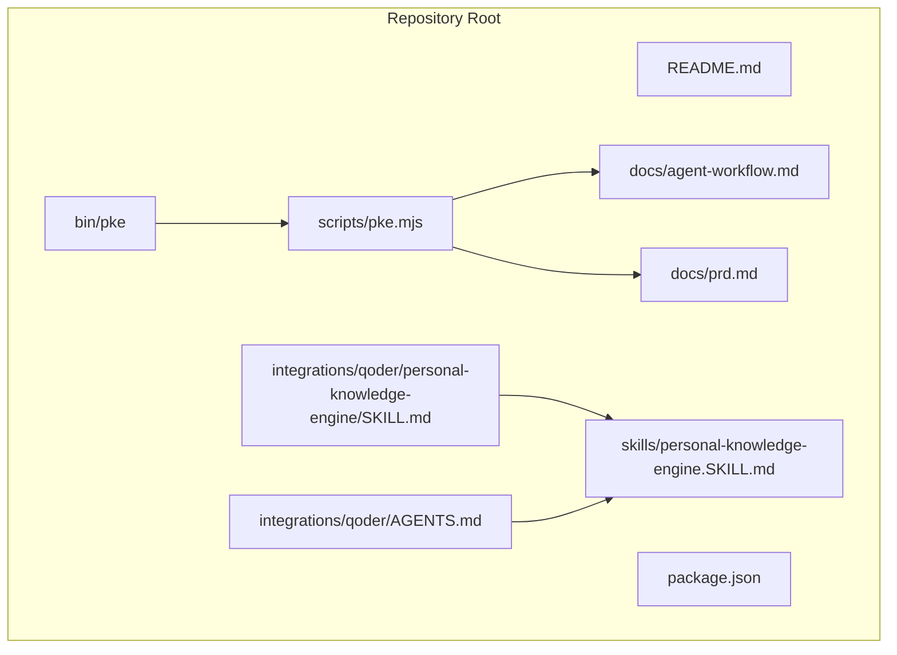
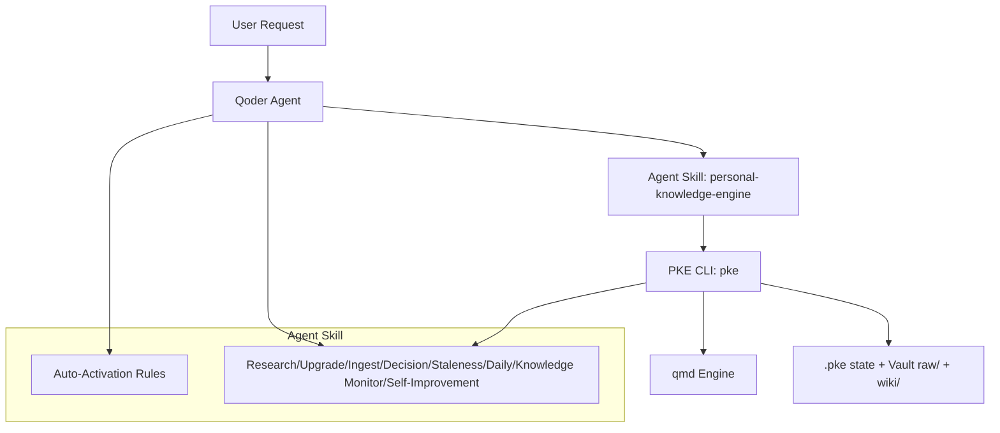
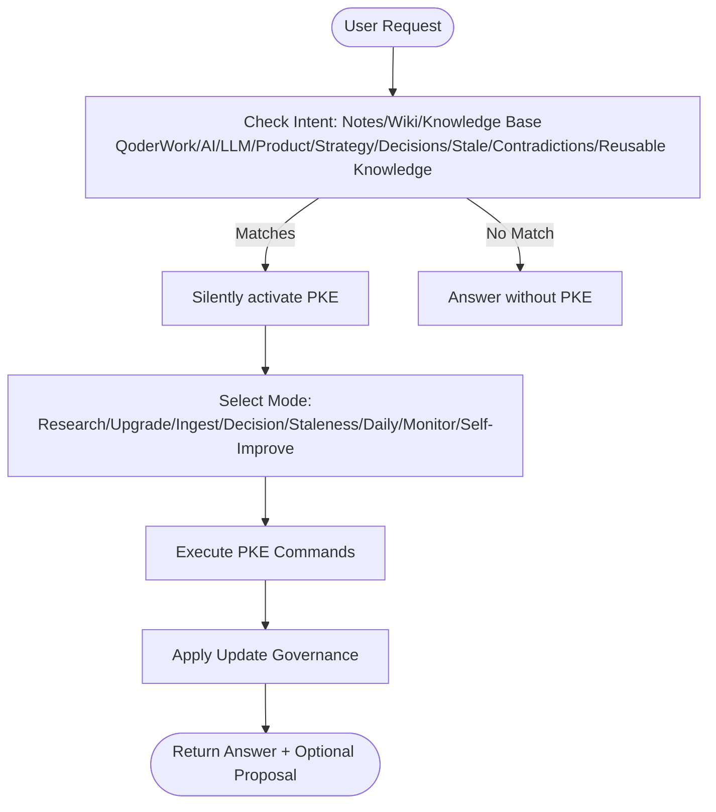
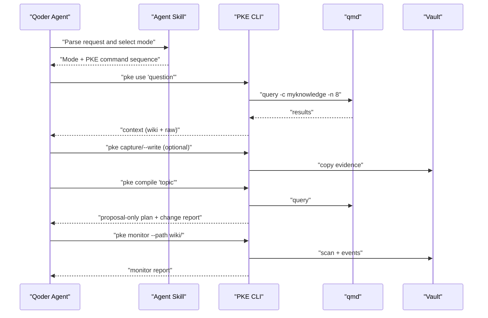
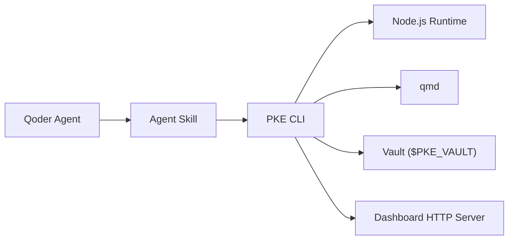

# Qoder Agent Workflow

<cite>
**Referenced Files in This Document**
- [README.md](file://README.md)
- [package.json](file://package.json)
- [bin/pke](file://bin/pke)
- [scripts/pke.mjs](file://scripts/pke.mjs)
- [docs/agent-workflow.md](file://docs/agent-workflow.md)
- [docs/prd.md](file://docs/prd.md)
- [integrations/qoder/AGENTS.md](file://integrations/qoder/AGENTS.md)
- [integrations/qoder/personal-knowledge-engine/SKILL.md](file://integrations/qoder/personal-knowledge-engine/SKILL.md)
- [skills/personal-knowledge-engine.SKILL.md](file://skills/personal-knowledge-engine.SKILL.md)
</cite>

## Table of Contents
1. [Introduction](#introduction)
2. [Project Structure](#project-structure)
3. [Core Components](#core-components)
4. [Architecture Overview](#architecture-overview)
5. [Detailed Component Analysis](#detailed-component-analysis)
6. [Dependency Analysis](#dependency-analysis)
7. [Performance Considerations](#performance-considerations)
8. [Troubleshooting Guide](#troubleshooting-guide)
9. [Conclusion](#conclusion)
10. [Appendices](#appendices)

## Introduction
This document explains how to integrate Qoder agents with the Personal Knowledge Engine (PKE) to form an automated, governed knowledge workflow. It covers the agent skill interface, auto-activation triggers, agent-initiated interactions with the vault, wiki, and raw notes, and the controlled self-improvement pipeline. It also documents configuration options, authentication requirements, and troubleshooting steps, along with performance and lifecycle guidance.

## Project Structure
The repository organizes PKE around a CLI, a set of workflows, and Qoder-specific integration assets:
- CLI entrypoint and runtime: bin/pke and scripts/pke.mjs
- Documentation: docs/agent-workflow.md and docs/prd.md
- Qoder integration: integrations/qoder/AGENTS.md and integrations/qoder/personal-knowledge-engine/SKILL.md
- Codex skill definition: skills/personal-knowledge-engine.SKILL.md
- Package metadata: package.json

**Diagram sources**
- [bin/pke](file://bin/pke)
- [scripts/pke.mjs](file://scripts/pke.mjs)
- [docs/agent-workflow.md](file://docs/agent-workflow.md)
- [docs/prd.md](file://docs/prd.md)
- [integrations/qoder/AGENTS.md](file://integrations/qoder/AGENTS.md)
- [integrations/qoder/personal-knowledge-engine/SKILL.md](file://integrations/qoder/personal-knowledge-engine/SKILL.md)
- [skills/personal-knowledge-engine.SKILL.md](file://skills/personal-knowledge-engine.SKILL.md)

**Section sources**
- [README.md](file://README.md)
- [package.json](file://package.json)

## Core Components
- PKE CLI (pke): Orchestrates retrieval, capture, compile, monitor, dashboard, and proposal lifecycle.
- Qoder Agent Skill: Defines when and how the agent uses PKE automatically, including triggers and modes.
- Knowledge Vault: Local storage under $PKE_VAULT with raw/ and wiki/ directories and .pke state.
- qmd integration: Semantic retrieval and indexing via MinerU Document Explorer.

Key capabilities:
- Automatic retrieval via pke use “question”
- Evidence capture via pke capture
- Proposal-only compile via pke compile and pke daily
- Knowledge monitor and dashboard via pke monitor and pke dashboard
- Controlled self-improvement via pke candidates, pke propose, pke proposals, pke proposal, pke apply, pke reject

**Section sources**
- [README.md](file://README.md)
- [docs/prd.md](file://docs/prd.md)
- [scripts/pke.mjs](file://scripts/pke.mjs)

## Architecture Overview
The agent workflow integrates Qoder’s request parsing and orchestration with PKE’s CLI and qmd. The agent decides when to activate PKE based on user intent and topic scope, then executes PKE commands to retrieve context, capture evidence, propose wiki updates, and monitor changes.

**Diagram sources**
- [skills/personal-knowledge-engine.SKILL.md](file://skills/personal-knowledge-engine.SKILL.md)
- [docs/agent-workflow.md](file://docs/agent-workflow.md)
- [scripts/pke.mjs](file://scripts/pke.mjs)

## Detailed Component Analysis

### Agent Skill Interface and Auto-Activation
- Auto-activation triggers: The agent activates PKE automatically when the request involves notes, wiki, knowledge base, QoderWork, AI/LLM strategy, product/business thinking, decisions, stale assumptions, contradictions, or reusable knowledge. The agent should remain silent about activation unless useful.
- Modes: The skill defines Research, Upgrade, Ingest, Decision, Staleness Review, Daily Compilation, Knowledge Monitor, and Self-Improvement modes. Each mode prescribes a deterministic sequence of PKE commands and governance rules.

**Diagram sources**
- [skills/personal-knowledge-engine.SKILL.md](file://skills/personal-knowledge-engine.SKILL.md)
- [docs/agent-workflow.md](file://docs/agent-workflow.md)

**Section sources**
- [skills/personal-knowledge-engine.SKILL.md](file://skills/personal-knowledge-engine.SKILL.md)
- [docs/agent-workflow.md](file://docs/agent-workflow.md)

### Agent-Initiated Interactions with Vault, Wiki, and Raw Notes
- Retrieval-first: The agent uses pke use “question” to query qmd for relevant wiki and raw content, prioritizing wiki for current understanding and surfacing conflicts.
- Evidence capture: The agent can trigger pke capture to preserve new sources as immutable evidence.
- Compile proposals: The agent can run pke compile to propose wiki updates and pke daily to review changed files and generate candidates.
- Monitor and dashboard: The agent can run pke monitor and pke dashboard to observe changes and manage proposals.

**Diagram sources**
- [scripts/pke.mjs](file://scripts/pke.mjs)
- [docs/prd.md](file://docs/prd.md)

**Section sources**
- [scripts/pke.mjs](file://scripts/pke.mjs)
- [docs/prd.md](file://docs/prd.md)

### Integration Patterns for Different Qoder Configurations
- Skill loading: The Codex skill personal-knowledge-engine defines the agent behavior and triggers. Ensure the skill is loaded in the Qoder environment.
- Agent initialization: Configure the agent to route knowledge-related queries to PKE. The agent should auto-activate on QoderWork, product/business strategy, wiki pages, raw notes, stale/conflicting knowledge, or reusable synthesis.
- Workflow automation:
  - Research mode: pke use + pke compile
  - Upgrade mode: pke propose + pke apply
  - Ingest mode: pke capture + pke propose
  - Decision mode: pke compile + pke apply
  - Staleness review: pke stale
  - Daily compilation: pke daily + pke candidates + pke propose + pke apply
  - Knowledge monitor: pke monitor + pke dashboard

**Section sources**
- [integrations/qoder/personal-knowledge-engine/SKILL.md](file://integrations/qoder/personal-knowledge-engine/SKILL.md)
- [skills/personal-knowledge-engine.SKILL.md](file://skills/personal-knowledge-engine.SKILL.md)
- [docs/agent-workflow.md](file://docs/agent-workflow.md)

### Practical Examples of Agent Interactions
- Vault: The agent can run scoped monitor scans after editing wiki or raw files to keep the knowledge base synchronized.
- Wiki: The agent proposes wiki updates only when there is a definite update clue; it separates current understanding, evidence, conflicts, stale/risky claims, and open questions.
- Raw notes: The agent treats raw notes as evidence and avoids rewriting them except for mechanical repairs or append-only processing notes.

**Section sources**
- [integrations/qoder/AGENTS.md](file://integrations/qoder/AGENTS.md)
- [skills/personal-knowledge-engine.SKILL.md](file://skills/personal-knowledge-engine.SKILL.md)

### Qoder-Specific Configuration Options
- Environment variables:
  - PKE_VAULT: Knowledge vault root (default: ~/MyKnowledge)
  - PKE_QMD_PATH: Directory containing qmd binary (default: /opt/homebrew/bin)
- CLI options:
  - --vault <path>, --collection <name>, --state <path>, --path <path>, --json, --save, --write, --watch, --port <number>, --auto-scan, --target <path>, --apply, --batch-safe
- Paths:
  - Vault: $PKE_VAULT/raw and $PKE_VAULT/wiki
  - State: $PKE_VAULT/.pke/state.json
  - Monitor state: $PKE_VAULT/.pke/monitor-state.json
  - Events: $PKE_VAULT/.pke/events.jsonl
  - Reports: $PKE_VAULT/.pke/reports/

**Section sources**
- [scripts/pke.mjs](file://scripts/pke.mjs)
- [docs/prd.md](file://docs/prd.md)

### Authentication Requirements
- The PKE CLI does not require credentials; it operates on local files and relies on qmd for retrieval and indexing.
- Ensure qmd is installed and reachable via PATH or PKE_QMD_PATH.

**Section sources**
- [README.md](file://README.md)
- [scripts/pke.mjs](file://scripts/pke.mjs)

### Troubleshooting Common Integration Issues
- qmd failures: The CLI wraps qmd and surfaces stderr; verify qmd connectivity and collection name.
- Missing vault paths: Ensure $PKE_VAULT/raw and $PKE_VAULT/wiki exist and are readable/writable.
- Monitor path errors: Watch mode requires a vault-relative path; ensure the path is inside the vault.
- Proposal errors: Only pending proposals can be applied; ensure the target page exists and the proposal has patch operations.
- Oversized files: Files larger than 10 MB are skipped; reduce file size or split content.

**Section sources**
- [scripts/pke.mjs](file://scripts/pke.mjs)
- [docs/prd.md](file://docs/prd.md)

## Dependency Analysis
- Agent skill depends on the PKE CLI and qmd.
- PKE CLI depends on Node.js runtime, qmd, and the vault layout.
- The dashboard is an HTTP service that calls PKE CLI endpoints.

**Diagram sources**
- [scripts/pke.mjs](file://scripts/pke.mjs)
- [package.json](file://package.json)

**Section sources**
- [package.json](file://package.json)
- [scripts/pke.mjs](file://scripts/pke.mjs)

## Performance Considerations
- Prefer scoped monitoring: Use pke monitor --path to limit scan scope and reduce overhead.
- Batch-safe approvals: Use pke apply --batch-safe for safe append-only proposals to accelerate approvals.
- Limit proposal volume: The CLI caps pending proposals and candidates to avoid overload.
- Use dashboards for visibility: The dashboard aggregates events and proposals for efficient triage.

[No sources needed since this section provides general guidance]

## Troubleshooting Guide
- Verify qmd status: Run pke status to confirm qmd connectivity and collection presence.
- Inspect events: Use pke events to review recent knowledge events and their types.
- Review reports: Use pke report latest|today to read monitor reports.
- Dashboard diagnostics: Use pke dashboard to visualize events, proposals, and reports.

**Section sources**
- [scripts/pke.mjs](file://scripts/pke.mjs)
- [docs/prd.md](file://docs/prd.md)

## Conclusion
Integrating Qoder agents with PKE enables an automatic, governed knowledge workflow. The agent auto-activates on knowledge-related requests, executes PKE commands to retrieve, capture, propose, and monitor knowledge, and enforces strict update governance. By leveraging the CLI’s modes, scoped monitoring, and dashboard, teams can maintain a healthy, evolving knowledge base while preserving the distinction between evidence and knowledge.

[No sources needed since this section summarizes without analyzing specific files]

## Appendices

### Appendix A: Agent Modes and Commands
- Research: pke use, pke compile
- Upgrade: pke propose, pke apply
- Ingest: pke capture, pke propose
- Decision: pke compile, pke apply
- Staleness: pke stale
- Daily: pke daily, pke candidates, pke propose, pke apply
- Monitor: pke monitor, pke dashboard

**Section sources**
- [docs/agent-workflow.md](file://docs/agent-workflow.md)
- [docs/prd.md](file://docs/prd.md)

### Appendix B: Environment and Paths
- PKE_VAULT: Vault root
- PKE_QMD_PATH: qmd binary path
- $PKE_VAULT/raw: Evidence
- $PKE_VAULT/wiki: Knowledge pages
- $PKE_VAULT/.pke: Engine state and artifacts

**Section sources**
- [scripts/pke.mjs](file://scripts/pke.mjs)
- [docs/prd.md](file://docs/prd.md)