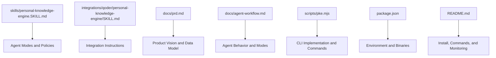
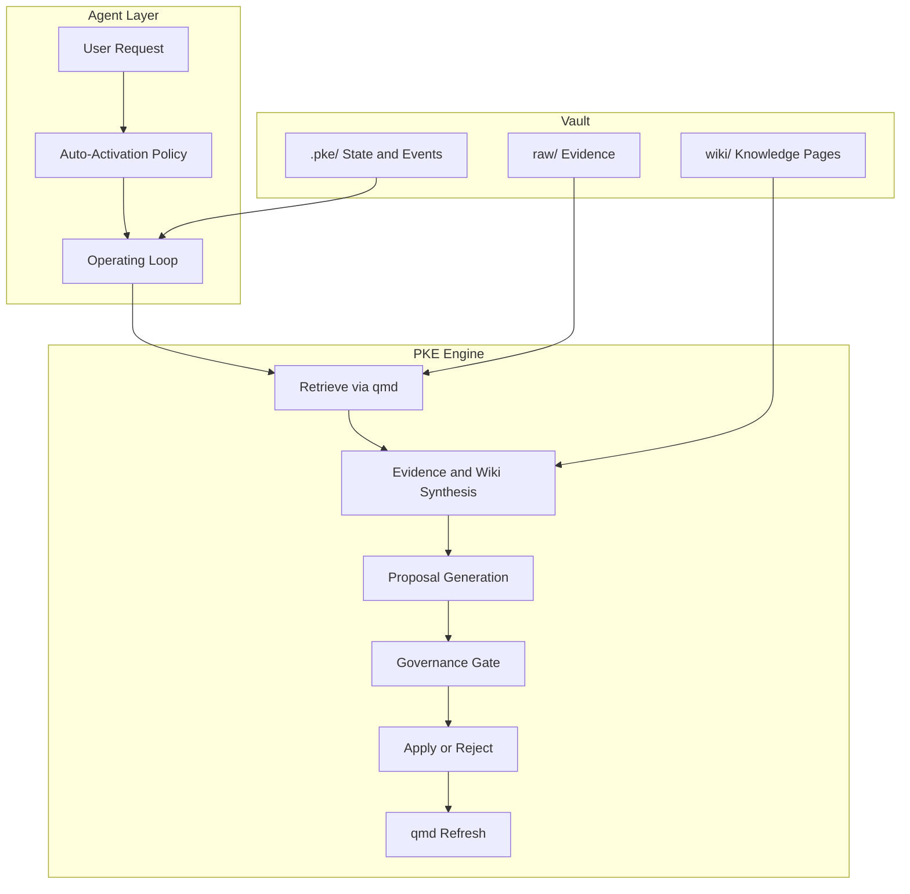
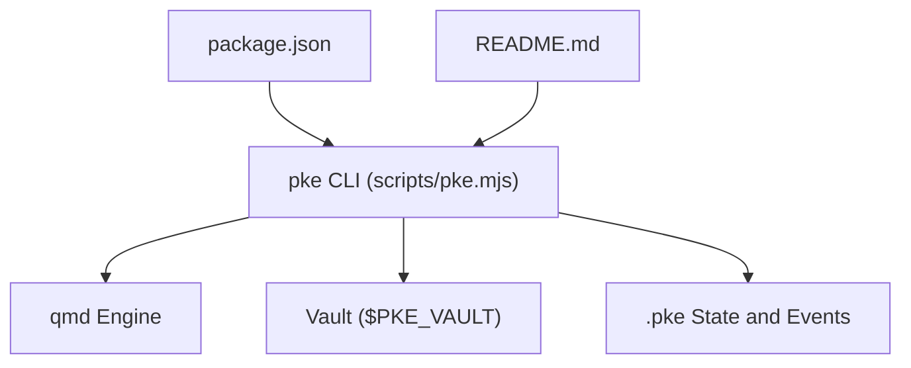

# Skill Configuration

<cite>
**Referenced Files in This Document**
- [README.md](file://README.md)
- [skills/personal-knowledge-engine.SKILL.md](file://skills/personal-knowledge-engine.SKILL.md)
- [integrations/qoder/personal-knowledge-engine/SKILL.md](file://integrations/qoder/personal-knowledge-engine/SKILL.md)
- [docs/prd.md](file://docs/prd.md)
- [docs/agent-workflow.md](file://docs/agent-workflow.md)
- [package.json](file://package.json)
- [scripts/pke.mjs](file://scripts/pke.mjs)
</cite>

## Table of Contents
1. [Introduction](#introduction)
2. [Project Structure](#project-structure)
3. [Core Components](#core-components)
4. [Architecture Overview](#architecture-overview)
5. [Detailed Component Analysis](#detailed-component-analysis)
6. [Dependency Analysis](#dependency-analysis)
7. [Performance Considerations](#performance-considerations)
8. [Troubleshooting Guide](#troubleshooting-guide)
9. [Conclusion](#conclusion)
10. [Appendices](#appendices)

## Introduction
This document provides comprehensive guidance for configuring and operating the Personal Knowledge Engine (PKE) skill. It explains the skill definition, auto-activation policy, operating loop, governance rules, and supported operational modes. It also covers configuration options, environment variables, system requirements, customization, parameter tuning, integration with agent platforms, and best practices for deployment, monitoring, and maintenance.

## Project Structure
The repository organizes the PKE skill around a local-first knowledge workflow with a CLI, a vault layout, and supporting documentation. The key elements are:
- Skill definition and mode specifications
- Agent workflow and governance rules
- CLI implementation and commands
- Documentation for PRD and agent workflows
- Package configuration and environment variables

**Diagram sources**
- [skills/personal-knowledge-engine.SKILL.md:1-229](file://skills/personal-knowledge-engine.SKILL.md#L1-L229)
- [integrations/qoder/personal-knowledge-engine/SKILL.md:1-59](file://integrations/qoder/personal-knowledge-engine/SKILL.md#L1-L59)
- [docs/prd.md:1-2353](file://docs/prd.md#L1-L2353)
- [docs/agent-workflow.md:1-295](file://docs/agent-workflow.md#L1-L295)
- [scripts/pke.mjs:1-2209](file://scripts/pke.mjs#L1-L2209)
- [package.json:1-18](file://package.json#L1-L18)
- [README.md:1-211](file://README.md#L1-L211)

**Section sources**
- [README.md:1-211](file://README.md#L1-L211)
- [skills/personal-knowledge-engine.SKILL.md:1-229](file://skills/personal-knowledge-engine.SKILL.md#L1-L229)
- [integrations/qoder/personal-knowledge-engine/SKILL.md:1-59](file://integrations/qoder/personal-knowledge-engine/SKILL.md#L1-L59)
- [docs/prd.md:1-2353](file://docs/prd.md#L1-L2353)
- [docs/agent-workflow.md:1-295](file://docs/agent-workflow.md#L1-L295)
- [package.json:1-18](file://package.json#L1-L18)
- [scripts/pke.mjs:1-2209](file://scripts/pke.mjs#L1-L2209)

## Core Components
- Skill definition and auto-activation policy: Defines when and how the skill is used automatically.
- Operating loop and governance: Establishes the read-query-evidence-separate-update cycle and update rules.
- Modes: Research, Upgrade, Ingest, Decision, Staleness Review, Daily Compilation, Knowledge Monitor, and Self-Improvement.
- CLI and environment: Provides commands, options, environment variables, and system requirements.
- Agent workflow: Documents behavior, triggers, and update governance for agent platforms.

**Section sources**
- [skills/personal-knowledge-engine.SKILL.md:8-81](file://skills/personal-knowledge-engine.SKILL.md#L8-L81)
- [docs/agent-workflow.md:54-91](file://docs/agent-workflow.md#L54-L91)
- [README.md:35-118](file://README.md#L35-L118)
- [package.json:1-18](file://package.json#L1-L18)

## Architecture Overview
The PKE skill orchestrates retrieval, evidence handling, and proposal-based compilation. The CLI coordinates with qmd for indexing and querying, maintains state and event logs, and exposes a dashboard for monitoring.

**Diagram sources**
- [skills/personal-knowledge-engine.SKILL.md:49-81](file://skills/personal-knowledge-engine.SKILL.md#L49-L81)
- [scripts/pke.mjs:812-822](file://scripts/pke.mjs#L812-L822)
- [docs/prd.md:698-731](file://docs/prd.md#L698-L731)

## Detailed Component Analysis

### Skill Definition and Auto-Activation Policy
- Auto-activation triggers when the request involves notes, wiki, knowledge base, QoderWork, AI/LLM strategy, product/business thinking, decisions, stale assumptions, contradictions, or reusable knowledge.
- The skill operates silently unless useful for transparency; it does not require explicit activation phrases.
- It avoids generic coding, casual chat, or unrelated tasks unless connected to the knowledge base.

**Section sources**
- [skills/personal-knowledge-engine.SKILL.md:8-22](file://skills/personal-knowledge-engine.SKILL.md#L8-L22)
- [docs/agent-workflow.md:54-59](file://docs/agent-workflow.md#L54-L59)

### Operating Loop and Mission
- Mission: Compound knowledge by keeping raw notes as evidence and wiki pages as synthesized, living knowledge.
- Operating loop steps:
  1. Read relevant wiki pages first when they exist.
  2. Use qmd query for discovery and qmd search for exact terms.
  3. Treat raw notes as evidence; do not treat them as final truth.
  4. Separate current understanding, evidence, conflicts, stale/risky claims, and open questions.
  5. Do not update wiki pages without a definite update clue.
  6. Run qmd update and qmd embed after approved wiki edits.
  7. Run qmd wiki lint when link structure matters.
  8. Summarize changes and unresolved items.
  9. Every compile run must include a change report.
  10. Use monitor reports/events when the user asks for changes inside the knowledge engine.

**Section sources**
- [skills/personal-knowledge-engine.SKILL.md:23-63](file://skills/personal-knowledge-engine.SKILL.md#L23-L63)
- [docs/agent-workflow.md:106-134](file://docs/agent-workflow.md#L106-L134)

### Governance Rules
- Raw files are evidence and should rarely be edited; only for ingestion, mechanical repair, or append-only processing notes.
- Wiki updates require a definite update clue: explicit user command, approval of a proposal, session close with permission, or scheduled review workflows.
- Without a definite update clue, answer normally and optionally propose updates; do not write to wiki.

**Section sources**
- [skills/personal-knowledge-engine.SKILL.md:64-80](file://skills/personal-knowledge-engine.SKILL.md#L64-L80)
- [docs/agent-workflow.md:71-91](file://docs/agent-workflow.md#L71-L91)

### Supported Modes

#### Research Mode
- Purpose: Default mode for topic questions touching the user’s knowledge domains.
- Steps:
  1. Query the topic.
  2. Read top wiki pages and source notes.
  3. Identify current thesis, evidence, conflicts, stale claims, open questions.
  4. Answer the user.
  5. Propose wiki updates if reusable knowledge was created; apply only with a definite update clue.

**Section sources**
- [skills/personal-knowledge-engine.SKILL.md:83-94](file://skills/personal-knowledge-engine.SKILL.md#L83-L94)
- [docs/agent-workflow.md:106-134](file://docs/agent-workflow.md#L106-L134)

#### Upgrade Mode
- Purpose: Improve thin or mechanical wiki pages into the knowledge page standard.
- Steps:
  1. Read the page.
  2. Find linked raw notes and related pages.
  3. Rewrite using the 7-section template.
  4. Preserve useful links.
  5. Mark weak evidence honestly.
  6. Reindex and re-embed after user approval.

**Section sources**
- [skills/personal-knowledge-engine.SKILL.md:95-107](file://skills/personal-knowledge-engine.SKILL.md#L95-L107)
- [docs/agent-workflow.md:135-165](file://docs/agent-workflow.md#L135-L165)

#### Ingest Mode
- Purpose: Add new notes, meetings, articles, transcripts, or ideas into the knowledge system.
- Steps:
  1. Classify the input.
  2. Extract durable claims, evidence, decisions, contradictions, stale facts, and open questions.
  3. Search for related wiki pages.
  4. Decide whether to update an existing page, create a new page, or leave as raw evidence.
  5. Update only when ingestion was requested or approved by the user.

**Section sources**
- [skills/personal-knowledge-engine.SKILL.md:108-119](file://skills/personal-knowledge-engine.SKILL.md#L108-L119)
- [docs/agent-workflow.md:166-192](file://docs/agent-workflow.md#L166-L192)

#### Decision Mode
- Purpose: Provide judgment, prioritization, and tradeoffs grounded in accumulated knowledge.
- Steps:
  1. Pull current thesis pages and raw evidence.
  2. Compare options.
  3. Separate known evidence, assumptions, risks, unknowns, and reversible decisions.
  4. Recommend a direction.
  5. Propose thesis-page updates if the decision becomes durable knowledge; apply only with a definite update clue.

**Section sources**
- [skills/personal-knowledge-engine.SKILL.md:120-131](file://skills/personal-knowledge-engine.SKILL.md#L120-L131)
- [docs/agent-workflow.md:193-220](file://docs/agent-workflow.md#L193-L220)

#### Staleness Review Mode
- Purpose: Keep the wiki honest by identifying outdated or risky claims.
- Steps:
  1. Find related pages.
  2. Review stale/risky claims.
  3. Mark outdated or unverified claims.
  4. Create verification questions.
  5. Update status/confidence only when explicitly requested or approved.

**Section sources**
- [skills/personal-knowledge-engine.SKILL.md:132-143](file://skills/personal-knowledge-engine.SKILL.md#L132-L143)
- [docs/agent-workflow.md:221-243](file://docs/agent-workflow.md#L221-L243)

#### Daily Compilation Mode
- Purpose: Periodic maintenance to promote durable insights and report changes.
- Steps:
  1. Find recently changed raw and wiki notes.
  2. Cluster by topic.
  3. Promote durable insights because daily compilation is an explicit update workflow.
  4. Leave one-off information alone.
  5. Report pages updated, stale claims found, and open questions.

**Section sources**
- [skills/personal-knowledge-engine.SKILL.md:144-155](file://skills/personal-knowledge-engine.SKILL.md#L144-L155)
- [docs/agent-workflow.md:244-266](file://docs/agent-workflow.md#L244-L266)

#### Knowledge Monitor Mode
- Purpose: Observe changes and report on knowledge-engine activity.
- Steps:
  1. Run pke monitor for a one-shot report, optionally scoped with --path.
  2. Run pke events to inspect append-only event history.
  3. Run pke report latest or pke report today for human-readable reports.
  4. Run pke dashboard when the user asks for a visual dashboard.
  5. For realtime monitoring, require pke monitor --watch --path <vault-relative-path>.
  6. Do not monitor the entire vault in watch mode.
  7. Treat monitor findings as observations; do not update wiki pages without a definite update clue.

**Section sources**
- [skills/personal-knowledge-engine.SKILL.md:156-169](file://skills/personal-knowledge-engine.SKILL.md#L156-L169)
- [README.md:128-184](file://README.md#L128-L184)

#### Self-Improvement Mode
- Purpose: Allow the engine to propose and apply controlled improvements.
- Steps:
  1. Use pke candidates to inspect monitor events that can trigger compile proposals.
  2. Use pke propose --event <id> or pke propose --path <file> --target <wiki-page> to create an exact proposal.
  3. Use pke proposal <id> to show the proposed patch.
  4. Use pke apply <id> only after user approval.
  5. Use pke reject <id> when the proposal should not be applied.
  6. After apply, inspect the change report and qmd refresh result.
  7. Never silently rewrite wiki pages from raw evidence.

**Section sources**
- [skills/personal-knowledge-engine.SKILL.md:170-183](file://skills/personal-knowledge-engine.SKILL.md#L170-L183)
- [README.md:185-211](file://README.md#L185-L211)

### Update Rules and Page Standard
- Propose wiki updates when output contains durable thesis, reusable model, decision framework, changed belief, meaningful contradiction, stale/risky claim, or open question worth tracking.
- Do not update the wiki for one-off answers, transient command output, low-confidence speculation, or facts requiring current web verification unless marked as stale/risky.
- Even with durable content, do not write unless a definite update clue is present.
- Page standard includes seven sections: Current Understanding, Key Principles, Evidence, Conflicts / Evolution, Stale Or Risky Claims, Open Questions, and Related Pages. Use frontmatter with status, confidence, last_reviewed, page_type, engine_layer, and source_count.

**Section sources**
- [skills/personal-knowledge-engine.SKILL.md:184-229](file://skills/personal-knowledge-engine.SKILL.md#L184-L229)
- [docs/prd.md:456-507](file://docs/prd.md#L456-L507)

### CLI and Environment Configuration
- Binary: pke CLI is installed via package.json bin field.
- Environment variables:
  - PKE_VAULT: Knowledge vault root (default: ~/MyKnowledge)
  - PKE_QMD_PATH: Directory containing qmd binary (default: /opt/homebrew/bin)
- Options:
  - --vault <path>, --collection <name>, --state <path>
  - --path <path>, --json, --save, --usage, --write, --watch, --port <number>, --auto-scan, --target <path>, --apply, --batch-safe
- Commands include status, use, changed, daily, learn, capture, compile, close-session, stale, monitor, events, report, dashboard, candidates, propose, proposals, proposal, apply, reject, improve.

**Section sources**
- [package.json:7-17](file://package.json#L7-L17)
- [scripts/pke.mjs:9-30](file://scripts/pke.mjs#L9-L30)
- [scripts/pke.mjs:99-157](file://scripts/pke.mjs#L99-L157)
- [README.md:56-80](file://README.md#L56-L80)

### Integration with Agent Platforms
- Codex skill: Automatic activation and operating loop are documented in the skill definition.
- Qoder integration: Describes local system paths, qmd usage, auto-use rules, and work loop.
- Agent workflow: Specifies triggers, behavior, and governance for agent platforms.

**Section sources**
- [skills/personal-knowledge-engine.SKILL.md:1-42](file://skills/personal-knowledge-engine.SKILL.md#L1-L42)
- [integrations/qoder/personal-knowledge-engine/SKILL.md:1-59](file://integrations/qoder/personal-knowledge-engine/SKILL.md#L1-L59)
- [docs/agent-workflow.md:46-91](file://docs/agent-workflow.md#L46-L91)

## Dependency Analysis
The PKE CLI depends on:
- qmd for indexing, querying, embedding, and linting.
- Vault directories (raw/, wiki/, .pke/) for state and event persistence.
- Node.js runtime and optional npm link for development.

**Diagram sources**
- [scripts/pke.mjs:812-822](file://scripts/pke.mjs#L812-L822)
- [package.json:7-17](file://package.json#L7-L17)
- [README.md:35-55](file://README.md#L35-L55)

**Section sources**
- [scripts/pke.mjs:812-822](file://scripts/pke.mjs#L812-L822)
- [package.json:7-17](file://package.json#L7-L17)
- [README.md:35-55](file://README.md#L35-L55)

## Performance Considerations
- File size limits: Files larger than 10 MB are skipped to prevent excessive processing.
- Event retention: Up to 100,000 events retained; older ones are archived.
- Proposal caps: Maximum 200 pending proposals; candidates capped at 100 with 30-day expiry.
- Daily proposal rate limiting: Maximum 5 proposals per day to reduce noise.
- Report retention: Reports older than 90 days are archived.
- Dashboard auto-scan: Optional auto-scan mode for specific paths to reduce polling overhead.

**Section sources**
- [scripts/pke.mjs:824-875](file://scripts/pke.mjs#L824-L875)
- [scripts/pke.mjs:1396-1410](file://scripts/pke.mjs#L1396-L1410)
- [scripts/pke.mjs:1559-1567](file://scripts/pke.mjs#L1559-L1567)
- [scripts/pke.mjs:508-547](file://scripts/pke.mjs#L508-L547)
- [scripts/pke.mjs:1947-1961](file://scripts/pke.mjs#L1947-L1961)

## Troubleshooting Guide
- qmd failures: The CLI wraps qmd calls and surfaces stderr/stdout; ensure PKE_QMD_PATH points to a valid qmd binary.
- Missing vault or paths: Verify PKE_VAULT and scoped paths remain inside the vault; watch mode requires a valid --path.
- Oversized files: Files exceeding 10 MB are skipped with warnings; reduce file size or split content.
- Event log rotation: Exceeding 100,000 events triggers rotation; check archived events if needed.
- Proposal limits: If pending proposals exceed 200, review and act on older proposals.
- Dashboard scanning: Use --auto-scan with a scoped path to enable automatic refresh on browser refresh.

**Section sources**
- [scripts/pke.mjs:812-822](file://scripts/pke.mjs#L812-L822)
- [scripts/pke.mjs:1268-1275](file://scripts/pke.mjs#L1268-L1275)
- [scripts/pke.mjs:824-875](file://scripts/pke.mjs#L824-L875)
- [scripts/pke.mjs:1396-1410](file://scripts/pke.mjs#L1396-L1410)
- [scripts/pke.mjs:1559-1567](file://scripts/pke.mjs#L1559-L1567)
- [README.md:171-184](file://README.md#L171-L184)

## Conclusion
The Personal Knowledge Engine skill provides a robust, governed workflow for transforming raw notes into synthesized knowledge. Its modes, operating loop, and governance rules ensure that wiki updates are deliberate and auditable. The CLI, environment variables, and integration guidelines support flexible deployment across agent platforms while maintaining strict update gates and observability.

## Appendices

### System Requirements and Setup
- Requirements: Node.js, qmd from MinerU Document Explorer, a local vault with raw/ and wiki/ folders.
- Optional local link: npm link to install the pke binary globally.

**Section sources**
- [README.md:35-55](file://README.md#L35-L55)
- [package.json:13-15](file://package.json#L13-L15)

### Configuration Options and Environment Variables
- Environment variables:
  - PKE_VAULT: Vault root path (default: ~/MyKnowledge)
  - PKE_QMD_PATH: qmd binary directory (default: /opt/homebrew/bin)
- Global options:
  - --vault, --collection, --state
  - --path, --json, --save, --usage, --write, --watch, --port, --auto-scan, --target, --apply, --batch-safe

**Section sources**
- [scripts/pke.mjs:9-30](file://scripts/pke.mjs#L9-L30)
- [scripts/pke.mjs:1268-1275](file://scripts/pke.mjs#L1268-L1275)
- [scripts/pke.mjs:99-157](file://scripts/pke.mjs#L99-L157)

### Best Practices for Deployment, Monitoring, and Maintenance
- Deploy:
  - Ensure qmd is available via PKE_QMD_PATH.
  - Initialize the vault with raw/ and wiki/ directories.
  - Use npm link for development or install globally as needed.
- Monitor:
  - Use pke monitor for one-shot scans and pke monitor --watch --path for scoped realtime monitoring.
  - Use pke dashboard for a browser-based view; enable --auto-scan for specific paths.
  - Inspect pke events and pke report for historical context.
- Maintain:
  - Run pke daily to review changed files and generate compile candidates.
  - Use pke candidates and pke propose to create precise, append-only patches.
  - Apply only after user approval; track backups and qmd refresh outcomes.
  - Enforce governance: do not update wiki without a definite update clue.

**Section sources**
- [README.md:56-80](file://README.md#L56-L80)
- [README.md:128-184](file://README.md#L128-L184)
- [README.md:185-211](file://README.md#L185-L211)
- [skills/personal-knowledge-engine.SKILL.md:64-80](file://skills/personal-knowledge-engine.SKILL.md#L64-L80)