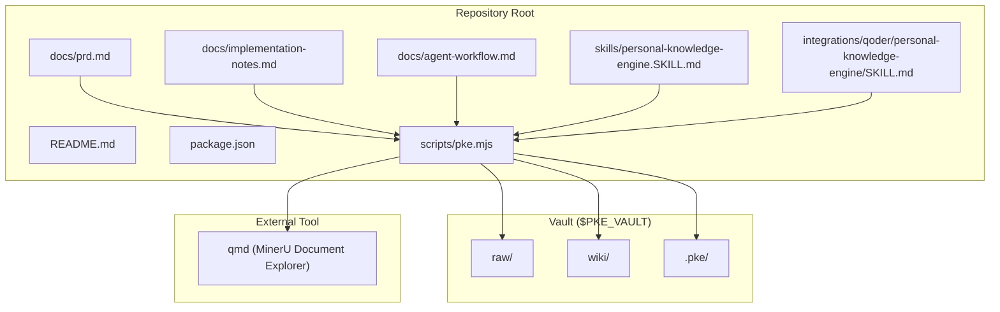
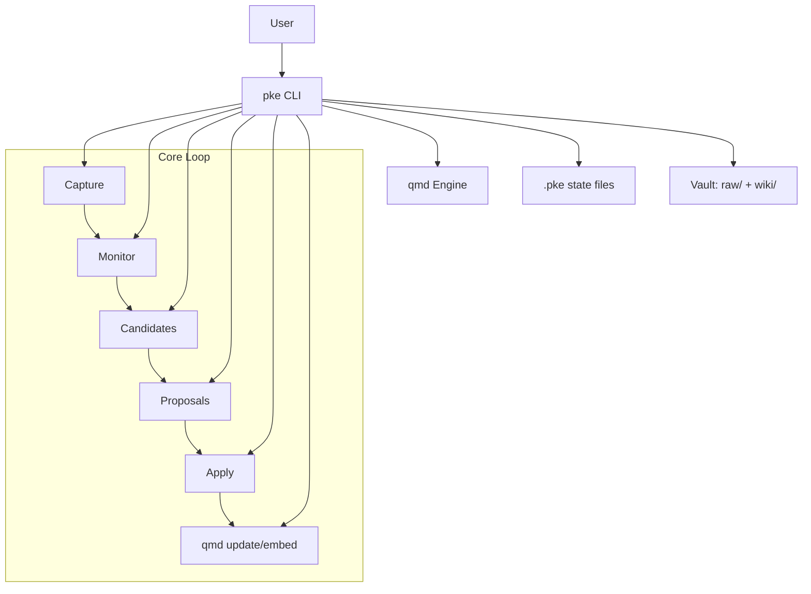
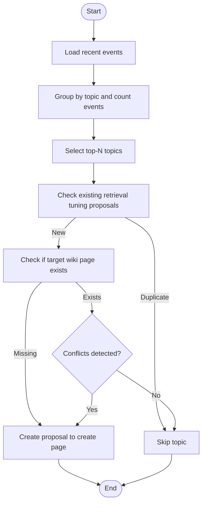
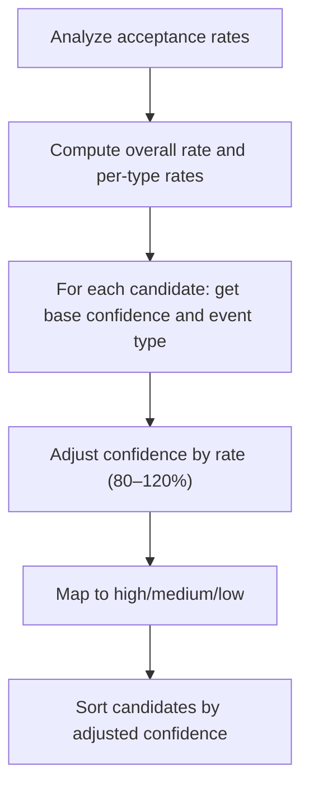
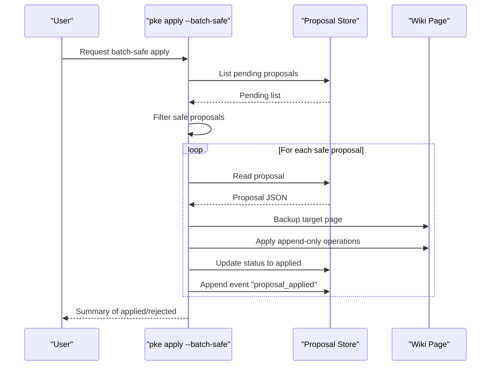
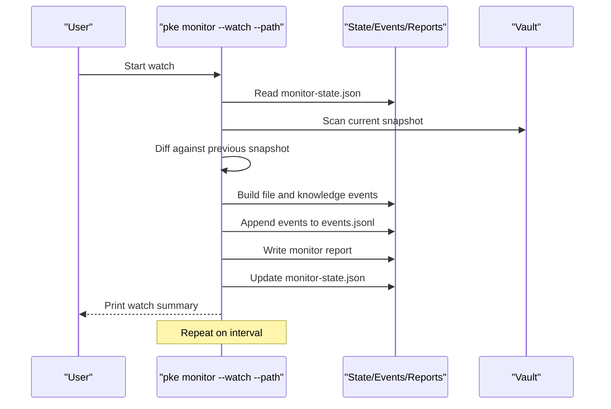
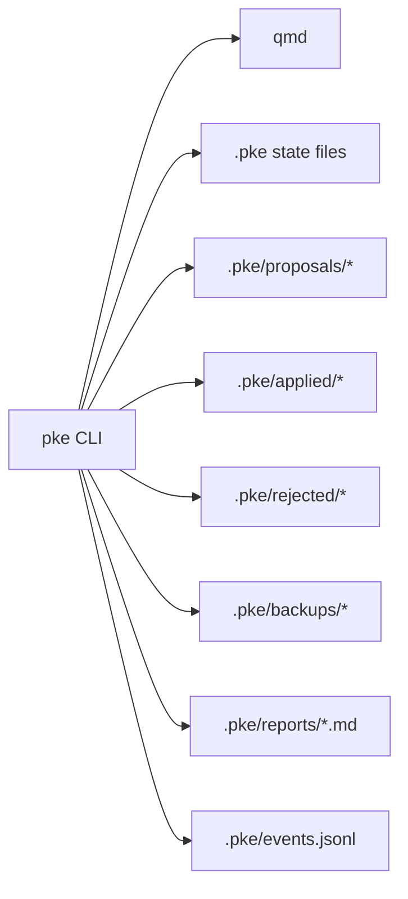

# Advanced Operations

<cite>
**Referenced Files in This Document**
- [README.md](file://README.md)
- [package.json](file://package.json)
- [scripts/pke.mjs](file://scripts/pke.mjs)
- [docs/prd.md](file://docs/prd.md)
- [docs/implementation-notes.md](file://docs/implementation-notes.md)
- [docs/agent-workflow.md](file://docs/agent-workflow.md)
- [skills/personal-knowledge-engine.SKILL.md](file://skills/personal-knowledge-engine.SKILL.md)
- [integrations/qoder/personal-knowledge-engine/SKILL.md](file://integrations/qoder/personal-knowledge-engine/SKILL.md)
</cite>

## Table of Contents
1. [Introduction](#introduction)
2. [Project Structure](#project-structure)
3. [Core Components](#core-components)
4. [Architecture Overview](#architecture-overview)
5. [Detailed Component Analysis](#detailed-component-analysis)
6. [Dependency Analysis](#dependency-analysis)
7. [Performance Considerations](#performance-considerations)
8. [Troubleshooting Guide](#troubleshooting-guide)
9. [Conclusion](#conclusion)
10. [Appendices](#appendices)

## Introduction
This document explains advanced operations for the Personal Knowledge Engine (PKE) MVP, focusing on:
- Self-improvement algorithms and retrieval tuning
- Confidence adjustment using historical acceptance rates
- Bulk operations and batch approval workflows
- Advanced monitoring: realtime watching, scoped file filtering, and custom reporting
- Performance tuning, memory management, and integration with the qmd semantic search engine

The goal is to help experienced users optimize search performance, implement custom proposal generators, and extend the system with domain-specific knowledge templates while maintaining strict governance and auditability.

## Project Structure
The PKE MVP centers on a small CLI (pke) that orchestrates local vault scanning, semantic retrieval via qmd, event logging, proposal generation, and controlled wiki updates. Supporting materials include:
- CLI implementation and command handlers
- Documentation for PRD, implementation notes, and agent workflows
- Skill definitions for integration with agents and tools
- Scripts and binaries for local execution

**Diagram sources**
- [scripts/pke.mjs:1-120](file://scripts/pke.mjs#L1-L120)
- [docs/prd.md:428-452](file://docs/prd.md#L428-L452)

**Section sources**
- [README.md:1-211](file://README.md#L1-L211)
- [package.json:1-18](file://package.json#L1-L18)
- [docs/prd.md:428-452](file://docs/prd.md#L428-L452)

## Core Components
- CLI and command handlers: orchestrate vault scanning, semantic retrieval, event detection, proposal lifecycle, and dashboard.
- Knowledge monitor: detects file-level and knowledge-level events and persists them to JSONL and markdown reports.
- Proposal engine: builds append-only patch operations and gates wiki writes behind user approval.
- Dashboard: provides a browser UI for monitoring, proposal review, and batch operations.
- qmd integration: semantic search, indexing, embedding, and linting.

Key advanced capabilities:
- Self-improvement via retrieval tuning proposals
- Confidence adjustment by historical acceptance rates
- Batch-safe approvals for safe append-only proposals
- Realtime monitoring with scoped polling
- Custom reporting and usage analytics

**Section sources**
- [scripts/pke.mjs:48-97](file://scripts/pke.mjs#L48-L97)
- [scripts/pke.mjs:508-547](file://scripts/pke.mjs#L508-L547)
- [scripts/pke.mjs:981-1092](file://scripts/pke.mjs#L981-L1092)
- [scripts/pke.mjs:1603-1633](file://scripts/pke.mjs#L1603-L1633)
- [scripts/pke.mjs:1667-1733](file://scripts/pke.mjs#L1667-L1733)
- [scripts/pke.mjs:738-810](file://scripts/pke.mjs#L738-L810)
- [scripts/pke.mjs:1100-1138](file://scripts/pke.mjs#L1100-L1138)

## Architecture Overview
The system follows a local-first, approval-gated loop:
- Capture evidence into raw/
- Use qmd for retrieval
- Monitor changes and detect knowledge events
- Generate proposals with append-only patches
- Apply only after explicit approval
- Refresh qmd index and embeddings

**Diagram sources**
- [docs/prd.md:698-730](file://docs/prd.md#L698-L730)
- [scripts/pke.mjs:738-810](file://scripts/pke.mjs#L738-L810)
- [scripts/pke.mjs:1603-1633](file://scripts/pke.mjs#L1603-L1633)

## Detailed Component Analysis

### Self-Improvement and Retrieval Tuning
The system can propose wiki page creation or improvements to enhance retrieval coverage. The retrieval tuning generator:
- Scans recent events to identify topics with high frequency and missing or low-quality wiki pages
- Generates proposals with confidence “medium” and a structured reason
- Prevents duplicates by checking existing retrieval tuning proposals
- Supports optional automatic application via the improve command

**Diagram sources**
- [scripts/pke.mjs:987-1059](file://scripts/pke.mjs#L987-L1059)

**Section sources**
- [scripts/pke.mjs:981-1092](file://scripts/pke.mjs#L981-L1092)
- [docs/prd.md:190-200](file://docs/prd.md#L190-L200)

### Confidence Adjustment System
The confidence adjustment system improves candidate prioritization by incorporating historical acceptance rates:
- Analyzes all proposals to compute overall and per-event-type acceptance rates
- Adjusts base confidence (high/medium/low) into an adjusted confidence score
- Sorts candidates by adjusted confidence (highest first)

**Diagram sources**
- [scripts/pke.mjs:924-980](file://scripts/pke.mjs#L924-L980)
- [scripts/pke.mjs:508-547](file://scripts/pke.mjs#L508-L547)

**Section sources**
- [scripts/pke.mjs:924-980](file://scripts/pke.mjs#L924-L980)
- [scripts/pke.mjs:508-547](file://scripts/pke.mjs#L508-L547)

### Bulk Operations and Batch Approval
The system supports safe batch approval for proposals that meet strict criteria:
- Eligibility: proposal must be pending, have confidence “high”, and only target safe sections (Evidence, Open Questions, Related Pages) with append-only operations
- Batch-safe mode: applies all eligible proposals in one pass, logs each application, and continues despite individual failures
- Manual approval: apply a single proposal with full safety checks

**Diagram sources**
- [scripts/pke.mjs:612-660](file://scripts/pke.mjs#L612-L660)
- [scripts/pke.mjs:1603-1633](file://scripts/pke.mjs#L1603-L1633)

**Section sources**
- [scripts/pke.mjs:602-660](file://scripts/pke.mjs#L602-L660)
- [scripts/pke.mjs:1603-1633](file://scripts/pke.mjs#L1603-L1633)

### Advanced Monitoring: Realtime Watching, Scoped Filtering, and Custom Reporting
- Realtime watching: monitors a scoped path with polling, printing summaries on activity
- Scoped filtering: ensures out-of-scope files are not reported as removed during scoped scans
- Custom reporting: generates usage reports with topic-level activity, acceptance rates, and compile velocity

**Diagram sources**
- [scripts/pke.mjs:738-810](file://scripts/pke.mjs#L738-L810)
- [scripts/pke.mjs:1390-1410](file://scripts/pke.mjs#L1390-L1410)

**Section sources**
- [scripts/pke.mjs:738-810](file://scripts/pke.mjs#L738-L810)
- [scripts/pke.mjs:1100-1138](file://scripts/pke.mjs#L1100-L1138)
- [docs/implementation-notes.md:50-72](file://docs/implementation-notes.md#L50-L72)

### Optimizing Search Performance
- Use qmd query with appropriate collection and result count
- Prefer wiki pages for current understanding; raw notes as evidence
- Periodically run qmd update and embed to refresh indices
- Scope monitor scans to reduce overhead during watch mode

Practical tips:
- Limit result count with the CLI’s query option
- Use dashboard auto-scan only on targeted paths
- Run qmd wiki lint to maintain link hygiene

**Section sources**
- [README.md:104-118](file://README.md#L104-L118)
- [docs/agent-workflow.md:94-104](file://docs/agent-workflow.md#L94-L104)
- [scripts/pke.mjs:1660-1665](file://scripts/pke.mjs#L1660-L1665)

### Implementing Custom Proposal Generators
The proposal pipeline is extensible:
- Build custom candidates from events or files
- Construct append-only patch operations targeting safe sections
- Persist proposals and gate application with user approval

Guidelines:
- Use safe sections: Evidence, Open Questions, Conflicts / Evolution, Stale Or Risky Claims, Current Understanding for conclusions
- Keep operations idempotent and content-aware
- Respect governance: no silent wiki writes

**Section sources**
- [scripts/pke.mjs:1454-1524](file://scripts/pke.mjs#L1454-L1524)
- [scripts/pke.mjs:1643-1658](file://scripts/pke.mjs#L1643-L1658)
- [docs/prd.md:190-200](file://docs/prd.md#L190-L200)

### Extending with Domain-Specific Knowledge Templates
- Use the 7-section wiki template (Current Understanding, Key Principles, Evidence, Conflicts / Evolution, Stale Or Risky Claims, Open Questions, Related Pages)
- Maintain front matter fields for status, confidence, last_reviewed, page_type, engine_layer, and source_count
- Validate template compliance with status checks

**Section sources**
- [docs/prd.md:456-507](file://docs/prd.md#L456-L507)
- [docs/implementation-notes.md:18-29](file://docs/implementation-notes.md#L18-L29)

## Dependency Analysis
- CLI depends on qmd for semantic search and embeddings
- CLI maintains internal state in .pke (state.json, monitor-state.json, events.jsonl, reports/)
- Proposal lifecycle is isolated under .pke/proposals, .pke/applied, .pke/rejected, .pke/backups
- Dashboard reads and augments state for visualization and batch operations

**Diagram sources**
- [scripts/pke.mjs:1555-1581](file://scripts/pke.mjs#L1555-L1581)
- [docs/prd.md:428-452](file://docs/prd.md#L428-L452)

**Section sources**
- [scripts/pke.mjs:1555-1581](file://scripts/pke.mjs#L1555-L1581)
- [docs/prd.md:428-452](file://docs/prd.md#L428-L452)

## Performance Considerations
- File scanning and hashing: capped at 10 MB per file; oversized files are skipped with warnings
- Event retention: 100k events; older entries are archived
- Proposal cap: 200 pending proposals; warnings are issued when exceeded
- Daily proposal limit: 5 top candidates to reduce noise
- Report retention: 90 days; older reports are archived
- Memory management: incremental snapshots and scoped polling minimize memory footprint
- qmd refresh: attempted after apply; failures are recorded but do not block patch application

**Section sources**
- [scripts/pke.mjs:824-875](file://scripts/pke.mjs#L824-L875)
- [scripts/pke.mjs:1396-1410](file://scripts/pke.mjs#L1396-L1410)
- [scripts/pke.mjs:1559-1567](file://scripts/pke.mjs#L1559-L1567)
- [scripts/pke.mjs:226-233](file://scripts/pke.mjs#L226-L233)
- [scripts/pke.mjs:1947-1961](file://scripts/pke.mjs#L1947-L1961)
- [scripts/pke.mjs:1660-1665](file://scripts/pke.mjs#L1660-L1665)

## Troubleshooting Guide
Common issues and resolutions:
- Unknown command: ensure correct command spelling; use help for the full list
- Missing vault or path: verify PKE_VAULT and scoped paths are inside the vault
- Oversized files: reduce file size or split content
- Proposal not pending: only pending proposals can be applied
- Target page missing: ensure the target wiki page exists
- qmd failures: verify qmd availability and collection; run qmd status and update/embed manually

Operational checks:
- Use status to verify qmd connectivity and template coverage
- Use events to inspect recent knowledge events
- Use report to review monitor reports
- Use dashboard for live monitoring and batch operations

**Section sources**
- [scripts/pke.mjs:43-46](file://scripts/pke.mjs#L43-L46)
- [scripts/pke.mjs:1268-1275](file://scripts/pke.mjs#L1268-L1275)
- [scripts/pke.mjs:1603-1609](file://scripts/pke.mjs#L1603-L1609)
- [scripts/pke.mjs:1660-1665](file://scripts/pke.mjs#L1660-L1665)
- [README.md:128-178](file://README.md#L128-L178)

## Conclusion
The PKE MVP provides a robust, approval-gated framework for self-improving knowledge systems. Advanced operations enable:
- Retrieval tuning via automatic proposals
- Intelligent candidate prioritization using historical acceptance rates
- Safe bulk approvals for append-only changes
- Realtime monitoring with scoped filtering and custom reporting
- Performance-conscious design with retention policies and memory controls
- Seamless integration with qmd for semantic search and embeddings

By following governance and safety guidelines, users can compound knowledge reliably while retaining full control over wiki updates.

## Appendices

### Quick Reference: Advanced Commands
- Self-improvement retrieval tuning: pke improve [--apply]
- Confidence-adjusted candidates: pke candidates
- Batch-safe approvals: pke apply --batch-safe [proposal-id]
- Realtime monitoring: pke monitor --watch --path <vault-relative-path>
- Custom reporting: pke report latest|today [--json]
- Dashboard: pke dashboard [--path <vault-relative-path> --auto-scan]

**Section sources**
- [README.md:56-80](file://README.md#L56-L80)
- [scripts/pke.mjs:115-138](file://scripts/pke.mjs#L115-L138)
- [scripts/pke.mjs:738-810](file://scripts/pke.mjs#L738-L810)
- [scripts/pke.mjs:1100-1138](file://scripts/pke.mjs#L1100-L1138)
- [scripts/pke.mjs:1667-1733](file://scripts/pke.mjs#L1667-L1733)