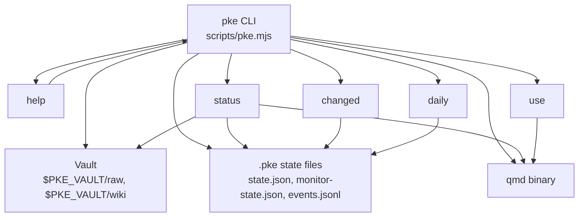
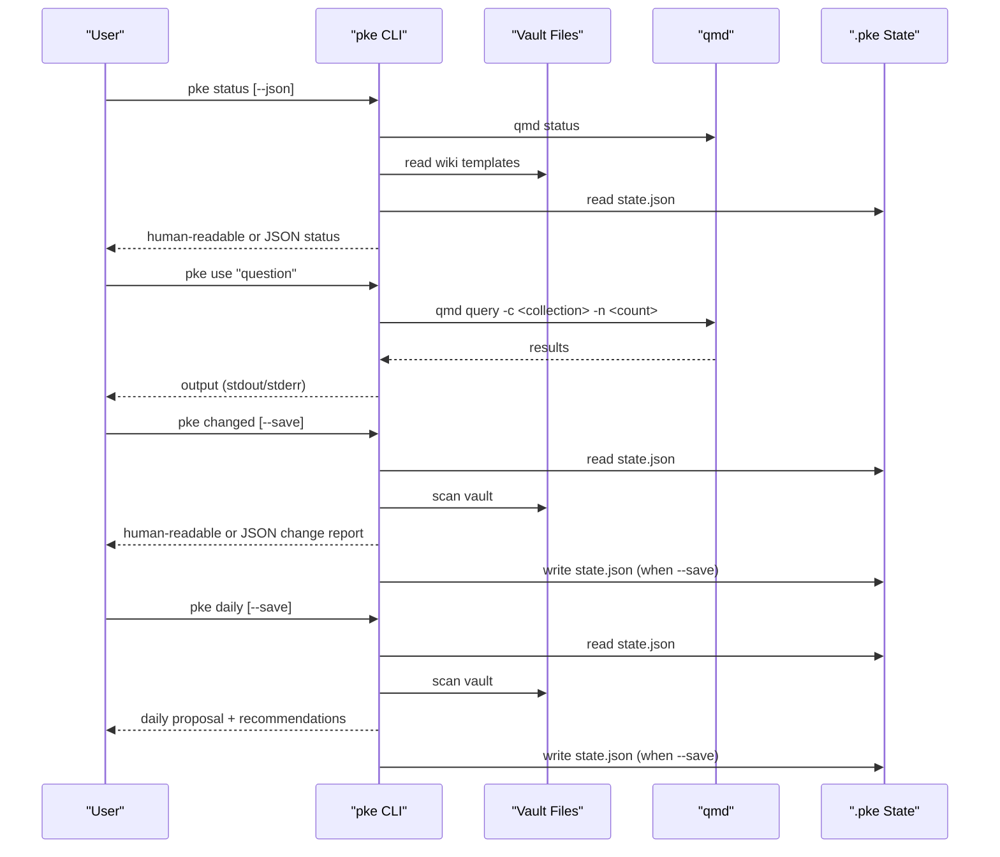
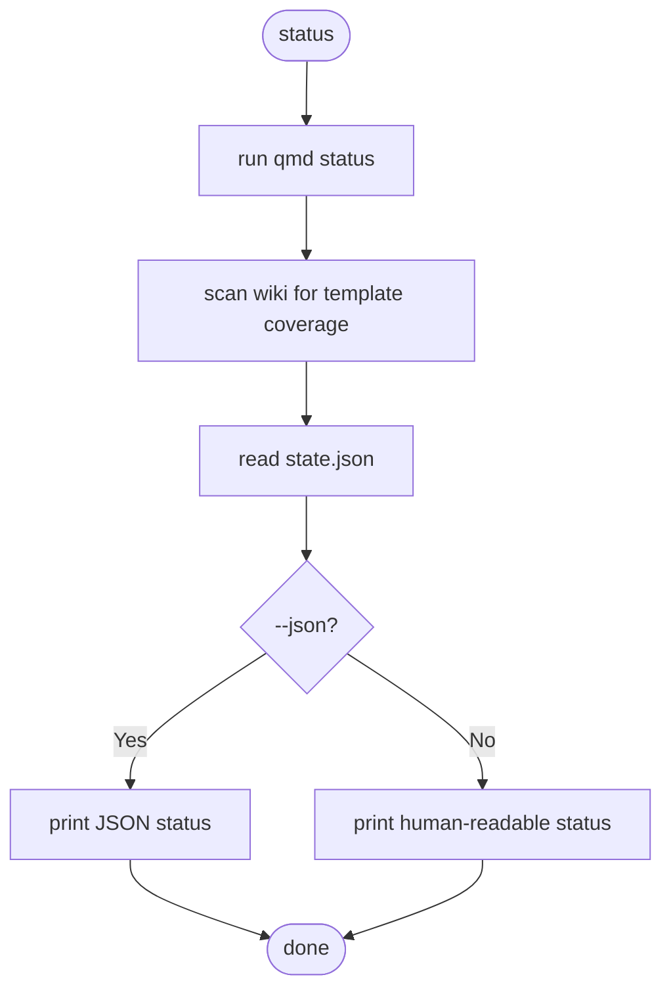
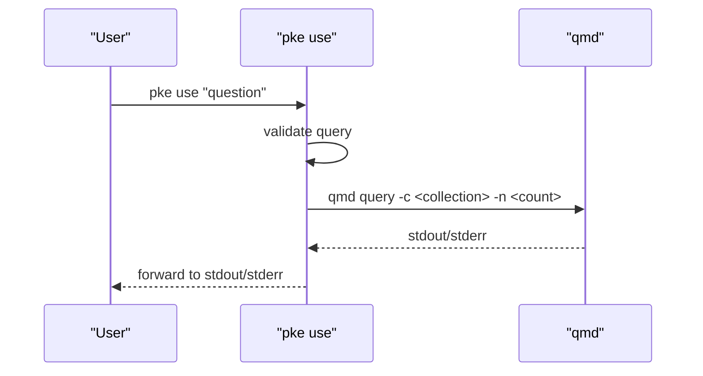
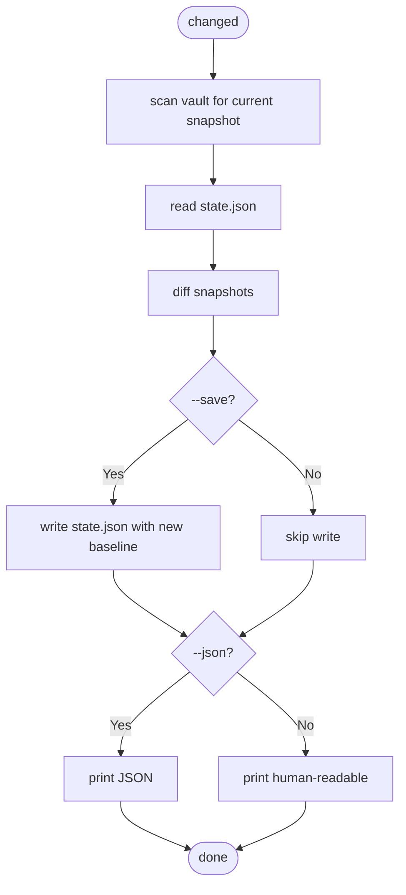
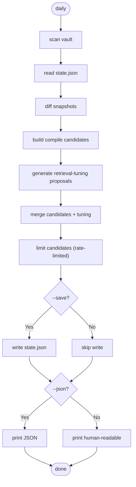
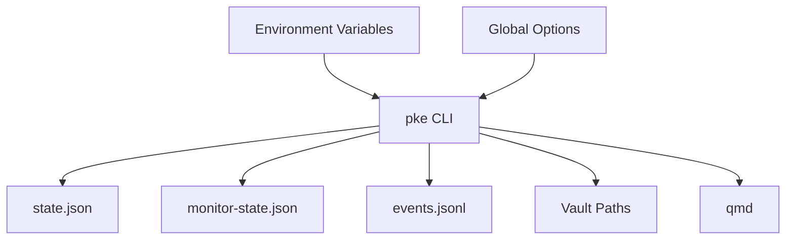

# Basic Commands

<cite>
**Referenced Files in This Document**
- [README.md](file://README.md)
- [package.json](file://package.json)
- [scripts/pke.mjs](file://scripts/pke.mjs)
- [docs/prd.md](file://docs/prd.md)
- [skills/personal-knowledge-engine.SKILL.md](file://skills/personal-knowledge-engine.SKILL.md)
</cite>

## Table of Contents
1. [Introduction](#introduction)
2. [Project Structure](#project-structure)
3. [Core Components](#core-components)
4. [Architecture Overview](#architecture-overview)
5. [Detailed Component Analysis](#detailed-component-analysis)
6. [Dependency Analysis](#dependency-analysis)
7. [Performance Considerations](#performance-considerations)
8. [Troubleshooting Guide](#troubleshooting-guide)
9. [Conclusion](#conclusion)
10. [Appendices](#appendices)

## Introduction
This document explains the Personal Knowledge Engine’s basic commands that underpin everyday knowledge management workflows. It focuses on four foundational commands: help, status, use, changed, and daily. You will learn syntax, parameters, environment variables, output formats, and practical usage patterns. The goal is to help you set up your vault, verify system health, query knowledge, detect changes, and run daily compilation proposals confidently.

## Project Structure
The CLI is implemented as a single JavaScript module that exposes a command router. Global options and environment variables control vault location, qmd path, and output formats. The README enumerates all commands and highlights the core loop: capture evidence, compile knowledge, and use knowledge naturally.

**Diagram sources**
- [scripts/pke.mjs:48-97](file://scripts/pke.mjs#L48-L97)
- [scripts/pke.mjs:99-157](file://scripts/pke.mjs#L99-L157)
- [scripts/pke.mjs:159-187](file://scripts/pke.mjs#L159-L187)
- [scripts/pke.mjs:189-194](file://scripts/pke.mjs#L189-L194)
- [scripts/pke.mjs:196-219](file://scripts/pke.mjs#L196-L219)
- [scripts/pke.mjs:221-285](file://scripts/pke.mjs#L221-L285)

**Section sources**
- [README.md:56-80](file://README.md#L56-L80)
- [package.json:7-9](file://package.json#L7-L9)
- [scripts/pke.mjs:9-32](file://scripts/pke.mjs#L9-L32)

## Core Components
- Command router: dispatches to help, status, use, changed, daily, and others.
- Environment variables:
  - PKE_VAULT: vault root (default: ~/MyKnowledge)
  - PKE_QMD_PATH: directory containing qmd binary (default: /opt/homebrew/bin)
- Output formats:
  - Human-readable by default
  - JSON via --json flag where supported

Key behaviors:
- help prints usage and options
- status checks qmd, vault paths, baseline, tracked files, and template coverage
- use delegates to qmd query for retrieval
- changed compares current snapshot to baseline and optionally saves a new baseline
- daily builds on changed to propose compile candidates and prints recommendations

**Section sources**
- [scripts/pke.mjs:48-97](file://scripts/pke.mjs#L48-L97)
- [scripts/pke.mjs:99-157](file://scripts/pke.mjs#L99-L157)
- [scripts/pke.mjs:159-187](file://scripts/pke.mjs#L159-L187)
- [scripts/pke.mjs:189-194](file://scripts/pke.mjs#L189-L194)
- [scripts/pke.mjs:196-219](file://scripts/pke.mjs#L196-L219)
- [scripts/pke.mjs:221-285](file://scripts/pke.mjs#L221-L285)
- [scripts/pke.mjs:1216-1218](file://scripts/pke.mjs#L1216-L1218)
- [scripts/pke.mjs:9-14](file://scripts/pke.mjs#L9-L14)

## Architecture Overview
The basic commands integrate with the vault and qmd engine. The CLI reads/writes state files under .pke and invokes qmd for indexing and retrieval.

**Diagram sources**
- [scripts/pke.mjs:159-187](file://scripts/pke.mjs#L159-L187)
- [scripts/pke.mjs:189-194](file://scripts/pke.mjs#L189-L194)
- [scripts/pke.mjs:196-219](file://scripts/pke.mjs#L196-L219)
- [scripts/pke.mjs:221-285](file://scripts/pke.mjs#L221-L285)
- [scripts/pke.mjs:824-875](file://scripts/pke.mjs#L824-L875)
- [scripts/pke.mjs:1190-1197](file://scripts/pke.mjs#L1190-L1197)

## Detailed Component Analysis

### Command: help
- Purpose: Display usage, options, environment variables, and governance principles.
- Syntax: pke help, pke --help, pke -h
- Options: None
- Output: Human-readable usage and principles
- Notes: Also used to discover available commands and options

**Section sources**
- [scripts/pke.mjs:99-157](file://scripts/pke.mjs#L99-L157)
- [README.md:56-80](file://README.md#L56-L80)

### Command: status
- Purpose: Verify vault health, qmd connectivity, baseline, tracked files, and template coverage.
- Syntax: pke status [--json]
- Options:
  - --json: Output JSON
- Behavior:
  - Runs qmd status to check connectivity
  - Scans wiki for template coverage (7-section requirement)
  - Reads state.json for baseline and tracked file counts
- Output:
  - Human-readable: Vault path, state path, baseline, tracked files, wiki page count, template compliance, missing pages
  - JSON: Fields include vault, wikiDir, rawDir, statePath, baselineAt, trackedFiles, templateCoverage, qmdStatus, qmdError

**Diagram sources**
- [scripts/pke.mjs:159-187](file://scripts/pke.mjs#L159-L187)

**Section sources**
- [scripts/pke.mjs:159-187](file://scripts/pke.mjs#L159-L187)
- [docs/prd.md:764-800](file://docs/prd.md#L764-L800)

### Command: use
- Purpose: Natural language querying of knowledge via qmd.
- Syntax: pke use "question"
- Options:
  - --json: Output JSON (not supported by use; output is qmd results)
- Behavior:
  - Validates presence of a query
  - Invokes qmd query with collection and result count
  - Streams qmd stdout/stderr to CLI stdout/stderr
- Output: qmd query results (stdout/stderr)
- Notes: Does not modify vault; retrieval is read-only

**Diagram sources**
- [scripts/pke.mjs:189-194](file://scripts/pke.mjs#L189-L194)

**Section sources**
- [scripts/pke.mjs:189-194](file://scripts/pke.mjs#L189-L194)
- [docs/prd.md:214-222](file://docs/prd.md#L214-L222)

### Command: changed
- Purpose: Detect changed files since the last baseline and optionally save a new baseline.
- Syntax: pke changed [--save]
- Options:
  - --save: Save current snapshot as the new baseline
  - --json: Output JSON
- Behavior:
  - Scans vault for current file snapshot
  - Reads state.json for previous snapshot
  - Computes added, modified, removed files
  - Optionally writes state.json with new baseline
- Output:
  - Human-readable: Counts and lists of added/modified/removed files
  - JSON: Object with vault, baselineAt, checkedAt, counts, changes, and saved flag

**Diagram sources**
- [scripts/pke.mjs:196-219](file://scripts/pke.mjs#L196-L219)
- [scripts/pke.mjs:824-875](file://scripts/pke.mjs#L824-L875)
- [scripts/pke.mjs:1190-1197](file://scripts/pke.mjs#L1190-L1197)

**Section sources**
- [scripts/pke.mjs:196-219](file://scripts/pke.mjs#L196-L219)
- [docs/prd.md:223-232](file://docs/prd.md#L223-L232)

### Command: daily
- Purpose: Automated daily compilation proposal based on changed files and monitor events.
- Syntax: pke daily [--save]
- Options:
  - --save: Save current snapshot as the new baseline
  - --json: Output JSON
- Behavior:
  - Scans vault and diffs against baseline
  - Builds compile candidates from changed files
  - Generates retrieval-tuning proposals for self-improvement
  - Limits candidates to a maximum number and prints recommendations
  - Optionally writes state.json with new baseline
- Output:
  - Human-readable: Mode, baseline, checked time, change counts, compile candidates, recommendations
  - JSON: Object with mode, baselineAt, checkedAt, changed, candidates, totalCandidates, recommendations, saved flag

**Diagram sources**
- [scripts/pke.mjs:221-285](file://scripts/pke.mjs#L221-L285)
- [scripts/pke.mjs:987-1059](file://scripts/pke.mjs#L987-L1059)
- [scripts/pke.mjs:1190-1197](file://scripts/pke.mjs#L1190-L1197)

**Section sources**
- [scripts/pke.mjs:221-285](file://scripts/pke.mjs#L221-L285)
- [docs/prd.md:377-399](file://docs/prd.md#L377-L399)

## Dependency Analysis
- Environment variables:
  - PKE_VAULT: determines vault root and therefore rawDir and wikiDir
  - PKE_QMD_PATH: augments PATH for qmd invocation
- Global options:
  - --json: toggles JSON output for supported commands
  - --save: persists a new baseline in state.json
- Internal state:
  - state.json: baselineAt and tracked files snapshot
  - monitor-state.json: incremental monitor snapshot and section state
  - events.jsonl: append-only event log

**Diagram sources**
- [scripts/pke.mjs:9-14](file://scripts/pke.mjs#L9-L14)
- [scripts/pke.mjs:1216-1218](file://scripts/pke.mjs#L1216-L1218)
- [scripts/pke.mjs:1190-1197](file://scripts/pke.mjs#L1190-L1197)

**Section sources**
- [scripts/pke.mjs:9-14](file://scripts/pke.mjs#L9-L14)
- [scripts/pke.mjs:1190-1197](file://scripts/pke.mjs#L1190-L1197)

## Performance Considerations
- Vault scanning is bounded by file count and size; oversized files are skipped with warnings.
- JSON output can be large; use --json judiciously for machine parsing.
- Monitor watch mode uses scoped polling; keep --path inside the vault to avoid scanning unrelated directories.
- qmd operations are external; ensure PKE_QMD_PATH points to a valid qmd binary to avoid failures.

[No sources needed since this section provides general guidance]

## Troubleshooting Guide
Common issues and resolutions:
- qmd not found or failing:
  - Ensure PKE_QMD_PATH includes the directory where qmd is installed
  - Verify qmd status succeeds independently
- Vault path issues:
  - Confirm PKE_VAULT points to a directory containing raw/ and wiki/ subfolders
  - Use absolute paths if necessary
- Missing or invalid baseline:
  - Run pke changed --save after reviewing changes to establish a baseline
- Oversized files:
  - Large files are skipped; reduce size or split content
- Watch mode errors:
  - Watch requires --path; ensure the path is inside the vault
- JSON output expectations:
  - Some commands do not support --json; consult help for supported flags

**Section sources**
- [scripts/pke.mjs:812-822](file://scripts/pke.mjs#L812-L822)
- [scripts/pke.mjs:824-875](file://scripts/pke.mjs#L824-L875)
- [scripts/pke.mjs:800-810](file://scripts/pke.mjs#L800-L810)
- [scripts/pke.mjs:1216-1218](file://scripts/pke.mjs#L1216-L1218)

## Conclusion
The basic commands provide a robust foundation for local-first knowledge management:
- help reveals capabilities and options
- status verifies health and readiness
- use enables natural-language retrieval
- changed tracks and saves baselines
- daily proposes compile candidates and enforces governance

Adopting these commands consistently will keep your vault organized, your knowledge current, and your workflows transparent.

[No sources needed since this section summarizes without analyzing specific files]

## Appendices

### Environment Variables
- PKE_VAULT: Vault root (default: ~/MyKnowledge)
- PKE_QMD_PATH: Directory containing qmd binary (default: /opt/homebrew/bin)

These variables influence vault paths and qmd availability.

**Section sources**
- [scripts/pke.mjs:9-14](file://scripts/pke.mjs#L9-L14)
- [skills/personal-knowledge-engine.SKILL.md:43-47](file://skills/personal-knowledge-engine.SKILL.md#L43-L47)

### Typical Workflows
- System setup:
  - Install Node.js and qmd
  - Create vault with raw/ and wiki/ directories
  - Verify with pke status
- Daily routine:
  - Run pke daily to review candidates and recommendations
  - Review changed files with pke changed
  - Save baseline with pke changed --save
  - Use pke use for natural-language retrieval
- Governance:
  - Wiki writes require explicit approval or scheduled workflows
  - Monitor events and reports inform decisions

**Section sources**
- [README.md:35-54](file://README.md#L35-L54)
- [docs/prd.md:305-427](file://docs/prd.md#L305-L427)