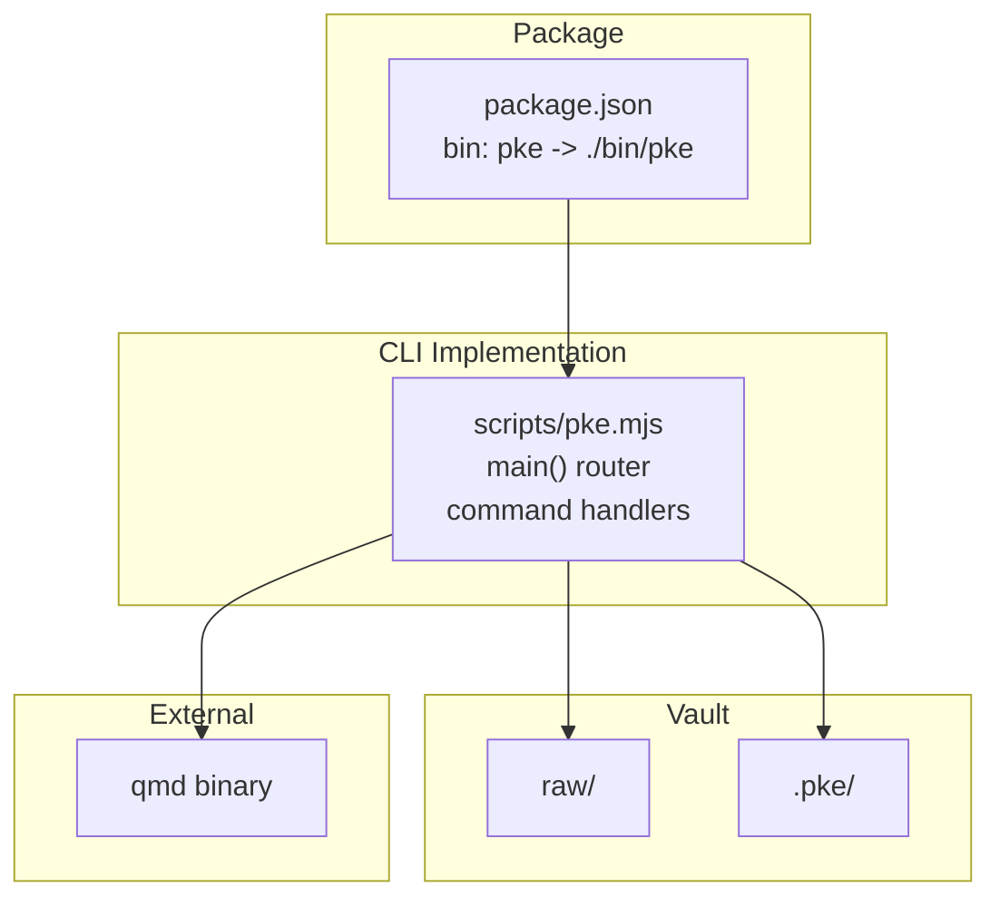
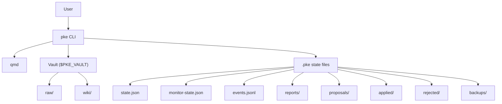
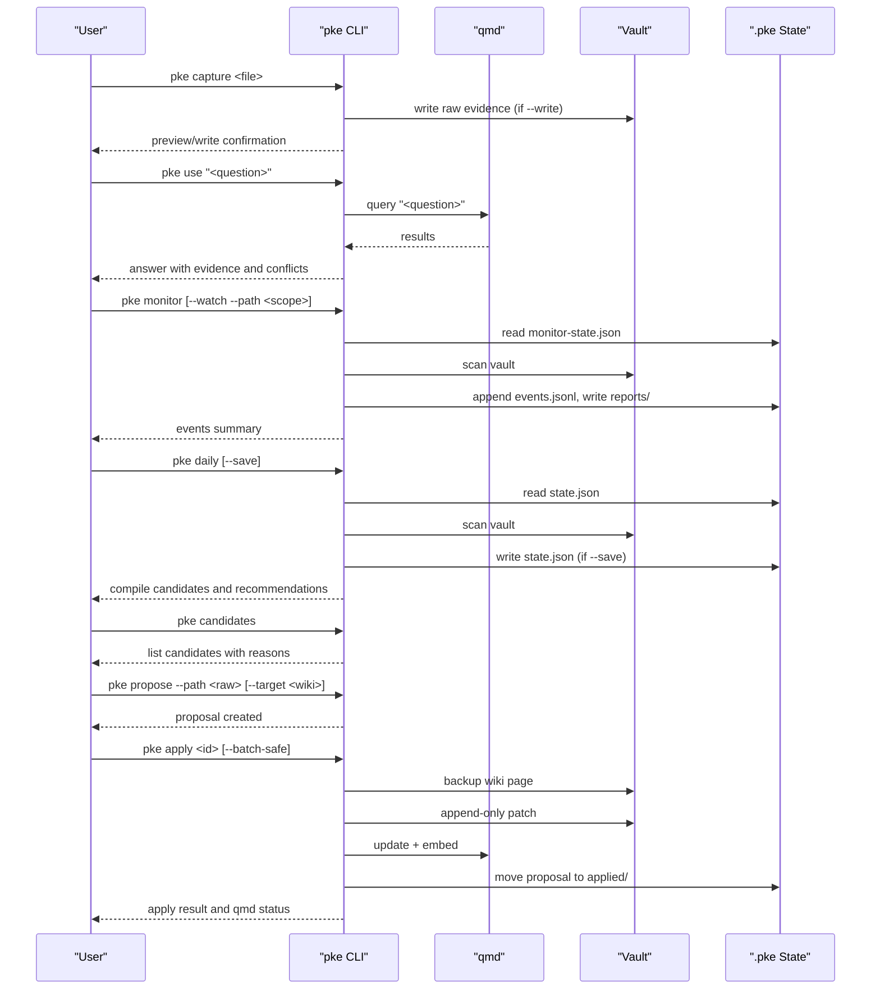
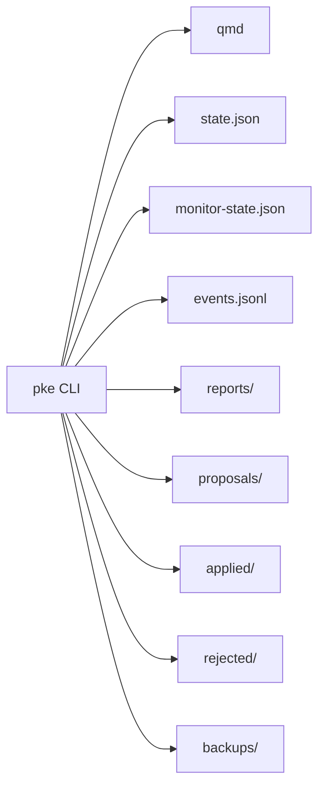

# CLI Command Reference

<cite>
**Referenced Files in This Document**
- [README.md](file://README.md)
- [package.json](file://package.json)
- [scripts/pke.mjs](file://scripts/pke.mjs)
- [docs/prd.md](file://docs/prd.md)
- [skills/personal-knowledge-engine.SKILL.md](file://skills/personal-knowledge-engine.SKILL.md)
</cite>

## Table of Contents
1. [Introduction](#introduction)
2. [Project Structure](#project-structure)
3. [Core Components](#core-components)
4. [Architecture Overview](#architecture-overview)
5. [Detailed Component Analysis](#detailed-component-analysis)
6. [Dependency Analysis](#dependency-analysis)
7. [Performance Considerations](#performance-considerations)
8. [Troubleshooting Guide](#troubleshooting-guide)
9. [Conclusion](#conclusion)
10. [Appendices](#appendices)

## Introduction
This document is a comprehensive CLI command reference for the Personal Knowledge Engine (PKE) CLI. It covers all commands, their syntax, options, flags, and behaviors, with practical examples and troubleshooting guidance. It also explains environment variables that influence command behavior and the relationships between commands in the overall knowledge workflow.

## Project Structure
The PKE CLI is implemented as a single JavaScript module that exposes a command router and orchestrates local file operations, qmd integration, and internal state management. The primary entry point is declared in the package manifest and routes to the CLI implementation.

**Diagram sources**
- [package.json:7-9](file://package.json#L7-L9)
- [scripts/pke.mjs:48-97](file://scripts/pke.mjs#L48-L97)

**Section sources**
- [package.json:1-18](file://package.json#L1-L18)
- [README.md:43-54](file://README.md#L43-L54)

## Core Components
- Command router: Dispatches to command handlers based on the first argument.
- Global options parsing: Converts dashed options into camelCase keys and handles boolean flags.
- Environment variables:
  - PKE_VAULT: Vault root directory (default: user home directory under a conventional name).
  - PKE_QMD_PATH: Directory containing the qmd binary (default: a common macOS path).
- Internal state and artifacts:
  - state.json: Baseline and tracked files snapshot.
  - monitor-state.json: Incremental monitor snapshot and wiki section state.
  - events.jsonl: Append-only knowledge event log.
  - reports/: Timestamped markdown reports.
  - proposals/, applied/, rejected/, backups/: Proposal lifecycle and backups.

**Section sources**
- [scripts/pke.mjs:9-29](file://scripts/pke.mjs#L9-L29)
- [scripts/pke.mjs:1199-1214](file://scripts/pke.mjs#L1199-L1214)
- [docs/prd.md:428-696](file://docs/prd.md#L428-L696)

## Architecture Overview
The CLI integrates with qmd for indexing and querying, operates on a vault with raw and wiki directories, and maintains internal state and event logs. Commands fall into categories:
- Status checks: status, events, report
- Knowledge capture: capture
- Compilation: compile, daily, candidates, propose, proposals, proposal, apply, reject, improve
- Monitoring: monitor, dashboard
- Proposal management: candidates, propose, proposals, proposal, apply, reject
- Dashboard operations: dashboard

**Diagram sources**
- [scripts/pke.mjs:812-822](file://scripts/pke.mjs#L812-L822)
- [docs/prd.md:428-696](file://docs/prd.md#L428-L696)

## Detailed Component Analysis

### Command Categories and Reference

#### Status Checks
- status [--json]
  - Purpose: Display vault health, qmd connectivity, baseline state, and template compliance.
  - Options:
    - --json: Output as JSON.
  - Behavior:
    - Runs qmd status to verify connectivity.
    - Computes template coverage across wiki pages.
    - Reads state.json for baseline and tracked files.
  - Output:
    - Human-readable summary or JSON object with vault, statePath, baselineAt, trackedFiles, templateCoverage, qmdStatus, qmdError.
  - Practical examples:
    - pke status
    - pke status --json

- events [--limit N]
  - Purpose: List recent knowledge events.
  - Options:
    - --limit N: Number of events to show (default 20).
  - Output:
    - Human-readable list or JSON array of events.
  - Practical examples:
    - pke events
    - pke events --limit 50

- report latest|today|usage [--json]
  - Purpose: Print the latest or today’s monitor report, or generate a usage pattern report.
  - Options:
    - --json: Output as JSON.
    - --usage: Alias to generate usage report.
  - Behavior:
    - latest/today: Read the latest or today’s report markdown files and print their contents.
    - usage: Compute totals, approvals, acceptance rate, compile velocity, and top topics.
  - Practical examples:
    - pke report latest
    - pke report today
    - pke report usage
    - pke report usage --json

**Section sources**
- [scripts/pke.mjs:159-187](file://scripts/pke.mjs#L159-L187)
- [scripts/pke.mjs:448-461](file://scripts/pke.mjs#L448-L461)
- [scripts/pke.mjs:463-506](file://scripts/pke.mjs#L463-L506)
- [docs/prd.md:764-800](file://docs/prd.md#L764-L800)

#### Knowledge Capture
- capture path/to/source.md [--write]
  - Purpose: Preview or write a capture of a source file into the raw evidence area.
  - Options:
    - --write: Allow writing evidence files.
  - Behavior:
    - Validates source existence.
    - Constructs a timestamped target path under raw/_captures/.
    - Outputs source, target, and write status; writes only if --write is provided.
  - Practical examples:
    - pke capture ./incoming.md
    - pke capture ./incoming.md --write

**Section sources**
- [scripts/pke.mjs:329-353](file://scripts/pke.mjs#L329-L353)
- [docs/prd.md:204-212](file://docs/prd.md#L204-L212)

#### Compilation
- compile "topic or page"
  - Purpose: Query relevant context and produce a change report; proposal-only in MVP.
  - Behavior:
    - Queries qmd for context.
    - Scans vault before and after to compute change report.
    - Emphasizes proposal-only mode and next-step instructions.
  - Practical examples:
    - pke compile "AI strategy"
    - pke compile "product decisions"

- daily [--save]
  - Purpose: Daily compilation proposal; lists changed files and compile candidates.
  - Options:
    - --save: Save the current snapshot as the new baseline.
  - Behavior:
    - Scans vault, diffs against baseline, collects candidates, and prints recommendations.
  - Practical examples:
    - pke daily
    - pke daily --save

- learn draft.md final.md
  - Purpose: Compare draft and final documents to classify changes and propose compile actions.
  - Behavior:
    - Computes line-level diff, classifies into groups, and suggests compile actions.
  - Practical examples:
    - pke learn draft.md final.md

- close-session transcript.md
  - Purpose: Scan a session transcript for durable signals and propose compile review.
  - Behavior:
    - Reads transcript, extracts lines matching durable-signal keywords, and reports.
  - Practical examples:
    - pke close-session session.txt

- stale "topic or page" [--sensitivity low|medium|high]
  - Purpose: Review topic for stale or risky claims with adjustable sensitivity.
  - Options:
    - --sensitivity: low, medium, high.
  - Practical examples:
    - pke stale "market assumptions"
    - pke stale "market assumptions" --sensitivity high

**Section sources**
- [scripts/pke.mjs:355-394](file://scripts/pke.mjs#L355-L394)
- [scripts/pke.mjs:221-285](file://scripts/pke.mjs#L221-L285)
- [scripts/pke.mjs:287-327](file://scripts/pke.mjs#L287-L327)
- [scripts/pke.mjs:396-418](file://scripts/pke.mjs#L396-L418)
- [scripts/pke.mjs:420-438](file://scripts/pke.mjs#L420-L438)
- [docs/prd.md:243-252](file://docs/prd.md#L243-L252)
- [docs/prd.md:377-399](file://docs/prd.md#L377-L399)
- [docs/prd.md:296-304](file://docs/prd.md#L296-L304)
- [docs/prd.md:400-427](file://docs/prd.md#L400-L427)

#### Monitoring
- monitor [--path vault-relative-path] [--watch]
  - Purpose: One-shot or scoped real-time monitoring of the vault.
  - Options:
    - --path: Vault-relative scope (e.g., wiki/).
    - --watch: Enter scoped polling watch mode.
  - Behavior:
    - One-shot: Compares current snapshot to previous monitor-state, emits events, writes report.
    - Watch: Polls at a fixed interval (default ~2 seconds), prints summaries when events occur.
  - Practical examples:
    - pke monitor
    - pke monitor --path wiki/
    - pke monitor --watch --path wiki/

- dashboard [--port 8787] [--path raw/] [--auto-scan]
  - Purpose: Launch a local HTTP dashboard for monitoring and proposal management.
  - Options:
    - --port: HTTP port (default 8787).
    - --path: Vault-relative scope for dashboard scans.
    - --auto-scan: Auto-scan the configured path on refresh.
  - Behavior:
    - Starts HTTP server with endpoints for dashboard data, scan, propose, apply, reject.
    - Provides a browser UI to filter events, manage proposals, and trigger scans.
  - Practical examples:
    - pke dashboard
    - pke dashboard --port 8788
    - pke dashboard --path raw/ --auto-scan

**Section sources**
- [scripts/pke.mjs:440-446](file://scripts/pke.mjs#L440-L446)
- [scripts/pke.mjs:737-785](file://scripts/pke.mjs#L737-L785)
- [scripts/pke.mjs:674-736](file://scripts/pke.mjs#L674-L736)
- [README.md:128-184](file://README.md#L128-L184)

#### Proposal Management
- candidates
  - Purpose: List compile-trigger events with reasons and suggested targets; confidence adjusted by acceptance history.
  - Options: None.
  - Practical examples:
    - pke candidates

- propose --path raw/note.md [--target wiki/page.md]
  - Purpose: Create a proposal from a raw file path.
  - Options:
    - --path: Source file path.
    - --target: Target wiki page for the proposal.
  - Practical examples:
    - pke propose --path raw/chat.md --target wiki/ai-strategy.md

- propose --event event-id [--target wiki/page.md]
  - Purpose: Create a proposal from an existing monitor event.
  - Options:
    - --event: Event ID.
    - --target: Target wiki page.
  - Practical examples:
    - pke propose --event abc123 --target wiki/ai-strategy.md

- proposals [--status pending|applied|rejected]
  - Purpose: List all proposals with status filter.
  - Options:
    - --status: Filter by status.
  - Practical examples:
    - pke proposals
    - pke proposals --status pending

- proposal proposal-id
  - Purpose: Show full details of a proposal including patch operations.
  - Practical examples:
    - pke proposal abc123

- apply proposal-id [--batch-safe]
  - Purpose: Apply a proposal (append-only patch) to the target wiki page.
  - Options:
    - --batch-safe: Fast-path for safe append-only proposals; can be used with a specific ID or without to batch-apply all eligible proposals.
  - Behavior:
    - Creates backup, applies patch, updates proposal status, attempts qmd refresh.
    - --batch-safe: Validates safety and applies multiple proposals atomically with per-proposal logging.
  - Practical examples:
    - pke apply abc123
    - pke apply abc123 --batch-safe
    - pke apply --batch-safe

- reject proposal-id
  - Purpose: Reject a proposal and archive it.
  - Practical examples:
    - pke reject abc123

- improve [--json] [--apply]
  - Purpose: Generate self-improvement proposals for retrieval tuning and optionally write them.
  - Options:
    - --json: Output as JSON.
    - --apply: Write the generated proposals to the proposals directory.
  - Practical examples:
    - pke improve
    - pke improve --apply
    - pke improve --json

**Section sources**
- [scripts/pke.mjs:508-547](file://scripts/pke.mjs#L508-L547)
- [scripts/pke.mjs:549-560](file://scripts/pke.mjs#L549-L560)
- [scripts/pke.mjs:562-576](file://scripts/pke.mjs#L562-L576)
- [scripts/pke.mjs:578-583](file://scripts/pke.mjs#L578-L583)
- [scripts/pke.mjs:585-600](file://scripts/pke.mjs#L585-L600)
- [scripts/pke.mjs:602-660](file://scripts/pke.mjs#L602-L660)
- [scripts/pke.mjs:1064-1092](file://scripts/pke.mjs#L1064-L1092)
- [docs/prd.md:189-284](file://docs/prd.md#L189-L284)

#### Dashboard Operations
- Dashboard endpoints (via dashboard command):
  - GET /api/dashboard: Returns dashboard data (events, reports, proposals, totals).
  - GET /api/scan: Runs a monitor scan and returns combined report and dashboard data.
  - GET /api/propose?event=<id>&target=<page>: Creates a proposal from an event and returns it plus dashboard data.
  - GET /api/apply?id=<id>: Applies a proposal and returns result plus dashboard data.
  - GET /api/reject?id=<id>: Rejects a proposal and returns it plus dashboard data.
  - GET /: Renders the HTML dashboard.

**Section sources**
- [scripts/pke.mjs:674-736](file://scripts/pke.mjs#L674-L736)

### Command Relationships and Workflow
The commands form a cohesive workflow:
- Capture evidence into raw/.
- Use qmd-backed retrieval to inform decisions.
- Monitor changes and knowledge events.
- Generate compile candidates and proposals.
- Review and approve proposals.
- Apply safe, append-only patches to wiki pages.
- Reindex with qmd after approved changes.
- Periodic daily compilation and staleness review.

**Diagram sources**
- [scripts/pke.mjs:329-353](file://scripts/pke.mjs#L329-L353)
- [scripts/pke.mjs:189-194](file://scripts/pke.mjs#L189-L194)
- [scripts/pke.mjs:440-446](file://scripts/pke.mjs#L440-L446)
- [scripts/pke.mjs:221-285](file://scripts/pke.mjs#L221-L285)
- [scripts/pke.mjs:508-547](file://scripts/pke.mjs#L508-L547)
- [scripts/pke.mjs:549-560](file://scripts/pke.mjs#L549-L560)
- [scripts/pke.mjs:585-600](file://scripts/pke.mjs#L585-L600)
- [scripts/pke.mjs:1603-1633](file://scripts/pke.mjs#L1603-L1633)

## Dependency Analysis
- External dependency: qmd binary invoked via environment-controlled PATH.
- Internal dependencies:
  - State files (.pke/state.json, .pke/monitor-state.json)
  - Event log (.pke/events.jsonl)
  - Reports (.pke/reports/)
  - Proposal lifecycle (.pke/proposals/, .pke/applied/, .pke/rejected/, .pke/backups/)

**Diagram sources**
- [scripts/pke.mjs:812-822](file://scripts/pke.mjs#L812-L822)
- [docs/prd.md:428-696](file://docs/prd.md#L428-L696)

**Section sources**
- [scripts/pke.mjs:9-14](file://scripts/pke.mjs#L9-L14)
- [docs/prd.md:428-696](file://docs/prd.md#L428-L696)

## Performance Considerations
- File size limits: Files larger than 10 MB are skipped with a warning.
- Event retention: Event log is capped at 100,000 entries; older events are archived.
- Report retention: Reports older than 90 days are archived.
- Watch mode: Uses scoped polling instead of OS-native watchers; interval defaults to approximately 2 seconds.
- Candidate and proposal caps: Limits on candidates and pending proposals to keep the system responsive.

[No sources needed since this section provides general guidance]

## Troubleshooting Guide
- qmd failures:
  - Symptom: qmd command fails during status, compile, or apply steps.
  - Cause: qmd not installed, not in PATH, or misconfigured.
  - Resolution: Ensure qmd is installed and reachable via PATH; set PKE_QMD_PATH to the directory containing qmd.
  - Section sources
    - [scripts/pke.mjs:812-822](file://scripts/pke.mjs#L812-L822)
    - [scripts/pke.mjs:13-14](file://scripts/pke.mjs#L13-L14)

- Unknown command:
  - Symptom: Error indicating an unknown command.
  - Resolution: Run pke help to see the full command list.
  - Section sources
    - [scripts/pke.mjs:94-96](file://scripts/pke.mjs#L94-L96)

- Missing source file:
  - Symptom: Error indicating a missing source file for capture or learn.
  - Resolution: Verify the file path and permissions.
  - Section sources
    - [scripts/pke.mjs:332](file://scripts/pke.mjs#L332)
    - [scripts/pke.mjs:288](file://scripts/pke.mjs#L288)

- Watch path outside vault:
  - Symptom: Error stating the watch path must be inside the vault.
  - Resolution: Use a vault-relative path; ensure it resides under $PKE_VAULT.
  - Section sources
    - [scripts/pke.mjs:788-791](file://scripts/pke.mjs#L788-L791)

- Proposal not pending:
  - Symptom: Error indicating proposal is not pending.
  - Resolution: Only pending proposals can be applied; review status with pke proposal <id>.
  - Section sources
    - [scripts/pke.mjs:1604](file://scripts/pke.mjs#L1604)

- Target page not found:
  - Symptom: Error indicating the target wiki page does not exist.
  - Resolution: Choose an existing target page or create it first.
  - Section sources
    - [scripts/pke.mjs:1608](file://scripts/pke.mjs#L1608)

- Exceeded proposal cap:
  - Symptom: Warning that pending proposals exceed the limit.
  - Resolution: Review and act on older proposals to reduce backlog.
  - Section sources
    - [scripts/pke.mjs:1564](file://scripts/pke.mjs#L1564)

- Oversized files:
  - Symptom: Warning about skipping oversized files.
  - Resolution: Split large files or compress content appropriately.
  - Section sources
    - [scripts/pke.mjs:838-840](file://scripts/pke.mjs#L838-L840)

## Conclusion
The PKE CLI provides a robust, proposal-only workflow for governing knowledge creation and maintenance. By combining capture, monitoring, proposal generation, and approval-gated application, it ensures that wiki pages remain trustworthy and evidence-linked. Environment variables PKE_VAULT and PKE_QMD_PATH control the vault location and qmd availability, respectively. Use the command reference to select the right tool for each phase of your knowledge workflow.

[No sources needed since this section summarizes without analyzing specific files]

## Appendices

### Environment Variables
- PKE_VAULT
  - Purpose: Root directory of the knowledge vault.
  - Default: User home directory under a conventional name.
  - Impact: All vault-relative paths are resolved under this directory.
  - Section sources
    - [scripts/pke.mjs:9-11](file://scripts/pke.mjs#L9-L11)
    - [docs/prd.md:430-452](file://docs/prd.md#L430-L452)

- PKE_QMD_PATH
  - Purpose: Directory containing the qmd binary.
  - Default: A common macOS Homebrew path.
  - Impact: qmd is executed with PATH augmented by this directory.
  - Section sources
    - [scripts/pke.mjs:13-14](file://scripts/pke.mjs#L13-L14)
    - [skills/personal-knowledge-engine.SKILL.md:43-47](file://skills/personal-knowledge-engine.SKILL.md#L43-L47)

### Global Options
- --vault <path>
  - Override PKE_VAULT for a single invocation.
- --collection <name>
  - qmd collection name (default: a conventional name).
- --state <path>
  - Override state.json path.
- --path <path>
  - Scope monitor/watch to a vault-relative path.
- --json
  - Output JSON where supported.
- --save
  - Save changed-file baseline.
- --write
  - Allow commands that write evidence files.
- --watch
  - Watch a required --path in realtime.
- --port <number>
  - Dashboard port (default: 8787).
- --auto-scan
  - Dashboard scans the configured --path on refresh.
- --target <path>
  - Target wiki page for a proposal.
- --apply
  - Write self-improvement proposals (for improve command).
- --batch-safe
  - Fast-path for applying safe proposals; can be used with a specific ID or without to batch-apply eligible ones.
- --usage
  - Generate usage pattern report (alias: pke report usage).

**Section sources**
- [scripts/pke.mjs:125-139](file://scripts/pke.mjs#L125-L139)
- [scripts/pke.mjs:1199-1214](file://scripts/pke.mjs#L1199-L1214)

### Practical Examples Index
- Status checks
  - pke status
  - pke status --json
  - pke events --limit 50
  - pke report latest
  - pke report today
  - pke report usage --json
- Knowledge capture
  - pke capture ./incoming.md
  - pke capture ./incoming.md --write
- Compilation
  - pke compile "AI strategy"
  - pke daily --save
  - pke learn draft.md final.md
  - pke close-session session.txt
  - pke stale "market assumptions" --sensitivity high
- Monitoring
  - pke monitor
  - pke monitor --path wiki/
  - pke monitor --watch --path wiki/
  - pke dashboard --port 8788
  - pke dashboard --path raw/ --auto-scan
- Proposal management
  - pke candidates
  - pke propose --path raw/chat.md --target wiki/ai-strategy.md
  - pke propose --event abc123 --target wiki/ai-strategy.md
  - pke proposals --status pending
  - pke proposal abc123
  - pke apply abc123 --batch-safe
  - pke reject abc123
  - pke improve --apply

**Section sources**
- [README.md:56-80](file://README.md#L56-L80)
- [docs/prd.md:732-761](file://docs/prd.md#L732-L761)