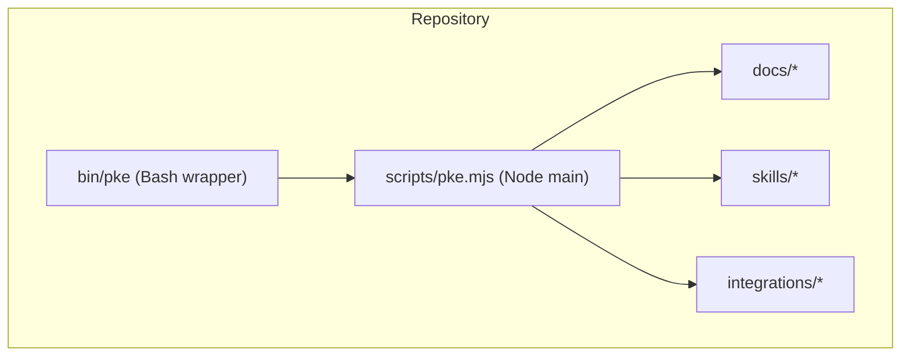
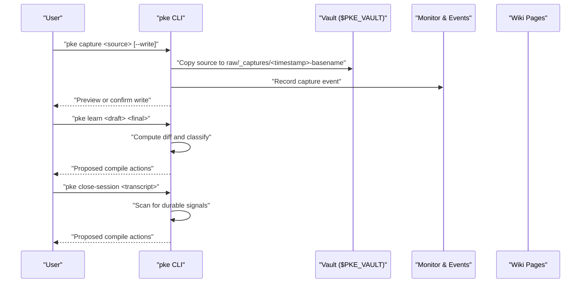
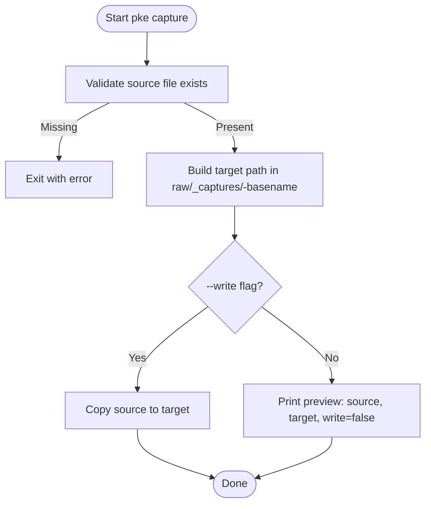
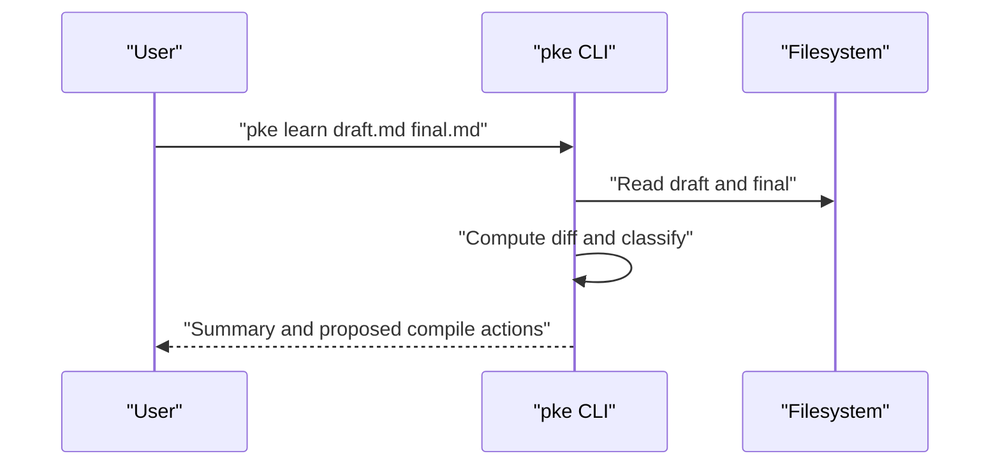
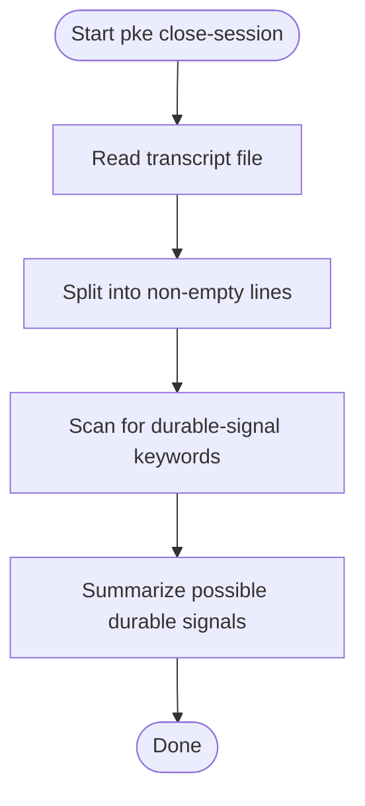
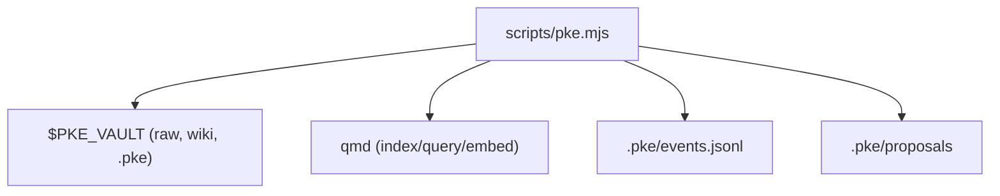

# Knowledge Capture Commands

<cite>
**Referenced Files in This Document**
- [README.md](file://README.md)
- [package.json](file://package.json)
- [bin/pke](file://bin/pke)
- [scripts/pke.mjs](file://scripts/pke.mjs)
- [docs/prd.md](file://docs/prd.md)
- [docs/agent-workflow.md](file://docs/agent-workflow.md)
- [skills/personal-knowledge-engine.SKILL.md](file://skills/personal-knowledge-engine.SKILL.md)
- [integrations/qoder/personal-knowledge-engine/SKILL.md](file://integrations/qoder/personal-knowledge-engine/SKILL.md)
</cite>

## Table of Contents
1. [Introduction](#introduction)
2. [Project Structure](#project-structure)
3. [Core Components](#core-components)
4. [Architecture Overview](#architecture-overview)
5. [Detailed Component Analysis](#detailed-component-analysis)
6. [Dependency Analysis](#dependency-analysis)
7. [Performance Considerations](#performance-considerations)
8. [Troubleshooting Guide](#troubleshooting-guide)
9. [Conclusion](#conclusion)
10. [Appendices](#appendices)

## Introduction
This document explains the knowledge capture commands that handle evidence collection and preservation in the Personal Knowledge Engine (PKE). It covers:
- The capture command for ingesting raw sources into the evidence store
- The learn command for processing draft-to-final document transformations
- The close-session command for processing conversational transcripts

It details the workflow from input to output, including file handling, timestamp generation, and evidence preservation rules. It also explains the proposal-only philosophy and why wiki files remain unchanged during capture operations. Practical examples, file format requirements, and integration with the broader knowledge management pipeline are included.

## Project Structure
The PKE CLI is implemented as a Node.js script invoked via a Bash wrapper. The repository provides:
- A CLI entrypoint that routes to the main script
- A main script implementing all commands, including capture, learn, and close-session
- Supporting documentation and skill integrations

**Diagram sources**
- [bin/pke](file://bin/pke)
- [scripts/pke.mjs](file://scripts/pke.mjs)

**Section sources**
- [README.md](file://README.md)
- [package.json](file://package.json)
- [bin/pke](file://bin/pke)
- [scripts/pke.mjs](file://scripts/pke.mjs)

## Core Components
- Capture command: Copies a source file into the evidence store with a timestamped filename. By default, it previews the target without writing; use the write flag to persist.
- Learn command: Compares a draft and final document, classifies differences, and proposes compile actions without changing wiki files.
- Close-session command: Scans a transcript for durable-signal keywords and proposes compile actions without changing wiki files.

These commands are part of the proposal-only pipeline: they observe, analyze, and propose; wiki writes require explicit user approval.

**Section sources**
- [scripts/pke.mjs](file://scripts/pke.mjs)
- [docs/prd.md](file://docs/prd.md)

## Architecture Overview
The capture, learn, and close-session commands integrate with the broader knowledge loop: capture evidence, compile knowledge, and use knowledge naturally. The CLI orchestrates vault scanning, event logging, and proposal generation while preserving wiki integrity.

**Diagram sources**
- [scripts/pke.mjs](file://scripts/pke.mjs)
- [docs/prd.md](file://docs/prd.md)

## Detailed Component Analysis

### Capture Command
Purpose: Ingest raw sources into the evidence store as immutable records.

Workflow:
- Validate the source file exists
- Generate a timestamped target path under the evidence directory
- Preview mode (default): show source, target, and write status without copying
- Write mode (--write): copy the file into the evidence store

Key behaviors:
- Timestamp generation: ISO timestamp with dots and colons replaced by hyphens
- Evidence preservation: raw files are never edited; capture only copies
- Vault layout: evidence files go to raw/_captures/ with collision-free names
- Governance: capture is append-only; wiki is not modified

**Diagram sources**
- [scripts/pke.mjs](file://scripts/pke.mjs)

**Section sources**
- [scripts/pke.mjs](file://scripts/pke.mjs)
- [docs/prd.md](file://docs/prd.md)

Practical examples:
- Preview a capture: run the command without --write to see where the file would be placed
- Write evidence: run with --write to persist the file into the evidence store
- File format: supported extensions include Markdown and text files
- Integration: after capture, run a scoped monitor scan to track changes

### Learn Command
Purpose: Process draft-to-final document transformations and propose compile actions.

Workflow:
- Read draft and final files
- Compute line-level diff
- Classify changes into categories (e.g., product judgment, factual corrections, style preferences)
- Generate proposed compile actions based on the classification
- Output a summary and proposed actions without modifying wiki

Key behaviors:
- Classification logic: categorizes added lines into predefined buckets
- Proposal generation: suggests compile actions aligned with the detected signals
- Governance: no wiki writes occur; propose and wait for approval

**Diagram sources**
- [scripts/pke.mjs](file://scripts/pke.mjs)

**Section sources**
- [scripts/pke.mjs](file://scripts/pke.mjs)
- [docs/prd.md](file://docs/prd.md)

Practical examples:
- Compare a draft and final document to identify durable knowledge signals
- Review the classification groups and proposed compile actions
- Use the proposal-only output to inform manual compilation decisions

### Close-Session Command
Purpose: Process conversational transcripts and propose compile actions.

Workflow:
- Read the transcript file
- Split into lines and trim whitespace
- Scan for durable-signal keywords indicating decisions, conclusions, or updates
- Output a summary of possible durable signals without modifying wiki

Key behaviors:
- Keyword-based detection: scans for localized keywords signaling durable knowledge
- Proposal-only: proposes compile actions; no wiki writes occur
- Governance: aligns with the proposal-only philosophy

**Diagram sources**
- [scripts/pke.mjs](file://scripts/pke.mjs)

**Section sources**
- [scripts/pke.mjs](file://scripts/pke.mjs)
- [docs/prd.md](file://docs/prd.md)

Practical examples:
- Provide a transcript file to extract durable signals
- Review the list of possible durable signals
- Use the proposal-only output to decide whether to compile knowledge

## Dependency Analysis
The capture, learn, and close-session commands depend on:
- Vault layout and environment variables (vault root, qmd collection)
- File scanning and hashing utilities
- Event logging and proposal generation
- qmd integration for retrieval and embedding

**Diagram sources**
- [scripts/pke.mjs](file://scripts/pke.mjs)
- [docs/prd.md](file://docs/prd.md)

**Section sources**
- [scripts/pke.mjs](file://scripts/pke.mjs)
- [docs/prd.md](file://docs/prd.md)

## Performance Considerations
- File size limits: files larger than 10 MB are skipped during vault scans
- Event log rotation: event logs are archived when exceeding a threshold
- Report retention: reports older than 90 days are archived
- Scoped monitoring: watch mode uses polling to avoid OS-specific watchers

[No sources needed since this section provides general guidance]

## Troubleshooting Guide
Common issues and resolutions:
- Source file not found: ensure the path exists and is readable
- Missing qmd: install and configure qmd; ensure the PATH includes the qmd executable
- Oversized files: reduce file size or split content into smaller chunks
- Permission errors: verify write permissions for the vault and .pke directories
- Monitor path errors: watch mode requires a vault-relative path inside the configured vault

**Section sources**
- [scripts/pke.mjs](file://scripts/pke.mjs)
- [docs/prd.md](file://docs/prd.md)

## Conclusion
The capture, learn, and close-session commands form the foundation of evidence collection and preservation in the Personal Knowledge Engine. They adhere to the proposal-only philosophy, ensuring that wiki files remain unchanged until explicit user approval. By integrating with the broader knowledge loop—capture evidence, compile knowledge, and use knowledge naturally—these commands support a governed, local-first knowledge workflow that protects the distinction between raw evidence and synthesized knowledge.

[No sources needed since this section summarizes without analyzing specific files]

## Appendices

### Command Reference and Examples
- Capture evidence:
  - Preview: run the capture command without --write to see the target path
  - Write: run with --write to persist the file into the evidence store
- Learn from documents:
  - Compare draft and final to identify durable knowledge signals
  - Review proposed compile actions and decide whether to compile
- Close a session:
  - Scan a transcript for durable signals and propose compile actions

**Section sources**
- [README.md](file://README.md)
- [scripts/pke.mjs](file://scripts/pke.mjs)
- [docs/prd.md](file://docs/prd.md)

### Governance and Philosophy
- Raw files are evidence and are rarely edited
- Wiki files are compiled knowledge and require explicit update clues
- Proposal-only pipeline: observe, analyze, propose; apply only after approval
- Evidence preservation rules: capture stores evidence, not conclusions; wiki writes are append-only and require approval

**Section sources**
- [README.md](file://README.md)
- [docs/prd.md](file://docs/prd.md)
- [skills/personal-knowledge-engine.SKILL.md](file://skills/personal-knowledge-engine.SKILL.md)
- [docs/agent-workflow.md](file://docs/agent-workflow.md)
- [integrations/qoder/personal-knowledge-engine/SKILL.md](file://integrations/qoder/personal-knowledge-engine/SKILL.md)