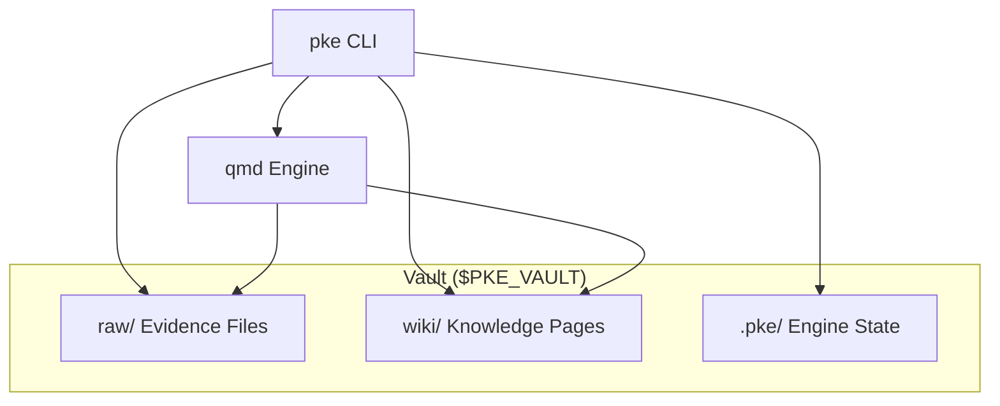
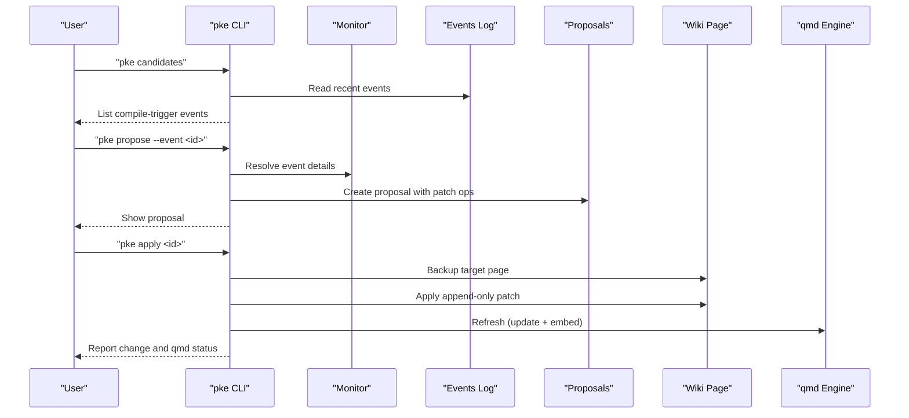
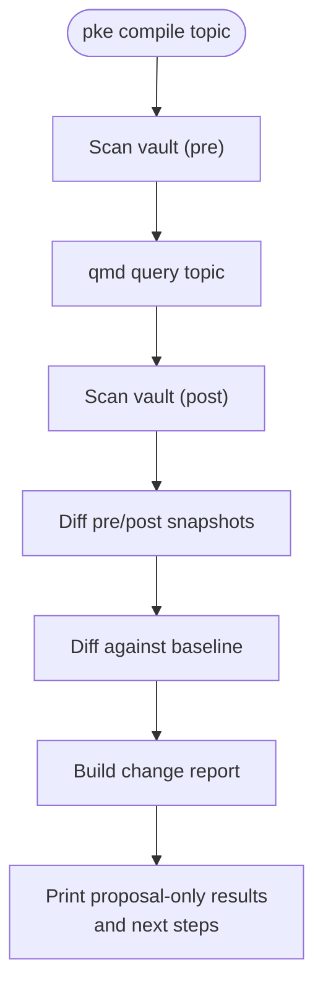
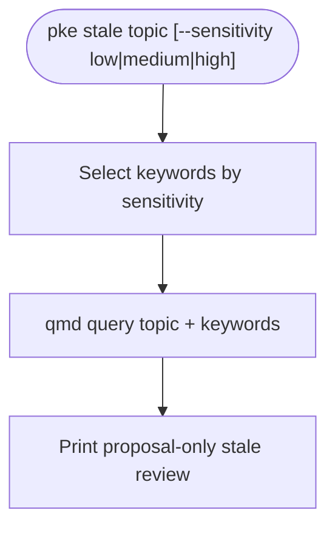
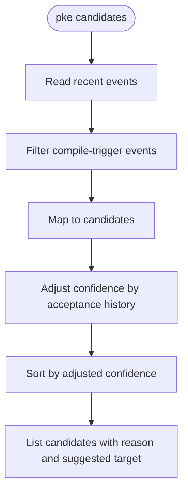
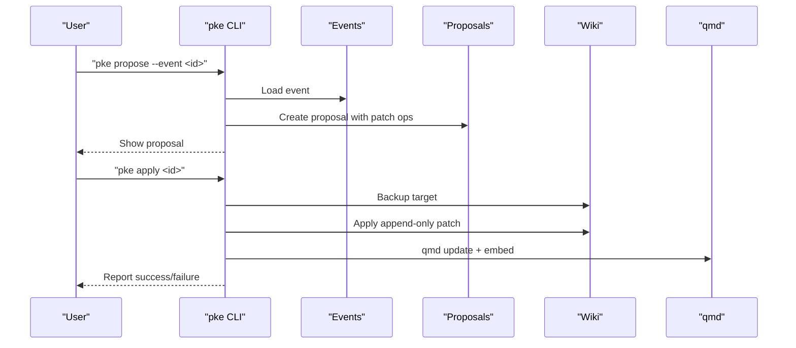
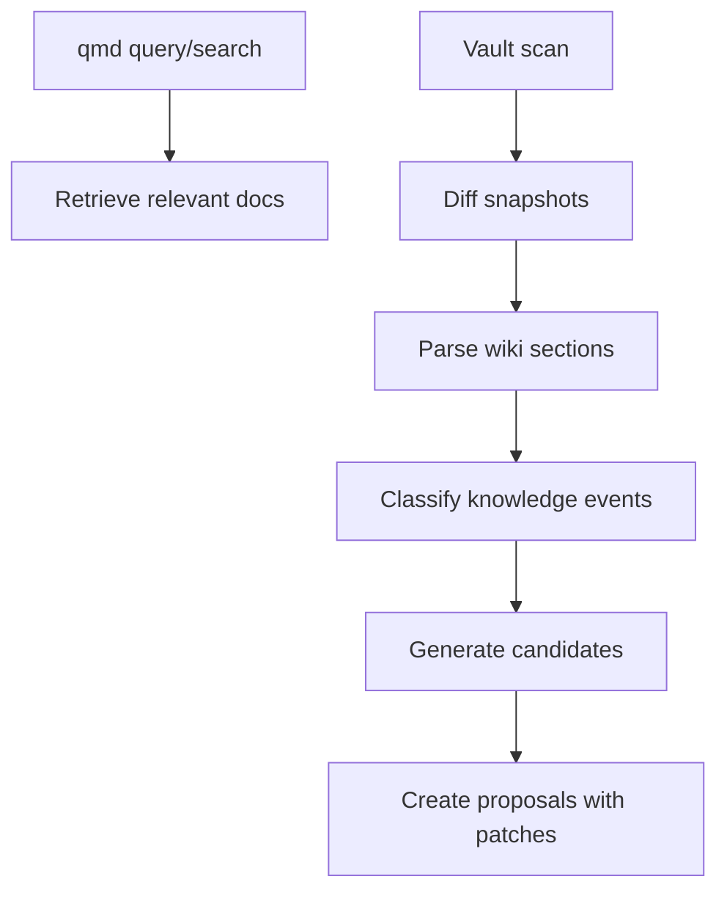
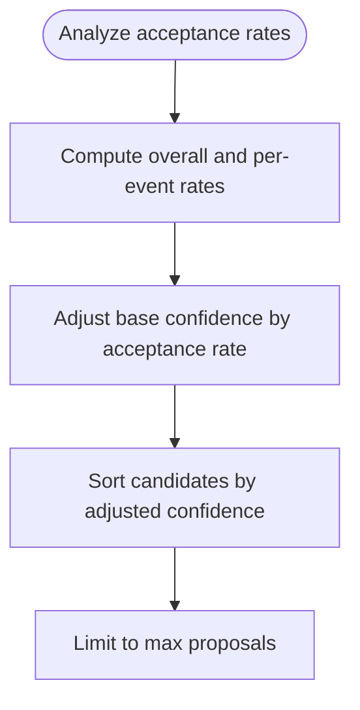
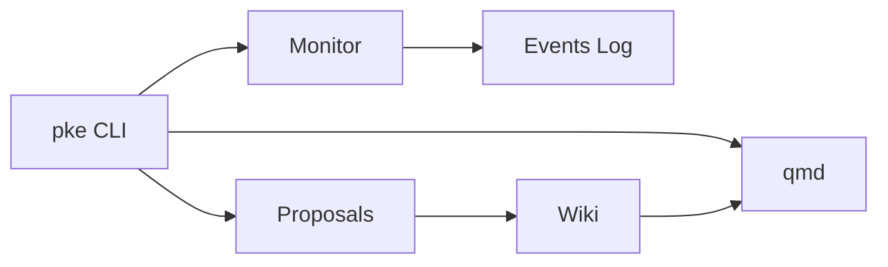

# Knowledge Compilation Commands

<cite>
**Referenced Files in This Document**
- [README.md](file://README.md)
- [package.json](file://package.json)
- [scripts/pke.mjs](file://scripts/pke.mjs)
- [docs/prd.md](file://docs/prd.md)
- [docs/agent-workflow.md](file://docs/agent-workflow.md)
- [skills/personal-knowledge-engine.SKILL.md](file://skills/personal-knowledge-engine.SKILL.md)
</cite>

## Table of Contents
1. [Introduction](#introduction)
2. [Project Structure](#project-structure)
3. [Core Components](#core-components)
4. [Architecture Overview](#architecture-overview)
5. [Detailed Component Analysis](#detailed-component-analysis)
6. [Dependency Analysis](#dependency-analysis)
7. [Performance Considerations](#performance-considerations)
8. [Troubleshooting Guide](#troubleshooting-guide)
9. [Conclusion](#conclusion)
10. [Appendices](#appendices)

## Introduction
This document explains the knowledge compilation commands that transform evidence into structured knowledge through a proposal-only system. It covers:
- The compile command for targeted knowledge updates
- The stale command for identifying outdated information
- The candidates command for discovering compilation opportunities
- The proposal-only architecture and how compilation requires explicit user approval before wiki updates occur
- The relationship between semantic search, event detection, and proposal generation
- Examples of different compilation scenarios
- Sensitivity levels for staleness detection
- Integration with the qmd semantic search engine
- The confidence scoring system and how it affects proposal prioritization

## Project Structure
The Personal Knowledge Engine MVP is a local-first system centered on a small CLI that orchestrates:
- Evidence capture and storage under raw/
- Structured knowledge pages under wiki/
- A qmd-backed semantic search and indexing layer
- A proposal-and-approval pipeline for controlled wiki updates

**Diagram sources**
- [README.md:43-54](file://README.md#L43-L54)
- [docs/prd.md:430-452](file://docs/prd.md#L430-L452)

**Section sources**
- [README.md:1-211](file://README.md#L1-L211)
- [docs/prd.md:428-507](file://docs/prd.md#L428-L507)

## Core Components
- CLI commands for capture, compile, stale review, candidates discovery, and proposal management
- qmd integration for semantic search and indexing
- Monitor and event detection pipeline that classifies knowledge changes
- Proposal-only workflow that generates append-only patch operations targeting safe wiki sections
- Governance rules that prevent silent wiki writes and require explicit approval

Key capabilities:
- Evidence capture without altering wiki
- Retrieval via qmd query
- Proposal-only compile with change reports
- Daily compilation and staleness review
- Dashboard for monitoring and approvals

**Section sources**
- [README.md:56-80](file://README.md#L56-L80)
- [docs/prd.md:189-201](file://docs/prd.md#L189-L201)

## Architecture Overview
The system follows a proposal-only architecture:
- Monitor detects file and knowledge events
- Candidates are generated from compile-trigger events
- Proposals are created with exact patch operations targeting safe sections
- User approval gates wiki writes
- qmd is refreshed after approved changes

**Diagram sources**
- [scripts/pke.mjs:508-547](file://scripts/pke.mjs#L508-L547)
- [scripts/pke.mjs:549-560](file://scripts/pke.mjs#L549-L560)
- [scripts/pke.mjs:1454-1481](file://scripts/pke.mjs#L1454-L1481)
- [scripts/pke.mjs:1603-1633](file://scripts/pke.mjs#L1603-L1633)

## Detailed Component Analysis

### Compile Command
The compile command queries the qmd collection for topic context, scans the vault before and after to detect changes, diffs against the saved baseline, and produces a change report. In the MVP, compile is proposal-only and does not write wiki pages.

- Query context via qmd query
- Scan vault pre/post to detect changes
- Diff against baseline to compute “changed since baseline”
- Produce a change report with counts and unresolved items
- Output next-step instructions to review and approve an exact update

**Diagram sources**
- [scripts/pke.mjs:355-394](file://scripts/pke.mjs#L355-L394)

**Section sources**
- [scripts/pke.mjs:355-394](file://scripts/pke.mjs#L355-L394)
- [docs/prd.md:356-375](file://docs/prd.md#L356-L375)

### Stale Command
The stale command reviews topics for outdated claims. It supports sensitivity levels:
- low: searches for stale and risky
- medium: searches for stale, risky, and claims
- high: searches for stale, risky, claims, assumptions, outdated, deprecated, superseded

It prints a proposal-only context report and does not write wiki pages.

**Diagram sources**
- [scripts/pke.mjs:420-438](file://scripts/pke.mjs#L420-L438)

**Section sources**
- [scripts/pke.mjs:420-438](file://scripts/pke.mjs#L420-L438)
- [docs/prd.md:377-399](file://docs/prd.md#L377-L399)

### Candidates Command
The candidates command lists compile-trigger events that can trigger proposals. It filters recent events by compile-trigger types, shows reasons and suggested targets, and sorts by adjusted confidence.

- Filter events by compile-trigger types
- Map to candidate objects with reason and suggested target
- Adjust confidence by historical acceptance rates
- Sort by adjusted confidence (high to low)

**Diagram sources**
- [scripts/pke.mjs:508-547](file://scripts/pke.mjs#L508-L547)
- [scripts/pke.mjs:930-979](file://scripts/pke.mjs#L930-L979)

**Section sources**
- [scripts/pke.mjs:508-547](file://scripts/pke.mjs#L508-L547)
- [docs/prd.md:264-283](file://docs/prd.md#L264-L283)

### Proposal System and Approval Workflow
Proposals are created from monitor events or raw evidence and contain exact patch operations targeting safe wiki sections. Approval gates wiki writes.

- Create proposal from event or path
- Build safe patch operations (append-only)
- Store proposal in .pke/proposals/
- Apply: backup target, apply patch, update status, refresh qmd
- Reject: set status to rejected and archive

**Diagram sources**
- [scripts/pke.mjs:549-560](file://scripts/pke.mjs#L549-L560)
- [scripts/pke.mjs:1454-1481](file://scripts/pke.mjs#L1454-L1481)
- [scripts/pke.mjs:1603-1633](file://scripts/pke.mjs#L1603-L1633)

**Section sources**
- [scripts/pke.mjs:549-560](file://scripts/pke.mjs#L549-L560)
- [scripts/pke.mjs:1454-1481](file://scripts/pke.mjs#L1454-L1481)
- [scripts/pke.mjs:1603-1633](file://scripts/pke.mjs#L1603-L1633)
- [docs/prd.md:638-696](file://docs/prd.md#L638-L696)

### Semantic Search, Event Detection, and Proposal Generation
The system integrates qmd for semantic search and builds a knowledge event log. Events are classified by wiki section and trigger compile candidates and proposals.

- qmd query for retrieval
- Monitor compares snapshots and parses wiki sections
- Classify events: conclusion_added, conflict_detected, stale_claim_detected, open_question_added, evidence_* events
- Generate candidates and proposals with safe patch operations

**Diagram sources**
- [scripts/pke.mjs:812-822](file://scripts/pke.mjs#L812-L822)
- [scripts/pke.mjs:1313-1362](file://scripts/pke.mjs#L1313-L1362)
- [scripts/pke.mjs:1421-1452](file://scripts/pke.mjs#L1421-L1452)

**Section sources**
- [scripts/pke.mjs:812-822](file://scripts/pke.mjs#L812-L822)
- [scripts/pke.mjs:1313-1362](file://scripts/pke.mjs#L1313-L1362)
- [docs/agent-workflow.md:92-148](file://docs/agent-workflow.md#L92-L148)

### Confidence Scoring and Proposal Prioritization
Confidence is adjusted by historical acceptance rates and used to prioritize proposals. The system:
- Analyzes acceptance rates by event type and overall
- Adjusts base confidence to a multiplicative range
- Sorts candidates by adjusted confidence (high to low)
- Limits daily proposals to a maximum count

**Diagram sources**
- [scripts/pke.mjs:930-979](file://scripts/pke.mjs#L930-L979)
- [scripts/pke.mjs:1140-1151](file://scripts/pke.mjs#L1140-L1151)

**Section sources**
- [scripts/pke.mjs:930-979](file://scripts/pke.mjs#L930-L979)
- [scripts/pke.mjs:1140-1151](file://scripts/pke.mjs#L1140-L1151)

### Examples of Different Compilation Scenarios
- Raw evidence changed: propose Evidence and Open Questions entries
- Conflict detected: propose Conflicts / Evolution entry
- Stale claim detected: propose Stale Or Risky Claims entry
- Open question added: propose Open Questions entry
- Conclusion changed: propose Current Understanding update

These scenarios produce exact, append-only patch operations targeting safe sections.

**Section sources**
- [scripts/pke.mjs:1483-1524](file://scripts/pke.mjs#L1483-L1524)
- [docs/prd.md:638-696](file://docs/prd.md#L638-L696)

## Dependency Analysis
High-level dependencies:
- pke CLI depends on qmd for indexing and retrieval
- Monitor depends on vault snapshots and wiki section parsing
- Proposal system depends on event log and acceptance rate analysis
- Governance enforces approval gates and append-only writes

**Diagram sources**
- [scripts/pke.mjs:812-822](file://scripts/pke.mjs#L812-L822)
- [scripts/pke.mjs:1313-1362](file://scripts/pke.mjs#L1313-L1362)
- [scripts/pke.mjs:1454-1481](file://scripts/pke.mjs#L1454-L1481)

**Section sources**
- [scripts/pke.mjs:812-822](file://scripts/pke.mjs#L812-L822)
- [scripts/pke.mjs:1313-1362](file://scripts/pke.mjs#L1313-L1362)
- [scripts/pke.mjs:1454-1481](file://scripts/pke.mjs#L1454-L1481)

## Performance Considerations
- File size limits and snapshot diffs keep scans efficient
- Scoped monitoring reduces overhead by focusing on specific paths
- Event log rotation and report retention manage long-term storage
- Daily proposal limits and confidence-based sorting reduce noise

[No sources needed since this section provides general guidance]

## Troubleshooting Guide
Common issues and resolutions:
- qmd failures: Verify qmd status and PATH configuration
- Missing targets: Ensure target wiki page exists before applying proposals
- Oversized files: Skip files larger than the configured limit
- Excessive pending proposals: Review and act on older proposals to stay within limits

**Section sources**
- [scripts/pke.mjs:812-822](file://scripts/pke.mjs#L812-L822)
- [scripts/pke.mjs:1603-1633](file://scripts/pke.mjs#L1603-L1633)
- [scripts/pke.mjs:824-874](file://scripts/pke.mjs#L824-L874)
- [scripts/pke.mjs:1559-1567](file://scripts/pke.mjs#L1559-L1567)

## Conclusion
The Personal Knowledge Engine MVP implements a proposal-only architecture that transforms evidence into structured knowledge through controlled, approval-gated updates. The compile, stale, and candidates commands integrate qmd semantic search and event detection to surface compilation opportunities while maintaining strict governance. Confidence scoring and prioritization help users focus on high-value updates, and the append-only patch system ensures wiki integrity.

[No sources needed since this section summarizes without analyzing specific files]

## Appendices

### Appendix A: Command Reference
- pke compile "topic": Proposal-only compile plan with change report
- pke stale "topic" [--sensitivity low|medium|high]: Staleness review with tunable sensitivity
- pke candidates: List compile-trigger events with adjusted confidence
- pke propose --event <id> or --path <file> [--target <wiki-page>]: Create exact proposal
- pke proposals / proposal <id>: Manage proposals
- pke apply <id> / reject <id>: Approval and rejection workflow

**Section sources**
- [README.md:56-80](file://README.md#L56-L80)
- [scripts/pke.mjs:508-560](file://scripts/pke.mjs#L508-L560)

### Appendix B: Governance and Safety
- Raw files are evidence and rarely edited
- Wiki writes require explicit update clues
- Proposal-only compile in MVP
- Append-only patch operations target safe sections
- Backups and qmd refresh after approved changes

**Section sources**
- [README.md:82-94](file://README.md#L82-L94)
- [docs/prd.md:356-375](file://docs/prd.md#L356-L375)
- [skills/personal-knowledge-engine.SKILL.md:64-79](file://skills/personal-knowledge-engine.SKILL.md#L64-L79)