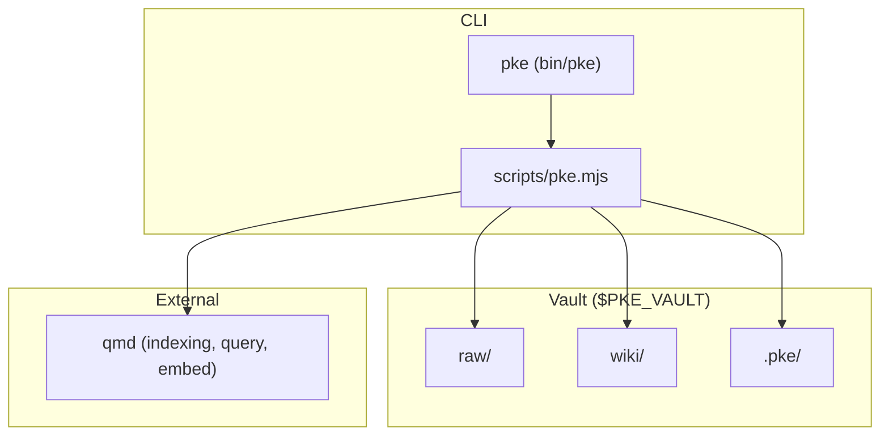
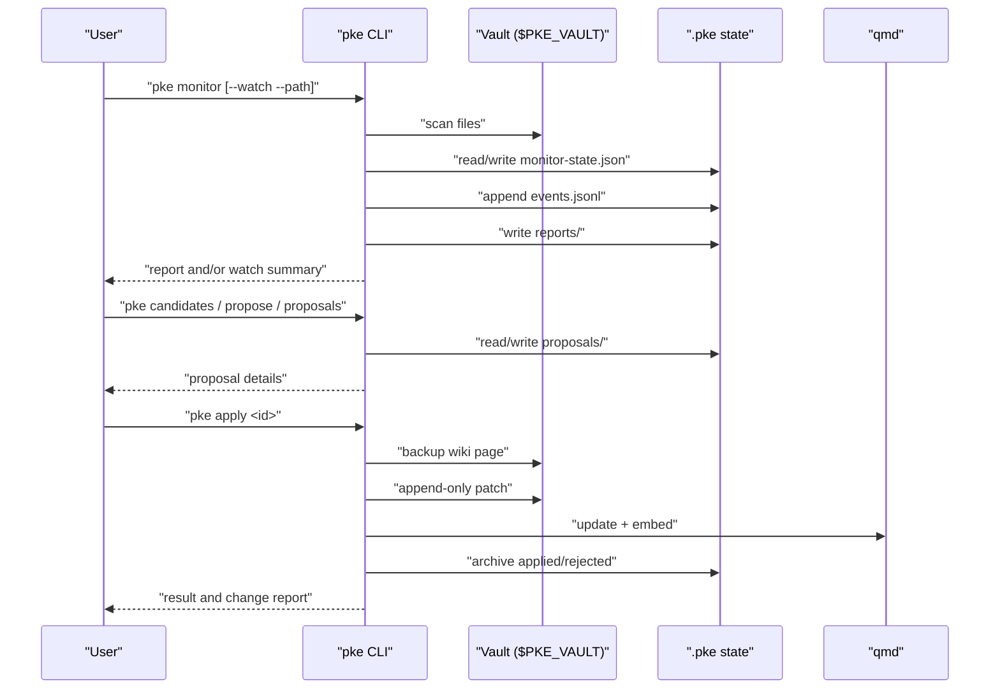
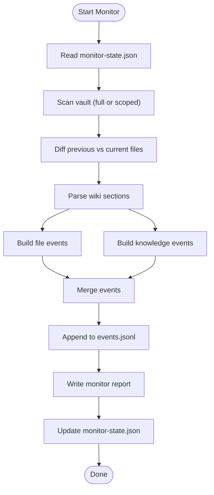
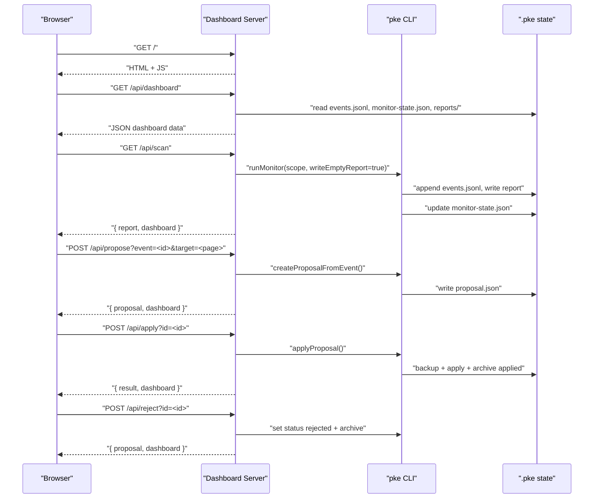
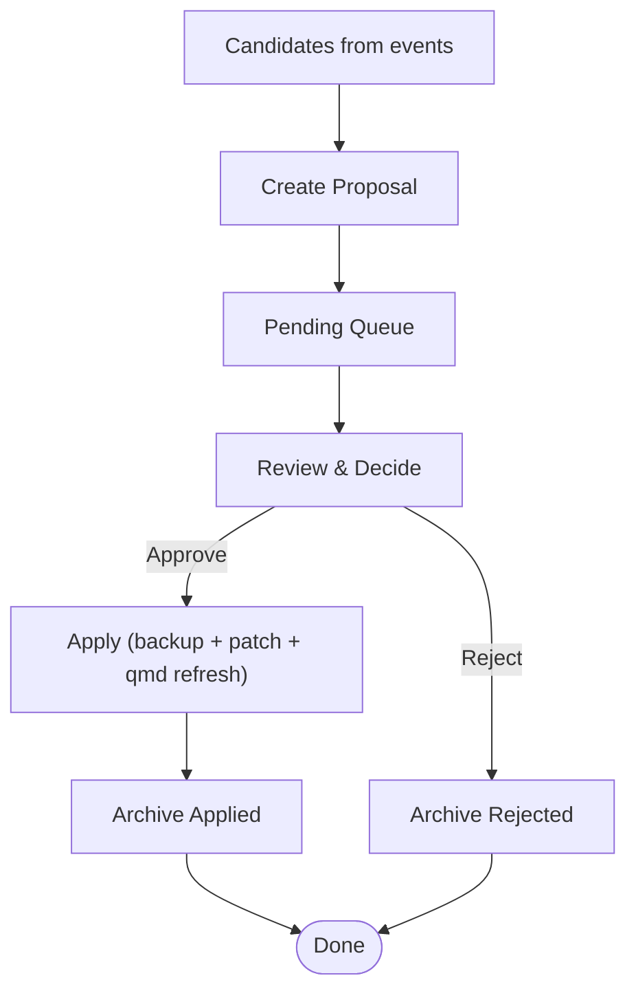
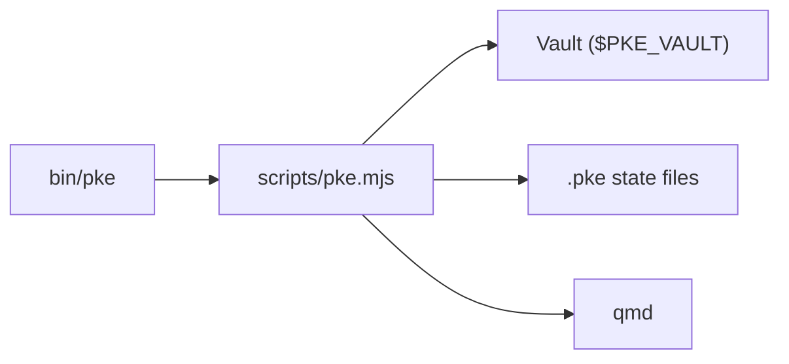

# Monitoring and Proposal Management

<cite>
**Referenced Files in This Document**
- [README.md](file://README.md)
- [package.json](file://package.json)
- [bin/pke](file://bin/pke)
- [scripts/pke.mjs](file://scripts/pke.mjs)
- [docs/prd.md](file://docs/prd.md)
- [docs/agent-workflow.md](file://docs/agent-workflow.md)
- [skills/personal-knowledge-engine.SKILL.md](file://skills/personal-knowledge-engine.SKILL.md)
</cite>

## Table of Contents
1. [Introduction](#introduction)
2. [Project Structure](#project-structure)
3. [Core Components](#core-components)
4. [Architecture Overview](#architecture-overview)
5. [Detailed Component Analysis](#detailed-component-analysis)
6. [Dependency Analysis](#dependency-analysis)
7. [Performance Considerations](#performance-considerations)
8. [Troubleshooting Guide](#troubleshooting-guide)
9. [Conclusion](#conclusion)
10. [Appendices](#appendices)

## Introduction
This document explains the monitoring and proposal management capabilities that enable continuous observation and governance of the knowledge system. It covers:
- The monitor command for file system watching and event detection
- The events command for viewing recent knowledge changes
- The report command for usage analytics
- The dashboard command for a web-based management interface
- The proposal lifecycle: creation, review, approval, and rejection
- Batch-safe approval for high-confidence append-only updates
- Safety controls preventing unauthorized wiki modifications

It also provides practical examples for setting up continuous monitoring, interpreting event logs, and managing proposal queues via both CLI and dashboard.

## Project Structure
The project is a local-first knowledge engine with a small CLI and a browser dashboard. The CLI orchestrates vault scanning, event detection, proposal generation, and wiki updates under strict governance. The dashboard visualizes events, proposals, and reports.

**Diagram sources**
- [bin/pke](file://bin/pke)
- [scripts/pke.mjs](file://scripts/pke.mjs)
- [docs/prd.md](file://docs/prd.md)

**Section sources**
- [README.md](file://README.md)
- [package.json](file://package.json)
- [bin/pke](file://bin/pke)
- [scripts/pke.mjs](file://scripts/pke.mjs)
- [docs/prd.md](file://docs/prd.md)

## Core Components
- Monitor and event detection: scans vault snapshots, diffs files, parses wiki sections, emits semantic events, persists events and reports, and supports scoped polling watch mode.
- Proposal lifecycle: candidates discovery, proposal creation from events, listing and inspection, approval (including batch-safe), and rejection with archival.
- Dashboard: local HTTP server serving metrics, event stream, proposal queue, and report listing; supports manual scan and auto-scan modes.
- Usage analytics: generates usage reports with event and proposal counts, approval rates, and top topics.

**Section sources**
- [README.md](file://README.md)
- [scripts/pke.mjs](file://scripts/pke.mjs)
- [docs/prd.md](file://docs/prd.md)

## Architecture Overview
The engine operates a closed-loop:
- Capture evidence into raw/
- Monitor vault for file and knowledge events
- Generate compile candidates and proposals
- Require explicit user approval before applying append-only wiki updates
- Refresh qmd index and embeddings after approved changes
- Visualize state via CLI and dashboard

**Diagram sources**
- [scripts/pke.mjs](file://scripts/pke.mjs)
- [docs/prd.md](file://docs/prd.md)

## Detailed Component Analysis

### Monitor and Event Detection
- One-shot monitor: compares current vault snapshot to previous monitor state, diffs files, parses wiki sections, builds semantic events, appends to events log, writes a markdown report, and updates monitor-state.json.
- Scoped polling watch mode: validates scope, enforces that watch requires a vault-relative path, and polls at a configurable interval (default ~2 seconds), printing summaries when events occur or when verbose mode is enabled.
- Event types include file-level (raw/wiki added/modified/removed) and knowledge-level (conclusion_added, conclusion_changed, conflict_detected, stale_claim_detected, open_question_added, evidence_added/evidence_link_added, knowledge_section_updated).
- Event persistence: events.jsonl is append-only; older events are archived when exceeding a threshold. Reports are retained with a time-based archive policy.

**Diagram sources**
- [scripts/pke.mjs](file://scripts/pke.mjs)

**Section sources**
- [README.md](file://README.md)
- [scripts/pke.mjs](file://scripts/pke.mjs)
- [docs/prd.md](file://docs/prd.md)

### Events Command
- Lists recent events from events.jsonl with a configurable limit.
- Outputs human-readable summaries and supports JSON output for scripting.

**Section sources**
- [scripts/pke.mjs](file://scripts/pke.mjs)

### Report Command
- Usage analytics: computes totals, approval rate, compile velocity, and top topics over a configurable time window.
- Historical reports: prints latest or today’s reports from the reports directory.

**Section sources**
- [scripts/pke.mjs](file://scripts/pke.mjs)
- [docs/prd.md](file://docs/prd.md)

### Dashboard Command
- Starts a local HTTP server with:
  - Metrics: event totals, scan counts, conflicts, stale claims, open questions
  - Latest scan events and activity events
  - Pending proposals with actions to create, approve, or reject
  - Report listing
- Supports manual scan via API and optional auto-scan mode to scope scanning on refresh.

**Diagram sources**
- [scripts/pke.mjs](file://scripts/pke.mjs)

**Section sources**
- [README.md](file://README.md)
- [scripts/pke.mjs](file://scripts/pke.mjs)

### Proposal Lifecycle
- Candidate discovery: compile-trigger events are mapped to candidates with reasons and suggested targets.
- Proposal creation: from an event or a raw file path, with a patch targeting safe wiki sections (Evidence, Open Questions, Conflicts / Evolution, Stale Or Risky Claims).
- Proposal queue: pending proposals are listed and inspected; each proposal includes detected signals and exact patch operations.
- Approval: apply writes backups, applies append-only patch operations, updates proposal status, and attempts qmd refresh; supports batch-safe approval for high-confidence proposals.
- Rejection: sets status to rejected and archives the proposal.

**Diagram sources**
- [scripts/pke.mjs](file://scripts/pke.mjs)
- [docs/prd.md](file://docs/prd.md)

**Section sources**
- [scripts/pke.mjs](file://scripts/pke.mjs)
- [docs/prd.md](file://docs/prd.md)

### Batch-Safe Approval System
- Eligibility: a proposal qualifies for fast-path if it is high confidence and contains only append-only operations to safe sections (Evidence, Open Questions, Related Pages).
- Single proposal: checks eligibility and applies immediately, logging the action as batch-safe.
- Batch mode: enumerates pending proposals, filters to safe ones, applies each, and reports counts and errors.

**Section sources**
- [scripts/pke.mjs](file://scripts/pke.mjs)

### Safety Controls
- Proposal-only writes: wiki updates are never performed automatically; they require explicit approval.
- Append-only patches: only append-to-section operations are supported; no destructive rewrites.
- Backups: pre-apply backup of target wiki pages is created and archived.
- Governance gates: compile requires explicit user command, approval, session close permission, or scheduled review.
- Scope enforcement: watch mode requires a vault-relative path; monitor path must remain inside the vault.

**Section sources**
- [README.md](file://README.md)
- [scripts/pke.mjs](file://scripts/pke.mjs)
- [docs/prd.md](file://docs/prd.md)

## Dependency Analysis
- CLI entrypoint: bin/pke invokes scripts/pke.mjs.
- Internal dependencies: scripts/pke.mjs orchestrates vault scanning, state management, event building, proposal creation, and dashboard server.
- External dependency: qmd for indexing, querying, and embedding.

**Diagram sources**
- [bin/pke](file://bin/pke)
- [scripts/pke.mjs](file://scripts/pke.mjs)

**Section sources**
- [package.json](file://package.json)
- [bin/pke](file://bin/pke)
- [scripts/pke.mjs](file://scripts/pke.mjs)

## Performance Considerations
- Scoped polling: watch mode uses polling rather than OS-native watchers to ensure consistent behavior across environments.
- File size limits: oversize files are skipped to avoid heavy IO.
- Event rotation: caps event log length and archives older entries.
- Report retention: archives reports older than a threshold to control storage growth.
- Rate limiting: daily proposal generation caps the number of candidates and prioritizes by confidence and evidence.

[No sources needed since this section provides general guidance]

## Troubleshooting Guide
- Monitor watch requires a scoped path: ensure --path is provided and resolves inside the vault.
- Oversized files: monitor skips files larger than the configured limit; reduce file size or split content.
- Proposal not found: verify proposal ID exists in the proposals directory.
- Target page missing: ensure the target wiki page exists before applying a proposal.
- qmd failures: after apply, qmd update/embed may fail; the wiki patch is still applied, and failures are recorded in the change report.

**Section sources**
- [scripts/pke.mjs](file://scripts/pke.mjs)

## Conclusion
The monitoring and proposal management system provides a robust, governed pipeline for evolving knowledge safely. Continuous observation via monitor and dashboard keeps stakeholders informed, while proposal-only, append-only updates and batch-safe approval streamline high-confidence changes. Strict safety controls ensure that wiki pages remain trustworthy and free from unauthorized modifications.

[No sources needed since this section summarizes without analyzing specific files]

## Appendices

### Practical Examples

- Set up continuous monitoring
  - One-shot: run the monitor command to produce a report and update state.
  - Realtime watch: run monitor with watch mode and a scoped path; it polls at a fixed interval and prints summaries when events occur.
  - Scope and safety: watch requires --path and must point to a vault-relative path; monitor path must stay inside the vault.

- Interpret event logs
  - Use the events command to list recent events with a limit.
  - Review semantic event types to understand knowledge changes (conclusions, conflicts, stale claims, open questions).
  - Use the report command to generate usage analytics and historical reports.

- Manage proposal queues
  - Inspect candidates and create proposals from events or raw files.
  - Review pending proposals, approve or reject them, and track archived outcomes.
  - Use batch-safe approval for high-confidence proposals to accelerate safe updates.

**Section sources**
- [README.md](file://README.md)
- [scripts/pke.mjs](file://scripts/pke.mjs)
- [docs/prd.md](file://docs/prd.md)
- [skills/personal-knowledge-engine.SKILL.md](file://skills/personal-knowledge-engine.SKILL.md)