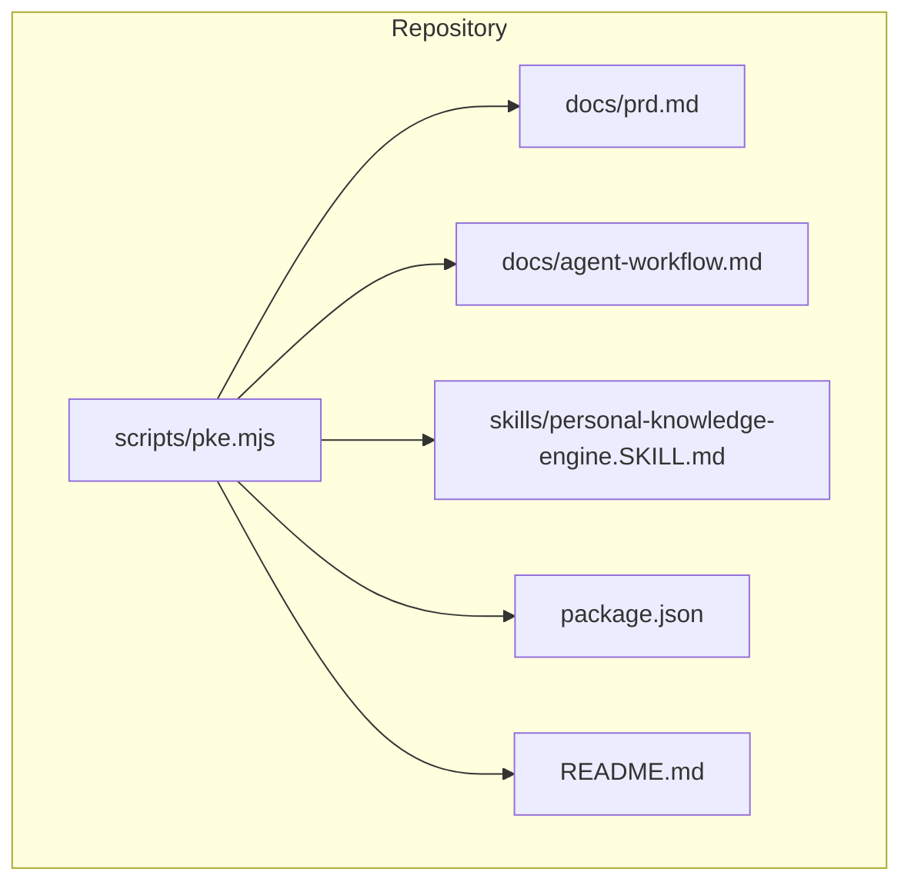
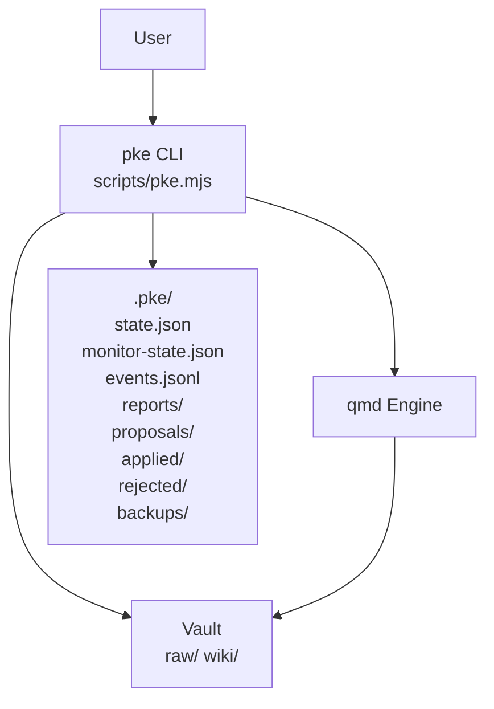
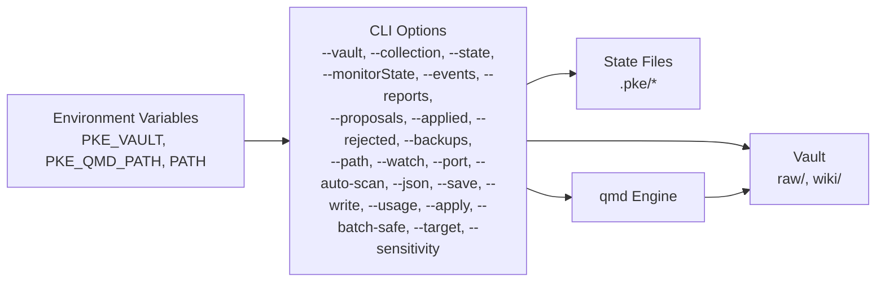

# Configuration and Customization

<cite>
**Referenced Files in This Document**
- [README.md](file://README.md)
- [package.json](file://package.json)
- [scripts/pke.mjs](file://scripts/pke.mjs)
- [docs/prd.md](file://docs/prd.md)
- [docs/agent-workflow.md](file://docs/agent-workflow.md)
- [skills/personal-knowledge-engine.SKILL.md](file://skills/personal-knowledge-engine.SKILL.md)
</cite>

## Table of Contents
1. [Introduction](#introduction)
2. [Project Structure](#project-structure)
3. [Core Components](#core-components)
4. [Architecture Overview](#architecture-overview)
5. [Detailed Component Analysis](#detailed-component-analysis)
6. [Dependency Analysis](#dependency-analysis)
7. [Performance Considerations](#performance-considerations)
8. [Troubleshooting Guide](#troubleshooting-guide)
9. [Conclusion](#conclusion)
10. [Appendices](#appendices)

## Introduction
This document explains how to configure and customize the Personal Knowledge Engine (PKE) for local-first knowledge workflows. It covers environment variables, CLI options, state file management, vault layout, and proposal workflows. It also provides guidance on monitoring paths, templates, and security considerations, along with examples and migration notes.

## Project Structure
PKE is a CLI-driven system with a single-file implementation and a minimal set of configuration mechanisms:
- CLI entrypoint and implementation: scripts/pke.mjs
- Documentation: docs/prd.md, docs/agent-workflow.md
- Skill definition for agent orchestration: skills/personal-knowledge-engine.SKILL.md
- Package metadata: package.json
- Project README: README.md

**Diagram sources**
- [scripts/pke.mjs](file://scripts/pke.mjs)
- [docs/prd.md](file://docs/prd.md)
- [docs/agent-workflow.md](file://docs/agent-workflow.md)
- [skills/personal-knowledge-engine.SKILL.md](file://skills/personal-knowledge-engine.SKILL.md)
- [package.json](file://package.json)
- [README.md](file://README.md)

**Section sources**
- [README.md](file://README.md)
- [package.json](file://package.json)

## Core Components
- Environment variables
  - PKE_VAULT: Vault root directory (default: ~/MyKnowledge)
  - PKE_QMD_PATH: Directory containing the qmd binary (default: /opt/homebrew/bin)
  - PATH: Ensures qmd is discoverable; the CLI prepends PKE_QMD_PATH to PATH when invoking qmd
- CLI options
  - --vault <path>, --collection <name>, --state <path>, --monitorState <path>, --events <path>, --reports <dir>, --proposals <dir>, --applied <dir>, --rejected <dir>, --backups <dir>
  - --path <vault-relative-path>, --watch, --port <number>, --auto-scan, --json, --save, --write, --usage, --apply, --batch-safe, --target <path>, --sensitivity <low|medium|high>
- Derived paths
  - $PKE_VAULT/.pke/ and subdirectories for state, events, reports, proposals, backups, applied, rejected
  - $PKE_VAULT/wiki/ and $PKE_VAULT/raw/ for knowledge and evidence
- State files
  - state.json: baseline and tracked files
  - monitor-state.json: incremental monitor snapshot and section state
  - events.jsonl: append-only event log
  - reports/: timestamped markdown reports
  - proposals/, applied/, rejected/, backups/: proposal lifecycle and backups

**Section sources**
- [scripts/pke.mjs](file://scripts/pke.mjs)
- [docs/prd.md](file://docs/prd.md)

## Architecture Overview
PKE orchestrates capture, compile, and use workflows around a vault with raw and wiki directories. The CLI coordinates with qmd for indexing and retrieval, maintains state files under .pke/, and exposes a dashboard for monitoring and proposal management.

**Diagram sources**
- [scripts/pke.mjs](file://scripts/pke.mjs)
- [docs/prd.md](file://docs/prd.md)

## Detailed Component Analysis

### Environment Variables and Defaults
- PKE_VAULT
  - Purpose: Root of the knowledge vault
  - Default: ~/MyKnowledge
  - Override: --vault <path> CLI option
- PKE_QMD_PATH
  - Purpose: Directory containing the qmd binary
  - Default: /opt/homebrew/bin
  - Override: PATH manipulation in the CLI; the CLI spawns qmd with PATH prepended by PKE_QMD_PATH
- PATH
  - Purpose: Ensures qmd availability
  - Behavior: The CLI augments PATH to include PKE_QMD_PATH for qmd invocations

Notes:
- There is no separate configuration file in the MVP; all configuration is via environment variables and CLI flags.
- Supported file extensions for vault scanning: .md, .txt, .markdown
- Files and directories starting with "." (except .pke) are excluded from vault scans.

**Section sources**
- [scripts/pke.mjs](file://scripts/pke.mjs)
- [docs/prd.md](file://docs/prd.md)

### CLI Options and Overrides
Commonly used options:
- --vault <path>: Vault root override
- --collection <name>: qmd collection name override
- --state <path>: state.json path override
- --monitorState <path>, --events <path>, --reports <dir>, --proposals <dir>, --applied <dir>, --rejected <dir>, --backups <dir>: Derived paths overrides
- --path <vault-relative-path>: Scope monitor/watch to a vault-relative path
- --watch: Watch a scoped path with polling
- --port <number>, --auto-scan: Dashboard options
- --json, --save, --write, --usage, --apply, --batch-safe, --target <path>, --sensitivity <low|medium|high>

Override precedence:
- CLI flags override environment variables and defaults
- Derived paths are computed from --state or default vault path

**Section sources**
- [scripts/pke.mjs](file://scripts/pke.mjs)
- [docs/prd.md](file://docs/prd.md)

### State File Management
- state.json
  - Tracks baselineAt and a snapshot of tracked files
  - Fields include file metadata (kind, size, mtimeMs, sha256)
- monitor-state.json
  - Incremental monitor snapshot
  - Includes files, wikiSections, removedFiles, and latest reports
- events.jsonl
  - Append-only event log; supports rotation when exceeding a threshold
- reports/
  - Timestamped markdown reports; subject to retention policies
- proposals/, applied/, rejected/, backups/
  - Proposal lifecycle and pre-apply backups

Operational details:
- The CLI reads and writes these files as needed
- Event log rotation and report retention are handled automatically
- Proposal caps and dashboard data aggregation rely on these files

**Section sources**
- [scripts/pke.mjs](file://scripts/pke.mjs)
- [docs/prd.md](file://docs/prd.md)

### Vault Structure Requirements
- $PKE_VAULT/raw/
  - Evidence files (e.g., captures, transcripts, articles)
- $PKE_VAULT/wiki/
  - Knowledge pages following the 7-section template
- $PKE_VAULT/.pke/
  - Engine state and artifacts (state.json, monitor-state.json, events.jsonl, reports/, proposals/, applied/, rejected/, backups/)

Scanning rules:
- Supported extensions: .md, .txt, .markdown
- Ignore files/directories starting with "." (except .pke)

**Section sources**
- [docs/prd.md](file://docs/prd.md)

### Templates and Compliance
- Wiki pages must follow a 7-section template:
  - Current Understanding
  - Key Principles
  - Evidence
  - Conflicts / Evolution
  - Stale Or Risky Claims
  - Open Questions
  - Related Pages
- Compliance is checked via pke status; missing sections are reported

**Section sources**
- [docs/prd.md](file://docs/prd.md)

### Monitoring Paths and Real-time Watch
- pke monitor
  - One-shot scan comparing current files against previous monitor snapshot
- pke monitor --path <vault-relative-path>
  - Scope to a vault-relative path; out-of-scope files are not reported as removed
- pke monitor --watch --path <vault-relative-path>
  - Enter scoped polling mode; watch requires a path inside the vault
- Dashboard
  - Supports auto-scan and filtering by event type

**Section sources**
- [scripts/pke.mjs](file://scripts/pke.mjs)
- [docs/prd.md](file://docs/prd.md)

### Proposal Workflows
- Candidate generation
  - From changed files and monitor events
  - Confidence and reasons are computed
- Proposal creation
  - Exact patch operations targeting safe sections (Evidence, Open Questions, Conflicts / Evolution, Stale Or Risky Claims)
- Approval and application
  - pke apply <id> writes backups, applies patch, updates proposal status, and refreshes qmd
  - Batch-safe approval for high-confidence, append-only proposals
- Rejection and archival
  - pke reject <id> moves proposals to rejected directory

**Section sources**
- [scripts/pke.mjs](file://scripts/pke.mjs)
- [docs/prd.md](file://docs/prd.md)

### Configuration File Formats and Defaults
- state.json
  - Baseline and file metadata snapshot
- events.jsonl
  - JSON objects per line with fields: id, time, event_type, path, kind, source, summary, approval_status, and optional section/line
- monitor-state.json
  - Snapshot of files, wikiSections, removedFiles, and latest reports
- Proposal JSON
  - Fields include id, createdAt, status, trigger, source_event_ids, source_files, target_page, reason, confidence, detected_signals, and patch with operations

Defaults and derived paths are documented in the CLI help and PRD.

**Section sources**
- [scripts/pke.mjs](file://scripts/pke.mjs)
- [docs/prd.md](file://docs/prd.md)

### Examples of Common Configuration Scenarios
- Change vault root
  - Set PKE_VAULT or use --vault <path>
- Use a custom qmd location
  - Set PKE_QMD_PATH or ensure qmd is on PATH; the CLI prepends PKE_QMD_PATH when invoking qmd
- Monitor a specific wiki subtree
  - pke monitor --path wiki/projectA/
- Watch a scoped path
  - pke monitor --watch --path wiki/
- Dashboard for a specific path with auto-scan
  - pke dashboard --path raw/ --auto-scan
- Generate proposals from monitor events
  - pke candidates
  - pke propose --event <id>
  - pke apply <id>

**Section sources**
- [scripts/pke.mjs](file://scripts/pke.mjs)
- [docs/prd.md](file://docs/prd.md)

### Migration Guidance for Configuration Changes
- Moving from hardcoded paths to environment variables
  - Replace hardcoded vault path with PKE_VAULT; ensure --vault and derived paths remain consistent
- Changing qmd discovery
  - Prefer setting PKE_QMD_PATH or adjusting PATH; verify qmd status via the CLI
- Adopting scoped monitoring
  - Start with --path to limit scope; later add --watch for continuous observation
- Transitioning to dashboard-driven workflows
  - Use --auto-scan for targeted folders; leverage filtering and proposal management from the dashboard

**Section sources**
- [scripts/pke.mjs](file://scripts/pke.mjs)
- [docs/prd.md](file://docs/prd.md)

### Security Considerations and Best Practices
- Keep vault local and restrict write access to trusted processes
- Use backups (pre-apply backups) and version control (e.g., git) for recovery
- Treat raw files as immutable evidence; avoid modifying them except via approved ingestion or mechanical repair
- Enforce approval gates for all wiki updates; rely on proposal-only workflow
- Limit dashboard exposure to localhost or secure networks
- Validate qmd availability and version compatibility

**Section sources**
- [scripts/pke.mjs](file://scripts/pke.mjs)
- [docs/prd.md](file://docs/prd.md)

## Dependency Analysis
PKE’s configuration and customization depend on:
- Environment variables (PKE_VAULT, PKE_QMD_PATH, PATH)
- CLI options overriding defaults and derived paths
- State files (.pke/) for continuity and observability
- qmd for indexing and retrieval

**Diagram sources**
- [scripts/pke.mjs](file://scripts/pke.mjs)
- [docs/prd.md](file://docs/prd.md)

**Section sources**
- [scripts/pke.mjs](file://scripts/pke.mjs)
- [docs/prd.md](file://docs/prd.md)

## Performance Considerations
- Scoped monitoring reduces overhead by limiting scan scope
- Polling intervals can be tuned; default is 2000 ms for watch mode
- Event log rotation and report retention prevent unbounded growth
- JSON output mode enables efficient programmatic consumption

[No sources needed since this section provides general guidance]

## Troubleshooting Guide
- qmd not found or failing
  - Ensure PKE_QMD_PATH is set or qmd is on PATH; the CLI prepends PKE_QMD_PATH when invoking qmd
  - Verify qmd status via the CLI
- Watch mode errors
  - Watch requires --path; the path must be inside the vault
- Proposal errors
  - apply validates: proposal must be pending, must have a target page, and must have patch operations
  - reject and proposal checks ensure proposal file existence
- File system errors
  - Directory creation uses recursive mode; file reads handle missing or corrupt JSON with descriptive messages

**Section sources**
- [scripts/pke.mjs](file://scripts/pke.mjs)
- [docs/prd.md](file://docs/prd.md)

## Conclusion
PKE’s configuration is intentionally minimal: environment variables and CLI flags control vault location, qmd discovery, and derived paths. State files manage continuity and observability, while the proposal-only workflow ensures governance. By scoping monitoring, leveraging the dashboard, and following best practices, teams can operate a robust, local-first knowledge engine.

[No sources needed since this section summarizes without analyzing specific files]

## Appendices

### Appendix A: Environment Variables and CLI Options Summary
- Environment variables
  - PKE_VAULT: Vault root (default: ~/MyKnowledge)
  - PKE_QMD_PATH: qmd binary directory (default: /opt/homebrew/bin)
  - PATH: qmd discovery; CLI prepends PKE_QMD_PATH
- CLI options
  - --vault, --collection, --state, --monitorState, --events, --reports, --proposals, --applied, --rejected, --backups
  - --path, --watch, --port, --auto-scan, --json, --save, --write, --usage, --apply, --batch-safe, --target, --sensitivity

**Section sources**
- [scripts/pke.mjs](file://scripts/pke.mjs)
- [docs/prd.md](file://docs/prd.md)