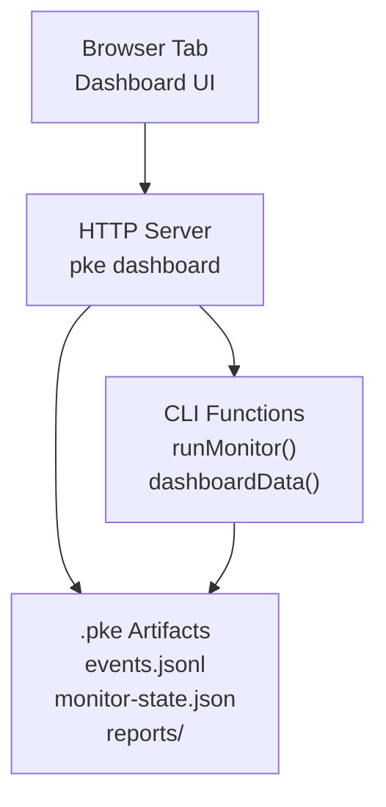
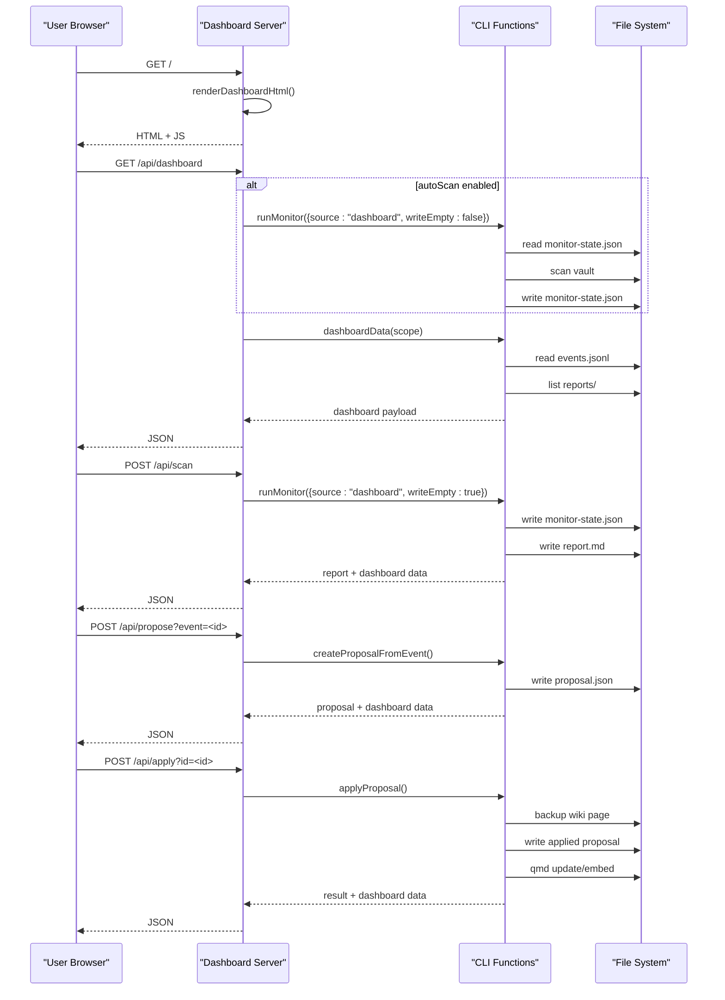
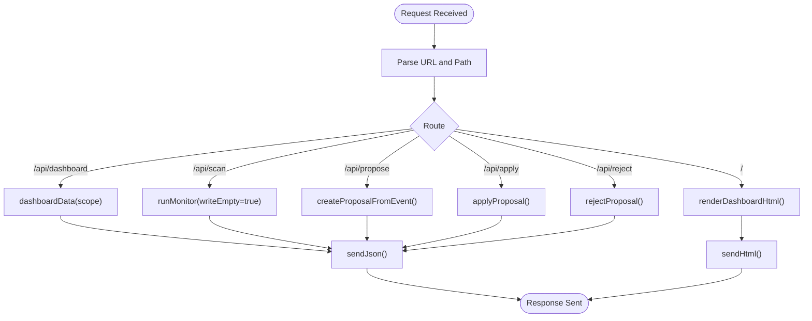
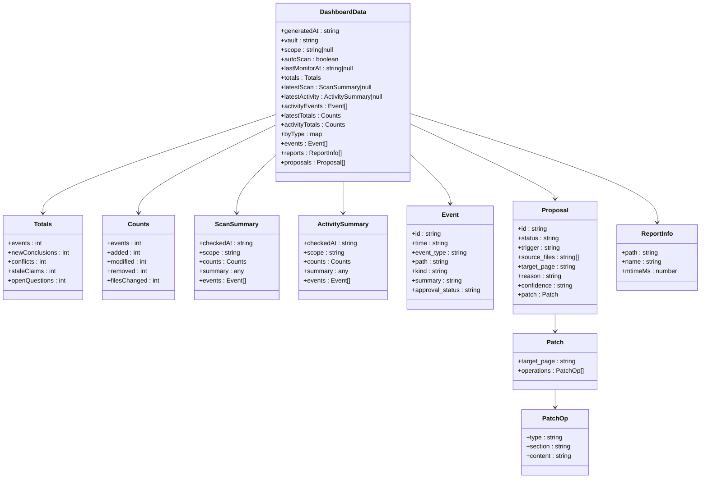
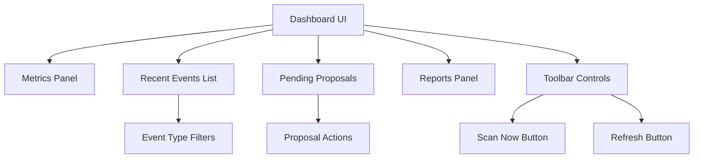
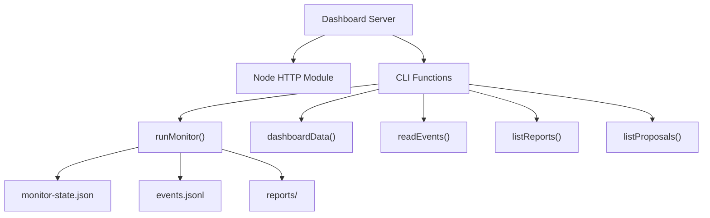

# Dashboard Interface

<cite>
**Referenced Files in This Document**
- [README.md](file://README.md)
- [package.json](file://package.json)
- [pke.mjs](file://scripts/pke.mjs)
- [implementation-notes.md](file://docs/implementation-notes.md)
- [agent-workflow.md](file://docs/agent-workflow.md)
</cite>

## Table of Contents
1. [Introduction](#introduction)
2. [Project Structure](#project-structure)
3. [Core Components](#core-components)
4. [Architecture Overview](#architecture-overview)
5. [Detailed Component Analysis](#detailed-component-analysis)
6. [Dependency Analysis](#dependency-analysis)
7. [Performance Considerations](#performance-considerations)
8. [Troubleshooting Guide](#troubleshooting-guide)
9. [Conclusion](#conclusion)
10. [Appendices](#appendices)

## Introduction
The Personal Knowledge Engine (PKE) dashboard is a browser-based monitoring and approval interface that provides real-time visibility into knowledge management activities. It complements the command-line interface by offering a live view of the knowledge monitor, recent events, conflicts, stale claims, open questions, and pending compile proposals. The dashboard reads local monitor artifacts and supports manual scanning or automatic scanning of a configured path on refresh.

Key capabilities:
- Real-time monitoring display of knowledge events
- Conflict detection and stale claim identification
- Recent events feed with filtering by event type
- Pending compile proposals with approval actions
- Report generation and viewing
- Optional auto-scan mode for scoped paths

## Project Structure
The dashboard is implemented as a standalone HTTP server within the PKE CLI script. It serves a static HTML UI and exposes JSON APIs for data and operations.

**Diagram sources**
- [pke.mjs:674-736](file://scripts/pke.mjs#L674-L736)
- [pke.mjs:1667-1733](file://scripts/pke.mjs#L1667-L1733)

**Section sources**
- [README.md:171-184](file://README.md#L171-L184)
- [implementation-notes.md:66-72](file://docs/implementation-notes.md#L66-L72)

## Core Components
- HTTP server with routing for the dashboard UI and API endpoints
- Dashboard HTML renderer with embedded JavaScript for client-side interactions
- API endpoints for retrieving dashboard data, triggering scans, and managing proposals
- Data aggregation functions that read and summarize monitor artifacts

Dashboard features:
- Metrics panel showing current scan events, modified/removed counts, and historical totals
- Filterable recent events list (conclusions, conflicts, stale, questions)
- Pending proposals panel with actions to create proposals, approve, or reject
- Reports panel listing recent monitor reports
- Toolbar with "Scan Now" and "Refresh" controls

**Section sources**
- [pke.mjs:1735-1918](file://scripts/pke.mjs#L1735-L1918)
- [pke.mjs:1667-1733](file://scripts/pke.mjs#L1667-L1733)

## Architecture Overview
The dashboard architecture consists of a single HTTP server that serves both the UI and APIs. It reads from the PKE state files and generates dynamic content for the browser.

**Diagram sources**
- [pke.mjs:674-736](file://scripts/pke.mjs#L674-L736)
- [pke.mjs:1667-1733](file://scripts/pke.mjs#L1667-L1733)
- [pke.mjs:1454-1481](file://scripts/pke.mjs#L1454-L1481)
- [pke.mjs:1603-1633](file://scripts/pke.mjs#L1603-L1633)

## Detailed Component Analysis

### HTTP Server and Routing
The dashboard server handles multiple routes:
- `/` serves the HTML dashboard
- `/api/dashboard` returns the current dashboard data payload
- `/api/scan` triggers a monitor scan and returns the report plus dashboard data
- `/api/propose` creates a proposal from an event
- `/api/apply` applies a pending proposal
- `/api/reject` rejects a proposal

**Diagram sources**
- [pke.mjs:678-725](file://scripts/pke.mjs#L678-L725)
- [pke.mjs:1920-1928](file://scripts/pke.mjs#L1920-L1928)

**Section sources**
- [pke.mjs:674-736](file://scripts/pke.mjs#L674-L736)

### Dashboard Data Aggregation
The dashboard aggregates data from multiple sources:
- Latest monitor state and reports
- Event log with counts and recent entries
- Pending proposals
- Report listings

**Diagram sources**
- [pke.mjs:1667-1733](file://scripts/pke.mjs#L1667-L1733)

**Section sources**
- [pke.mjs:1667-1733](file://scripts/pke.mjs#L1667-L1733)

### API Endpoints
The dashboard exposes the following endpoints:

- `GET /api/dashboard`: Returns the current dashboard data payload
- `POST /api/scan`: Performs a monitor scan and returns the report plus dashboard data
- `POST /api/propose?event=<id>&target=<page>`: Creates a proposal from an event
- `POST /api/apply?id=<id>`: Applies a pending proposal
- `POST /api/reject?id=<id>`: Rejects a proposal

Real-time behavior:
- Auto-scan mode: When enabled, the server runs a monitor scan on each dashboard refresh
- Manual scanning: Users can trigger scans via the "Scan Now" button
- Refresh cycle: The browser automatically refreshes data every 5 seconds

**Section sources**
- [pke.mjs:678-725](file://scripts/pke.mjs#L678-L725)
- [pke.mjs:1891-1914](file://scripts/pke.mjs#L1891-L1914)

### Browser Interface Features
The dashboard UI provides:
- Header with vault path, scope, scan mode, last monitor time, and update timestamp
- Metrics cards showing current scan events, modified/removed counts, and historical totals
- Filterable event list with color-coded categories (conflicts, stale claims, conclusions)
- Pending proposals panel with patch previews and action buttons
- Reports panel listing recent monitor reports
- Toolbar with filter buttons and control actions

**Diagram sources**
- [pke.mjs:1735-1918](file://scripts/pke.mjs#L1735-L1918)

**Section sources**
- [pke.mjs:1735-1918](file://scripts/pke.mjs#L1735-L1918)

## Dependency Analysis
The dashboard depends on several internal components and file artifacts:

**Diagram sources**
- [pke.mjs:674-736](file://scripts/pke.mjs#L674-L736)
- [pke.mjs:1667-1733](file://scripts/pke.mjs#L1667-L1733)

**Section sources**
- [pke.mjs:1667-1733](file://scripts/pke.mjs#L1667-L1733)

## Performance Considerations
- Auto-scan overhead: Enabling auto-scan runs a monitor scan on each refresh, which may impact performance on large vaults
- Polling interval: The browser refreshes data every 5 seconds regardless of changes
- File I/O: Reading and parsing large event logs and report directories can be expensive
- Scoped monitoring: Using path scoping reduces unnecessary file scanning and improves performance

## Troubleshooting Guide
Common dashboard issues and resolutions:

### Server startup problems
- Port already in use: Change the port using the `--port` option
- Permission denied: Use a higher port number or run with appropriate permissions
- Host binding issues: Specify a different host address using the `--host` option

### Monitoring and scanning issues
- Auto-scan not working: Verify that the dashboard was started with `--auto-scan` and a valid `--path`
- Empty event list: Ensure the monitor has been run at least once to populate the event log
- Missing reports: Check that the reports directory exists and contains recent reports

### Proposal management issues
- Proposal creation failing: Verify that the event exists and the target page can be determined
- Apply failures: Check that the target wiki page exists and that qmd commands succeed
- Rejection not reflected: Ensure the proposal exists and is in the correct status

### Browser interface issues
- UI not loading: Check that the server is running and accessible at the configured URL
- Filters not working: Verify that the JavaScript is loading correctly in the browser
- Refresh not updating: Check browser cache settings and network connectivity

**Section sources**
- [README.md:171-184](file://README.md#L171-L184)
- [implementation-notes.md](file://docs/implementation-notes.md)

## Conclusion
The PKE dashboard provides a comprehensive, real-time view of knowledge management activities through a simple browser interface. It bridges the gap between the command-line monitoring system and human oversight, enabling efficient conflict detection, stale claim identification, and controlled self-improvement through proposal approval. The dashboard's design emphasizes simplicity and reliability, with clear separation between observation (monitoring) and action (proposals and approvals).

## Appendices

### Configuration Options
- `--port <number>`: HTTP server port (default: 8787)
- `--host <address>`: Bind address (default: 127.0.0.1)
- `--path <path>`: Vault-relative path for scoped monitoring
- `--auto-scan`: Enable automatic scanning on refresh

### Environment Variables
- `PKE_VAULT`: Knowledge vault root path
- `PKE_QMD_PATH`: Directory containing qmd binary

### Relationship Between Browser Interface and CLI Operations
The dashboard mirrors CLI functionality:
- `pke monitor` → `/api/scan`
- `pke candidates` → Pending proposals view
- `pke propose` → `/api/propose`
- `pke apply` → `/api/apply`
- `pke reject` → `/api/reject`

**Section sources**
- [README.md:72-72](file://README.md#L72-L72)
- [README.md:171-184](file://README.md#L171-L184)
- [implementation-notes.md:66-72](file://docs/implementation-notes.md#L66-L72)
- [package.json:7-8](file://package.json#L7-L8)