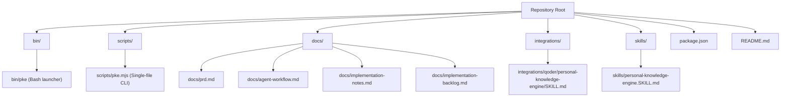
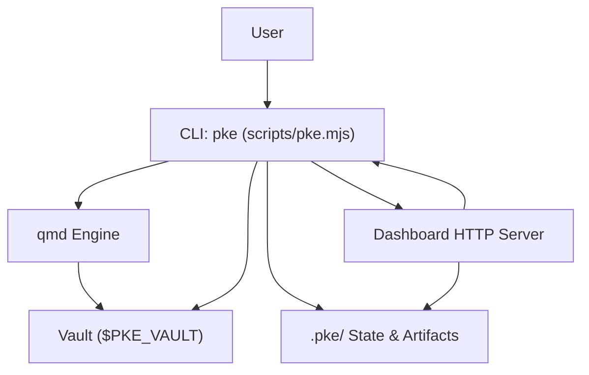
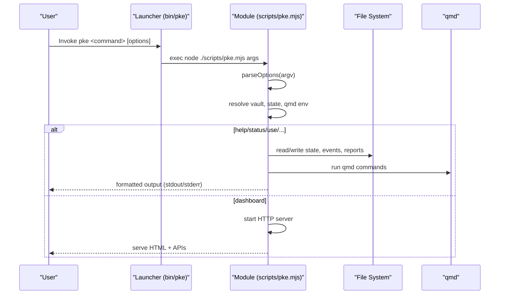
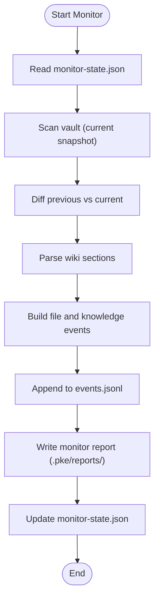
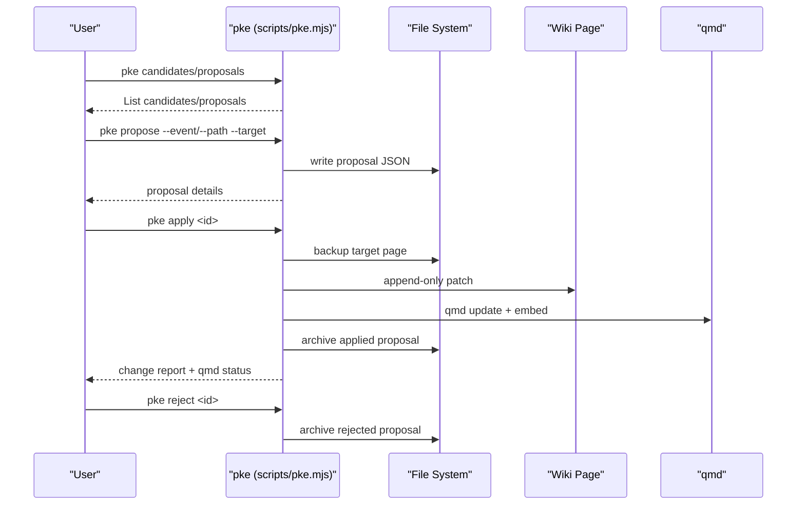
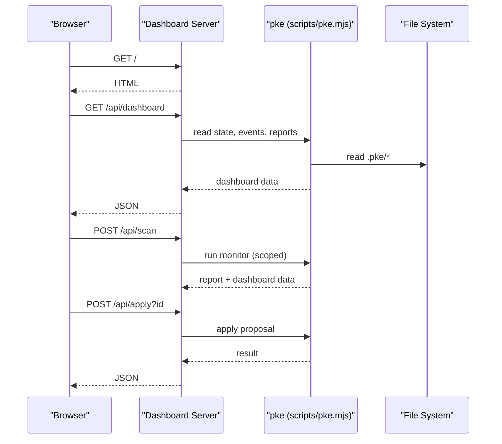
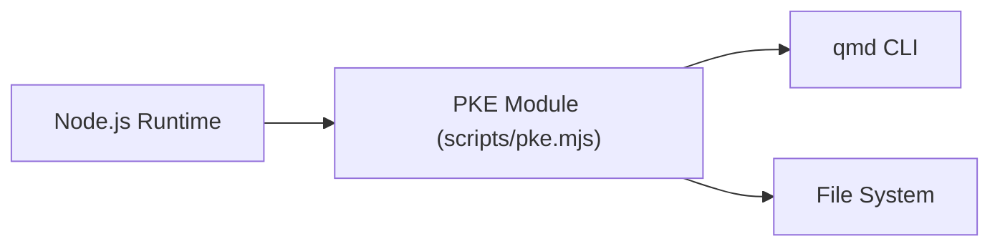

# Development and Contributing

<cite>
**Referenced Files in This Document**
- [README.md](file://README.md)
- [package.json](file://package.json)
- [bin/pke](file://bin/pke)
- [scripts/pke.mjs](file://scripts/pke.mjs)
- [docs/prd.md](file://docs/prd.md)
- [docs/agent-workflow.md](file://docs/agent-workflow.md)
- [docs/implementation-notes.md](file://docs/implementation-notes.md)
- [docs/implementation-backlog.md](file://docs/implementation-backlog.md)
- [skills/personal-knowledge-engine.SKILL.md](file://skills/personal-knowledge-engine.SKILL.md)
- [integrations/qoder/personal-knowledge-engine/SKILL.md](file://integrations/qoder/personal-knowledge-engine/SKILL.md)
</cite>

## Table of Contents
1. [Introduction](#introduction)
2. [Project Structure](#project-structure)
3. [Core Components](#core-components)
4. [Architecture Overview](#architecture-overview)
5. [Detailed Component Analysis](#detailed-component-analysis)
6. [Dependency Analysis](#dependency-analysis)
7. [Performance Considerations](#performance-considerations)
8. [Troubleshooting Guide](#troubleshooting-guide)
9. [Development Environment Setup](#development-environment-setup)
10. [Testing Strategy](#testing-strategy)
11. [Contribution Guidelines](#contribution-guidelines)
12. [Release Process and Versioning](#release-process-and-versioning)
13. [Maintenance Procedures](#maintenance-procedures)
14. [Debugging and Profiling](#debugging-and-profiling)
15. [Extension Points and Future Development](#extension-points-and-future-development)
16. [Conclusion](#conclusion)

## Introduction
This document provides comprehensive development and contribution guidance for the Personal Knowledge Engine (PKE) MVP. It explains how to set up the development environment, understand the single-file CLI implementation, navigate the codebase, and contribute meaningfully. It also covers testing, release/versioning, maintenance, debugging, and future extension points.

## Project Structure
The repository centers around a single JavaScript CLI implementation packaged as a Node.js module with a Bash launcher. Supporting documentation and integrations are organized under dedicated directories.

**Diagram sources**
- [bin/pke](file://bin/pke)
- [scripts/pke.mjs](file://scripts/pke.mjs)
- [package.json](file://package.json)
- [README.md](file://README.md)
- [docs/prd.md](file://docs/prd.md)
- [docs/agent-workflow.md](file://docs/agent-workflow.md)
- [docs/implementation-notes.md](file://docs/implementation-notes.md)
- [docs/implementation-backlog.md](file://docs/implementation-backlog.md)
- [skills/personal-knowledge-engine.SKILL.md](file://skills/personal-knowledge-engine.SKILL.md)
- [integrations/qoder/personal-knowledge-engine/SKILL.md](file://integrations/qoder/personal-knowledge-engine/SKILL.md)

**Section sources**
- [README.md](file://README.md)
- [package.json](file://package.json)
- [bin/pke](file://bin/pke)
- [scripts/pke.mjs](file://scripts/pke.mjs)

## Core Components
- Single-file CLI: The entire engine logic lives in a single module that exposes a command router and orchestrates vault scanning, monitoring, proposal generation, and dashboard HTTP endpoints.
- Executable launcher: A Bash wrapper invokes the Node.js module with the correct runtime.
- Package configuration: Declares the CLI binary, Node engine requirement, and smoke test script.
- Documentation: PRD, agent workflow, implementation notes, and backlog define product scope, behavior, and roadmap.

Key responsibilities:
- Command routing and option parsing
- Vault scanning and snapshot diffing
- Semantic event classification and knowledge monitoring
- Proposal generation and approval workflow
- Dashboard HTTP server for observability
- qmd integration for indexing and retrieval

**Section sources**
- [scripts/pke.mjs](file://scripts/pke.mjs)
- [bin/pke](file://bin/pke)
- [package.json](file://package.json)
- [docs/prd.md](file://docs/prd.md)

## Architecture Overview
The PKE MVP is a local-first knowledge workflow driven by a CLI and a browser dashboard. It integrates with qmd for indexing and retrieval, and maintains a vault with raw evidence and structured wiki pages. The engine’s core loop is proposal-only: it observes, proposes, and waits for explicit approval before writing.

**Diagram sources**
- [scripts/pke.mjs](file://scripts/pke.mjs)
- [docs/prd.md](file://docs/prd.md)

## Detailed Component Analysis

### CLI Command Router and Options
The CLI parses global options and routes to specific commands. It supports JSON output, scoped monitoring, and environment overrides for vault and qmd path.

**Diagram sources**
- [bin/pke](file://bin/pke)
- [scripts/pke.mjs](file://scripts/pke.mjs)

**Section sources**
- [scripts/pke.mjs](file://scripts/pke.mjs)
- [bin/pke](file://bin/pke)

### Knowledge Monitor and Event Pipeline
The monitor scans the vault, diffs snapshots, parses wiki sections, and emits semantic events. It supports scoped polling and writes markdown reports.

**Diagram sources**
- [scripts/pke.mjs](file://scripts/pke.mjs)

**Section sources**
- [scripts/pke.mjs](file://scripts/pke.mjs)
- [docs/implementation-notes.md](file://docs/implementation-notes.md)

### Proposal Workflow and Approval Gates
Proposals are generated from monitor events and applied with backups and qmd refresh. Approval is mandatory; no automatic wiki writes occur.

**Diagram sources**
- [scripts/pke.mjs](file://scripts/pke.mjs)

**Section sources**
- [scripts/pke.mjs](file://scripts/pke.mjs)
- [docs/implementation-notes.md](file://docs/implementation-notes.md)

### Dashboard and Observability
The dashboard serves a lightweight HTML UI and JSON APIs for live monitoring, proposal management, and report browsing.

**Diagram sources**
- [scripts/pke.mjs](file://scripts/pke.mjs)

**Section sources**
- [scripts/pke.mjs](file://scripts/pke.mjs)

## Dependency Analysis
- Runtime dependencies: Node.js (module system, child processes, HTTP server)
- External tool: qmd for indexing, querying, embedding, and linting
- Internal dependencies: single-module architecture with cohesive state and artifact management

**Diagram sources**
- [scripts/pke.mjs](file://scripts/pke.mjs)
- [package.json](file://package.json)

**Section sources**
- [package.json](file://package.json)
- [scripts/pke.mjs](file://scripts/pke.mjs)

## Performance Considerations
- Vault scanning: Implemented with breadth-first traversal and SHA-256 hashing; consider incremental hashing for very large vaults.
- Watch mode: Uses scoped polling to avoid OS-specific watchers and reduce overhead.
- Event log rotation and report retention: Prevents unbounded growth of artifacts.
- qmd refresh: Applied after successful wiki changes; failures are recorded without blocking the proposal lifecycle.

[No sources needed since this section provides general guidance]

## Troubleshooting Guide
Common issues and remedies:
- qmd connectivity: Use the status command to verify qmd availability and collection.
- Missing or invalid vault paths: Ensure the vault layout exists and environment overrides are correct.
- Oversized files: Files larger than the configured limit are skipped with warnings.
- Proposal state errors: Verify proposal status and target existence before applying.
- Dashboard refresh: Use scoped paths and auto-scan options to focus on relevant areas.

**Section sources**
- [scripts/pke.mjs](file://scripts/pke.mjs)
- [docs/implementation-notes.md](file://docs/implementation-notes.md)

## Development Environment Setup
- Prerequisites:
  - Node.js (per package engines)
  - qmd binary installed and discoverable in PATH
  - A local vault with raw/ and wiki/ directories
- Installation:
  - Clone the repository
  - Install dependencies via npm
  - Optional: npm link to use the pke command globally
- Running:
  - Use the launcher or invoke the module directly
  - Override defaults via environment variables or CLI flags

**Section sources**
- [README.md](file://README.md)
- [package.json](file://package.json)
- [bin/pke](file://bin/pke)
- [scripts/pke.mjs](file://scripts/pke.mjs)

## Testing Strategy
Current state:
- The implementation includes unit-like logic for scanning, diffing, classification, and proposal building.
- There is no dedicated test suite in the repository.

Recommended approach:
- Add tests for:
  - File scanning and snapshot diffing
  - Diff classification and proposal generation
  - Compile candidate detection and ranking
  - Scoped snapshot merging and tombstone handling
  - Dashboard data aggregation and report rendering
- Use Node’s built-in test runner or a minimal harness to validate core functions.

**Section sources**
- [docs/implementation-backlog.md](file://docs/implementation-backlog.md)
- [scripts/pke.mjs](file://scripts/pke.mjs)

## Contribution Guidelines
- Coding standards:
  - Keep the single-file architecture cohesive; avoid introducing external dependencies unless justified.
  - Prefer pure functions and deterministic transformations for easier testing.
  - Use clear, descriptive variable names and modularize logic into focused functions.
- Pull request process:
  - Link to relevant backlog items and PRD sections.
  - Include rationale, acceptance criteria, and migration notes where applicable.
  - Ensure changes align with governance: proposal-only writes, explicit approval gates, and safety checks.
- Documentation:
  - Update PRD, agent workflow, and implementation notes as needed.
  - Keep the CLI help and usage examples accurate.

**Section sources**
- [docs/prd.md](file://docs/prd.md)
- [docs/implementation-backlog.md](file://docs/implementation-backlog.md)
- [docs/implementation-notes.md](file://docs/implementation-notes.md)

## Release Process and Versioning
- Versioning:
  - The project uses a version field in package.json; adopt semantic versioning aligned with feature completeness and stability.
- Release steps:
  - Validate all acceptance criteria from the backlog for the target phase.
  - Update documentation and examples to reflect changes.
  - Tag releases and publish artifacts as appropriate.
- Maintenance:
  - Track technical debt and cross-cutting concerns in the backlog.
  - Prioritize items based on MoSCoW and phase dependencies.

**Section sources**
- [package.json](file://package.json)
- [docs/implementation-backlog.md](file://docs/implementation-backlog.md)

## Maintenance Procedures
- Monitor health:
  - Regularly review dashboard totals, event types, and proposal statuses.
  - Rotate event logs and archive old reports per retention policies.
- Vault hygiene:
  - Ensure template compliance and qmd indexing remain healthy.
  - Periodically reindex and re-embed after applying wiki changes.
- Operational cadence:
  - Use daily compilation to review changes and generate proposals.
  - Close sessions to capture durable signals and promote knowledge.

**Section sources**
- [scripts/pke.mjs](file://scripts/pke.mjs)
- [docs/implementation-notes.md](file://docs/implementation-notes.md)

## Debugging and Profiling
- Debugging techniques:
  - Use verbose logging and JSON output for inspection.
  - Inspect state files and event logs to trace changes.
  - Validate qmd status and reindex cycles.
- Profiling:
  - Measure vault scan duration and optimize hotspots.
  - Profile dashboard refresh intervals and API response times.
  - Monitor proposal throughput and approval rates for self-improvement tuning.

**Section sources**
- [scripts/pke.mjs](file://scripts/pke.mjs)
- [docs/implementation-notes.md](file://docs/implementation-notes.md)

## Extension Points and Future Development
- Self-improvement enhancements:
  - Retrieval tuning proposals and acceptance-rate-based confidence adjustments are implemented.
  - Consider adding session intelligence and multi-source adapters.
- Platform integration:
  - Explore IDE plugins and editor integrations for context-aware knowledge retrieval.
- Reliability and scalability:
  - Implement atomic write patterns, concurrent invocation guards, and performance optimizations for large vaults.

**Section sources**
- [docs/implementation-backlog.md](file://docs/implementation-backlog.md)
- [docs/agent-workflow.md](file://docs/agent-workflow.md)
- [skills/personal-knowledge-engine.SKILL.md](file://skills/personal-knowledge-engine.SKILL.md)
- [integrations/qoder/personal-knowledge-engine/SKILL.md](file://integrations/qoder/personal-knowledge-engine/SKILL.md)

## Conclusion
The Personal Knowledge Engine MVP demonstrates a focused, proposal-only knowledge workflow powered by a single-file CLI and a browser dashboard. Contributors can understand the system by studying the CLI module, vault state, and monitoring pipeline, and extend it safely through the established governance and backlog-driven roadmap.