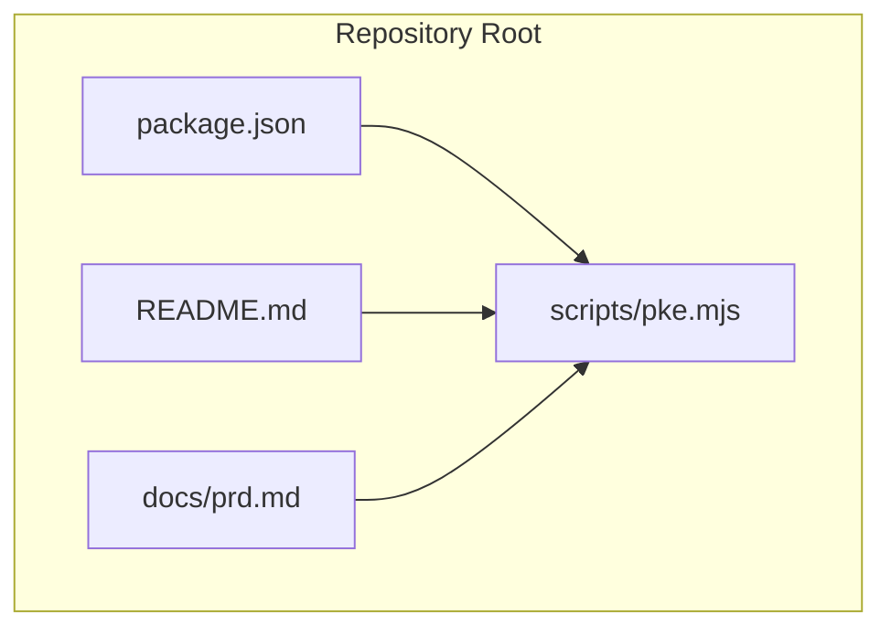
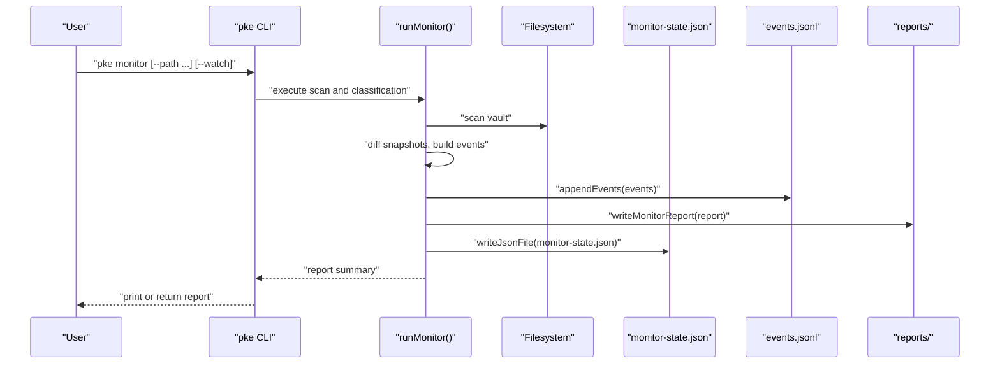
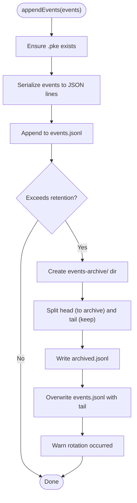
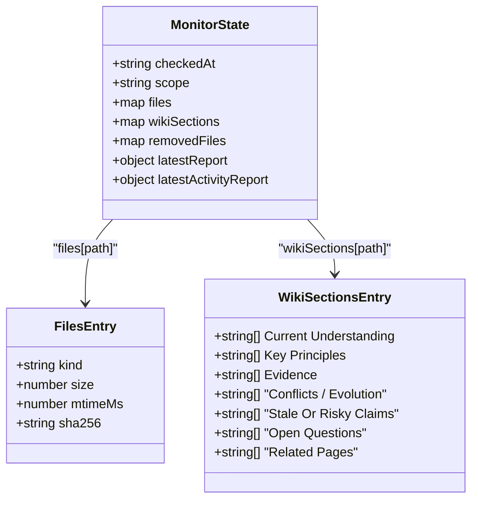
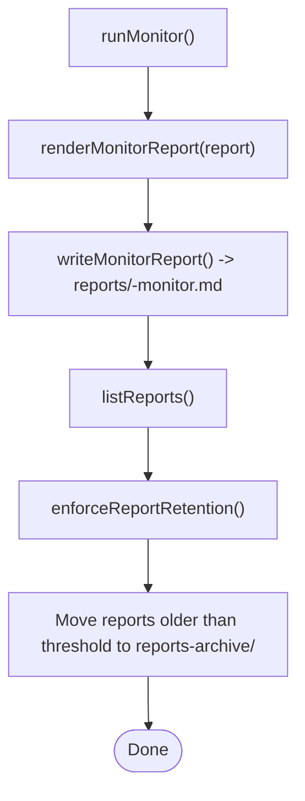
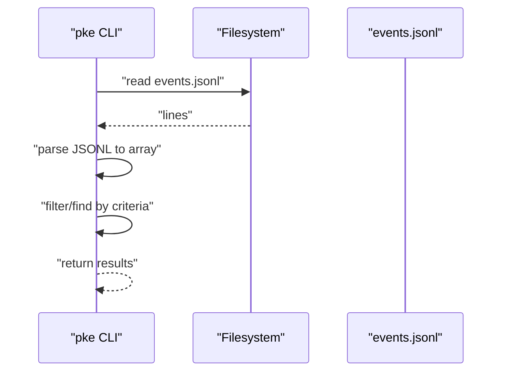
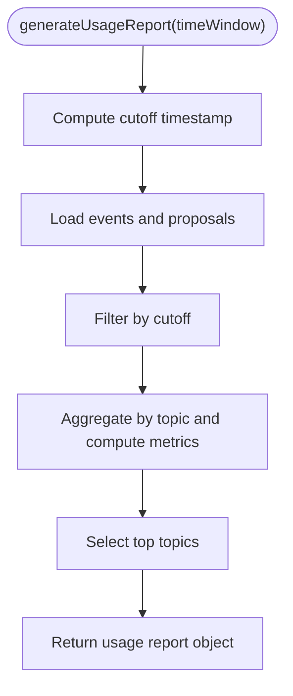
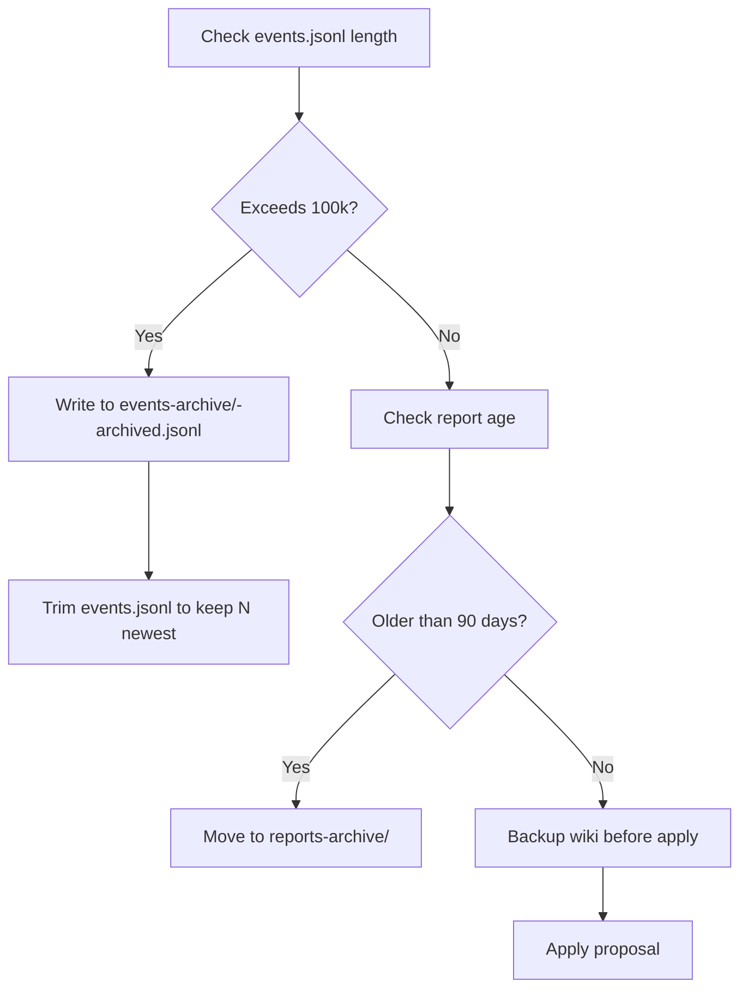
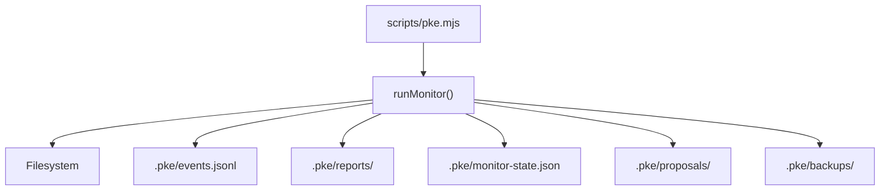

# Event Artifacts and Storage

<cite>
**Referenced Files in This Document**
- [README.md](file://README.md)
- [package.json](file://package.json)
- [scripts/pke.mjs](file://scripts/pke.mjs)
- [docs/prd.md](file://docs/prd.md)
</cite>

## Table of Contents
1. [Introduction](#introduction)
2. [Project Structure](#project-structure)
3. [Core Components](#core-components)
4. [Architecture Overview](#architecture-overview)
5. [Detailed Component Analysis](#detailed-component-analysis)
6. [Dependency Analysis](#dependency-analysis)
7. [Performance Considerations](#performance-considerations)
8. [Troubleshooting Guide](#troubleshooting-guide)
9. [Conclusion](#conclusion)
10. [Appendices](#appendices)

## Introduction
This document explains the event artifact management system in the Personal Knowledge Engine (PKE) MVP. It covers how knowledge events are detected, stored, and reported; how persistent state is maintained; and how reports are generated and archived. It also documents the .pke/events.jsonl append-only event log, the monitor-state.json persistent snapshot, and the reports directory layout. Finally, it describes the JSONL streaming model, event retrieval mechanisms, report generation (including daily and usage patterns), and backup/archival policies for controlling storage growth.

## Project Structure
The PKE CLI is implemented as a single ES module script with a companion PRD that defines the data models and behavior. The repository exposes:
- A CLI entry point via the pke binary
- A primary script implementing all commands and artifact management
- A PRD with detailed data models and vault layout

**Diagram sources**
- [package.json:1-18](file://package.json#L1-L18)
- [README.md:1-211](file://README.md#L1-L211)
- [scripts/pke.mjs:1-2209](file://scripts/pke.mjs#L1-L2209)
- [docs/prd.md:1-800](file://docs/prd.md#L1-L800)

**Section sources**
- [package.json:1-18](file://package.json#L1-L18)
- [README.md:1-211](file://README.md#L1-L211)
- [scripts/pke.mjs:1-2209](file://scripts/pke.mjs#L1-L2209)
- [docs/prd.md:428-452](file://docs/prd.md#L428-L452)

## Core Components
- Event log (.pke/events.jsonl): Append-only JSONL stream of knowledge events
- Persistent state (.pke/monitor-state.json): Incremental snapshot of monitored files and wiki sections
- Reports (.pke/reports/): Timestamped markdown reports summarizing monitor scans
- Proposals (.pke/proposals/, .pke/applied/, .pke/rejected/): Approval-gated compile artifacts and backups
- Backups (.pke/backups/): Pre-apply backups of wiki pages

These components are managed by the CLI’s monitor, report, and proposal subsystems.

**Section sources**
- [scripts/pke.mjs:23-29](file://scripts/pke.mjs#L23-L29)
- [scripts/pke.mjs:1390-1415](file://scripts/pke.mjs#L1390-L1415)
- [scripts/pke.mjs:1930-1961](file://scripts/pke.mjs#L1930-L1961)
- [scripts/pke.mjs:1635-1641](file://scripts/pke.mjs#L1635-L1641)
- [docs/prd.md:544-574](file://docs/prd.md#L544-L574)
- [docs/prd.md:595-626](file://docs/prd.md#L595-L626)
- [docs/prd.md:638-696](file://docs/prd.md#L638-L696)

## Architecture Overview
The event artifact system centers on the monitor pipeline that:
- Scans the vault (optionally scoped)
- Compares snapshots to detect file and knowledge-level changes
- Emits semantic events
- Appends them to events.jsonl
- Writes a markdown report to reports/
- Updates monitor-state.json with the new snapshot and tombstones for removed files

**Diagram sources**
- [scripts/pke.mjs:738-785](file://scripts/pke.mjs#L738-L785)
- [scripts/pke.mjs:1390-1394](file://scripts/pke.mjs#L1390-L1394)
- [scripts/pke.mjs:1930-1936](file://scripts/pke.mjs#L1930-L1936)
- [scripts/pke.mjs:2082-2093](file://scripts/pke.mjs#L2082-L2093)

## Detailed Component Analysis

### Event Log: .pke/events.jsonl
- Format: JSONL (one JSON object per line)
- Purpose: Append-only knowledge event log for all detected changes
- Rotation policy: Retains up to a fixed number of recent events; older events are archived to .pke/events-archive/

Key behaviors:
- Append-only streaming: Events are serialized and appended atomically
- Rotation: When exceeding the retention threshold, the oldest N events are moved to a dated archive file
- Retrieval: Entire log is loaded into memory for analysis and reporting

**Diagram sources**
- [scripts/pke.mjs:1390-1394](file://scripts/pke.mjs#L1390-L1394)
- [scripts/pke.mjs:1396-1410](file://scripts/pke.mjs#L1396-L1410)
- [scripts/pke.mjs:1412-1415](file://scripts/pke.mjs#L1412-L1415)

**Section sources**
- [scripts/pke.mjs:1390-1415](file://scripts/pke.mjs#L1390-L1415)
- [scripts/pke.mjs:1396-1410](file://scripts/pke.mjs#L1396-L1410)
- [docs/prd.md:544-574](file://docs/prd.md#L544-L574)

### Persistent State: .pke/monitor-state.json
- Purpose: Incremental snapshot enabling efficient delta scans across monitor runs
- Fields include checkedAt, scope, files, wikiSections, removedFiles, and latest report summaries
- Tombstones: Tracks removed files to avoid false positives in scoped scans

**Diagram sources**
- [docs/prd.md:595-626](file://docs/prd.md#L595-L626)

**Section sources**
- [scripts/pke.mjs:738-785](file://scripts/pke.mjs#L738-L785)
- [scripts/pke.mjs:2178-2202](file://scripts/pke.mjs#L2178-L2202)
- [docs/prd.md:595-626](file://docs/prd.md#L595-L626)

### Reports: .pke/reports/ and .pke/reports-archive/
- Format: Markdown files named with timestamp prefixes
- Content: Summary of a monitor scan including counts, new conclusions, conflicts, stale claims, open questions, and a compact event list
- Retention: Older reports are moved to .pke/reports-archive/ after a time threshold

**Diagram sources**
- [scripts/pke.mjs:2019-2045](file://scripts/pke.mjs#L2019-L2045)
- [scripts/pke.mjs:1930-1936](file://scripts/pke.mjs#L1930-L1936)
- [scripts/pke.mjs:1938-1961](file://scripts/pke.mjs#L1938-L1961)

**Section sources**
- [scripts/pke.mjs:1930-1961](file://scripts/pke.mjs#L1930-L1961)
- [scripts/pke.mjs:2019-2045](file://scripts/pke.mjs#L2019-L2045)
- [docs/prd.md:698-731](file://docs/prd.md#L698-L731)

### Event Retrieval Mechanisms
- Read all events: Load entire events.jsonl into memory
- Find by ID: Linear scan for a specific event ID
- Filter by type: Used by candidate generation and dashboard
- Latest activity: Parse the most recent report to reconstruct recent events for quick UI

**Diagram sources**
- [scripts/pke.mjs:1412-1415](file://scripts/pke.mjs#L1412-L1415)
- [scripts/pke.mjs:1417-1419](file://scripts/pke.mjs#L1417-L1419)
- [scripts/pke.mjs:1978-2017](file://scripts/pke.mjs#L1978-L2017)

**Section sources**
- [scripts/pke.mjs:1412-1419](file://scripts/pke.mjs#L1412-L1419)
- [scripts/pke.mjs:1978-2017](file://scripts/pke.mjs#L1978-L2017)

### Report Generation System
- Daily reports: Markdown files written per scan; dashboard aggregates recent reports
- Usage pattern reports: Computed over a configurable time window, aggregating events and proposals to derive metrics like total events, total proposals, approval rate, compile velocity, and top topics
- Activity summaries: Dashboard can fall back to the latest report with events or the latest activity report

**Diagram sources**
- [scripts/pke.mjs:1100-1138](file://scripts/pke.mjs#L1100-L1138)

**Section sources**
- [scripts/pke.mjs:463-506](file://scripts/pke.mjs#L463-L506)
- [scripts/pke.mjs:1100-1138](file://scripts/pke.mjs#L1100-L1138)
- [scripts/pke.mjs:1667-1733](file://scripts/pke.mjs#L1667-L1733)

### Backup and Archival System
- Event archival: When events.jsonl exceeds retention, the oldest entries are moved to a dated archive file in .pke/events-archive/
- Report archival: Reports older than the retention threshold are moved to .pke/reports-archive/
- Wiki backup: Before applying a proposal, the target wiki page is copied to .pke/backups/ with a naming scheme that includes the proposal ID and original path

**Diagram sources**
- [scripts/pke.mjs:1396-1410](file://scripts/pke.mjs#L1396-L1410)
- [scripts/pke.mjs:1947-1961](file://scripts/pke.mjs#L1947-L1961)
- [scripts/pke.mjs:1635-1641](file://scripts/pke.mjs#L1635-L1641)

**Section sources**
- [scripts/pke.mjs:1396-1410](file://scripts/pke.mjs#L1396-L1410)
- [scripts/pke.mjs:1947-1961](file://scripts/pke.mjs#L1947-L1961)
- [scripts/pke.mjs:1635-1641](file://scripts/pke.mjs#L1635-L1641)

### Examples: Reading and Interpreting Artifacts
- Reading recent events: Use the events command to list the latest N events
- Reading usage patterns: Use the report command with the usage option to compute metrics over a time window
- Interpreting a report: Reports include counts, categorized highlights, and a compact event list; the dashboard parses the latest report to present recent activity

**Section sources**
- [scripts/pke.mjs:448-461](file://scripts/pke.mjs#L448-L461)
- [scripts/pke.mjs:463-506](file://scripts/pke.mjs#L463-L506)
- [scripts/pke.mjs:1978-2017](file://scripts/pke.mjs#L1978-L2017)

### Managing Storage Space
- Event retention: Up to a fixed number of events; older ones are archived
- Report retention: Reports older than a threshold are moved to an archive directory
- Proposal caps: Warnings are issued when pending proposals exceed a configured cap
- File size limits: Oversized files are skipped during vault scans

**Section sources**
- [scripts/pke.mjs:1396-1410](file://scripts/pke.mjs#L1396-L1410)
- [scripts/pke.mjs:1947-1961](file://scripts/pke.mjs#L1947-L1961)
- [scripts/pke.mjs:1560-1567](file://scripts/pke.mjs#L1560-L1567)
- [scripts/pke.mjs:824-875](file://scripts/pke.mjs#L824-L875)

## Dependency Analysis
The CLI orchestrates filesystem operations and JSON serialization/deserialization. The monitor depends on:
- Vault scanning and diffing
- Section parsing for knowledge-level events
- JSONL append and rotation
- Markdown report rendering and retention enforcement
- State file updates with tombstones

**Diagram sources**
- [scripts/pke.mjs:738-785](file://scripts/pke.mjs#L738-L785)
- [scripts/pke.mjs:1390-1394](file://scripts/pke.mjs#L1390-L1394)
- [scripts/pke.mjs:1930-1936](file://scripts/pke.mjs#L1930-L1936)
- [scripts/pke.mjs:2082-2093](file://scripts/pke.mjs#L2082-L2093)

**Section sources**
- [scripts/pke.mjs:738-785](file://scripts/pke.mjs#L738-L785)
- [scripts/pke.mjs:1390-1394](file://scripts/pke.mjs#L1390-L1394)
- [scripts/pke.mjs:1930-1936](file://scripts/pke.mjs#L1930-L1936)
- [scripts/pke.mjs:2082-2093](file://scripts/pke.mjs#L2082-L2093)

## Performance Considerations
- JSONL streaming: Append-only JSONL minimizes write contention and supports fast rotation
- In-memory event loading: Efficient for typical event volumes; consider pagination or streaming parsers for very large histories
- Report parsing: Parsing the latest report is O(n) in the number of event lines; caching parsed results can reduce overhead
- Tombstone management: Removal tombstones prevent false positives across scoped scans; keep them minimal and prune as needed

[No sources needed since this section provides general guidance]

## Troubleshooting Guide
- Events file missing or corrupted: The CLI gracefully handles missing files and falls back to empty arrays; re-run monitor to rebuild
- Oversized files skipped: Vault scans skip files larger than a configured limit; reduce file sizes or exclude them from the vault
- Watch path errors: Watch mode requires a scoped path inside the vault; ensure the path resolves correctly
- Proposal caps: Excessive pending proposals trigger warnings; review or apply proposals to reduce backlog
- Report retention: Older reports are archived automatically; check the archive directory if a report is missing from the reports directory

**Section sources**
- [scripts/pke.mjs:1412-1415](file://scripts/pke.mjs#L1412-L1415)
- [scripts/pke.mjs:824-875](file://scripts/pke.mjs#L824-L875)
- [scripts/pke.mjs:787-810](file://scripts/pke.mjs#L787-L810)
- [scripts/pke.mjs:1560-1567](file://scripts/pke.mjs#L1560-L1567)
- [scripts/pke.mjs:1947-1961](file://scripts/pke.mjs#L1947-L1961)

## Conclusion
The PKE event artifact system provides a robust, local-first foundation for knowledge observability. The append-only event log, incremental monitor state, and timestamped reports enable reliable auditing and dashboards. Built-in rotation and archival controls help manage long-term storage. Together, these components support the proposal-only compile workflow and the governed wiki updates that define the MVP.

[No sources needed since this section summarizes without analyzing specific files]

## Appendices

### Appendix A: Vault Layout and Paths
- Vault layout and .pke subdirectories are defined in the PRD
- CLI resolves paths from environment variables and defaults

**Section sources**
- [docs/prd.md:428-452](file://docs/prd.md#L428-L452)
- [scripts/pke.mjs:9-30](file://scripts/pke.mjs#L9-L30)