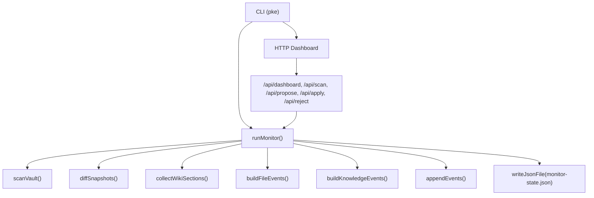
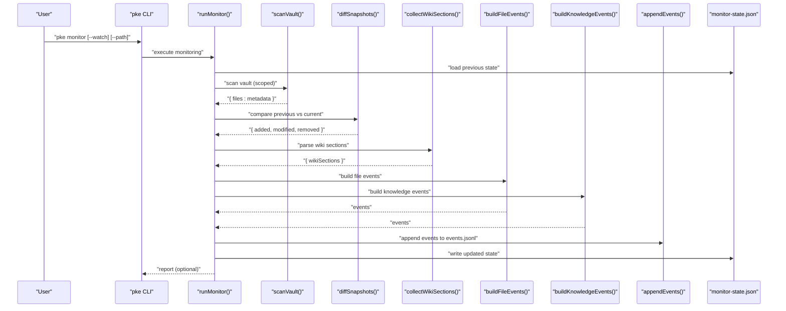
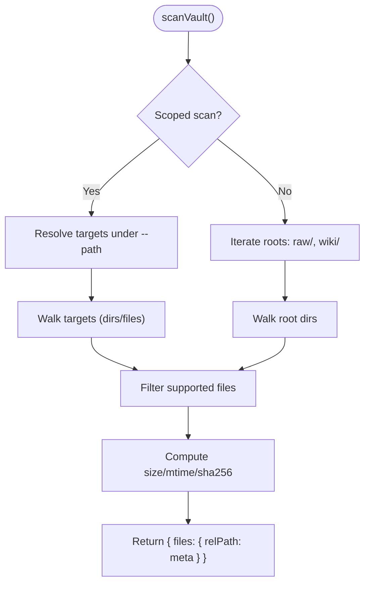
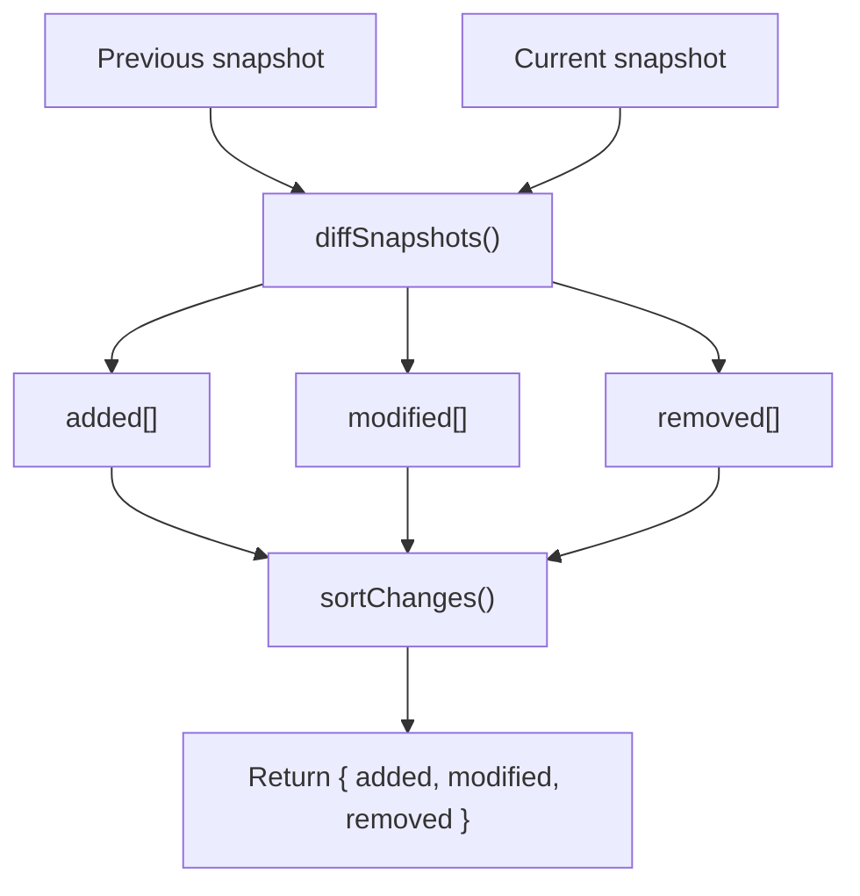
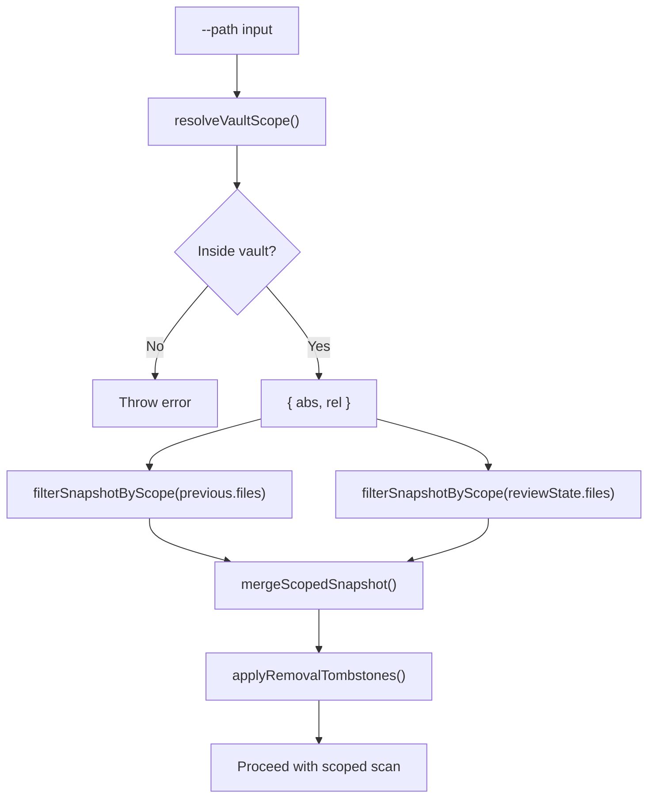
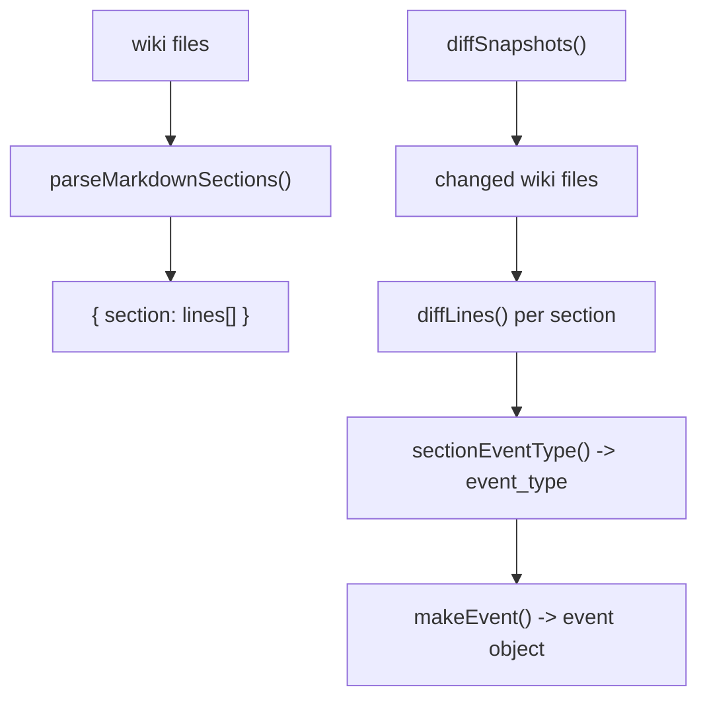
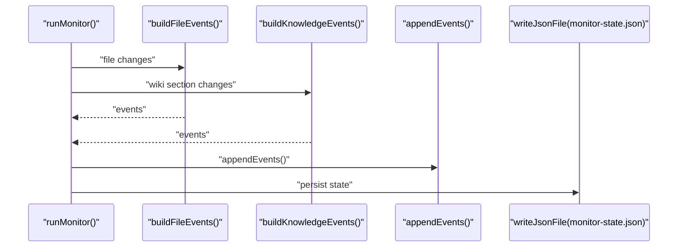
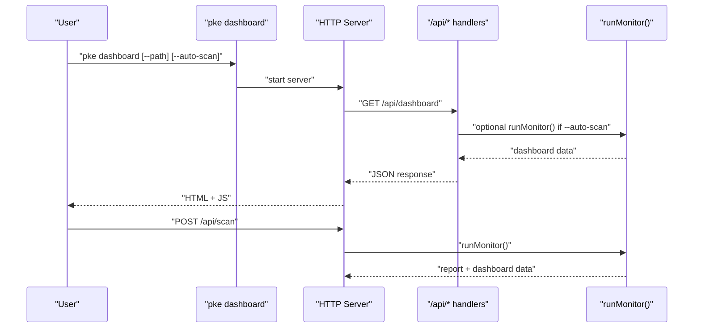
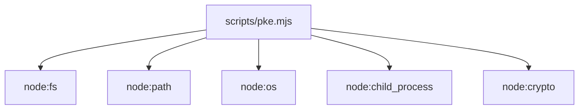

# Event Detection and File Monitoring

<cite>
**Referenced Files in This Document**
- [README.md](file://README.md)
- [package.json](file://package.json)
- [pke.mjs](file://scripts/pke.mjs)
- [prd.md](file://docs/prd.md)
</cite>

## Table of Contents
1. [Introduction](#introduction)
2. [Project Structure](#project-structure)
3. [Core Components](#core-components)
4. [Architecture Overview](#architecture-overview)
5. [Detailed Component Analysis](#detailed-component-analysis)
6. [Dependency Analysis](#dependency-analysis)
7. [Performance Considerations](#performance-considerations)
8. [Troubleshooting Guide](#troubleshooting-guide)
9. [Conclusion](#conclusion)

## Introduction
This document explains the Personal Knowledge Engine’s event detection and file monitoring system. It covers how the monitor performs file scanning, generates snapshots, compares them to detect changes, and emits semantic knowledge events. It also describes the monitored directories, supported file types, scope filtering, and integration with the vault structure. Examples illustrate typical change detection scenarios and the resulting event objects.

## Project Structure
The monitoring system is implemented in a single script module that exposes a CLI and a built-in dashboard. Key locations:
- CLI entrypoint and commands: [pke.mjs](file://scripts/pke.mjs)
- Vault layout expectations and monitoring scope: [README.md](file://README.md)
- Event log schema and event types: [prd.md](file://docs/prd.md)
- Package metadata and binary binding: [package.json](file://package.json)

**Diagram sources**
- [pke.mjs:738-785](file://scripts/pke.mjs#L738-L785)
- [pke.mjs:824-875](file://scripts/pke.mjs#L824-L875)
- [pke.mjs:902-918](file://scripts/pke.mjs#L902-L918)
- [pke.mjs:1277-1286](file://scripts/pke.mjs#L1277-L1286)
- [pke.mjs:1313-1322](file://scripts/pke.mjs#L1313-L1322)
- [pke.mjs:1324-1348](file://scripts/pke.mjs#L1324-L1348)
- [pke.mjs:1390-1394](file://scripts/pke.mjs#L1390-L1394)
- [pke.mjs:1667-1733](file://scripts/pke.mjs#L1667-L1733)

**Section sources**
- [README.md:35-54](file://README.md#L35-L54)
- [package.json:1-18](file://package.json#L1-L18)
- [pke.mjs:48-97](file://scripts/pke.mjs#L48-L97)

## Core Components
- Snapshot scanning: Enumerates supported files under vault roots and captures metadata (size, mtime, sha256).
- Snapshot comparison: Detects added, modified, and removed files by comparing previous and current snapshots.
- Section-level knowledge analysis: Parses wiki pages into sections and detects semantic changes.
- Event emission: Builds file and knowledge events and appends them to the event log.
- State persistence: Maintains monitor state, including tracked files, wiki sections, and removal tombstones.
- Scope filtering: Restricts monitoring to a vault-relative path for targeted scanning.
- Dashboard integration: Provides live monitoring summaries and proposal workflows.

**Section sources**
- [pke.mjs:824-875](file://scripts/pke.mjs#L824-L875)
- [pke.mjs:902-918](file://scripts/pke.mjs#L902-L918)
- [pke.mjs:1277-1286](file://scripts/pke.mjs#L1277-L1286)
- [pke.mjs:1313-1348](file://scripts/pke.mjs#L1313-L1348)
- [pke.mjs:1390-1394](file://scripts/pke.mjs#L1390-L1394)
- [pke.mjs:1268-1275](file://scripts/pke.mjs#L1268-L1275)
- [pke.mjs:1667-1733](file://scripts/pke.mjs#L1667-L1733)

## Architecture Overview
The monitor orchestrates scanning, comparison, and event generation, then persists state and optionally writes a report.

**Diagram sources**
- [pke.mjs:440-446](file://scripts/pke.mjs#L440-L446)
- [pke.mjs:738-785](file://scripts/pke.mjs#L738-L785)
- [pke.mjs:824-875](file://scripts/pke.mjs#L824-L875)
- [pke.mjs:902-918](file://scripts/pke.mjs#L902-L918)
- [pke.mjs:1277-1286](file://scripts/pke.mjs#L1277-L1286)
- [pke.mjs:1313-1348](file://scripts/pke.mjs#L1313-L1348)
- [pke.mjs:1390-1394](file://scripts/pke.mjs#L1390-L1394)

## Detailed Component Analysis

### File Scanning and Snapshot Generation
- Supported roots: raw/ and wiki/ under the vault.
- Supported file types: Markdown-like files ending with .md, .txt, or .markdown.
- Snapshot metadata: For each file, captures kind (raw/wiki/other), size, mtimeMs, and sha256.
- Size cap: Files larger than 10 MB are skipped with a warning.
- Scope-aware scanning: When a --path is provided, only files under that path are scanned.

**Diagram sources**
- [pke.mjs:824-875](file://scripts/pke.mjs#L824-L875)
- [pke.mjs:877-886](file://scripts/pke.mjs#L877-L886)
- [pke.mjs:888-890](file://scripts/pke.mjs#L888-L890)
- [pke.mjs:898-900](file://scripts/pke.mjs#L898-L900)

**Section sources**
- [pke.mjs:824-875](file://scripts/pke.mjs#L824-L875)
- [pke.mjs:888-890](file://scripts/pke.mjs#L888-L890)
- [README.md:35-54](file://README.md#L35-L54)

### Snapshot Comparison and Change Detection
- Comparison basis: Compares previous and current snapshots keyed by relative path.
- Added: Present in current but not in previous.
- Modified: Present in both with differing sha256.
- Removed: Present in previous but not in current.
- Sorting: Results are normalized by path.

**Diagram sources**
- [pke.mjs:902-918](file://scripts/pke.mjs#L902-L918)
- [pke.mjs:920-922](file://scripts/pke.mjs#L920-L922)

**Section sources**
- [pke.mjs:902-918](file://scripts/pke.mjs#L902-L918)

### Monitored Directories and File Types
- Monitored directories: raw/ and wiki/ under the vault.
- Supported extensions: .md, .txt, .markdown.
- Scope restriction: --path must remain within the vault; absolute or parent traversal outside vault is rejected.

**Section sources**
- [README.md:35-54](file://README.md#L35-L54)
- [pke.mjs:851-874](file://scripts/pke.mjs#L851-L874)
- [pke.mjs:888-890](file://scripts/pke.mjs#L888-L890)
- [pke.mjs:1268-1275](file://scripts/pke.mjs#L1268-L1275)

### Scope Filtering System
- Resolution: Converts --path to an absolute vault path and validates it stays within the vault.
- Filtering: Filters snapshots to the scoped subset and merges scoped updates back into the persisted state.
- Tombstones: Tracks removed files with tombstones to avoid false positives during subsequent scans.

**Diagram sources**
- [pke.mjs:1268-1275](file://scripts/pke.mjs#L1268-L1275)
- [pke.mjs:2159-2166](file://scripts/pke.mjs#L2159-L2166)
- [pke.mjs:2168-2176](file://scripts/pke.mjs#L2168-L2176)
- [pke.mjs:2178-2185](file://scripts/pke.mjs#L2178-L2185)
- [pke.mjs:2187-2202](file://scripts/pke.mjs#L2187-L2202)
- [pke.mjs:2204-2208](file://scripts/pke.mjs#L2204-L2208)

**Section sources**
- [pke.mjs:1268-1275](file://scripts/pke.mjs#L1268-L1275)
- [pke.mjs:2159-2208](file://scripts/pke.mjs#L2159-L2208)

### Wiki Section Parsing and Knowledge Event Building
- Section parsing: Reads wiki content and splits into sections by headings, excluding fenced code blocks.
- Knowledge events: For each changed wiki file, compares sections and emits semantic events for additions and changes in predefined sections.

**Diagram sources**
- [pke.mjs:1277-1311](file://scripts/pke.mjs#L1277-L1311)
- [pke.mjs:1324-1348](file://scripts/pke.mjs#L1324-L1348)
- [pke.mjs:1350-1353](file://scripts/pke.mjs#L1350-L1353)

**Section sources**
- [pke.mjs:1277-1311](file://scripts/pke.mjs#L1277-L1311)
- [pke.mjs:1324-1348](file://scripts/pke.mjs#L1324-L1348)
- [pke.mjs:1350-1353](file://scripts/pke.mjs#L1350-L1353)

### Event Emission and Storage
- File events: raw_added/raw_modified/wiki_added/wiki_modified events for each added/modified file kind.
- Knowledge events: conclusion_added, conclusion_changed, conflict_detected, stale_claim_detected, open_question_added, evidence_link_added, knowledge_section_updated.
- Append-only log: Events are appended to events.jsonl with rotation when exceeding retention.
- State updates: monitor-state.json tracks files, wiki sections, and removal tombstones.

**Diagram sources**
- [pke.mjs:1313-1322](file://scripts/pke.mjs#L1313-L1322)
- [pke.mjs:1324-1348](file://scripts/pke.mjs#L1324-L1348)
- [pke.mjs:1390-1394](file://scripts/pke.mjs#L1390-L1394)
- [pke.mjs:775-783](file://scripts/pke.mjs#L775-L783)

**Section sources**
- [pke.mjs:1313-1348](file://scripts/pke.mjs#L1313-L1348)
- [pke.mjs:1390-1394](file://scripts/pke.mjs#L1390-L1394)
- [pke.mjs:775-783](file://scripts/pke.mjs#L775-L783)
- [prd.md:544-574](file://docs/prd.md#L544-L574)

### Realtime Monitoring and Dashboard Integration
- Watch mode: Periodic scoped polling with configurable interval/debounce; prints watch summary when events occur.
- Dashboard: Serves metrics, latest events, and proposals; supports manual scan and proposal actions via /api endpoints.

**Diagram sources**
- [pke.mjs:774-810](file://scripts/pke.mjs#L774-L810)
- [pke.mjs:674-736](file://scripts/pke.mjs#L674-L736)
- [pke.mjs:1667-1733](file://scripts/pke.mjs#L1667-L1733)

**Section sources**
- [pke.mjs:774-810](file://scripts/pke.mjs#L774-L810)
- [pke.mjs:674-736](file://scripts/pke.mjs#L674-L736)
- [pke.mjs:1667-1733](file://scripts/pke.mjs#L1667-L1733)

### Example Scenarios and Resulting Events
Below are representative scenarios and the resulting event types and attributes. These reflect the monitor’s classification and emission logic.

- Raw file added
  - Trigger: A new raw file appears under raw/.
  - Event type: raw_added
  - Attributes: path (vault-relative), kind ("raw"), summary (human-readable), source ("monitor"/"watch"/"dashboard"/"manual")

- Raw file modified
  - Trigger: Content of an existing raw file changes (sha256 differs).
  - Event type: raw_modified
  - Attributes: path, kind, summary, source

- Wiki file added
  - Trigger: A new wiki page appears under wiki/.
  - Event type: wiki_added
  - Attributes: path, kind, summary, source

- Wiki file modified
  - Trigger: Content of an existing wiki page changes.
  - Event type: wiki_modified
  - Attributes: path, kind, summary, source

- New conclusion added
  - Trigger: A new line is added to Current Understanding or Key Principles.
  - Event type: conclusion_added
  - Attributes: path, kind, summary, source, section, line

- Conclusion changed
  - Trigger: Both lines added and removed in Current Understanding.
  - Event type: conclusion_changed
  - Attributes: path, kind, summary, source, section, added[], removed[]

- Conflict detected
  - Trigger: A line is added to Conflicts / Evolution.
  - Event type: conflict_detected
  - Attributes: path, kind, summary, source, section, line

- Stale claim detected
  - Trigger: A line is added to Stale Or Risky Claims.
  - Event type: stale_claim_detected
  - Attributes: path, kind, summary, source, section, line

- Open question added
  - Trigger: A line is added to Open Questions.
  - Event type: open_question_added
  - Attributes: path, kind, summary, source, section, line

- Evidence link added
  - Trigger: A wiki-link (e.g., [[...]]) is added to Evidence.
  - Event type: evidence_link_added
  - Attributes: path, kind, summary, source, section, line

- Knowledge section updated
  - Trigger: Any other knowledge section changes.
  - Event type: knowledge_section_updated
  - Attributes: path, kind, summary, source, section

Note: The event log schema and field definitions are documented in the PRD.

**Section sources**
- [pke.mjs:1313-1348](file://scripts/pke.mjs#L1313-L1348)
- [pke.mjs:1324-1348](file://scripts/pke.mjs#L1324-L1348)
- [prd.md:544-574](file://docs/prd.md#L544-L574)
- [prd.md:576-593](file://docs/prd.md#L576-L593)

## Dependency Analysis
The monitor relies on internal helpers and state files. There are no external runtime dependencies beyond Node.js built-ins and the optional qmd tool.

**Diagram sources**
- [pke.mjs:1-8](file://scripts/pke.mjs#L1-L8)
- [package.json:1-18](file://package.json#L1-L18)

**Section sources**
- [pke.mjs:1-8](file://scripts/pke.mjs#L1-L8)
- [package.json:1-18](file://package.json#L1-L18)

## Performance Considerations
- Snapshot size: Scanning enumerates files and computes sha256; keep vault organized and avoid extremely large files to minimize overhead.
- Scope filtering: Use --path to reduce scan surface and polling cost.
- Retention limits: Events and reports are retained with limits; older entries are archived to maintain performance.
- Watch intervals: Tune interval/debounce to balance responsiveness and resource usage.

[No sources needed since this section provides general guidance]

## Troubleshooting Guide
- Oversized files: Files larger than 10 MB are skipped with a warning; reduce file size or exclude from vault.
- Path outside vault: Using --path outside the vault raises an error; ensure the path is vault-relative.
- Missing qmd: Some operations depend on qmd; ensure it is installed and discoverable via PATH.
- No events observed: Verify the vault contains supported files (.md/.txt/.markdown) under raw/ and wiki/, and that the scope matches the intended location.

**Section sources**
- [pke.mjs:838-841](file://scripts/pke.mjs#L838-L841)
- [pke.mjs:1268-1275](file://scripts/pke.mjs#L1268-L1275)
- [pke.mjs:812-822](file://scripts/pke.mjs#L812-L822)
- [README.md:35-54](file://README.md#L35-L54)

## Conclusion
The Personal Knowledge Engine’s monitor provides robust, deterministic file and knowledge event detection through snapshot comparison and section-level analysis. It integrates tightly with the vault structure, supports scoped monitoring, and emits a rich set of semantic events captured in an append-only log. The dashboard and CLI enable both passive observation and active proposal-driven knowledge updates, preserving governance while enabling continuous awareness of changes.