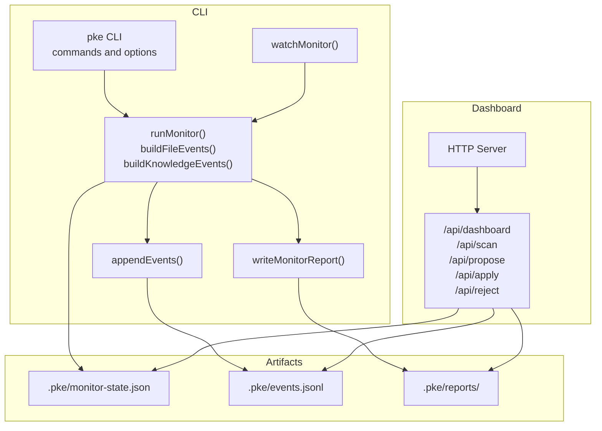
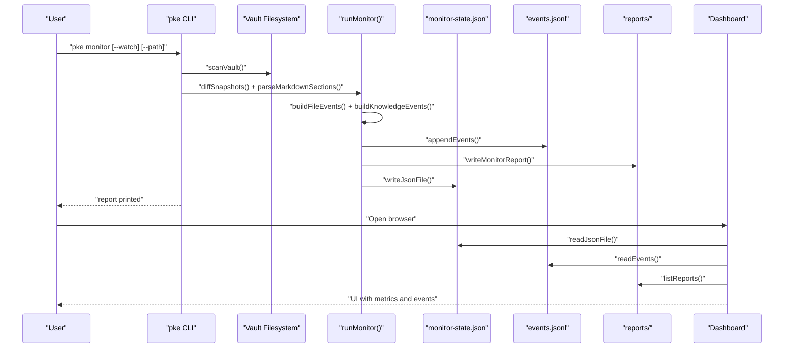
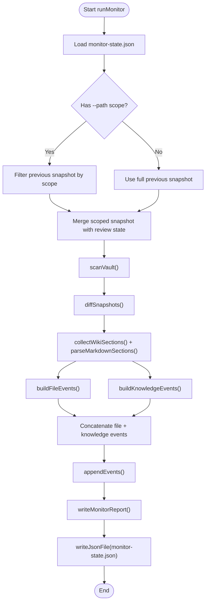
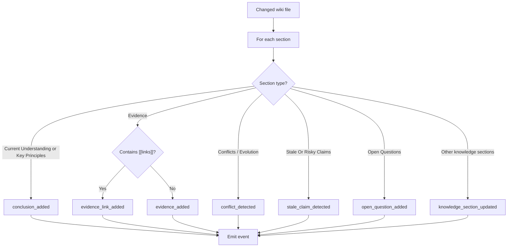
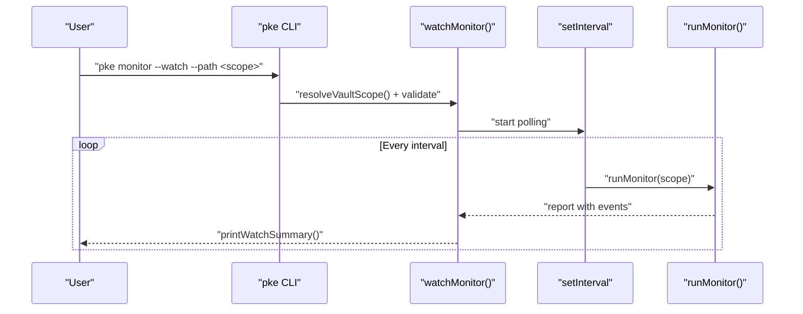
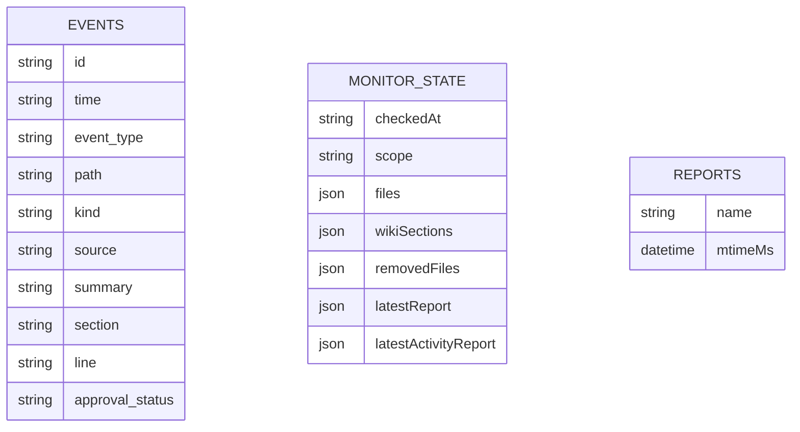
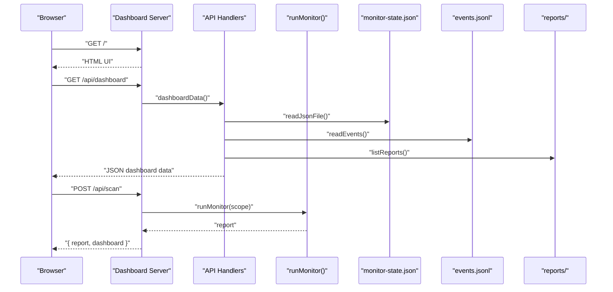
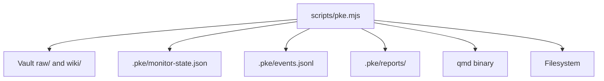

# Event Monitoring and Classification

<cite>
**Referenced Files in This Document**
- [README.md](file://README.md)
- [package.json](file://package.json)
- [scripts/pke.mjs](file://scripts/pke.mjs)
- [docs/prd.md](file://docs/prd.md)
- [docs/implementation-notes.md](file://docs/implementation-notes.md)
</cite>

## Table of Contents
1. [Introduction](#introduction)
2. [Project Structure](#project-structure)
3. [Core Components](#core-components)
4. [Architecture Overview](#architecture-overview)
5. [Detailed Component Analysis](#detailed-component-analysis)
6. [Dependency Analysis](#dependency-analysis)
7. [Performance Considerations](#performance-considerations)
8. [Troubleshooting Guide](#troubleshooting-guide)
9. [Conclusion](#conclusion)
10. [Appendices](#appendices)

## Introduction
This document explains the Personal Knowledge Engine’s monitoring and event classification system. It describes how the monitor makes knowledge changes observable through semantic event detection, details the detected event types, and documents the artifacts produced by the monitor. It also covers real-time monitoring with watch mode, scoped monitoring paths, configuration options, performance characteristics, and integration with the broader knowledge management workflow.

## Project Structure
The monitoring system is implemented as a CLI command and a local dashboard. The CLI orchestrates scanning, change detection, semantic classification, event logging, and report generation. The dashboard consumes the same artifacts to visualize events and manage proposals.

**Diagram sources**
- [scripts/pke.mjs:738-785](file://scripts/pke.mjs#L738-L785)
- [scripts/pke.mjs:787-810](file://scripts/pke.mjs#L787-L810)
- [scripts/pke.mjs:1390-1394](file://scripts/pke.mjs#L1390-L1394)
- [scripts/pke.mjs:1930-1936](file://scripts/pke.mjs#L1930-L1936)
- [scripts/pke.mjs:674-736](file://scripts/pke.mjs#L674-L736)

**Section sources**
- [README.md:128-184](file://README.md#L128-L184)
- [package.json:1-18](file://package.json#L1-L18)
- [scripts/pke.mjs:738-785](file://scripts/pke.mjs#L738-L785)

## Core Components
- Monitor orchestration: Scans vault or a scoped path, diffs snapshots, parses wiki sections, builds file-level and knowledge-level events, persists events and reports, and updates monitor state.
- Semantic classification: Maps wiki section changes to event types such as conclusion_added, conflict_detected, stale_claim_detected, open_question_added, evidence_added, evidence_link_added, conclusion_changed, knowledge_section_updated.
- Real-time watch mode: Polls a scoped path at a fixed interval and emits events continuously.
- Artifacts: monitor-state.json, events.jsonl, and timestamped markdown reports.
- Dashboard: Serves metrics, events, and proposals; supports manual scan and proposal actions.

**Section sources**
- [scripts/pke.mjs:738-785](file://scripts/pke.mjs#L738-L785)
- [scripts/pke.mjs:1324-1362](file://scripts/pke.mjs#L1324-L1362)
- [scripts/pke.mjs:787-810](file://scripts/pke.mjs#L787-L810)
- [docs/implementation-notes.md:50-73](file://docs/implementation-notes.md#L50-L73)
- [docs/prd.md:428-452](file://docs/prd.md#L428-L452)

## Architecture Overview
The monitor is an observability layer that does not write to wiki pages. It compares file snapshots, detects changes, and emits structured events. These events are appended to events.jsonl and summarized in reports. The dashboard reads these artifacts to visualize knowledge health and drive controlled self-improvement via proposals.

**Diagram sources**
- [scripts/pke.mjs:738-785](file://scripts/pke.mjs#L738-L785)
- [scripts/pke.mjs:1313-1348](file://scripts/pke.mjs#L1313-L1348)
- [scripts/pke.mjs:1390-1394](file://scripts/pke.mjs#L1390-L1394)
- [scripts/pke.mjs:1930-1936](file://scripts/pke.mjs#L1930-L1936)
- [scripts/pke.mjs:1667-1733](file://scripts/pke.mjs#L1667-L1733)

**Section sources**
- [README.md:128-184](file://README.md#L128-L184)
- [docs/prd.md:400-427](file://docs/prd.md#L400-L427)

## Detailed Component Analysis

### Monitor Orchestration
- Scoping: resolveVaultScope enforces that the watch path is inside the vault; filterSnapshotByScope and mergeScopedSnapshot preserve state across scoped scans.
- Change detection: scanVault walks the vault or scoped path, filters supported files, computes sha256, and diffs previous and current snapshots.
- Wiki section parsing: collectWikiSections and parseMarkdownSections split wiki pages into sections for line-wise comparison.
- Event building: buildFileEvents emits raw/wiki file-level events; buildKnowledgeEvents emits semantic knowledge events by comparing previous and current section content.
- Persistence: appendEvents writes events to events.jsonl; writeMonitorReport writes a markdown report; monitor-state.json is updated with merged snapshots and tombstones for removed files.

**Diagram sources**
- [scripts/pke.mjs:738-785](file://scripts/pke.mjs#L738-L785)
- [scripts/pke.mjs:1268-1275](file://scripts/pke.mjs#L1268-L1275)
- [scripts/pke.mjs:2159-2176](file://scripts/pke.mjs#L2159-L2176)
- [scripts/pke.mjs:1313-1348](file://scripts/pke.mjs#L1313-L1348)
- [scripts/pke.mjs:1390-1394](file://scripts/pke.mjs#L1390-L1394)
- [scripts/pke.mjs:1930-1936](file://scripts/pke.mjs#L1930-L1936)

**Section sources**
- [scripts/pke.mjs:738-785](file://scripts/pke.mjs#L738-L785)
- [scripts/pke.mjs:1268-1275](file://scripts/pke.mjs#L1268-L1275)
- [scripts/pke.mjs:2159-2176](file://scripts/pke.mjs#L2159-L2176)
- [scripts/pke.mjs:1313-1348](file://scripts/pke.mjs#L1313-L1348)

### Semantic Classification System
The monitor classifies wiki section changes into event types based on the section and content:

- Current Understanding or Key Principles → conclusion_added
- Evidence → evidence_added or evidence_link_added (based on presence of wiki-links)
- Conflicts / Evolution → conflict_detected
- Stale Or Risky Claims → stale_claim_detected
- Open Questions → open_question_added
- Other knowledge sections → knowledge_section_updated
- Special case: when Current Understanding has both additions and removals → conclusion_changed

**Diagram sources**
- [scripts/pke.mjs:1324-1362](file://scripts/pke.mjs#L1324-L1362)
- [docs/implementation-notes.md:103-110](file://docs/implementation-notes.md#L103-L110)

**Section sources**
- [scripts/pke.mjs:1324-1362](file://scripts/pke.mjs#L1324-L1362)
- [docs/implementation-notes.md:103-110](file://docs/implementation-notes.md#L103-L110)

### Real-Time Monitoring (Watch Mode)
- Requires --path and enforces that the path is inside the vault.
- Uses scoped polling at a configurable interval (default ~2 seconds).
- Emits periodic summaries and appends events to events.jsonl.
- Watch mode is implemented as a polling loop around runMonitor.

**Diagram sources**
- [scripts/pke.mjs:787-810](file://scripts/pke.mjs#L787-L810)
- [scripts/pke.mjs:798-804](file://scripts/pke.mjs#L798-L804)

**Section sources**
- [README.md:139-146](file://README.md#L139-L146)
- [scripts/pke.mjs:787-810](file://scripts/pke.mjs#L787-L810)
- [scripts/pke.mjs:798-804](file://scripts/pke.mjs#L798-L804)

### Artifacts and Data Models
- events.jsonl: Append-only log of knowledge events. Each line is a JSON object with fields such as id, time, event_type, path, kind, source, summary, section, line, and approval_status.
- monitor-state.json: Tracks the monitor’s view of the vault, including files, wikiSections, removedFiles tombstones, and latest reports.
- reports/: Timestamped markdown reports summarizing monitor runs.

**Diagram sources**
- [docs/prd.md:544-575](file://docs/prd.md#L544-L575)
- [docs/prd.md:595-626](file://docs/prd.md#L595-L626)
- [docs/prd.md:698-730](file://docs/prd.md#L698-L730)

**Section sources**
- [docs/prd.md:544-593](file://docs/prd.md#L544-L593)
- [docs/prd.md:595-626](file://docs/prd.md#L595-L626)
- [docs/prd.md:698-730](file://docs/prd.md#L698-L730)

### Event Types and Interpretation
The monitor emits the following event types for semantic classification:

- raw_added, raw_modified, raw_removed
- wiki_added, wiki_modified, wiki_removed
- conclusion_added, conclusion_changed
- evidence_added, evidence_link_added
- conflict_detected
- stale_claim_detected
- open_question_added
- knowledge_section_updated

Interpretation guidelines:
- conclusion_added/conclusion_changed: New durable knowledge or changes to Current Understanding; often require proposal for wiki updates.
- conflict_detected: Contradictions or belief evolution; may require proposal to reconcile.
- stale_claim_detected: Time-sensitive or risky claims; may require proposal to move to Stale Or Risky Claims.
- open_question_added: New unresolved questions; may require proposal to track in Open Questions.
- evidence_added/evidence_link_added: New evidence text or links; may trigger proposal to append to Evidence and Open Questions.
- knowledge_section_updated: Other knowledge sections updated; may warrant review.

**Section sources**
- [docs/prd.md:576-593](file://docs/prd.md#L576-L593)
- [docs/implementation-notes.md:103-110](file://docs/implementation-notes.md#L103-L110)
- [scripts/pke.mjs:1421-1432](file://scripts/pke.mjs#L1421-L1432)

### Dashboard Integration
- The dashboard serves a static HTML UI and JSON APIs:
  - GET /api/dashboard: returns dashboard data including totals, latest scans, activity events, and proposals.
  - GET /api/scan: runs a monitor scan for the configured scope and returns combined data.
  - POST /api/propose: creates a proposal from an event.
  - POST /api/apply: applies a pending proposal and refreshes qmd.
  - POST /api/reject: rejects a proposal.
- The dashboard reads events.jsonl, monitor-state.json, and reports/ to render metrics and event lists.

**Diagram sources**
- [scripts/pke.mjs:674-736](file://scripts/pke.mjs#L674-L736)
- [scripts/pke.mjs:1667-1733](file://scripts/pke.mjs#L1667-L1733)
- [scripts/pke.mjs:684-687](file://scripts/pke.mjs#L684-L687)

**Section sources**
- [docs/implementation-notes.md:66-72](file://docs/implementation-notes.md#L66-L72)
- [scripts/pke.mjs:674-736](file://scripts/pke.mjs#L674-L736)
- [scripts/pke.mjs:1667-1733](file://scripts/pke.mjs#L1667-L1733)

## Dependency Analysis
The monitor relies on:
- Vault layout: raw/ and wiki/ directories under the configured vault.
- qmd integration: runQmd spawns qmd for status, update, and embed operations; used by apply workflow and dashboard refresh.
- File scanning: walk and sha256 compute file metadata; diffSnapshots compares snapshots.
- Wiki parsing: parseMarkdownSections extracts section content for semantic classification.

**Diagram sources**
- [scripts/pke.mjs:812-822](file://scripts/pke.mjs#L812-L822)
- [scripts/pke.mjs:1268-1275](file://scripts/pke.mjs#L1268-L1275)
- [scripts/pke.mjs:1390-1394](file://scripts/pke.mjs#L1390-L1394)
- [scripts/pke.mjs:1930-1936](file://scripts/pke.mjs#L1930-L1936)

**Section sources**
- [scripts/pke.mjs:812-822](file://scripts/pke.mjs#L812-L822)
- [scripts/pke.mjs:1268-1275](file://scripts/pke.mjs#L1268-L1275)
- [scripts/pke.mjs:1390-1394](file://scripts/pke.mjs#L1390-L1394)
- [scripts/pke.mjs:1930-1936](file://scripts/pke.mjs#L1930-L1936)

## Performance Considerations
- File size limits: Files larger than 10 MB are skipped to avoid heavy IO.
- Event retention: events.jsonl is rotated when exceeding 100,000 entries; older events are archived.
- Report retention: Reports older than 90 days are archived.
- Scoped polling: Watch mode uses scoped polling instead of OS watchers to avoid watching unrelated files and to remain portable.
- Rate limiting and caps: Pending proposals capped at 200; candidates capped at 100 with 30-day expiry.

**Section sources**
- [scripts/pke.mjs:824-875](file://scripts/pke.mjs#L824-L875)
- [scripts/pke.mjs:1396-1410](file://scripts/pke.mjs#L1396-L1410)
- [scripts/pke.mjs:1947-1961](file://scripts/pke.mjs#L1947-L1961)
- [docs/implementation-notes.md:64-65](file://docs/implementation-notes.md#L64-L65)
- [docs/prd.md:149-156](file://docs/prd.md#L149-L156)

## Troubleshooting Guide
- Monitor path outside vault: watch requires --path inside the vault; otherwise an error is thrown.
- Oversized files: Large files are skipped with a warning; reduce file size or exclude from vault.
- Missing qmd: runQmd failures cause errors; ensure qmd is installed and available in PATH.
- No events observed: Verify monitor ran, events.jsonl exists, and dashboard is reading the correct scope.
- Proposal not applied: Ensure proposal status is pending, target page exists, and patch operations are present.

**Section sources**
- [scripts/pke.mjs:1268-1275](file://scripts/pke.mjs#L1268-L1275)
- [scripts/pke.mjs:838-840](file://scripts/pke.mjs#L838-L840)
- [scripts/pke.mjs:818-821](file://scripts/pke.mjs#L818-L821)
- [scripts/pke.mjs:1560-1567](file://scripts/pke.mjs#L1560-L1567)

## Conclusion
The Personal Knowledge Engine’s monitor provides a robust, local-first observability layer for knowledge changes. By combining file-level change detection with semantic classification of wiki sections, it emits actionable events that feed the dashboard and controlled self-improvement workflow. Real-time watch mode, scoped monitoring, and strict governance ensure that wiki writes remain proposal-only and auditable.

## Appendices

### Monitor Commands and Options
- pke monitor [--path vault-relative-path]
- pke monitor --watch --path vault-relative-path
- pke events [--limit N]
- pke dashboard [--port PORT] [--path vault-relative-path] [--auto-scan]

**Section sources**
- [README.md:56-80](file://README.md#L56-L80)
- [README.md:128-184](file://README.md#L128-L184)
- [scripts/pke.mjs:99-157](file://scripts/pke.mjs#L99-L157)

### Example Event Logs and Interpretation
- events.jsonl entries include id, time, event_type, path, kind, source, summary, section, line, approval_status.
- Interpretation: Use event_type to filter and triage; for example, conflict_detected or stale_claim_detected imply approval-required updates.

**Section sources**
- [docs/prd.md:544-575](file://docs/prd.md#L544-L575)
- [docs/prd.md:576-593](file://docs/prd.md#L576-L593)