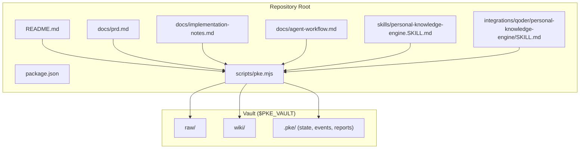
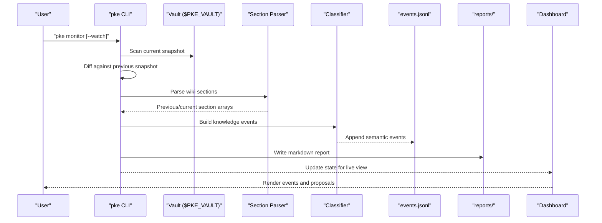
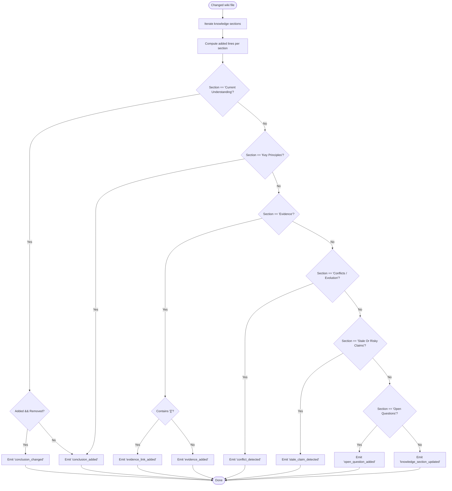
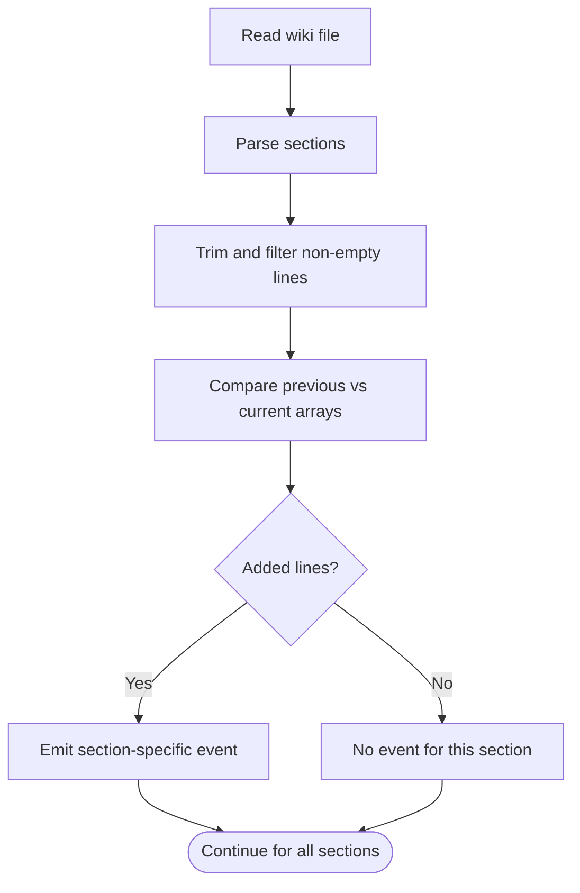
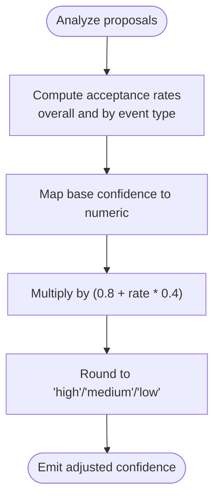
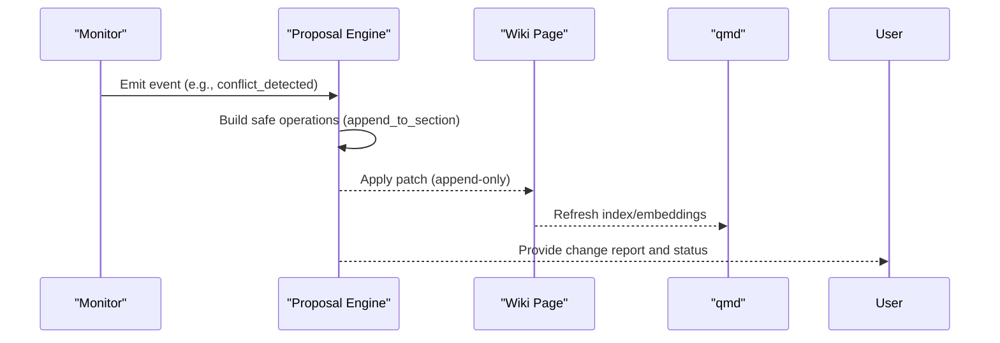
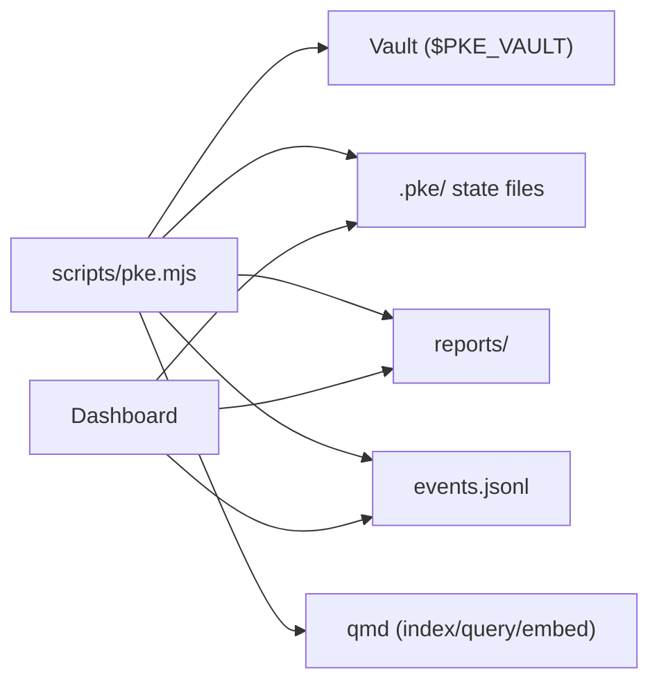

# Knowledge Event Classification

<cite>
**Referenced Files in This Document**
- [README.md](file://README.md)
- [package.json](file://package.json)
- [scripts/pke.mjs](file://scripts/pke.mjs)
- [docs/prd.md](file://docs/prd.md)
- [docs/implementation-notes.md](file://docs/implementation-notes.md)
- [docs/agent-workflow.md](file://docs/agent-workflow.md)
- [skills/personal-knowledge-engine.SKILL.md](file://skills/personal-knowledge-engine.SKILL.md)
- [integrations/qoder/personal-knowledge-engine/SKILL.md](file://integrations/qoder/personal-knowledge-engine/SKILL.md)
</cite>

## Table of Contents
1. [Introduction](#introduction)
2. [Project Structure](#project-structure)
3. [Core Components](#core-components)
4. [Architecture Overview](#architecture-overview)
5. [Detailed Component Analysis](#detailed-component-analysis)
6. [Dependency Analysis](#dependency-analysis)
7. [Performance Considerations](#performance-considerations)
8. [Troubleshooting Guide](#troubleshooting-guide)
9. [Conclusion](#conclusion)
10. [Appendices](#appendices)

## Introduction
This document explains the knowledge event classification system that powers the Personal Knowledge Engine (PKE). The system continuously monitors a local knowledge vault, detects changes to raw evidence and wiki knowledge pages, and automatically classifies those changes into semantic event types. These events inform downstream workflows such as proposal generation, dashboard visibility, and controlled self-improvement.

Key goals:
- Observe knowledge changes without writing to wiki
- Classify changes by semantic meaning (conclusions, conflicts, stale claims, open questions, evidence additions)
- Provide confidence-adjusted compile candidates
- Preserve raw notes as evidence and avoid silent pollution of the knowledge base

## Project Structure
The repository centers on a single CLI script that orchestrates scanning, classification, event logging, and proposal creation. Supporting documentation defines the product vision, templates, and workflows.

**Diagram sources**
- [scripts/pke.mjs](file://scripts/pke.mjs)
- [README.md](file://README.md)
- [docs/prd.md](file://docs/prd.md)
- [docs/implementation-notes.md](file://docs/implementation-notes.md)
- [docs/agent-workflow.md](file://docs/agent-workflow.md)
- [skills/personal-knowledge-engine.SKILL.md](file://skills/personal-knowledge-engine.SKILL.md)
- [integrations/qoder/personal-knowledge-engine/SKILL.md](file://integrations/qoder/personal-knowledge-engine/SKILL.md)

**Section sources**
- [README.md](file://README.md)
- [package.json](file://package.json)

## Core Components
- Monitor and classifier: Scans vault snapshots, diffs file hashes, parses wiki sections, and emits semantic events.
- Event log: Append-only JSONL stream of events for dashboards and reports.
- Proposal engine: Converts events into controlled, append-only wiki patches.
- Dashboard: Visualizes events, proposals, and reports.

Key capabilities:
- File-level events: raw_added, raw_modified, raw_removed, wiki_added, wiki_modified, wiki_removed
- Knowledge-level events: conclusion_added, conclusion_changed, evidence_added, evidence_link_added, conflict_detected, stale_claim_detected, open_question_added, knowledge_section_updated
- Confidence adjustment: Historical acceptance rates influence candidate confidence
- Controlled self-improvement: Approval-gated wiki updates via proposals

**Section sources**
- [README.md](file://README.md)
- [scripts/pke.mjs](file://scripts/pke.mjs)
- [docs/prd.md](file://docs/prd.md)
- [docs/implementation-notes.md](file://docs/implementation-notes.md)

## Architecture Overview
The classification pipeline runs in two stages:
1) File-level change detection: Compares current and previous file snapshots to detect added/modified/removed files.
2) Knowledge-level semantic classification: Parses wiki sections, compares previous/current section content, and emits events per section change.

**Diagram sources**
- [scripts/pke.mjs](file://scripts/pke.mjs)
- [README.md](file://README.md)

## Detailed Component Analysis

### Event Types and Classification Rules
The classifier emits the following event types based on wiki section changes and content:

- raw_added: New raw evidence file detected
- raw_modified: Existing raw file content changed
- raw_removed: Raw file removed from vault
- wiki_added: New wiki page detected
- wiki_modified: Existing wiki page content changed
- wiki_removed: Wiki page removed from vault
- conclusion_added: New conclusion or principle added to Current Understanding or Key Principles
- conclusion_changed: Lines added and removed in Current Understanding
- evidence_added: New non-link text added to Evidence
- evidence_link_added: New internal link added to Evidence
- conflict_detected: New content added to Conflicts / Evolution
- stale_claim_detected: New content added to Stale Or Risky Claims
- open_question_added: New content added to Open Questions
- knowledge_section_updated: Other knowledge sections changed (e.g., Related Pages)

Classification logic:
- For each changed wiki file, compare previous and current section arrays
- For each added line in a section, emit a section-specific event
- Special-case: When Current Understanding has both added and removed lines, emit conclusion_changed

**Diagram sources**
- [scripts/pke.mjs](file://scripts/pke.mjs)

**Section sources**
- [scripts/pke.mjs](file://scripts/pke.mjs)
- [docs/prd.md](file://docs/prd.md)

### Wiki Section Analysis and Conflict Detection
The classifier parses wiki pages into sections and compares arrays of non-empty, trimmed lines per section. Differences drive event emission. This enables:
- Detecting new conclusions and principles
- Tracking conflicts and belief evolution
- Flagging stale or risky claims
- Recording open questions
- Capturing evidence additions and link additions

**Diagram sources**
- [scripts/pke.mjs](file://scripts/pke.mjs)

**Section sources**
- [scripts/pke.mjs](file://scripts/pke.mjs)

### Confidence Scoring and Automated Decision-Making
The system adjusts candidate confidence using historical acceptance rates:
- Compute overall and per-event-type acceptance rates from proposals
- Map base confidence (high/medium/low) to a numeric scale
- Apply multiplicative adjustment in the 80–120% range
- Convert back to confidence labels

**Diagram sources**
- [scripts/pke.mjs](file://scripts/pke.mjs)

**Section sources**
- [scripts/pke.mjs](file://scripts/pke.mjs)

### Proposal Generation and Append-Only Patches
When events indicate knowledge changes, the system can generate proposals with append-only operations:
- Raw evidence changes: Append to Evidence and Open Questions
- Conflicts/stale claims/open questions: Append to respective sections
- Conclusion changes: Append to Current Understanding

**Diagram sources**
- [scripts/pke.mjs](file://scripts/pke.mjs)

**Section sources**
- [scripts/pke.mjs](file://scripts/pke.mjs)

### Examples of Event Classification Scenarios
- New raw file added: raw_added → propose Evidence and Open Questions entries
- Evidence section adds an internal link: evidence_link_added → propose Evidence and Open Questions entries
- Current Understanding adds a new principle: conclusion_added → propose Current Understanding update
- Conflicts / Evolution section adds a contradiction: conflict_detected → propose Conflicts / Evolution update
- Stale Or Risky Claims section flags a time-sensitive assumption: stale_claim_detected → propose Stale Or Risky Claims update
- Open Questions section adds a new question: open_question_added → propose Open Questions update
- Other knowledge sections change: knowledge_section_updated → propose Related Pages update

Interpretation:
- Events are observations; no wiki writes occur until explicit approval
- Proposals carry confidence and detected signals to aid decision-making
- Append-only patches ensure safe, reversible changes

**Section sources**
- [scripts/pke.mjs](file://scripts/pke.mjs)
- [docs/prd.md](file://docs/prd.md)

## Dependency Analysis
High-level dependencies:
- CLI depends on vault layout and qmd for indexing
- Monitor depends on file hashing and section parsing
- Proposal engine depends on event log and vault paths
- Dashboard depends on event log and reports

**Diagram sources**
- [scripts/pke.mjs](file://scripts/pke.mjs)
- [README.md](file://README.md)

**Section sources**
- [scripts/pke.mjs](file://scripts/pke.mjs)
- [README.md](file://README.md)

## Performance Considerations
- File scanning caps size and ignores hidden non-state files
- Scoped monitoring avoids watching unrelated paths
- Event log rotation limits storage growth
- Report retention archives older reports
- Watch mode uses polling with adjustable intervals

[No sources needed since this section provides general guidance]

## Troubleshooting Guide
Common issues and resolutions:
- Oversized files skipped: Increase size limit or split content
- Missing qmd: Ensure PATH includes qmd binary
- Watch path outside vault: Use a vault-relative path
- No events after changes: Confirm monitor scope and that files are supported types
- Proposal not applied: Verify proposal status and target existence

**Section sources**
- [scripts/pke.mjs](file://scripts/pke.mjs)
- [docs/implementation-notes.md](file://docs/implementation-notes.md)

## Conclusion
The knowledge event classification system provides a robust, approval-gated pathway from observation to controlled knowledge updates. By focusing on semantic classification of wiki section changes, it surfaces durable knowledge signals while preserving raw notes as evidence. Confidence adjustments and append-only proposals ensure safe, reversible self-improvement aligned with governance principles.

[No sources needed since this section summarizes without analyzing specific files]

## Appendices

### Appendix A: Event Types Reference
- raw_added, raw_modified, raw_removed
- wiki_added, wiki_modified, wiki_removed
- conclusion_added, conclusion_changed
- evidence_added, evidence_link_added
- conflict_detected
- stale_claim_detected
- open_question_added
- knowledge_section_updated

**Section sources**
- [docs/prd.md](file://docs/prd.md)
- [README.md](file://README.md)