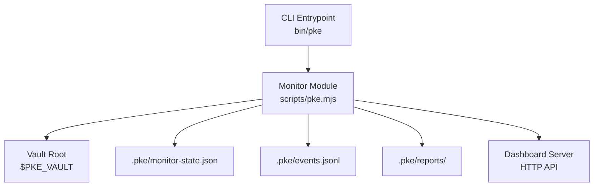
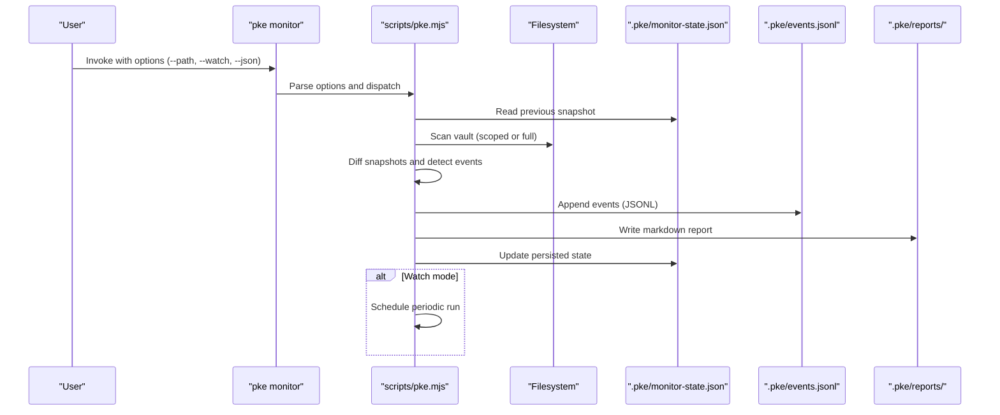
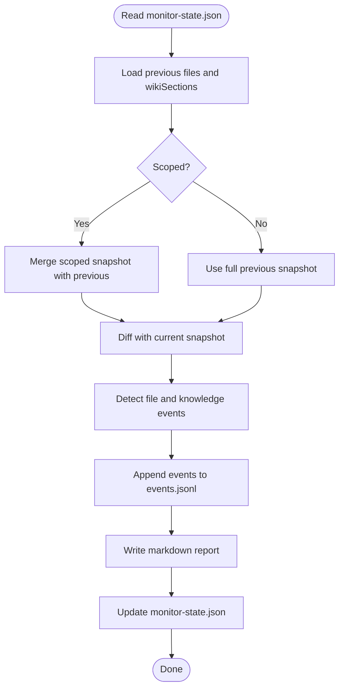
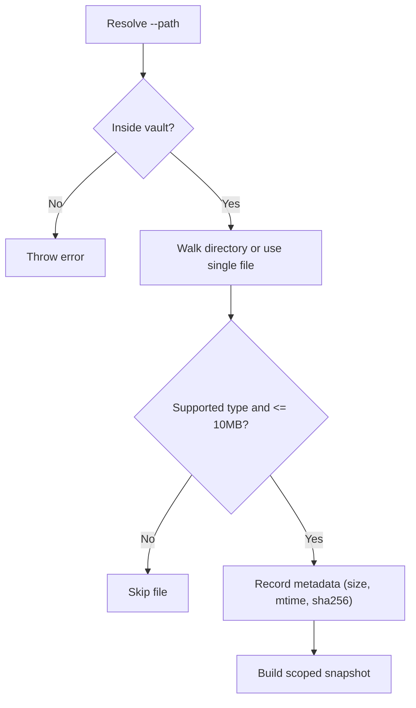
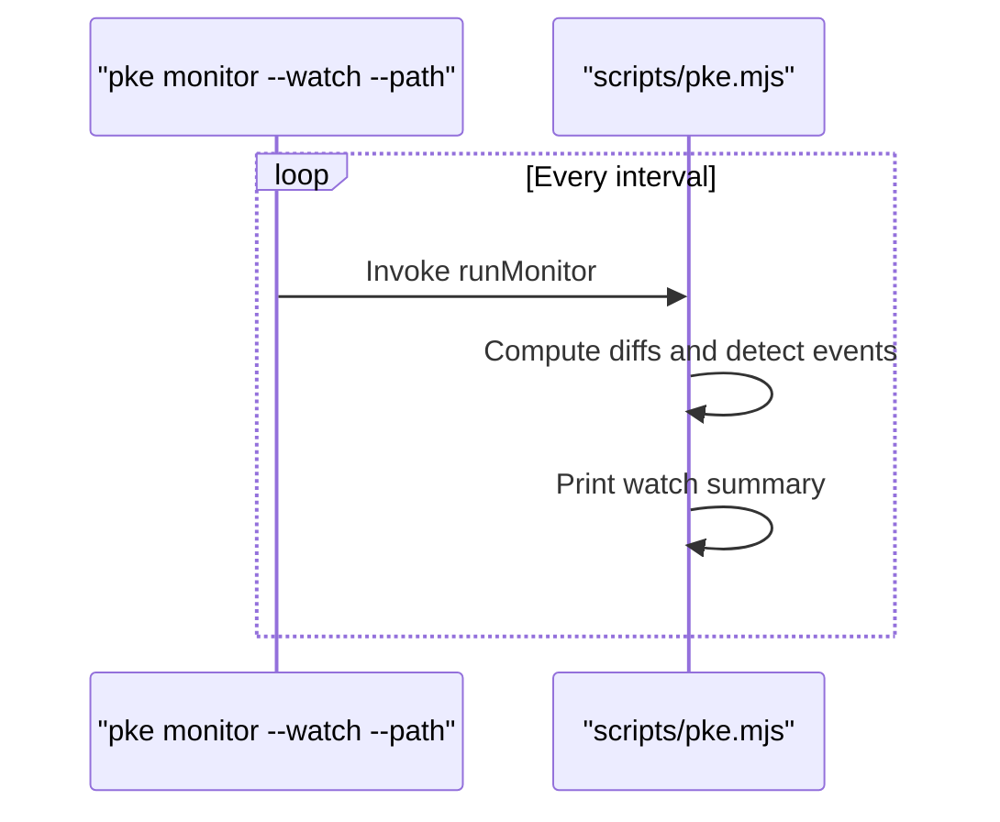
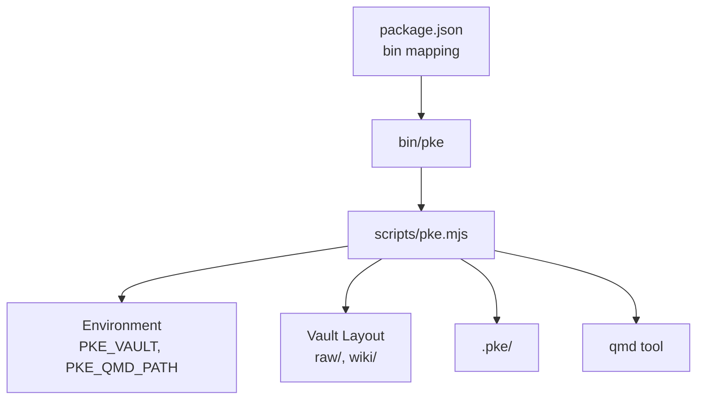

# Monitoring Configuration and Options

<cite>
**Referenced Files in This Document**
- [README.md](file://README.md)
- [package.json](file://package.json)
- [bin/pke](file://bin/pke)
- [scripts/pke.mjs](file://scripts/pke.mjs)
- [docs/prd.md](file://docs/prd.md)
</cite>

## Table of Contents
1. [Introduction](#introduction)
2. [Project Structure](#project-structure)
3. [Core Components](#core-components)
4. [Architecture Overview](#architecture-overview)
5. [Detailed Component Analysis](#detailed-component-analysis)
6. [Dependency Analysis](#dependency-analysis)
7. [Performance Considerations](#performance-considerations)
8. [Troubleshooting Guide](#troubleshooting-guide)
9. [Conclusion](#conclusion)
10. [Appendices](#appendices)

## Introduction
This document explains how to configure and customize the monitoring system for the Personal Knowledge Engine (PKE). It covers monitor command options, state management, monitoring scopes and filters, and performance tuning. It also provides practical examples and guidance for real-time monitoring, output formatting, and resource optimization.

## Project Structure
The monitoring system is implemented as a CLI command with supporting artifacts stored under the vault’s .pke directory. The CLI entrypoint delegates to a JavaScript module that orchestrates scanning, event detection, reporting, and persistence.

**Diagram sources**
- [bin/pke:1-10](file://bin/pke#L1-L10)
- [scripts/pke.mjs:1-47](file://scripts/pke.mjs#L1-L47)
- [scripts/pke.mjs:23-29](file://scripts/pke.mjs#L23-L29)

**Section sources**
- [README.md:43-80](file://README.md#L43-L80)
- [package.json:7-9](file://package.json#L7-L9)
- [bin/pke:1-10](file://bin/pke#L1-L10)
- [scripts/pke.mjs:1-47](file://scripts/pke.mjs#L1-L47)

## Core Components
- Monitor command: runs one-off or continuous monitoring with optional scoping and JSON output.
- State management: persists monitor snapshots and metadata to monitor-state.json.
- Event log: append-only JSONL stream of knowledge events.
- Reports: markdown summaries written to reports/ with retention policies.
- Dashboard: HTTP server exposing APIs for scanning, proposing, applying, and viewing state.

Key behaviors:
- Scoping via --path restricts monitoring to a vault-relative path.
- Real-time watch mode requires --watch and --path.
- JSON output is supported via --json for select commands.
- Polling interval defaults to 2000 ms and can be tuned via --interval or --debounce.

**Section sources**
- [README.md:68-79](file://README.md#L68-L79)
- [README.md:128-177](file://README.md#L128-L177)
- [scripts/pke.mjs:119-139](file://scripts/pke.mjs#L119-L139)
- [scripts/pke.mjs:440-446](file://scripts/pke.mjs#L440-L446)
- [scripts/pke.mjs:787-810](file://scripts/pke.mjs#L787-L810)
- [scripts/pke.mjs:2019-2045](file://scripts/pke.mjs#L2019-L2045)
- [docs/prd.md:404-426](file://docs/prd.md#L404-L426)

## Architecture Overview
The monitor pipeline reads prior state, scans the vault (scoped or full), diffs snapshots, detects file and knowledge-level events, appends to the event log, writes a report, and updates monitor-state.json. In watch mode, the pipeline repeats on a polling interval.

**Diagram sources**
- [scripts/pke.mjs:440-446](file://scripts/pke.mjs#L440-L446)
- [scripts/pke.mjs:738-785](file://scripts/pke.mjs#L738-L785)
- [scripts/pke.mjs:1390-1410](file://scripts/pke.mjs#L1390-L1410)
- [scripts/pke.mjs:1930-1936](file://scripts/pke.mjs#L1930-L1936)
- [scripts/pke.mjs:787-810](file://scripts/pke.mjs#L787-L810)

## Detailed Component Analysis

### Monitor Command Options
- --path <vault-relative-path>
  - Restricts monitoring to a vault-relative directory or file.
  - Enforced to remain inside the vault; otherwise an error is thrown.
  - Used to compute a scoped snapshot and preserve out-of-scope state during merges.
- --watch
  - Enables real-time monitoring by polling at a fixed interval.
  - Requires --path; otherwise an error is thrown.
  - Interval defaults to 2000 ms and can be customized via --interval or --debounce.
- --json
  - Switches output to JSON for supported commands (e.g., monitor, events, report usage).
- Additional options
  - --vault, --collection, --state, --port, --auto-scan, --save, --write, --usage, --target, --apply, --verbose, etc.

Behavioral notes:
- One-shot monitor: runs once and exits.
- Watch mode: logs a summary each cycle and continues until interrupted.
- JSON output: prints compact JSON for machine consumption.

**Section sources**
- [README.md:128-177](file://README.md#L128-L177)
- [scripts/pke.mjs:119-139](file://scripts/pke.mjs#L119-L139)
- [scripts/pke.mjs:440-446](file://scripts/pke.mjs#L440-L446)
- [scripts/pke.mjs:787-810](file://scripts/pke.mjs#L787-L810)
- [scripts/pke.mjs:1216-1218](file://scripts/pke.mjs#L1216-L1218)

### Monitor State Management
- Persistence location
  - monitor-state.json resides under $PKE_VAULT/.pke/.
  - Stores files, wikiSections, removedFiles tombstones, and latest reports.
- Restoration
  - On each run, the monitor reads monitor-state.json to compute deltas against the current snapshot.
- Scoped merges
  - When using --path, the monitor merges scoped snapshots while preserving out-of-scope entries.
- Tombstones
  - Tracks removed files to avoid false positives across cycles.

**Diagram sources**
- [scripts/pke.mjs:738-785](file://scripts/pke.mjs#L738-L785)
- [scripts/pke.mjs:2168-2202](file://scripts/pke.mjs#L2168-L2202)

**Section sources**
- [README.md:147-153](file://README.md#L147-L153)
- [docs/prd.md:404-426](file://docs/prd.md#L404-L426)
- [scripts/pke.mjs:23-29](file://scripts/pke.mjs#L23-L29)
- [scripts/pke.mjs:738-785](file://scripts/pke.mjs#L738-L785)
- [scripts/pke.mjs:2168-2202](file://scripts/pke.mjs#L2168-L2202)

### Configuration of Monitoring Scopes, Filters, and Exclusions
- Scope resolution
  - --path is resolved relative to the vault root and must stay within the vault.
  - The monitor computes absolute and relative paths and enforces containment.
- Supported file types
  - Only .md, .txt, and .markdown files are considered.
- Size limits
  - Files larger than 10 MB are skipped with a warning.
- Directory traversal
  - Hidden entries starting with "." are ignored except for the .pke directory itself.
- Wiki section parsing
  - For wiki files, sections are parsed to detect knowledge-level events.

**Diagram sources**
- [scripts/pke.mjs:1268-1275](file://scripts/pke.mjs#L1268-L1275)
- [scripts/pke.mjs:824-875](file://scripts/pke.mjs#L824-L875)
- [scripts/pke.mjs:887-890](file://scripts/pke.mjs#L887-L890)
- [scripts/pke.mjs:825-840](file://scripts/pke.mjs#L825-L840)

**Section sources**
- [scripts/pke.mjs:1268-1275](file://scripts/pke.mjs#L1268-L1275)
- [scripts/pke.mjs:824-875](file://scripts/pke.mjs#L824-L875)
- [scripts/pke.mjs:887-890](file://scripts/pke.mjs#L887-L890)
- [scripts/pke.mjs:825-840](file://scripts/pke.mjs#L825-L840)

### Event Types and Knowledge-Level Detection
The monitor emits both file-level and knowledge-level events derived from wiki section changes. Knowledge-level events include:
- conclusion_added
- conclusion_changed
- conflict_detected
- stale_claim_detected
- open_question_added
- evidence_added
- evidence_link_added
- knowledge_section_updated

These are derived from differences in wiki section content between snapshots.

**Section sources**
- [README.md:155-169](file://README.md#L155-L169)
- [scripts/pke.mjs:1313-1362](file://scripts/pke.mjs#L1313-L1362)
- [scripts/pke.mjs:1324-1348](file://scripts/pke.mjs#L1324-L1348)

### Real-Time Watch Mode and Polling
- Watch mode requires --watch and --path.
- Polling interval defaults to 2000 ms and can be customized via --interval or --debounce.
- On each cycle, the monitor prints a summary if there are events or verbose mode is enabled.

**Diagram sources**
- [scripts/pke.mjs:787-810](file://scripts/pke.mjs#L787-L810)
- [scripts/pke.mjs:2074-2080](file://scripts/pke.mjs#L2074-L2080)

**Section sources**
- [README.md:139-145](file://README.md#L139-L145)
- [scripts/pke.mjs:787-810](file://scripts/pke.mjs#L787-L810)
- [scripts/pke.mjs:2074-2080](file://scripts/pke.mjs#L2074-L2080)

### Output Formatting and Reporting
- --json toggles JSON output for supported commands.
- Reports are written to .pke/reports/ with timestamps and retained for up to 90 days.
- Event logs are rotated when exceeding 100,000 entries.

**Section sources**
- [README.md:147-153](file://README.md#L147-L153)
- [scripts/pke.mjs:1216-1218](file://scripts/pke.mjs#L1216-L1218)
- [scripts/pke.mjs:1930-1936](file://scripts/pke.mjs#L1930-L1936)
- [scripts/pke.mjs:1947-1961](file://scripts/pke.mjs#L1947-L1961)
- [scripts/pke.mjs:1396-1410](file://scripts/pke.mjs#L1396-L1410)

### Examples and Use Cases
- One-shot scoped monitor for a specific wiki page:
  - pke monitor --path wiki/qoderwork-commercial-thinking.md
- Real-time watch for a directory:
  - pke monitor --watch --path wiki/
- JSON output for automation:
  - pke monitor --path raw/ --json
- Dashboard with auto-scan:
  - pke dashboard --path raw/ --auto-scan

**Section sources**
- [README.md:134-145](file://README.md#L134-L145)
- [README.md:171-183](file://README.md#L171-L183)

## Dependency Analysis
The monitor relies on the vault layout and environment configuration. It reads/writes artifacts under $PKE_VAULT/.pke and depends on the qmd tool for knowledge refresh after applying proposals.

**Diagram sources**
- [package.json:7-9](file://package.json#L7-L9)
- [bin/pke:1-10](file://bin/pke#L1-L10)
- [scripts/pke.mjs:9-14](file://scripts/pke.mjs#L9-L14)
- [scripts/pke.mjs:1660-1665](file://scripts/pke.mjs#L1660-L1665)

**Section sources**
- [package.json:7-9](file://package.json#L7-L9)
- [bin/pke:1-10](file://bin/pke#L1-L10)
- [scripts/pke.mjs:9-14](file://scripts/pke.mjs#L9-L14)
- [scripts/pke.mjs:1660-1665](file://scripts/pke.mjs#L1660-L1665)

## Performance Considerations
- Polling vs. OS watchers
  - The monitor uses scoped polling instead of OS-specific watchers to ensure consistent behavior across environments.
- Interval tuning
  - Use --interval or --debounce to adjust polling cadence; default is 2000 ms.
- File size and type filtering
  - Files larger than 10 MB are skipped to reduce overhead.
  - Only supported text-based files are processed.
- Event log rotation
  - Event logs are pruned to a maximum of 100,000 entries to control disk usage.
- Report retention
  - Reports older than 90 days are archived to keep the reports directory manageable.
- Memory management
  - Snapshots and diffs are computed incrementally; state is merged per scope to avoid unbounded growth.

[No sources needed since this section provides general guidance]

## Troubleshooting Guide
- Watch requires --path
  - If --watch is used without --path, the monitor throws an error requiring a scoped path.
- Path outside vault
  - Using --path outside the vault root results in an error; ensure the path is vault-relative and contained within the vault.
- Oversized files
  - Files larger than 10 MB are skipped with a warning; reduce file size or exclude via scope.
- Event log growth
  - Event logs are rotated automatically; check archives if needed.
- Report retention
  - Old reports are archived after 90 days; verify retention settings if reports are missing.
- Dashboard auto-scan
  - When using --auto-scan, the dashboard triggers a monitor scan on refresh; ensure the configured scope is appropriate.

**Section sources**
- [scripts/pke.mjs:787-790](file://scripts/pke.mjs#L787-L790)
- [scripts/pke.mjs:1268-1275](file://scripts/pke.mjs#L1268-L1275)
- [scripts/pke.mjs:825-840](file://scripts/pke.mjs#L825-L840)
- [scripts/pke.mjs:1396-1410](file://scripts/pke.mjs#L1396-L1410)
- [scripts/pke.mjs:1947-1961](file://scripts/pke.mjs#L1947-L1961)
- [README.md:179-183](file://README.md#L179-L183)

## Conclusion
The PKE monitoring system offers flexible, scoped, and persistent observation of knowledge changes. With options for real-time watch, JSON output, and robust state management, it supports both interactive and automated workflows. Properly tuning scope, interval, and retention ensures reliable performance across diverse environments.

[No sources needed since this section summarizes without analyzing specific files]

## Appendices

### Appendix A: Monitor Artifacts
- .pke/monitor-state.json: persisted snapshot and metadata
- .pke/events.jsonl: append-only event log
- .pke/reports/: dated markdown reports with retention policy
- .pke/proposals/, .pke/applied/, .pke/rejected/, .pke/backups/: proposal lifecycle artifacts

**Section sources**
- [README.md:147-153](file://README.md#L147-L153)
- [scripts/pke.mjs:23-29](file://scripts/pke.mjs#L23-L29)
- [scripts/pke.mjs:1947-1961](file://scripts/pke.mjs#L1947-L1961)