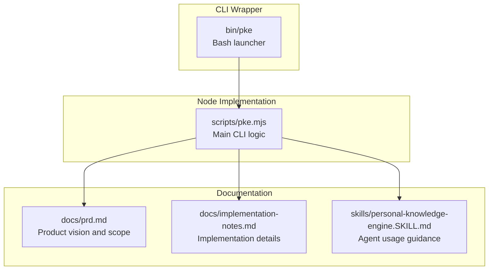
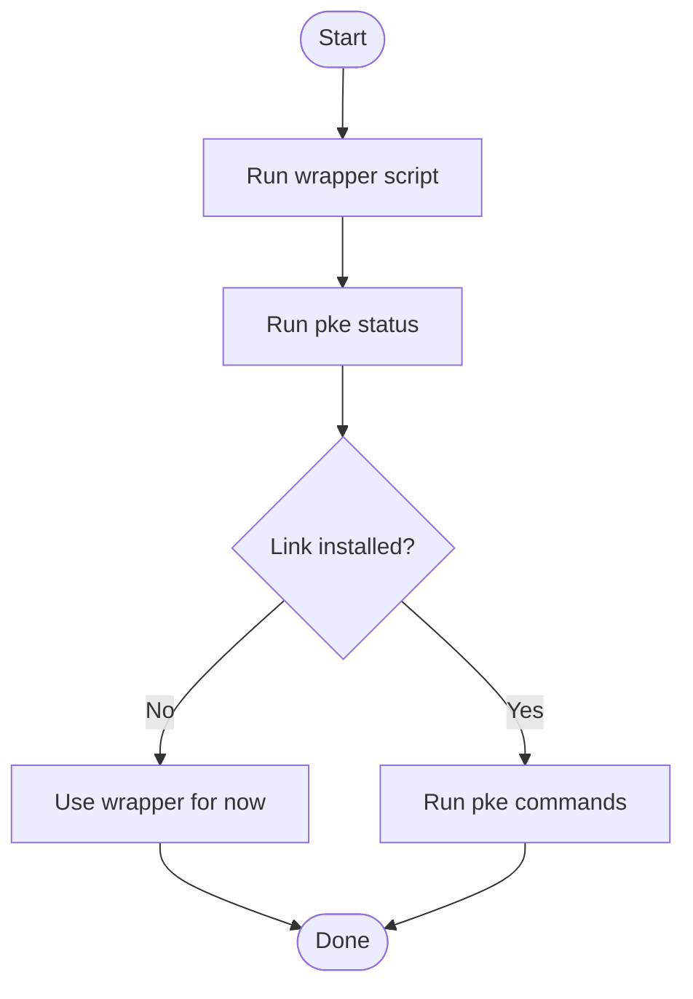
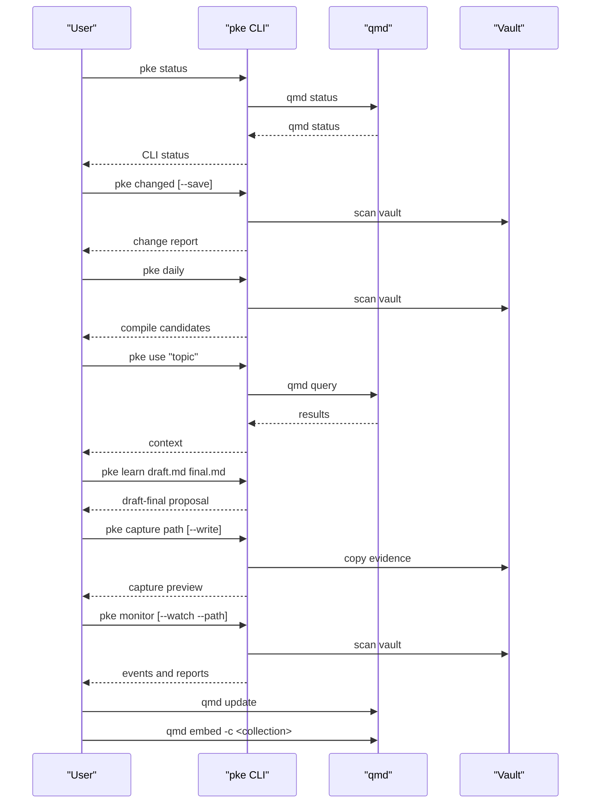

# Getting Started

<cite>
**Referenced Files in This Document**
- [README.md](file://README.md)
- [package.json](file://package.json)
- [bin/pke](file://bin/pke)
- [scripts/pke.mjs](file://scripts/pke.mjs)
- [docs/prd.md](file://docs/prd.md)
- [docs/implementation-notes.md](file://docs/implementation-notes.md)
- [skills/personal-knowledge-engine.SKILL.md](file://skills/personal-knowledge-engine.SKILL.md)
</cite>

## Table of Contents
1. [Introduction](#introduction)
2. [Project Structure](#project-structure)
3. [System Requirements](#system-requirements)
4. [Installation](#installation)
5. [Initial Setup](#initial-setup)
6. [First-Time User Workflow](#first-time-user-workflow)
7. [Environment Variables](#environment-variables)
8. [Quick Start Examples](#quick-start-examples)
9. [Verification and Troubleshooting](#verification-and-troubleshooting)
10. [Conclusion](#conclusion)

## Introduction
This guide helps you install and run the Personal Knowledge Engine MVP locally. It covers system requirements, installation options, initial vault setup, and a practical first-run workflow. You will learn how to capture evidence, monitor changes, and use knowledge safely, with governance that keeps wiki pages curated and trustworthy.

## Project Structure
At a high level, the MVP consists of:
- A small CLI wrapper that launches the Node script.
- A Node-based CLI implementation that orchestrates vault scanning, qmd integration, and knowledge monitoring.
- Documentation and skills that describe the intended workflow and governance.

**Diagram sources**
- [bin/pke](file://bin/pke)
- [scripts/pke.mjs](file://scripts/pke.mjs)
- [docs/prd.md](file://docs/prd.md)
- [docs/implementation-notes.md](file://docs/implementation-notes.md)
- [skills/personal-knowledge-engine.SKILL.md](file://skills/personal-knowledge-engine.SKILL.md)

**Section sources**
- [README.md](file://README.md)
- [package.json](file://package.json)

## System Requirements
- Node.js: Version 18 or higher is required.
- qmd: MinerU Document Explorer’s qmd binary must be available on PATH. The CLI prepends a macOS Homebrew path by default to help locate qmd.
- Vault layout: A local vault directory containing two folders:
  - raw/: for evidence files
  - wiki/: for compiled knowledge pages

Notes:
- The CLI uses only Node built-in modules and does not rely on external npm packages.
- The default vault location is a user-specific directory, and can be customized via environment variables or CLI flags.

**Section sources**
- [package.json](file://package.json)
- [README.md](file://README.md)
- [docs/prd.md](file://docs/prd.md)
- [scripts/pke.mjs](file://scripts/pke.mjs)

## Installation
There are two ways to run the CLI:

Option A: Run directly from the repository
- Use the wrapper script to launch the Node implementation without installing globally.

Option B: Optional local link (recommended for frequent use)
- Link the package locally so you can run pke from anywhere.
- After linking, run pke status to verify installation.

**Diagram sources**
- [README.md](file://README.md)
- [bin/pke](file://bin/pke)
- [scripts/pke.mjs](file://scripts/pke.mjs)

**Section sources**
- [README.md](file://README.md)
- [bin/pke](file://bin/pke)
- [package.json](file://package.json)

## Initial Setup
Create your vault structure with the required folders and initialize qmd indexing.

1. Create the vault root directory and the two required subfolders:
   - raw/
   - wiki/

2. Initialize qmd indexing for your vault:
   - Run qmd update to index your vault.
   - Run qmd embed -c <collection-name> to embed the index into your collection.

3. Confirm qmd is available on PATH:
   - On macOS with Homebrew, qmd is typically under /opt/homebrew/bin. The CLI prepends this path when invoking qmd.

4. Optional: Configure environment variables to customize the vault and qmd path.

**Section sources**
- [README.md](file://README.md)
- [docs/prd.md](file://docs/prd.md)
- [scripts/pke.mjs](file://scripts/pke.mjs)

## First-Time User Workflow
Follow this end-to-end flow from installation to first use:

1. Verify installation
   - Run pke status to confirm the CLI can access qmd and read your vault.

2. Inspect changed files
   - Run pke changed to compare snapshots and identify new or modified files.
   - Optionally save a baseline after reviewing changes.

3. Daily compilation proposal
   - Run pke daily to review changed files and generate compile candidates.
   - Review recommendations and decide whether to proceed with wiki updates.

4. Use knowledge
   - Run pke use "your topic" to retrieve relevant wiki pages and raw notes via qmd.

5. Learn from draft to final
   - Run pke learn draft.md final.md to compare differences and propose wiki updates.

6. Capture evidence
   - Run pke capture path/to/source.md [--write] to copy evidence into raw/_captures/.

7. Monitor knowledge changes
   - Run pke monitor for a one-shot report.
   - Optionally run pke monitor --watch --path wiki/ for scoped realtime monitoring.

8. Refresh qmd after approved wiki edits
   - After applying a proposal, run qmd update and qmd embed -c <collection-name> to keep the index fresh.

**Diagram sources**
- [scripts/pke.mjs](file://scripts/pke.mjs)
- [docs/implementation-notes.md](file://docs/implementation-notes.md)

**Section sources**
- [README.md](file://README.md)
- [docs/implementation-notes.md](file://docs/implementation-notes.md)
- [scripts/pke.mjs](file://scripts/pke.mjs)

## Environment Variables
Customize the CLI behavior using environment variables and CLI flags.

- PKE_VAULT
  - Purpose: Root vault directory containing raw/, wiki/, and .pke/.
  - Default: A user-specific directory.
  - Override: Use --vault <path> or set PKE_VAULT.

- PKE_QMD_PATH
  - Purpose: Directory containing the qmd binary.
  - Default: /opt/homebrew/bin (macOS Homebrew).
  - Override: Set PKE_QMD_PATH or ensure qmd is on PATH.

- PATH
  - The CLI prepends PKE_QMD_PATH to PATH when spawning qmd processes, ensuring qmd resolves to the intended runtime.

- CLI flags
  - --vault <path>: Override vault root.
  - --collection <name>: Override qmd collection name.
  - --state <path>: Override state file path.
  - --json: Output structured JSON where supported.
  - --watch: Watch mode for monitor (requires --path).
  - --port <number>: Dashboard port.
  - --auto-scan: Dashboard auto-scans on refresh.
  - --target <path>: Target wiki page for a proposal.
  - --apply: Write self-improvement proposals (for improve command).

Derived paths are computed from the vault root and include:
- .pke/state.json
- .pke/monitor-state.json
- .pke/events.jsonl
- .pke/reports/
- .pke/proposals/, .pke/applied/, .pke/rejected/, .pke/backups/
- wiki/
- raw/

**Section sources**
- [scripts/pke.mjs](file://scripts/pke.mjs)
- [docs/prd.md](file://docs/prd.md)
- [README.md](file://README.md)

## Quick Start Examples
Below are practical examples demonstrating the core workflow. Replace placeholders with your actual paths and topics.

- Run help to see all commands
  - pke help

- Check status
  - pke status

- Inspect changed files and save baseline
  - pke changed
  - pke changed --save

- Daily compilation proposal
  - pke daily

- Retrieve knowledge
  - pke use "your topic"

- Compare draft and final to propose wiki updates
  - pke learn draft.md final.md

- Capture evidence
  - pke capture path/to/source.md [--write]

- Monitor knowledge changes
  - pke monitor
  - pke monitor --path wiki/
  - pke monitor --watch --path wiki/

- View events and reports
  - pke events [--limit 20]
  - pke report latest|today

- Launch dashboard
  - pke dashboard [--port 8787] [--path raw/] [--auto-scan]

- Controlled self-improvement
  - pke candidates
  - pke propose --path raw/note.md [--target wiki/page.md]
  - pke proposals
  - pke proposal proposal-id
  - pke apply proposal-id
  - pke reject proposal-id

- Refresh qmd after approved wiki edits
  - PATH=/opt/homebrew/bin:$PATH qmd update
  - PATH=/opt/homebrew/bin:$PATH qmd embed -c <collection-name>

**Section sources**
- [README.md](file://README.md)
- [docs/implementation-notes.md](file://docs/implementation-notes.md)
- [skills/personal-knowledge-engine.SKILL.md](file://skills/personal-knowledge-engine.SKILL.md)

## Verification and Troubleshooting
Verify your installation and troubleshoot common issues:

- Verify CLI availability
  - Run pke help to confirm the CLI is executable.
  - If using the wrapper, run ./bin/pke help.

- Verify Node.js version
  - Ensure Node.js >= 18 is installed.

- Verify qmd availability
  - Run qmd status to confirm qmd is available on PATH.
  - On macOS with Homebrew, qmd is typically under /opt/homebrew/bin. The CLI prepends this path when invoking qmd.

- Check vault structure
  - Ensure raw/ and wiki/ exist under your vault root.
  - Confirm .pke/ subdirectories exist after running commands.

- Monitor watch mode
  - Realtime watch requires --path and the path must be inside the vault.
  - Scoped polling is used; it does not watch the entire vault.

- Proposal application
  - Applying a proposal creates a backup and attempts qmd update and embed.
  - If qmd refresh fails, the wiki patch remains applied and the failure is recorded.

- JSON output mode
  - Many commands support --json for programmatic consumption.

- Common error messages
  - Unknown commands: See pke help for available commands.
  - Missing required arguments: Commands will print usage guidance.
  - Proposal validation: apply validates proposal status, target page existence, and patch operations.

**Section sources**
- [README.md](file://README.md)
- [scripts/pke.mjs](file://scripts/pke.mjs)
- [docs/prd.md](file://docs/prd.md)
- [docs/implementation-notes.md](file://docs/implementation-notes.md)

## Conclusion
You are now ready to use the Personal Knowledge Engine MVP. Start by verifying your environment, creating the vault structure, and running pke status. Follow the first-time workflow to capture evidence, monitor changes, and use knowledge responsibly. Customize the vault and qmd path using environment variables or CLI flags, and leverage the dashboard for a visual overview of knowledge health.