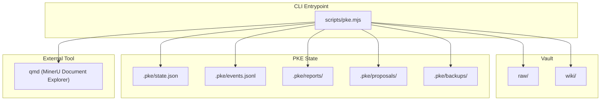
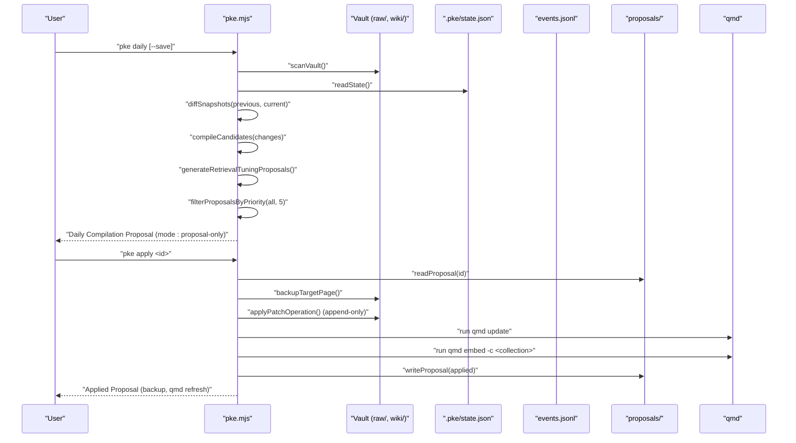
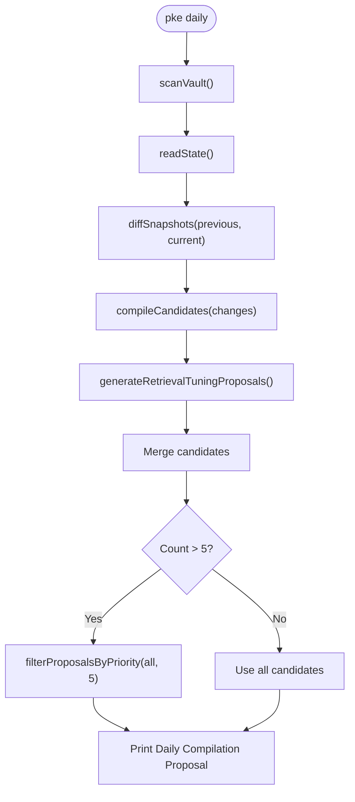
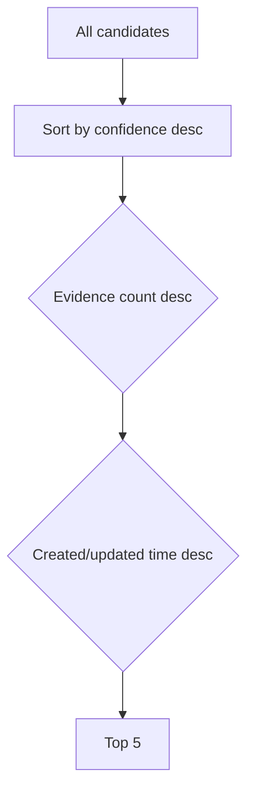
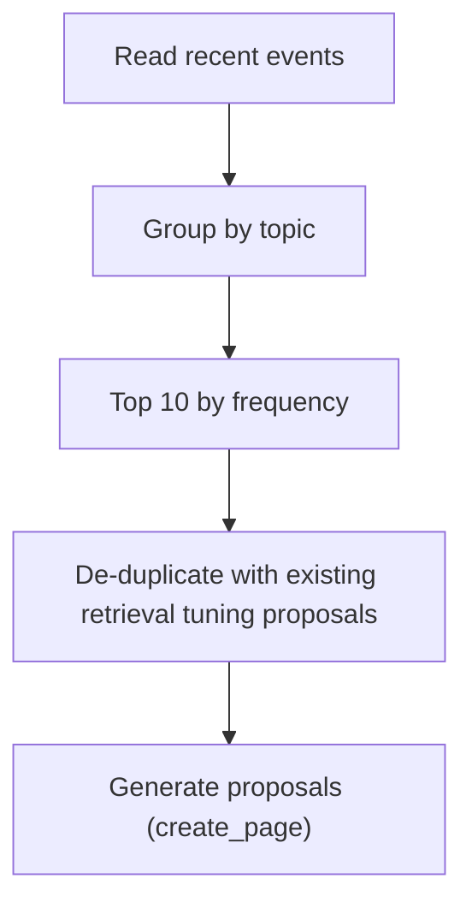
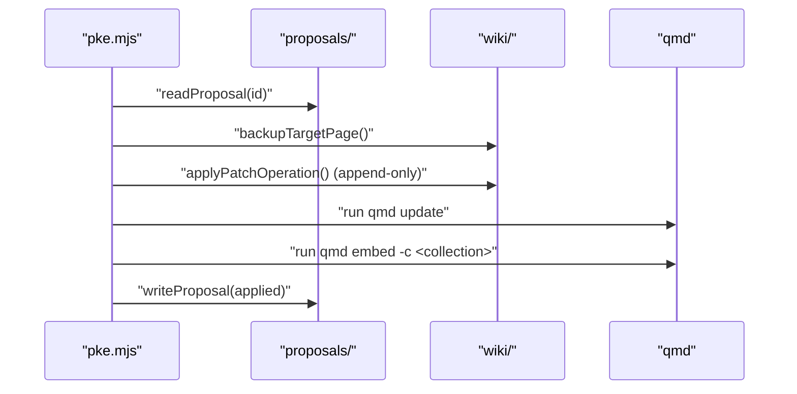
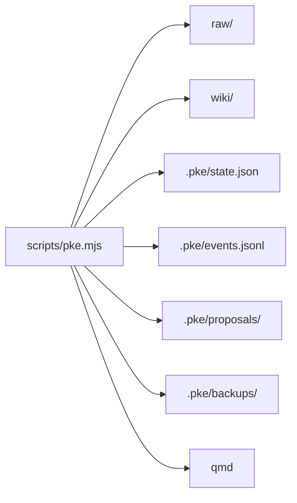

# Daily Compilation Routine

<cite>
**Referenced Files in This Document**
- [README.md](file://README.md)
- [package.json](file://package.json)
- [scripts/pke.mjs](file://scripts/pke.mjs)
- [skills/personal-knowledge-engine.SKILL.md](file://skills/personal-knowledge-engine.SKILL.md)
- [docs/prd.md](file://docs/prd.md)
- [docs/agent-workflow.md](file://docs/agent-workflow.md)
</cite>

## Table of Contents
1. [Introduction](#introduction)
2. [Project Structure](#project-structure)
3. [Core Components](#core-components)
4. [Architecture Overview](#architecture-overview)
5. [Detailed Component Analysis](#detailed-component-analysis)
6. [Dependency Analysis](#dependency-analysis)
7. [Performance Considerations](#performance-considerations)
8. [Troubleshooting Guide](#troubleshooting-guide)
9. [Conclusion](#conclusion)
10. [Appendices](#appendices)

## Introduction
This document explains the daily compilation routine in Personal Knowledge Engine (PKE). The daily command automates knowledge compilation by scanning for recent changes, generating compile candidates, and producing a proposal-only output that requires explicit user approval before any wiki writes occur. It integrates retrieval tuning proposals to improve knowledge quality and embedding effectiveness, and enforces strict safety controls to prevent unauthorized wiki updates.

## Project Structure
The PKE CLI is implemented as a single module entrypoint that orchestrates vault scanning, change detection, candidate generation, proposal creation, and controlled application of wiki updates. The daily routine is implemented in the CLI script and supported by knowledge templates and governance rules.

**Diagram sources**
- [scripts/pke.mjs:1-30](file://scripts/pke.mjs#L1-L30)
- [scripts/pke.mjs:31-41](file://scripts/pke.mjs#L31-L41)
- [scripts/pke.mjs:159-187](file://scripts/pke.mjs#L159-L187)

**Section sources**
- [README.md:35-80](file://README.md#L35-L80)
- [package.json:1-18](file://package.json#L1-L18)
- [scripts/pke.mjs:1-47](file://scripts/pke.mjs#L1-L47)

## Core Components
- Daily command: Scans vault, diffs against baseline, generates compile candidates, merges retrieval tuning proposals, applies rate limiting, and prints recommendations.
- Candidate filtering: Prioritizes candidates by confidence and evidence strength, with a hard cap of five daily proposals.
- Retrieval tuning: Generates self-improvement proposals to create missing knowledge pages or improve low-confidence ones.
- Proposal-only enforcement: All wiki writes require explicit approval; the daily routine outputs proposals only.
- Safety controls: Baselines, backups, append-only patch operations, and qmd refresh after approved changes.

**Section sources**
- [scripts/pke.mjs:221-285](file://scripts/pke.mjs#L221-L285)
- [scripts/pke.mjs:1140-1151](file://scripts/pke.mjs#L1140-L1151)
- [scripts/pke.mjs:987-1059](file://scripts/pke.mjs#L987-L1059)
- [scripts/pke.mjs:1603-1633](file://scripts/pke.mjs#L1603-L1633)
- [README.md:82-118](file://README.md#L82-L118)

## Architecture Overview
The daily routine follows a deterministic pipeline: vault scan, baseline diff, compile candidate generation, retrieval tuning proposal generation, priority-based rate limiting, and output. Approved proposals are applied with backups and qmd refresh.

**Diagram sources**
- [scripts/pke.mjs:221-285](file://scripts/pke.mjs#L221-L285)
- [scripts/pke.mjs:987-1059](file://scripts/pke.mjs#L987-L1059)
- [scripts/pke.mjs:1140-1151](file://scripts/pke.mjs#L1140-L1151)
- [scripts/pke.mjs:1603-1633](file://scripts/pke.mjs#L1603-L1633)

## Detailed Component Analysis

### Daily Command Pipeline
- Vault scan: Builds a snapshot of tracked files under raw/ and wiki/.
- Baseline diff: Compares current snapshot to the stored baseline to compute added, modified, removed files.
- Candidate generation: Produces compile candidates from changed files with contextual hints.
- Retrieval tuning proposals: Creates proposals to improve retrieval coverage for frequently observed topics.
- Rate limiting: Limits to five daily proposals, prioritized by confidence and evidence strength.
- Output: Prints mode, baseline, timestamps, change counts, candidates, and recommendations.

**Diagram sources**
- [scripts/pke.mjs:221-285](file://scripts/pke.mjs#L221-L285)
- [scripts/pke.mjs:1153-1168](file://scripts/pke.mjs#L1153-L1168)
- [scripts/pke.mjs:987-1059](file://scripts/pke.mjs#L987-L1059)
- [scripts/pke.mjs:1140-1151](file://scripts/pke.mjs#L1140-L1151)

**Section sources**
- [scripts/pke.mjs:221-285](file://scripts/pke.mjs#L221-L285)
- [docs/prd.md:377-398](file://docs/prd.md#L377-L398)

### Candidate Filtering and Rate Limiting
- Priority sorting: Orders candidates by confidence (high > medium > low), then by detected evidence count, then by recency.
- Hard cap: Limits daily proposals to five to reduce noise and prevent proposal fatigue.
- Confidence adjustment: Historical acceptance rates influence confidence scoring for candidates.

**Diagram sources**
- [scripts/pke.mjs:1140-1151](file://scripts/pke.mjs#L1140-L1151)
- [scripts/pke.mjs:930-967](file://scripts/pke.mjs#L930-L967)
- [scripts/pke.mjs:509-547](file://scripts/pke.mjs#L509-L547)

**Section sources**
- [scripts/pke.mjs:1140-1151](file://scripts/pke.mjs#L1140-L1151)
- [scripts/pke.mjs:930-967](file://scripts/pke.mjs#L930-L967)
- [scripts/pke.mjs:509-547](file://scripts/pke.mjs#L509-L547)

### Retrieval Tuning Proposals
- Detection: Analyzes recent events to identify topics with high activity and missing or low-quality wiki pages.
- Proposal generation: Creates proposals to create missing pages or improve existing ones, targeting safe sections for append-only operations.
- Deduplication: Skips topics already proposed.

**Diagram sources**
- [scripts/pke.mjs:987-1059](file://scripts/pke.mjs#L987-L1059)

**Section sources**
- [scripts/pke.mjs:987-1059](file://scripts/pke.mjs#L987-L1059)
- [docs/prd.md:356-402](file://docs/prd.md#L356-L402)

### Proposal-Only Enforcement and Safety Controls
- Proposal-only mode: All compile runs are proposal-only; wiki writes occur only after explicit approval.
- Append-only patches: Wiki updates are restricted to safe sections and operations (e.g., append to Evidence, Open Questions, Conflicts / Evolution, Stale Or Risky Claims).
- Baseline and backups: Baseline is saved after review; backups are created before applying changes.
- qmd refresh: After approved changes, the system attempts qmd update and embed to refresh retrieval.

**Diagram sources**
- [scripts/pke.mjs:1603-1633](file://scripts/pke.mjs#L1603-L1633)
- [scripts/pke.mjs:1483-1524](file://scripts/pke.mjs#L1483-L1524)
- [README.md:82-118](file://README.md#L82-L118)

**Section sources**
- [scripts/pke.mjs:1603-1633](file://scripts/pke.mjs#L1603-L1633)
- [scripts/pke.mjs:1483-1524](file://scripts/pke.mjs#L1483-L1524)
- [README.md:82-118](file://README.md#L82-L118)

### Integration with Knowledge Templates and Governance
- Knowledge templates define seven required sections for wiki pages, ensuring consistent structure and visibility of uncertainty.
- Governance rules mandate proposal-only wiki updates and require explicit approval for any change.

**Section sources**
- [scripts/pke.mjs:33-41](file://scripts/pke.mjs#L33-L41)
- [README.md:82-118](file://README.md#L82-L118)
- [skills/personal-knowledge-engine.SKILL.md:205-229](file://skills/personal-knowledge-engine.SKILL.md#L205-L229)

## Dependency Analysis
- CLI depends on vault structure (raw/ and wiki/) and PKE state files (.pke/*).
- Change detection relies on SHA-256 hashes and file metadata to identify modifications.
- Retrieval tuning leverages event logs to infer topics needing coverage.
- qmd integration is used for status checks and post-approval refresh.

**Diagram sources**
- [scripts/pke.mjs:1-30](file://scripts/pke.mjs#L1-L30)
- [scripts/pke.mjs:31-41](file://scripts/pke.mjs#L31-L41)

**Section sources**
- [scripts/pke.mjs:1-30](file://scripts/pke.mjs#L1-L30)
- [scripts/pke.mjs:31-41](file://scripts/pke.mjs#L31-L41)

## Performance Considerations
- File size limit: Oversized files are skipped to avoid excessive processing overhead.
- Event rotation: Event log is rotated to cap size and archive older entries.
- Report retention: Reports older than 90 days are archived to manage disk usage.
- Rate limiting: Daily proposal cap reduces downstream processing and user fatigue.

**Section sources**
- [scripts/pke.mjs:824-875](file://scripts/pke.mjs#L824-L875)
- [scripts/pke.mjs:1396-1410](file://scripts/pke.mjs#L1396-L1410)
- [scripts/pke.mjs:1947-1961](file://scripts/pke.mjs#L1947-L1961)
- [scripts/pke.mjs:226](file://scripts/pke.mjs#L226)

## Troubleshooting Guide
- Daily output shows “none” candidates: No changed files since the baseline or no compile-trigger events.
- Too many deferred candidates: Exceeds the daily cap of five; review candidates via the candidates command and approve selectively.
- Proposal not applied: Ensure target page exists and proposal has patch operations; confirm proposal status is pending.
- qmd failures: After apply, check qmd update and embed results; fix qmd configuration or environment if needed.
- Baseline not updating: Use the save option to persist the new baseline after reviewing changes.

**Section sources**
- [scripts/pke.mjs:266-285](file://scripts/pke.mjs#L266-L285)
- [scripts/pke.mjs:1560-1567](file://scripts/pke.mjs#L1560-L1567)
- [scripts/pke.mjs:1603-1633](file://scripts/pke.mjs#L1603-L1633)
- [scripts/pke.mjs:248-251](file://scripts/pke.mjs#L248-L251)

## Conclusion
The daily compilation routine in PKE is designed to be conservative, transparent, and safe. It surfaces actionable candidates for review while preventing unauthorized wiki updates. Retrieval tuning proposals enhance knowledge quality by improving coverage and reducing ambiguity. The combination of rate limiting, confidence adjustments, and proposal-only enforcement ensures that knowledge quality remains high while minimizing cognitive load.

## Appendices

### Recommended Daily Workflow
- Run the daily routine to review recent changes and retrieve tuning proposals.
- Evaluate candidates and approve only those with strong evidence and clear impact.
- After approval, verify qmd refresh results and update baselines.
- Periodically review usage patterns and staleness to maintain long-term quality.

**Section sources**
- [scripts/pke.mjs:221-285](file://scripts/pke.mjs#L221-L285)
- [scripts/pke.mjs:1064-1092](file://scripts/pke.mjs#L1064-L1092)
- [docs/agent-workflow.md:244-265](file://docs/agent-workflow.md#L244-L265)