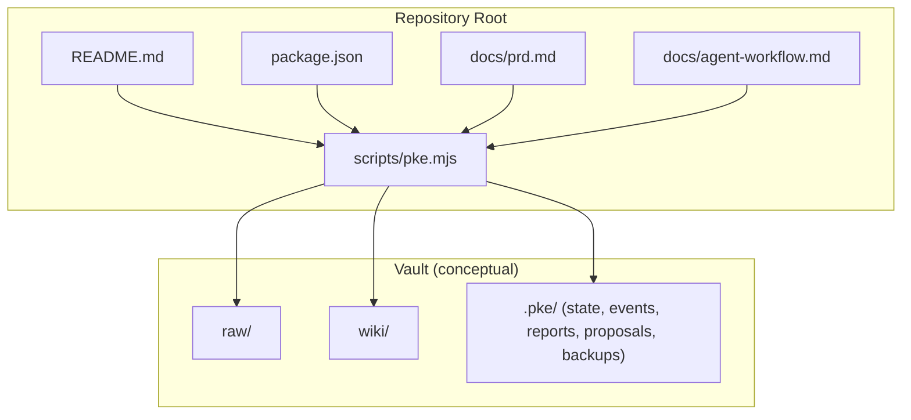
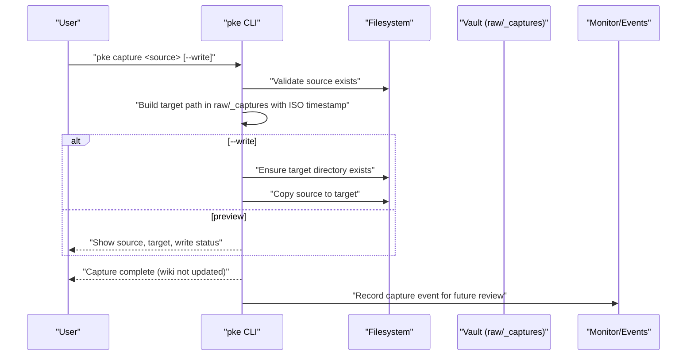
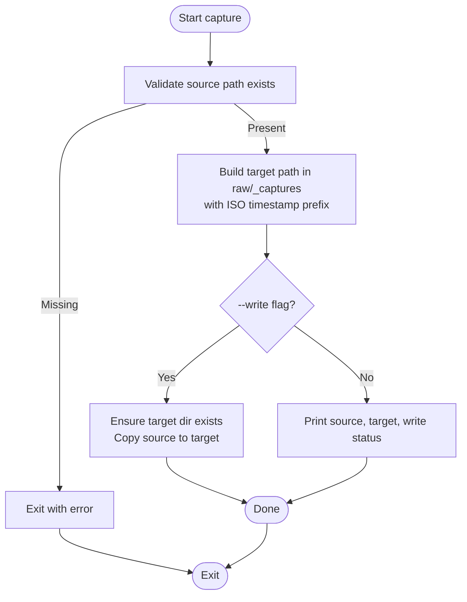
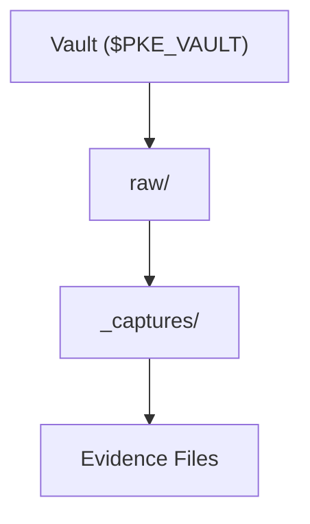
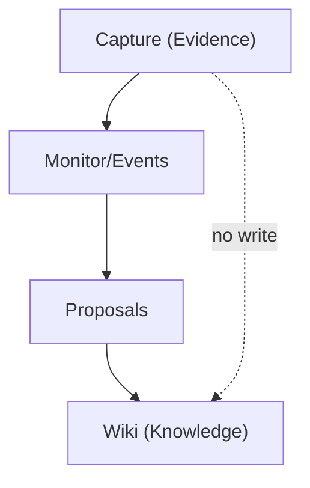
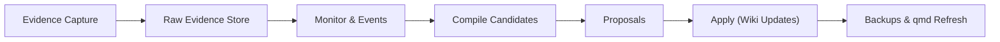
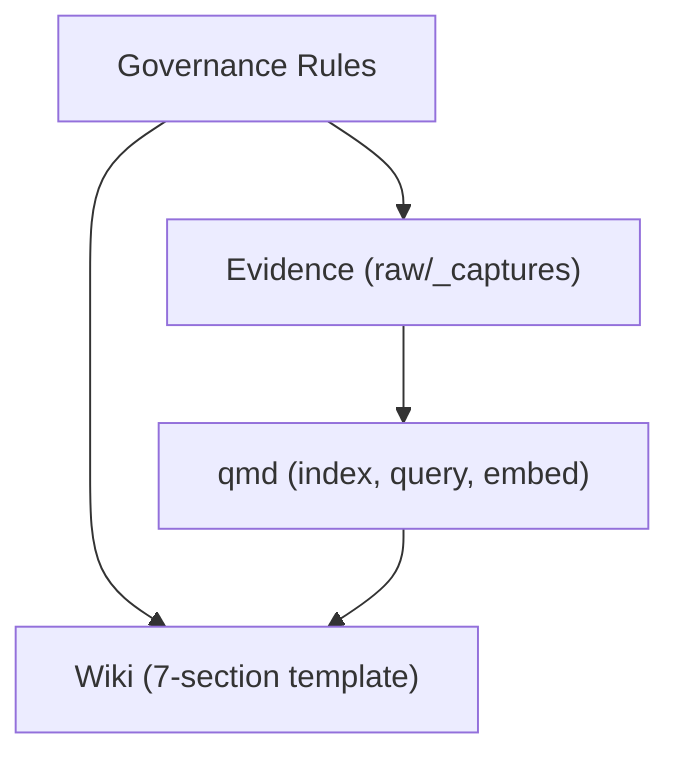
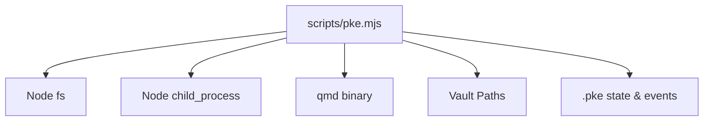

# Evidence Capture Workflow

<cite>
**Referenced Files in This Document**
- [README.md](file://README.md)
- [package.json](file://package.json)
- [scripts/pke.mjs](file://scripts/pke.mjs)
- [docs/prd.md](file://docs/prd.md)
- [docs/agent-workflow.md](file://docs/agent-workflow.md)
</cite>

## Table of Contents
1. [Introduction](#introduction)
2. [Project Structure](#project-structure)
3. [Core Components](#core-components)
4. [Architecture Overview](#architecture-overview)
5. [Detailed Component Analysis](#detailed-component-analysis)
6. [Dependency Analysis](#dependency-analysis)
7. [Performance Considerations](#performance-considerations)
8. [Troubleshooting Guide](#troubleshooting-guide)
9. [Conclusion](#conclusion)
10. [Appendices](#appendices)

## Introduction
This document explains the evidence capture workflow in the Personal Knowledge Engine (PKE). It focuses on how raw files are ingested and preserved as immutable evidence without modification, the capture command process, destination directory structure, and the proposal-only principle that prevents wiki changes during capture. It also contrasts evidence capture with knowledge compilation, outlines best practices for organizing captured evidence, and provides troubleshooting guidance.

## Project Structure
The repository centers on a small CLI that orchestrates capture, monitor, compile, and dashboard functions around a local vault with raw and wiki directories. The CLI is installed via the package manifest and exposes commands documented in the README and PRD.

**Diagram sources**
- [README.md:56-80](file://README.md#L56-L80)
- [package.json:7-9](file://package.json#L7-L9)
- [docs/prd.md:430-452](file://docs/prd.md#L430-L452)

**Section sources**
- [README.md:35-80](file://README.md#L35-L80)
- [package.json:1-18](file://package.json#L1-L18)
- [docs/prd.md:430-452](file://docs/prd.md#L430-L452)

## Core Components
- Capture command: Validates a source file, constructs a timestamped target path under raw/_captures, and optionally writes a copy. The wiki is never modified by capture.
- Destination structure: Evidence files are placed under raw/_captures with ISO timestamp prefixes to avoid collisions.
- Proposal-only principle: Capture is read-only; any knowledge updates occur via proposals and approvals, not during capture.
- Evidence vs. compilation: Capture preserves raw content; compilation proposes wiki updates and applies them only upon explicit approval.

**Section sources**
- [scripts/pke.mjs:329-353](file://scripts/pke.mjs#L329-L353)
- [docs/prd.md:330-351](file://docs/prd.md#L330-L351)
- [docs/prd.md:352-376](file://docs/prd.md#L352-L376)

## Architecture Overview
The capture workflow is a read-only ingestion step that places files into the raw evidence store. It does not alter wiki pages and integrates with the broader knowledge loop: capture evidence, compile knowledge, and use knowledge naturally.

**Diagram sources**
- [scripts/pke.mjs:329-353](file://scripts/pke.mjs#L329-L353)
- [docs/prd.md:330-351](file://docs/prd.md#L330-L351)

## Detailed Component Analysis

### Capture Command Implementation
- Validation: Requires a valid source path; errors if missing.
- Target construction: Uses ISO timestamp (with colons and dots replaced) and the original basename to form a unique filename under raw/_captures.
- Write behavior: Creates the target directory and copies the file only when --write is provided; otherwise prints a preview.
- Governance: Emphasizes that capture stores evidence, not conclusions, and the wiki is not updated.

**Diagram sources**
- [scripts/pke.mjs:329-353](file://scripts/pke.mjs#L329-L353)

**Section sources**
- [scripts/pke.mjs:329-353](file://scripts/pke.mjs#L329-L353)
- [docs/prd.md:330-351](file://docs/prd.md#L330-L351)

### Destination Directory Structure Under raw/_captures
- Location: raw/_captures within the vault.
- Naming: ISO timestamp prefix plus original basename to prevent collisions.
- Preservation: Files are copied, not moved; raw files are rarely edited.

**Diagram sources**
- [docs/prd.md:430-452](file://docs/prd.md#L430-L452)
- [docs/prd.md:336-337](file://docs/prd.md#L336-L337)

**Section sources**
- [docs/prd.md:430-452](file://docs/prd.md#L430-L452)
- [docs/prd.md:336-337](file://docs/prd.md#L336-L337)

### Proposal-Only Principle During Capture
- Capture is read-only: no wiki writes occur.
- Compile is proposal-only: wiki updates require explicit approval; the engine proposes patches and applies them only after approval.
- Governance: Raw files are evidence and are rarely edited; wiki updates are cautious and evidence-linked.

**Diagram sources**
- [README.md:82-94](file://README.md#L82-L94)
- [docs/agent-workflow.md:71-91](file://docs/agent-workflow.md#L71-L91)
- [docs/prd.md:352-376](file://docs/prd.md#L352-L376)

**Section sources**
- [README.md:82-94](file://README.md#L82-L94)
- [docs/agent-workflow.md:71-91](file://docs/agent-workflow.md#L71-L91)
- [docs/prd.md:352-376](file://docs/prd.md#L352-L376)

### Evidence Capture vs. Knowledge Compilation
- Evidence capture: Immutable preservation of raw content; no wiki edits.
- Knowledge compilation: Proposal-only; wiki updates are append-only and require explicit approval; applied patches include backups and qmd refresh attempts.

**Diagram sources**
- [docs/prd.md:330-351](file://docs/prd.md#L330-L351)
- [docs/prd.md:352-376](file://docs/prd.md#L352-L376)
- [scripts/pke.mjs:1603-1633](file://scripts/pke.mjs#L1603-L1633)

**Section sources**
- [docs/prd.md:330-351](file://docs/prd.md#L330-L351)
- [docs/prd.md:352-376](file://docs/prd.md#L352-L376)
- [scripts/pke.mjs:1603-1633](file://scripts/pke.mjs#L1603-L1633)

### Practical Examples of Capturing Various File Types
- Markdown files: Capture a meeting note or article summary; confirm the timestamped filename under raw/_captures.
- Text exports: Capture exported transcripts or logs; ensure the destination includes the ISO timestamp prefix.
- AI drafts and final documents: Capture drafts as evidence; later compare with final versions to generate proposals.

Best practices:
- Always run capture in preview mode first to verify target path and write status.
- Use --write only when you intend to persist the evidence file.
- Keep raw/_captures organized by topic or project if desired; filenames are collision-safe due to timestamp prefixes.

**Section sources**
- [README.md:56-80](file://README.md#L56-L80)
- [docs/prd.md:330-351](file://docs/prd.md#L330-L351)

### Append-Only Evidence Storage and Knowledge Governance
- Append-only: Evidence capture is read-only; raw files are preserved as-is.
- Governance: Wiki updates require explicit triggers (commands, approvals, session close, scheduled reviews). The system exposes uncertainty and conflicts rather than hiding them.

**Diagram sources**
- [README.md:82-94](file://README.md#L82-L94)
- [docs/agent-workflow.md:71-91](file://docs/agent-workflow.md#L71-L91)
- [docs/prd.md:456-507](file://docs/prd.md#L456-L507)

**Section sources**
- [README.md:82-94](file://README.md#L82-L94)
- [docs/agent-workflow.md:71-91](file://docs/agent-workflow.md#L71-L91)
- [docs/prd.md:456-507](file://docs/prd.md#L456-L507)

## Dependency Analysis
- CLI depends on Node.js APIs for filesystem operations and child process execution.
- CLI resolves vault paths from environment variables and defaults.
- CLI interacts with qmd for indexing and embedding after wiki updates.

**Diagram sources**
- [scripts/pke.mjs:1-46](file://scripts/pke.mjs#L1-L46)
- [package.json:7-9](file://package.json#L7-L9)

**Section sources**
- [scripts/pke.mjs:1-46](file://scripts/pke.mjs#L1-L46)
- [package.json:7-9](file://package.json#L7-L9)

## Performance Considerations
- File size limits: Files larger than 10 MB are skipped during vault scans to avoid heavy processing.
- Event retention: The event log is rotated after exceeding a threshold to manage disk usage.
- Scoped monitoring: Watch mode uses polling to avoid OS-specific watchers and reduce overhead.

[No sources needed since this section provides general guidance]

## Troubleshooting Guide
Common issues and resolutions:
- Source file not found: Ensure the path exists and is readable. The capture command validates existence and exits with an error if missing.
- Destination directory creation: The CLI ensures the target directory exists before writing; permission errors indicate insufficient access to the vault.
- Preview vs. write: Run without --write to preview the target path; use --write to persist the evidence file.
- Wiki not updated: Capture is read-only; use compile, propose, and apply to update wiki pages after approval.
- Oversized files: Files exceeding the 10 MB limit are skipped during scans; reduce file size or split content.

**Section sources**
- [scripts/pke.mjs:329-353](file://scripts/pke.mjs#L329-L353)
- [scripts/pke.mjs:824-875](file://scripts/pke.mjs#L824-L875)
- [scripts/pke.mjs:1396-1410](file://scripts/pke.mjs#L1396-L1410)

## Conclusion
The evidence capture workflow in PKE is designed to be immutable and read-only. It preserves raw content as evidence under raw/_captures with timestamped filenames, preventing accidental overwrites and ensuring a clear audit trail. Knowledge compilation remains proposal-only, maintaining strict governance that prevents silent wiki writes. This separation of concerns supports long-term knowledge governance by keeping raw evidence pristine while enabling controlled, auditable knowledge updates.

[No sources needed since this section summarizes without analyzing specific files]

## Appendices

### Appendix A: CLI Commands Related to Capture and Governance
- pke capture: Ingest raw files into evidence without modifying wiki.
- pke compile: Proposal-only compilation; outputs change reports and next steps.
- pke propose / pke apply / pke reject: Manage proposals for wiki updates.
- pke monitor / pke dashboard: Observe changes and manage proposals.

**Section sources**
- [README.md:56-80](file://README.md#L56-L80)
- [docs/prd.md:352-376](file://docs/prd.md#L352-L376)