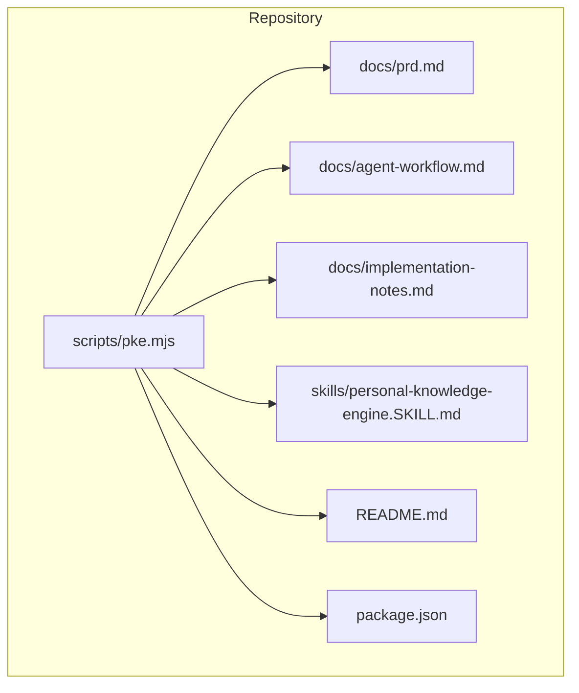
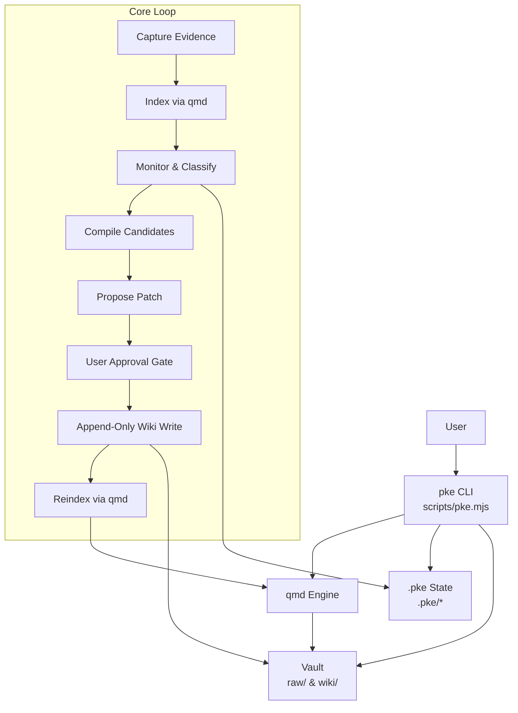
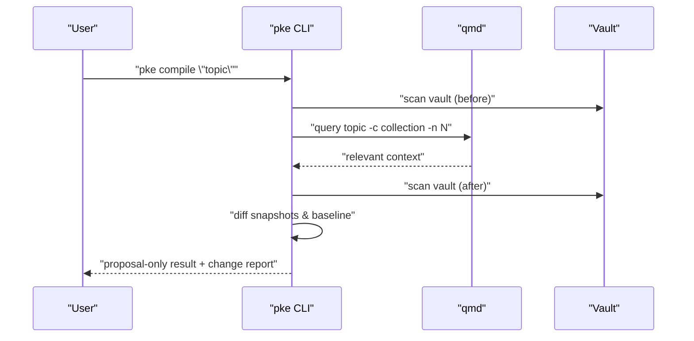
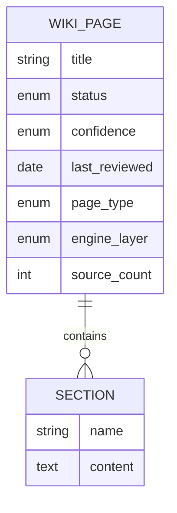
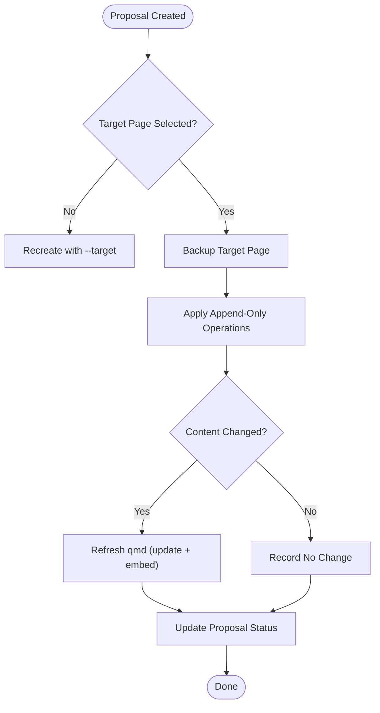
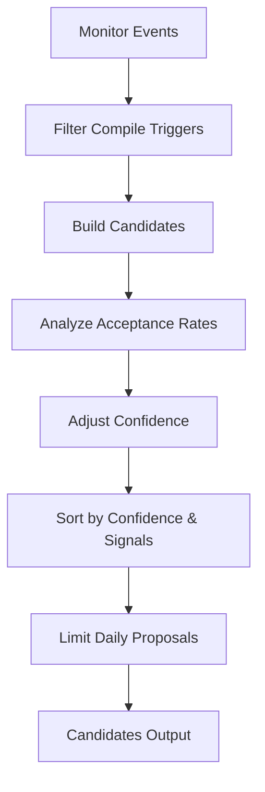
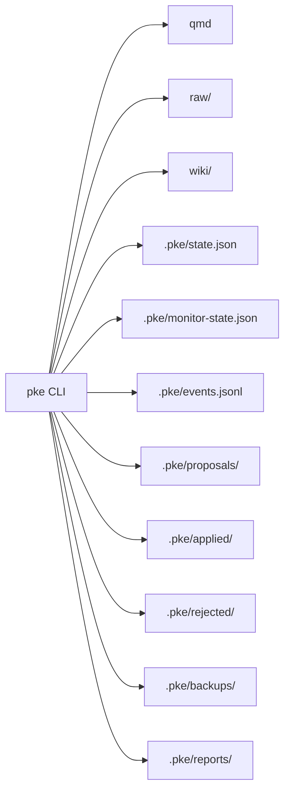

# Knowledge Compilation Process

<cite>
**Referenced Files in This Document**
- [README.md](file://README.md)
- [package.json](file://package.json)
- [scripts/pke.mjs](file://scripts/pke.mjs)
- [docs/prd.md](file://docs/prd.md)
- [docs/agent-workflow.md](file://docs/agent-workflow.md)
- [docs/implementation-notes.md](file://docs/implementation-notes.md)
- [skills/personal-knowledge-engine.SKILL.md](file://skills/personal-knowledge-engine.SKILL.md)
</cite>

## Table of Contents
1. [Introduction](#introduction)
2. [Project Structure](#project-structure)
3. [Core Components](#core-components)
4. [Architecture Overview](#architecture-overview)
5. [Detailed Component Analysis](#detailed-component-analysis)
6. [Dependency Analysis](#dependency-analysis)
7. [Performance Considerations](#performance-considerations)
8. [Troubleshooting Guide](#troubleshooting-guide)
9. [Conclusion](#conclusion)
10. [Appendices](#appendices)

## Introduction
This document explains the knowledge compilation process in the Personal Knowledge Engine (PKE). It focuses on how evidence is transformed into structured knowledge using a proposal-only workflow. The compile command integrates semantic search with qmd, gathers context, and produces a change report. The system uses a template-driven 7-section wiki format and separates compile planning (proposal generation) from actual wiki updates (approval required). It also covers compile candidates, confidence scoring, event classification, examples, best practices, and governance.

## Project Structure
The repository centers on a small CLI (pke) that orchestrates local vault operations, qmd integration, and proposal-driven knowledge updates. Key directories and files:
- CLI entry and commands: scripts/pke.mjs
- Documentation: docs/prd.md, docs/agent-workflow.md, docs/implementation-notes.md
- Skill instructions for agents: skills/personal-knowledge-engine.SKILL.md
- Package metadata: package.json
- Project overview and governance: README.md

**Diagram sources**
- [scripts/pke.mjs](file://scripts/pke.mjs)
- [docs/prd.md](file://docs/prd.md)
- [docs/agent-workflow.md](file://docs/agent-workflow.md)
- [docs/implementation-notes.md](file://docs/implementation-notes.md)
- [skills/personal-knowledge-engine.SKILL.md](file://skills/personal-knowledge-engine.SKILL.md)
- [package.json](file://package.json)
- [README.md](file://README.md)

**Section sources**
- [README.md:15-21](file://README.md#L15-L21)
- [package.json:1-18](file://package.json#L1-L18)

## Core Components
- CLI (pke): Orchestrates capture, compile, use, monitor, dashboard, candidates, propose, proposals, apply, reject, and related commands.
- qmd integration: Provides semantic search, retrieval, and embedding refresh after approved wiki updates.
- Knowledge monitor: Observes vault changes and emits structured events for compile candidates.
- Proposal system: Generates exact, append-only patch operations targeting safe wiki sections; requires explicit user approval to apply.

Key capabilities:
- Evidence capture and preservation
- Retrieval-first answers with uncertainty exposure
- Proposal-only compile with change reports
- Template-driven 7-section wiki pages
- Governance requiring explicit update clues

**Section sources**
- [README.md:56-80](file://README.md#L56-L80)
- [docs/prd.md:191-200](file://docs/prd.md#L191-L200)
- [scripts/pke.mjs:33-41](file://scripts/pke.mjs#L33-L41)

## Architecture Overview
The PKE loop connects capture, indexing, monitoring, compilation, proposal, approval, and reindexing. The CLI coordinates qmd and vault state, while the monitor classifies knowledge events that drive compile candidates.

**Diagram sources**
- [docs/prd.md:698-730](file://docs/prd.md#L698-L730)
- [scripts/pke.mjs:812-822](file://scripts/pke.mjs#L812-L822)
- [scripts/pke.mjs:738-784](file://scripts/pke.mjs#L738-L784)

## Detailed Component Analysis

### Compile Command Process
The compile command performs a proposal-only run:
- Queries qmd for relevant context
- Scans vault before and after to detect changes
- Compares against the saved baseline to compute change report
- Emits a proposal-only result with next steps and a change report

**Diagram sources**
- [scripts/pke.mjs:355-394](file://scripts/pke.mjs#L355-L394)
- [scripts/pke.mjs:812-822](file://scripts/pke.mjs#L812-L822)

**Section sources**
- [scripts/pke.mjs:355-394](file://scripts/pke.mjs#L355-L394)
- [docs/prd.md:352-376](file://docs/prd.md#L352-L376)

### Semantic Search Integration with qmd
- Retrieval: pke use delegates to qmd query for wiki-first, raw-fallback retrieval.
- Embeddings: After applying a proposal, pke refreshes qmd state to keep embeddings current.
- Environment: qmd path is configurable via PKE_QMD_PATH.

**Section sources**
- [scripts/pke.mjs:189-194](file://scripts/pke.mjs#L189-L194)
- [scripts/pke.mjs:1660-1665](file://scripts/pke.mjs#L1660-L1665)
- [scripts/pke.mjs:13-14](file://scripts/pke.mjs#L13-L14)

### Context Gathering and Change Reporting
- Baseline comparison: Compares current snapshot to the saved baseline to highlight changes since last review.
- Change report: Includes mode, knowledge writes, evidence writes, and unresolved items.
- Recommendation: Emphasizes proposal-only mode and next steps for approval.

**Section sources**
- [scripts/pke.mjs:357-394](file://scripts/pke.mjs#L357-L394)
- [scripts/pke.mjs:1236-1257](file://scripts/pke.mjs#L1236-L1257)

### Template-Driven Knowledge Representation (7-Section Wiki)
- Required sections: Current Understanding, Key Principles, Evidence, Conflicts / Evolution, Stale Or Risky Claims, Open Questions, Related Pages.
- Front matter: status, confidence, last_reviewed, page_type, engine_layer, source_count.
- Compliance checking: pke status validates template coverage.

**Diagram sources**
- [docs/prd.md:456-507](file://docs/prd.md#L456-L507)
- [scripts/pke.mjs:33-41](file://scripts/pke.mjs#L33-L41)

**Section sources**
- [docs/prd.md:456-507](file://docs/prd.md#L456-L507)
- [scripts/pke.mjs:1170-1188](file://scripts/pke.mjs#L1170-L1188)

### Compile Planning vs. Wiki Updates (Approval Required)
- Proposal-only compile: pke compile and related commands do not write wiki pages in the MVP.
- Governance: Wiki updates require explicit user command, approval of a proposal, session close with permission, or scheduled review.
- Apply workflow: Backs up target page, applies append-only patch, updates proposal, and refreshes qmd.

**Diagram sources**
- [scripts/pke.mjs:1603-1633](file://scripts/pke.mjs#L1603-L1633)
- [scripts/pke.mjs:1635-1641](file://scripts/pke.mjs#L1635-L1641)
- [scripts/pke.mjs:1660-1665](file://scripts/pke.mjs#L1660-L1665)

**Section sources**
- [README.md:82-94](file://README.md#L82-L94)
- [docs/prd.md:371-376](file://docs/prd.md#L371-L376)
- [scripts/pke.mjs:1603-1633](file://scripts/pke.mjs#L1603-L1633)

### Compile Candidates System and Confidence Scoring
- Candidate generation: From changed files and monitor events (raw_added, raw_modified, wiki_modified, conflicts, stale claims, open questions, conclusions).
- Confidence adjustment: History-based multiplicative adjustment (80–120%) by event type acceptance rate; sorted by confidence and evidence count.
- Rate limiting: Daily proposals capped; top-N prioritized.

**Diagram sources**
- [scripts/pke.mjs:508-547](file://scripts/pke.mjs#L508-L547)
- [scripts/pke.mjs:924-980](file://scripts/pke.mjs#L924-L980)
- [scripts/pke.mjs:1140-1151](file://scripts/pke.mjs#L1140-L1151)

**Section sources**
- [scripts/pke.mjs:508-547](file://scripts/pke.mjs#L508-L547)
- [scripts/pke.mjs:924-980](file://scripts/pke.mjs#L924-L980)
- [scripts/pke.mjs:1140-1151](file://scripts/pke.mjs#L1140-L1151)

### Role of Event Classification in Triggering Compilation
- Section-level classification: conclusion_added, conclusion_changed, evidence_added/evidence_link_added, conflict_detected, stale_claim_detected, open_question_added, knowledge_section_updated.
- Knowledge events: Derived from diffs of parsed wiki sections; used to generate candidates and proposals.

**Section sources**
- [scripts/pke.mjs:1324-1362](file://scripts/pke.mjs#L1324-L1362)
- [docs/prd.md:576-594](file://docs/prd.md#L576-L594)

### Examples of Compile Scenarios
- Daily compilation: Reviews changed files and outputs compile candidates with recommendations.
- Draft-final learning: Computes diff and classifies changes; proposes compile actions based on durable signals.
- Session close: Scans transcript for durable signals; outputs possible durable signals without writing.
- Candidates: Lists compile-trigger events with reasons and suggested targets.

**Section sources**
- [scripts/pke.mjs:221-285](file://scripts/pke.mjs#L221-L285)
- [scripts/pke.mjs:287-327](file://scripts/pke.mjs#L287-L327)
- [scripts/pke.mjs:396-418](file://scripts/pke.mjs#L396-L418)
- [scripts/pke.mjs:508-547](file://scripts/pke.mjs#L508-L547)

### Best Practices for Effective Knowledge Synthesis
- Prefer wiki-first retrieval; raw notes are evidence.
- Separate current understanding, evidence, conflicts, stale claims, and open questions.
- Do not update wiki without a definite update clue.
- Use monitor reports and dashboards to track changes and proposals.
- After applying a proposal, refresh qmd and verify embeddings.

**Section sources**
- [skills/personal-knowledge-engine.SKILL.md:23-31](file://skills/personal-knowledge-engine.SKILL.md#L23-L31)
- [skills/personal-knowledge-engine.SKILL.md:64-79](file://skills/personal-knowledge-engine.SKILL.md#L64-L79)
- [docs/implementation-notes.md:18-30](file://docs/implementation-notes.md#L18-L30)

## Dependency Analysis
- CLI depends on qmd for retrieval and embeddings.
- Vault layout defines raw/ and wiki/ directories; .pke holds state, events, reports, and proposal lifecycle.
- Commands coordinate scanning, diffing, event emission, proposal creation, and application.

**Diagram sources**
- [docs/prd.md:428-452](file://docs/prd.md#L428-L452)
- [scripts/pke.mjs:15-29](file://scripts/pke.mjs#L15-L29)

**Section sources**
- [docs/prd.md:428-452](file://docs/prd.md#L428-L452)
- [scripts/pke.mjs:15-29](file://scripts/pke.mjs#L15-L29)

## Performance Considerations
- Scoped monitoring: Watch mode uses scoped polling to avoid watching unrelated files and to remain portable across environments.
- Event retention: Event logs are rotated when exceeding limits; reports are archived after retention thresholds.
- File size limits: Oversized files are skipped to prevent excessive processing overhead.

**Section sources**
- [README.md:139-145](file://README.md#L139-L145)
- [scripts/pke.mjs:1396-1410](file://scripts/pke.mjs#L1396-L1410)
- [scripts/pke.mjs:824-874](file://scripts/pke.mjs#L824-L874)

## Troubleshooting Guide
Common issues and resolutions:
- qmd failures: The CLI checks qmd status and throws descriptive errors when commands fail. Verify qmd availability and collection configuration.
- Missing targets: Applying a proposal requires a valid target page; ensure --target is set when creating proposals.
- Oversized files: Files larger than the configured limit are skipped; reduce file size or split content.
- Proposal caps: Too many pending proposals trigger warnings; review and act on older proposals.
- Dashboard refresh: Use “Scan Now” or configure auto-scan for scoped paths.

**Section sources**
- [scripts/pke.mjs:812-822](file://scripts/pke.mjs#L812-L822)
- [scripts/pke.mjs:1603-1609](file://scripts/pke.mjs#L1603-L1609)
- [scripts/pke.mjs:838-841](file://scripts/pke.mjs#L838-L841)
- [scripts/pke.mjs:1560-1567](file://scripts/pke.mjs#L1560-L1567)
- [docs/implementation-notes.md:66-72](file://docs/implementation-notes.md#L66-L72)

## Conclusion
The Personal Knowledge Engine’s knowledge compilation process is proposal-only and governance-driven. Evidence is captured and preserved, context is retrieved via qmd, and compile candidates are generated from monitor events. Proposals target safe wiki sections with append-only operations, requiring explicit user approval before any wiki updates occur. The 7-section template ensures structured, auditable knowledge pages, while dashboards and reports support ongoing oversight and refinement.

## Appendices

### Governance Model Summary
- Wiki writes are intentionally conservative and require explicit update clues.
- In the MVP, compile commands are proposal-only; approved proposals are applied with backups and qmd refresh attempts.

**Section sources**
- [README.md:82-94](file://README.md#L82-L94)
- [docs/prd.md:371-376](file://docs/prd.md#L371-L376)