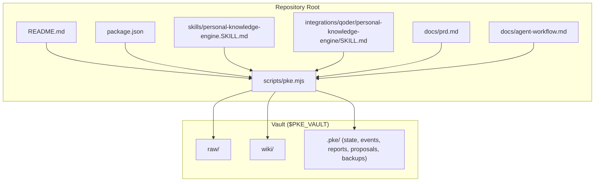
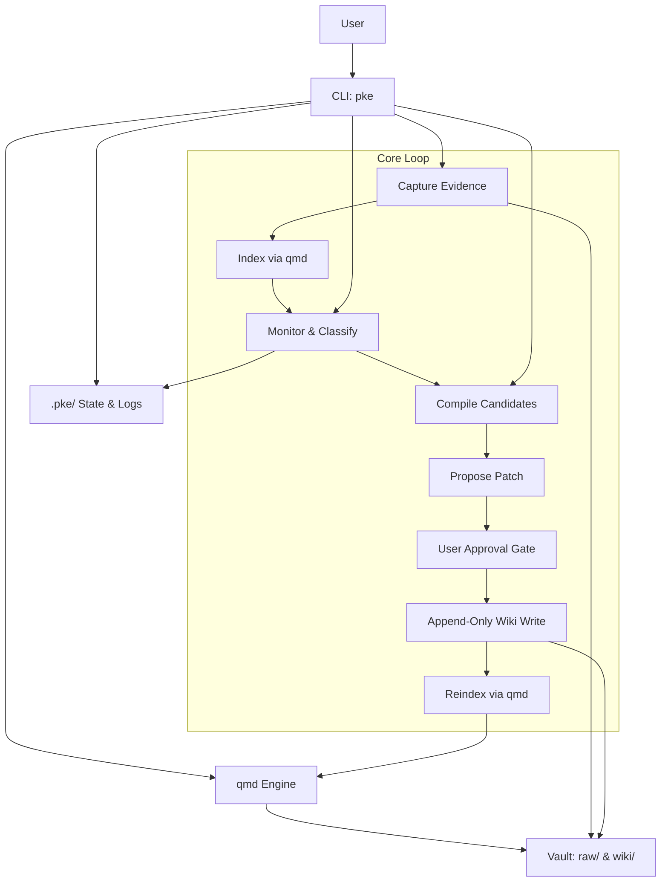
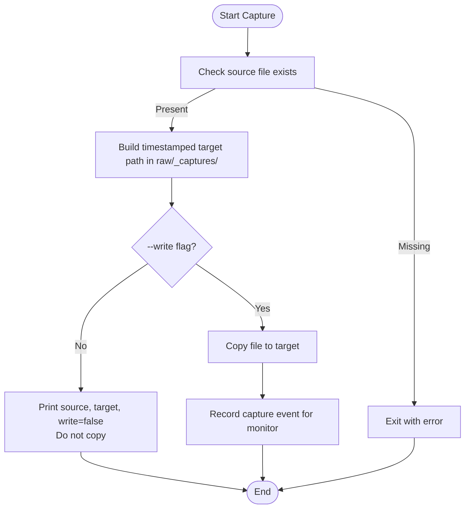
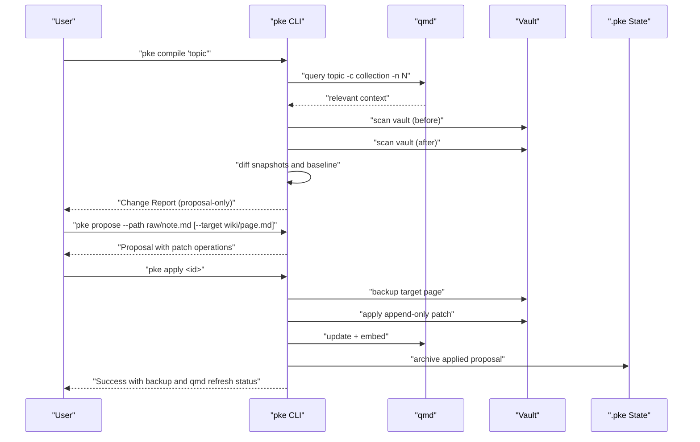
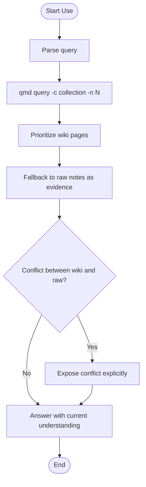
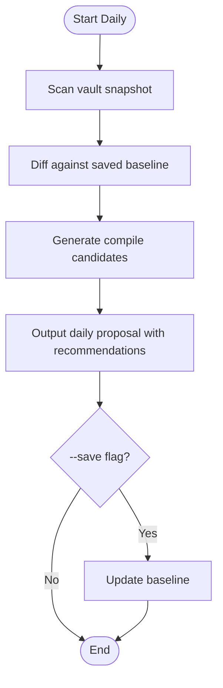
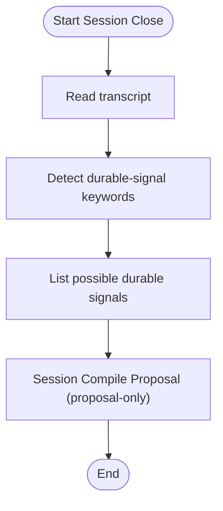
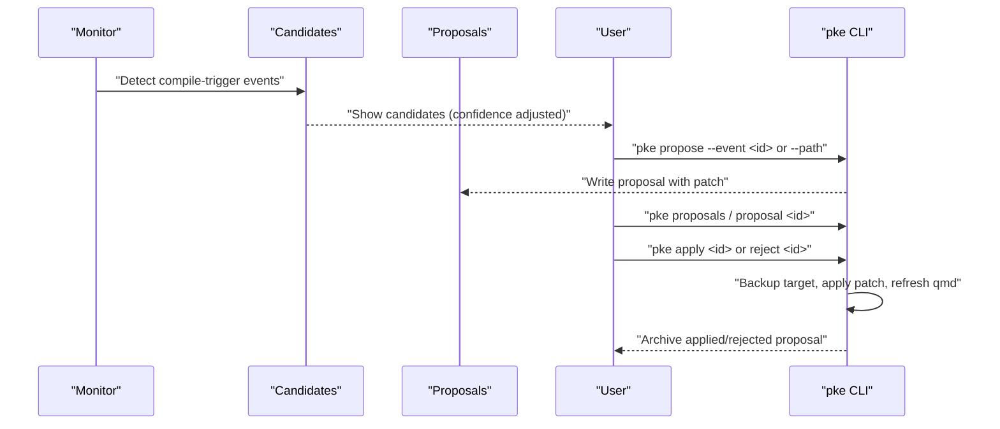
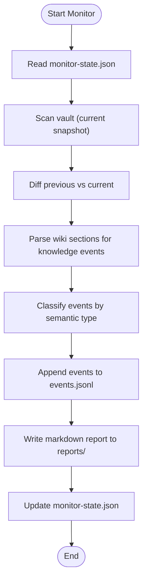
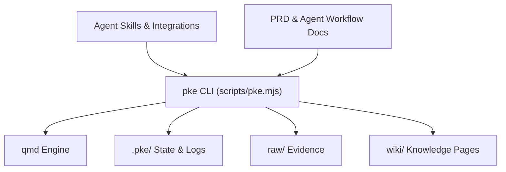

# Knowledge Management Workflows

<cite>
**Referenced Files in This Document**
- [README.md](file://README.md)
- [package.json](file://package.json)
- [scripts/pke.mjs](file://scripts/pke.mjs)
- [skills/personal-knowledge-engine.SKILL.md](file://skills/personal-knowledge-engine.SKILL.md)
- [integrations/qoder/personal-knowledge-engine/SKILL.md](file://integrations/qoder/personal-knowledge-engine/SKILL.md)
- [docs/prd.md](file://docs/prd.md)
- [docs/agent-workflow.md](file://docs/agent-workflow.md)
</cite>

## Table of Contents
1. [Introduction](#introduction)
2. [Project Structure](#project-structure)
3. [Core Components](#core-components)
4. [Architecture Overview](#architecture-overview)
5. [Detailed Component Analysis](#detailed-component-analysis)
6. [Dependency Analysis](#dependency-analysis)
7. [Performance Considerations](#performance-considerations)
8. [Troubleshooting Guide](#troubleshooting-guide)
9. [Conclusion](#conclusion)
10. [Appendices](#appendices)

## Introduction
This document explains the Personal Knowledge Engine (PKE) knowledge management workflows with a focus on the three-phase product loop: Capture evidence, Compile knowledge, Use knowledge naturally. It also documents the proposal-only architecture and governance model that prevents unauthorized wiki modifications, the evidence capture process for raw files, the compilation process for transforming evidence into structured knowledge, and natural language retrieval through qmd. It covers the daily compilation routine, session intelligence for processing transcripts, and the controlled self-improvement system through candidates and proposals. Workflow diagrams illustrate the relationships between processes and decision points, and best practices and pitfalls are included for each phase.

## Project Structure
The repository centers on a small CLI (pke) that orchestrates a local-first knowledge loop around a vault with raw and wiki directories. Supporting materials include PRD, agent workflow documentation, and Codex skill instructions.

**Diagram sources**
- [README.md:1-211](file://README.md#L1-L211)
- [package.json:1-18](file://package.json#L1-L18)
- [scripts/pke.mjs:1-120](file://scripts/pke.mjs#L1-L120)
- [docs/prd.md:428-452](file://docs/prd.md#L428-L452)

**Section sources**
- [README.md:1-211](file://README.md#L1-L211)
- [package.json:1-18](file://package.json#L1-L18)
- [docs/prd.md:428-452](file://docs/prd.md#L428-L452)

## Core Components
- CLI (pke): Orchestrates capture, compile, use, monitor, dashboard, and proposal lifecycle. It integrates with qmd for indexing and retrieval.
- Vault: Two primary directories:
  - raw/: Evidence store for captured notes, transcripts, drafts, and documents.
  - wiki/: Structured knowledge pages following a 7-section template.
- State and event logs: Persisted under .pke/ for baseline snapshots, monitor state, events, reports, proposals, backups, and archives.

Key behaviors:
- Capture evidence without editing raw files except for ingestion, mechanical repair, or append-only processing notes.
- Compile knowledge via proposals with append-only patch operations to safe sections.
- Use knowledge naturally via qmd retrieval; wiki writes require explicit approval or scheduled workflows.

**Section sources**
- [README.md:35-119](file://README.md#L35-L119)
- [scripts/pke.mjs:31-41](file://scripts/pke.mjs#L31-L41)
- [docs/prd.md:428-452](file://docs/prd.md#L428-L452)

## Architecture Overview
The system is a local-first, proposal-only knowledge engine. The CLI coordinates:
- Capture: Copy evidence into raw/_captures with timestamped filenames.
- Index: Delegate to qmd for update and embed.
- Monitor: Scan vault snapshots, detect file and knowledge-level events, and persist events and reports.
- Compile: Generate candidates from changes and monitor events, produce proposals with append-only patches, and apply only upon approval.
- Use: Natural-language retrieval via qmd query, prioritizing wiki pages and surfacing conflicts.

**Diagram sources**
- [docs/prd.md:698-730](file://docs/prd.md#L698-L730)
- [scripts/pke.mjs:812-822](file://scripts/pke.mjs#L812-L822)
- [README.md:15-21](file://README.md#L15-L21)

## Detailed Component Analysis

### Capture Evidence
Purpose: Preserve incoming material as immutable evidence records without treating it as current truth.

Workflow:
- Validate source file existence.
- Generate a timestamped target path under raw/_captures/.
- Default preview mode prints source, target, and write status without copying.
- With --write, copy the file to the target path.
- Record capture event for future compilation review.

Constraints:
- Raw files are rarely edited.
- New information must not be marked as current truth.
- Existing raw evidence must not be overwritten.

**Diagram sources**
- [scripts/pke.mjs:329-354](file://scripts/pke.mjs#L329-L354)
- [docs/prd.md:330-351](file://docs/prd.md#L330-L351)

Best practices:
- Use preview mode by default; only use --write when explicitly capturing evidence.
- Keep raw files as-is; avoid rewriting or cleaning raw content.
- Use capture to preserve context and provenance.

Common pitfalls:
- Overwriting existing raw evidence.
- Treating raw notes as current truth.
- Skipping capture and editing raw files directly.

**Section sources**
- [scripts/pke.mjs:329-354](file://scripts/pke.mjs#L329-L354)
- [docs/prd.md:330-351](file://docs/prd.md#L330-L351)

### Compile Knowledge (Proposal-Only)
Purpose: Transform evidence into knowledge through a proposal-only, approval-gated pipeline.

Key steps:
- Query relevant context via qmd.
- Scan vault before and after to detect changes.
- Diff against the saved baseline to identify changes since last review.
- Generate a change report (mode, knowledge writes, evidence writes, unresolved items).
- Output proposal-only results with next-step instructions.
- Generate proposals with append-only patch operations targeting safe sections.
- On approval, back up the target page, apply the patch, update proposal status, and refresh qmd.

**Diagram sources**
- [scripts/pke.mjs:355-394](file://scripts/pke.mjs#L355-L394)
- [scripts/pke.mjs:549-560](file://scripts/pke.mjs#L549-L560)
- [scripts/pke.mjs:1603-1633](file://scripts/pke.mjs#L1603-L1633)
- [docs/prd.md:352-376](file://docs/prd.md#L352-L376)

Safe patch operations (MVP):
- Append to Evidence, Open Questions, Conflicts / Evolution, Stale Or Risky Claims.
- Do not rewrite Current Understanding from raw evidence without approval.

Governance:
- Wiki writes require explicit user command, approval of a proposal, session close with permission, or scheduled compilation.
- Without a definite update clue, the engine answers or proposes; it does not silently write knowledge.

**Section sources**
- [scripts/pke.mjs:355-394](file://scripts/pke.mjs#L355-L394)
- [scripts/pke.mjs:1483-1524](file://scripts/pke.mjs#L1483-L1524)
- [README.md:82-94](file://README.md#L82-L94)
- [docs/prd.md:352-376](file://docs/prd.md#L352-L376)

### Use Knowledge Naturally (Retrieval)
Purpose: Enable natural-language discovery with wiki-first, raw-fallback semantics.

Workflow:
- Parse the user query.
- Execute qmd query against the indexed collection.
- Prioritize wiki pages for current understanding.
- Fall back to raw notes as supporting evidence.
- If wiki and raw notes conflict, surface the conflict explicitly.
- Return the answer with current understanding, evidence, conflicts, and open questions.

Constraints:
- Retrieval must not trigger wiki writes.
- The user should not need to explicitly activate the knowledge engine.
- Raw notes are treated as evidence, not truth.

**Diagram sources**
- [scripts/pke.mjs:189-194](file://scripts/pke.mjs#L189-L194)
- [docs/prd.md:307-329](file://docs/prd.md#L307-L329)

**Section sources**
- [scripts/pke.mjs:189-194](file://scripts/pke.mjs#L189-L194)
- [docs/prd.md:307-329](file://docs/prd.md#L307-L329)

### Daily Compilation Routine
Purpose: Periodic maintenance to review changed files and generate compile candidates.

Workflow:
- Scan the vault to build the current file snapshot.
- Diff against the saved baseline to find added, modified, and removed files.
- Generate compile candidates from changed files, annotated with kind and contextual hints.
- Output a daily compilation proposal with change counts, candidates, and recommendations.
- Optionally save the new baseline with --save.

Constraints:
- Daily compilation does not write wiki pages.
- One-off information should be left as raw evidence.
- The user must explicitly approve any wiki updates.

**Diagram sources**
- [scripts/pke.mjs:221-285](file://scripts/pke.mjs#L221-L285)
- [docs/prd.md:377-399](file://docs/prd.md#L377-L399)

**Section sources**
- [scripts/pke.mjs:221-285](file://scripts/pke.mjs#L221-L285)
- [docs/prd.md:377-399](file://docs/prd.md#L377-L399)

### Session Intelligence for Transcripts
Purpose: Detect durable signals in work sessions to inform knowledge compilation.

Workflow:
- Read the transcript file.
- Identify lines containing durable-signal keywords (e.g., decision, conclusion, should, must, update).
- List possible durable signals.
- Output a session compile proposal with mode “proposal-only” and no wiki changes.

Constraints:
- Session close summary with update permission is one of the triggers for wiki updates.
- Without explicit permission, the engine proposes but does not write.

**Diagram sources**
- [scripts/pke.mjs:396-418](file://scripts/pke.mjs#L396-L418)
- [docs/prd.md:296-304](file://docs/prd.md#L296-L304)

**Section sources**
- [scripts/pke.mjs:396-418](file://scripts/pke.mjs#L396-L418)
- [docs/prd.md:296-304](file://docs/prd.md#L296-L304)

### Controlled Self-Improvement System
Purpose: Improve retrieval and knowledge coverage through candidates, proposals, and approvals.

Components:
- Candidates: Compile-trigger events filtered by recency and type, with confidence adjusted by acceptance history.
- Proposals: Exact patch operations targeting safe sections; created from events or paths.
- Approval: Apply or reject proposals; apply backs up the target and refreshes qmd.
- Batch-safe approval: Eligible proposals can be applied quickly when confidence and patch type permit.

**Diagram sources**
- [scripts/pke.mjs:508-547](file://scripts/pke.mjs#L508-L547)
- [scripts/pke.mjs:549-560](file://scripts/pke.mjs#L549-L560)
- [scripts/pke.mjs:562-600](file://scripts/pke.mjs#L562-L600)
- [scripts/pke.mjs:612-660](file://scripts/pke.mjs#L612-L660)
- [scripts/pke.mjs:1603-1633](file://scripts/pke.mjs#L1603-L1633)

**Section sources**
- [scripts/pke.mjs:508-547](file://scripts/pke.mjs#L508-L547)
- [scripts/pke.mjs:549-560](file://scripts/pke.mjs#L549-L560)
- [scripts/pke.mjs:562-600](file://scripts/pke.mjs#L562-L600)
- [scripts/pke.mjs:612-660](file://scripts/pke.mjs#L612-L660)
- [README.md:185-211](file://README.md#L185-L211)

### Knowledge Monitor and Dashboard
Purpose: Make knowledge changes observable and provide a browser-based dashboard.

Key capabilities:
- One-shot monitor compares current files against the previous monitor snapshot.
- Scoped realtime monitoring with polling.
- Semantic event classification (conclusion_added, conflict_detected, stale_claim_detected, open_question_added, evidence_added, evidence_link_added, conclusion_changed, knowledge_section_updated).
- Persist events to events.jsonl and write markdown reports to reports/.
- Dashboard UI for metrics, events, proposals, and actions.

**Diagram sources**
- [scripts/pke.mjs:738-785](file://scripts/pke.mjs#L738-L785)
- [scripts/pke.mjs:1313-1388](file://scripts/pke.mjs#L1313-L1388)
- [scripts/pke.mjs:1930-1976](file://scripts/pke.mjs#L1930-L1976)

**Section sources**
- [scripts/pke.mjs:738-785](file://scripts/pke.mjs#L738-L785)
- [scripts/pke.mjs:1313-1388](file://scripts/pke.mjs#L1313-L1388)
- [README.md:128-184](file://README.md#L128-L184)

## Dependency Analysis
High-level dependencies:
- pke CLI depends on qmd for indexing and retrieval.
- pke CLI manages state and event persistence under .pke/.
- Vault directories (raw/ and wiki/) are the primary data stores.
- Agent skills and integrations rely on the CLI and qmd.

**Diagram sources**
- [scripts/pke.mjs:812-822](file://scripts/pke.mjs#L812-L822)
- [docs/prd.md:698-730](file://docs/prd.md#L698-L730)

**Section sources**
- [scripts/pke.mjs:812-822](file://scripts/pke.mjs#L812-L822)
- [docs/prd.md:698-730](file://docs/prd.md#L698-L730)

## Performance Considerations
- File scanning and hashing: The CLI scans vaults and computes SHA-256 hashes to detect changes. Large vaults or many files can increase scan time.
- qmd operations: Indexing and embedding can be expensive; batch operations and targeted scopes reduce overhead.
- Event retention: Event logs are capped and archived to manage storage growth.
- Dashboard refresh: The dashboard polls for updates; use scoped paths and auto-scan judiciously to balance responsiveness and performance.

[No sources needed since this section provides general guidance]

## Troubleshooting Guide
Common issues and resolutions:
- qmd failures: Verify qmd availability and collection configuration. The CLI wraps qmd calls and surfaces errors.
- Missing or invalid vault paths: Ensure PKE_VAULT is set correctly and contains raw/ and wiki/ directories.
- Oversized files: Files larger than 10 MB are skipped; reduce file size or split content.
- Proposal limits: Pending proposals cap is enforced; review and act on older proposals.
- Watch mode path errors: Watch requires a vault-relative path inside the configured vault.

**Section sources**
- [scripts/pke.mjs:812-822](file://scripts/pke.mjs#L812-L822)
- [scripts/pke.mjs:824-875](file://scripts/pke.mjs#L824-L875)
- [scripts/pke.mjs:1396-1410](file://scripts/pke.mjs#L1396-L1410)
- [scripts/pke.mjs:1560-1567](file://scripts/pke.mjs#L1560-L1567)
- [scripts/pke.mjs:787-810](file://scripts/pke.mjs#L787-L810)

## Conclusion
The Personal Knowledge Engine enforces a disciplined, proposal-only loop that separates evidence from knowledge, prevents silent wiki pollution, and compels deliberate, auditable updates. The CLI, qmd integration, and .pke state/log system form a robust foundation for capturing, compiling, and using knowledge. The controlled self-improvement system ensures continuous enhancement while maintaining strict governance. Adopting the best practices outlined here will help you compound durable knowledge safely and effectively.

[No sources needed since this section summarizes without analyzing specific files]

## Appendices

### Best Practices by Phase
- Capture
  - Use preview mode by default; only use --write when explicitly capturing evidence.
  - Preserve raw content; avoid rewriting or cleaning raw notes.
  - Keep capture events for future compilation review.
- Compile
  - Review candidates and change reports carefully.
  - Propose only exact, append-only patches to safe sections.
  - Apply only with explicit update clues or scheduled workflows.
  - Back up pages before applying; verify qmd refresh outcomes.
- Use
  - Rely on qmd retrieval; prioritize wiki pages for current understanding.
  - Expose conflicts and uncertainties; avoid hiding them.
  - Do not update wiki without a definite update clue.

[No sources needed since this section provides general guidance]