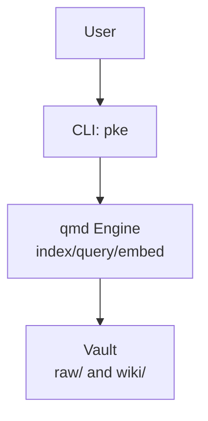
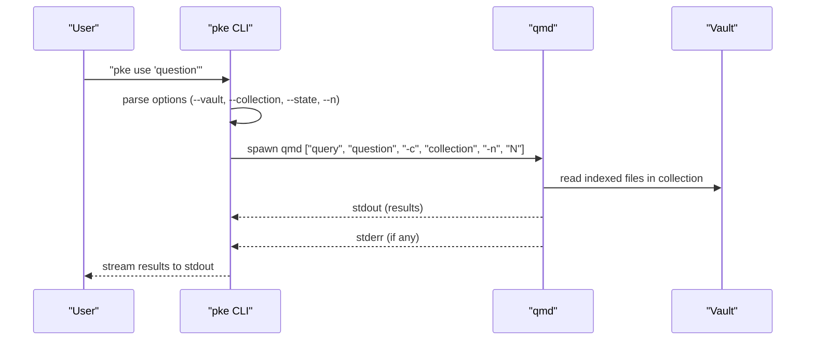
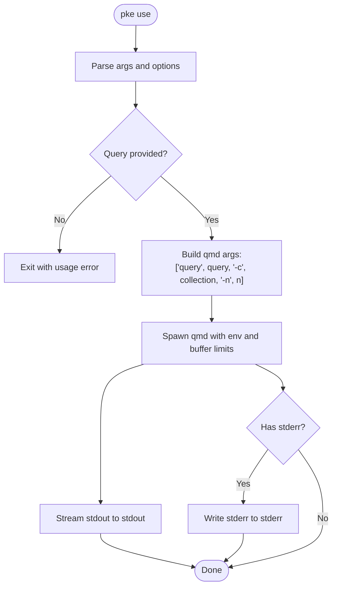
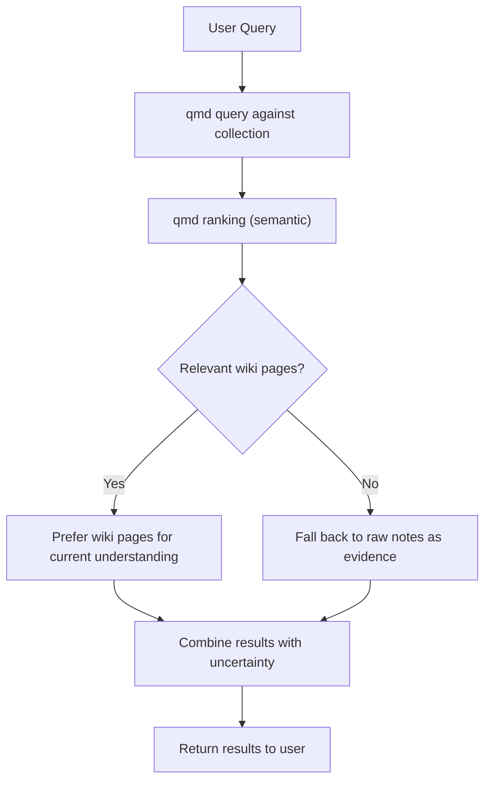
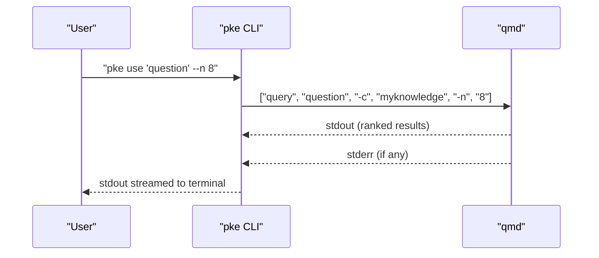
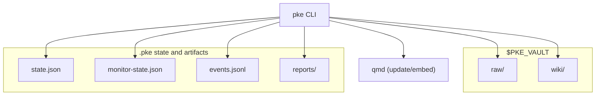
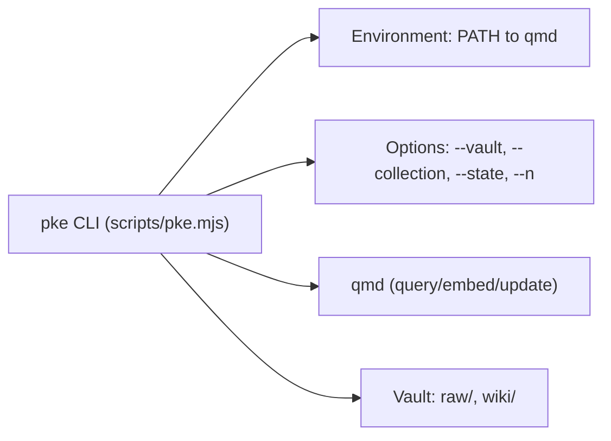

# Natural Language Retrieval

<cite>
**Referenced Files in This Document**
- [README.md](file://README.md)
- [package.json](file://package.json)
- [bin/pke](file://bin/pke)
- [scripts/pke.mjs](file://scripts/pke.mjs)
- [docs/prd.md](file://docs/prd.md)
- [docs/agent-workflow.md](file://docs/agent-workflow.md)
- [docs/implementation-notes.md](file://docs/implementation-notes.md)
- [skills/personal-knowledge-engine.SKILL.md](file://skills/personal-knowledge-engine.SKILL.md)
- [integrations/qoder/personal-knowledge-engine/SKILL.md](file://integrations/qoder/personal-knowledge-engine/SKILL.md)
</cite>

## Table of Contents
1. [Introduction](#introduction)
2. [Project Structure](#project-structure)
3. [Core Components](#core-components)
4. [Architecture Overview](#architecture-overview)
5. [Detailed Component Analysis](#detailed-component-analysis)
6. [Dependency Analysis](#dependency-analysis)
7. [Performance Considerations](#performance-considerations)
8. [Troubleshooting Guide](#troubleshooting-guide)
9. [Conclusion](#conclusion)
10. [Appendices](#appendices)

## Introduction
This document explains the natural language retrieval system in the Personal Knowledge Engine (PKE). It focuses on how the pke use command leverages qmd semantic search to deliver wiki-first, raw-fallback knowledge access. You will learn:
- How to query knowledge with natural language using pke use
- How collection configuration and result formatting work
- How hybrid retrieval prioritizes structured wiki knowledge while falling back to raw evidence
- How query processing, result ranking, and integration with the broader knowledge management ecosystem work
- Practical tips for effective query formulation, interpreting results, and troubleshooting retrieval issues
- Performance considerations, query optimization techniques, and best practices for structuring knowledge for optimal retrieval

## Project Structure
At a high level, the PKE MVP is a CLI that wraps qmd to power retrieval and integrates with a vault organized into raw/ and wiki/ directories. The CLI exposes commands for status, use, monitor, and others, and relies on qmd for indexing, embedding, and querying.

**Diagram sources**
- [docs/prd.md:698-730](file://docs/prd.md#L698-L730)
- [scripts/pke.mjs:1-47](file://scripts/pke.mjs#L1-L47)

**Section sources**
- [README.md:1-211](file://README.md#L1-L211)
- [package.json:1-18](file://package.json#L1-L18)
- [bin/pke:1-10](file://bin/pke#L1-L10)
- [docs/prd.md:698-730](file://docs/prd.md#L698-L730)

## Core Components
- pke use: Executes a natural-language query against the configured qmd collection and streams results to stdout. It is the primary entry point for discovery.
- qmd integration: The CLI spawns qmd with specific flags to target a named collection and number of results.
- Vault layout: raw/ holds evidence; wiki/ holds structured knowledge pages. The CLI reads these directories to compute diffs, monitor changes, and drive compile proposals.
- Knowledge page schema: A 7-section template with YAML front matter underpins wiki-first retrieval and governance.

Key behaviors:
- pke use delegates to qmd query with a collection and result count.
- Results are returned as-is from qmd; the CLI does not modify any files.
- The PRD and agent workflow emphasize wiki-first, raw-fallback semantics and surfacing uncertainty.

**Section sources**
- [docs/prd.md:196-224](file://docs/prd.md#L196-L224)
- [docs/prd.md:307-330](file://docs/prd.md#L307-L330)
- [docs/agent-workflow.md:92-148](file://docs/agent-workflow.md#L92-L148)
- [scripts/pke.mjs:189-194](file://scripts/pke.mjs#L189-L194)

## Architecture Overview
The retrieval architecture centers on the pke use command delegating to qmd. The CLI manages environment and options, then spawns qmd with a fixed set of flags. qmd returns results that the CLI streams to the terminal.

**Diagram sources**
- [scripts/pke.mjs:189-194](file://scripts/pke.mjs#L189-L194)
- [scripts/pke.mjs:812-822](file://scripts/pke.mjs#L812-L822)
- [docs/prd.md:805-831](file://docs/prd.md#L805-L831)

## Detailed Component Analysis

### pke use: Natural Language Querying
- Purpose: Retrieve relevant wiki and raw content using natural language.
- Behavior: Executes qmd query with the configured collection and result count; streams qmd stdout to stdout and forwards stderr if present.
- Options:
  - --vault: Vault root override
  - --collection: qmd collection name (default: myknowledge)
  - --state: PKE state file path
  - --n: Number of results (default: 8)
- Output: Raw qmd query results streamed to stdout; no files are modified.

**Diagram sources**
- [scripts/pke.mjs:189-194](file://scripts/pke.mjs#L189-L194)
- [scripts/pke.mjs:1199-1214](file://scripts/pke.mjs#L1199-L1214)
- [scripts/pke.mjs:812-822](file://scripts/pke.mjs#L812-L822)
- [docs/prd.md:805-831](file://docs/prd.md#L805-L831)

**Section sources**
- [docs/prd.md:805-831](file://docs/prd.md#L805-L831)
- [scripts/pke.mjs:189-194](file://scripts/pke.mjs#L189-L194)
- [scripts/pke.mjs:1199-1214](file://scripts/pke.mjs#L1199-L1214)

### Hybrid Retrieval: Wiki-First, Raw-Fallback
- Wiki-first: The PRD and agent workflow specify that wiki pages are prioritized for current understanding.
- Raw-fallback: When wiki pages do not fully address a query, raw notes serve as supporting evidence.
- Conflict surfacing: If wiki and raw notes conflict, the system surfaces the conflict explicitly rather than silently resolving it.
- Governance: Retrieval must not trigger wiki writes; results should expose uncertainty rather than hide it.

**Diagram sources**
- [docs/prd.md:196-224](file://docs/prd.md#L196-L224)
- [docs/prd.md:307-330](file://docs/prd.md#L307-L330)
- [docs/agent-workflow.md:60-70](file://docs/agent-workflow.md#L60-L70)

**Section sources**
- [docs/prd.md:196-224](file://docs/prd.md#L196-L224)
- [docs/prd.md:307-330](file://docs/prd.md#L307-L330)
- [docs/agent-workflow.md:60-70](file://docs/agent-workflow.md#L60-L70)

### Query Processing and Result Ranking
- Query processing: pke use builds a qmd query command with the user’s question, the configured collection, and the requested number of results.
- Result ranking: qmd performs semantic ranking within the collection; the CLI does not alter the ranking.
- Result formatting: pke use streams qmd’s stdout directly to the terminal; stderr is forwarded if present.

**Diagram sources**
- [scripts/pke.mjs:189-194](file://scripts/pke.mjs#L189-L194)
- [scripts/pke.mjs:812-822](file://scripts/pke.mjs#L812-L822)
- [docs/prd.md:805-831](file://docs/prd.md#L805-L831)

**Section sources**
- [scripts/pke.mjs:189-194](file://scripts/pke.mjs#L189-L194)
- [scripts/pke.mjs:812-822](file://scripts/pke.mjs#L812-L822)
- [docs/prd.md:805-831](file://docs/prd.md#L805-L831)

### Integration with the Knowledge Management Ecosystem
- Vault layout: raw/ for evidence; wiki/ for structured knowledge pages.
- State and monitoring: The CLI tracks file snapshots, detects changes, and emits knowledge events. These inform compile candidates and proposals.
- Governance: Retrieval is read-only; wiki writes require explicit approval via proposals.
- qmd lifecycle: After approved wiki edits, the workflow includes qmd update and qmd embed to refresh the collection.

**Diagram sources**
- [docs/prd.md:428-452](file://docs/prd.md#L428-L452)
- [docs/implementation-notes.md:50-113](file://docs/implementation-notes.md#L50-L113)

**Section sources**
- [docs/prd.md:428-452](file://docs/prd.md#L428-L452)
- [docs/implementation-notes.md:50-113](file://docs/implementation-notes.md#L50-L113)

## Dependency Analysis
- pke CLI depends on qmd for indexing, querying, and embedding.
- Environment: The CLI sets PATH to ensure qmd uses the intended runtime.
- Options: The CLI supports overriding vault, collection, state, and result count.

**Diagram sources**
- [scripts/pke.mjs:9-28](file://scripts/pke.mjs#L9-L28)
- [scripts/pke.mjs:1199-1214](file://scripts/pke.mjs#L1199-L1214)
- [docs/implementation-notes.md:3-16](file://docs/implementation-notes.md#L3-L16)

**Section sources**
- [scripts/pke.mjs:9-28](file://scripts/pke.mjs#L9-L28)
- [scripts/pke.mjs:1199-1214](file://scripts/pke.mjs#L1199-L1214)
- [docs/implementation-notes.md:3-16](file://docs/implementation-notes.md#L3-L16)

## Performance Considerations
- Result count tuning: Use --n to balance relevance and speed. Fewer results may reduce downstream parsing overhead.
- Scoped monitoring: While not directly affecting retrieval, scoped monitor scans reduce unnecessary file system work and keep state compact.
- qmd refresh cadence: After applying wiki edits, run qmd update and qmd embed to keep the collection fresh and improve retrieval quality.
- File size limits: The CLI skips oversized files during vault scans; ensure your knowledge files are within reasonable sizes to avoid missing content in scans.

[No sources needed since this section provides general guidance]

## Troubleshooting Guide
Common issues and resolutions:
- Empty query: pke use requires a non-empty query string; otherwise it exits with a usage error.
- qmd connectivity: Use pke status to verify qmd connectivity and collection presence.
- Unexpected results: Adjust --n to increase or decrease result coverage. Consider reformulating the query for clarity.
- Permission to write: Retrieval is read-only; wiki writes require explicit approval via proposals.
- Oversized files: The CLI skips files larger than a threshold during vault scans; ensure important content is within limits.

**Section sources**
- [scripts/pke.mjs:189-194](file://scripts/pke.mjs#L189-L194)
- [docs/prd.md:764-801](file://docs/prd.md#L764-L801)
- [docs/implementation-notes.md:87-113](file://docs/implementation-notes.md#L87-L113)

## Conclusion
The PKE natural language retrieval system centers on pke use delegating to qmd for semantic discovery. It enforces a wiki-first, raw-fallback approach, surfaces uncertainty, and keeps retrieval read-only. By configuring the qmd collection, controlling result counts, and structuring knowledge pages according to the 7-section template, users can achieve precise, governed knowledge access that compiles over time through proposals and approvals.

[No sources needed since this section summarizes without analyzing specific files]

## Appendices

### Practical Examples and Best Practices
- Effective query formulation:
  - Be specific: “What is the current stance on X?”
  - Include context: “Given recent discussions, how should we evaluate Y?”
- Interpreting results:
  - Prioritize wiki pages for current understanding; use raw notes as evidence.
  - Pay attention to conflicts and open questions surfaced in results.
- Structuring knowledge for optimal retrieval:
  - Follow the 7-section template in wiki pages.
  - Keep front matter up to date (status, confidence, last_reviewed).
  - Link related pages and evidence clearly.

**Section sources**
- [docs/prd.md:456-507](file://docs/prd.md#L456-L507)
- [docs/agent-workflow.md:106-134](file://docs/agent-workflow.md#L106-L134)

### CLI Reference: pke use
- Synopsis: pke use "question"
- Options:
  - --n: Number of results to retrieve (default: 8)
  - --vault: Vault path override
  - --collection: qmd collection name (default: myknowledge)
  - --state: PKE state file path
- Behavior:
  - Executes qmd query against the collection and streams results to stdout.
  - If qmd returns stderr, it is written to stderr.
  - Does not modify any files.

**Section sources**
- [docs/prd.md:805-831](file://docs/prd.md#L805-L831)
- [scripts/pke.mjs:189-194](file://scripts/pke.mjs#L189-L194)