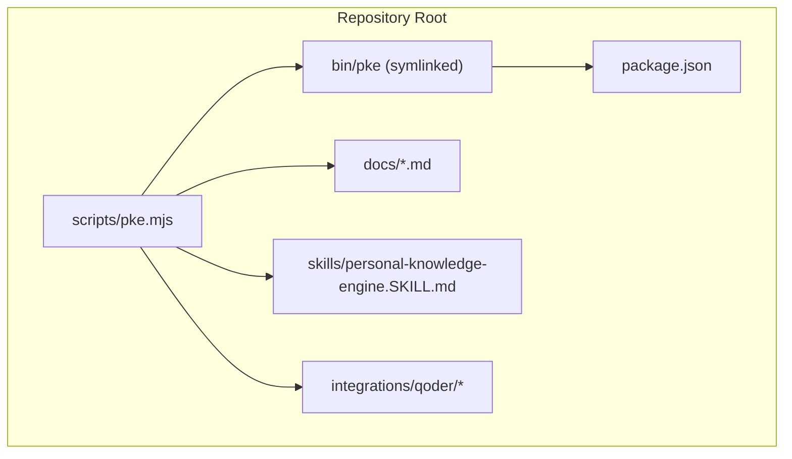
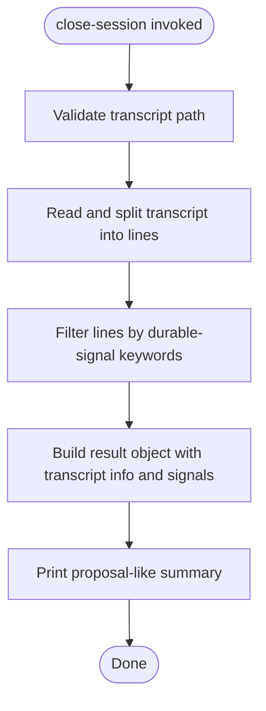
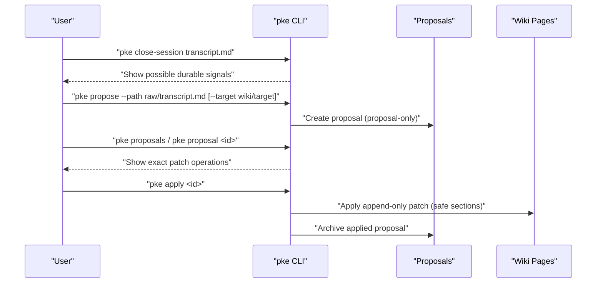
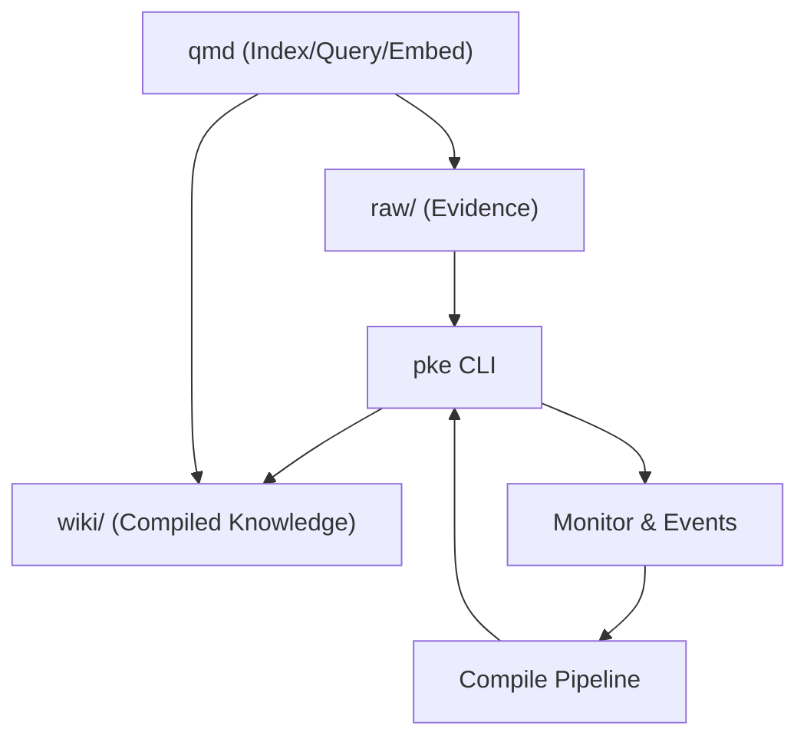
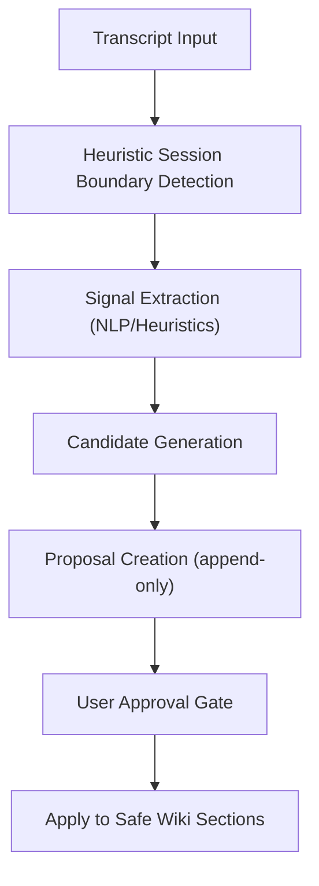
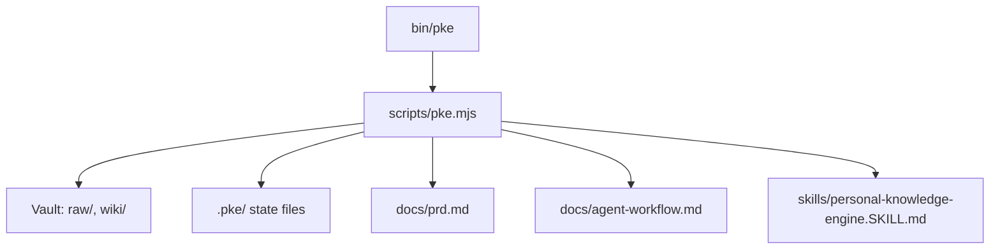

# Session Intelligence

<cite>
**Referenced Files in This Document**
- [README.md](file://README.md)
- [package.json](file://package.json)
- [scripts/pke.mjs](file://scripts/pke.mjs)
- [docs/prd.md](file://docs/prd.md)
- [docs/agent-workflow.md](file://docs/agent-workflow.md)
- [docs/implementation-backlog.md](file://docs/implementation-backlog.md)
- [skills/personal-knowledge-engine.SKILL.md](file://skills/personal-knowledge-engine.SKILL.md)
</cite>

## Table of Contents
1. [Introduction](#introduction)
2. [Project Structure](#project-structure)
3. [Core Components](#core-components)
4. [Architecture Overview](#architecture-overview)
5. [Detailed Component Analysis](#detailed-component-analysis)
6. [Dependency Analysis](#dependency-analysis)
7. [Performance Considerations](#performance-considerations)
8. [Troubleshooting Guide](#troubleshooting-guide)
9. [Conclusion](#conclusion)
10. [Appendices](#appendices)

## Introduction
This document explains the session intelligence capabilities in the Personal Knowledge Engine (PKE) with emphasis on the close-session command. It describes how transcripts are processed to identify durable knowledge signals, how the proposal-only approach is enforced even for session-derived insights, and how these signals integrate into the broader compilation workflow. It also outlines the planned enhancements for Phase 7 (Session Intelligence), including improved signal detection, session boundary heuristics, and integration with the compile pipeline.

## Project Structure
The PKE repository centers around a small CLI (pke) implemented in a single script module, with supporting documentation and skills definitions. The close-session command is implemented in the CLI and operates on local files within the configured vault.



**Diagram sources**
- [package.json:1-18](file://package.json#L1-L18)
- [scripts/pke.mjs:1-157](file://scripts/pke.mjs#L1-L157)

**Section sources**
- [package.json:1-18](file://package.json#L1-L18)
- [README.md:1-50](file://README.md#L1-L50)

## Core Components
- Close-session command: Processes a transcript file and extracts lines likely to contain durable knowledge signals (e.g., decisions, conclusions, directives). Outputs a proposal-only summary indicating possible durable signals and the governance rule that wiki updates require explicit approval.
- Proposal-only workflow: All compile actions, including those derived from session intelligence, remain proposals until approved. Approved proposals are applied as append-only patches to safe wiki sections.
- Knowledge capture and compilation: Transcripts are ingested as evidence; durable insights are surfaced via proposals and can be promoted to wiki pages only upon explicit user approval.
- Governance: Wiki writes are gated by a “definite update clue,” which includes explicit user commands, approvals, session-close-with-permission, or scheduled workflows.

**Section sources**
- [scripts/pke.mjs:396-418](file://scripts/pke.mjs#L396-L418)
- [README.md:82-120](file://README.md#L82-L120)
- [docs/prd.md:296-304](file://docs/prd.md#L296-L304)
- [docs/agent-workflow.md:71-91](file://docs/agent-workflow.md#L71-L91)

## Architecture Overview
The close-session command participates in the same proposal-only compilation loop as other knowledge capture methods. It reads a transcript, scans for durable-signal keywords, and emits a proposal-like summary. The proposal-only constraint ensures that even session-derived knowledge remains under human control.

```mermaid
sequenceDiagram
participant U as "User"
participant CLI as "pke CLI"
participant FS as "Vault Filesystem"
participant MON as "Monitor/Events"
participant COMP as "Compile Pipeline"
U->>CLI : "pke close-session transcript.md"
CLI->>FS : "Read transcript.md"
CLI->>CLI : "Scan lines for durable-signal keywords"
CLI-->>U : "Print 'Session Compile Proposal' with possible signals"
CLI-->>U : "Print governance rule : 'proposal-only; wiki update requires explicit approval'"
CLI->>MON : "Optionally emit events (per implementation backlog)"
CLI->>COMP : "Optionally feed candidates into compile pipeline (per backlog)"
```

**Diagram sources**
- [scripts/pke.mjs:396-418](file://scripts/pke.mjs#L396-L418)
- [docs/implementation-backlog.md:166-188](file://docs/implementation-backlog.md#L166-L188)

## Detailed Component Analysis

### Close-Session Command: Transcript Processing and Signal Detection
- Input: Path to a transcript file.
- Processing:
  - Reads the file and splits into non-empty lines.
  - Filters lines containing keywords associated with durable knowledge (e.g., decision, conclusion, therefore, update, should, must, and localized equivalents).
  - Limits the number of highlighted signals in the output.
- Output:
  - Transcript path and line count.
  - A list of possible durable signals (up to a cap).
  - A governance notice stating that wiki updates require explicit approval and that no wiki files were changed.



**Diagram sources**
- [scripts/pke.mjs:396-418](file://scripts/pke.mjs#L396-L418)

**Section sources**
- [scripts/pke.mjs:396-418](file://scripts/pke.mjs#L396-L418)
- [docs/prd.md:296-304](file://docs/prd.md#L296-L304)

### Proposal-Only Approach for Session-Derived Knowledge
- Even when session intelligence detects durable signals, the system does not write to wiki pages automatically.
- The output explicitly states that no wiki files were changed and that the mode is proposal-only.
- Approved proposals (including those generated from session signals) are applied as append-only patches to safe sections of wiki pages.



**Diagram sources**
- [scripts/pke.mjs:549-560](file://scripts/pke.mjs#L549-L560)
- [scripts/pke.mjs:585-600](file://scripts/pke.mjs#L585-L600)
- [docs/prd.md:352-376](file://docs/prd.md#L352-L376)

**Section sources**
- [scripts/pke.mjs:549-560](file://scripts/pke.mjs#L549-L560)
- [scripts/pke.mjs:585-600](file://scripts/pke.mjs#L585-L600)
- [docs/prd.md:352-376](file://docs/prd.md#L352-L376)

### Relationship Between Session Intelligence and Other Knowledge Capture Methods
- Evidence capture: Raw notes, transcripts, and other materials are copied into the raw/ area as immutable evidence.
- Retrieval: qmd-based queries prioritize wiki pages for current understanding and fall back to raw notes for evidence.
- Compilation: Changes are reviewed and proposed as append-only patches; wiki writes occur only with explicit approval.
- Session intelligence: Provides a focused way to scan conversation transcripts for durable signals and turn them into proposals.



**Diagram sources**
- [README.md:56-80](file://README.md#L56-L80)
- [docs/prd.md:47-106](file://docs/prd.md#L47-L106)

**Section sources**
- [README.md:56-80](file://README.md#L56-L80)
- [docs/prd.md:47-106](file://docs/prd.md#L47-L106)

### Planned Enhancements for Session Intelligence (Phase 7)
- Improved signal detection: Move beyond simple keyword matching to NLP-based or heuristic detection (e.g., time gaps, topic shifts, argument structure) to identify durable conclusions with higher accuracy.
- Heuristic session boundary detection: Detect session boundaries from timestamps, topic shifts, and activity gaps.
- Integration with compile pipeline: Make durable signals from close-session automatically become compile candidates and generate proposals for strong signals.
- Session metadata tracking: Record session metadata (duration, topics, outcomes) in events for analysis and metrics.



**Diagram sources**
- [docs/implementation-backlog.md:166-188](file://docs/implementation-backlog.md#L166-L188)
- [docs/prd.md:2090-2100](file://docs/prd.md#L2090-L2100)

**Section sources**
- [docs/implementation-backlog.md:166-188](file://docs/implementation-backlog.md#L166-L188)
- [docs/prd.md:2090-2100](file://docs/prd.md#L2090-L2100)

## Dependency Analysis
- CLI entrypoint: The pke binary is mapped to scripts/pke.mjs, which implements all commands including close-session.
- Vault layout: The CLI expects raw/ and wiki/ directories and manages state under .pke/.
- Governance dependencies: The close-session output enforces the proposal-only rule and the “definite update clue” requirement.



**Diagram sources**
- [package.json:7-9](file://package.json#L7-L9)
- [scripts/pke.mjs:1-47](file://scripts/pke.mjs#L1-L47)
- [docs/prd.md:428-452](file://docs/prd.md#L428-L452)

**Section sources**
- [package.json:7-9](file://package.json#L7-L9)
- [scripts/pke.mjs:1-47](file://scripts/pke.mjs#L1-L47)
- [docs/prd.md:428-452](file://docs/prd.md#L428-L452)

## Performance Considerations
- Keyword filtering is linear in the number of lines and inexpensive.
- Future NLP-based detection should consider cost and latency; batching and caching may be appropriate.
- Watch-mode monitoring uses scoped polling to avoid heavy filesystem watchers and reduce overhead.

## Troubleshooting Guide
- Missing transcript file: The close-session command validates the input path and throws an error if the file is not provided or not found.
- No durable signals detected: The output indicates that none were detected by the simple local scan; users can refine transcripts or wait for enhanced detection.
- Governance rule reminder: The output explicitly states that no wiki files were changed and that the mode is proposal-only.

**Section sources**
- [scripts/pke.mjs:396-418](file://scripts/pke.mjs#L396-L418)
- [README.md:82-120](file://README.md#L82-L120)

## Conclusion
The close-session command in PKE provides a focused mechanism to extract durable knowledge signals from conversation transcripts while maintaining strict governance. By keeping all compile actions proposal-only and requiring explicit approval, PKE ensures that wiki pages remain trustworthy and that session-derived insights are integrated deliberately into the broader knowledge compilation workflow.

## Appendices

### Best Practices for Leveraging Conversations as Knowledge Sources
- Keep transcripts structured and dated to aid boundary detection and later review.
- Use the close-session command regularly to capture durable insights promptly.
- Convert detected signals into proposals and review them alongside other candidates.
- Apply only when the signals are strong and warrant promotion to wiki pages.

**Section sources**
- [docs/agent-workflow.md:71-91](file://docs/agent-workflow.md#L71-L91)
- [docs/prd.md:296-304](file://docs/prd.md#L296-L304)