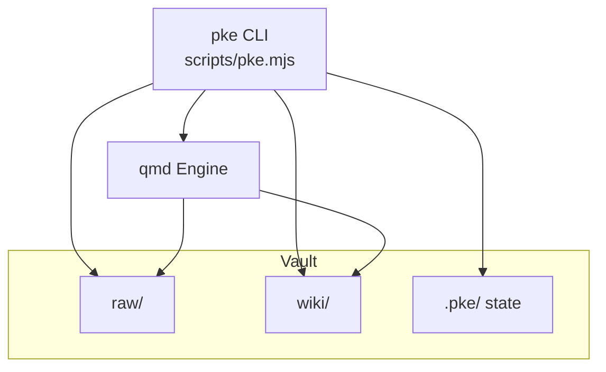
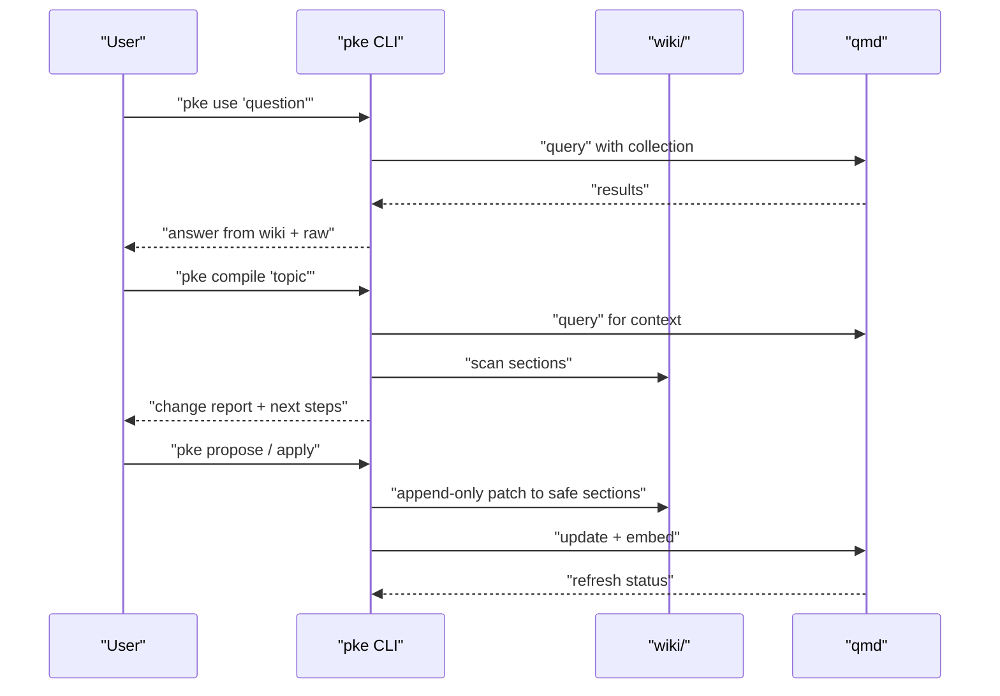
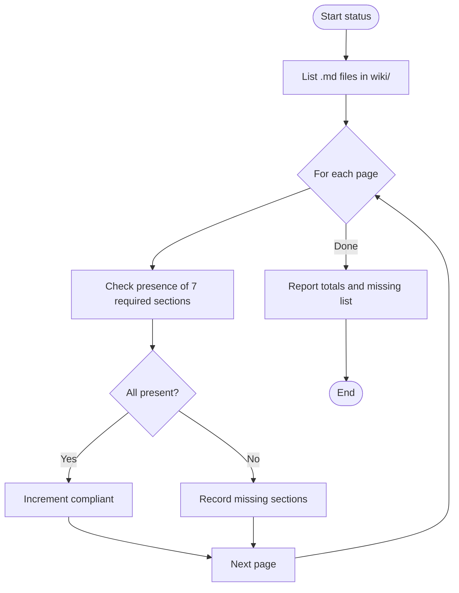
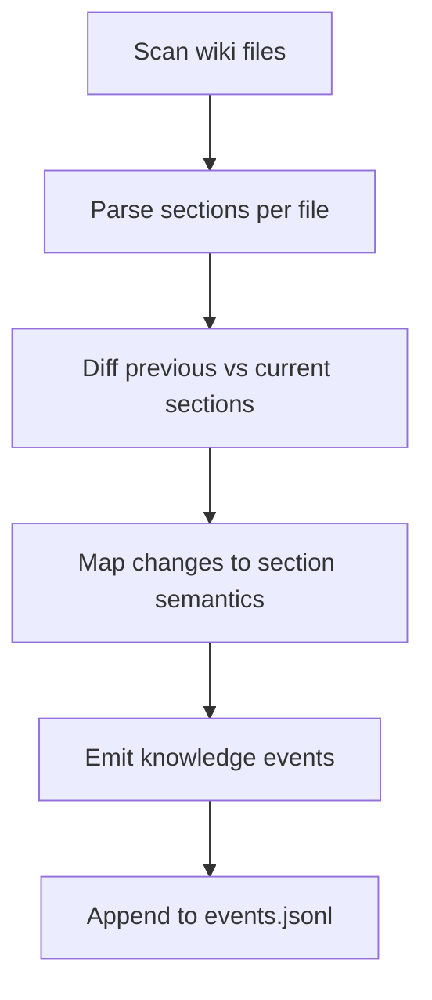
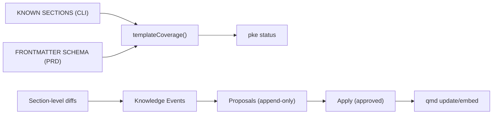

# Knowledge Template System

<cite>
**Referenced Files in This Document**
- [README.md](file://README.md)
- [scripts/pke.mjs](file://scripts/pke.mjs)
- [docs/prd.md](file://docs/prd.md)
- [skills/personal-knowledge-engine.SKILL.md](file://skills/personal-knowledge-engine.SKILL.md)
- [docs/agent-workflow.md](file://docs/agent-workflow.md)
</cite>

## Table of Contents
1. [Introduction](#introduction)
2. [Project Structure](#project-structure)
3. [Core Components](#core-components)
4. [Architecture Overview](#architecture-overview)
5. [Detailed Component Analysis](#detailed-component-analysis)
6. [Dependency Analysis](#dependency-analysis)
7. [Performance Considerations](#performance-considerations)
8. [Troubleshooting Guide](#troubleshooting-guide)
9. [Conclusion](#conclusion)
10. [Appendices](#appendices)

## Introduction
This document explains the Personal Knowledge Engine (PKE) knowledge template system that standardizes wiki pages across the local vault. It defines the 7-section wiki page structure, the required frontmatter metadata, and the compliance validation process. It also describes how the system enforces consistency, the semantic detection of knowledge events, and best practices for maintaining template integrity. Finally, it outlines customization options for domain-specific knowledge representations.

## Project Structure
The PKE knowledge template system is implemented in a small CLI and documented across several files:
- The CLI script defines the canonical 7-section order and the template compliance checker.
- The PRD documents the standardized schema, frontmatter fields, and section semantics.
- The Skill documentation references the template location and operational guidance.
- The Agent Workflow document describes how agents interact with the template during retrieval and synthesis.

**Diagram sources**
- [scripts/pke.mjs:31-33](file://scripts/pke.mjs#L31-L33)
- [docs/prd.md:430-452](file://docs/prd.md#L430-L452)

**Section sources**
- [README.md:3-13](file://README.md#L3-L13)
- [docs/prd.md:430-452](file://docs/prd.md#L430-L452)

## Core Components
- 7-section wiki template: The canonical structure enforced across all knowledge pages.
- Frontmatter metadata: Required YAML block with status, confidence, last_reviewed, page_type, engine_layer, and source_count.
- Compliance checker: Scans wiki pages to compute template coverage and list missing sections.
- Semantic event detection: Monitors changes and emits knowledge-level events keyed to sections.

**Section sources**
- [scripts/pke.mjs:33-41](file://scripts/pke.mjs#L33-L41)
- [scripts/pke.mjs:1170-1188](file://scripts/pke.mjs#L1170-L1188)
- [docs/prd.md:456-507](file://docs/prd.md#L456-L507)

## Architecture Overview
The template system underpins the “Compile” and “Use” loops. During Use, the agent prefers wiki pages for current understanding and falls back to raw notes as evidence. During Compile, the system proposes append-only updates to safe sections, preserving the template structure.

**Diagram sources**
- [README.md:15-21](file://README.md#L15-L21)
- [docs/prd.md:305-427](file://docs/prd.md#L305-L427)

## Detailed Component Analysis

### 7-Section Template Definition
Each wiki page must include the following seven sections in order:
- Current Understanding
- Key Principles
- Evidence
- Conflicts / Evolution
- Stale Or Risky Claims
- Open Questions
- Related Pages

These sections define the canonical structure for synthesizing durable knowledge while preserving uncertainty and traceability.

**Section sources**
- [scripts/pke.mjs:33-41](file://scripts/pke.mjs#L33-L41)
- [docs/prd.md:482-505](file://docs/prd.md#L482-L505)

### Frontmatter Metadata Schema
Every wiki page must include a YAML frontmatter block with the following fields:
- status: current | draft | stale | deprecated
- confidence: high | medium | low
- last_reviewed: YYYY-MM-DD
- page_type: knowledge | workflow | index | reference
- engine_layer: capture | compile | use | agent | evaluation
- source_count: integer

These fields support governance, retrieval categorization, and quality tracking.

**Section sources**
- [docs/prd.md:460-481](file://docs/prd.md#L460-L481)
- [skills/personal-knowledge-engine.SKILL.md:217-228](file://skills/personal-knowledge-engine.SKILL.md#L217-L228)

### Template Compliance Validation
The CLI’s status command scans all wiki pages and checks for the presence of all seven required sections. It reports:
- Total number of wiki pages
- Number compliant (all sections present)
- Missing sections per non-compliant page
- Optional JSON output for machine parsing

Compliance is computed by matching section headings with a regular expression anchored to line start.

**Diagram sources**
- [scripts/pke.mjs:1170-1188](file://scripts/pke.mjs#L1170-L1188)

**Section sources**
- [scripts/pke.mjs:159-187](file://scripts/pke.mjs#L159-L187)
- [scripts/pke.mjs:1170-1188](file://scripts/pke.mjs#L1170-L1188)

### Section Semantics and Content Expectations
- Current Understanding: Durable thesis and reasoning behind current beliefs.
- Key Principles: Reusable rules, frameworks, or mental models derived from evidence.
- Evidence: Links to raw sources and supporting material; entries should cite specific files.
- Conflicts / Evolution: Contradictions between sources, changed beliefs, and how understanding evolved.
- Stale Or Risky Claims: Time-sensitive assumptions, unverified claims, and facts that may have expired.
- Open Questions: Unresolved questions that would change current understanding if answered.
- Related Pages: Wiki-links to related knowledge pages.

These semantics are used by the monitor to emit knowledge-level events when content changes occur in specific sections.

**Section sources**
- [docs/prd.md:482-505](file://docs/prd.md#L482-L505)
- [scripts/pke.mjs:1355-1362](file://scripts/pke.mjs#L1355-L1362)

### Semantic Detection and Knowledge Events
The monitor compares previous and current wiki section snapshots and emits events such as:
- conclusion_added
- conclusion_changed
- conflict_detected
- stale_claim_detected
- open_question_added
- evidence_added
- evidence_link_added
- knowledge_section_updated

These events are categorized by the affected section and can trigger proposals for append-only updates.

**Diagram sources**
- [scripts/pke.mjs:1277-1362](file://scripts/pke.mjs#L1277-L1362)

**Section sources**
- [README.md:155-169](file://README.md#L155-L169)
- [docs/prd.md:576-594](file://docs/prd.md#L576-L594)

### Compliance Validation Process
- Scanning: Enumerate wiki/*.md files and read each page.
- Matching: Use a regex anchored to line start to detect section headings.
- Reporting: Compute totals and missing lists; optionally output JSON.

Common violations include:
- Missing section headings
- Incorrect capitalization or spacing in headings
- Out-of-order sections
- Absent frontmatter or invalid YAML

Warnings and errors surface during status and proposal workflows.

**Section sources**
- [scripts/pke.mjs:1170-1188](file://scripts/pke.mjs#L1170-L1188)
- [scripts/pke.mjs:159-187](file://scripts/pke.mjs#L159-L187)

### Best Practices for Maintaining Template Integrity
- Always add the frontmatter block before writing content.
- Keep section headings exactly as defined; avoid trailing spaces or extra punctuation.
- Use wiki-links for evidence and related pages to maintain traceability.
- Reserve rewrite of Current Understanding for explicit update clues; otherwise propose append-only changes to safe sections.
- Run qmd update and embed after applying approved proposals.

**Section sources**
- [docs/prd.md:196-203](file://docs/prd.md#L196-L203)
- [skills/personal-knowledge-engine.SKILL.md:56-62](file://skills/personal-knowledge-engine.SKILL.md#L56-L62)

### Examples and Violations
- Properly formatted template: See the PRD’s frontmatter and section examples.
- Common violations:
  - Missing frontmatter or incorrect field names/types
  - Missing one or more required sections
  - Non-canonical section headings (capitalization, spacing)
  - Evidence entries without specific source citations
  - Rewrites to Current Understanding without explicit update clue

**Section sources**
- [docs/prd.md:460-505](file://docs/prd.md#L460-L505)

### Template Extensions and Customization
While the core 7-section template is mandatory, the system supports:
- Domain-specific page_types and engine_layers to tailor retrieval and organization.
- Customizable section ordering is discouraged to preserve semantic detection and governance.
- Safe append-only updates to Evidence, Open Questions, and Related Pages are encouraged for incremental improvement.
- Creation of new pages via retrieval-tuning proposals when frequent topics lack coverage.

**Section sources**
- [docs/prd.md:460-481](file://docs/prd.md#L460-L481)
- [scripts/pke.mjs:1016-1058](file://scripts/pke.mjs#L1016-L1058)

## Dependency Analysis
The template system depends on:
- Canonical section list defined in the CLI
- Consistent frontmatter schema documented in the PRD
- Monitoring logic that maps changes to section semantics
- Agent behavior that reads wiki pages first and proposes updates only with explicit permission

**Diagram sources**
- [scripts/pke.mjs:33-41](file://scripts/pke.mjs#L33-L41)
- [scripts/pke.mjs:1170-1188](file://scripts/pke.mjs#L1170-L1188)
- [scripts/pke.mjs:1324-1362](file://scripts/pke.mjs#L1324-L1362)

**Section sources**
- [scripts/pke.mjs:33-41](file://scripts/pke.mjs#L33-L41)
- [docs/prd.md:456-507](file://docs/prd.md#L456-L507)

## Performance Considerations
- Template validation scans all wiki pages; keep the number of pages manageable for timely status checks.
- Section parsing ignores fenced code blocks and trims lines for accurate diffing.
- Monitor diffs are bounded to a fixed number of lines per event to reduce noise.

[No sources needed since this section provides general guidance]

## Troubleshooting Guide
- Template compliance low: Use pke status to identify missing sections and fix headings.
- Proposal not applied: Ensure explicit update clue or user approval; verify frontmatter fields.
- Monitor false positives: Confirm section headings match the canonical list; correct typos or extra whitespace.
- Dashboard shows no changes: Verify scoped monitor path and ensure files are inside the vault.

**Section sources**
- [scripts/pke.mjs:159-187](file://scripts/pke.mjs#L159-L187)
- [README.md:128-184](file://README.md#L128-L184)

## Conclusion
The PKE knowledge template system enforces a strict, canonical structure across all wiki pages, backed by automated compliance checks and semantic event detection. By adhering to the 7-section template and frontmatter schema, contributors can maintain high-quality, traceable knowledge that supports reliable retrieval and controlled self-improvement.

[No sources needed since this section summarizes without analyzing specific files]

## Appendices

### Appendix A: Section-by-Section Content Requirements
- Current Understanding: Durable thesis and rationale.
- Key Principles: Reusable frameworks and rules.
- Evidence: Citations to raw sources; link to specific files.
- Conflicts / Evolution: Contradictions and belief evolution.
- Stale Or Risky Claims: Outdated or time-sensitive claims.
- Open Questions: Unresolved items that would change current understanding.
- Related Pages: Wiki-links to connected knowledge.

**Section sources**
- [docs/prd.md:482-505](file://docs/prd.md#L482-L505)

### Appendix B: Frontmatter Fields and Allowed Values
- status: current | draft | stale | deprecated
- confidence: high | medium | low
- last_reviewed: YYYY-MM-DD
- page_type: knowledge | workflow | index | reference
- engine_layer: capture | compile | use | agent | evaluation
- source_count: integer

**Section sources**
- [docs/prd.md:460-481](file://docs/prd.md#L460-L481)

### Appendix C: Compliance Validation Checklist
- [ ] YAML frontmatter present and valid
- [ ] All seven section headings present and correctly capitalized
- [ ] Evidence entries cite specific source files
- [ ] Related Pages include wiki-links
- [ ] No rewrite of Current Understanding without explicit update clue

**Section sources**
- [scripts/pke.mjs:1170-1188](file://scripts/pke.mjs#L1170-L1188)
- [docs/prd.md:196-203](file://docs/prd.md#L196-L203)