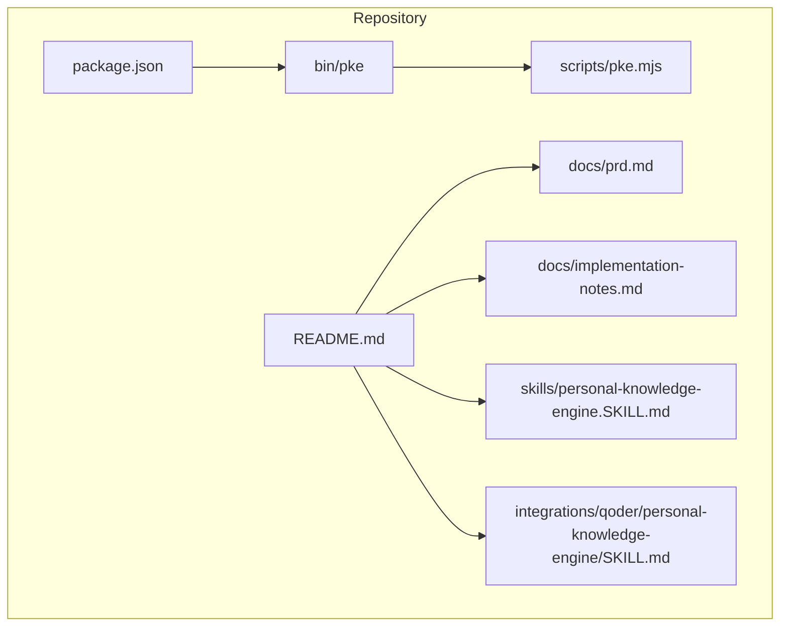
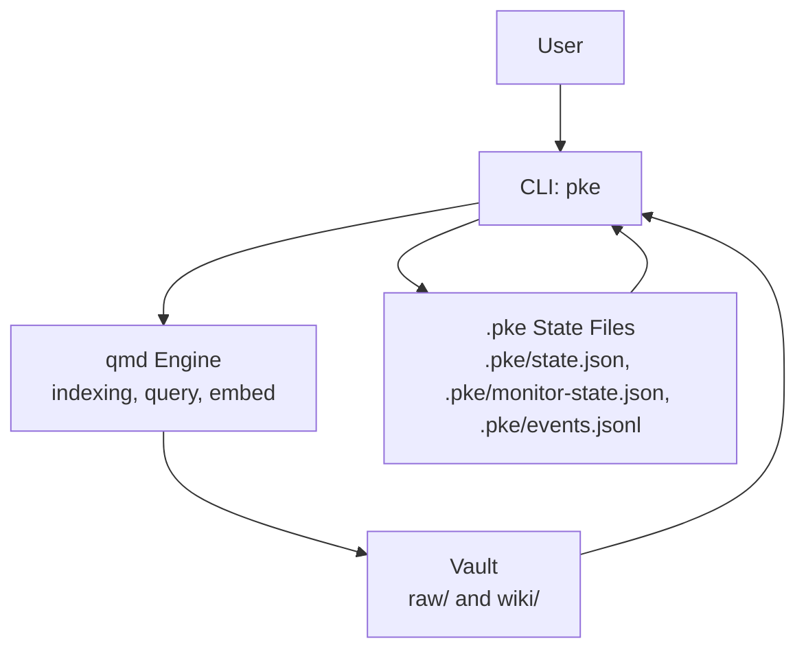
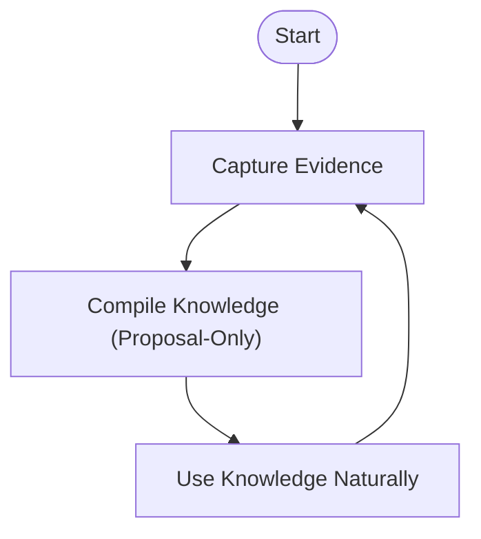
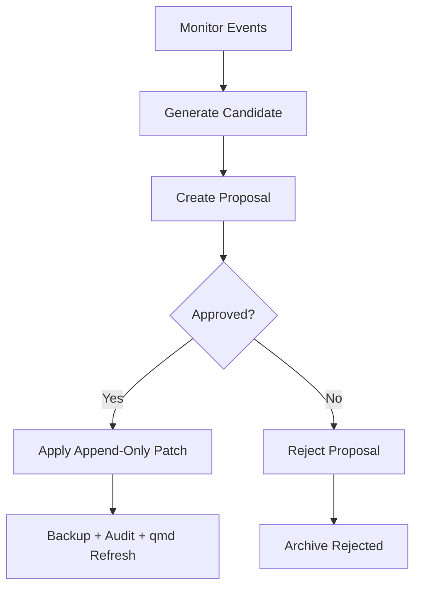
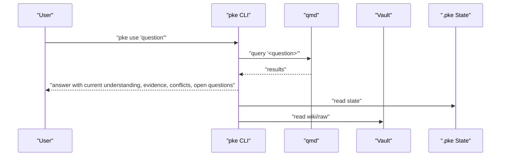
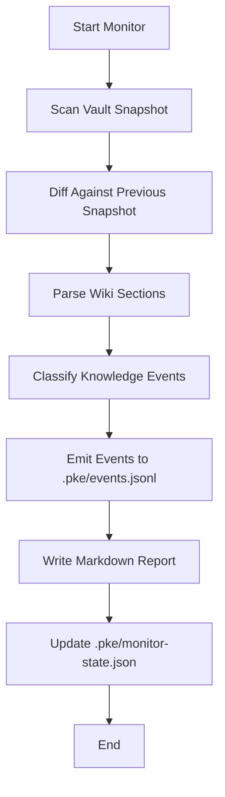
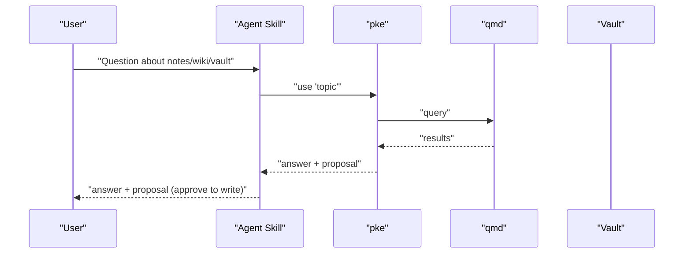
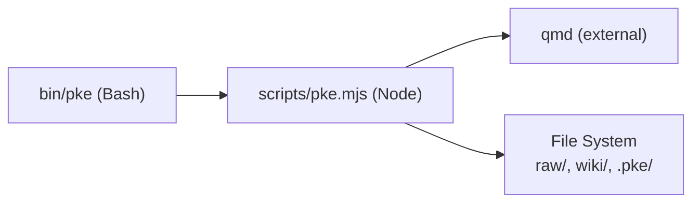

# Project Overview

<cite>
**Referenced Files in This Document**
- [README.md](file://README.md)
- [package.json](file://package.json)
- [docs/prd.md](file://docs/prd.md)
- [docs/implementation-notes.md](file://docs/implementation-notes.md)
- [skills/personal-knowledge-engine.SKILL.md](file://skills/personal-knowledge-engine.SKILL.md)
- [integrations/qoder/personal-knowledge-engine/SKILL.md](file://integrations/qoder/personal-knowledge-engine/SKILL.md)
- [scripts/pke.mjs](file://scripts/pke.mjs)
- [bin/pke](file://bin/pke)
</cite>

## Table of Contents
1. [Introduction](#introduction)
2. [Project Structure](#project-structure)
3. [Core Components](#core-components)
4. [Architecture Overview](#architecture-overview)
5. [Detailed Component Analysis](#detailed-component-analysis)
6. [Dependency Analysis](#dependency-analysis)
7. [Performance Considerations](#performance-considerations)
8. [Troubleshooting Guide](#troubleshooting-guide)
9. [Conclusion](#conclusion)

## Introduction
Personal Knowledge Engine (PKE) is a local-first knowledge workflow that transforms raw personal information into governed, reusable knowledge. Its mission is to protect the distinction between raw evidence and compiled knowledge, ensuring that durable conclusions live in the wiki while raw materials remain in the evidence store. The MVP focuses on local files and a three-phase product loop: Capture evidence, Compile knowledge, Use knowledge naturally. Governance enforces that wiki writes require a definite update clue, preventing silent pollution of the knowledge base.

Why this exists:
- Raw notes are not truth. They can be stale, partial, duplicated, or contradictory.
- The wiki should contain judged knowledge: current understanding, principles, evidence, conflicts, stale claims, open questions, and related pages.
- The engine answers and proposes; it does not silently write knowledge without explicit permission.

This project exists to help knowledge workers think and work from their accumulated knowledge without polluting the knowledge base. It bridges capture tools (DingTalk, Notion, Obsidian, local files) and the user’s need for synthesized, auditable, living knowledge with explicit governance that prevents AI-generated noise from corrupting the knowledge base.

## Project Structure
The repository organizes the MVP around a small CLI, documentation, and integration assets. The CLI is implemented as a Node.js script with a Bash launcher, and the documentation defines the product vision, governance, and workflows.

**Diagram sources**
- [README.md:1-211](file://README.md#L1-L211)
- [package.json:1-18](file://package.json#L1-L18)
- [scripts/pke.mjs:1-100](file://scripts/pke.mjs#L1-L100)
- [bin/pke:1-10](file://bin/pke#L1-L10)
- [docs/prd.md:1-120](file://docs/prd.md#L1-L120)
- [docs/implementation-notes.md:1-113](file://docs/implementation-notes.md#L1-L113)
- [skills/personal-knowledge-engine.SKILL.md:1-229](file://skills/personal-knowledge-engine.SKILL.md#L1-L229)
- [integrations/qoder/personal-knowledge-engine/SKILL.md:1-59](file://integrations/qoder/personal-knowledge-engine/SKILL.md#L1-L59)

**Section sources**
- [README.md:1-211](file://README.md#L1-L211)
- [package.json:1-18](file://package.json#L1-L18)
- [docs/prd.md:1-120](file://docs/prd.md#L1-L120)
- [docs/implementation-notes.md:1-113](file://docs/implementation-notes.md#L1-L113)
- [skills/personal-knowledge-engine.SKILL.md:1-229](file://skills/personal-knowledge-engine.SKILL.md#L1-L229)
- [integrations/qoder/personal-knowledge-engine/SKILL.md:1-59](file://integrations/qoder/personal-knowledge-engine/SKILL.md#L1-L59)

## Core Components
- Local vault: A user-configured directory with two primary areas:
  - raw/: Evidence files (captures, transcripts, articles, AI drafts, etc.)
  - wiki/: Structured knowledge pages following a 7-section template
- CLI: A small Node.js program with a Bash launcher that exposes commands for capture, compile, use, monitor, dashboard, and controlled self-improvement.
- qmd integration: Local indexing and retrieval via MinerU Document Explorer (qmd), enabling semantic discovery and embedding.
- Governance: A strict policy that wiki writes require a definite update clue; otherwise, the engine answers and proposes.

Key behaviors:
- Capture evidence without treating it as truth.
- Retrieve from wiki first, fallback to raw evidence.
- Compile knowledge through proposal-only workflows.
- Use knowledge naturally without requiring explicit activation.
- Protect raw files from frequent editing; keep wiki updates cautious and evidence-linked.

**Section sources**
- [README.md:23-118](file://README.md#L23-L118)
- [docs/prd.md:41-142](file://docs/prd.md#L41-L142)
- [docs/implementation-notes.md:18-40](file://docs/implementation-notes.md#L18-L40)
- [scripts/pke.mjs:99-157](file://scripts/pke.mjs#L99-L157)

## Architecture Overview
The MVP implements a local-first architecture centered on a vault, a CLI, and qmd. The CLI orchestrates the three-phase loop and maintains observability through state files and event logs.

**Diagram sources**
- [docs/prd.md:698-730](file://docs/prd.md#L698-L730)
- [scripts/pke.mjs:9-32](file://scripts/pke.mjs#L9-L32)
- [docs/implementation-notes.md:50-72](file://docs/implementation-notes.md#L50-L72)

## Detailed Component Analysis

### Three-Phase Product Loop
- Capture evidence: Store incoming materials as immutable evidence without treating them as truth. Evidence is rarely edited; raw files are preserved for later synthesis.
- Compile knowledge: Transform evidence into knowledge through a proposal-only pipeline. Every compile run outputs a change report and next steps; wiki writes occur only after explicit approval.
- Use knowledge naturally: During normal work, the agent retrieves relevant wiki pages and raw notes, answers from current understanding, surfaces uncertainty, and proposes wiki updates when durable knowledge appears.

**Diagram sources**
- [docs/prd.md:45-142](file://docs/prd.md#L45-L142)
- [README.md:15-21](file://README.md#L15-L21)

**Section sources**
- [docs/prd.md:45-142](file://docs/prd.md#L45-L142)
- [README.md:15-21](file://README.md#L15-L21)

### Governance Model: Proposal-Only Wiki Updates
Wiki writes are intentionally conservative. A wiki update requires one of:
- Explicit user command to update, save, write, revise, ingest, upgrade, or compile
- Explicit approval of a proposed update
- Session close summary with update permission
- Scheduled or explicit daily compilation/staleness review

Without that clue, the engine answers or proposes; it does not silently write knowledge.

**Diagram sources**
- [README.md:82-94](file://README.md#L82-L94)
- [docs/prd.md:191-200](file://docs/prd.md#L191-L200)
- [scripts/pke.mjs:549-600](file://scripts/pke.mjs#L549-L600)

**Section sources**
- [README.md:82-94](file://README.md#L82-L94)
- [docs/prd.md:191-200](file://docs/prd.md#L191-L200)
- [scripts/pke.mjs:549-600](file://scripts/pke.mjs#L549-L600)

### CLI and Commands
The CLI provides a focused set of commands aligned with the three-phase loop and governance. Representative commands include:
- status: Vault health, qmd connectivity, baseline state, and template compliance
- use: Natural-language retrieval via qmd
- changed/daily: Change detection and daily compilation proposals
- learn: Draft-final diff and learning proposal
- capture: Evidence capture with preview and write modes
- compile: Compile plan with change report and next steps
- close-session: Session close summary for durable signals
- stale: Staleness review with sensitivity
- monitor/events/report: Observability and reporting
- dashboard: Browser-based knowledge health viewer
- candidates/propose/proposals/proposal/apply/reject: Controlled self-improvement

**Diagram sources**
- [scripts/pke.mjs:189-194](file://scripts/pke.mjs#L189-L194)
- [docs/prd.md:307-330](file://docs/prd.md#L307-L330)

**Section sources**
- [README.md:56-80](file://README.md#L56-L80)
- [scripts/pke.mjs:48-97](file://scripts/pke.mjs#L48-L97)
- [docs/prd.md:307-330](file://docs/prd.md#L307-L330)

### Knowledge Monitor and Observability
The monitor is an observability layer that detects file-level and knowledge-level changes, classifies semantic events, and persists append-only logs and reports. It supports scoped monitoring and watch mode with polling.

**Diagram sources**
- [docs/implementation-notes.md:50-72](file://docs/implementation-notes.md#L50-L72)
- [scripts/pke.mjs:738-785](file://scripts/pke.mjs#L738-L785)

**Section sources**
- [docs/implementation-notes.md:50-72](file://docs/implementation-notes.md#L50-L72)
- [scripts/pke.mjs:738-785](file://scripts/pke.mjs#L738-L785)

### Agent Workflow and Auto-Activation
The agent skill auto-activates for requests touching the user’s knowledge domains, operates quietly, and follows strict update governance. It separates current understanding, evidence, conflicts, stale/risky claims, and open questions, and proposes wiki updates only when durable knowledge is created.

**Diagram sources**
- [skills/personal-knowledge-engine.SKILL.md:8-22](file://skills/personal-knowledge-engine.SKILL.md#L8-L22)
- [skills/personal-knowledge-engine.SKILL.md:49-63](file://skills/personal-knowledge-engine.SKILL.md#L49-L63)
- [integrations/qoder/personal-knowledge-engine/SKILL.md:28-59](file://integrations/qoder/personal-knowledge-engine/SKILL.md#L28-L59)

**Section sources**
- [skills/personal-knowledge-engine.SKILL.md:8-22](file://skills/personal-knowledge-engine.SKILL.md#L8-L22)
- [skills/personal-knowledge-engine.SKILL.md:49-63](file://skills/personal-knowledge-engine.SKILL.md#L49-L63)
- [integrations/qoder/personal-knowledge-engine/SKILL.md:28-59](file://integrations/qoder/personal-knowledge-engine/SKILL.md#L28-L59)

## Dependency Analysis
- CLI bootstrap: The Bash launcher resolves the script path and executes the Node.js implementation.
- Node.js runtime: The CLI relies on Node built-ins and spawns qmd for indexing and retrieval.
- qmd: The CLI delegates retrieval and embedding to qmd, which indexes the vault and responds to queries.
- Vault layout: The CLI expects raw/ and wiki/ directories and manages .pke state artifacts.

**Diagram sources**
- [bin/pke:1-10](file://bin/pke#L1-L10)
- [scripts/pke.mjs:1-10](file://scripts/pke.mjs#L1-L10)
- [docs/prd.md:698-730](file://docs/prd.md#L698-L730)

**Section sources**
- [bin/pke:1-10](file://bin/pke#L1-L10)
- [scripts/pke.mjs:1-10](file://scripts/pke.mjs#L1-L10)
- [docs/prd.md:698-730](file://docs/prd.md#L698-L730)

## Performance Considerations
- Scoped monitoring: Watch mode uses scoped polling to avoid watching unrelated files and to remain portable across environments.
- Rate limits and caps: The CLI enforces limits on candidates, proposals, and report retention to keep the system responsive.
- Minimal writes: The MVP avoids frequent writes, focusing on proposals and approvals to reduce risk and overhead.

[No sources needed since this section provides general guidance]

## Troubleshooting Guide
Common issues and remedies:
- qmd connectivity: Use the status command to verify qmd availability and collection configuration.
- Missing vault or directories: Ensure raw/ and wiki/ exist under the configured vault path.
- Watch path errors: Watch mode requires a vault-relative path; the CLI validates scope and existence.
- Proposal approvals: If qmd refresh fails after applying a proposal, the wiki patch remains applied; review the proposal change report for details.
- Governance violations: If the engine answers without writing, confirm that a definite update clue exists or that the workflow is proposal-only.

**Section sources**
- [scripts/pke.mjs:159-187](file://scripts/pke.mjs#L159-L187)
- [scripts/pke.mjs:787-800](file://scripts/pke.mjs#L787-L800)
- [docs/implementation-notes.md:99-102](file://docs/implementation-notes.md#L99-L102)

## Conclusion
Personal Knowledge Engine’s MVP establishes a local-first, governed workflow that preserves the distinction between raw evidence and compiled knowledge. By enforcing proposal-only wiki updates, protecting raw files from frequent editing, and exposing uncertainty, it builds trust in the knowledge base. The three-phase loop—Capture, Compile, Use—provides a simple mental model for knowledge work, while observability and controlled self-improvement keep the system healthy and auditable. This foundation prepares the way for broader integrations and future capabilities while maintaining the core principle: durable knowledge emerges from deliberate synthesis, not accidental accumulation.