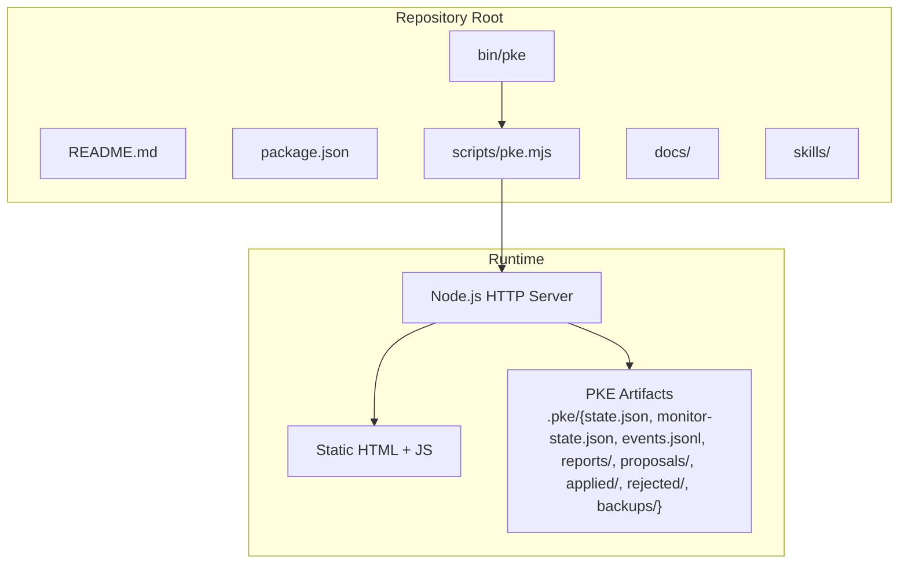
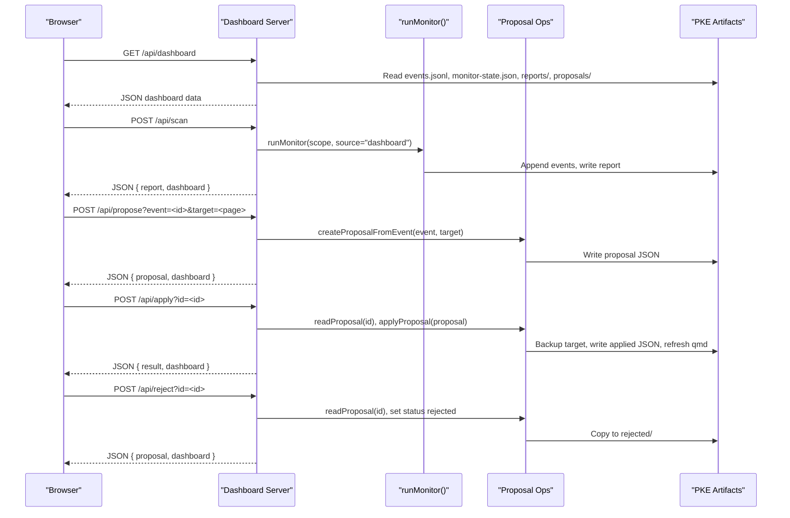
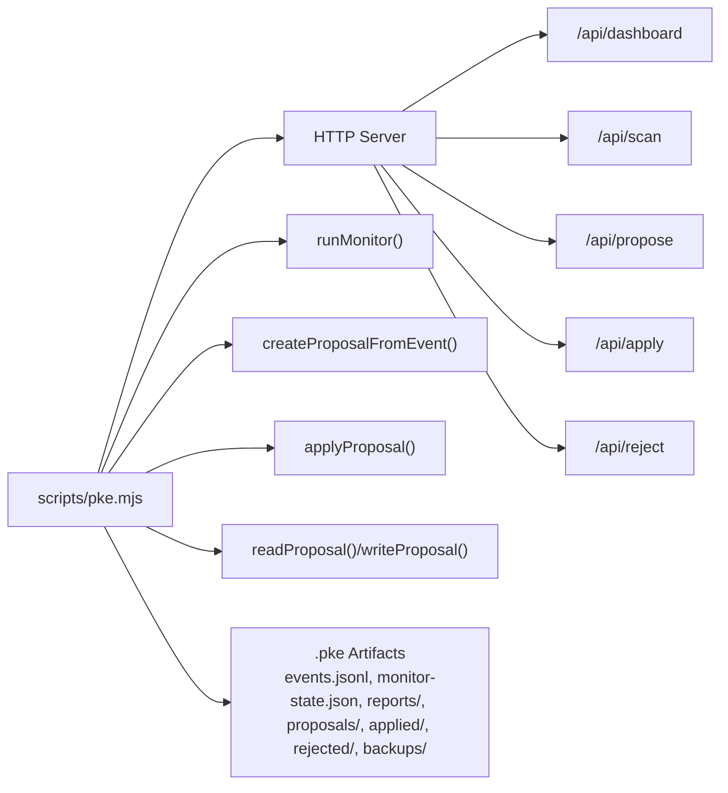

# Approval Interface and Dashboard

<cite>
**Referenced Files in This Document**
- [README.md](file://README.md)
- [package.json](file://package.json)
- [pke.mjs](file://scripts/pke.mjs)
- [prd.md](file://docs/prd.md)
- [agent-workflow.md](file://docs/agent-workflow.md)
- [personal-knowledge-engine.SKILL.md](file://skills/personal-knowledge-engine.SKILL.md)
</cite>

## Table of Contents
1. [Introduction](#introduction)
2. [Project Structure](#project-structure)
3. [Core Components](#core-components)
4. [Architecture Overview](#architecture-overview)
5. [Detailed Component Analysis](#detailed-component-analysis)
6. [Dependency Analysis](#dependency-analysis)
7. [Performance Considerations](#performance-considerations)
8. [Troubleshooting Guide](#troubleshooting-guide)
9. [Conclusion](#conclusion)
10. [Appendices](#appendices)

## Introduction
This document describes the approval interface and web-based dashboard for the Personal Knowledge Engine (PKE). It covers the HTTP API endpoints for proposal management, the dashboard server implementation, real-time monitoring, and the interactive approval workflow. It also documents JSON API responses, error handling, state management, configuration options, security considerations, and deployment requirements.

The dashboard provides a browser-based view of knowledge monitor totals, recent events, conflicts, stale claims, open questions, and recent reports. It reads local PKE artifacts and refreshes automatically. Proposals can be created from monitor events and approved or rejected directly from the dashboard.

## Project Structure
The PKE project is a Node.js CLI with a small built-in HTTP server for the dashboard. The primary implementation resides in a single script file that handles both CLI commands and the dashboard HTTP server.

**Diagram sources**
- [pke.mjs:674-736](file://scripts/pke.mjs#L674-L736)
- [pke.mjs:1735-1918](file://scripts/pke.mjs#L1735-L1918)

**Section sources**
- [README.md:171-184](file://README.md#L171-L184)
- [package.json:1-18](file://package.json#L1-L18)
- [pke.mjs:674-736](file://scripts/pke.mjs#L674-L736)

## Core Components
- Dashboard HTTP server: An in-process Node.js HTTP server serving static HTML and JSON APIs.
- Proposal lifecycle: Creation from monitor events, approval, and application with backup and qmd refresh.
- Real-time monitoring: One-shot and watch modes; dashboard can auto-scan on refresh.
- JSON API: Endpoints for dashboard data, scanning, proposal creation, approval, and rejection.

Key responsibilities:
- Serve the dashboard UI and API endpoints.
- Aggregate and expose PKE state (events, reports, proposals).
- Provide approval controls for proposals.
- Maintain audit trails via backups and proposal state.

**Section sources**
- [pke.mjs:674-736](file://scripts/pke.mjs#L674-L736)
- [pke.mjs:1667-1733](file://scripts/pke.mjs#L1667-L1733)
- [pke.mjs:1920-1928](file://scripts/pke.mjs#L1920-L1928)

## Architecture Overview
The dashboard server is embedded in the CLI script and exposes:
- GET /api/dashboard: Returns aggregated dashboard data.
- POST /api/scan: Runs a monitor scan and returns combined report and dashboard data.
- POST /api/propose: Creates a proposal from an event and returns the proposal plus dashboard data.
- POST /api/apply: Applies a pending proposal (backs up target, applies patch, updates state, refreshes qmd).
- POST /api/reject: Rejects a proposal and moves it to the rejected archive.

**Diagram sources**
- [pke.mjs:674-736](file://scripts/pke.mjs#L674-L736)
- [pke.mjs:738-785](file://scripts/pke.mjs#L738-L785)
- [pke.mjs:549-560](file://scripts/pke.mjs#L549-L560)
- [pke.mjs:585-600](file://scripts/pke.mjs#L585-L600)
- [pke.mjs:662-672](file://scripts/pke.mjs#L662-L672)
- [pke.mjs:1667-1733](file://scripts/pke.mjs#L1667-L1733)

## Detailed Component Analysis

### Dashboard HTTP Server
The server is created with Node’s http module and routes requests to handlers for dashboard data, scanning, proposal creation, approval, and rejection. It supports optional auto-scan behavior and responds with JSON for API endpoints.

Endpoints:
- GET /api/dashboard: Returns dashboard data including totals, latest scan, activity, events, and proposals.
- POST /api/scan: Runs a monitor scan and returns both the new report and the refreshed dashboard data.
- POST /api/propose: Creates a proposal from an event and returns the proposal plus dashboard data.
- POST /api/apply: Applies a pending proposal and returns the result plus dashboard data.
- POST /api/reject: Rejects a proposal and returns the updated proposal plus dashboard data.

Configuration:
- Port and host are configurable via CLI options.
- Optional auto-scan flag controls whether scanning occurs on dashboard refresh.

Security:
- The server binds to localhost by default and serves only local artifacts.
- No authentication or TLS is implemented; access is restricted to the local machine.

Real-time behavior:
- The dashboard HTML polls the server every 5 seconds.
- Manual “Scan Now” triggers a scan endpoint.

**Section sources**
- [pke.mjs:674-736](file://scripts/pke.mjs#L674-L736)
- [pke.mjs:1735-1918](file://scripts/pke.mjs#L1735-L1918)
- [README.md:171-184](file://README.md#L171-L184)

### Proposal Management API
Proposal lifecycle:
- Creation: From a monitor event or a raw file path with an optional target wiki page.
- Review: The dashboard lists pending proposals with reasons, sources, targets, and patch operations.
- Approval: Apply the exact patch to the target wiki page (append-only operations).
- Rejection: Move the proposal to the rejected archive.

JSON API responses:
- /api/dashboard: Returns dashboard data object with generatedAt, vault, paths, scope, autoScan, lastMonitorAt, totals, latestScan, latestActivity, activityEvents, latestTotals, activityTotals, byType, events, reports, and proposals.
- /api/scan: Returns { report, dashboard }.
- /api/propose: Returns { proposal, dashboard }.
- /api/apply: Returns { result, dashboard }.
- /api/reject: Returns { proposal, dashboard }.

Error handling:
- Missing or invalid parameters return JSON with an error field and appropriate HTTP status (e.g., 400 or 404).
- Exceptions during apply/reject are caught and returned as JSON errors.

State management:
- Proposals are stored under the proposals directory with JSON files.
- Applied proposals are archived under applied/.
- Rejected proposals are archived under rejected/.
- Backups of target wiki pages are stored under backups/.

**Section sources**
- [pke.mjs:674-736](file://scripts/pke.mjs#L674-L736)
- [pke.mjs:549-560](file://scripts/pke.mjs#L549-L560)
- [pke.mjs:585-600](file://scripts/pke.mjs#L585-L600)
- [pke.mjs:662-672](file://scripts/pke.mjs#L662-L672)
- [pke.mjs:1559-1567](file://scripts/pke.mjs#L1559-L1567)
- [pke.mjs:1603-1633](file://scripts/pke.mjs#L1603-L1633)
- [pke.mjs:1635-1641](file://scripts/pke.mjs#L1635-L1641)
- [pke.mjs:1660-1665](file://scripts/pke.mjs#L1660-L1665)

### Dashboard UI and Interactions
The dashboard renders:
- Metrics cards for current and last activity event counts.
- Filterable list of recent events by type.
- Pending proposals with actions to create proposals, approve, or reject.
- Recent reports list.

Interactions:
- Filter buttons toggle event type filters.
- “Scan Now” triggers a monitor scan.
- “Refresh” reloads dashboard data.
- Buttons for creating proposals from events, approving, and rejecting proposals.

The UI fetches data from /api/dashboard and uses the API endpoints for mutations.

**Section sources**
- [pke.mjs:1735-1918](file://scripts/pke.mjs#L1735-L1918)

### Real-time Monitoring and Auto-scan
- One-shot monitor: Scans the vault and writes a report and events.
- Watch mode: Periodically polls for changes at a configurable interval.
- Auto-scan: When enabled, the dashboard triggers a monitor scan on each refresh.

Scoping:
- Monitor can be scoped to a vault-relative path; watch mode requires a path inside the vault.

**Section sources**
- [pke.mjs:738-785](file://scripts/pke.mjs#L738-L785)
- [pke.mjs:800-810](file://scripts/pke.mjs#L800-L810)
- [README.md:139-145](file://README.md#L139-L145)

### Security Considerations
- Binding to localhost reduces exposure; do not expose externally.
- No authentication or authorization is implemented; treat as a trusted local service.
- Proposals are approval-gated; wiki writes occur only after explicit approval.
- Backups are created before applying patches to mitigate risk.

**Section sources**
- [pke.mjs:674-736](file://scripts/pke.mjs#L674-L736)
- [pke.mjs:1603-1633](file://scripts/pke.mjs#L1603-L1633)

### Deployment Requirements
- Node.js runtime is required.
- The PKE vault must exist with raw/ and wiki/ directories.
- Optional qmd binary must be available on PATH for indexing and embedding.

**Section sources**
- [README.md:35-54](file://README.md#L35-L54)
- [README.md:171-178](file://README.md#L171-L178)

## Dependency Analysis
The dashboard server depends on:
- Node.js built-ins: http, fs, path, crypto, os, child_process.
- PKE internal functions for monitoring, proposal management, and artifact handling.

**Diagram sources**
- [pke.mjs:674-736](file://scripts/pke.mjs#L674-L736)
- [pke.mjs:738-785](file://scripts/pke.mjs#L738-L785)
- [pke.mjs:549-560](file://scripts/pke.mjs#L549-L560)
- [pke.mjs:585-600](file://scripts/pke.mjs#L585-L600)
- [pke.mjs:1667-1733](file://scripts/pke.mjs#L1667-L1733)

**Section sources**
- [pke.mjs:1-46](file://scripts/pke.mjs#L1-L46)

## Performance Considerations
- Polling interval: Watch mode defaults to a short interval; adjust for your environment.
- Event volume: Events are capped and archived to manage storage growth.
- Report retention: Old reports are archived after a retention period.
- Proposal cap: Pending proposals are capped to avoid excessive backlog.

[No sources needed since this section provides general guidance]

## Troubleshooting Guide
Common issues and resolutions:
- Dashboard not loading: Verify the server is running and reachable on the configured host/port.
- No events shown: Ensure monitor has run and events.jsonl exists; check scope/path configuration.
- Proposal not created: Confirm the event exists and target page is valid; check proposal directory permissions.
- Apply fails: Verify the target wiki page exists and is readable; check qmd availability and PATH.
- Rejected proposal not appearing: Confirm the proposal was moved to the rejected directory.

**Section sources**
- [pke.mjs:662-672](file://scripts/pke.mjs#L662-L672)
- [pke.mjs:1603-1633](file://scripts/pke.mjs#L1603-L1633)
- [pke.mjs:1390-1410](file://scripts/pke.mjs#L1390-L1410)
- [pke.mjs:1947-1961](file://scripts/pke.mjs#L1947-L1961)

## Conclusion
The PKE dashboard provides a practical, approval-gated interface for managing knowledge updates. It integrates tightly with the monitor and proposal systems, enabling safe, auditable wiki changes through explicit user approvals. The embedded HTTP server is minimal and secure by design, suitable for local use with careful access control.

[No sources needed since this section summarizes without analyzing specific files]

## Appendices

### API Definitions

- GET /api/dashboard
  - Description: Returns aggregated dashboard data.
  - Response fields: See “Core Components” and “Proposal Management API”.
  - Notes: Cache-control is set to no-store.

- POST /api/scan
  - Description: Runs a monitor scan and returns the report and dashboard data.
  - Response fields: { report, dashboard }.

- POST /api/propose
  - Query parameters:
    - event: event ID to create a proposal from.
    - target: optional target wiki page for the proposal.
  - Response fields: { proposal, dashboard }.
  - Errors: 404 if event not found.

- POST /api/apply
  - Query parameters:
    - id: proposal ID to apply.
  - Response fields: { result, dashboard }.
  - Errors: 400 with error message on failure.

- POST /api/reject
  - Query parameters:
    - id: proposal ID to reject.
  - Response fields: { proposal, dashboard }.
  - Errors: 400 with error message on failure.

**Section sources**
- [pke.mjs:674-736](file://scripts/pke.mjs#L674-L736)
- [pke.mjs:1920-1928](file://scripts/pke.mjs#L1920-L1928)

### Dashboard Usage Examples
- Start the dashboard: pke dashboard [--port 8787] [--path raw/] [--auto-scan]
- Manual scan: Click “Scan Now” in the browser.
- Auto-scan: Start with a scoped path and auto-scan enabled.
- Create proposal: From an event in the event list.
- Approve or reject: Use the action buttons on pending proposals.

**Section sources**
- [README.md:171-184](file://README.md#L171-L184)

### Configuration Options
- --port: Dashboard port (default 8787).
- --path: Vault-relative path for scoped monitoring/watch.
- --auto-scan: Enable auto-scan on dashboard refresh.
- --watch: Enable watch mode for monitoring.
- Environment variables:
  - PKE_VAULT: Knowledge vault root.
  - PKE_QMD_PATH: Directory containing qmd binary.

**Section sources**
- [README.md:115-139](file://README.md#L115-L139)
- [README.md:140-143](file://README.md#L140-L143)
- [pke.mjs:9-28](file://scripts/pke.mjs#L9-L28)

### Data Models Overview
- Events: Append-only JSONL with fields including id, time, event_type, path, kind, source, summary, approval_status, and optional section/line.
- Monitor state: Snapshot of files and wiki sections with tombstones for removed files.
- Reports: Timestamped markdown files summarizing monitor runs.
- Proposals: JSON files with id, createdAt, status, trigger, source_event_ids, source_files, target_page, reason, confidence, detected_signals, and patch operations.

**Section sources**
- [prd.md:544-575](file://docs/prd.md#L544-L575)
- [prd.md:595-637](file://docs/prd.md#L595-L637)
- [prd.md:638-697](file://docs/prd.md#L638-L697)