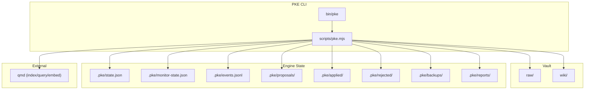
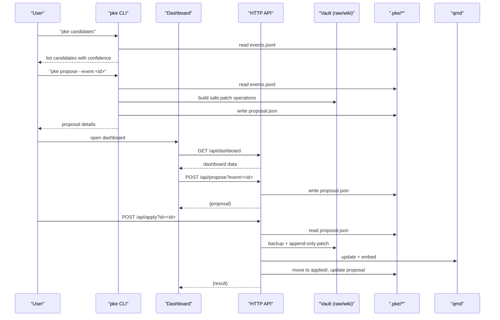
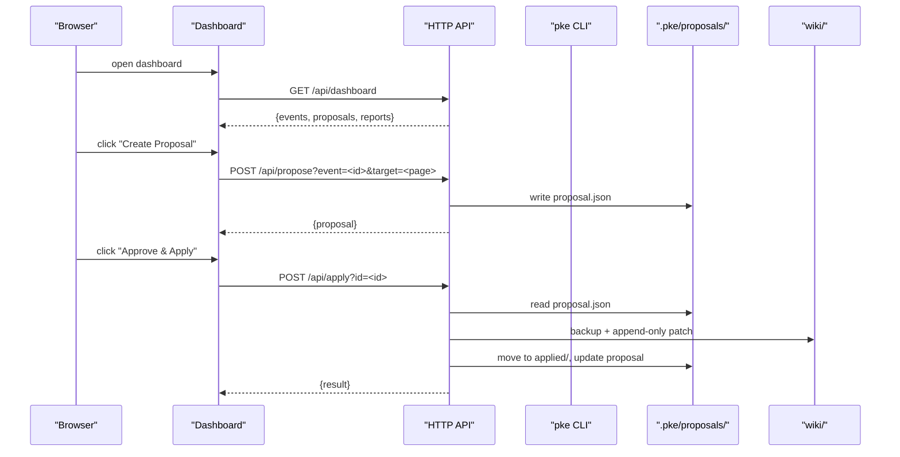
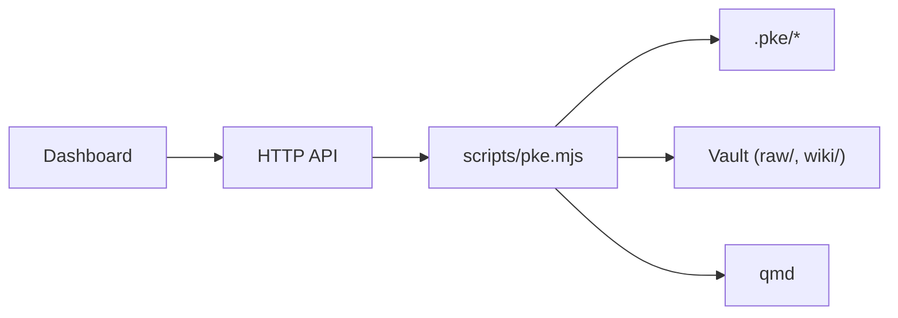

# Approval Workflow and Decision Making

<cite>
**Referenced Files in This Document**
- [README.md](file://README.md)
- [package.json](file://package.json)
- [bin/pke](file://bin/pke)
- [scripts/pke.mjs](file://scripts/pke.mjs)
- [docs/prd.md](file://docs/prd.md)
- [docs/implementation-notes.md](file://docs/implementation-notes.md)
- [docs/agent-workflow.md](file://docs/agent-workflow.md)
- [skills/personal-knowledge-engine.SKILL.md](file://skills/personal-knowledge-engine.SKILL.md)
- [integrations/qoder/personal-knowledge-engine/SKILL.md](file://integrations/qoder/personal-knowledge-engine/SKILL.md)
</cite>

## Table of Contents
1. [Introduction](#introduction)
2. [Project Structure](#project-structure)
3. [Core Components](#core-components)
4. [Architecture Overview](#architecture-overview)
5. [Detailed Component Analysis](#detailed-component-analysis)
6. [Dependency Analysis](#dependency-analysis)
7. [Performance Considerations](#performance-considerations)
8. [Troubleshooting Guide](#troubleshooting-guide)
9. [Conclusion](#conclusion)
10. [Appendices](#appendices)

## Introduction
This document explains the proposal approval workflow and decision-making process for the Personal Knowledge Engine (PKE). It covers the three-tier approval system, the approval interface (CLI, dashboard, and API), safety checks, approval history tracking, acceptance rate analysis, and how historical data influences future confidence adjustments. It also provides decision matrices and examples of approval scenarios.

## Project Structure
The PKE MVP is a local-first knowledge workflow with a CLI and a lightweight dashboard. Approval-related capabilities are implemented in the CLI and exposed via a simple HTTP API for the dashboard.

**Diagram sources**
- [bin/pke](file://bin/pke)
- [scripts/pke.mjs](file://scripts/pke.mjs)
- [docs/implementation-notes.md](file://docs/implementation-notes.md)

**Section sources**
- [README.md](file://README.md)
- [package.json](file://package.json)
- [bin/pke](file://bin/pke)
- [scripts/pke.mjs](file://scripts/pke.mjs)
- [docs/implementation-notes.md](file://docs/implementation-notes.md)

## Core Components
- CLI entrypoint and commands for approval and governance
- Approval pipeline: candidates → propose → proposals → apply/reject
- Dashboard with approval controls and API endpoints
- Safety checks: append-only patching, section validation, confidence thresholds
- Historical tracking: acceptance rates, confidence adjustments, usage reports

**Section sources**
- [README.md](file://README.md)
- [scripts/pke.mjs](file://scripts/pke.mjs)
- [docs/prd.md](file://docs/prd.md)
- [docs/implementation-notes.md](file://docs/implementation-notes.md)

## Architecture Overview
The approval architecture centers on an approval-gated pipeline that generates proposals from monitor events and wiki changes, then requires explicit user approval before applying patches.

**Diagram sources**
- [scripts/pke.mjs](file://scripts/pke.mjs)
- [docs/implementation-notes.md](file://docs/implementation-notes.md)

## Detailed Component Analysis

### Three-Tier Approval System
- Individual proposal approval: create a proposal from a monitor event or raw file, review the exact patch, then apply or reject.
- Batch safe approval: automatically apply only safe, high-confidence append-only proposals in bulk.
- Automatic application for safe proposals: a fast-path for high-confidence, append-only proposals that pass safety checks.

Key behaviors:
- Safe append-only proposals are limited to Evidence, Open Questions, and Related Pages sections.
- High confidence is required for batch eligibility.
- All approvals require explicit user action or automated safety gating.

**Section sources**
- [scripts/pke.mjs](file://scripts/pke.mjs)
- [docs/prd.md](file://docs/prd.md)

### Approval Interface
- CLI commands
  - List candidates: pke candidates
  - Create proposal: pke propose --event <id> or pke propose --path <file> --target <wiki-page>
  - List proposals: pke proposals
  - Show proposal: pke proposal <id>
  - Apply proposal: pke apply <id> or pke apply --batch-safe
  - Reject proposal: pke reject <id>
- Dashboard
  - Browse candidates and proposals
  - Create, approve, and reject proposals directly from the UI
  - Trigger scans and auto-refresh for scoped paths
- API endpoints
  - GET /api/dashboard
  - POST /api/scan
  - POST /api/propose?event=<id>&target=<wiki-page>
  - POST /api/apply?id=<id>
  - POST /api/reject?id=<id>

**Section sources**
- [README.md](file://README.md)
- [scripts/pke.mjs](file://scripts/pke.mjs)
- [docs/implementation-notes.md](file://docs/implementation-notes.md)

### Safety Checks
- Confidence thresholds
  - Base confidence is computed per candidate; acceptance history adjusts confidence.
  - High confidence is required for batch-safe approval.
- Section validation
  - Only append-to-section operations are allowed in MVP.
  - Operations target safe sections: Evidence, Open Questions, Related Pages.
- Append-only verification
  - Patches are applied by appending content to sections; duplicates are avoided.
  - Backups are created before applying patches.

**Section sources**
- [scripts/pke.mjs](file://scripts/pke.mjs)
- [docs/prd.md](file://docs/prd.md)

### Approval History Tracking and Confidence Adjustment
- Historical acceptance rates
  - Tracks applied vs rejected proposals by event type.
  - Computes overall and per-event-type acceptance rates.
- Confidence adjustment
  - Adjusts candidate confidence based on historical acceptance rate.
  - Uses a multiplicative adjustment in the 80–120% range.
- Usage reports
  - Provides compile velocity, top topics, and acceptance rates over a time window.

**Section sources**
- [scripts/pke.mjs](file://scripts/pke.mjs)
- [docs/implementation-notes.md](file://docs/implementation-notes.md)

### Decision Matrix for Proposal Processing
- Candidate creation
  - Raw evidence added/modified → propose Evidence and Open Questions entries.
  - Conflict detected → propose Conflicts / Evolution entry.
  - Stale claim detected → propose Stale Or Risky Claims entry.
  - Open question added → propose Open Questions entry.
  - Conclusion changed → propose Current Understanding update.
- Target page suggestion
  - Direct wiki match, linked page, or heuristic (e.g., AI/LLM topics).
- Safety gating
  - High confidence required for batch-safe approval.
  - Only append-only operations are permitted.

**Section sources**
- [scripts/pke.mjs](file://scripts/pke.mjs)
- [docs/prd.md](file://docs/prd.md)

### Examples of Approval Scenarios
- Scenario A: Raw evidence added
  - Action: Create proposal with Evidence and Open Questions entries.
  - Approval: Apply to promote durable knowledge; reject if premature.
- Scenario B: Conflict detected
  - Action: Create proposal with Conflicts / Evolution entry.
  - Approval: Apply to record evolution; reject if not applicable.
- Scenario C: Stale claim detected
  - Action: Create proposal with Stale Or Risky Claims entry.
  - Approval: Apply to flag risk; reject if claim is still valid.
- Scenario D: Open question added
  - Action: Create proposal with Open Questions entry.
  - Approval: Apply to track; reject if not actionable.
- Scenario E: Conclusion changed
  - Action: Create proposal with Current Understanding update.
  - Approval: Apply to reflect new understanding; reject if not durable.

**Section sources**
- [scripts/pke.mjs](file://scripts/pke.mjs)
- [docs/prd.md](file://docs/prd.md)

### API Workflow Sequence

**Diagram sources**
- [scripts/pke.mjs](file://scripts/pke.mjs)

## Dependency Analysis
- CLI depends on Node.js and qmd for indexing and retrieval.
- Approval artifacts (.pke/*) persist state and proposals.
- Dashboard depends on CLI’s API endpoints and local artifacts.

**Diagram sources**
- [scripts/pke.mjs](file://scripts/pke.mjs)
- [docs/implementation-notes.md](file://docs/implementation-notes.md)

**Section sources**
- [package.json](file://package.json)
- [scripts/pke.mjs](file://scripts/pke.mjs)
- [docs/implementation-notes.md](file://docs/implementation-notes.md)

## Performance Considerations
- Scoped monitoring avoids watching the entire vault; uses polling for cross-platform reliability.
- Event log rotation caps growth; reports retention archives older content.
- Rate limits and priority filters reduce proposal overload (e.g., daily proposal cap).
- Batch-safe approval reduces manual overhead while maintaining safety.

[No sources needed since this section provides general guidance]

## Troubleshooting Guide
Common issues and resolutions:
- Proposal not found
  - Ensure the proposal ID exists and is readable.
- Target page missing
  - Verify the target wiki page exists before applying.
- Not pending
  - Only pending proposals can be applied; rejected or applied proposals cannot be reapplied.
- Oversized files
  - Files larger than 10 MB are skipped; reduce file size or split content.
- qmd refresh failures
  - Patches still apply; failures are recorded in the proposal change report.

**Section sources**
- [scripts/pke.mjs](file://scripts/pke.mjs)
- [docs/implementation-notes.md](file://docs/implementation-notes.md)

## Conclusion
The PKE approval workflow enforces a strict, approval-gated pipeline for knowledge updates. It combines human oversight with automated safety checks and historical feedback to improve confidence and reduce risk. The CLI, dashboard, and API provide flexible interfaces for managing proposals, while append-only patching and section validation ensure wiki integrity.

[No sources needed since this section summarizes without analyzing specific files]

## Appendices

### Appendix A: CLI Commands for Approval
- pke candidates
- pke propose --event <id> [--target <wiki-page>]
- pke propose --path <file> [--target <wiki-page>]
- pke proposals
- pke proposal <id>
- pke apply <id>
- pke apply --batch-safe [<id>]
- pke reject <id>

**Section sources**
- [README.md](file://README.md)
- [scripts/pke.mjs](file://scripts/pke.mjs)

### Appendix B: Dashboard Controls
- Browse candidates and proposals
- Create, approve, and reject proposals
- Trigger scans and auto-refresh for scoped paths

**Section sources**
- [scripts/pke.mjs](file://scripts/pke.mjs)
- [docs/implementation-notes.md](file://docs/implementation-notes.md)

### Appendix C: Safety and Governance References
- Raw files are evidence; wiki updates require explicit approval.
- Section-based semantic classification drives proposal creation.
- Append-only patching and backups protect wiki integrity.

**Section sources**
- [docs/prd.md](file://docs/prd.md)
- [docs/agent-workflow.md](file://docs/agent-workflow.md)
- [skills/personal-knowledge-engine.SKILL.md](file://skills/personal-knowledge-engine.SKILL.md)
- [integrations/qoder/personal-knowledge-engine/SKILL.md](file://integrations/qoder/personal-knowledge-engine/SKILL.md)