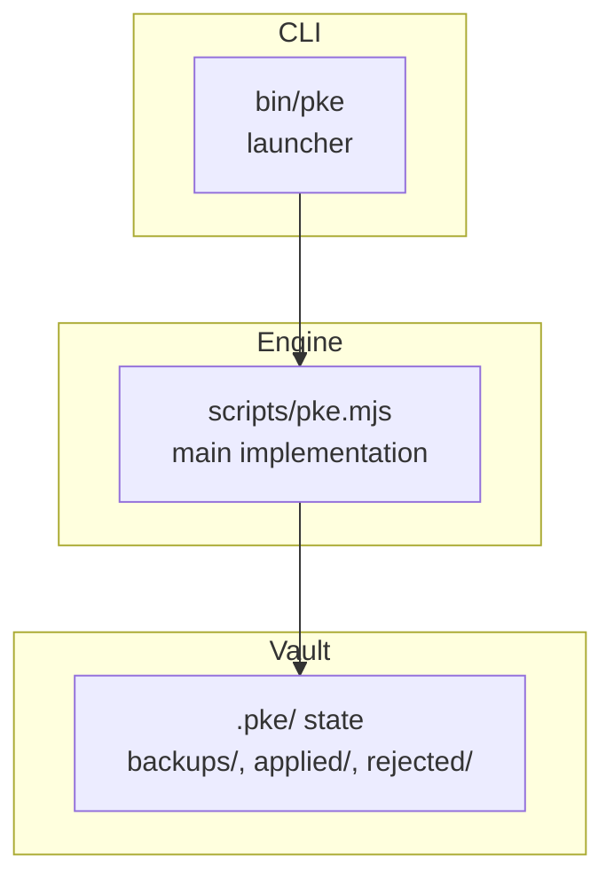
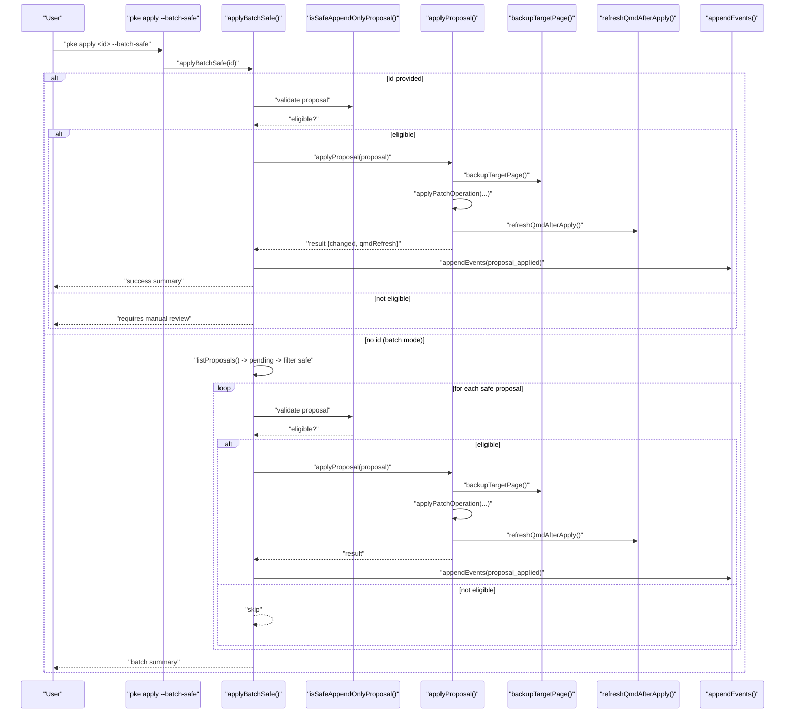
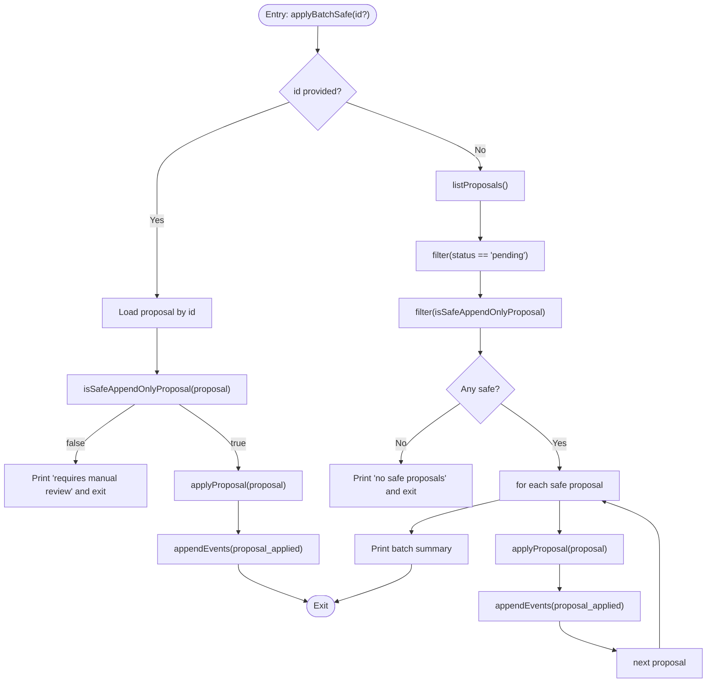
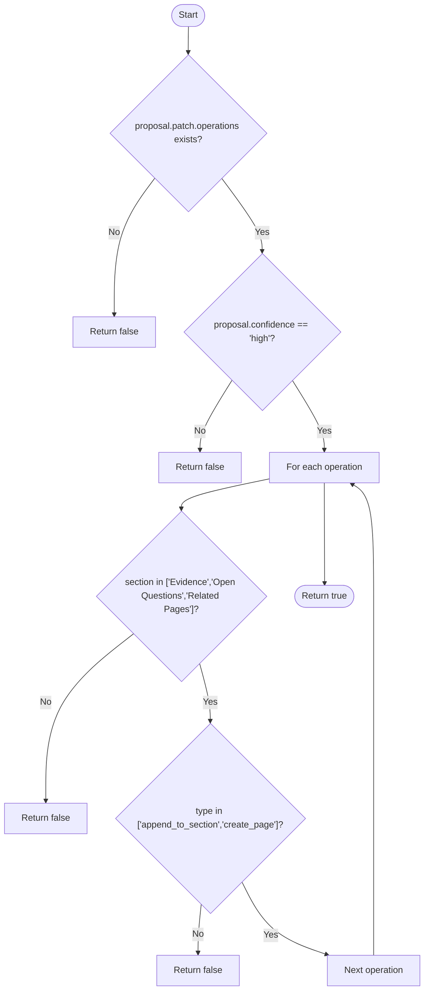
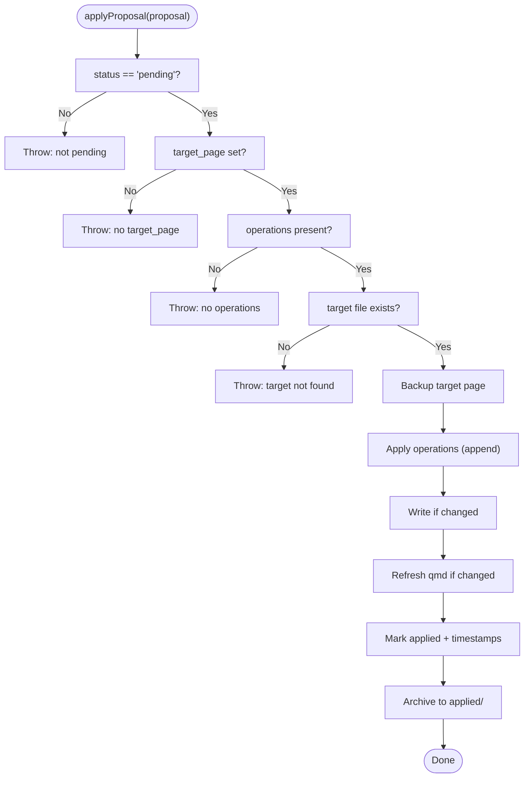
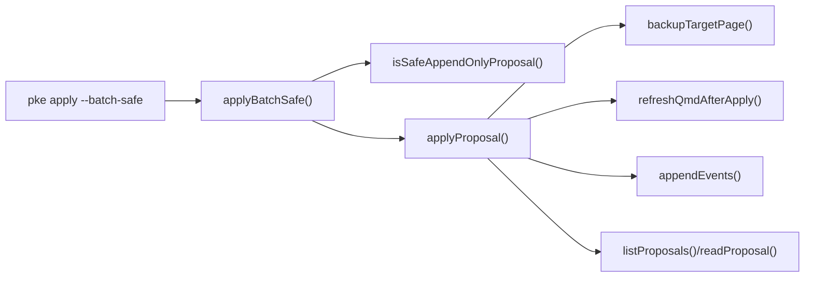

# Batch Safe Approval

<cite>
**Referenced Files in This Document**
- [pke.mjs](file://scripts/pke.mjs)
- [README.md](file://README.md)
- [package.json](file://package.json)
- [bin/pke](file://bin/pke)
- [prd.md](file://docs/prd.md)
</cite>

## Table of Contents
1. [Introduction](#introduction)
2. [Project Structure](#project-structure)
3. [Core Components](#core-components)
4. [Architecture Overview](#architecture-overview)
5. [Detailed Component Analysis](#detailed-component-analysis)
6. [Dependency Analysis](#dependency-analysis)
7. [Performance Considerations](#performance-considerations)
8. [Troubleshooting Guide](#troubleshooting-guide)
9. [Conclusion](#conclusion)

## Introduction
This document explains the batch safe approval functionality for the Personal Knowledge Engine (PKE). It focuses on the applyBatchSafe workflow, eligibility criteria for automatic approval, safety checks, and the fast-path approval mechanism. It also covers automatic backup creation, post-apply qmd reindexing, audit trail maintenance, and practical scenarios and performance benefits.

## Project Structure
The PKE CLI is implemented as a single script with a thin launcher wrapper. The relevant components for batch safe approval live in the main script and are invoked via the CLI entry point.

**Diagram sources**
- [bin/pke:1-10](file://bin/pke#L1-L10)
- [pke.mjs:48-96](file://scripts/pke.mjs#L48-L96)

**Section sources**
- [package.json:7-9](file://package.json#L7-L9)
- [bin/pke:1-10](file://bin/pke#L1-L10)
- [pke.mjs:48-96](file://scripts/pke.mjs#L48-L96)

## Core Components
- applyBatchSafe: Orchestrates fast-path approval for either a single proposal or all eligible pending proposals.
- isSafeAppendOnlyProposal: Enforces eligibility criteria for batch approval.
- applyProposal: Performs the actual write, backup, and qmd refresh steps.
- appendEvents: Maintains audit trail for applied proposals.
- backupTargetPage: Creates automatic backups prior to applying changes.
- refreshQmdAfterApply: Runs qmd update and embed after successful changes.

**Section sources**
- [pke.mjs:602-660](file://scripts/pke.mjs#L602-L660)
- [pke.mjs:1603-1632](file://scripts/pke.mjs#L1603-L1632)
- [pke.mjs:1635-1641](file://scripts/pke.mjs#L1635-L1641)
- [pke.mjs:1660-1665](file://scripts/pke.mjs#L1660-L1665)
- [pke.mjs:1390-1394](file://scripts/pke.mjs#L1390-L1394)

## Architecture Overview
The batch safe approval pipeline is a controlled, append-only workflow that applies only safe, pre-approved patches without rewriting sensitive sections.

**Diagram sources**
- [pke.mjs:602-660](file://scripts/pke.mjs#L602-L660)
- [pke.mjs:1603-1632](file://scripts/pke.mjs#L1603-L1632)
- [pke.mjs:1635-1641](file://scripts/pke.mjs#L1635-L1641)
- [pke.mjs:1660-1665](file://scripts/pke.mjs#L1660-L1665)
- [pke.mjs:1390-1394](file://scripts/pke.mjs#L1390-L1394)

## Detailed Component Analysis

### applyBatchSafe: Fast-path batch approval
- Single-proposal mode: Validates eligibility, applies immediately, logs audit event, prints summary.
- Batch mode: Filters pending proposals, selects only those meeting eligibility, applies each, aggregates results, and logs audit events per application.

**Diagram sources**
- [pke.mjs:612-660](file://scripts/pke.mjs#L612-L660)

**Section sources**
- [pke.mjs:612-660](file://scripts/pke.mjs#L612-L660)

### Eligibility Criteria: isSafeAppendOnlyProposal
A proposal qualifies for batch safe approval if:
- It has a non-empty patch with operations.
- Its confidence is "high".
- Every patch operation targets a safe section and uses an append-only operation type:
  - Safe sections: Evidence, Open Questions, Related Pages
  - Operation types: append_to_section, create_page

**Diagram sources**
- [pke.mjs:602-610](file://scripts/pke.mjs#L602-L610)

**Section sources**
- [pke.mjs:602-610](file://scripts/pke.mjs#L602-L610)

### Safety Checks and Controls
- Confidence threshold: Only proposals marked "high" confidence are considered.
- Section safety: Append-only operations are restricted to Evidence, Open Questions, and Related Pages.
- Idempotency: The append operation avoids duplicating content if it already exists in the target section.
- Validation: applyProposal enforces that the proposal is pending, has a target page, and has operations; it also verifies the target file exists.

**Diagram sources**
- [pke.mjs:1603-1632](file://scripts/pke.mjs#L1603-L1632)

**Section sources**
- [pke.mjs:1603-1632](file://scripts/pke.mjs#L1603-L1632)

### Automatic Backup Creation
- Before applying any changes, the system backs up the target wiki page to $PKE_VAULT/.pke/backups/.
- The backup filename encodes the proposal id and the original path to avoid collisions.

**Section sources**
- [pke.mjs:1603-1632](file://scripts/pke.mjs#L1603-L1632)
- [pke.mjs:1635-1641](file://scripts/pke.mjs#L1635-L1641)

### Bulk qmd Reindexing
- After applying changes, the system attempts to refresh the qmd index by running:
  - qmd update
  - qmd embed -c <collection>
- The results are recorded in the change report for auditing.

**Section sources**
- [pke.mjs:1660-1665](file://scripts/pke.mjs#L1660-L1665)
- [pke.mjs:1603-1632](file://scripts/pke.mjs#L1603-L1632)

### Audit Trail for Batch Operations
- Each applied proposal generates an audit event with type "proposal_applied", including proposal id, target page, and timestamp.
- Events are appended to the events log and subject to rotation policies.

**Section sources**
- [pke.mjs:648](file://scripts/pke.mjs#L648)
- [pke.mjs:1390-1394](file://scripts/pke.mjs#L1390-L1394)

### Examples of Batch Approval Scenarios
- Scenario A: Single safe proposal
  - A proposal targeting Evidence or Open Questions with high confidence is applied immediately with fast-path.
  - Outcome: Backup created, qmd refreshed, audit event logged.
- Scenario B: Batch of safe proposals
  - Multiple pending proposals meeting eligibility are applied in sequence.
  - Outcome: Per-proposal backups and qmd refreshes; batch summary printed; audit events recorded for each.

**Section sources**
- [pke.mjs:612-660](file://scripts/pke.mjs#L612-L660)
- [pke.mjs:1603-1632](file://scripts/pke.mjs#L1603-L1632)
- [pke.mjs:1660-1665](file://scripts/pke.mjs#L1660-L1665)
- [pke.mjs:1390-1394](file://scripts/pke.mjs#L1390-L1394)

### Performance Benefits
- Reduced manual intervention: High-confidence, append-only updates are applied without human review.
- Idempotent appends: Prevent redundant writes and minimize disk churn.
- Batch throughput: Multiple safe proposals can be applied in a single run.
- Post-apply reindexing: Ensures search and retrieval remain consistent after bulk changes.

[No sources needed since this section provides general guidance]

## Dependency Analysis
The batch safe approval relies on internal helpers and state directories. There are no external library dependencies for the CLI.

**Diagram sources**
- [pke.mjs:602-660](file://scripts/pke.mjs#L602-L660)
- [pke.mjs:1603-1632](file://scripts/pke.mjs#L1603-L1632)
- [pke.mjs:1635-1641](file://scripts/pke.mjs#L1635-L1641)
- [pke.mjs:1660-1665](file://scripts/pke.mjs#L1660-L1665)
- [pke.mjs:1390-1394](file://scripts/pke.mjs#L1390-L1394)

**Section sources**
- [pke.mjs:602-660](file://scripts/pke.mjs#L602-L660)
- [pke.mjs:1603-1632](file://scripts/pke.mjs#L1603-L1632)
- [pke.mjs:1635-1641](file://scripts/pke.mjs#L1635-L1641)
- [pke.mjs:1660-1665](file://scripts/pke.mjs#L1660-L1665)
- [pke.mjs:1390-1394](file://scripts/pke.mjs#L1390-L1394)

## Performance Considerations
- Batch mode iterates through pending proposals; keep the number of pending proposals manageable to avoid long loops.
- Each apply performs a filesystem write and optional qmd refresh; consider batching during off-peak hours.
- The append operation is idempotent and efficient; avoid unnecessary proposals to reduce backup volume.

[No sources needed since this section provides general guidance]

## Troubleshooting Guide
- Proposal not eligible for fast-path:
  - Cause: Low confidence or non-append operation outside safe sections.
  - Action: Review proposal and manually approve if appropriate.
- applyProposal errors:
  - Not pending: Ensure the proposal status is pending before applying.
  - No target page or missing file: Recreate the proposal with a valid target.
  - No operations: Recreate the proposal with patch operations.
- qmd failures:
  - The system continues even if qmd refresh fails; check qmd availability and collection configuration.
- Audit gaps:
  - Verify events log rotation and ensure sufficient disk space.

**Section sources**
- [pke.mjs:1603-1632](file://scripts/pke.mjs#L1603-L1632)
- [pke.mjs:1660-1665](file://scripts/pke.mjs#L1660-L1665)
- [pke.mjs:1390-1394](file://scripts/pke.mjs#L1390-L1394)

## Conclusion
Batch safe approval automates the application of high-confidence, append-only updates while preserving safety and transparency. By enforcing strict eligibility criteria, performing automatic backups, and maintaining audit trails, the system enables scalable, low-risk knowledge updates. Operators can apply individual proposals quickly or batch-apply eligible ones for improved throughput, with minimal risk to sensitive sections of the wiki.