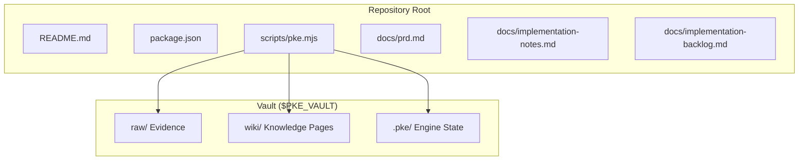
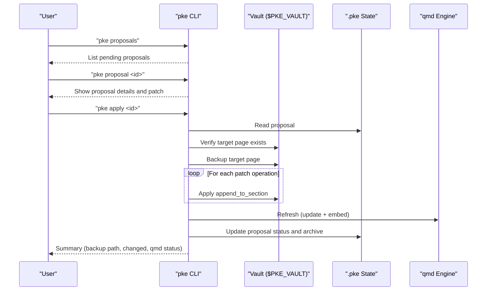
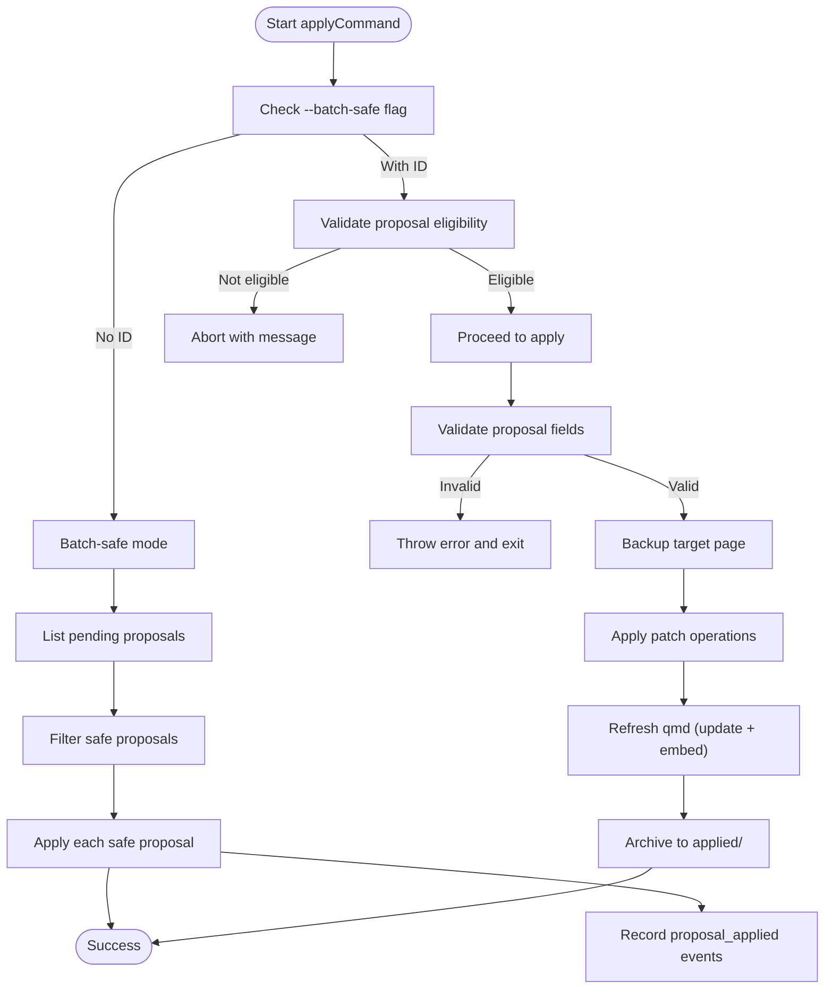
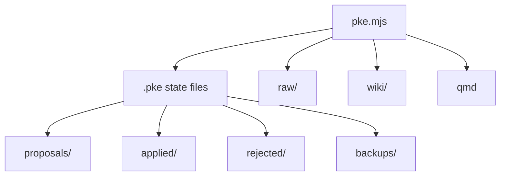

# Individual Proposal Approval

<cite>
**Referenced Files in This Document**
- [README.md](file://README.md)
- [package.json](file://package.json)
- [pke.mjs](file://scripts/pke.mjs)
- [prd.md](file://docs/prd.md)
- [implementation-notes.md](file://docs/implementation-notes.md)
- [implementation-backlog.md](file://docs/implementation-backlog.md)
</cite>

## Table of Contents
1. [Introduction](#introduction)
2. [Project Structure](#project-structure)
3. [Core Components](#core-components)
4. [Architecture Overview](#architecture-overview)
5. [Detailed Component Analysis](#detailed-component-analysis)
6. [Dependency Analysis](#dependency-analysis)
7. [Performance Considerations](#performance-considerations)
8. [Troubleshooting Guide](#troubleshooting-guide)
9. [Conclusion](#conclusion)
10. [Appendices](#appendices)

## Introduction
This document explains the individual proposal approval process in the Personal Knowledge Engine (PKE) MVP. It covers the step-by-step workflow for approving single proposals, including the applyCommand function, manual review process, and exact patch application. It also documents the approval interface (CLI commands, parameter validation, and error handling), safety verification, backup creation, wiki page modification, and qmd reindexing workflow. Finally, it includes examples of successful approvals, common scenarios, and troubleshooting failed approvals.

## Project Structure
The PKE MVP is a local-first knowledge workflow implemented as a Node.js CLI script with a companion documentation set. The CLI orchestrates vault scanning, event monitoring, proposal generation, and approval gating. The documentation defines the product requirements, workflows, and safety model.

**Diagram sources**
- [pke.mjs](file://scripts/pke.mjs)
- [README.md](file://README.md)

**Section sources**
- [README.md](file://README.md)
- [package.json](file://package.json)

## Core Components
- CLI entrypoint and command routing: The CLI parses arguments, resolves options, and dispatches to command handlers. It exposes commands for status, capture, compile, monitor, proposals, and approval.
- Proposal lifecycle: Proposals are created from monitor events or manual inputs, stored in the proposals directory, and later applied or rejected.
- Approval gating: Wiki writes are proposal-only in the MVP; only approved proposals are applied to wiki pages.
- Safety model: Append-only patch operations target safe sections; duplicates are skipped; backups are created before applying; qmd is refreshed after successful application.

**Section sources**
- [pke.mjs](file://scripts/pke.mjs)
- [README.md](file://README.md)
- [implementation-notes.md](file://docs/implementation-notes.md)

## Architecture Overview
The approval workflow is part of the controlled self-improvement loop. Monitor events trigger proposals; users review and approve; approved proposals are applied as append-only patches to wiki pages, with backups and qmd refresh.

**Diagram sources**
- [pke.mjs](file://scripts/pke.mjs)
- [README.md](file://README.md)

## Detailed Component Analysis

### applyCommand: Single Proposal Approval
The applyCommand function validates the proposal, backs up the target wiki page, applies the patch operations, refreshes qmd, and archives the result.

- Parameter validation:
  - If --batch-safe is provided without an ID, it executes a batch-safe approval of all eligible pending proposals.
  - If --batch-safe is provided with an ID, it validates eligibility and applies only if safe.
  - Without --batch-safe, it requires a proposal ID and throws if missing.
- Validation steps:
  - Checks proposal status is pending.
  - Ensures target_page exists.
  - Ensures patch has operations.
- Backup and apply:
  - Creates a backup of the target wiki page before mutation.
  - Iterates operations and applies append_to_section safely.
  - Skips duplicate content idempotently.
- Post-apply:
  - Refreshes qmd (update and embed).
  - Updates proposal status to applied, records timestamps and change report.
  - Archives the proposal to the applied directory.

**Diagram sources**
- [pke.mjs](file://scripts/pke.mjs)

**Section sources**
- [pke.mjs](file://scripts/pke.mjs)

### Manual Review Process
Before applying, users can:
- List proposals: pke proposals
- Inspect a specific proposal: pke proposal <id>
- Create proposals from events or raw files: pke propose --event <id> or pke propose --path <raw-file> [--target <wiki-page>]
- Reject proposals: pke reject <id>

The proposal JSON includes:
- id, createdAt, status, trigger, source_event_ids, source_files, target_page, reason, confidence, detected_signals, and patch with operations.

**Section sources**
- [pke.mjs](file://scripts/pke.mjs)
- [README.md](file://README.md)

### Exact Patch Application
- Patch operations are append-only and target safe sections:
  - Evidence, Open Questions, Conflicts / Evolution, Stale Or Risky Claims.
- Operations include:
  - type: append_to_section
  - section: target wiki section
  - content: markdown text to append
- Idempotency:
  - applyPatchOperation skips if content already exists in the target page.
- Section insertion:
  - If the section exists, content is appended before the next section header.
  - If the section does not exist, it is created with a new header and content.

**Section sources**
- [pke.mjs](file://scripts/pke.mjs)
- [implementation-notes.md](file://docs/implementation-notes.md)

### Approval Interface: CLI Commands, Parameters, and Validation
- pke apply <proposal-id>
  - Validates presence of proposal-id.
  - Validates proposal status is pending.
  - Validates target_page exists.
  - Validates patch operations exist.
  - Throws descriptive errors for invalid states.
- pke apply --batch-safe
  - Without ID: applies all safe, pending proposals.
  - With ID: applies only if the proposal is eligible for fast-path.
- pke reject <proposal-id>
  - Marks status as rejected and archives to rejected/.
- pke proposal <id>
  - Displays proposal details including patch operations.
- pke proposals
  - Lists proposals with optional status filter.

Parameter validation highlights:
- Missing proposal-id: usage error.
- Non-pending status: error indicating proposal must be pending.
- Missing target_page: error instructing to recreate with --target.
- Missing operations: error instructing to recreate proposal.
- Missing target wiki page: error indicating page not found.

**Section sources**
- [pke.mjs](file://scripts/pke.mjs)
- [README.md](file://README.md)

### Safety Verification
- Confidence threshold checks:
  - isSafeAppendOnlyProposal enforces high confidence and safe sections.
  - Eligibility for fast-path: only high-confidence proposals targeting Evidence, Open Questions, or Related Pages are eligible.
- Section validation:
  - Only append_to_section operations are supported in MVP.
  - Section existence is handled; missing sections are created.
- Append-only verification:
  - applyPatchOperation checks for duplicate content and skips if present.
  - This prevents accidental duplication and maintains idempotency.

**Section sources**
- [pke.mjs](file://scripts/pke.mjs)

### Backup Creation, Wiki Modification, and qmd Reindexing
- Backup:
  - backupTargetPage copies the target wiki page to .pke/backups/ with a naming scheme including the proposal ID and sanitized path.
- Wiki modification:
  - applyProposal reads the target page, applies operations, and writes only if changes occurred.
- qmd refresh:
  - refreshQmdAfterApply runs qmd update and qmd embed -c <collection>.
  - Failure is recorded in the proposal change report; wiki patch remains applied.

**Section sources**
- [pke.mjs](file://scripts/pke.mjs)
- [implementation-notes.md](file://docs/implementation-notes.md)

### Examples and Common Scenarios
- Successful approval:
  - User runs pke proposals, selects a pending proposal, runs pke apply <id>, and receives a summary including backup path, changed flag, and qmd refresh status.
- Fast-path approval:
  - User runs pke apply --batch-safe to approve all eligible pending proposals in one go.
- Rejection:
  - User runs pke reject <id>; the proposal is archived to .pke/rejected/ with rejectedAt timestamp.
- Manual proposal:
  - User runs pke propose --event <id> [--target <wiki-page>] to create a proposal, then reviews and applies it.

**Section sources**
- [README.md](file://README.md)
- [pke.mjs](file://scripts/pke.mjs)

## Dependency Analysis
The approval workflow depends on:
- Vault layout: raw/, wiki/, .pke/ directories.
- State files: state.json, monitor-state.json, events.jsonl, reports/.
- Proposal storage: .pke/proposals/, .pke/applied/, .pke/rejected/, .pke/backups/.

**Diagram sources**
- [pke.mjs](file://scripts/pke.mjs)
- [implementation-notes.md](file://docs/implementation-notes.md)

**Section sources**
- [pke.mjs](file://scripts/pke.mjs)
- [implementation-notes.md](file://docs/implementation-notes.md)

## Performance Considerations
- Append-only operations minimize write overhead.
- Idempotent application avoids unnecessary disk writes.
- qmd refresh occurs only after successful application to reduce wasted computation.
- Batch-safe approval reduces manual intervention for eligible proposals.

[No sources needed since this section provides general guidance]

## Troubleshooting Guide
Common issues and resolutions:
- Proposal not found:
  - Ensure the proposal ID exists in .pke/proposals/.
- Proposal not pending:
  - Only pending proposals can be applied; check status and re-propose if needed.
- Target page missing:
  - Recreate the proposal with --target <wiki-page> or ensure the page exists.
- No patch operations:
  - Recreate the proposal; ensure a target page and detected signals exist.
- qmd refresh failures:
  - The wiki patch is still applied; check qmd status and rerun refresh manually.
- Fast-path eligibility:
  - Only high-confidence proposals targeting safe sections qualify for --batch-safe.

**Section sources**
- [pke.mjs](file://scripts/pke.mjs)
- [implementation-notes.md](file://docs/implementation-notes.md)

## Conclusion
The individual proposal approval process in PKE is designed to be safe, transparent, and auditable. Proposals are generated from monitor events or manual inputs, reviewed by users, and applied as append-only patches to wiki pages with backups and qmd refresh. The CLI enforces validation and error handling, while the fast-path approval streamlines safe, high-confidence updates.

[No sources needed since this section summarizes without analyzing specific files]

## Appendices

### Appendix A: CLI Command Reference for Approval
- pke apply <proposal-id>: Apply a single proposal with validation and backup.
- pke apply --batch-safe: Apply eligible proposals in batch or approve a specific one if eligible.
- pke reject <proposal-id>: Reject and archive a proposal.
- pke proposals [--status <status>]: List proposals with optional status filter.
- pke proposal <id>: Show proposal details including patch operations.

**Section sources**
- [README.md](file://README.md)
- [pke.mjs](file://scripts/pke.mjs)