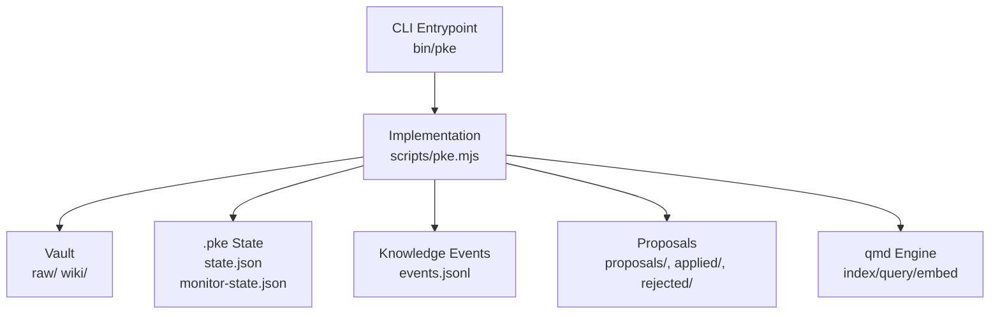
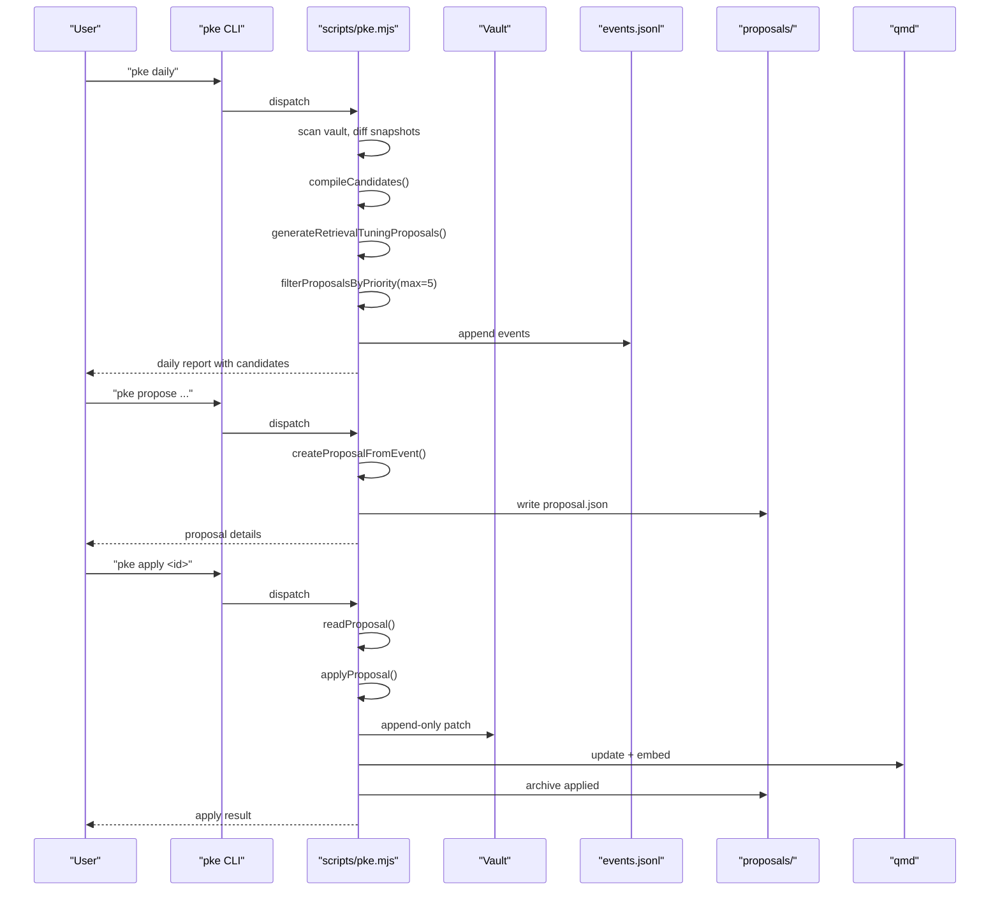
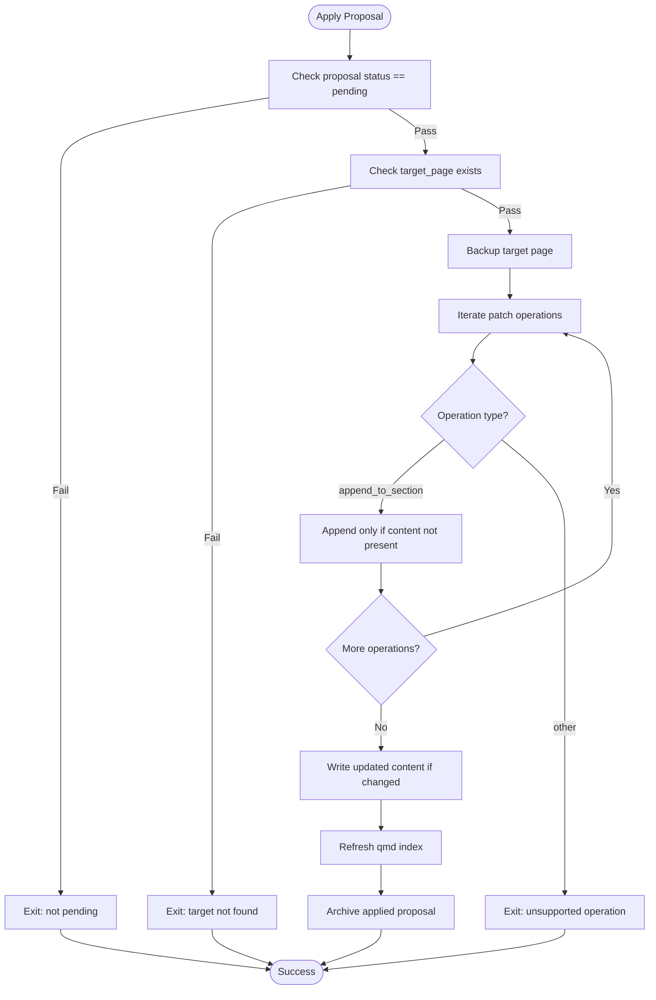
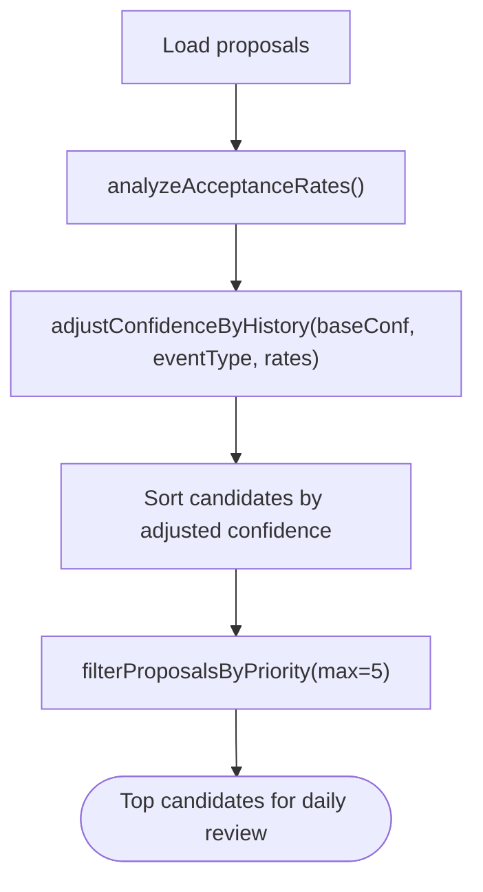
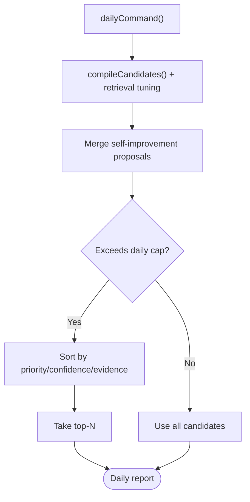
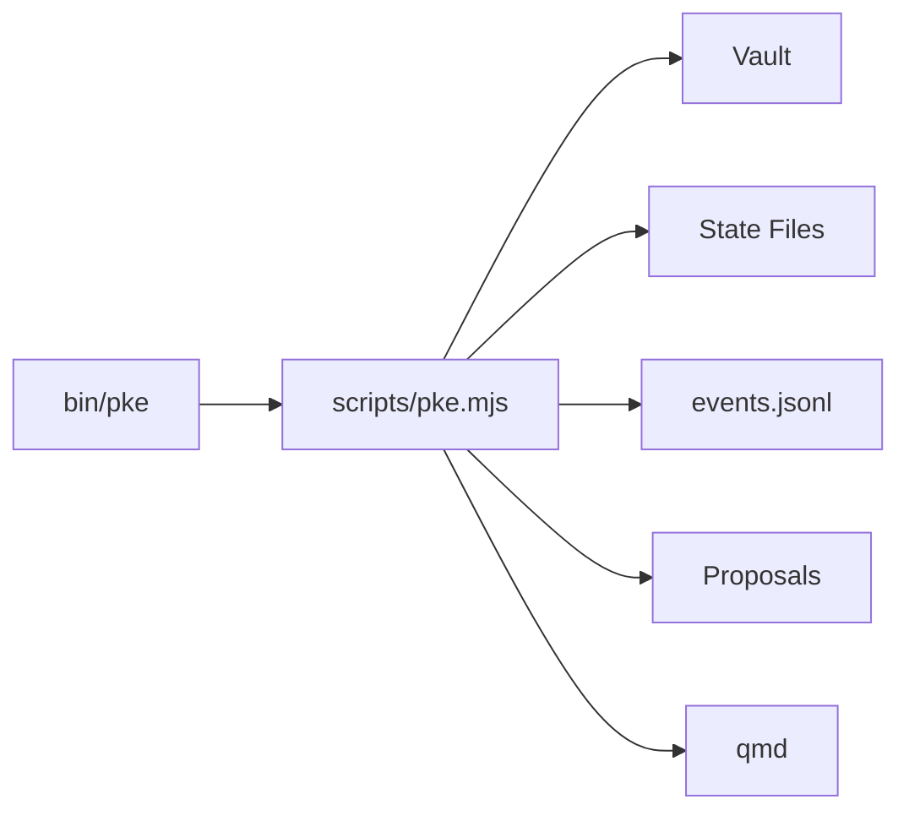

# Safety Controls and Rate Limits

<cite>
**Referenced Files in This Document**
- [README.md](file://README.md)
- [package.json](file://package.json)
- [bin/pke](file://bin/pke)
- [scripts/pke.mjs](file://scripts/pke.mjs)
- [docs/prd.md](file://docs/prd.md)
- [docs/implementation-notes.md](file://docs/implementation-notes.md)
- [docs/implementation-backlog.md](file://docs/implementation-backlog.md)
</cite>

## Table of Contents
1. [Introduction](#introduction)
2. [Project Structure](#project-structure)
3. [Core Components](#core-components)
4. [Architecture Overview](#architecture-overview)
5. [Detailed Component Analysis](#detailed-component-analysis)
6. [Dependency Analysis](#dependency-analysis)
7. [Performance Considerations](#performance-considerations)
8. [Troubleshooting Guide](#troubleshooting-guide)
9. [Conclusion](#conclusion)

## Introduction
This document explains the safety controls and rate limiting mechanisms that govern the approval workflow in the Personal Knowledge Engine (PKE). It focuses on:
- Confidence-based approval filtering
- Safety section validation and append-only verification
- Rate limiting for daily proposals, candidate queues, and pending proposals
- Acceptance rate analysis and its influence on confidence adjustments
- Examples of safety checks, rate limit scenarios, and how the system prevents unsafe mass approvals
- The balance between automation and safety

## Project Structure
The PKE MVP is a CLI-driven system operating on local files with a clear separation between evidence capture, knowledge compilation, and approval-gated writing. The CLI entrypoint routes commands to a single implementation module that orchestrates vault scanning, event detection, proposal generation, and approval workflows.

**Diagram sources**
- [bin/pke:1-10](file://bin/pke#L1-L10)
- [scripts/pke.mjs:1-33](file://scripts/pke.mjs#L1-L33)

**Section sources**
- [README.md:56-80](file://README.md#L56-L80)
- [package.json:7-9](file://package.json#L7-L9)

## Core Components
- Evidence capture and storage: raw files are preserved as immutable evidence.
- Knowledge pages: structured 7-section wiki pages with YAML front matter.
- Monitor and event classification: detects knowledge events and writes them to an append-only log.
- Proposal workflow: compile candidates become proposals with exact, append-only patch operations.
- Approval gating: wiki writes occur only after explicit user approval.
- Safety validation: 7-section template compliance and append-only verification.
- Rate limiting: daily proposal caps, candidate queue limits, and pending proposal caps.
- Confidence adjustment: acceptance rate analysis influences proposal confidence ordering.

**Section sources**
- [docs/prd.md:428-696](file://docs/prd.md#L428-L696)
- [docs/implementation-notes.md:18-113](file://docs/implementation-notes.md#L18-L113)
- [docs/implementation-backlog.md:145-163](file://docs/implementation-backlog.md#L145-L163)

## Architecture Overview
The approval workflow is approval-gated and append-only. The system:
- Scans the vault and detects changes
- Emits knowledge events
- Builds compile candidates and proposals
- Enforces rate limits and confidence adjustments
- Requires explicit approval before applying patches
- Verifies safety constraints (template compliance, append-only operations)

**Diagram sources**
- [scripts/pke.mjs:221-285](file://scripts/pke.mjs#L221-L285)
- [scripts/pke.mjs:549-560](file://scripts/pke.mjs#L549-L560)
- [scripts/pke.mjs:1454-1481](file://scripts/pke.mjs#L1454-L1481)
- [scripts/pke.mjs:1603-1633](file://scripts/pke.mjs#L1603-L1633)

## Detailed Component Analysis

### Safety Controls and Validation
- 7-section template compliance: The system validates that wiki pages include all required sections and tracks compliance counts.
- Append-only verification: Patches are constructed to append content to safe sections only. The apply step checks for duplicate content and inserts only when needed.
- Target page existence: Application requires the target wiki page to exist before applying a patch.
- Backup and audit: Before applying, the system backs up the target page and records a change report with SHA-256 checksums and qmd refresh status.

**Diagram sources**
- [scripts/pke.mjs:1603-1633](file://scripts/pke.mjs#L1603-L1633)
- [scripts/pke.mjs:1643-1658](file://scripts/pke.mjs#L1643-L1658)

**Section sources**
- [docs/prd.md:456-507](file://docs/prd.md#L456-L507)
- [docs/implementation-notes.md:18-30](file://docs/implementation-notes.md#L18-L30)
- [scripts/pke.mjs:1603-1633](file://scripts/pke.mjs#L1603-L1633)

### Confidence-Based Approval Filtering
- Base confidence: Proposals carry a confidence level (high/medium/low).
- Historical adjustment: Confidence is adjusted based on acceptance rates by event type and overall rate.
- Ordering: Candidates are sorted by adjusted confidence (highest first) before rate limiting.

**Diagram sources**
- [scripts/pke.mjs:930-967](file://scripts/pke.mjs#L930-L967)
- [scripts/pke.mjs:973-979](file://scripts/pke.mjs#L973-L979)
- [scripts/pke.mjs:1140-1151](file://scripts/pke.mjs#L1140-L1151)

**Section sources**
- [docs/implementation-backlog.md:145-163](file://docs/implementation-backlog.md#L145-L163)
- [scripts/pke.mjs:508-547](file://scripts/pke.mjs#L508-L547)
- [scripts/pke.mjs:930-967](file://scripts/pke.mjs#L930-L967)
- [scripts/pke.mjs:973-979](file://scripts/pke.mjs#L973-L979)

### Rate Limiting System
- Daily proposal limit: The daily compilation caps the number of proposals to a fixed maximum and prioritizes by confidence and evidence strength.
- Candidate queue cap and expiry: The candidate queue is capped and pruned by age.
- Pending proposal cap: A hard cap on pending proposals triggers a warning when exceeded.
- Event log rotation: Prevents unbounded growth of the event log.

**Diagram sources**
- [scripts/pke.mjs:221-285](file://scripts/pke.mjs#L221-L285)
- [scripts/pke.mjs:1140-1151](file://scripts/pke.mjs#L1140-L1151)

**Section sources**
- [scripts/pke.mjs:226-233](file://scripts/pke.mjs#L226-L233)
- [scripts/pke.mjs:509-517](file://scripts/pke.mjs#L509-L517)
- [scripts/pke.mjs:1560-1567](file://scripts/pke.mjs#L1560-L1567)
- [scripts/pke.mjs:1396-1410](file://scripts/pke.mjs#L1396-L1410)

### Safety Thresholds and Automatic Eligibility
- Proposal-only mode: All commands remain proposal-only until explicit approval.
- Append-only patches: Only safe sections are targeted; no rewriting of sensitive sections occurs without approval.
- Template compliance: Ensures wiki pages follow the required structure before and after changes.
- Section-level classification: Events are mapped to specific wiki sections to drive appropriate patch operations.

**Section sources**
- [docs/prd.md:198-200](file://docs/prd.md#L198-L200)
- [docs/implementation-notes.md:18-30](file://docs/implementation-notes.md#L18-L30)
- [scripts/pke.mjs:1355-1362](file://scripts/pke.mjs#L1355-L1362)

### Examples of Safety Checks and Rate Limit Scenarios
- Safety check example: Applying a proposal fails if the target page does not exist or the proposal is not pending.
- Safety check example: Append-only verification prevents duplicate content insertion.
- Rate limit scenario: If daily compilation generates more candidates than allowed, only the highest-priority subset is shown.
- Rate limit scenario: If the number of pending proposals exceeds the cap, a warning is printed advising review of older proposals.

**Section sources**
- [scripts/pke.mjs:1603-1609](file://scripts/pke.mjs#L1603-L1609)
- [scripts/pke.mjs:1643-1646](file://scripts/pke.mjs#L1643-L1646)
- [scripts/pke.mjs:226-233](file://scripts/pke.mjs#L226-L233)
- [scripts/pke.mjs:1560-1567](file://scripts/pke.mjs#L1560-L1567)

### Prevention of Unsafe Mass Approvals
- Approval gate: Wiki writes are gated behind explicit user approval.
- Batch-safe mode: A dedicated flag supports a safer batch approval path when desired.
- Audit trail: Backups, change reports, and qmd refresh status are recorded for every application.
- Event-driven cadence: Daily compilation and candidate curation reduce the volume of changes requiring review.

**Section sources**
- [README.md:185-211](file://README.md#L185-L211)
- [scripts/pke.mjs:586-589](file://scripts/pke.mjs#L586-L589)
- [scripts/pke.mjs:1603-1633](file://scripts/pke.mjs#L1603-L1633)

### Balance Between Automation and Safety
- Automation: The system automates detection, candidate generation, and confidence adjustment based on historical acceptance rates.
- Safety: All changes remain proposal-only until approval; append-only operations protect sensitive sections; strict validation and auditing are enforced.
- Governance: Clear principles and constraints ensure that retrieval does not trigger writes and that compile requires a definite update clue.

**Section sources**
- [docs/prd.md:131-142](file://docs/prd.md#L131-L142)
- [docs/implementation-backlog.md:145-163](file://docs/implementation-backlog.md#L145-L163)

## Dependency Analysis
The CLI depends on a single implementation module that encapsulates all logic for scanning, event classification, proposal creation, and application. The implementation interacts with the vault, state files, event log, and qmd.

**Diagram sources**
- [bin/pke:1-10](file://bin/pke#L1-L10)
- [scripts/pke.mjs:1-33](file://scripts/pke.mjs#L1-L33)

**Section sources**
- [bin/pke:1-10](file://bin/pke#L1-L10)
- [scripts/pke.mjs:1-33](file://scripts/pke.mjs#L1-L33)

## Performance Considerations
- Event log rotation prevents excessive disk usage and maintains query performance on the event log.
- Candidate queue caps and expiry ensure bounded memory and processing overhead.
- Pending proposal caps prevent accumulation of unattended work.
- The daily cap reduces the cognitive load on reviewers while preserving high-confidence candidates.

[No sources needed since this section provides general guidance]

## Troubleshooting Guide
- Proposal not found: Ensure the proposal ID exists and is readable.
- Target page missing: Verify the target wiki page exists before applying.
- Proposal not pending: Only pending proposals can be applied; re-create or review status.
- Pending cap exceeded: Review and act on older proposals to reduce the count.
- Event log growth: The system rotates the event log when it exceeds the configured cap.

**Section sources**
- [scripts/pke.mjs:1569-1573](file://scripts/pke.mjs#L1569-L1573)
- [scripts/pke.mjs:1603-1609](file://scripts/pke.mjs#L1603-L1609)
- [scripts/pke.mjs:1560-1567](file://scripts/pke.mjs#L1560-L1567)
- [scripts/pke.mjs:1396-1410](file://scripts/pke.mjs#L1396-L1410)

## Conclusion
The PKE approval workflow balances automation and safety by:
- Keeping all writes proposal-only and under explicit user control
- Enforcing append-only, idempotent patch operations
- Validating template compliance and backing up target pages
- Applying rate limits and confidence adjustments informed by historical acceptance rates
- Providing clear governance principles and observable dashboards

These controls collectively prevent unsafe mass approvals while enabling efficient, evidence-driven knowledge synthesis.