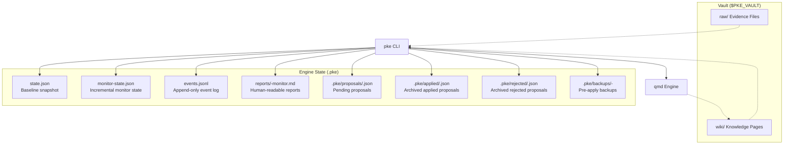
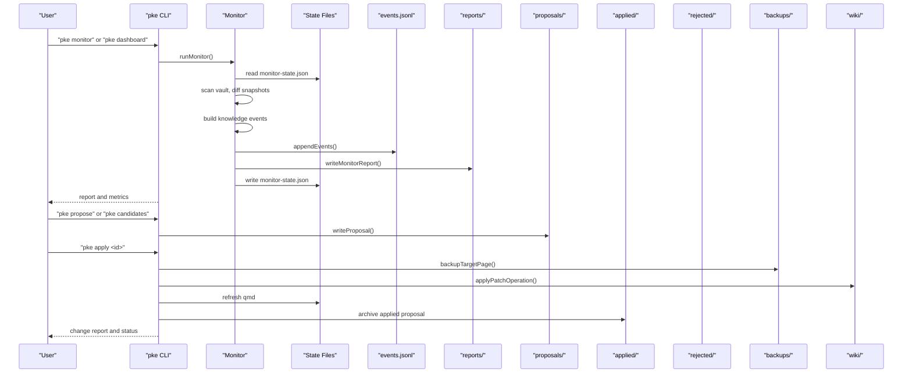
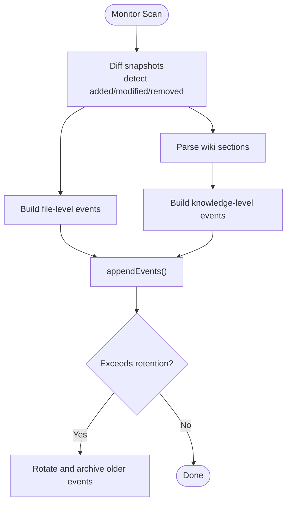
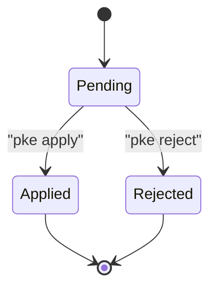
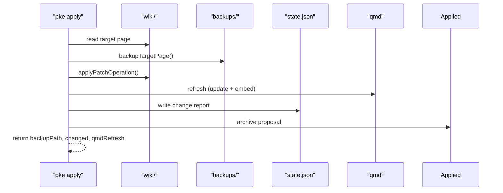
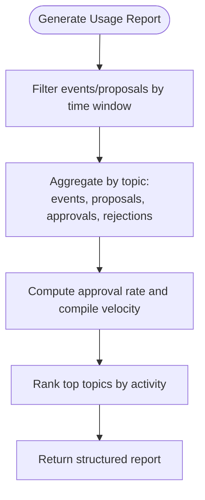
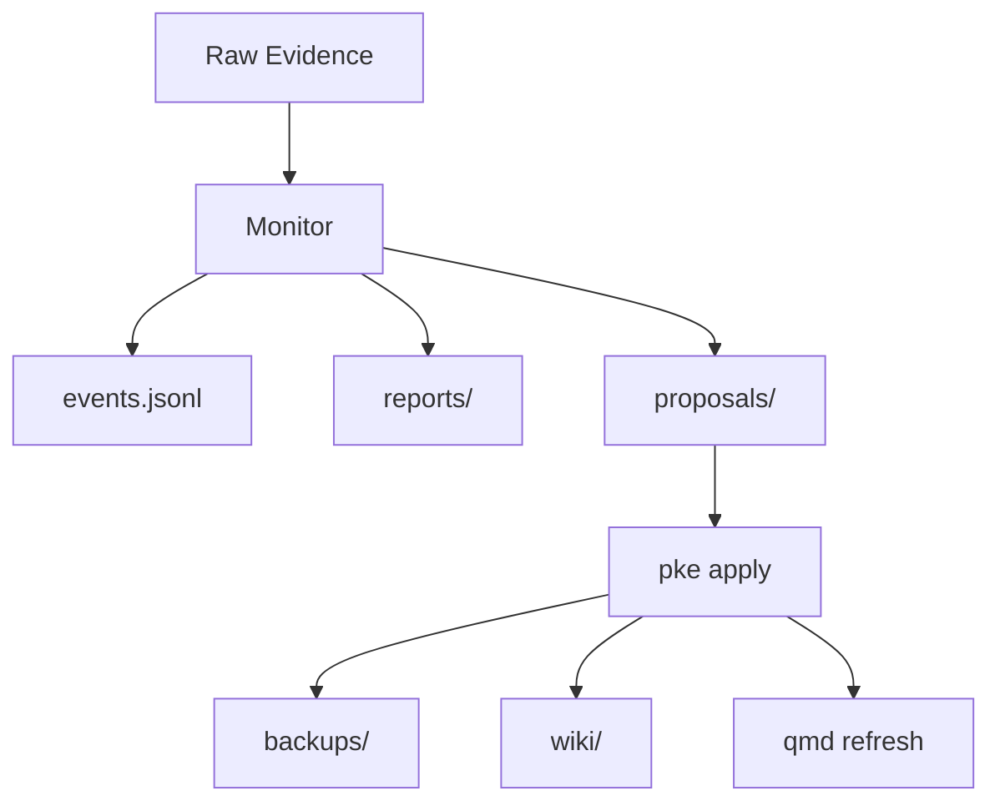
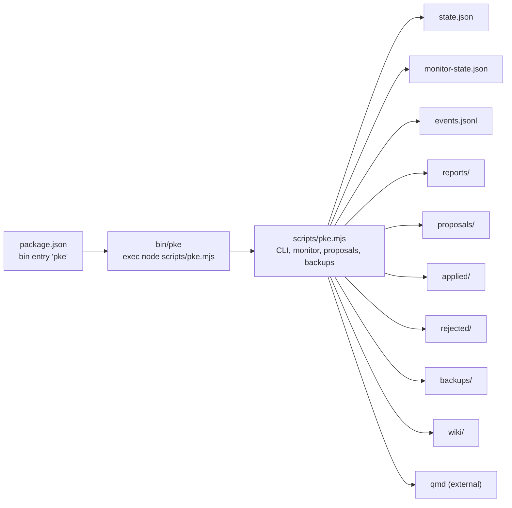

# Audit Trail and Backup System

<cite>
**Referenced Files in This Document**
- [README.md](file://README.md)
- [package.json](file://package.json)
- [bin/pke](file://bin/pke)
- [scripts/pke.mjs](file://scripts/pke.mjs)
- [docs/prd.md](file://docs/prd.md)
- [docs/implementation-notes.md](file://docs/implementation-notes.md)
- [docs/prd-validation-checklist.md](file://docs/prd-validation-checklist.md)
- [docs/agent-workflow.md](file://docs/agent-workflow.md)
- [integrations/qoder/AGENTS.md](file://integrations/qoder/AGENTS.md)
- [skills/personal-knowledge-engine.SKILL.md](file://skills/personal-knowledge-engine.SKILL.md)
</cite>

## Table of Contents
1. [Introduction](#introduction)
2. [Project Structure](#project-structure)
3. [Core Components](#core-components)
4. [Architecture Overview](#architecture-overview)
5. [Detailed Component Analysis](#detailed-component-analysis)
6. [Dependency Analysis](#dependency-analysis)
7. [Performance Considerations](#performance-considerations)
8. [Troubleshooting Guide](#troubleshooting-guide)
9. [Conclusion](#conclusion)
10. [Appendices](#appendices)

## Introduction
This document explains the audit trail and backup system that ensures complete traceability of all knowledge engine operations in the Personal Knowledge Engine (PKE). It covers:
- Proposal lifecycle tracking: creation, approval, rejection, and application events
- Backup system: wiki page backups before modifications, proposal state preservation, and rollback mechanisms
- Event logging: knowledge events, system events, and user actions
- Report generation: usage patterns, acceptance rates, and activity summaries
- Practical examples: audit trail queries, backup restoration procedures, and compliance reporting

The system is proposal-only in the MVP: wiki writes occur only after explicit user approval. Every change is logged, auditable, and reversible.

## Project Structure
The PKE engine is a local-first CLI and dashboard that operates on a vault with raw and wiki directories. The engine persists state and artifacts under a hidden .pke directory.

**Diagram sources**
- [docs/prd.md:430-452](file://docs/prd.md#L430-L452)
- [scripts/pke.mjs:9-29](file://scripts/pke.mjs#L9-L29)

**Section sources**
- [README.md:1-211](file://README.md#L1-L211)
- [docs/prd.md:430-452](file://docs/prd.md#L430-L452)

## Core Components
- Event logging: append-only JSONL log of knowledge events with rich metadata
- Monitor state: incremental snapshot of vault and wiki sections to detect changes
- Proposal lifecycle: proposal creation, review, approval, and application with backups
- Reports: human-readable markdown summaries of monitor scans
- Dashboard: browser UI for monitoring, proposal management, and reports

Key behaviors:
- Wiki writes are proposal-only and append-only in safe sections
- Every approved write triggers a pre-apply backup and a change report
- Events are retained with rotation and reports archived with retention

**Section sources**
- [scripts/pke.mjs:1390-1415](file://scripts/pke.mjs#L1390-L1415)
- [scripts/pke.mjs:1603-1633](file://scripts/pke.mjs#L1603-L1633)
- [docs/prd.md:544-575](file://docs/prd.md#L544-L575)
- [docs/prd.md:595-637](file://docs/prd.md#L595-L637)
- [docs/prd.md:638-697](file://docs/prd.md#L638-L697)

## Architecture Overview
The audit trail and backup system spans CLI commands, state files, and the dashboard. The core flow:
- Monitor detects file and knowledge-level changes and emits events
- Events are appended to events.jsonl and summarized into reports
- Monitor state is updated to support incremental scans
- Proposals are created from events and applied only after approval
- Application backs up the target wiki page, applies the patch, and records a change report

**Diagram sources**
- [scripts/pke.mjs:738-785](file://scripts/pke.mjs#L738-L785)
- [scripts/pke.mjs:1390-1415](file://scripts/pke.mjs#L1390-L1415)
- [scripts/pke.mjs:1603-1633](file://scripts/pke.mjs#L1603-L1633)
- [scripts/pke.mjs:1930-1945](file://scripts/pke.mjs#L1930-L1945)

## Detailed Component Analysis

### Event Logging System
- events.jsonl: append-only log of knowledge events with fields such as id, time, event_type, path, kind, source, summary, approval_status, and optional section/line
- Event types include file-level (raw_added, raw_modified, wiki_added, wiki_modified, etc.) and knowledge-level (conclusion_added, conflict_detected, stale_claim_detected, open_question_added, evidence_added, evidence_link_added, knowledge_section_updated)
- Events are emitted during monitor scans and can be viewed via pke events
- Event log rotation: older events are archived when exceeding a retention threshold

**Diagram sources**
- [scripts/pke.mjs:1313-1377](file://scripts/pke.mjs#L1313-L1377)
- [scripts/pke.mjs:1390-1410](file://scripts/pke.mjs#L1390-L1410)

**Section sources**
- [docs/prd.md:544-575](file://docs/prd.md#L544-L575)
- [docs/prd.md:576-594](file://docs/prd.md#L576-L594)
- [scripts/pke.mjs:1390-1415](file://scripts/pke.mjs#L1390-L1415)
- [scripts/pke.mjs:1412-1415](file://scripts/pke.mjs#L1412-L1415)

### Proposal Lifecycle Tracking
- Creation: pke candidates and pke propose generate proposals with append-only patch operations targeting safe wiki sections
- Review: pke proposals and pke proposal display proposal details and patch operations
- Approval: pke apply transitions status to applied, backs up the target page, applies the patch, and refreshes qmd
- Rejection: pke reject transitions status to rejected and archives the proposal
- Batch approval: pke apply --batch-safe allows fast-path for safe append-only proposals

**Diagram sources**
- [scripts/pke.mjs:585-600](file://scripts/pke.mjs#L585-L600)
- [scripts/pke.mjs:662-672](file://scripts/pke.mjs#L662-L672)
- [scripts/pke.mjs:612-660](file://scripts/pke.mjs#L612-L660)

**Section sources**
- [docs/prd.md:638-697](file://docs/prd.md#L638-L697)
- [scripts/pke.mjs:562-583](file://scripts/pke.mjs#L562-L583)
- [scripts/pke.mjs:585-600](file://scripts/pke.mjs#L585-L600)
- [scripts/pke.mjs:612-660](file://scripts/pke.mjs#L612-L660)
- [scripts/pke.mjs:662-672](file://scripts/pke.mjs#L662-L672)

### Backup System and Rollback Mechanisms
- Pre-apply backup: backupTargetPage() creates a backup file named with the proposal id and wiki path hash
- Application change report: applyProposal() records before/after SHA-256, operations count, and qmd refresh status
- Archive on apply/reject: proposals are copied to applied/ or rejected/ directories
- Rollback: restore the wiki page from the backup file created during apply

**Diagram sources**
- [scripts/pke.mjs:1603-1633](file://scripts/pke.mjs#L1603-L1633)
- [scripts/pke.mjs:1635-1641](file://scripts/pke.mjs#L1635-L1641)
- [scripts/pke.mjs:1660-1665](file://scripts/pke.mjs#L1660-L1665)

**Section sources**
- [scripts/pke.mjs:1603-1633](file://scripts/pke.mjs#L1603-L1633)
- [scripts/pke.mjs:1635-1641](file://scripts/pke.mjs#L1635-L1641)
- [scripts/pke.mjs:1660-1665](file://scripts/pke.mjs#L1660-L1665)

### Report Generation System
- Usage patterns: pke report usage generates a structured report with total events, total proposals, approval rate, compile velocity, and top topics by activity
- Daily/weekly summaries: pke report latest|today prints the most recent or today’s monitor report
- Dashboard: pke dashboard aggregates events, proposals, and reports for visual monitoring

**Diagram sources**
- [scripts/pke.mjs:1100-1138](file://scripts/pke.mjs#L1100-L1138)

**Section sources**
- [scripts/pke.mjs:463-506](file://scripts/pke.mjs#L463-L506)
- [scripts/pke.mjs:1100-1138](file://scripts/pke.mjs#L1100-L1138)
- [scripts/pke.mjs:1667-1733](file://scripts/pke.mjs#L1667-L1733)

### Conceptual Overview
The audit trail and backup system enforces a strict governance model:
- Raw files are evidence and are rarely edited
- Wiki writes require explicit user command, approval, session close summary, or scheduled review
- Monitor is observability-only; it does not write
- Every approved wiki update is append-only, backed up, and recorded

**Diagram sources**
- [README.md:128-211](file://README.md#L128-L211)
- [docs/prd.md:428-452](file://docs/prd.md#L428-L452)

## Dependency Analysis
- CLI depends on Node.js and qmd; environment variables configure vault and qmd path
- CLI reads/writes state files, events, reports, proposals, applied, rejected, and backups
- Dashboard is a local HTTP server that consumes state and events for visualization

**Diagram sources**
- [package.json:7-9](file://package.json#L7-L9)
- [bin/pke:1-10](file://bin/pke#L1-L10)
- [scripts/pke.mjs:9-29](file://scripts/pke.mjs#L9-L29)

**Section sources**
- [package.json:1-18](file://package.json#L1-L18)
- [bin/pke:1-10](file://bin/pke#L1-L10)
- [scripts/pke.mjs:9-29](file://scripts/pke.mjs#L9-L29)

## Performance Considerations
- Event retention: older events are archived to cap growth
- Report retention: older reports are archived after a time window
- Proposal caps: warnings when pending proposals exceed limits
- Watch mode: scoped polling avoids broad filesystem watchers and reduces overhead
- qmd refresh: separate update and embed steps to minimize downtime

[No sources needed since this section provides general guidance]

## Troubleshooting Guide
Common issues and resolutions:
- Proposal not pending: apply requires status “pending”
- Target page not found: ensure the wiki page exists before applying
- No patch operations: regenerate proposal with a target page
- qmd failures: apply still succeeds; check change report for qmd refresh status
- Oversized files: monitor skips files larger than a threshold
- Watch path outside vault: monitor watch requires a vault-relative path

**Section sources**
- [scripts/pke.mjs:1603-1609](file://scripts/pke.mjs#L1603-L1609)
- [scripts/pke.mjs:1660-1665](file://scripts/pke.mjs#L1660-L1665)
- [scripts/pke.mjs:824-875](file://scripts/pke.mjs#L824-L875)
- [scripts/pke.mjs:787-810](file://scripts/pke.mjs#L787-L810)

## Conclusion
The PKE audit trail and backup system provides:
- Complete visibility into knowledge changes via append-only events
- Proposal-only, append-only wiki updates with pre-apply backups
- Structured reports and dashboards for governance and compliance
- Practical tools for querying, restoring, and reporting on knowledge engine activities

[No sources needed since this section summarizes without analyzing specific files]

## Appendices

### Audit Trail Queries
- List recent knowledge events: pke events [--limit N]
- Inspect a specific event: pke events and search by id
- Filter by type: use dashboard filters or parse events.jsonl
- Historical rotation: events.jsonl is rotated when exceeding retention

**Section sources**
- [scripts/pke.mjs:448-461](file://scripts/pke.mjs#L448-L461)
- [scripts/pke.mjs:1412-1415](file://scripts/pke.mjs#L1412-L1415)
- [scripts/pke.mjs:1396-1410](file://scripts/pke.mjs#L1396-L1410)

### Backup Restoration Procedures
- Locate backup: backups are stored under .pke/backups/<proposal-id>-<wiki-path-hash>
- Restore: copy the backup file to replace the wiki page content
- Verify: confirm the wiki page SHA-256 matches the afterSha256 recorded in the change report

**Section sources**
- [scripts/pke.mjs:1635-1641](file://scripts/pke.mjs#L1635-L1641)
- [scripts/pke.mjs:1621-1628](file://scripts/pke.mjs#L1621-L1628)

### Compliance Reporting Capabilities
- Usage patterns: pke report usage provides approval rate, compile velocity, and top topics
- Daily/weekly reports: pke report latest|today prints human-readable summaries
- Dashboard: visual inspection of events, proposals, and reports
- Retention: events and reports are archived according to retention policies

**Section sources**
- [scripts/pke.mjs:463-506](file://scripts/pke.mjs#L463-L506)
- [scripts/pke.mjs:1100-1138](file://scripts/pke.mjs#L1100-L1138)
- [scripts/pke.mjs:1947-1961](file://scripts/pke.mjs#L1947-L1961)
- [scripts/pke.mjs:1930-1945](file://scripts/pke.mjs#L1930-L1945)