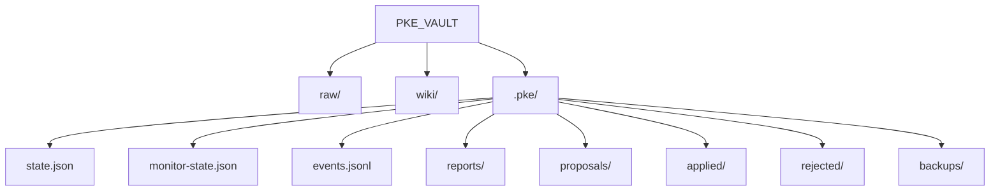
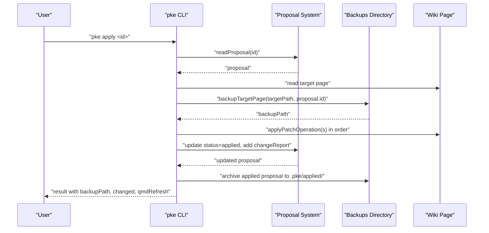
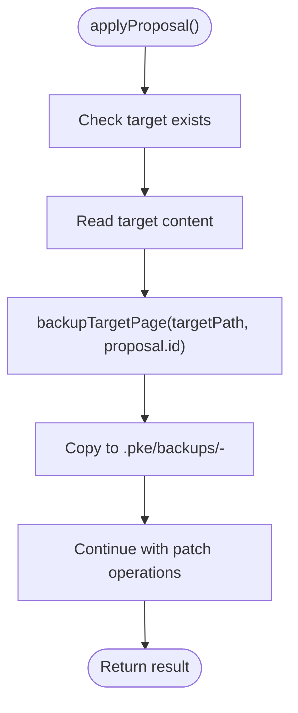
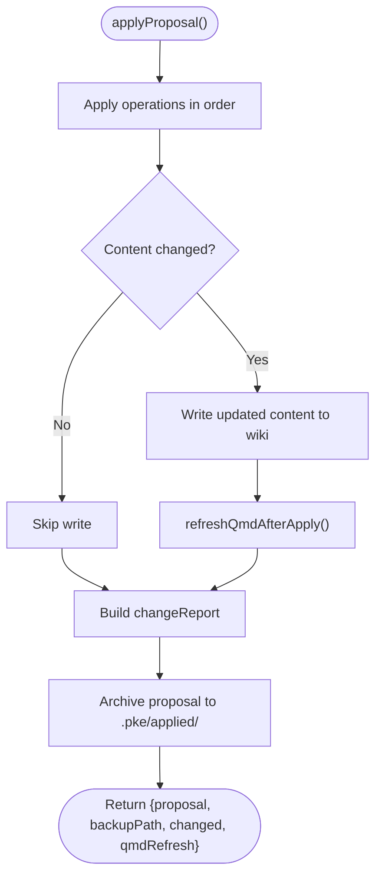
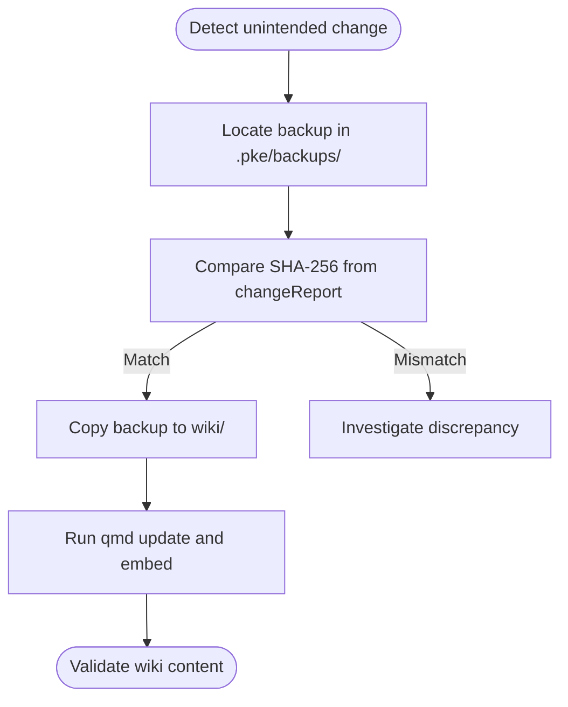
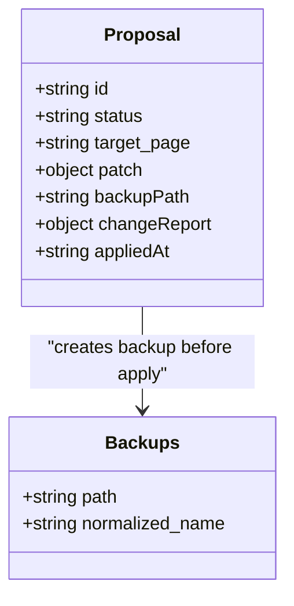
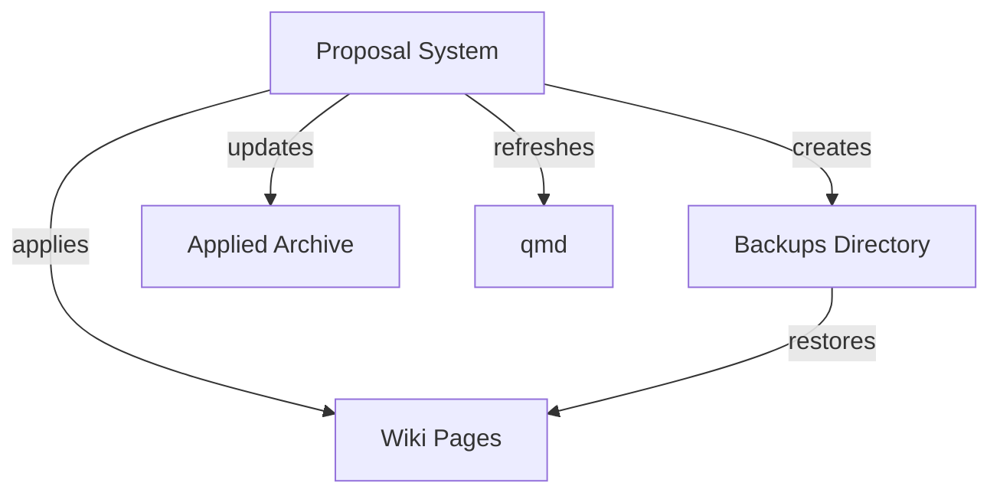

# Backup and Recovery System

<cite>
**Referenced Files in This Document**
- [README.md](file://README.md)
- [package.json](file://package.json)
- [scripts/pke.mjs](file://scripts/pke.mjs)
- [docs/prd.md](file://docs/prd.md)
- [docs/implementation-notes.md](file://docs/implementation-notes.md)
- [docs/implementation-backlog.md](file://docs/implementation-backlog.md)
- [docs/prd-validation-checklist.md](file://docs/prd-validation-checklist.md)
</cite>

## Table of Contents
1. [Introduction](#introduction)
2. [Project Structure](#project-structure)
3. [Core Components](#core-components)
4. [Architecture Overview](#architecture-overview)
5. [Detailed Component Analysis](#detailed-component-analysis)
6. [Dependency Analysis](#dependency-analysis)
7. [Performance Considerations](#performance-considerations)
8. [Troubleshooting Guide](#troubleshooting-guide)
9. [Conclusion](#conclusion)
10. [Appendices](#appendices)

## Introduction
This document describes the backup and recovery system that ensures data integrity and system resilience in the Personal Knowledge Engine (PKE). The system centers on a strict proposal-only workflow: all wiki page mutations are first expressed as proposals and only applied after explicit user approval. The backup mechanism creates pre-application snapshots of wiki pages to enable safe rollback if an applied proposal causes unintended changes.

Key goals:
- Prevent silent wiki pollution by requiring explicit approval for all wiki writes
- Guarantee reversible changes through pre-apply backups
- Provide clear audit trails and verifiable change reports
- Support emergency recovery and disaster scenarios via local backups

## Project Structure
The PKE vault is organized into three primary areas:
- raw/: Evidence files captured from sources
- wiki/: Structured knowledge pages following a 7-section template
- .pke/: Engine state and artifacts (state.json, monitor-state.json, events.jsonl, reports/, proposals/, applied/, rejected/, backups/)

**Diagram sources**
- [docs/prd.md:430-452](file://docs/prd.md#L430-L452)

**Section sources**
- [docs/prd.md:430-452](file://docs/prd.md#L430-L452)
- [docs/implementation-notes.md:50-85](file://docs/implementation-notes.md#L50-L85)

## Core Components
- Backups directory: Stores pre-apply snapshots of wiki pages
- Proposal lifecycle: Proposals are created, reviewed, and applied with backup
- Change reporting: After apply, a change report records SHA-256 hashes and qmd refresh status
- Archival: Applied proposals are archived for later inspection

How backups are created:
- Before applying a proposal, the system backs up the target wiki page to .pke/backups/
- The backup filename encodes the proposal ID and the original wiki path, preserving the original structure

How backups are used:
- If an applied proposal introduces undesirable changes, administrators can restore the pre-apply backup
- The backup retains the exact content before the patch operations were applied

**Section sources**
- [scripts/pke.mjs:1603-1633](file://scripts/pke.mjs#L1603-L1633)
- [scripts/pke.mjs:1635-1641](file://scripts/pke.mjs#L1635-L1641)
- [docs/prd.md:695-700](file://docs/prd.md#L695-L700)

## Architecture Overview
The backup and recovery architecture integrates tightly with the proposal workflow:

**Diagram sources**
- [scripts/pke.mjs:1603-1633](file://scripts/pke.mjs#L1603-L1633)
- [scripts/pke.mjs:1635-1641](file://scripts/pke.mjs#L1635-L1641)
- [docs/prd.md:362-368](file://docs/prd.md#L362-L368)

## Detailed Component Analysis

### Backup Creation and Naming Convention
- Location: .pke/backups/ within the vault
- Naming: <proposal-id>-<original-wiki-path>, where slashes and backslashes in the path are normalized to double underscores
- Purpose: Preserve exact pre-apply content for rollback

**Diagram sources**
- [scripts/pke.mjs:1603-1633](file://scripts/pke.mjs#L1603-L1633)
- [scripts/pke.mjs:1635-1641](file://scripts/pke.mjs#L1635-L1641)

**Section sources**
- [scripts/pke.mjs:1603-1633](file://scripts/pke.mjs#L1603-L1633)
- [scripts/pke.mjs:1635-1641](file://scripts/pke.mjs#L1635-L1641)

### Backup Verification and Change Reporting
- After apply, the system computes SHA-256 hashes for before and after content
- The change report includes target, whether content changed, operation count, and qmd refresh status
- This enables verification that the applied changes match expectations and that qmd indexing/embedding succeeded

**Diagram sources**
- [scripts/pke.mjs:1603-1633](file://scripts/pke.mjs#L1603-L1633)
- [scripts/pke.mjs:1660-1665](file://scripts/pke.mjs#L1660-L1665)

**Section sources**
- [scripts/pke.mjs:1603-1633](file://scripts/pke.mjs#L1603-L1633)
- [scripts/pke.mjs:1660-1665](file://scripts/pke.mjs#L1660-L1665)

### Restore Procedures and Rollback Mechanisms
- Manual restore: Copy the backup file back to the original wiki page location
- Validation: Compare SHA-256 hashes from the change report to confirm the restored content matches the pre-apply state
- Post-restore: Optionally re-run qmd refresh to rebuild indexes

**Diagram sources**
- [scripts/pke.mjs:1603-1633](file://scripts/pke.mjs#L1603-L1633)
- [scripts/pke.mjs:1660-1665](file://scripts/pke.mjs#L1660-L1665)

**Section sources**
- [scripts/pke.mjs:1603-1633](file://scripts/pke.mjs#L1603-L1633)
- [scripts/pke.mjs:1660-1665](file://scripts/pke.mjs#L1660-L1665)

### Relationship Between Backups and Proposal Approval System
- All wiki mutations are proposal-driven; backups are created only upon approval and application
- The proposal status transitions from pending to applied, with metadata including backup path and change report
- Rejected proposals are archived separately (.pke/rejected/) and do not trigger backups

**Diagram sources**
- [docs/prd.md:638-697](file://docs/prd.md#L638-L697)
- [scripts/pke.mjs:1603-1633](file://scripts/pke.mjs#L1603-L1633)

**Section sources**
- [docs/prd.md:638-697](file://docs/prd.md#L638-L697)
- [scripts/pke.mjs:1603-1633](file://scripts/pke.mjs#L1603-L1633)

### Emergency Recovery and Disaster Scenarios
- Hardware failure: Use local backups to restore wiki pages to their pre-apply state
- Corrupted wiki: Restore from the most recent backup for the affected page
- Misapplied proposal: Use the backup to revert and then refine the proposal

Operational notes:
- Backups are stored locally in .pke/backups/ and are not synchronized to external systems
- Administrators should periodically review backups and maintain offsite copies as part of broader disaster recovery planning

**Section sources**
- [docs/prd.md:2196-2196](file://docs/prd.md#L2196-L2196)
- [docs/implementation-notes.md:74-85](file://docs/implementation-notes.md#L74-L85)

## Dependency Analysis
The backup system depends on:
- Proposal lifecycle: Only applied proposals trigger backups
- File system: Backups are simple file copies
- qmd integration: Optional refresh after apply to keep indexes current

**Diagram sources**
- [scripts/pke.mjs:1603-1633](file://scripts/pke.mjs#L1603-L1633)
- [scripts/pke.mjs:1660-1665](file://scripts/pke.mjs#L1660-L1665)

**Section sources**
- [scripts/pke.mjs:1603-1633](file://scripts/pke.mjs#L1603-L1633)
- [scripts/pke.mjs:1660-1665](file://scripts/pke.mjs#L1660-L1665)

## Performance Considerations
- Backup creation involves a file copy; for large wiki pages, this may take longer
- SHA-256 computation is lightweight and occurs after apply
- qmd refresh is optional and can be deferred if immediate availability is not required

## Troubleshooting Guide
Common issues and resolutions:
- Backup not found: Confirm the proposal ID and that the apply command completed successfully
- SHA mismatch: Indicates manual edits or external changes; reconcile content and re-apply refined proposals
- qmd refresh failures: Inspect qmd status and logs; retry after resolving underlying issues
- Permission errors: Ensure the user has write permissions to .pke/backups/ and wiki/

**Section sources**
- [scripts/pke.mjs:1603-1633](file://scripts/pke.mjs#L1603-L1633)
- [scripts/pke.mjs:1660-1665](file://scripts/pke.mjs#L1660-L1665)

## Conclusion
The PKE backup and recovery system enforces a strict, reversible change model by backing up wiki pages before any proposal is applied. Combined with detailed change reports and archival of applied proposals, it provides strong guarantees for data integrity and system resilience. Administrators can confidently approve and apply changes knowing they can quickly roll back to a known-good state if needed.

## Appendices

### Backup Storage Locations and Formats
- Backups directory: .pke/backups/
- Backup file format: <proposal-id>-<original-wiki-path> (with path separators normalized)
- Metadata preservation: SHA-256 hashes and qmd refresh status are recorded in the change report

**Section sources**
- [scripts/pke.mjs:1635-1641](file://scripts/pke.mjs#L1635-L1641)
- [scripts/pke.mjs:1621-1628](file://scripts/pke.mjs#L1621-L1628)

### Retention Policies
- Backups are retained locally in .pke/backups/ for manual management
- No automated retention policy is implemented in the current codebase
- Administrators should establish their own retention and archival practices

**Section sources**
- [docs/implementation-backlog.md:129-131](file://docs/implementation-backlog.md#L129-L131)
- [docs/prd.md:1870-1877](file://docs/prd.md#L1870-L1877)