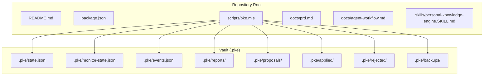
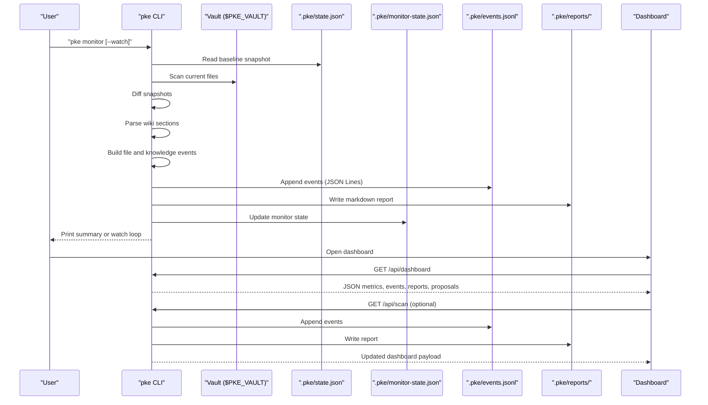
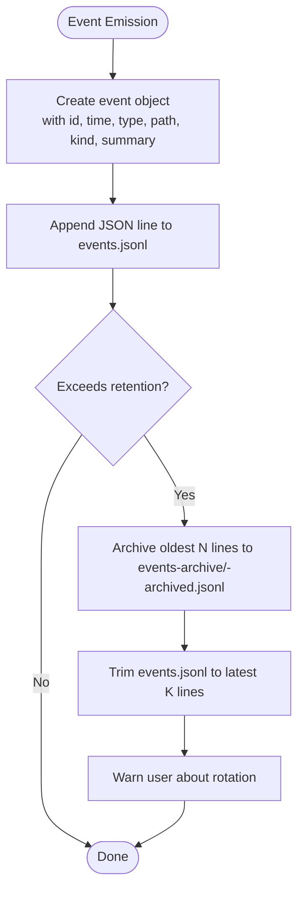
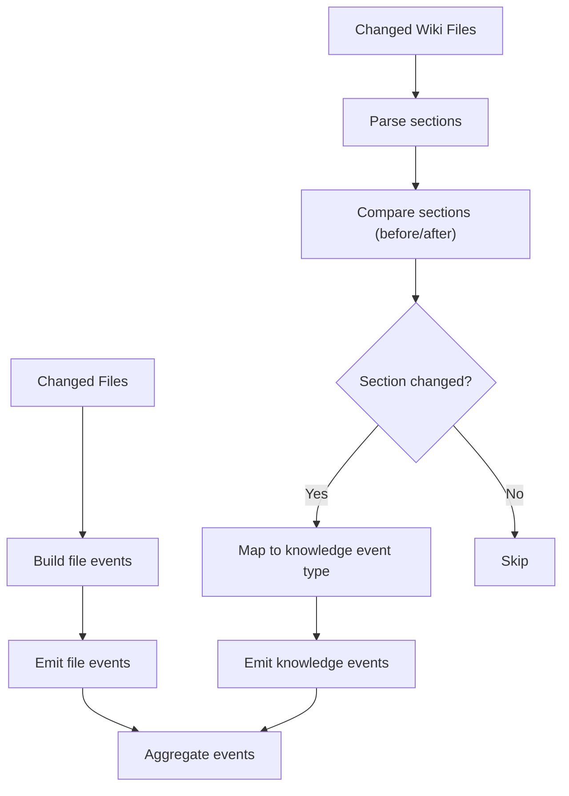
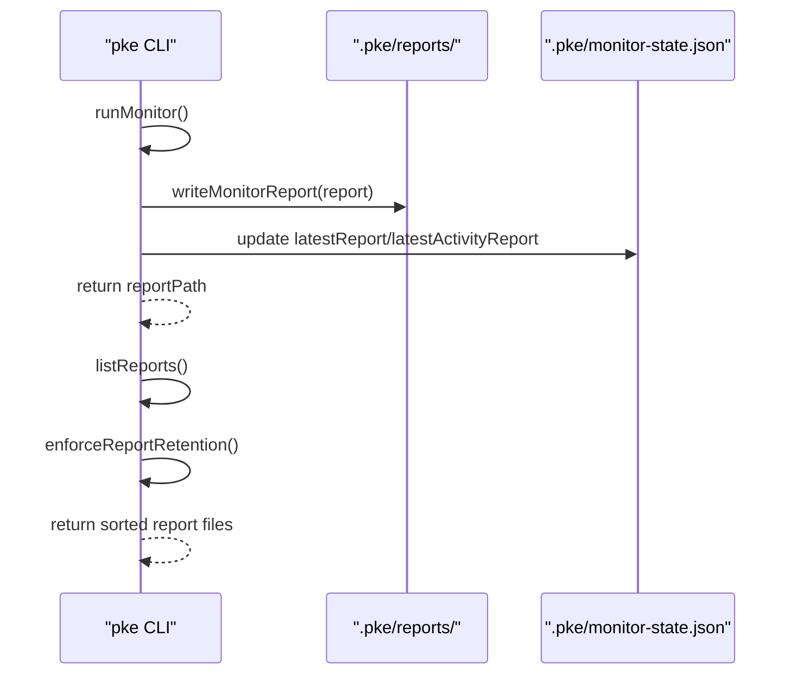
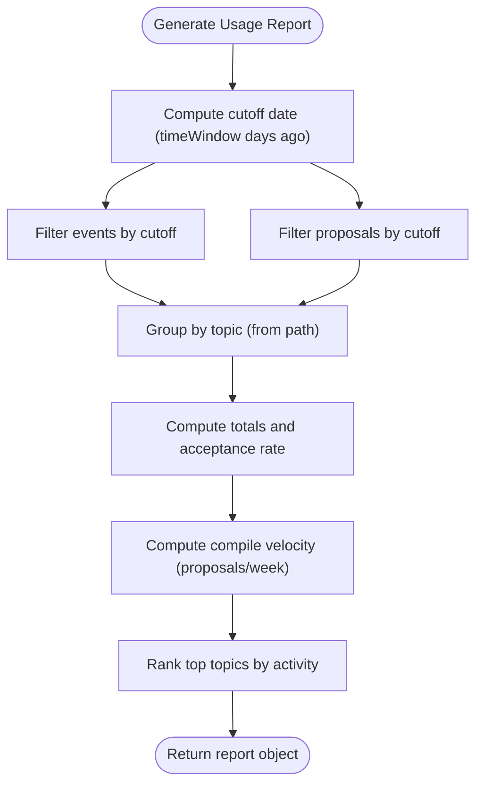
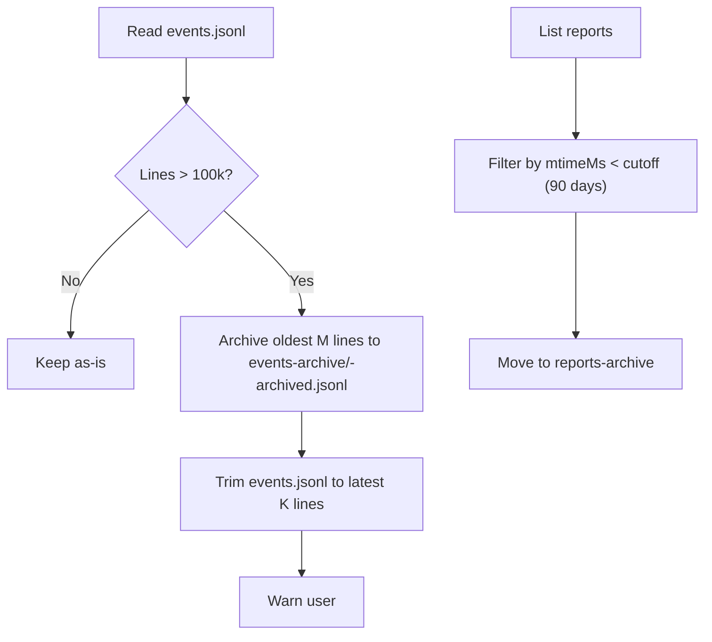
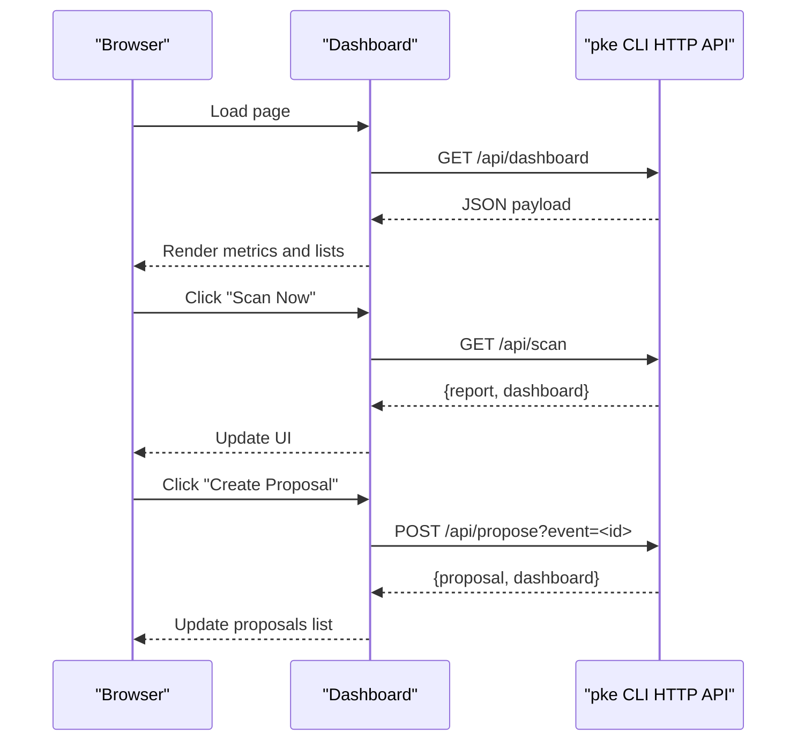
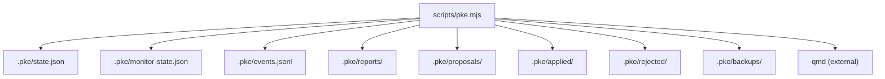

# Event Logging and Reporting

<cite>
**Referenced Files in This Document**
- [README.md](file://README.md)
- [package.json](file://package.json)
- [scripts/pke.mjs](file://scripts/pke.mjs)
- [docs/prd.md](file://docs/prd.md)
- [docs/agent-workflow.md](file://docs/agent-workflow.md)
- [skills/personal-knowledge-engine.SKILL.md](file://skills/personal-knowledge-engine.SKILL.md)
</cite>

## Table of Contents
1. [Introduction](#introduction)
2. [Project Structure](#project-structure)
3. [Core Components](#core-components)
4. [Architecture Overview](#architecture-overview)
5. [Detailed Component Analysis](#detailed-component-analysis)
6. [Dependency Analysis](#dependency-analysis)
7. [Performance Considerations](#performance-considerations)
8. [Troubleshooting Guide](#troubleshooting-guide)
9. [Conclusion](#conclusion)
10. [Appendices](#appendices)

## Introduction
This document explains the event logging and reporting system that powers comprehensive audit trails and system observability for the Personal Knowledge Engine (PKE). It covers the events.jsonl file format, event types, timestamp management, categories of events, and the reporting pipeline. It also documents retention and archival policies, report generation, and the integration with the browser dashboard for real-time monitoring and historical analysis.

## Project Structure
The event logging and reporting system lives in the CLI implementation and is complemented by documentation and skill instructions that define the operational model and expectations.

**Diagram sources**
- [scripts/pke.mjs:16-30](file://scripts/pke.mjs#L16-L30)
- [docs/prd.md:428-452](file://docs/prd.md#L428-L452)

**Section sources**
- [README.md:128-184](file://README.md#L128-L184)
- [package.json:1-18](file://package.json#L1-L18)
- [scripts/pke.mjs:16-30](file://scripts/pke.mjs#L16-L30)
- [docs/prd.md:428-452](file://docs/prd.md#L428-L452)

## Core Components
- Event log: Append-only JSON Lines file (.pke/events.jsonl) storing knowledge events with rich metadata.
- Monitor: Scans vault snapshots, diffs files, parses wiki sections, and emits categorized events.
- Reports: Timestamped markdown reports written to .pke/reports/.
- Dashboard: Real-time browser UI consuming event and report data.
- Retention and archival: Automatic rotation of event logs and pruning/archival of old reports.

Key behaviors:
- Events are timestamped and uniquely identified.
- File-level and knowledge-level events are emitted.
- Reports summarize counts, new conclusions, conflicts, stale claims, open questions, and approval needs.
- Dashboard aggregates totals, latest scans, activity, and proposals.

**Section sources**
- [README.md:147-177](file://README.md#L147-L177)
- [scripts/pke.mjs:1390-1415](file://scripts/pke.mjs#L1390-L1415)
- [scripts/pke.mjs:1930-2072](file://scripts/pke.mjs#L1930-L2072)
- [scripts/pke.mjs:1667-1733](file://scripts/pke.mjs#L1667-L1733)

## Architecture Overview
The system is a local-first, CLI-driven workflow that observes vault changes, logs events, generates reports, and exposes a dashboard for monitoring.

**Diagram sources**
- [scripts/pke.mjs:738-785](file://scripts/pke.mjs#L738-L785)
- [scripts/pke.mjs:1390-1415](file://scripts/pke.mjs#L1390-L1415)
- [scripts/pke.mjs:1930-2072](file://scripts/pke.mjs#L1930-L2072)
- [scripts/pke.mjs:1667-1733](file://scripts/pke.mjs#L1667-L1733)

## Detailed Component Analysis

### Event Logging Format and Management
- File format: events.jsonl (JSON Lines), one event object per line.
- Fields include identifiers, timestamps, type, path, kind, source, summary, approval status, and optional section/line metadata.
- Timestamp management: ISO 8601 timestamps are generated at event creation time and used for ordering and retention.
- Append and rotation: Events are appended atomically; when exceeding the retention threshold, older events are archived to a dated file and retained for the configured number of events.

**Diagram sources**
- [scripts/pke.mjs:1364-1377](file://scripts/pke.mjs#L1364-L1377)
- [scripts/pke.mjs:1390-1410](file://scripts/pke.mjs#L1390-L1410)

**Section sources**
- [docs/prd.md:544-575](file://docs/prd.md#L544-L575)
- [scripts/pke.mjs:1364-1377](file://scripts/pke.mjs#L1364-L1377)
- [scripts/pke.mjs:1390-1410](file://scripts/pke.mjs#L1390-L1410)

### Event Types and Categories
Detected event types include:
- File-level: raw_added, raw_modified, raw_removed, wiki_added, wiki_modified, wiki_removed
- Knowledge-level: conclusion_added, conclusion_changed, conflict_detected, stale_claim_detected, open_question_added, evidence_added, evidence_link_added, knowledge_section_updated

These are derived from file changes and wiki section diffs. Approval needs are inferred for certain event types.

**Diagram sources**
- [scripts/pke.mjs:1313-1322](file://scripts/pke.mjs#L1313-L1322)
- [scripts/pke.mjs:1324-1348](file://scripts/pke.mjs#L1324-L1348)
- [scripts/pke.mjs:1355-1362](file://scripts/pke.mjs#L1355-L1362)

**Section sources**
- [README.md:155-169](file://README.md#L155-L169)
- [docs/prd.md:576-594](file://docs/prd.md#L576-L594)
- [scripts/pke.mjs:1313-1348](file://scripts/pke.mjs#L1313-L1348)

### Reporting System
- Report generation: Timestamped markdown reports are written under .pke/reports/ summarizing counts, new conclusions, conflicts, stale claims, open questions, and approval needs.
- Report listing and selection: List reports, select latest or today’s reports, and optionally output as JSON.
- Retention policy: Reports older than 90 days are archived to a dated subdirectory.

**Diagram sources**
- [scripts/pke.mjs:738-785](file://scripts/pke.mjs#L738-L785)
- [scripts/pke.mjs:1930-1961](file://scripts/pke.mjs#L1930-L1961)

**Section sources**
- [scripts/pke.mjs:1930-2072](file://scripts/pke.mjs#L1930-L2072)
- [scripts/pke.mjs:1947-1961](file://scripts/pke.mjs#L1947-L1961)

### Usage Pattern Reports and Metrics
- Usage report: Aggregates events and proposals over a configurable time window (default 30 days), computing total events, total proposals, approval rate, compile velocity (proposals per week), and top topics by activity.
- Confidence adjustment: Uses historical acceptance rates to adjust confidence of compile candidates.

**Diagram sources**
- [scripts/pke.mjs:1100-1138](file://scripts/pke.mjs#L1100-L1138)

**Section sources**
- [scripts/pke.mjs:1100-1138](file://scripts/pke.mjs#L1100-L1138)
- [scripts/pke.mjs:930-967](file://scripts/pke.mjs#L930-L967)
- [scripts/pke.mjs:973-979](file://scripts/pke.mjs#L973-L979)

### Retention Policies and Archival
- Event retention: Up to 100,000 events; older events are archived to a dated file in events-archive.
- Report retention: Reports older than 90 days are moved to reports-archive.

**Diagram sources**
- [scripts/pke.mjs:1396-1410](file://scripts/pke.mjs#L1396-L1410)
- [scripts/pke.mjs:1947-1961](file://scripts/pke.mjs#L1947-L1961)

**Section sources**
- [README.md:149-156](file://README.md#L149-L156)
- [scripts/pke.mjs:1396-1410](file://scripts/pke.mjs#L1396-L1410)
- [scripts/pke.mjs:1947-1961](file://scripts/pke.mjs#L1947-L1961)

### Dashboard Integration
- API endpoints:
  - GET /api/dashboard: returns metrics, latest scan, activity, events, reports, and proposals.
  - GET /api/scan: runs a monitor scan and returns combined data.
  - POST /api/propose: creates a proposal from an event.
  - POST /api/apply: applies a proposal (with backup and qmd refresh).
  - POST /api/reject: rejects a proposal.
- Browser UI: Renders metrics, filtered events, pending proposals, and reports; supports manual scan and auto-scan modes.

**Diagram sources**
- [scripts/pke.mjs:674-736](file://scripts/pke.mjs#L674-L736)
- [scripts/pke.mjs:1667-1733](file://scripts/pke.mjs#L1667-L1733)

**Section sources**
- [README.md:171-184](file://README.md#L171-L184)
- [scripts/pke.mjs:674-736](file://scripts/pke.mjs#L674-L736)
- [scripts/pke.mjs:1667-1733](file://scripts/pke.mjs#L1667-L1733)

### Examples and Queries
- Monitor and watch:
  - One-shot: pke monitor
  - Scoped: pke monitor --path wiki/
  - Watch mode: pke monitor --watch --path wiki/
- Inspect events: pke events [--limit 20]
- Reports: pke report latest|today
- Usage report: pke report usage [--json]
- Dashboard: pke dashboard [--port 8787] [--path raw/] [--auto-scan]

Note: These commands are defined in the CLI help and usage sections.

**Section sources**
- [README.md:56-80](file://README.md#L56-L80)
- [README.md:128-184](file://README.md#L128-L184)
- [scripts/pke.mjs:99-157](file://scripts/pke.mjs#L99-L157)

## Dependency Analysis
The CLI orchestrates state files, event logs, reports, and the dashboard. The qmd engine integrates externally for retrieval and indexing.

**Diagram sources**
- [scripts/pke.mjs:16-30](file://scripts/pke.mjs#L16-L30)
- [docs/prd.md:428-452](file://docs/prd.md#L428-L452)

**Section sources**
- [scripts/pke.mjs:16-30](file://scripts/pke.mjs#L16-L30)
- [docs/prd.md:428-452](file://docs/prd.md#L428-L452)

## Performance Considerations
- Scanning: Vault scanning is bounded by supported file types and a maximum file size; oversized files are skipped with warnings.
- Watch mode: Uses scoped polling with a configurable interval to avoid OS-specific watchers and reduce overhead.
- Event log rotation: Prevents unbounded growth by archiving older events.
- Report retention: Archives old reports to keep the reports directory manageable.

[No sources needed since this section provides general guidance]

## Troubleshooting Guide
- Monitor path errors: Watch mode requires a scoped path inside the vault; otherwise, an error is thrown.
- Oversized files: Files larger than the configured maximum are skipped with a warning.
- Dashboard scan failures: API endpoints return errors for invalid IDs or missing resources; the UI surfaces these messages.
- Proposal limits: Pending proposals exceed a cap; warnings are printed when exceeded.

**Section sources**
- [scripts/pke.mjs:787-810](file://scripts/pke.mjs#L787-L810)
- [scripts/pke.mjs:824-875](file://scripts/pke.mjs#L824-L875)
- [scripts/pke.mjs:674-736](file://scripts/pke.mjs#L674-L736)
- [scripts/pke.mjs:1559-1567](file://scripts/pke.mjs#L1559-L1567)

## Conclusion
The event logging and reporting system provides a robust, local-first foundation for auditability and observability. It captures precise knowledge events, maintains a compact and rotating event log, generates human-readable and machine-consumable reports, and powers a dashboard for both real-time monitoring and historical analysis. Together with governance rules and proposal-only compilation, it ensures that knowledge evolution is transparent, traceable, and approval-gated.

[No sources needed since this section summarizes without analyzing specific files]

## Appendices

### Appendix A: CLI Commands and Options
- Commands: status, use, changed, daily, learn, capture, compile, close-session, stale, monitor, events, report, dashboard, candidates, propose, proposals, proposal, apply, reject, improve
- Options: --vault, --collection, --state, --path, --json, --save, --usage, --write, --watch, --port, --auto-scan, --target, --apply, --batch-safe

**Section sources**
- [README.md:56-80](file://README.md#L56-L80)
- [scripts/pke.mjs:99-157](file://scripts/pke.mjs#L99-L157)

### Appendix B: Data Models Overview
- state.json: baseline checkpoint and file snapshot
- monitor-state.json: monitor snapshot, section state, removal tombstones, and serialized reports
- events.jsonl: append-only event log
- reports/: timestamped markdown reports
- proposals/, applied/, rejected/, backups/: proposal lifecycle and backups

**Section sources**
- [docs/prd.md:509-637](file://docs/prd.md#L509-L637)
- [docs/prd.md:428-452](file://docs/prd.md#L428-L452)