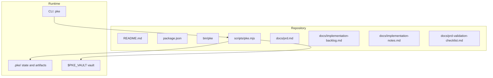
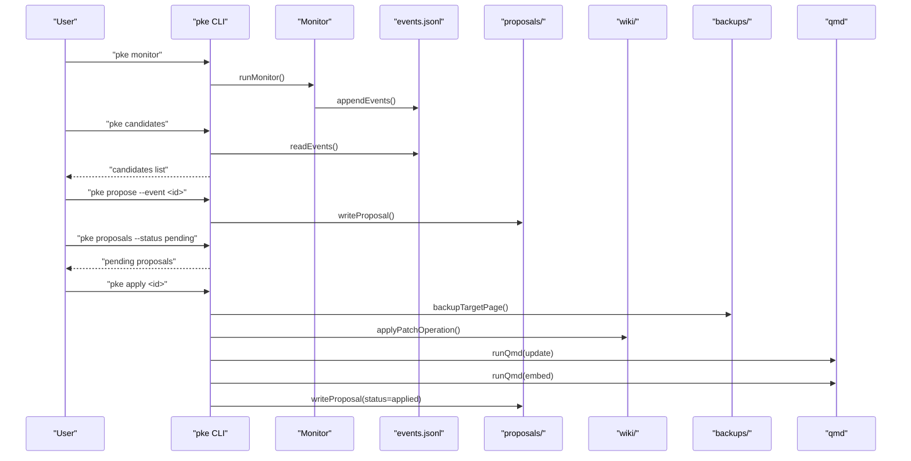
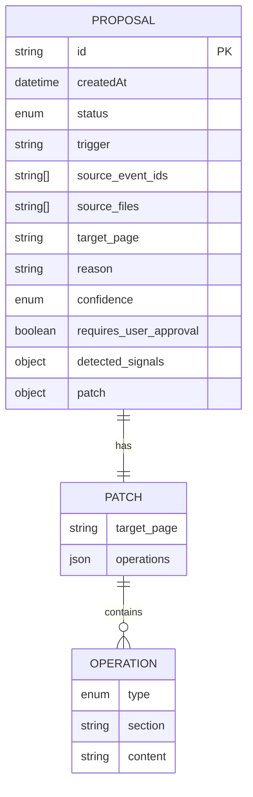
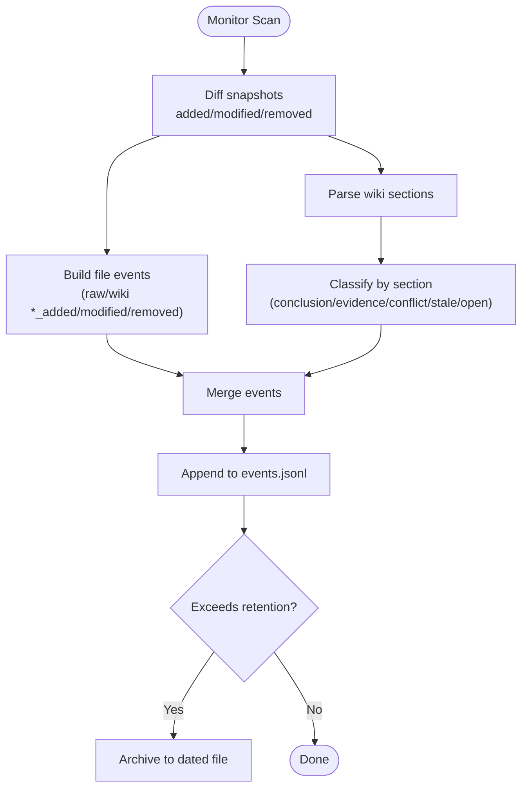
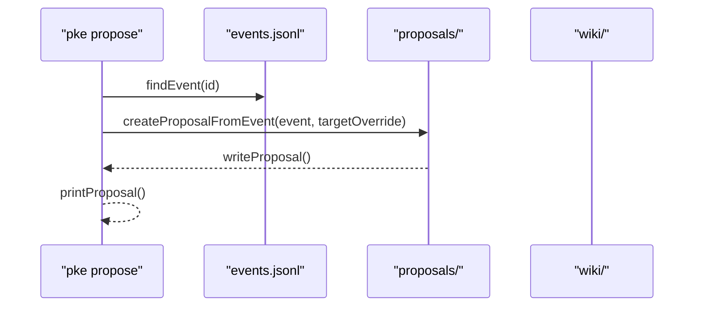
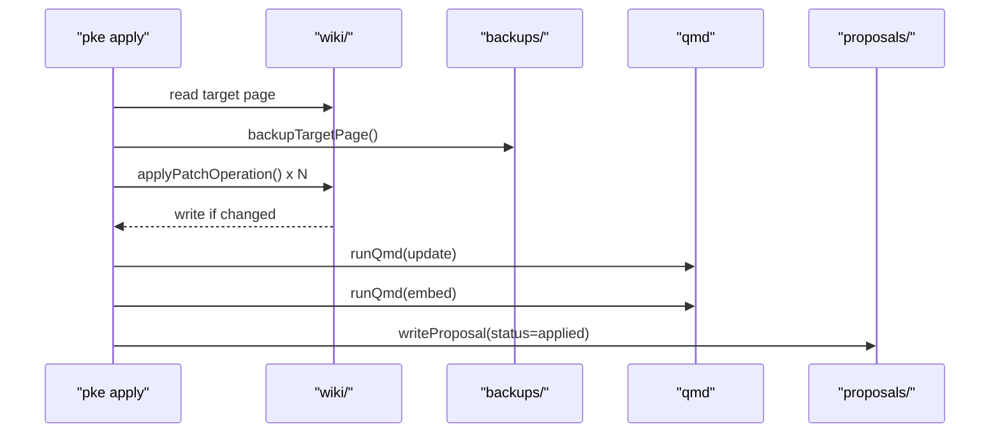
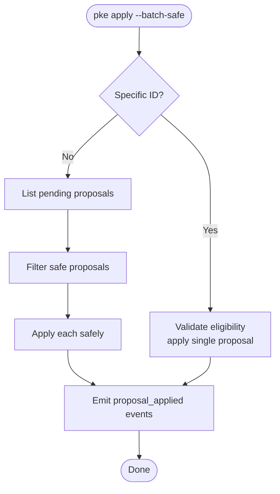
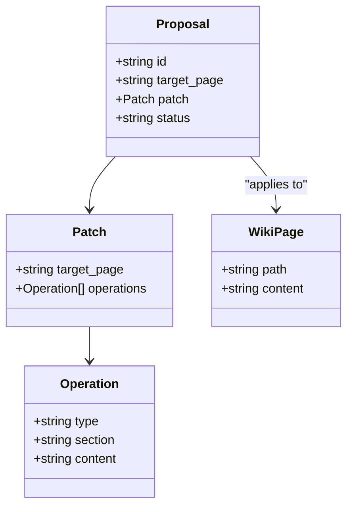
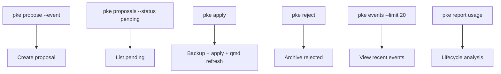
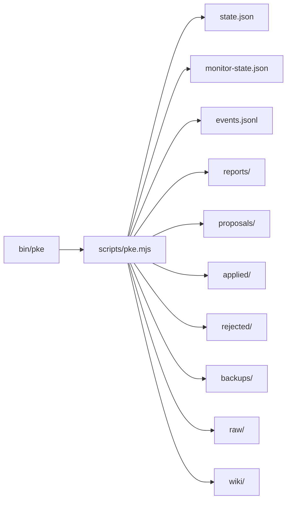

# Proposal Lifecycle Tracking

<cite>
**Referenced Files in This Document**
- [README.md](file://README.md)
- [package.json](file://package.json)
- [bin/pke](file://bin/pke)
- [scripts/pke.mjs](file://scripts/pke.mjs)
- [docs/prd.md](file://docs/prd.md)
- [docs/implementation-backlog.md](file://docs/implementation-backlog.md)
- [docs/implementation-notes.md](file://docs/implementation-notes.md)
- [docs/prd-validation-checklist.md](file://docs/prd-validation-checklist.md)
</cite>

## Table of Contents
1. [Introduction](#introduction)
2. [Project Structure](#project-structure)
3. [Core Components](#core-components)
4. [Architecture Overview](#architecture-overview)
5. [Detailed Component Analysis](#detailed-component-analysis)
6. [Dependency Analysis](#dependency-analysis)
7. [Performance Considerations](#performance-considerations)
8. [Troubleshooting Guide](#troubleshooting-guide)
9. [Conclusion](#conclusion)
10. [Appendices](#appendices)

## Introduction
This document explains the proposal lifecycle tracking system that governs all proposal-related activities in the Personal Knowledge Engine (PKE). The system ensures that wiki updates are conservative, transparent, and reversible. It tracks proposal creation, review, approval, rejection, and application, while maintaining audit trails and enabling safe rollbacks.

The lifecycle centers on the controlled self-improvement workflow: monitor events → compile candidates → proposal creation → user approval → append-only wiki patch → backup + audit record → qmd refresh. This guarantees that knowledge pages evolve only when explicitly approved, preserving the distinction between raw evidence and compiled knowledge.

## Project Structure
The proposal lifecycle is implemented in a single Node.js module with a CLI wrapper and supporting documentation.

**Diagram sources**
- [bin/pke](file://bin/pke)
- [scripts/pke.mjs](file://scripts/pke.mjs)
- [docs/prd.md](file://docs/prd.md)

**Section sources**
- [README.md](file://README.md)
- [package.json](file://package.json)
- [bin/pke](file://bin/pke)
- [scripts/pke.mjs](file://scripts/pke.mjs)

## Core Components
- Proposal data model and lifecycle: creation, status transitions, audit fields, and patch operations.
- Event logging: knowledge events, event classification, and retention policies.
- Proposal commands: propose, proposals, proposal, apply, reject, and batch-safe apply.
- Wiki update mechanism: append-only patch application, backup, and qmd refresh.
- Dashboard integration: browsing events, creating proposals, and approving/rejecting from the UI.

**Section sources**
- [scripts/pke.mjs](file://scripts/pke.mjs)
- [docs/prd.md](file://docs/prd.md)

## Architecture Overview
The proposal lifecycle spans CLI commands, state files, and wiki pages. The monitor generates knowledge events that seed compile candidates and proposals. Approved proposals are applied as append-only patches to wiki pages, with backups and qmd refresh.

**Diagram sources**
- [scripts/pke.mjs](file://scripts/pke.mjs)
- [docs/prd.md](file://docs/prd.md)

## Detailed Component Analysis

### Proposal Data Model and Lifecycle
- Proposal identity and metadata: unique ID generation, creation timestamp, trigger event, source files, target page, reason, confidence, and requires_user_approval.
- Status management: pending, applied, rejected with timestamps and audit fields.
- Patch operations: append-only operations targeting safe wiki sections (Evidence, Open Questions, Conflicts / Evolution, Stale Or Risky Claims). Operations include type, section, and content.
- Archive and backup: applied and rejected proposals are archived; wiki page backups are created before applying.

**Diagram sources**
- [docs/prd.md](file://docs/prd.md)

**Section sources**
- [docs/prd.md](file://docs/prd.md)
- [scripts/pke.mjs](file://scripts/pke.mjs)

### Event Logging and Classification
- Event log: append-only JSONL file with fields id, time, event_type, path, kind, source, summary, approval_status, and optional section/line.
- Event types: raw_added, raw_modified, raw_removed, wiki_added, wiki_modified, wiki_removed, conclusion_added, conclusion_changed, evidence_added, evidence_link_added, conflict_detected, stale_claim_detected, open_question_added, knowledge_section_updated.
- Classification logic: section-level classification for wiki changes; raw file changes emit file-level events.
- Retention: event log rotation to archive older entries when exceeding a threshold.

**Diagram sources**
- [scripts/pke.mjs](file://scripts/pke.mjs)

**Section sources**
- [scripts/pke.mjs](file://scripts/pke.mjs)
- [docs/prd.md](file://docs/prd.md)

### Proposal Creation and Management
- Creation from event: createProposalFromEvent builds a proposal with safe patch operations based on the triggering event and suggested target page.
- Suggested target page: derive from source path, existing wiki page, or heuristics; normalization ensures canonical wiki path.
- Listing and filtering: proposalsCommand supports status filtering; listProposals enumerates pending/applied/rejected.
- Details: proposalCommand prints full proposal including patch operations.

**Diagram sources**
- [scripts/pke.mjs](file://scripts/pke.mjs)

**Section sources**
- [scripts/pke.mjs](file://scripts/pke.mjs)

### Approval, Application, and Rollback
- Approval gate: only approved proposals can be applied; apply validates pending status, target existence, and non-empty patch.
- Application steps: backup target wiki page, apply append-only operations, update proposal status, archive applied proposal, and attempt qmd update/embed.
- Rollback: backups are stored under backups/ with a naming scheme linking to the proposal and target page.
- Rejection: sets status to rejected, records timestamp, and archives to rejected/.

**Diagram sources**
- [scripts/pke.mjs](file://scripts/pke.mjs)

**Section sources**
- [scripts/pke.mjs](file://scripts/pke.mjs)

### Batch-Safe Approval
- Eligibility: proposals with high confidence and only append-to-section operations targeting safe sections can be fast-tracked.
- Batch mode: applyBatchSafe can approve all eligible pending proposals in one run, emitting batch-safe events.

**Diagram sources**
- [scripts/pke.mjs](file://scripts/pke.mjs)

**Section sources**
- [scripts/pke.mjs](file://scripts/pke.mjs)

### Relationship Between Proposals and Wiki Updates
- Append-only strategy: patch operations are limited to appending content to specific sections, avoiding destructive edits.
- Evidence linkage: raw sources are linked into wiki pages via wikilinks, preserving provenance.
- Template compliance: wiki pages follow a 7-section template; missing sections are handled by append operations.

**Diagram sources**
- [docs/prd.md](file://docs/prd.md)

**Section sources**
- [docs/prd.md](file://docs/prd.md)
- [scripts/pke.mjs](file://scripts/pke.mjs)

### CLI Commands and Usage Patterns
- Proposal commands: propose, proposals, proposal, apply, reject.
- Querying and filtering: proposals with status filtering; events with limit; report usage for lifecycle analysis.
- Dashboard integration: browse events, create proposals from events, and approve/reject from the UI.

**Diagram sources**
- [scripts/pke.mjs](file://scripts/pke.mjs)
- [README.md](file://README.md)

**Section sources**
- [README.md](file://README.md)
- [scripts/pke.mjs](file://scripts/pke.mjs)

## Dependency Analysis
- CLI entry point: bin/pke invokes scripts/pke.mjs.
- Module dependencies: Node built-ins (fs, path, crypto, http, os, child_process) and qmd integration.
- State and artifacts: .pke directory holds state.json, monitor-state.json, events.jsonl, reports/, proposals/, applied/, rejected/, backups/.
- Vault structure: raw/ for evidence, wiki/ for knowledge pages.

**Diagram sources**
- [bin/pke](file://bin/pke)
- [scripts/pke.mjs](file://scripts/pke.mjs)
- [docs/prd.md](file://docs/prd.md)

**Section sources**
- [bin/pke](file://bin/pke)
- [scripts/pke.mjs](file://scripts/pke.mjs)
- [docs/prd.md](file://docs/prd.md)

## Performance Considerations
- Event log rotation: archives older events when exceeding a threshold to control growth.
- Report retention: older reports are archived after a retention period.
- Proposal caps: warnings when pending proposals exceed a threshold; self-improvement proposals cap and expiry are enforced.
- Watch mode: scoped polling avoids heavy filesystem watchers and reduces overhead.

[No sources needed since this section provides general guidance]

## Troubleshooting Guide
- Proposal not found: readProposal throws if the proposal file is missing; verify the ID and proposals directory.
- Target page not found: apply validates existence of the target wiki page; ensure the path is correct.
- Not pending: apply rejects non-pending proposals; check status and re-propose if needed.
- No patch operations: proposals without operations cannot be applied; recreate with a target page.
- qmd failures: apply continues even if qmd update/embed fails; check qmd status and logs; retry after fixing.

**Section sources**
- [scripts/pke.mjs](file://scripts/pke.mjs)

## Conclusion
The proposal lifecycle tracking system enforces a strict approval-gated workflow for wiki updates. It combines observability (monitoring and event logging), governance (proposal-only writes), safety (backups and rollbacks), and transparency (audit trails). Together, these components ensure that knowledge evolves conservatively, with clear records of all changes and the ability to revert when necessary.

## Appendices

### Appendix A: Proposal Data Structure Reference
- Unique ID: proposal-YYYY-MM-DDTHH-mm-ss-sss-[random]
- Status: pending, applied, rejected
- Trigger: originating event type
- Source files: vault-relative paths of raw evidence
- Target page: normalized wiki path
- Confidence: high, medium, low
- Patch operations: append_to_section targeting safe sections

**Section sources**
- [docs/prd.md](file://docs/prd.md)
- [scripts/pke.mjs](file://scripts/pke.mjs)

### Appendix B: Example Queries and Analysis
- List pending proposals: pke proposals --status pending
- View proposal details: pke proposal <id>
- Analyze lifecycle trends: pke report usage
- Browse recent events: pke events --limit 20

**Section sources**
- [README.md](file://README.md)
- [scripts/pke.mjs](file://scripts/pke.mjs)