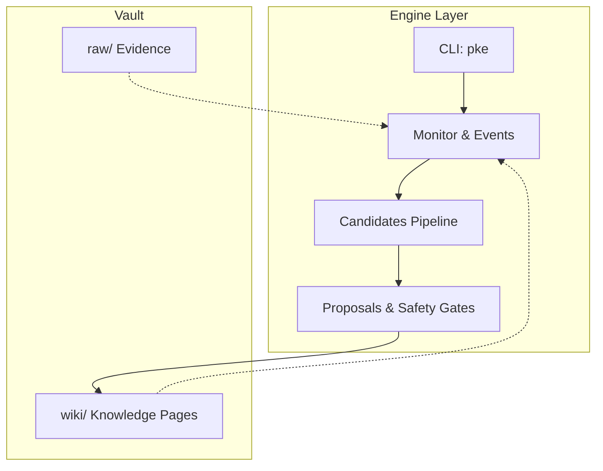
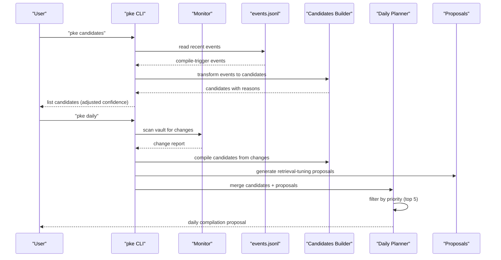
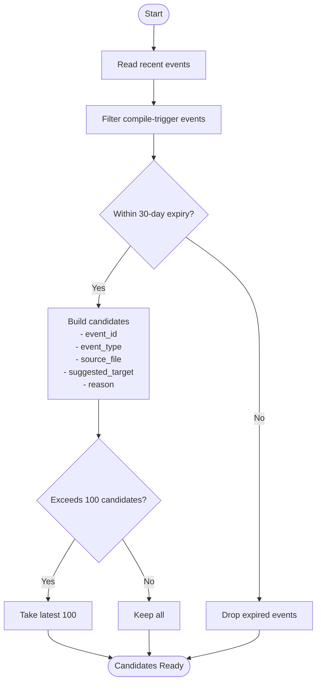
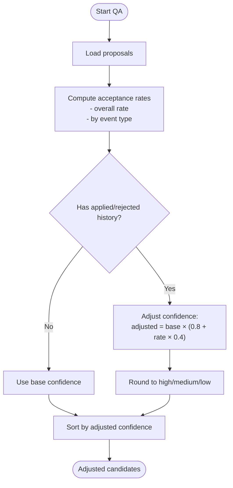
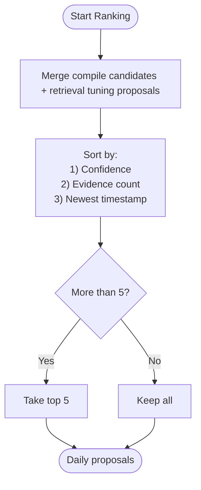
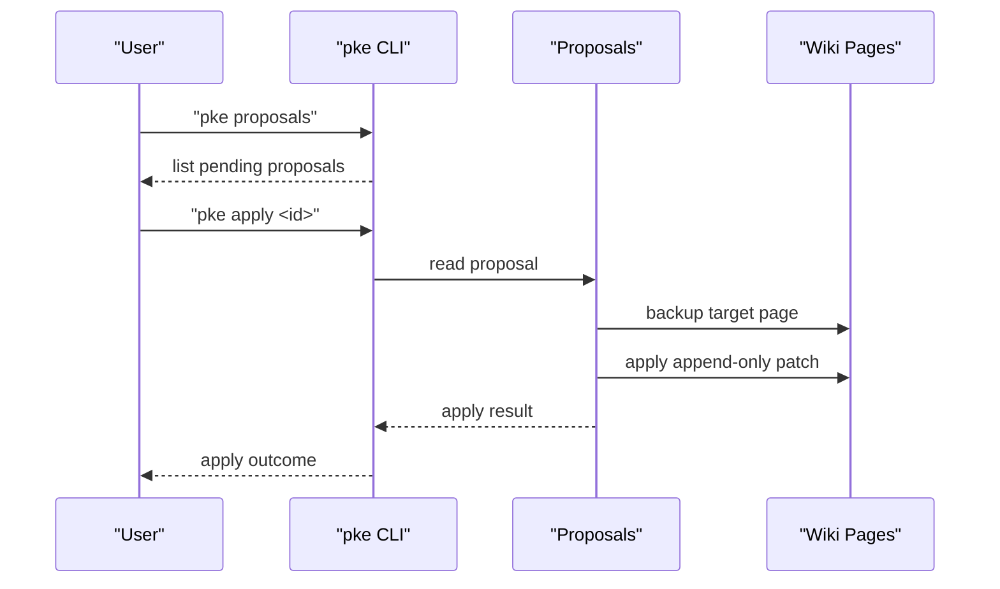
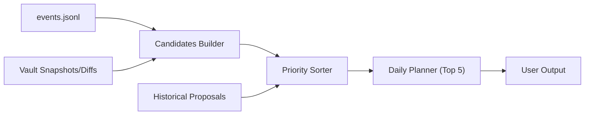

# Candidate Filtering and Prioritization

<cite>
**Referenced Files in This Document**
- [README.md](file://README.md)
- [package.json](file://package.json)
- [scripts/pke.mjs](file://scripts/pke.mjs)
- [docs/prd.md](file://docs/prd.md)
- [docs/agent-workflow.md](file://docs/agent-workflow.md)
- [skills/personal-knowledge-engine.SKILL.md](file://skills/personal-knowledge-engine.SKILL.md)
</cite>

## Table of Contents
1. [Introduction](#introduction)
2. [Project Structure](#project-structure)
3. [Core Components](#core-components)
4. [Architecture Overview](#architecture-overview)
5. [Detailed Component Analysis](#detailed-component-analysis)
6. [Dependency Analysis](#dependency-analysis)
7. [Performance Considerations](#performance-considerations)
8. [Troubleshooting Guide](#troubleshooting-guide)
9. [Conclusion](#conclusion)

## Introduction
This document explains the candidate filtering and prioritization system that governs how compile candidates are discovered, filtered, evaluated, and ranked for daily review and proposal generation. It covers:
- Maximum candidate limits and expiration policies that control candidate lifecycle
- Duplicate removal, relevance filtering, and quality assessment
- Priority ranking by adjusted confidence scores and supporting factors
- Daily proposal rate limiting and its interaction with prioritization
- Examples of filtering scenarios, priority calculations, and the impact of rate limits on candidate availability
- The relationship between candidate quality, safety considerations, and user workflow efficiency

## Project Structure
The candidate lifecycle is implemented in the CLI script and documented across the PRD and workflow guides. The key areas are:
- CLI entry points and commands that surface candidates and proposals
- Candidate generation from monitor events and daily change scans
- Confidence adjustment using historical acceptance rates
- Priority sorting and daily rate limiting
- Safety gates and approval-required workflows

**Diagram sources**
- [scripts/pke.mjs:508-547](file://scripts/pke.mjs#L508-L547)
- [scripts/pke.mjs:221-285](file://scripts/pke.mjs#L221-L285)
- [scripts/pke.mjs:924-979](file://scripts/pke.mjs#L924-L979)

**Section sources**
- [README.md:1-211](file://README.md#L1-L211)
- [package.json:1-18](file://package.json#L1-L18)
- [scripts/pke.mjs:1-18](file://scripts/pke.mjs#L1-L18)

## Core Components
- Candidate discovery from monitor events and daily change scans
- Candidate lifecycle controls: maximum count and expiry window
- Quality assessment and confidence adjustment using historical acceptance rates
- Priority ranking by confidence, evidence strength, and recency
- Daily proposal rate limiting to prevent overload
- Safety gates requiring explicit user approval for wiki updates

**Section sources**
- [scripts/pke.mjs:508-547](file://scripts/pke.mjs#L508-L547)
- [scripts/pke.mjs:924-979](file://scripts/pke.mjs#L924-L979)
- [scripts/pke.mjs:1139-1151](file://scripts/pke.mjs#L1139-L1151)
- [scripts/pke.mjs:221-285](file://scripts/pke.mjs#L221-L285)

## Architecture Overview
The candidate pipeline integrates monitor events, daily change detection, and proposal generation with safety and rate-limiting controls.

**Diagram sources**
- [scripts/pke.mjs:508-547](file://scripts/pke.mjs#L508-L547)
- [scripts/pke.mjs:221-285](file://scripts/pke.mjs#L221-L285)
- [scripts/pke.mjs:981-1059](file://scripts/pke.mjs#L981-L1059)

## Detailed Component Analysis

### Candidate Discovery and Lifecycle Controls
- Candidate sources:
  - Monitor events that indicate knowledge changes (e.g., raw/wiki modifications, conflicts, stale claims, open questions, conclusions)
  - Daily change scans that produce compile candidates from changed files
- Lifecycle controls:
  - Maximum candidate count: capped at 100
  - Expiry policy: candidates expire after 30 days
- Candidate construction:
  - Each candidate includes event type, source file, suggested target page, and a reason for compilation

**Diagram sources**
- [scripts/pke.mjs:508-517](file://scripts/pke.mjs#L508-L517)

**Section sources**
- [scripts/pke.mjs:508-547](file://scripts/pke.mjs#L508-L547)
- [scripts/pke.mjs:1421-1432](file://scripts/pke.mjs#L1421-L1432)

### Quality Assessment and Confidence Adjustment
- Base confidence is derived from the candidate’s event type and detected signals
- Historical acceptance rates are computed from previously created proposals
- Confidence is adjusted multiplicatively within an 80–120% range based on event-type acceptance rate
- Adjusted confidence is used to rank candidates

**Diagram sources**
- [scripts/pke.mjs:930-979](file://scripts/pke.mjs#L930-L979)

**Section sources**
- [scripts/pke.mjs:924-979](file://scripts/pke.mjs#L924-L979)
- [scripts/pke.mjs:519-530](file://scripts/pke.mjs#L519-L530)

### Priority Ranking and Daily Rate Limiting
- Priority factors (in order):
  1) Confidence (high > medium > low)
  2) Evidence strength (detected_signals.evidence_count)
  3) Recency (newest first)
- Daily proposal rate limiting:
  - The daily planner merges compile candidates and retrieval-tuning proposals
  - If more than 5 candidates exist, only the top 5 are shown
  - Priority sorting is applied before truncation

**Diagram sources**
- [scripts/pke.mjs:221-285](file://scripts/pke.mjs#L221-L285)
- [scripts/pke.mjs:1139-1151](file://scripts/pke.mjs#L1139-L1151)

**Section sources**
- [scripts/pke.mjs:221-285](file://scripts/pke.mjs#L221-L285)
- [scripts/pke.mjs:1139-1151](file://scripts/pke.mjs#L1139-L1151)

### Safety Gates and Approval Workflow
- All proposals require explicit user approval before applying wiki changes
- The system supports:
  - Manual approval/rejection
  - Batch-safe fast-path for high-confidence, append-only proposals
- Safety operations:
  - Pre-apply backups
  - Append-only patch operations to safe sections (Evidence, Open Questions, Related Pages)
  - Optional batch approval of eligible proposals

**Diagram sources**
- [scripts/pke.mjs:562-600](file://scripts/pke.mjs#L562-L600)
- [scripts/pke.mjs:612-660](file://scripts/pke.mjs#L612-L660)

**Section sources**
- [scripts/pke.mjs:602-660](file://scripts/pke.mjs#L602-L660)
- [docs/prd.md:638-696](file://docs/prd.md#L638-L696)

### Examples and Scenarios
- Filtering scenario: A raw file is modified; the monitor emits a raw_modified event. The event is included in candidates if within the 30-day window and under the 100-candidate cap. If multiple such events occur, only the latest 100 are considered.
- Priority calculation: Among candidates with equal confidence, the one with more detected evidence lines ranks higher. If confidence and evidence are equal, the newest candidate is prioritized.
- Rate limit impact: If 8 candidates are generated in a day, only the top 5 are shown by the daily planner; the remaining 3 are deferred until later review cycles.

**Section sources**
- [scripts/pke.mjs:508-547](file://scripts/pke.mjs#L508-L547)
- [scripts/pke.mjs:1139-1151](file://scripts/pke.mjs#L1139-L1151)
- [scripts/pke.mjs:221-285](file://scripts/pke.mjs#L221-L285)

## Dependency Analysis
- Candidate generation depends on:
  - Monitor event log (events.jsonl)
  - Vault file snapshots and diffs
  - Historical proposal data for acceptance rate computation
- Priority sorting depends on:
  - Candidate confidence values
  - Detected signals (evidence counts)
  - Timestamps for recency
- Daily rate limiting depends on:
  - The union of compile candidates and retrieval-tuning proposals

**Diagram sources**
- [scripts/pke.mjs:508-547](file://scripts/pke.mjs#L508-L547)
- [scripts/pke.mjs:930-979](file://scripts/pke.mjs#L930-L979)
- [scripts/pke.mjs:1139-1151](file://scripts/pke.mjs#L1139-L1151)
- [scripts/pke.mjs:221-285](file://scripts/pke.mjs#L221-L285)

**Section sources**
- [scripts/pke.mjs:508-547](file://scripts/pke.mjs#L508-L547)
- [scripts/pke.mjs:930-979](file://scripts/pke.mjs#L930-L979)
- [scripts/pke.mjs:1139-1151](file://scripts/pke.mjs#L1139-L1151)
- [scripts/pke.mjs:221-285](file://scripts/pke.mjs#L221-L285)

## Performance Considerations
- Candidate window and expiry: The 100-candidate cap and 30-day expiry prevent unbounded growth of candidate sets, keeping downstream processing efficient.
- Sorting complexity: Priority sorting is O(n log n) with up to several dozen candidates, which is lightweight for interactive CLI usage.
- Daily rate limiting: Reduces cognitive load and prevents proposal fatigue by limiting visible candidates to 5 per day.
- Historical acceptance computation: Computation is linear in the number of proposals and is cached in memory during a single run.

[No sources needed since this section provides general guidance]

## Troubleshooting Guide
- Candidates not appearing:
  - Verify events are recent and within the 30-day window
  - Confirm the candidate count is below the 100-item cap
- Unexpected candidate ordering:
  - Check confidence adjustments based on acceptance history
  - Confirm evidence counts and timestamps
- Too many proposals shown:
  - The daily planner enforces a top-5 cap; review earlier candidates in the candidate list or later review cycles
- Safety concerns:
  - Only approved proposals are applied; backups are created before changes
  - Use batch-safe fast-path only for high-confidence, append-only proposals

**Section sources**
- [scripts/pke.mjs:508-547](file://scripts/pke.mjs#L508-L547)
- [scripts/pke.mjs:924-979](file://scripts/pke.mjs#L924-L979)
- [scripts/pke.mjs:1139-1151](file://scripts/pke.mjs#L1139-L1151)
- [scripts/pke.mjs:602-660](file://scripts/pke.mjs#L602-L660)

## Conclusion
The candidate filtering and prioritization system balances discovery, quality, and user efficiency. It caps candidate volume, expires stale candidates, adjusts confidence using historical acceptance rates, and ranks candidates by confidence, evidence strength, and recency. Daily rate limiting ensures manageable proposal volumes, while strict safety gates and backups protect the knowledge base. Together, these mechanisms support a robust, transparent, and user-efficient knowledge compilation workflow.