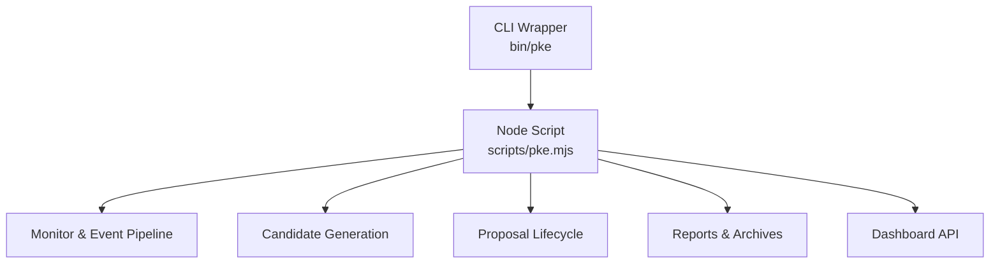
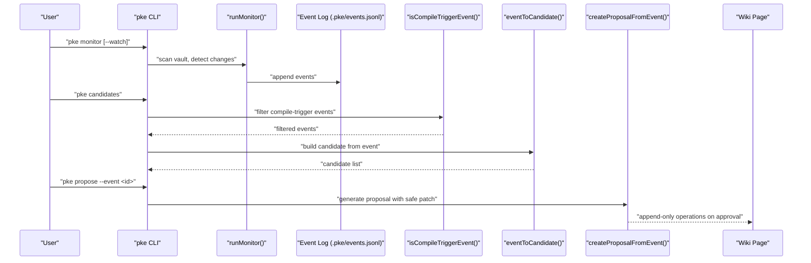
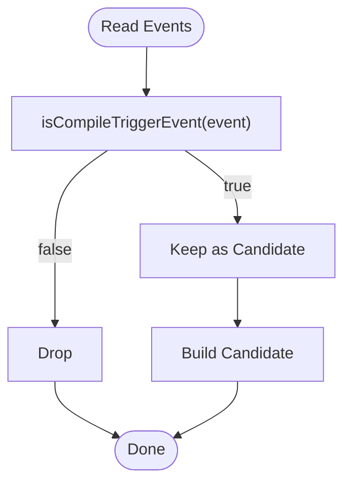
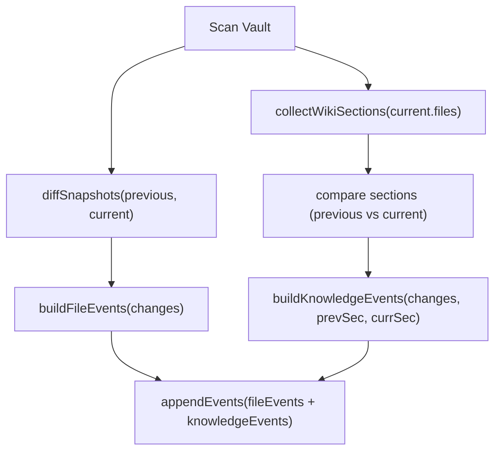
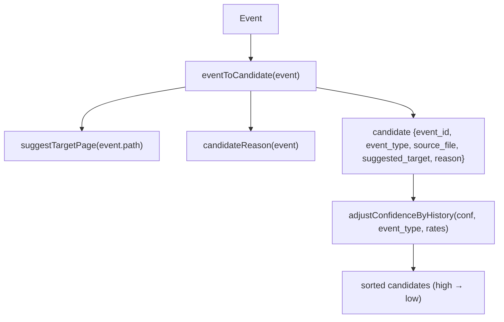
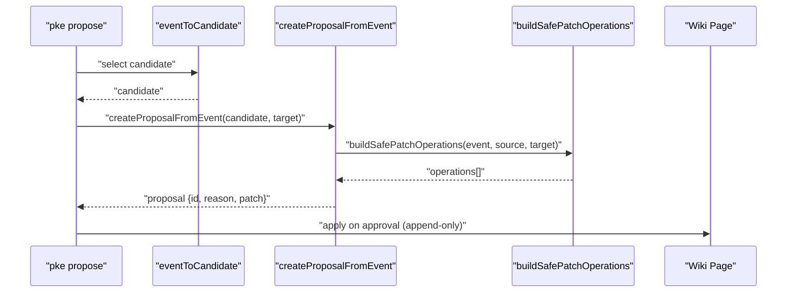
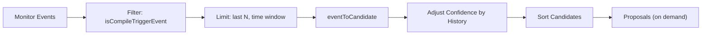
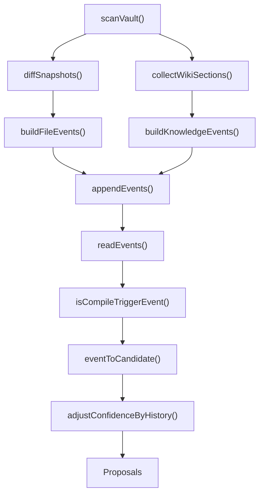

# Candidate Identification Sources

<cite>
**Referenced Files in This Document**
- [README.md](file://README.md)
- [package.json](file://package.json)
- [bin/pke](file://bin/pke)
- [scripts/pke.mjs](file://scripts/pke.mjs)
</cite>

## Table of Contents
1. [Introduction](#introduction)
2. [Project Structure](#project-structure)
3. [Core Components](#core-components)
4. [Architecture Overview](#architecture-overview)
5. [Detailed Component Analysis](#detailed-component-analysis)
6. [Dependency Analysis](#dependency-analysis)
7. [Performance Considerations](#performance-considerations)
8. [Troubleshooting Guide](#troubleshooting-guide)
9. [Conclusion](#conclusion)

## Introduction
This document explains how the Personal Knowledge Engine MVP identifies compile candidates from multiple sources and converts knowledge-monitor events into actionable compile candidates. It covers:
- How compile-trigger events are identified and filtered
- The candidate creation pipeline from raw events to proposals
- Integration with the monitoring system and how events flow into candidate generation
- Examples of candidate creation from different event types
- The relationship between monitoring events and compile candidates

The system ensures that wiki updates are conservative and proposal-driven, with candidates surfaced for user approval before any append-only wiki changes occur.

**Section sources**
- [README.md: 128-211:128-211](file://README.md#L128-L211)

## Project Structure
The CLI entrypoint delegates to a Node script that implements all commands, including monitoring, event logging, candidate generation, and proposal lifecycle.

**Diagram sources**
- [bin/pke: 1-10:1-10](file://bin/pke#L1-L10)
- [scripts/pke.mjs: 1-97:1-97](file://scripts/pke.mjs#L1-L97)

**Section sources**
- [package.json: 7-9:7-9](file://package.json#L7-L9)
- [bin/pke: 1-10:1-10](file://bin/pke#L1-L10)
- [scripts/pke.mjs: 1-97:1-97](file://scripts/pke.mjs#L1-L97)

## Core Components
- Monitoring and event detection: Scans vault snapshots, diffs file changes, detects semantic changes in wiki sections, and emits typed events.
- Event storage: Appends events to a JSONL log with rotation and archival.
- Candidate generation: Filters compile-trigger events, builds candidate records with reasons and suggested targets, adjusts confidence by acceptance history, and sorts candidates.
- Proposal lifecycle: Converts candidates into proposals with safe, append-only patch operations and supports approval and application.

**Section sources**
- [scripts/pke.mjs: 738-785:738-785](file://scripts/pke.mjs#L738-L785)
- [scripts/pke.mjs: 1412-1432:1412-1432](file://scripts/pke.mjs#L1412-L1432)
- [scripts/pke.mjs: 508-547:508-547](file://scripts/pke.mjs#L508-L547)
- [scripts/pke.mjs: 1454-1481:1454-1481](file://scripts/pke.mjs#L1454-L1481)

## Architecture Overview
The candidate identification system integrates monitoring, event filtering, and proposal generation into a controlled self-improvement loop.

**Diagram sources**
- [scripts/pke.mjs: 738-785:738-785](file://scripts/pke.mjs#L738-L785)
- [scripts/pke.mjs: 1412-1432:1412-1432](file://scripts/pke.mjs#L1412-L1432)
- [scripts/pke.mjs: 508-547:508-547](file://scripts/pke.mjs#L508-L547)
- [scripts/pke.mjs: 1454-1481:1454-1481](file://scripts/pke.mjs#L1454-L1481)

## Detailed Component Analysis

### Compile Trigger Events and Filtering Criteria
Compile-trigger events are a curated subset of all detected events. The system filters for events that indicate potential knowledge updates requiring review or action.

- Compile-trigger event types:
  - raw_added, raw_modified
  - wiki_modified
  - conflict_detected
  - stale_claim_detected
  - open_question_added
  - conclusion_added, conclusion_changed

These types are defined and enforced by a dedicated filter function.

**Diagram sources**
- [scripts/pke.mjs: 1421-1432:1421-1432](file://scripts/pke.mjs#L1421-L1432)

**Section sources**
- [README.md: 155-169:155-169](file://README.md#L155-L169)
- [scripts/pke.mjs: 1421-1432:1421-1432](file://scripts/pke.mjs#L1421-L1432)

### Event Detection and Semantic Change Recognition
The monitor pipeline performs:
- Snapshot comparison to detect file additions, modifications, and removals
- Wiki section parsing to compute per-section diffs
- Semantic event emission for knowledge sections

Key steps:
- Build file events from change sets
- Parse wiki sections and compare to previous state
- Emit semantic events for conclusions, conflicts, stale claims, open questions, and evidence links

**Diagram sources**
- [scripts/pke.mjs: 738-785:738-785](file://scripts/pke.mjs#L738-L785)
- [scripts/pke.mjs: 1313-1362:1313-1362](file://scripts/pke.mjs#L1313-L1362)
- [scripts/pke.mjs: 1277-1311:1277-1311](file://scripts/pke.mjs#L1277-L1311)

**Section sources**
- [scripts/pke.mjs: 738-785:738-785](file://scripts/pke.mjs#L738-L785)
- [scripts/pke.mjs: 1313-1362:1313-1362](file://scripts/pke.mjs#L1313-L1362)
- [scripts/pke.mjs: 1277-1311:1277-1311](file://scripts/pke.mjs#L1277-L1311)

### Candidate Creation from Raw Events
Each compile-trigger event is transformed into a candidate with:
- Source file path
- Suggested target page
- Reason derived from the event type
- Confidence adjusted by historical acceptance rates

**Diagram sources**
- [scripts/pke.mjs: 1434-1452:1434-1452](file://scripts/pke.mjs#L1434-L1452)
- [scripts/pke.mjs: 930-979:930-979](file://scripts/pke.mjs#L930-L979)

**Section sources**
- [scripts/pke.mjs: 508-547:508-547](file://scripts/pke.mjs#L508-L547)
- [scripts/pke.mjs: 1434-1452:1434-1452](file://scripts/pke.mjs#L1434-L1452)
- [scripts/pke.mjs: 930-979:930-979](file://scripts/pke.mjs#L930-L979)

### Proposal Generation from Candidates
When a candidate is selected, the system creates a proposal with:
- A deterministic ID and metadata
- Source files and target page (with optional override)
- Safe, append-only patch operations aligned with the event type
- Requires explicit user approval before applying

**Diagram sources**
- [scripts/pke.mjs: 549-560:549-560](file://scripts/pke.mjs#L549-L560)
- [scripts/pke.mjs: 1454-1481:1454-1481](file://scripts/pke.mjs#L1454-L1481)
- [scripts/pke.mjs: 1483-1524:1483-1524](file://scripts/pke.mjs#L1483-L1524)

**Section sources**
- [scripts/pke.mjs: 549-560:549-560](file://scripts/pke.mjs#L549-L560)
- [scripts/pke.mjs: 1454-1481:1454-1481](file://scripts/pke.mjs#L1454-L1481)
- [scripts/pke.mjs: 1483-1524:1483-1524](file://scripts/pke.mjs#L1483-L1524)

### Examples of Candidate Creation from Event Types
- raw_added/raw_modified: Suggest adding evidence and open questions; reason indicates raw evidence needs review.
- conflict_detected: Suggest adding conflict details to the conflicts section.
- stale_claim_detected: Suggest adding stale claims to the stale/risky claims section.
- open_question_added: Suggest adding the question to the open questions section.
- conclusion_added/conclusion_changed: Suggest appending conclusions to current understanding.

These mappings are derived from event types and reason generation logic.

**Section sources**
- [scripts/pke.mjs: 1444-1452:1444-1452](file://scripts/pke.mjs#L1444-L1452)
- [scripts/pke.mjs: 1483-1524:1483-1524](file://scripts/pke.mjs#L1483-L1524)

### Relationship Between Monitoring Events and Compile Candidates
Monitoring captures file-level and semantic-level changes, emitting typed events. Only compile-trigger events are considered for candidate generation. The candidate list is limited by recency and count, confidence-adjusted by historical acceptance rates, and sorted for prioritized review.

**Diagram sources**
- [scripts/pke.mjs: 508-547:508-547](file://scripts/pke.mjs#L508-L547)
- [scripts/pke.mjs: 1412-1432:1412-1432](file://scripts/pke.mjs#L1412-L1432)
- [scripts/pke.mjs: 930-979:930-979](file://scripts/pke.mjs#L930-L979)

**Section sources**
- [README.md: 155-169:155-169](file://README.md#L155-L169)
- [scripts/pke.mjs: 508-547:508-547](file://scripts/pke.mjs#L508-L547)
- [scripts/pke.mjs: 1412-1432:1412-1432](file://scripts/pke.mjs#L1412-L1432)
- [scripts/pke.mjs: 930-979:930-979](file://scripts/pke.mjs#L930-L979)

## Dependency Analysis
The candidate identification pipeline depends on:
- Vault scanning and snapshot diffing
- Wiki section parsing and semantic diffing
- Event persistence and rotation
- Proposal building with safe operations

**Diagram sources**
- [scripts/pke.mjs: 738-785:738-785](file://scripts/pke.mjs#L738-L785)
- [scripts/pke.mjs: 1313-1362:1313-1362](file://scripts/pke.mjs#L1313-L1362)
- [scripts/pke.mjs: 1277-1311:1277-1311](file://scripts/pke.mjs#L1277-L1311)
- [scripts/pke.mjs: 1390-1410:1390-1410](file://scripts/pke.mjs#L1390-L1410)
- [scripts/pke.mjs: 1412-1432:1412-1432](file://scripts/pke.mjs#L1412-L1432)
- [scripts/pke.mjs: 1434-1452:1434-1452](file://scripts/pke.mjs#L1434-L1452)
- [scripts/pke.mjs: 930-979:930-979](file://scripts/pke.mjs#L930-L979)

**Section sources**
- [scripts/pke.mjs: 738-785:738-785](file://scripts/pke.mjs#L738-L785)
- [scripts/pke.mjs: 1313-1362:1313-1362](file://scripts/pke.mjs#L1313-L1362)
- [scripts/pke.mjs: 1277-1311:1277-1311](file://scripts/pke.mjs#L1277-L1311)
- [scripts/pke.mjs: 1390-1410:1390-1410](file://scripts/pke.mjs#L1390-L1410)
- [scripts/pke.mjs: 1412-1432:1412-1432](file://scripts/pke.mjs#L1412-L1432)
- [scripts/pke.mjs: 1434-1452:1434-1452](file://scripts/pke.mjs#L1434-L1452)
- [scripts/pke.mjs: 930-979:930-979](file://scripts/pke.mjs#L930-L979)

## Performance Considerations
- Event log rotation caps memory growth and disk usage.
- Candidate generation limits by count and recency to keep results manageable.
- Confidence adjustment reduces noise by weighting candidates based on historical acceptance.
- Scoped monitoring avoids scanning the entire vault when watching specific paths.

[No sources needed since this section provides general guidance]

## Troubleshooting Guide
- No candidates appear:
  - Ensure monitoring ran recently and emitted events.
  - Verify events are compile-trigger types.
  - Confirm candidates are within the 30-day window and under the 100-item cap.
- Candidates lack a suggested target:
  - Some events may not map to a target; supply a target via proposal command.
- Proposal fails to apply:
  - Confirm the proposal has a target page and valid operations.
  - Review logs for errors during qmd refresh attempts.

**Section sources**
- [scripts/pke.mjs: 508-547:508-547](file://scripts/pke.mjs#L508-L547)
- [scripts/pke.mjs: 1412-1432:1412-1432](file://scripts/pke.mjs#L1412-L1432)
- [scripts/pke.mjs: 1454-1481:1454-1481](file://scripts/pke.mjs#L1454-L1481)

## Conclusion
The candidate identification system transforms monitored knowledge changes into curated, confidence-weighted compile candidates. By filtering for compile-trigger events, generating reasons and suggested targets, and integrating with a proposal lifecycle, the system preserves the principle that wiki updates require explicit approval while enabling efficient, append-only knowledge improvement.

[No sources needed since this section summarizes without analyzing specific files]