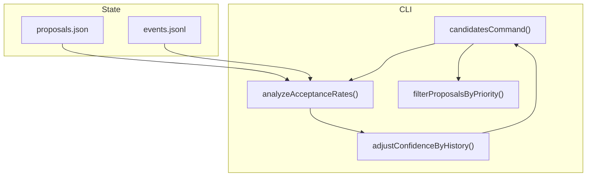
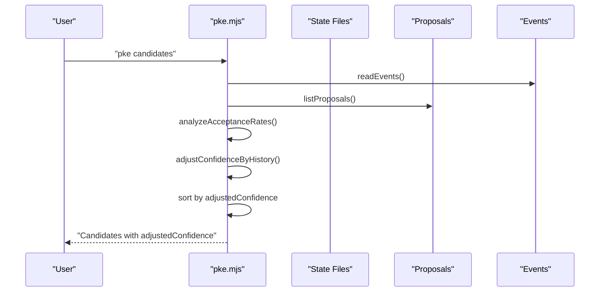
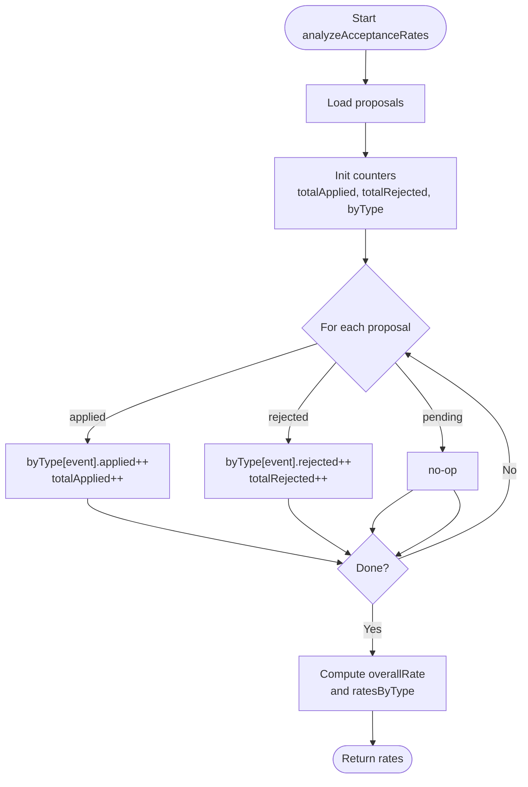
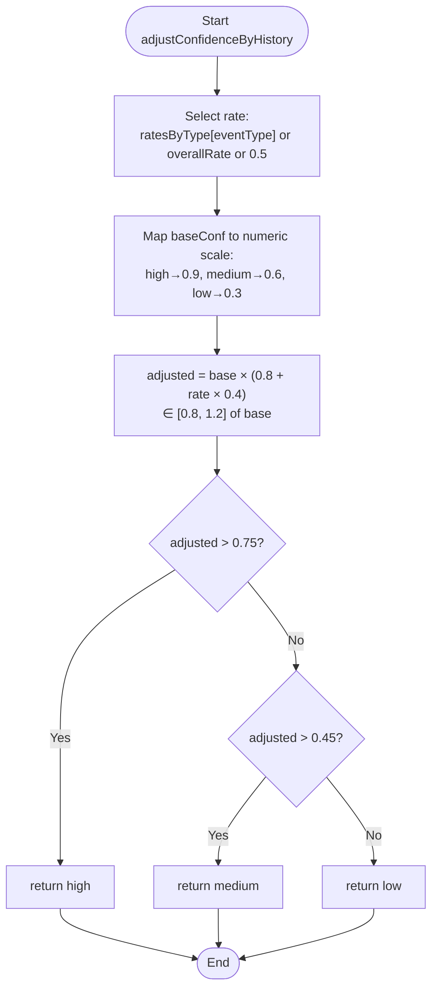
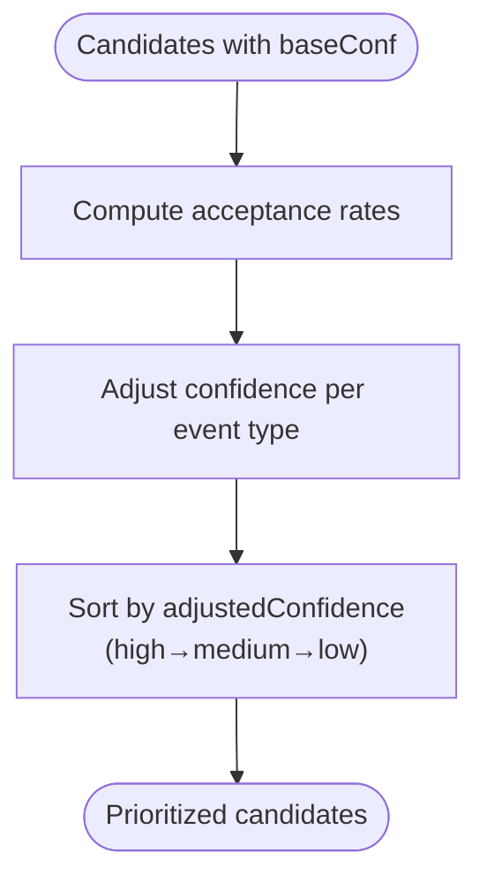
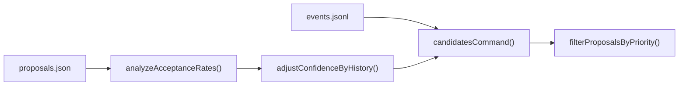

# Confidence Scoring and Adjustment

<cite>
**Referenced Files in This Document**
- [pke.mjs](file://scripts/pke.mjs)
- [README.md](file://README.md)
- [docs/prd.md](file://docs/prd.md)
- [docs/implementation-backlog.md](file://docs/implementation-backlog.md)
</cite>

## Table of Contents
1. [Introduction](#introduction)
2. [Project Structure](#project-structure)
3. [Core Components](#core-components)
4. [Architecture Overview](#architecture-overview)
5. [Detailed Component Analysis](#detailed-component-analysis)
6. [Dependency Analysis](#dependency-analysis)
7. [Performance Considerations](#performance-considerations)
8. [Troubleshooting Guide](#troubleshooting-guide)
9. [Conclusion](#conclusion)

## Introduction
This document explains the confidence scoring and adjustment system used in proposal generation. It covers:
- Base confidence levels (high, medium, low) and how they are assigned to candidates
- Historical acceptance history adjustment that modifies confidence scores
- Analysis of acceptance rates (overall and per-event-type)
- Confidence ordering and how adjusted confidence affects candidate prioritization
- Examples of confidence calculations and adjustment scenarios
- Impact of historical data on candidate ranking
- Relationship between confidence scores and proposal safety controls

## Project Structure
The confidence system is implemented in the main CLI script and documented across the PRD and implementation backlog:
- Confidence assignment and adjustment logic live in the CLI script
- Candidate generation and sorting rely on confidence adjustments
- Safety controls tie confidence to fast-path approval eligibility

**Diagram sources**
- [pke.mjs:508-547](file://scripts/pke.mjs#L508-L547)
- [pke.mjs:929-967](file://scripts/pke.mjs#L929-L967)
- [pke.mjs:973-979](file://scripts/pke.mjs#L973-L979)
- [pke.mjs:1140-1151](file://scripts/pke.mjs#L1140-L1151)

**Section sources**
- [README.md:115-118](file://README.md#L115-L118)
- [docs/implementation-backlog.md:9-163](file://docs/implementation-backlog.md#L9-L163)

## Core Components
- Base confidence assignment: candidates are initially created with a base confidence (defaulting to medium).
- Acceptance history analysis: computes overall and per-event-type acceptance rates from proposals.
- Confidence adjustment: scales base confidence using a multiplicative factor informed by acceptance rates.
- Ordering and prioritization: sorts candidates by adjusted confidence (high to low) for presentation and daily proposal rate limiting.

Key implementation locations:
- Candidate generation and confidence adjustment: [pke.mjs:508-547](file://scripts/pke.mjs#L508-L547)
- Acceptance rate analysis: [pke.mjs:929-967](file://scripts/pke.mjs#L929-L967)
- Confidence adjustment function: [pke.mjs:973-979](file://scripts/pke.mjs#L973-L979)
- Daily proposal prioritization: [pke.mjs:1140-1151](file://scripts/pke.mjs#L1140-L1151)

**Section sources**
- [pke.mjs:508-547](file://scripts/pke.mjs#L508-L547)
- [pke.mjs:929-967](file://scripts/pke.mjs#L929-L967)
- [pke.mjs:973-979](file://scripts/pke.mjs#L973-L979)
- [pke.mjs:1140-1151](file://scripts/pke.mjs#L1140-L1151)

## Architecture Overview
The confidence adjustment pipeline connects event logs and proposal state to influence candidate ranking.

**Diagram sources**
- [pke.mjs:508-547](file://scripts/pke.mjs#L508-L547)
- [pke.mjs:929-967](file://scripts/pke.mjs#L929-L967)
- [pke.mjs:973-979](file://scripts/pke.mjs#L973-L979)

## Detailed Component Analysis

### Base Confidence Assignment
- Candidates derive a base confidence from their creation context; if unset, it defaults to medium.
- This base confidence is later adjusted based on historical acceptance patterns.

Implementation references:
- Default base confidence and candidate creation: [pke.mjs:518-527](file://scripts/pke.mjs#L518-L527)

**Section sources**
- [pke.mjs:518-527](file://scripts/pke.mjs#L518-L527)

### Acceptance Rate Analysis
- The system aggregates proposal statuses to compute:
  - Overall acceptance rate (applied / (applied + rejected))
  - Per-event-type acceptance rates (fallback to overall if unavailable)
- These rates inform how confidence is adjusted for each candidate.

Algorithm highlights:
- Iterates through proposals to count applied/rejected per event type
- Computes overall rate and per-type rates
- Returns structured rates for downstream use

References:
- [pke.mjs:929-967](file://scripts/pke.mjs#L929-L967)

**Diagram sources**
- [pke.mjs:929-967](file://scripts/pke.mjs#L929-L967)

**Section sources**
- [pke.mjs:929-967](file://scripts/pke.mjs#L929-L967)

### Confidence Adjustment Function
- Input: base confidence (high/medium/low), event type, computed acceptance rates
- Method: maps base confidence to a numeric scale, multiplies by a factor derived from acceptance rate (bounded to 80–120%), then maps back to discrete levels
- Output: adjusted confidence level (high/medium/low)

Adjustment behavior:
- Higher acceptance rates increase adjusted confidence
- Lower acceptance rates decrease adjusted confidence
- The multiplicative factor ensures bounded adjustment within 80–120% of base confidence

References:
- [pke.mjs:973-979](file://scripts/pke.mjs#L973-L979)

**Diagram sources**
- [pke.mjs:973-979](file://scripts/pke.mjs#L973-L979)

**Section sources**
- [pke.mjs:973-979](file://scripts/pke.mjs#L973-L979)

### Confidence Ordering and Candidate Prioritization
- After adjustment, candidates are sorted by adjusted confidence (high to low).
- This ordering influences:
  - Presentation in the candidates list
  - Daily proposal rate limiting (top candidates selected first)
- The ordering map assigns weights: high=3, medium=2, low=1.

References:
- Sorting and ordering: [pke.mjs:527-530](file://scripts/pke.mjs#L527-L530)
- Daily prioritization: [pke.mjs:1140-1151](file://scripts/pke.mjs#L1140-L1151)

**Diagram sources**
- [pke.mjs:527-530](file://scripts/pke.mjs#L527-L530)
- [pke.mjs:1140-1151](file://scripts/pke.mjs#L1140-L1151)

**Section sources**
- [pke.mjs:527-530](file://scripts/pke.mjs#L527-L530)
- [pke.mjs:1140-1151](file://scripts/pke.mjs#L1140-L1151)

### Examples and Adjustment Scenarios
Below are scenario descriptions illustrating how acceptance history affects confidence and ranking. These examples are conceptual and demonstrate expected outcomes without quoting code.

- Scenario A: An event type historically has a high acceptance rate
  - Effect: Candidates from this event type receive a higher adjusted confidence, pushing them toward the top of the ranked list.
- Scenario B: An event type historically has a low acceptance rate
  - Effect: Candidates from this event type receive a lower adjusted confidence, reducing their prominence in rankings.
- Scenario C: Mixed event types in a single batch
  - Effect: Each candidate’s confidence is adjusted independently based on its event type’s acceptance rate; the final order reflects these adjusted scores.

These scenarios are derived from the acceptance rate analysis and adjustment function described above.

[No sources needed since this subsection provides conceptual examples]

### Relationship Between Confidence Scores and Safety Controls
- Confidence is displayed on proposals and pages to maintain transparency.
- Safety gates remain strict: proposals still require explicit approval before writing.
- Fast-path approval eligibility is tied to confidence and patch safety:
  - High-confidence append-only proposals targeting safe sections (Evidence, Open Questions) may qualify for batch-safe approval.
  - Batch-safe approval bypasses manual review for eligible proposals while retaining backups and audit trails.

References:
- Proposal confidence field: [docs/prd.md:687-688](file://docs/prd.md#L687-L688)
- Batch-safe fast-path: [docs/implementation-backlog.md:156-157](file://docs/implementation-backlog.md#L156-L157)
- Safety controls overview: [README.md:198-211](file://README.md#L198-L211)

**Section sources**
- [docs/prd.md:687-688](file://docs/prd.md#L687-L688)
- [docs/implementation-backlog.md:156-157](file://docs/implementation-backlog.md#L156-L157)
- [README.md:198-211](file://README.md#L198-L211)

## Dependency Analysis
The confidence adjustment system depends on:
- Proposal state for computing acceptance rates
- Event logs for candidate generation and event typing
- Ordering logic for prioritization

**Diagram sources**
- [pke.mjs:508-547](file://scripts/pke.mjs#L508-L547)
- [pke.mjs:929-967](file://scripts/pke.mjs#L929-L967)
- [pke.mjs:973-979](file://scripts/pke.mjs#L973-L979)
- [pke.mjs:1140-1151](file://scripts/pke.mjs#L1140-L1151)

**Section sources**
- [pke.mjs:508-547](file://scripts/pke.mjs#L508-L547)
- [pke.mjs:929-967](file://scripts/pke.mjs#L929-L967)
- [pke.mjs:973-979](file://scripts/pke.mjs#L973-L979)
- [pke.mjs:1140-1151](file://scripts/pke.mjs#L1140-L1151)

## Performance Considerations
- Acceptance rate computation scans proposal state; keep proposal counts reasonable to avoid heavy scans.
- Candidate ranking occurs after confidence adjustment; sorting cost scales with candidate count.
- Event log rotation and retention policies help maintain manageable histories for analysis.

[No sources needed since this section provides general guidance]

## Troubleshooting Guide
Common issues and resolutions:
- No historical data to adjust confidence
  - Cause: Very few or no proposals have been applied/rejected yet.
  - Effect: Adjustment falls back to overall rate or neutral default; candidates appear with base confidence ordering.
  - Action: Review and act on proposals to build acceptance history.
- Unexpected ranking changes
  - Cause: Shifts in acceptance rates for specific event types.
  - Effect: Candidates’ adjusted confidence changes, altering their rank.
  - Action: Inspect recent proposal approvals/rejections and event-type trends.
- Misclassification of event types
  - Cause: Proposal trigger/event type mismatch.
  - Effect: Per-event-type acceptance rates misrepresent candidate quality.
  - Action: Verify event types and proposal triggers; ensure consistent labeling.

**Section sources**
- [pke.mjs:929-967](file://scripts/pke.mjs#L929-L967)
- [pke.mjs:973-979](file://scripts/pke.mjs#L973-L979)

## Conclusion
The confidence scoring and adjustment system uses historical acceptance rates to dynamically refine candidate prioritization. By mapping base confidence to adjusted confidence and sorting accordingly, the system improves signal-to-noise in candidate lists. Safety remains paramount: explicit approval is always required, and fast-path approvals are restricted to high-confidence, append-only changes in safe sections. As acceptance history grows, confidence adjustments become more predictive, helping users focus on the highest-quality candidates.