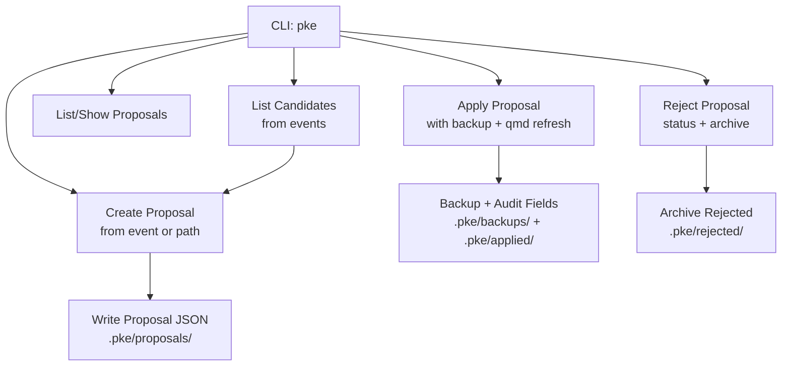
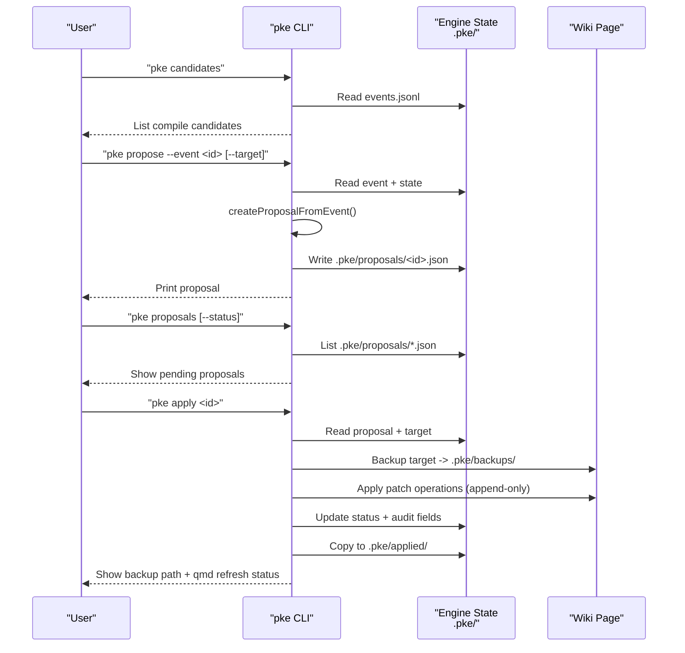
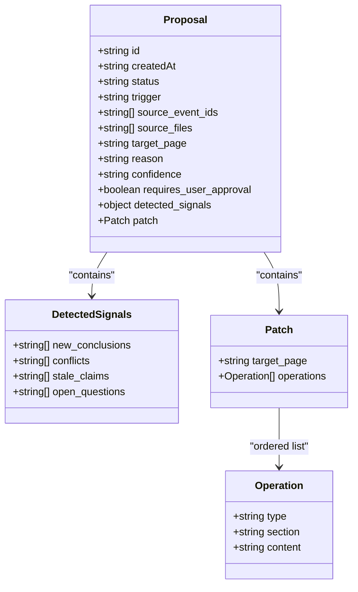
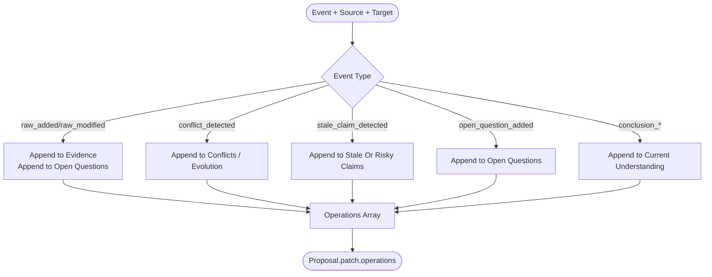
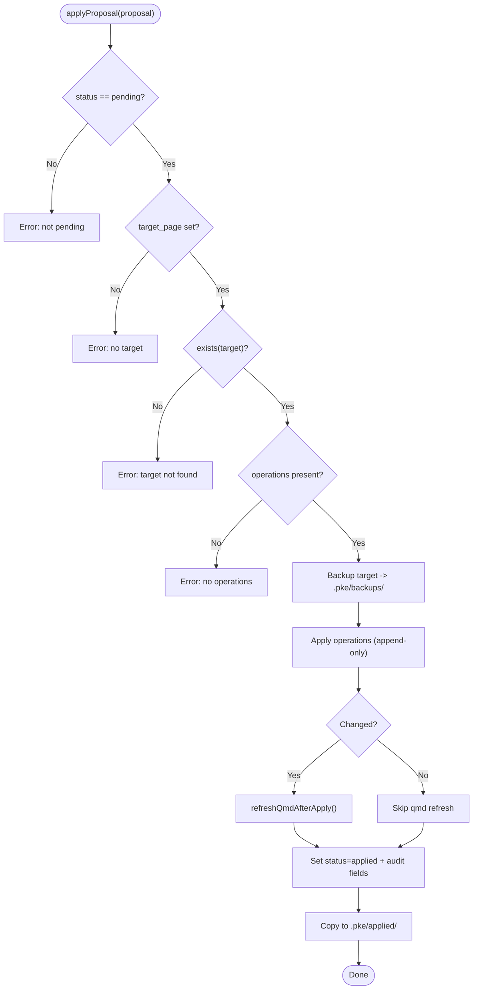
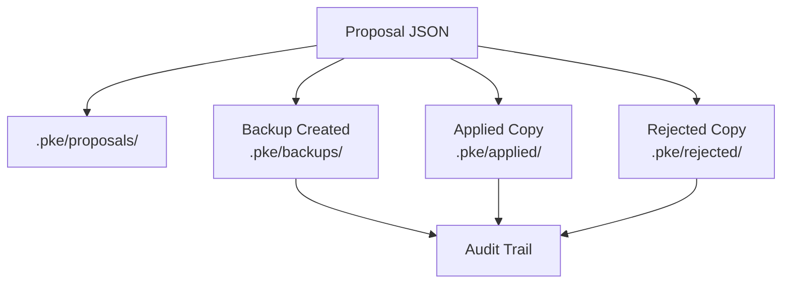
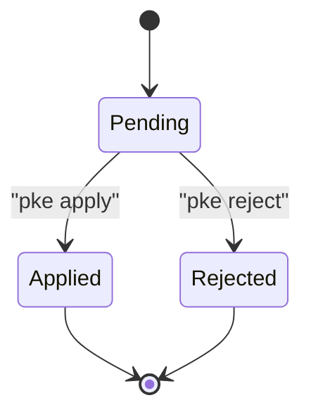
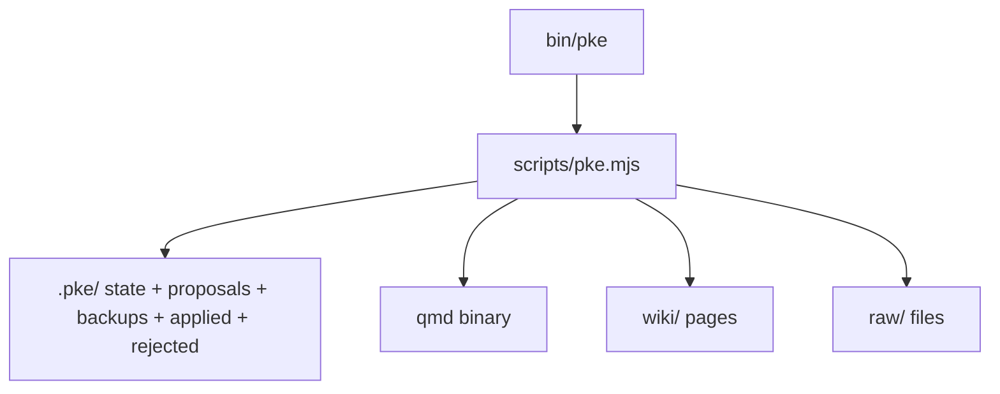

# Proposal Creation from Candidates

<cite>
**Referenced Files in This Document**
- [README.md](file://README.md)
- [package.json](file://package.json)
- [bin/pke](file://bin/pke)
- [scripts/pke.mjs](file://scripts/pke.mjs)
- [docs/prd.md](file://docs/prd.md)
- [docs/implementation-backlog.md](file://docs/implementation-backlog.md)
- [docs/prd-validation-checklist.md](file://docs/prd-validation-checklist.md)
</cite>

## Table of Contents
1. [Introduction](#introduction)
2. [Project Structure](#project-structure)
3. [Core Components](#core-components)
4. [Architecture Overview](#architecture-overview)
5. [Detailed Component Analysis](#detailed-component-analysis)
6. [Dependency Analysis](#dependency-analysis)
7. [Performance Considerations](#performance-considerations)
8. [Troubleshooting Guide](#troubleshooting-guide)
9. [Conclusion](#conclusion)
10. [Appendices](#appendices)

## Introduction
This document explains how the Personal Knowledge Engine transforms compile candidates into formal proposals, focusing on the proposal object model, patch generation, validation and safety checks, persistence and audit, and lifecycle management integrated with approval and application. It synthesizes the proposal workflow from the repository’s CLI, implementation backlog, and PRD.

## Project Structure
The proposal creation process is implemented in a single Node.js module that exposes a CLI. The CLI delegates to internal functions that:
- Discover compile candidates from monitor events
- Build proposals with exact patch operations
- Persist proposals to disk
- Validate and apply proposals with backups and qmd refresh

**Diagram sources**
- [scripts/pke.mjs:80-96](file://scripts/pke.mjs#L80-L96)
- [scripts/pke.mjs:508-547](file://scripts/pke.mjs#L508-L547)
- [scripts/pke.mjs:549-560](file://scripts/pke.mjs#L549-L560)
- [scripts/pke.mjs:562-583](file://scripts/pke.mjs#L562-L583)
- [scripts/pke.mjs:585-600](file://scripts/pke.mjs#L585-L600)
- [scripts/pke.mjs:662-672](file://scripts/pke.mjs#L662-L672)
- [scripts/pke.mjs:1559-1567](file://scripts/pke.mjs#L1559-L1567)
- [scripts/pke.mjs:1603-1632](file://scripts/pke.mjs#L1603-L1632)
- [scripts/pke.mjs:1635-1641](file://scripts/pke.mjs#L1635-L1641)

**Section sources**
- [README.md:56-80](file://README.md#L56-L80)
- [bin/pke:1-10](file://bin/pke#L1-L10)
- [package.json:7-9](file://package.json#L7-L9)

## Core Components
- Candidate discovery: Filters monitor events to compile-trigger types and ranks by confidence adjusted via acceptance history.
- Proposal creation: Builds a proposal object with metadata, source files, target page, reason, confidence, and a patch with append-only operations.
- Patch generation: Produces exact wiki update instructions targeting safe sections based on event type.
- Validation and safety: Enforces proposal-only mode, checks pending status, target existence, and idempotent append behavior.
- Persistence and audit: Writes proposals to .pke/proposals/, maintains backups, and archives applied/rejected proposals.
- Lifecycle: Supports listing, showing, applying (with fast-path for safe proposals), and rejecting proposals.

**Section sources**
- [scripts/pke.mjs:508-547](file://scripts/pke.mjs#L508-L547)
- [scripts/pke.mjs:1454-1481](file://scripts/pke.mjs#L1454-L1481)
- [scripts/pke.mjs:1483-1524](file://scripts/pke.mjs#L1483-L1524)
- [scripts/pke.mjs:602-610](file://scripts/pke.mjs#L602-L610)
- [scripts/pke.mjs:1559-1567](file://scripts/pke.mjs#L1559-L1567)
- [scripts/pke.mjs:1603-1632](file://scripts/pke.mjs#L1603-L1632)
- [scripts/pke.mjs:662-672](file://scripts/pke.mjs#L662-L672)

## Architecture Overview
The proposal workflow sits between knowledge monitoring and wiki updates. It ensures that wiki writes are proposal-only and require explicit approval.

**Diagram sources**
- [scripts/pke.mjs:508-547](file://scripts/pke.mjs#L508-L547)
- [scripts/pke.mjs:549-560](file://scripts/pke.mjs#L549-L560)
- [scripts/pke.mjs:562-583](file://scripts/pke.mjs#L562-L583)
- [scripts/pke.mjs:585-600](file://scripts/pke.mjs#L585-L600)
- [scripts/pke.mjs:1603-1632](file://scripts/pke.mjs#L1603-L1632)
- [scripts/pke.mjs:1635-1641](file://scripts/pke.mjs#L1635-L1641)

## Detailed Component Analysis

### Proposal Object Model
A proposal is a JSON object persisted under .pke/proposals/ with the following structure and semantics:
- Metadata: id, createdAt, status, trigger, source_event_ids, source_files, target_page, reason, confidence, requires_user_approval.
- Signals: detected_signals grouping new_conclusions, conflicts, stale_claims, open_questions.
- Patch: target_page and ordered operations array.
- Operations: append_to_section targeting safe sections (Evidence, Open Questions, Conflicts / Evolution, Stale Or Risky Claims, Related Pages).
- Post-apply fields: appliedAt, backupPath, changeReport (with target, changed, beforeSha256, afterSha256, operations count, qmdRefresh status).
- Post-reject fields: rejectedAt.

**Diagram sources**
- [docs/prd.md:638-696](file://docs/prd.md#L638-L696)
- [scripts/pke.mjs:1454-1481](file://scripts/pke.mjs#L1454-L1481)
- [scripts/pke.mjs:1483-1524](file://scripts/pke.mjs#L1483-L1524)

**Section sources**
- [docs/prd.md:638-696](file://docs/prd.md#L638-L696)
- [scripts/pke.mjs:1454-1481](file://scripts/pke.mjs#L1454-L1481)
- [scripts/pke.mjs:1603-1632](file://scripts/pke.mjs#L1603-L1632)

### Patch Generation Process
Patch operations are constructed from a compile candidate and the detected event type:
- Raw evidence additions/modifications: append to Evidence and Open Questions.
- Conflict detection: append to Conflicts / Evolution.
- Stale claim detection: append to Stale Or Risky Claims.
- Open question addition: append to Open Questions.
- Conclusion changes: append to Current Understanding.

The generator builds deterministic content with contextual metadata (e.g., source link and date) and targets safe sections only.

**Diagram sources**
- [scripts/pke.mjs:1483-1524](file://scripts/pke.mjs#L1483-L1524)

**Section sources**
- [scripts/pke.mjs:1483-1524](file://scripts/pke.mjs#L1483-L1524)

### Proposal Validation and Safety Checks
Before applying a proposal:
- Status must be pending.
- Target page must exist.
- Patch must contain operations.
- Operations are append-only and idempotent; duplicates are skipped.
- A backup of the target is created before any write.
- After successful application, qmd update and embed are attempted; results recorded in changeReport.

**Diagram sources**
- [scripts/pke.mjs:1603-1632](file://scripts/pke.mjs#L1603-L1632)
- [scripts/pke.mjs:1635-1641](file://scripts/pke.mjs#L1635-L1641)
- [scripts/pke.mjs:1660-1665](file://scripts/pke.mjs#L1660-L1665)

**Section sources**
- [scripts/pke.mjs:602-610](file://scripts/pke.mjs#L602-L610)
- [scripts/pke.mjs:1603-1632](file://scripts/pke.mjs#L1603-L1632)
- [scripts/pke.mjs:1660-1665](file://scripts/pke.mjs#L1660-L1665)

### Proposal Persistence and Audit Trail
- Storage: .pke/proposals/<proposal-id>.json
- Limits: pending proposals cap enforced with a warning.
- Audit: backups stored under .pke/backups/<proposal-id>-<encoded-target-path>; applied proposals copied to .pke/applied/; rejected proposals copied to .pke/rejected/.
- Change report: SHA-256 hashes, operation count, qmd refresh outcomes.

**Diagram sources**
- [scripts/pke.mjs:1559-1567](file://scripts/pke.mjs#L1559-L1567)
- [scripts/pke.mjs:1635-1641](file://scripts/pke.mjs#L1635-L1641)
- [scripts/pke.mjs:1603-1632](file://scripts/pke.mjs#L1603-L1632)
- [scripts/pke.mjs:662-672](file://scripts/pke.mjs#L662-L672)

**Section sources**
- [scripts/pke.mjs:1559-1567](file://scripts/pke.mjs#L1559-L1567)
- [scripts/pke.mjs:1603-1632](file://scripts/pke.mjs#L1603-L1632)
- [scripts/pke.mjs:1635-1641](file://scripts/pke.mjs#L1635-L1641)
- [scripts/pke.mjs:662-672](file://scripts/pke.mjs#L662-L672)

### Examples: From Candidate to Final Proposal
- Raw evidence added: Proposal appends to Evidence and Open Questions, sets confidence medium if target is known.
- Conflict detected: Proposal appends to Conflicts / Evolution.
- Stale claim detected: Proposal appends to Stale Or Risky Claims.
- Open question added: Proposal appends to Open Questions.
- Conclusion changed: Proposal appends to Current Understanding.

These examples reflect the deterministic mapping from event type to patch operations.

**Section sources**
- [scripts/pke.mjs:1483-1524](file://scripts/pke.mjs#L1483-L1524)
- [docs/prd.md:638-676](file://docs/prd.md#L638-L676)

### Proposal Lifecycle Management and Approval Integration
- Discovery: pke candidates lists compile-trigger events and suggests targets.
- Creation: pke propose builds a proposal with exact patch operations and persists it.
- Review: pke proposals lists pending proposals; pke proposal shows full details.
- Approval: pke apply validates and applies the proposal; supports fast-path for safe proposals.
- Rejection: pke reject updates status and archives the proposal.
- Self-improvement: Daily compilation can generate proposals with rate limiting and confidence adjustments.

**Diagram sources**
- [scripts/pke.mjs:585-600](file://scripts/pke.mjs#L585-L600)
- [scripts/pke.mjs:662-672](file://scripts/pke.mjs#L662-L672)
- [scripts/pke.mjs:221-285](file://scripts/pke.mjs#L221-L285)

**Section sources**
- [README.md:185-211](file://README.md#L185-L211)
- [scripts/pke.mjs:508-547](file://scripts/pke.mjs#L508-L547)
- [scripts/pke.mjs:549-560](file://scripts/pke.mjs#L549-L560)
- [scripts/pke.mjs:562-583](file://scripts/pke.mjs#L562-L583)
- [scripts/pke.mjs:585-600](file://scripts/pke.mjs#L585-L600)
- [scripts/pke.mjs:612-660](file://scripts/pke.mjs#L612-L660)
- [scripts/pke.mjs:662-672](file://scripts/pke.mjs#L662-L672)
- [scripts/pke.mjs:221-285](file://scripts/pke.mjs#L221-L285)

## Dependency Analysis
- CLI entrypoint: bin/pke invokes scripts/pke.mjs.
- Commands: Implemented in scripts/pke.mjs; rely on local filesystem (.pke/) and qmd integration.
- Data dependencies: events.jsonl, state.json, wiki pages, raw files.
- Safety: Append-only operations, backups, pending-only application, qmd refresh post-apply.

**Diagram sources**
- [bin/pke:1-10](file://bin/pke#L1-L10)
- [scripts/pke.mjs:1-30](file://scripts/pke.mjs#L1-L30)
- [scripts/pke.mjs:1603-1665](file://scripts/pke.mjs#L1603-L1665)

**Section sources**
- [bin/pke:1-10](file://bin/pke#L1-L10)
- [scripts/pke.mjs:1-30](file://scripts/pke.mjs#L1-L30)
- [scripts/pke.mjs:1603-1665](file://scripts/pke.mjs#L1603-L1665)

## Performance Considerations
- Event log rotation prevents unbounded growth.
- Proposal caps and candidate caps reduce overhead.
- Idempotent append avoids redundant writes.
- qmd refresh is executed only after successful changes.

[No sources needed since this section provides general guidance]

## Troubleshooting Guide
Common issues and remedies:
- Proposal not found: Verify proposal-id and .pke/proposals/ location.
- Target not found: Ensure the target wiki page exists before applying.
- Not pending: Only pending proposals can be applied; recreate if status changed.
- No operations: Recreate proposal with a valid target to generate patch operations.
- Pending cap exceeded: Review and act on older proposals to stay within limits.
- Event log rotation: Investigate .pke/events-archive/ for older entries.

**Section sources**
- [scripts/pke.mjs:1569-1573](file://scripts/pke.mjs#L1569-L1573)
- [scripts/pke.mjs:1603-1609](file://scripts/pke.mjs#L1603-L1609)
- [scripts/pke.mjs:1560-1567](file://scripts/pke.mjs#L1560-L1567)
- [scripts/pke.mjs:1396-1410](file://scripts/pke.mjs#L1396-L1410)

## Conclusion
The proposal creation process converts meaningful knowledge events into precise, append-only patch instructions stored as JSON. It enforces proposal-only wiki updates, maintains backups and audit trails, and integrates with approval and application workflows. Confidence adjustments and rate limits further refine the quality and throughput of the pipeline.

## Appendices

### Appendix A: CLI Commands Related to Proposals
- pke candidates: List compile-trigger events and suggested targets.
- pke propose: Create a proposal from an event-id or a raw file path with optional target override.
- pke proposals: List all proposals with optional status filter.
- pke proposal: Show full details of a specific proposal.
- pke apply: Apply a pending proposal with backup and qmd refresh; supports fast-path for safe proposals.
- pke reject: Reject a proposal and archive it.

**Section sources**
- [README.md:73-80](file://README.md#L73-L80)
- [scripts/pke.mjs:80-96](file://scripts/pke.mjs#L80-L96)
- [scripts/pke.mjs:508-547](file://scripts/pke.mjs#L508-L547)
- [scripts/pke.mjs:549-560](file://scripts/pke.mjs#L549-L560)
- [scripts/pke.mjs:562-583](file://scripts/pke.mjs#L562-L583)
- [scripts/pke.mjs:585-600](file://scripts/pke.mjs#L585-L600)
- [scripts/pke.mjs:662-672](file://scripts/pke.mjs#L662-L672)

### Appendix B: Implementation Backlog and PRD Alignment
- Implementation backlog items define the end-to-end workflow from candidates to apply/reject.
- PRD specifies proposal format, append-only patch targeting, and governance constraints.

**Section sources**
- [docs/implementation-backlog.md:66-78](file://docs/implementation-backlog.md#L66-L78)
- [docs/prd.md:356-376](file://docs/prd.md#L356-L376)
- [docs/prd.md:638-696](file://docs/prd.md#L638-L696)