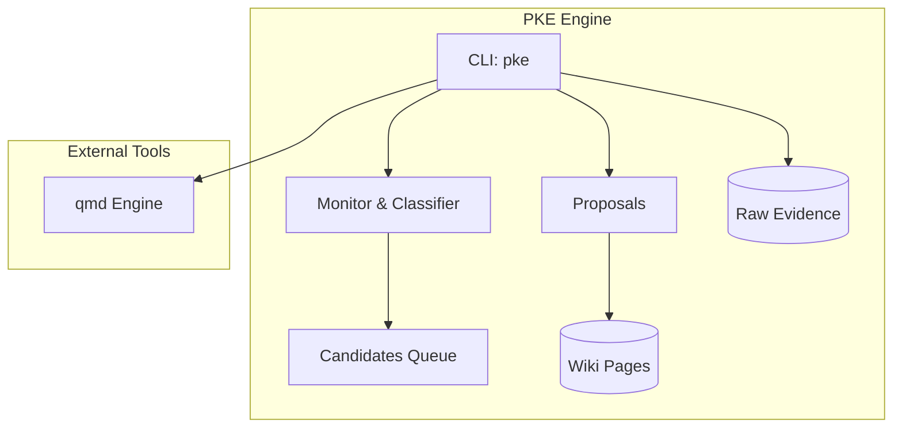
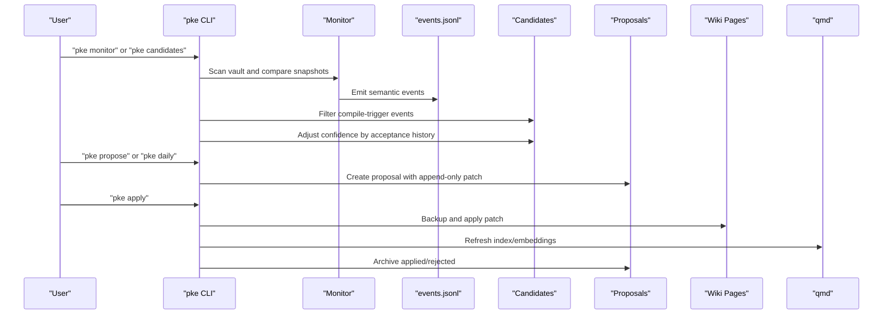
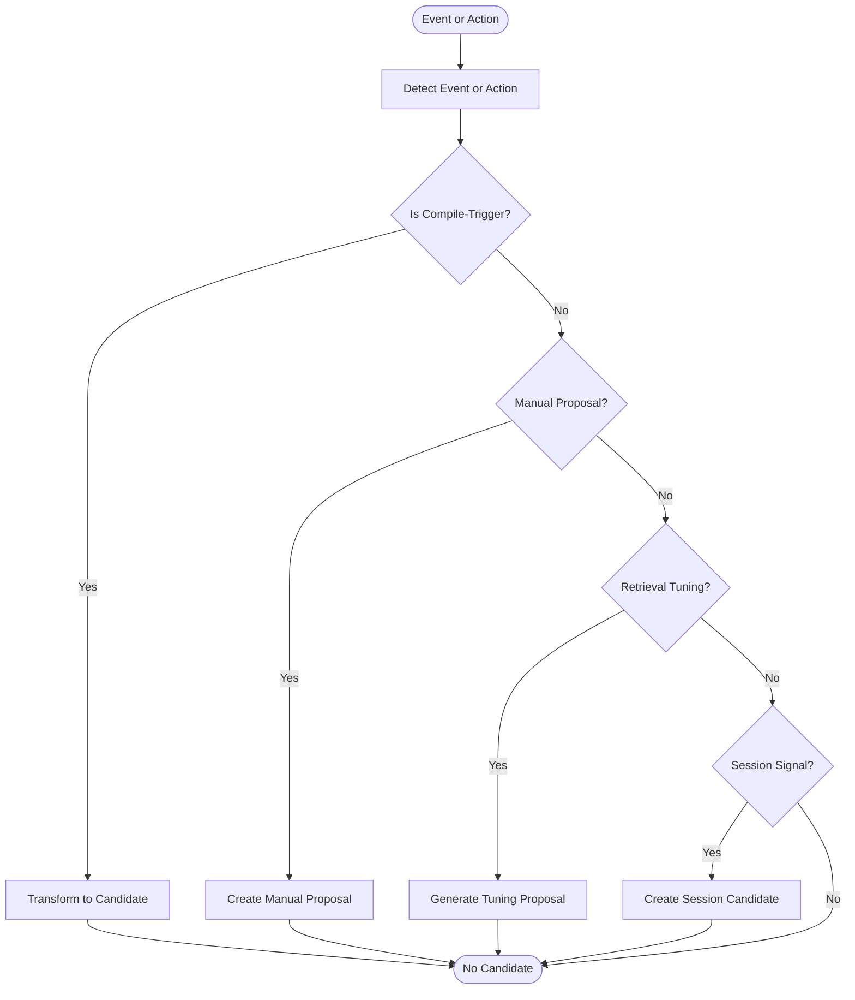
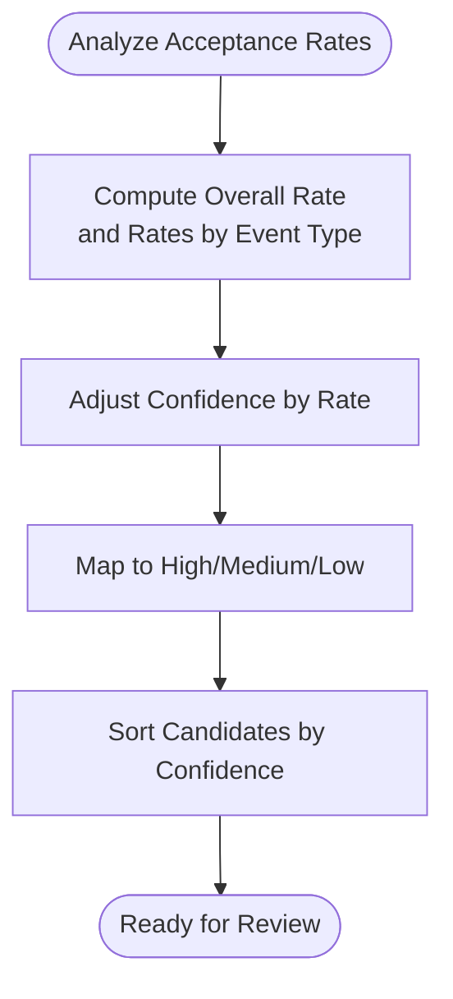
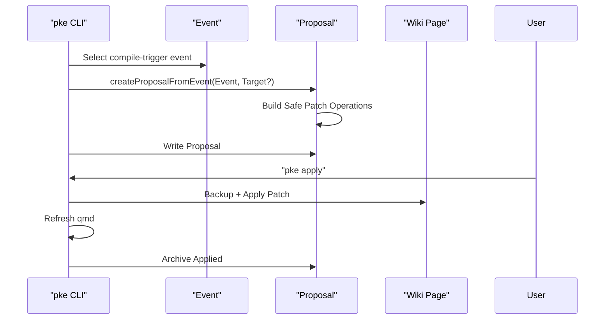
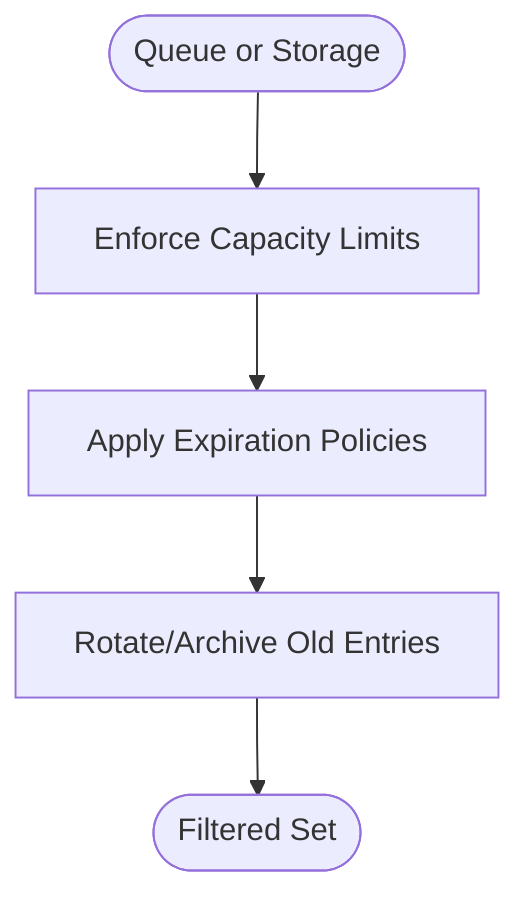
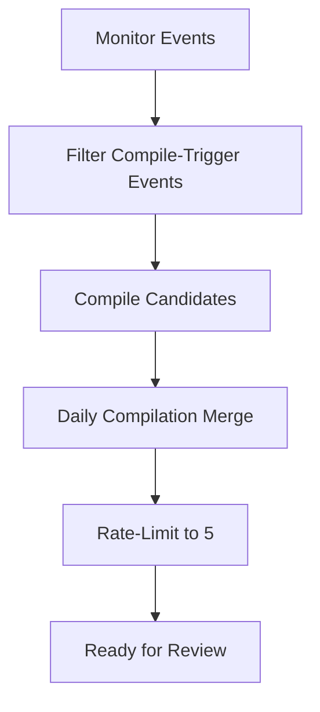
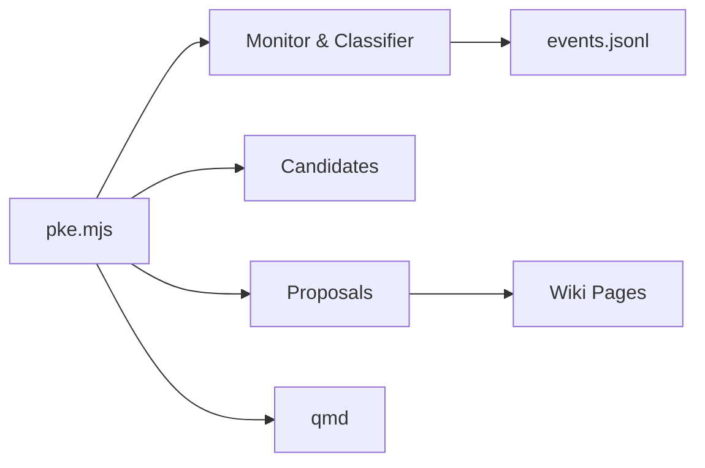

# Proposal Generation and Candidates

<cite>
**Referenced Files in This Document**
- [README.md](file://README.md)
- [package.json](file://package.json)
- [bin/pke](file://bin/pke)
- [scripts/pke.mjs](file://scripts/pke.mjs)
- [docs/prd.md](file://docs/prd.md)
- [docs/implementation-notes.md](file://docs/implementation-notes.md)
- [docs/implementation-backlog.md](file://docs/implementation-backlog.md)
</cite>

## Table of Contents
1. [Introduction](#introduction)
2. [Project Structure](#project-structure)
3. [Core Components](#core-components)
4. [Architecture Overview](#architecture-overview)
5. [Detailed Component Analysis](#detailed-component-analysis)
6. [Dependency Analysis](#dependency-analysis)
7. [Performance Considerations](#performance-considerations)
8. [Troubleshooting Guide](#troubleshooting-guide)
9. [Conclusion](#conclusion)
10. [Appendices](#appendices)

## Introduction
This document explains the proposal generation and candidate identification system that powers the Personal Knowledge Engine (PKE). It describes how the system identifies potential wiki updates from file changes, semantic events, and user actions; how candidates are evaluated using confidence scoring and acceptance history adjustments; and how different sources contribute to the candidate pool. It also documents filtering mechanisms such as maximum limits, expiration policies, and sensitivity thresholds, and provides examples of candidate creation from various sources along with the relationship between events and compile candidates.

## Project Structure
The PKE system is a local-first CLI and dashboard that operates on a vault with raw evidence and wiki knowledge pages. The proposal and candidate system lives in the main CLI implementation and is complemented by documentation that defines the data models and workflows.

**Diagram sources**
- [scripts/pke.mjs:48-97](file://scripts/pke.mjs#L48-L97)
- [scripts/pke.mjs:738-785](file://scripts/pke.mjs#L738-L785)
- [scripts/pke.mjs:1454-1481](file://scripts/pke.mjs#L1454-L1481)

**Section sources**
- [README.md:1-211](file://README.md#L1-L211)
- [package.json:1-18](file://package.json#L1-L18)
- [bin/pke:1-10](file://bin/pke#L1-L10)

## Core Components
- Candidate generation from monitor events: The monitor detects file-level and knowledge-level changes and emits structured events. Compile-trigger events are filtered and transformed into candidates.
- Candidate evaluation: Each candidate carries a reason, suggested target, and confidence. Confidence is adjusted by historical acceptance rates.
- Proposal creation: From candidates, proposals are generated with exact, append-only patch operations targeting safe wiki sections.
- Proposal lifecycle: Proposals are stored, reviewed, and applied with backups and qmd refresh.
- Filtering and limits: Maximum candidates, expiration, proposal caps, and daily proposal rate limiting.

**Section sources**
- [scripts/pke.mjs:508-547](file://scripts/pke.mjs#L508-L547)
- [scripts/pke.mjs:924-979](file://scripts/pke.mjs#L924-L979)
- [scripts/pke.mjs:1454-1481](file://scripts/pke.mjs#L1454-L1481)
- [scripts/pke.mjs:1559-1567](file://scripts/pke.mjs#L1559-L1567)
- [scripts/pke.mjs:221-285](file://scripts/pke.mjs#L221-L285)

## Architecture Overview
The proposal and candidate system integrates with the monitor, event log, and proposal storage. It uses acceptance history to refine confidence and ranks candidates for daily review.

**Diagram sources**
- [scripts/pke.mjs:738-785](file://scripts/pke.mjs#L738-L785)
- [scripts/pke.mjs:1421-1452](file://scripts/pke.mjs#L1421-L1452)
- [scripts/pke.mjs:508-547](file://scripts/pke.mjs#L508-L547)
- [scripts/pke.mjs:924-979](file://scripts/pke.mjs#L924-L979)
- [scripts/pke.mjs:1454-1481](file://scripts/pke.mjs#L1454-L1481)
- [scripts/pke.mjs:1603-1633](file://scripts/pke.mjs#L1603-L1633)

## Detailed Component Analysis

### Candidate Identification and Sources
- Compile-trigger events: Raw file additions/modifications, wiki modifications, and semantic events (conclusions, conflicts, stale claims, open questions) are treated as compile candidates.
- Manual proposals: Users can create proposals from a specific source file or an existing event.
- Retrieval tuning opportunities: The system can generate self-improvement proposals to create or improve wiki pages for topics with frequent events and missing coverage.
- Session intelligence: Transcripts can be scanned for durable signals and turned into compile candidates.

**Diagram sources**
- [scripts/pke.mjs:1421-1452](file://scripts/pke.mjs#L1421-L1452)
- [scripts/pke.mjs:549-560](file://scripts/pke.mjs#L549-L560)
- [scripts/pke.mjs:987-1059](file://scripts/pke.mjs#L987-L1059)
- [scripts/pke.mjs:396-418](file://scripts/pke.mjs#L396-L418)

**Section sources**
- [scripts/pke.mjs:1421-1452](file://scripts/pke.mjs#L1421-L1452)
- [scripts/pke.mjs:549-560](file://scripts/pke.mjs#L549-L560)
- [scripts/pke.mjs:987-1059](file://scripts/pke.mjs#L987-L1059)
- [scripts/pke.mjs:396-418](file://scripts/pke.mjs#L396-L418)

### Candidate Evaluation: Confidence Scoring and Acceptance History Adjustment
- Base confidence: Derived from the candidate’s nature (e.g., raw evidence vs. missing page).
- Acceptance history adjustment: Historical acceptance rates by event type inform confidence adjustment. The adjustment scales around a base confidence and maps to high/medium/low.
- Sorting: Candidates are sorted by adjusted confidence (highest first).

**Diagram sources**
- [scripts/pke.mjs:930-967](file://scripts/pke.mjs#L930-L967)
- [scripts/pke.mjs:973-979](file://scripts/pke.mjs#L973-L979)
- [scripts/pke.mjs:529-531](file://scripts/pke.mjs#L529-L531)

**Section sources**
- [scripts/pke.mjs:930-979](file://scripts/pke.mjs#L930-L979)
- [scripts/pke.mjs:529-531](file://scripts/pke.mjs#L529-L531)

### Proposal Creation and Patch Operations
- Proposal creation: From an event or manual source, a proposal is created with a unique ID, trigger, source files, target page, reason, confidence, and detected signals.
- Patch operations: Append-only operations target safe sections (Evidence, Open Questions, Conflicts/Evolution, Stale/Risky Claims, Current Understanding). Operations are idempotent and avoid duplicates.
- Target selection: Suggested target is inferred from source; user can override with a target page.

**Diagram sources**
- [scripts/pke.mjs:1454-1481](file://scripts/pke.mjs#L1454-L1481)
- [scripts/pke.mjs:1483-1524](file://scripts/pke.mjs#L1483-L1524)
- [scripts/pke.mjs:1603-1633](file://scripts/pke.mjs#L1603-L1633)

**Section sources**
- [scripts/pke.mjs:1454-1524](file://scripts/pke.mjs#L1454-L1524)
- [scripts/pke.mjs:1603-1633](file://scripts/pke.mjs#L1603-L1633)

### Candidate Filtering Mechanisms
- Maximum candidates: The candidates queue is capped at 100.
- Expiration: Candidates expire after 30 days.
- Proposal caps: Pending proposals are limited to 200; warnings are issued when exceeded.
- Daily proposal rate limiting: During daily compilation, at most 5 proposals are shown/created.
- Event retention: The event log is rotated when exceeding 100,000 entries.
- Report retention: Reports older than 90 days are archived.

**Diagram sources**
- [scripts/pke.mjs:508-517](file://scripts/pke.mjs#L508-L517)
- [scripts/pke.mjs:1560-1567](file://scripts/pke.mjs#L1560-L1567)
- [scripts/pke.mjs:226-233](file://scripts/pke.mjs#L226-L233)
- [scripts/pke.mjs:1396-1410](file://scripts/pke.mjs#L1396-L1410)
- [scripts/pke.mjs:1947-1961](file://scripts/pke.mjs#L1947-L1961)

**Section sources**
- [scripts/pke.mjs:508-517](file://scripts/pke.mjs#L508-L517)
- [scripts/pke.mjs:1560-1567](file://scripts/pke.mjs#L1560-L1567)
- [scripts/pke.mjs:226-233](file://scripts/pke.mjs#L226-L233)
- [scripts/pke.mjs:1396-1410](file://scripts/pke.mjs#L1396-L1410)
- [scripts/pke.mjs:1947-1961](file://scripts/pke.mjs#L1947-L1961)

### Examples of Candidate Creation
- From monitor events:
  - Raw evidence added or modified: candidate suggests reviewing and linking evidence.
  - Wiki section changes (conflict, stale claim, open question, conclusion): candidate suggests updating the corresponding knowledge section.
- Manual proposal:
  - User creates a proposal from a specific raw file or an existing event with a chosen target wiki page.
- Retrieval tuning:
  - Topic with frequent events and missing wiki coverage: proposal to create a new knowledge page.
- Session intelligence:
  - Transcript scanned for durable signals: candidate to review and compile relevant insights.

**Section sources**
- [scripts/pke.mjs:1444-1452](file://scripts/pke.mjs#L1444-L1452)
- [scripts/pke.mjs:549-560](file://scripts/pke.mjs#L549-L560)
- [scripts/pke.mjs:987-1059](file://scripts/pke.mjs#L987-L1059)
- [scripts/pke.mjs:396-418](file://scripts/pke.mjs#L396-L418)

### Relationship Between Events and Compile Candidates
- Compile-trigger events are a subset of semantic events emitted by the monitor. These include raw file events and knowledge section events.
- Candidates are derived from these events and include a reason, suggested target, and confidence.
- The daily compilation workflow merges compile candidates with retrieval tuning proposals and applies rate limiting.

**Diagram sources**
- [scripts/pke.mjs:1421-1432](file://scripts/pke.mjs#L1421-L1432)
- [scripts/pke.mjs:1434-1442](file://scripts/pke.mjs#L1434-L1442)
- [scripts/pke.mjs:226-233](file://scripts/pke.mjs#L226-L233)

**Section sources**
- [scripts/pke.mjs:1421-1442](file://scripts/pke.mjs#L1421-L1442)
- [scripts/pke.mjs:226-233](file://scripts/pke.mjs#L226-L233)

## Dependency Analysis
- CLI depends on monitor state, event log, and proposal storage.
- Monitor depends on vault scanning and section parsing.
- Proposal application depends on wiki page existence and qmd refresh.

**Diagram sources**
- [scripts/pke.mjs:48-97](file://scripts/pke.mjs#L48-L97)
- [scripts/pke.mjs:738-785](file://scripts/pke.mjs#L738-L785)
- [scripts/pke.mjs:1603-1633](file://scripts/pke.mjs#L1603-L1633)

**Section sources**
- [scripts/pke.mjs:48-97](file://scripts/pke.mjs#L48-L97)
- [scripts/pke.mjs:738-785](file://scripts/pke.mjs#L738-L785)
- [scripts/pke.mjs:1603-1633](file://scripts/pke.mjs#L1603-L1633)

## Performance Considerations
- File size limits: Oversized files are skipped with warnings to maintain scan performance.
- Event log rotation: Prevents unbounded growth of the event log.
- Report retention: Archives older reports to manage disk usage.
- Daily rate limiting: Reduces cognitive load and prevents proposal overload.

[No sources needed since this section provides general guidance]

## Troubleshooting Guide
- Candidates not appearing:
  - Ensure monitor has run and events are present.
  - Verify compile-trigger event types are included.
- Confidence not adjusting:
  - Confirm there are sufficient proposals with statuses to compute acceptance rates.
- Proposal not applying:
  - Check proposal status is pending and target page exists.
  - Review qmd refresh errors in the change report.
- Exceeded limits:
  - Review pending proposal cap and consider archiving/reviewing older proposals.
  - Check candidate queue size and expiration policy.

**Section sources**
- [scripts/pke.mjs:1560-1567](file://scripts/pke.mjs#L1560-L1567)
- [scripts/pke.mjs:1603-1633](file://scripts/pke.mjs#L1603-L1633)
- [scripts/pke.mjs:1396-1410](file://scripts/pke.mjs#L1396-L1410)
- [scripts/pke.mjs:1947-1961](file://scripts/pke.mjs#L1947-L1961)

## Conclusion
The proposal generation and candidate identification system in PKE is designed to be conservative and approval-gated. It transforms observable changes and user actions into precise, append-only proposals that preserve the integrity of the knowledge base. Confidence scoring and acceptance history refinement help prioritize high-quality candidates, while strict filtering and limits ensure manageable throughput. Together, these mechanisms support controlled self-improvement and robust knowledge maintenance.

[No sources needed since this section summarizes without analyzing specific files]

## Appendices

### Appendix A: Data Models and Artifacts
- Event log: Append-only JSONL of semantic events.
- Monitor state: Snapshot of files and wiki sections for incremental detection.
- Proposals: JSON files representing append-only patch operations.
- Reports: Markdown summaries of monitor scans.

**Section sources**
- [docs/prd.md:544-626](file://docs/prd.md#L544-L626)
- [docs/implementation-notes.md:50-113](file://docs/implementation-notes.md#L50-L113)