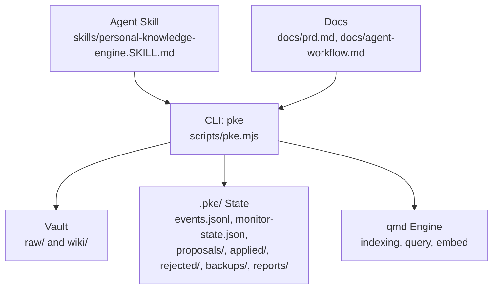
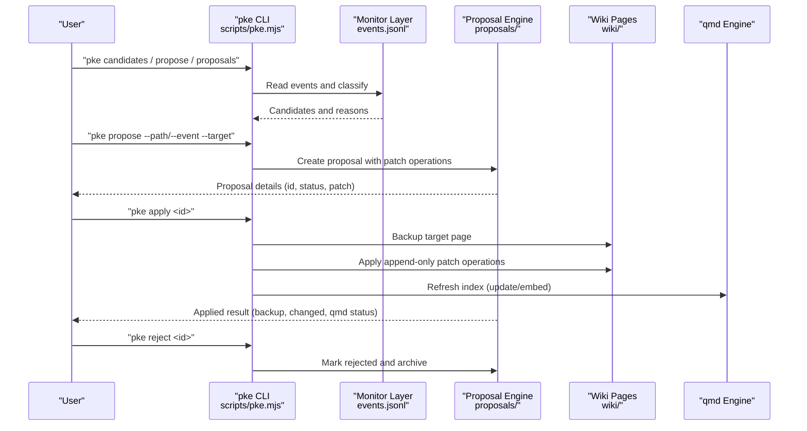
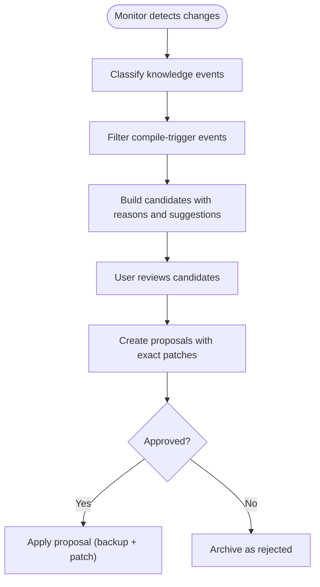
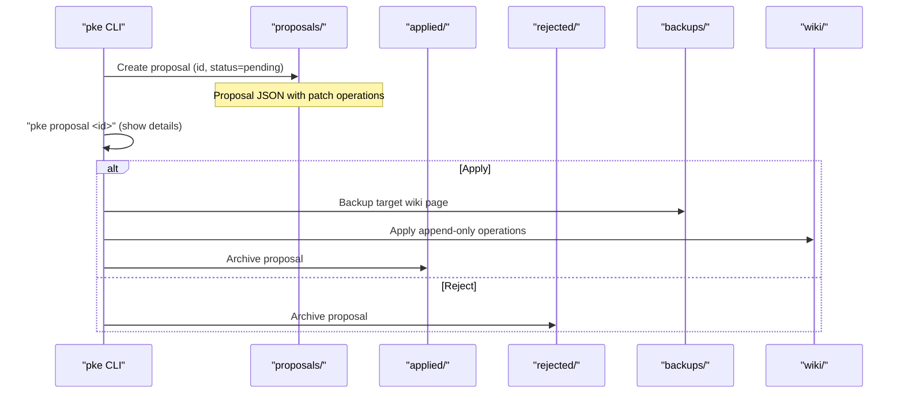
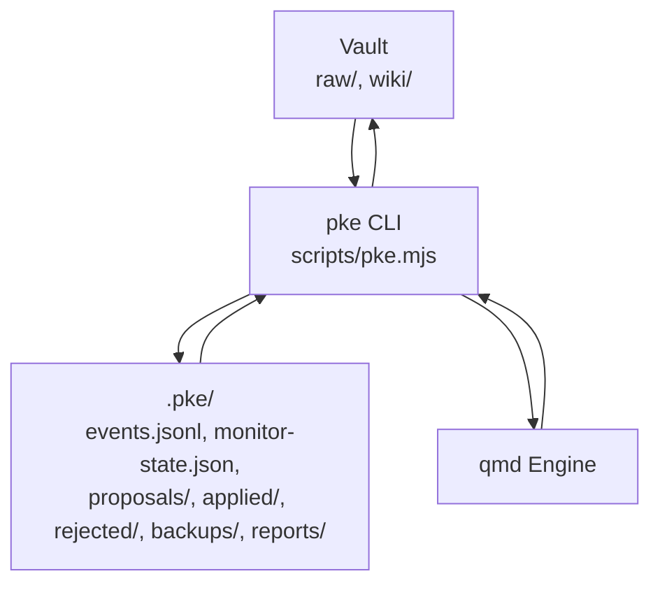

# Proposal System and Governance

<cite>
**Referenced Files in This Document**
- [README.md](file://README.md)
- [package.json](file://package.json)
- [pke.mjs](file://scripts/pke.mjs)
- [personal-knowledge-engine.SKILL.md](file://skills/personal-knowledge-engine.SKILL.md)
- [agent-workflow.md](file://docs/agent-workflow.md)
- [prd.md](file://docs/prd.md)
</cite>

## Table of Contents
1. [Introduction](#introduction)
2. [Project Structure](#project-structure)
3. [Core Components](#core-components)
4. [Architecture Overview](#architecture-overview)
5. [Detailed Component Analysis](#detailed-component-analysis)
6. [Dependency Analysis](#dependency-analysis)
7. [Performance Considerations](#performance-considerations)
8. [Troubleshooting Guide](#troubleshooting-guide)
9. [Conclusion](#conclusion)

## Introduction
This document explains the Personal Knowledge Engine proposal system and governance model. The system is designed around a strict proposal-only architecture that prevents unauthorized wiki modifications. All knowledge updates require explicit user commands, approvals, or scheduled operations. The controlled self-improvement process includes candidates, proposals, approval workflow, batch processing, and safety controls. Governance gates ensure that wiki writes are never performed silently, and the system maintains an audit trail and backup system for all changes.

## Project Structure
The repository organizes the Personal Knowledge Engine around:
- A CLI entry point (pke) implemented in a single script
- Vault layout with raw evidence and wiki knowledge pages
- Operational state under .pke (events, proposals, backups, reports)
- Agent skill instructions and documentation

**Diagram sources**
- [pke.mjs](file://scripts/pke.mjs)
- [personal-knowledge-engine.SKILL.md](file://skills/personal-knowledge-engine.SKILL.md)
- [agent-workflow.md](file://docs/agent-workflow.md)
- [prd.md](file://docs/prd.md)

**Section sources**
- [README.md](file://README.md)
- [package.json](file://package.json)

## Core Components
- Proposal-only architecture: Wiki writes are gated and never automatic. All compile outputs are proposals requiring explicit approval.
- Candidates: Events and changed files are filtered into compile candidates based on semantic triggers.
- Proposals: Exact, append-only patch operations targeting safe wiki sections.
- Approval workflow: Users can review, approve, or reject proposals; approved proposals are applied atomically with backups.
- Safety controls: Append-only sections, backups, audit trail, rate limits, and retention policies.
- Governance gates: Explicit user commands, approvals, scheduled workflows, or session close summaries.

**Section sources**
- [README.md](file://README.md)
- [pke.mjs](file://scripts/pke.mjs)
- [agent-workflow.md](file://docs/agent-workflow.md)
- [personal-knowledge-engine.SKILL.md](file://skills/personal-knowledge-engine.SKILL.md)
- [prd.md](file://docs/prd.md)

## Architecture Overview
The proposal system integrates monitoring, classification, proposal generation, and approval into a cohesive pipeline. The engine observes changes, classifies knowledge events, builds compile candidates, generates proposals with precise patches, and applies them only upon explicit user approval.

**Diagram sources**
- [pke.mjs](file://scripts/pke.mjs)
- [agent-workflow.md](file://docs/agent-workflow.md)
- [personal-knowledge-engine.SKILL.md](file://skills/personal-knowledge-engine.SKILL.md)
- [prd.md](file://docs/prd.md)

## Detailed Component Analysis

### Proposal-Only Architecture
- Wiki writes are intentionally conservative and require a definite update clue.
- Update gates include explicit user commands, explicit approval of a proposed update, session close summaries with permission, or scheduled/daily workflows.
- Without a definite update clue, the system answers or proposes; it does not silently write knowledge.

**Section sources**
- [README.md](file://README.md)
- [agent-workflow.md](file://docs/agent-workflow.md)
- [personal-knowledge-engine.SKILL.md](file://skills/personal-knowledge-engine.SKILL.md)
- [prd.md](file://docs/prd.md)

### Candidates and Compile Triggers
- Candidates are derived from knowledge events and changed files.
- Compile-trigger events include raw additions/modifications, wiki modifications, conflicts, stale claims, open questions, and conclusion changes.
- Candidates are filtered and optionally adjusted by acceptance history to prioritize high-confidence proposals.

**Diagram sources**
- [pke.mjs](file://scripts/pke.mjs)
- [prd.md](file://docs/prd.md)

**Section sources**
- [pke.mjs](file://scripts/pke.mjs)
- [prd.md](file://docs/prd.md)

### Proposal Lifecycle
- Creation: From an event or source file, a proposal is created with a unique ID, trigger, source files, target page, reason, confidence, and patch operations.
- Patch operations: Append-only operations targeting safe sections (Evidence, Open Questions, Conflicts/Evolution, Stale/Risky Claims, Current Understanding for conclusion events).
- Approval: User can review and approve or reject proposals.
- Application: Approved proposals are applied atomically with pre-apply backups and qmd refresh attempts.

**Diagram sources**
- [pke.mjs](file://scripts/pke.mjs)
- [prd.md](file://docs/prd.md)

**Section sources**
- [pke.mjs](file://scripts/pke.mjs)
- [prd.md](file://docs/prd.md)

### Batch Processing and Fast-Path Approval
- Safe proposals can be batch-applied when they meet specific criteria (e.g., high confidence and append-only operations to safe sections).
- A fast-path allows batch-safe approval without manual review for eligible proposals.
- Batch operations are logged with event entries for traceability.

**Section sources**
- [pke.mjs](file://scripts/pke.mjs)

### Audit Trail and Backup System
- Every proposal carries metadata (id, createdAt, status, trigger, source_event_ids, source_files, target_page, reason, confidence).
- On apply, the system backs up the target wiki page and records change details (before/after SHA-256, operations count, qmd refresh status).
- Rejected proposals are archived separately for historical tracking.

**Section sources**
- [pke.mjs](file://scripts/pke.mjs)
- [prd.md](file://docs/prd.md)

### Governance Gates and Controlled Self-Improvement
- Governance gates: explicit user commands, explicit approval, scheduled workflows (daily compilation), or session close summaries.
- Self-improvement proposals (e.g., retrieval tuning) follow the same approval gates as regular compile proposals.
- The system distinguishes between raw evidence (append-only) and curated knowledge (requires approval).

**Section sources**
- [README.md](file://README.md)
- [agent-workflow.md](file://docs/agent-workflow.md)
- [personal-knowledge-engine.SKILL.md](file://skills/personal-knowledge-engine.SKILL.md)
- [pke.mjs](file://scripts/pke.mjs)
- [prd.md](file://docs/prd.md)

### Examples of Proposal Workflows and Governance Scenarios
- Scenario A: Raw evidence added → candidate identified → proposal created → user approves → wiki updated with backup and qmd refresh.
- Scenario B: Wiki modified with conflict → candidate identified → proposal created → user rejects → proposal archived as rejected.
- Scenario C: Scheduled daily compilation → candidates filtered and prioritized → user reviews and approves top proposals.
- Scenario D: Session close summary → durable signals extracted → proposal created → user approves → wiki updated.

**Section sources**
- [pke.mjs](file://scripts/pke.mjs)
- [agent-workflow.md](file://docs/agent-workflow.md)
- [personal-knowledge-engine.SKILL.md](file://skills/personal-knowledge-engine.SKILL.md)
- [prd.md](file://docs/prd.md)

## Dependency Analysis
The proposal system depends on:
- Vault structure (raw/, wiki/)
- Operational state (.pke/ with events.jsonl, monitor-state.json, proposals/, applied/, rejected/, backups/, reports/)
- qmd engine for indexing, query, and embedding
- CLI commands orchestrating the entire pipeline

**Diagram sources**
- [pke.mjs](file://scripts/pke.mjs)
- [prd.md](file://docs/prd.md)

**Section sources**
- [pke.mjs](file://scripts/pke.mjs)
- [prd.md](file://docs/prd.md)

## Performance Considerations
- The system is optimized for local-first operations with minimal external dependencies.
- Monitoring uses scoped polling to avoid watching entire vaults, reducing resource usage.
- Rate limiting and caps (e.g., daily proposal limit, proposal cap) help manage throughput.
- qmd refresh occurs only after successful application of proposals.

[No sources needed since this section provides general guidance]

## Troubleshooting Guide
Common issues and resolutions:
- qmd failures: The CLI surfaces qmd stderr; ensure qmd is installed and available in PATH.
- Proposal errors: apply validates proposal status, target existence, and patch operations; fix by recreating or selecting a valid target.
- File system errors: Directory creation uses recursive flags; ensure sufficient disk space and permissions.
- Event log rotation: Excess events are archived to maintain performance and storage limits.

**Section sources**
- [pke.mjs](file://scripts/pke.mjs)
- [prd.md](file://docs/prd.md)

## Conclusion
The Personal Knowledge Engine’s proposal system and governance model enforce a strict, proposal-only architecture that prevents unauthorized wiki modifications. Through candidates, proposals, approval workflows, batch processing, and safety controls, the system ensures that knowledge evolution is deliberate, auditable, and aligned with user intent. Governance gates, audit trails, and backups provide robust safeguards, while controlled self-improvement enables continuous enhancement of retrieval and compilation quality.