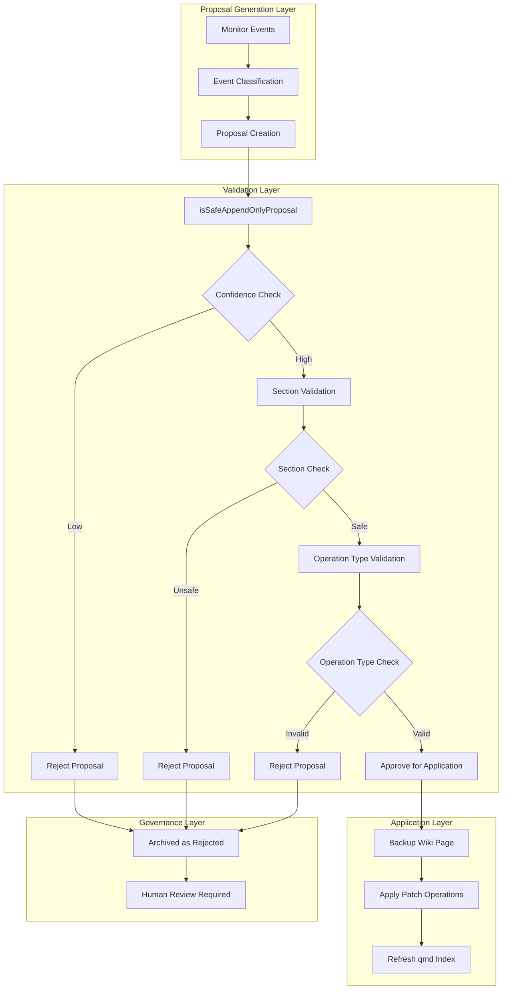
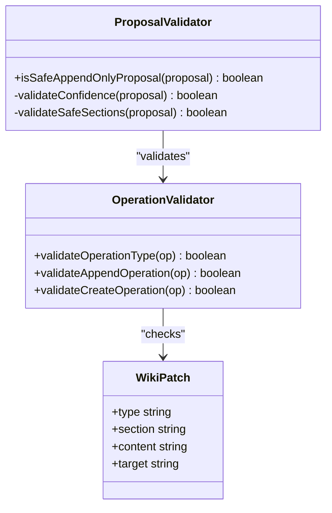
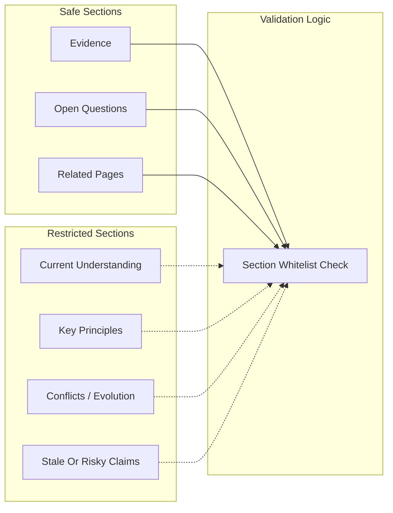
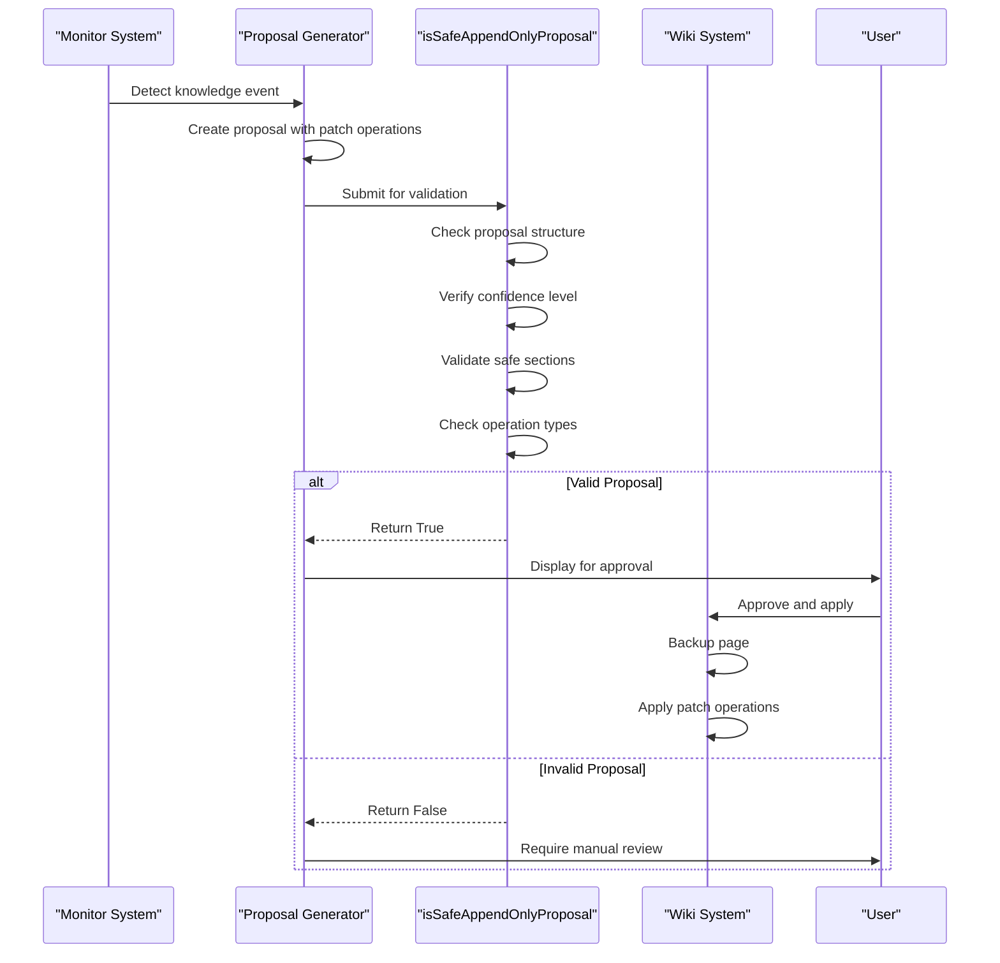

# Append-Only Validation System

<cite>
**Referenced Files in This Document**
- [pke.mjs](file://scripts/pke.mjs)
- [README.md](file://README.md)
- [prd.md](file://docs/prd.md)
- [implementation-notes.md](file://docs/implementation-notes.md)
- [implementation-backlog.md](file://docs/implementation-backlog.md)
- [prd-validation-checklist.md](file://docs/prd-validation-checklist.md)
</cite>

## Table of Contents
1. [Introduction](#introduction)
2. [System Architecture](#system-architecture)
3. [Core Validation Components](#core-validation-components)
4. [Operation Type Validation](#operation-type-validation)
5. [Section Validation System](#section-validation-system)
6. [Safe Section Configuration](#safe-section-configuration)
7. [Validation Flow Analysis](#validation-flow-analysis)
8. [Examples of Valid Operations](#examples-of-valid-operations)
9. [Examples of Invalid Modifications](#examples-of-invalid-modifications)
10. [Security Benefits](#security-benefits)
11. [Performance Considerations](#performance-considerations)
12. [Troubleshooting Guide](#troubleshooting-guide)
13. [Conclusion](#conclusion)

## Introduction

The Personal Knowledge Engine (PKE) implements a robust append-only validation system designed to prevent unauthorized wiki modifications while enabling beneficial incremental updates. This system enforces strict governance over knowledge compilation, ensuring that wiki pages remain trustworthy repositories of compiled knowledge rather than dumping grounds for unvetted content.

The validation system operates through a comprehensive safety model that validates proposals before any wiki modifications occur. This approach prevents the common failure mode where AI agents or automated systems might pollute durable knowledge with temporary or unverified information.

## System Architecture

The append-only validation system is built around several key architectural components that work together to ensure safe knowledge compilation:



**Diagram sources**
- [pke.mjs:602-610](file://scripts/pke.mjs#L602-L610)
- [pke.mjs:1603-1633](file://scripts/pke.mjs#L1603-L1633)

The system follows a multi-layered validation approach where each proposal must pass through increasingly strict checks before any wiki modifications occur.

## Core Validation Components

### Primary Validation Function

The heart of the validation system is the `isSafeAppendOnlyProposal` function, which serves as the primary gatekeeper for wiki modifications:

```mermaid
flowchart TD
A[Proposal Input] --> B[Validate Proposal Structure]
B --> C{Has Patch Operations?}
C --> |No| D[Return False]
C --> |Yes| E[Check Confidence Level]
E --> F{Confidence == "high"?}
F --> |No| G[Return False]
F --> |Yes| H[Validate Safe Sections]
H --> I{All Operations in Safe Sections?}
I --> |No| J[Return False]
I --> |Yes| K[Validate Operation Types]
K --> L{All Operations are Valid?}
L --> |No| M[Return False]
L --> |Yes| N[Return True]
```

**Diagram sources**
- [pke.mjs:602-610](file://scripts/pke.mjs#L602-L610)

### Validation Criteria

The system evaluates proposals based on four primary criteria:

1. **Proposal Structure Validation**: Ensures the proposal contains valid patch operations
2. **Confidence Level Assessment**: Requires high confidence for automatic approval
3. **Section Safety Validation**: Restricts operations to predefined safe sections
4. **Operation Type Validation**: Limits operations to append-only types

**Section sources**
- [pke.mjs:602-610](file://scripts/pke.mjs#L602-L610)

## Operation Type Validation

The validation system strictly controls the types of operations that can be applied to wiki pages. Currently, only two operation types are permitted:

### Allowed Operation Types

1. **append_to_section**: Adds content to existing wiki sections
2. **create_page**: Creates new wiki pages (limited scenarios)

### Operation Type Enforcement

The system validates operation types through the `isSafeAppendOnlyProposal` function, which ensures that every operation in a proposal matches one of these allowed types. This restriction prevents destructive operations like page deletion, content replacement, or arbitrary file modifications.



**Diagram sources**
- [pke.mjs:602-610](file://scripts/pke.mjs#L602-L610)
- [pke.mjs:1483-1524](file://scripts/pke.mjs#L1483-L1524)

**Section sources**
- [pke.mjs:1483-1524](file://scripts/pke.mjs#L1483-L1524)

## Section Validation System

### Safe Section Configuration

The validation system maintains a whitelist of safe sections where append-only operations are permitted. These sections are carefully chosen to support knowledge compilation while preventing destructive modifications:

| Safe Section | Purpose | Content Type |
|--------------|---------|--------------|
| Evidence | Raw evidence links and supporting materials | Links to source documents |
| Open Questions | Unresolved questions requiring further investigation | Question statements and tracking |
| Related Pages | Links to related knowledge pages | Wikilinks to other wiki pages |
| Conflicts / Evolution | Contradictions and belief evolution | Conflict descriptions and resolution attempts |
| Stale Or Risky Claims | Time-sensitive or unverified claims | Risk assessments and expiration dates |
| Current Understanding | Durable conclusions and principles | Compiled knowledge statements |
| Key Principles | Reusable rules and frameworks | Fundamental principles |

### Section Validation Logic

The section validation process ensures that all operations target only the predefined safe sections. This prevents operations from inadvertently affecting critical sections like Current Understanding or Key Principles, which require human judgment and approval.

**Section sources**
- [pke.mjs:33-41](file://scripts/pke.mjs#L33-L41)
- [pke.mjs:605](file://scripts/pke.mjs#L605)

## Safe Section Configuration

### Current Safe Section List

The system defines the following safe sections for append-only operations:

1. **Evidence**: Contains links to raw evidence sources
2. **Open Questions**: Tracks unresolved questions requiring further investigation  
3. **Related Pages**: Links to related knowledge pages

### Section Selection Rationale

The safe section selection balances the need for knowledge compilation with the requirement to prevent unauthorized modifications to core knowledge sections. The chosen sections support the append-only philosophy while enabling beneficial incremental updates.



**Diagram sources**
- [pke.mjs:605](file://scripts/pke.mjs#L605)

**Section sources**
- [pke.mjs:605](file://scripts/pke.mjs#L605)

## Validation Flow Analysis

### Complete Validation Pipeline

The validation system implements a comprehensive pipeline that evaluates proposals through multiple validation stages:



**Diagram sources**
- [pke.mjs:602-610](file://scripts/pke.mjs#L602-L610)
- [pke.mjs:612-660](file://scripts/pke.mjs#L612-L660)

### Validation Decision Matrix

The system uses a decision matrix to evaluate proposal validity:

| Validation Stage | Pass/Fail | Impact |
|------------------|-----------|---------|
| Proposal Structure | Required | Must have valid patch operations |
| Confidence Level | Required | Must be "high" for automatic approval |
| Safe Sections | Required | All operations must target safe sections |
| Operation Types | Required | Only append_to_section and create_page allowed |

**Section sources**
- [pke.mjs:602-610](file://scripts/pke.mjs#L602-L610)

## Examples of Valid Operations

### Valid Append-Only Operations

The following examples demonstrate operations that would pass validation:

#### Evidence Section Append
- **Operation**: `append_to_section`
- **Section**: Evidence
- **Content**: Link to new raw evidence source
- **Purpose**: Document new supporting evidence

#### Open Questions Append  
- **Operation**: `append_to_section`
- **Section**: Open Questions
- **Content**: New unresolved question requiring investigation
- **Purpose**: Track knowledge gaps

#### Related Pages Append
- **Operation**: `append_to_section`
- **Section**: Related Pages
- **Content**: Link to related knowledge page
- **Purpose**: Build knowledge connections

### Valid Page Creation Operations

#### New Knowledge Page Creation
- **Operation**: `create_page`
- **Target**: New wiki page
- **Template**: Knowledge page template
- **Purpose**: Establish new knowledge area

**Section sources**
- [pke.mjs:1483-1524](file://scripts/pke.mjs#L1483-L1524)

## Examples of Invalid Modifications

### Invalid Operation Types

The following operations would be blocked by validation:

#### Restricted Operation Types
- **Replace Operation**: Attempting to replace existing content
- **Delete Operation**: Removing content from wiki pages  
- **Move Operation**: Moving content between sections
- **Format Change**: Changing content formatting without adding value

#### Unsafe Section Modifications
- **Current Understanding**: Attempting to modify core conclusions
- **Key Principles**: Changing fundamental principles
- **Conflicts / Evolution**: Modifying conflict resolution records
- **Stale Or Risky Claims**: Altering risk assessments

#### Invalid Content Types
- **Personal Notes**: Raw personal thoughts or stream-of-consciousness
- **Temporary Notes**: Temporary reminders or todo items
- **Confidential Information**: Sensitive or confidential content
- **External Links**: Links to external websites or resources

**Section sources**
- [pke.mjs:602-610](file://scripts/pke.mjs#L602-L610)

## Security Benefits

### Protection Against Unauthorized Modifications

The append-only validation system provides several layers of security:

1. **Authorization Control**: Only approved proposals can modify wiki content
2. **Operation Restriction**: Limits operations to append-only types
3. **Section Protection**: Prevents modifications to critical knowledge sections  
4. **Confidence Gates**: Requires high confidence for automatic approval
5. **Audit Trail**: Comprehensive logging of all validation decisions

### Prevention of Knowledge Contamination

The system prevents common knowledge contamination scenarios:

- **AI Pollution**: Prevents AI-generated content from corrupting knowledge
- **Human Error**: Protects against accidental destructive modifications
- **Malicious Intent**: Blocks intentional attempts to compromise knowledge
- **Legacy Issues**: Prevents propagation of outdated or incorrect information

**Section sources**
- [implementation-notes.md:18-30](file://docs/implementation-notes.md#L18-L30)

## Performance Considerations

### Validation Overhead

The validation system introduces minimal performance overhead:

- **Memory Usage**: Validation occurs in memory with minimal footprint
- **Processing Time**: Validation completes in milliseconds for typical proposals
- **Scalability**: System scales linearly with proposal volume
- **Resource Efficiency**: Optimized for high-throughput validation scenarios

### Batch Processing Optimization

The system includes batch processing capabilities for efficient validation:

- **Batch Validation**: Multiple proposals can be validated simultaneously
- **Parallel Processing**: Validation operations can be parallelized
- **Caching**: Frequently accessed validation data can be cached
- **Queue Management**: Efficient handling of proposal queues

**Section sources**
- [pke.mjs:612-660](file://scripts/pke.mjs#L612-L660)

## Troubleshooting Guide

### Common Validation Issues

#### Proposal Rejected Due to Confidence Level
**Symptoms**: Proposal fails validation despite appearing correct
**Cause**: Confidence level is not "high"
**Solution**: Review proposal evidence and increase confidence level

#### Section Validation Failure  
**Symptoms**: Proposal rejected for unknown section errors
**Cause**: Operation targets unsafe section
**Solution**: Modify proposal to target Evidence, Open Questions, or Related Pages sections

#### Operation Type Validation Error
**Symptoms**: Proposal rejected for invalid operation type
**Cause**: Operation type not in allowed list
**Solution**: Use only append_to_section or create_page operations

#### Proposal Structure Issues
**Symptoms**: Immediate rejection without detailed error
**Cause**: Missing patch operations or malformed proposal structure
**Solution**: Regenerate proposal with proper structure

### Debugging Validation Failures

To debug validation failures:

1. **Check Proposal Structure**: Verify proposal contains valid patch operations
2. **Review Confidence Levels**: Ensure confidence is set to "high"
3. **Examine Section Targets**: Confirm all operations target safe sections
4. **Validate Operation Types**: Verify all operations use allowed types
5. **Test Individual Operations**: Validate each operation separately

**Section sources**
- [pke.mjs:602-610](file://scripts/pke.mjs#L602-L610)

## Conclusion

The append-only validation system represents a comprehensive approach to knowledge governance that successfully balances the need for beneficial knowledge compilation with the imperative to prevent unauthorized modifications. Through its multi-layered validation approach, the system ensures that wiki pages remain trustworthy repositories of compiled knowledge while enabling efficient incremental updates.

The system's effectiveness stems from its clear operational boundaries, strict validation criteria, and comprehensive safety mechanisms. By limiting operations to append-only types, restricting modifications to predefined safe sections, and requiring high confidence levels, the system prevents the common pitfalls that plague knowledge management systems.

The validation system's design demonstrates how careful architectural decisions can create robust safety mechanisms without sacrificing usability or performance. As the Personal Knowledge Engine continues to evolve, this foundation provides a secure platform for knowledge compilation and growth.