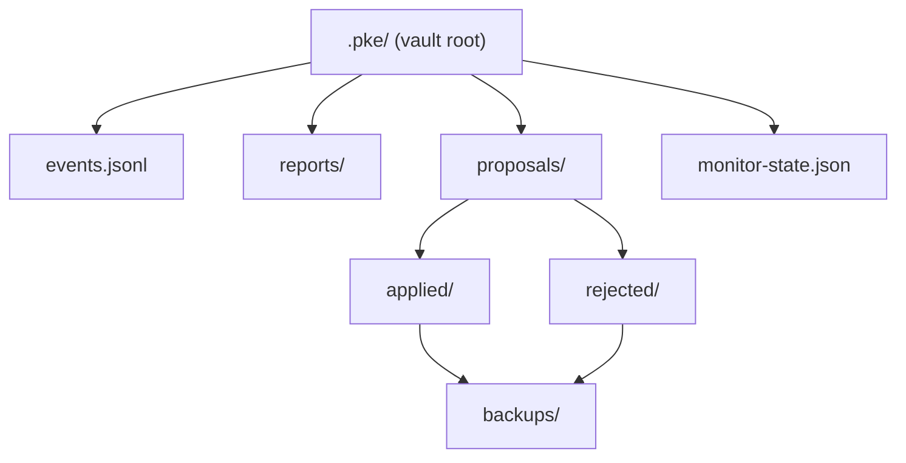
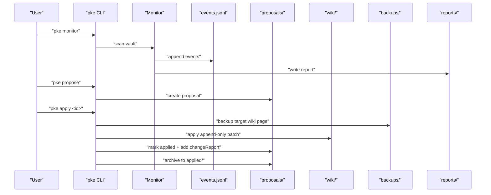
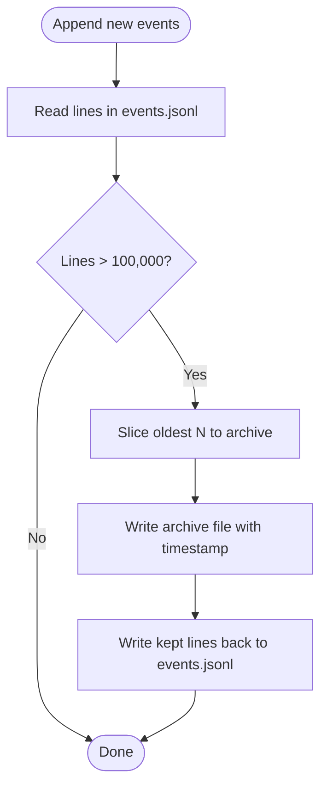
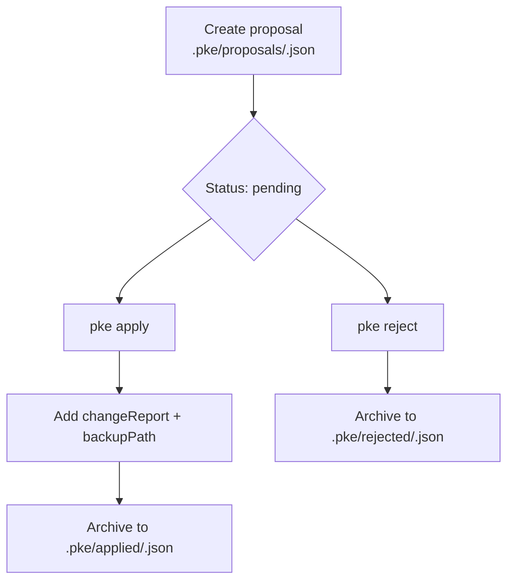
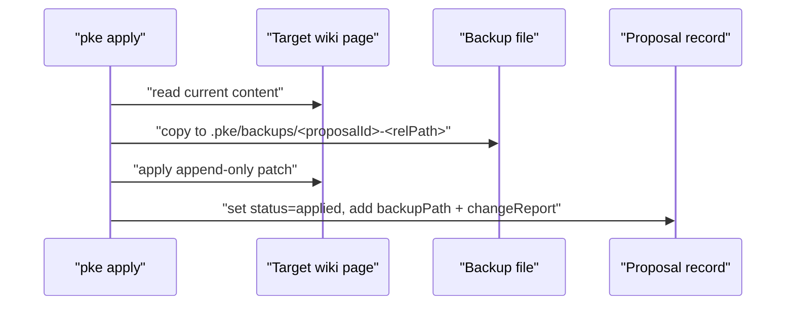
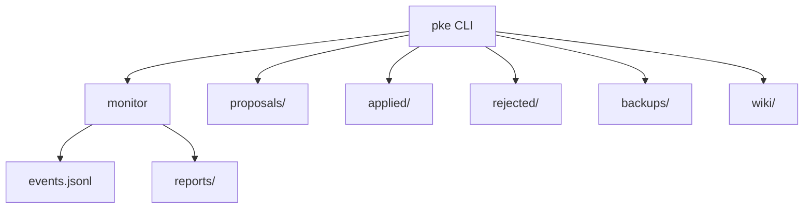

# Audit Trail and Backup Systems

<cite>
**Referenced Files in This Document**
- [README.md](file://README.md)
- [scripts/pke.mjs](file://scripts/pke.mjs)
- [docs/implementation-backlog.md](file://docs/implementation-backlog.md)
- [docs/prd.md](file://docs/prd.md)
- [docs/prd-validation-checklist.md](file://docs/prd-validation-checklist.md)
</cite>

## Table of Contents
1. [Introduction](#introduction)
2. [Project Structure](#project-structure)
3. [Core Components](#core-components)
4. [Architecture Overview](#architecture-overview)
5. [Detailed Component Analysis](#detailed-component-analysis)
6. [Dependency Analysis](#dependency-analysis)
7. [Performance Considerations](#performance-considerations)
8. [Troubleshooting Guide](#troubleshooting-guide)
9. [Conclusion](#conclusion)
10. [Appendices](#appendices)

## Introduction
This document describes the comprehensive audit trail and backup system for the Personal Knowledge Engine (PKE) MVP. It explains how proposal tracking, approval history, and backup mechanisms are implemented, how the system maintains a complete history of modifications per proposal, and how event logging tracks all system activities. It also covers retention policies (100,000 event limit with archiving and 90-day report retention), and provides practical examples for audit trail queries and backup restoration procedures.

## Project Structure
The PKE MVP organizes its operational artifacts under a vault’s .pke directory. The primary locations are:
- .pke/events.jsonl: Append-only event log
- .pke/reports/: Markdown reports generated by monitor scans
- .pke/proposals/: Proposal lifecycle storage
- .pke/applied/: Archive of accepted proposals
- .pke/rejected/: Archive of rejected proposals
- .pke/backups/: Pre-mutation backups of wiki pages
- .pke/monitor-state.json: Persistent state for incremental monitoring

**Diagram sources**
- [README.md:147-153](file://README.md#L147-L153)
- [scripts/pke.mjs:24-29](file://scripts/pke.mjs#L24-L29)

**Section sources**
- [README.md:147-153](file://README.md#L147-L153)
- [scripts/pke.mjs:24-29](file://scripts/pke.mjs#L24-L29)

## Core Components
- Event logging and rotation: Events are appended to .pke/events.jsonl and rotated when exceeding 100,000 entries.
- Proposal lifecycle: Proposals are stored under .pke/proposals/ with status transitions to applied or rejected; each accepted proposal is archived to .pke/applied/ and rejected to .pke/rejected/.
- Backup system: Before applying a proposal, the system creates a backup of the target wiki page under .pke/backups/.
- Retention policies: Event log rotation and report retention are implemented as backlog items; current validation checklist indicates these are targeted for Phase 5 enforcement.

**Section sources**
- [scripts/pke.mjs:1390-1410](file://scripts/pke.mjs#L1390-L1410)
- [scripts/pke.mjs:1603-1633](file://scripts/pke.mjs#L1603-L1633)
- [scripts/pke.mjs:1635-1641](file://scripts/pke.mjs#L1635-L1641)
- [docs/implementation-backlog.md:129-134](file://docs/implementation-backlog.md#L129-L134)
- [docs/prd-validation-checklist.md:131-137](file://docs/prd-validation-checklist.md#L131-L137)

## Architecture Overview
The audit and backup pipeline integrates monitoring, proposal generation, approval, and mutation with immutable records and backups.

**Diagram sources**
- [README.md:128-177](file://README.md#L128-L177)
- [scripts/pke.mjs:738-785](file://scripts/pke.mjs#L738-L785)
- [scripts/pke.mjs:1603-1633](file://scripts/pke.mjs#L1603-L1633)
- [scripts/pke.mjs:1635-1641](file://scripts/pke.mjs#L1635-L1641)

## Detailed Component Analysis

### Event Logging and Rotation
- Events are appended to .pke/events.jsonl as JSON Lines.
- When the number of lines exceeds 100,000, the oldest entries are archived to a dated file in .pke/events-archive/ and retained lines are kept in events.jsonl.
- The rotation process ensures long-term event availability while bounding storage growth.

**Diagram sources**
- [scripts/pke.mjs:1390-1410](file://scripts/pke.mjs#L1390-L1410)

**Section sources**
- [scripts/pke.mjs:1390-1410](file://scripts/pke.mjs#L1390-L1410)
- [docs/implementation-backlog.md:129-134](file://docs/implementation-backlog.md#L129-L134)

### Proposal Tracking and History
- Proposal lifecycle:
  - Creation: Stored under .pke/proposals/<id>.json with fields including status, trigger, source files, target page, reason, confidence, and patch operations.
  - Application: Status transitions to applied; a changeReport is recorded with SHA-256 hashes, operation count, and qmd refresh status; the proposal is archived to .pke/applied/.
  - Rejection: Status transitions to rejected; the proposal is archived to .pke/rejected/.
- Retention and limits:
  - Pending proposal cap is enforced with a warning when exceeded.
  - Report retention (90-day archival/deletion) is documented as a backlog item.

**Diagram sources**
- [scripts/pke.mjs:1559-1567](file://scripts/pke.mjs#L1559-L1567)
- [scripts/pke.mjs:1603-1633](file://scripts/pke.mjs#L1603-L1633)
- [scripts/pke.mjs:662-672](file://scripts/pke.mjs#L662-L672)
- [docs/prd.md:678-696](file://docs/prd.md#L678-L696)

**Section sources**
- [scripts/pke.mjs:1559-1567](file://scripts/pke.mjs#L1559-L1567)
- [scripts/pke.mjs:1603-1633](file://scripts/pke.mjs#L1603-L1633)
- [scripts/pke.mjs:662-672](file://scripts/pke.mjs#L662-L672)
- [docs/prd.md:678-696](file://docs/prd.md#L678-L696)
- [docs/implementation-backlog.md:130-134](file://docs/implementation-backlog.md#L130-L134)

### Backup Mechanisms
- Before applying a proposal, the system backs up the target wiki page to .pke/backups/.
- Backup filenames encode the proposal id and the original path (with separators normalized), enabling clear linkage to the proposal and original location.
- After successful application, the changeReport includes before/after SHA-256 hashes and qmd refresh outcomes.

**Diagram sources**
- [scripts/pke.mjs:1603-1633](file://scripts/pke.mjs#L1603-L1633)
- [scripts/pke.mjs:1635-1641](file://scripts/pke.mjs#L1635-L1641)

**Section sources**
- [scripts/pke.mjs:1603-1633](file://scripts/pke.mjs#L1603-L1633)
- [scripts/pke.mjs:1635-1641](file://scripts/pke.mjs#L1635-L1641)

### Directory Structure for Applied, Rejected, and Backup Proposals
- .pke/applied/: Accepted proposals archived here with their metadata and changeReport.
- .pke/rejected/: Rejected proposals archived here with rejection timestamp.
- .pke/backups/: Pre-mutation backups of wiki pages, named by proposal id and normalized path.

**Section sources**
- [scripts/pke.mjs:1635-1641](file://scripts/pke.mjs#L1635-L1641)
- [scripts/pke.mjs:1603-1633](file://scripts/pke.mjs#L1603-L1633)
- [README.md:147-153](file://README.md#L147-L153)

### Retention Policies
- Event log rotation: Implemented to keep at most 100,000 events; older events are archived to a dated file.
- Report retention: A 90-day retention policy is documented as a backlog item for archival or deletion.

**Section sources**
- [scripts/pke.mjs:1390-1410](file://scripts/pke.mjs#L1390-L1410)
- [docs/implementation-backlog.md:130-134](file://docs/implementation-backlog.md#L130-L134)

## Dependency Analysis
The audit and backup system depends on:
- Vault structure (.pke directory and subdirectories)
- CLI commands for monitor, propose, apply, reject, events, and report
- File system operations for reading/writing JSON and markdown artifacts

**Diagram sources**
- [scripts/pke.mjs:738-785](file://scripts/pke.mjs#L738-L785)
- [scripts/pke.mjs:1603-1633](file://scripts/pke.mjs#L1603-L1633)
- [scripts/pke.mjs:24-29](file://scripts/pke.mjs#L24-L29)

**Section sources**
- [scripts/pke.mjs:738-785](file://scripts/pke.mjs#L738-L785)
- [scripts/pke.mjs:1603-1633](file://scripts/pke.mjs#L1603-L1633)
- [scripts/pke.mjs:24-29](file://scripts/pke.mjs#L24-L29)

## Performance Considerations
- Event rotation prevents unbounded growth of events.jsonl by maintaining a fixed-size rolling window and archiving older entries.
- File scanning enforces a 10 MB maximum file size to avoid heavy I/O on large files.
- Proposal caps and dashboard sampling (last N events/reports) help manage memory and UI responsiveness.

[No sources needed since this section provides general guidance]

## Troubleshooting Guide
- Event log overflow: If events.jsonl grows too large, rely on automatic rotation to archive older entries. Verify the presence of dated archive files in .pke/events-archive/.
- Exceeded proposal limit: If pending proposals exceed 200, the system logs a warning; review and act on older proposals.
- Missing artifacts: Ensure .pke directory exists and is writable; verify paths for events.jsonl, reports/, proposals/, applied/, rejected/, and backups/ are correct.
- Restoration from backup: Locate the backup file under .pke/backups/ using the proposal id and original path, then restore manually by copying the backup file over the target wiki page.

**Section sources**
- [scripts/pke.mjs:1390-1410](file://scripts/pke.mjs#L1390-L1410)
- [scripts/pke.mjs:1559-1567](file://scripts/pke.mjs#L1559-L1567)
- [scripts/pke.mjs:1635-1641](file://scripts/pke.mjs#L1635-L1641)

## Conclusion
The PKE MVP implements a robust audit trail and backup system centered on append-only event logging, immutable proposal records, and pre-mutation backups. While event rotation and report retention are documented as backlog items, the core mechanisms for tracking changes, approvals, and backups are present and functional. Users can query recent events, review proposals, and restore wiki pages from backups using the documented CLI commands and directory structure.

[No sources needed since this section summarizes without analyzing specific files]

## Appendices

### Audit Trail Queries
- View recent events:
  - Command: pke events [--limit N]
  - Purpose: Retrieve the last N events from .pke/events.jsonl
- List proposals:
  - Command: pke proposals [--status <pending|applied|rejected>]
  - Purpose: Enumerate proposals under .pke/proposals/ filtered by status
- Inspect a specific proposal:
  - Command: pke proposal <proposal-id>
  - Purpose: Show proposal metadata, patch operations, and status
- Review monitor reports:
  - Command: pke report latest|today
  - Purpose: List and view markdown reports under .pke/reports/

**Section sources**
- [README.md:70-71](file://README.md#L70-L71)
- [README.md:76-77](file://README.md#L76-L77)
- [README.md:155-169](file://README.md#L155-L169)

### Backup Restoration Procedures
- Identify the backup:
  - Navigate to .pke/backups/ and locate the file matching the proposal id and original path
- Restore:
  - Copy the backup file over the target wiki page (e.g., wiki/<page>.md)
  - Optionally re-run qmd refresh steps if needed
- Verify:
  - Confirm the restored wiki page content and re-index if required

**Section sources**
- [scripts/pke.mjs:1635-1641](file://scripts/pke.mjs#L1635-L1641)
- [README.md:206-208](file://README.md#L206-L208)