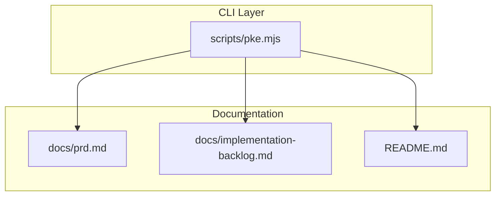
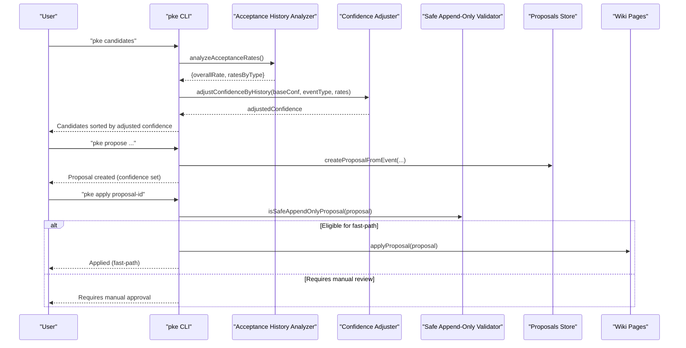
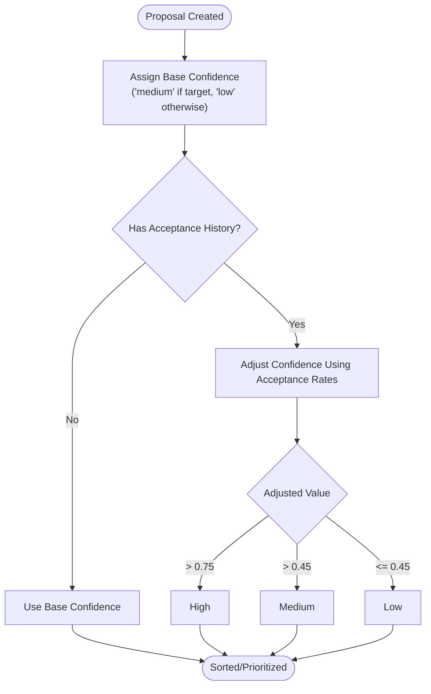
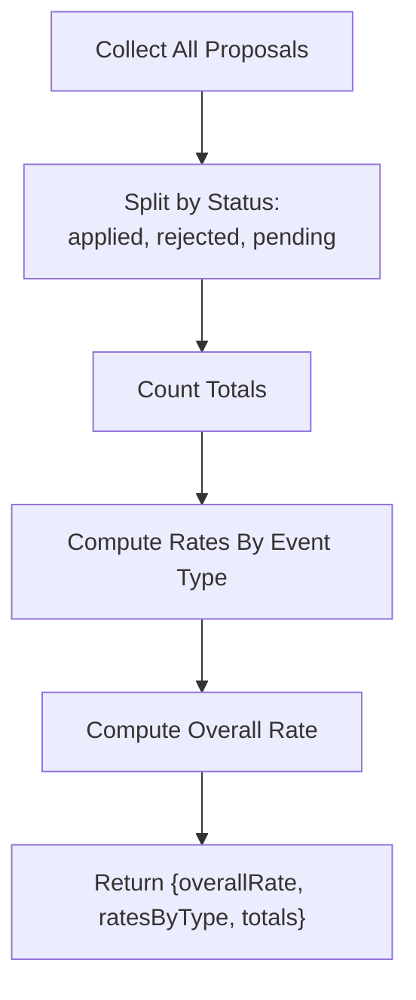
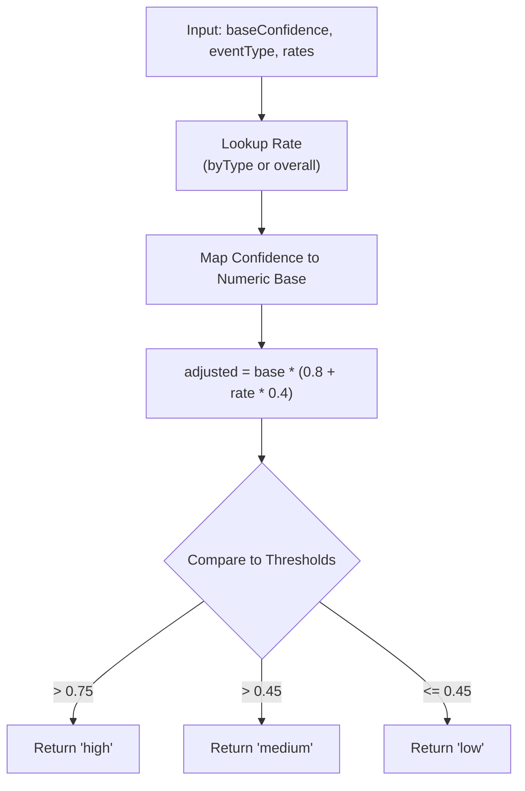
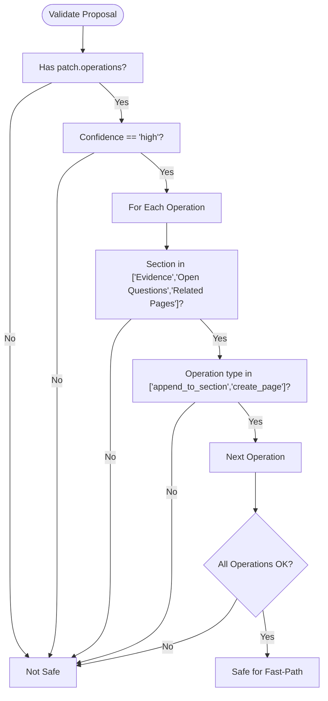
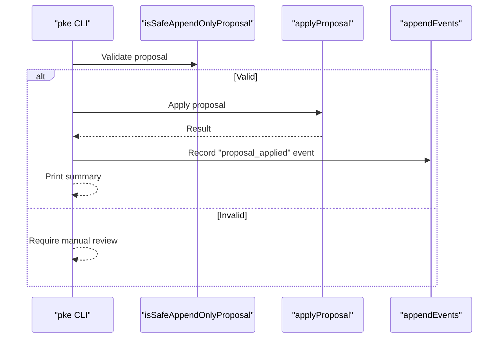
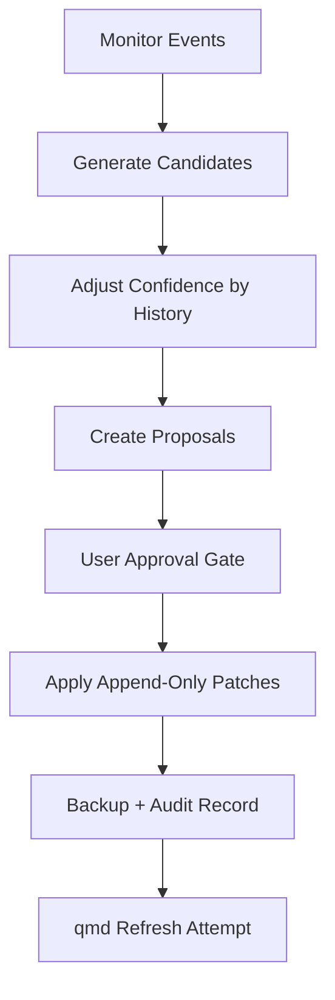
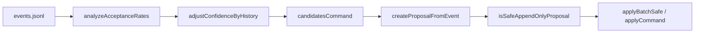

# Confidence-Based Safety Validation

<cite>
**Referenced Files in This Document**
- [README.md](file://README.md)
- [scripts/pke.mjs](file://scripts/pke.mjs)
- [docs/prd.md](file://docs/prd.md)
- [docs/implementation-backlog.md](file://docs/implementation-backlog.md)
</cite>

## Table of Contents
1. [Introduction](#introduction)
2. [Project Structure](#project-structure)
3. [Core Components](#core-components)
4. [Architecture Overview](#architecture-overview)
5. [Detailed Component Analysis](#detailed-component-analysis)
6. [Dependency Analysis](#dependency-analysis)
7. [Performance Considerations](#performance-considerations)
8. [Troubleshooting Guide](#troubleshooting-guide)
9. [Conclusion](#conclusion)

## Introduction
This document explains the confidence-based safety validation system that governs controlled self-improvement in the Personal Knowledge Engine (PKE). It covers:
- High-confidence automatic application for safe append-only proposals
- Safe append-only proposal validation
- Confidence adjustment algorithms informed by acceptance history
- How confidence thresholds (high, medium, low) influence proposal processing and the controlled self-improvement pipeline

The system ensures wiki updates remain conservative and auditable while enabling gradual automation for low-risk changes.

## Project Structure
The confidence system spans the CLI implementation and supporting documentation:
- CLI implementation: scripts/pke.mjs
- Product Requirements and Design: docs/prd.md
- Implementation backlog and roadmap: docs/implementation-backlog.md
- High-level project overview and governance: README.md

**Diagram sources**
- [scripts/pke.mjs](file://scripts/pke.mjs)
- [docs/prd.md](file://docs/prd.md)
- [docs/implementation-backlog.md](file://docs/implementation-backlog.md)
- [README.md](file://README.md)

**Section sources**
- [README.md:185-211](file://README.md#L185-L211)
- [docs/implementation-backlog.md:149-165](file://docs/implementation-backlog.md#L149-L165)

## Core Components
- Confidence thresholds: high, medium, low
- Acceptance history analyzer: computes overall and per-event-type acceptance rates
- Confidence adjustment function: adjusts base confidence using acceptance history
- Safe append-only validator: checks if a proposal qualifies for fast-path application
- Batch-safe application: applies all eligible proposals in bulk

Key behaviors:
- High-confidence proposals for safe sections can be batch-applied without manual review
- Confidence is adjusted based on historical acceptance rates to reflect system reliability
- Append-only operations are restricted to safe sections to preserve wiki integrity

**Section sources**
- [scripts/pke.mjs:522-530](file://scripts/pke.mjs#L522-L530)
- [scripts/pke.mjs:926-979](file://scripts/pke.mjs#L926-L979)
- [scripts/pke.mjs:602-610](file://scripts/pke.mjs#L602-L610)
- [scripts/pke.mjs:612-660](file://scripts/pke.mjs#L612-L660)

## Architecture Overview
The confidence system integrates with the proposal lifecycle and controlled self-improvement pipeline.

**Diagram sources**
- [scripts/pke.mjs:508-547](file://scripts/pke.mjs#L508-L547)
- [scripts/pke.mjs:926-979](file://scripts/pke.mjs#L926-L979)
- [scripts/pke.mjs:1454-1481](file://scripts/pke.mjs#L1454-L1481)
- [scripts/pke.mjs:602-610](file://scripts/pke.mjs#L602-L610)
- [scripts/pke.mjs:612-660](file://scripts/pke.mjs#L612-L660)

## Detailed Component Analysis

### Confidence Thresholds and Proposal Processing
- Confidence levels: high, medium, low
- Base confidence assignment during proposal creation depends on whether a target page is determined
- Sorting and filtering of proposals by confidence and evidence strength

**Diagram sources**
- [scripts/pke.mjs:1454-1481](file://scripts/pke.mjs#L1454-L1481)
- [scripts/pke.mjs:522-530](file://scripts/pke.mjs#L522-L530)
- [scripts/pke.mjs:973-979](file://scripts/pke.mjs#L973-L979)

**Section sources**
- [scripts/pke.mjs:1454-1481](file://scripts/pke.mjs#L1454-L1481)
- [scripts/pke.mjs:522-530](file://scripts/pke.mjs#L522-L530)
- [scripts/pke.mjs:973-979](file://scripts/pke.mjs#L973-L979)

### Acceptance History Analyzer
Computes acceptance rates by event type and overall to inform confidence adjustments.

**Diagram sources**
- [scripts/pke.mjs:930-967](file://scripts/pke.mjs#L930-L967)

**Section sources**
- [scripts/pke.mjs:930-967](file://scripts/pke.mjs#L930-L967)

### Confidence Adjustment Mechanism
Adjusts base confidence using acceptance history with a multiplicative factor constrained to an 80–120% range.

**Diagram sources**
- [scripts/pke.mjs:973-979](file://scripts/pke.mjs#L973-L979)

**Section sources**
- [scripts/pke.mjs:973-979](file://scripts/pke.mjs#L973-L979)

### Safe Append-Only Proposal Validation
Determines eligibility for fast-path application based on:
- Proposal confidence equals high
- All patch operations are append-only
- Operations target safe sections only

**Diagram sources**
- [scripts/pke.mjs:602-610](file://scripts/pke.mjs#L602-L610)

**Section sources**
- [scripts/pke.mjs:602-610](file://scripts/pke.mjs#L602-L610)

### Automatic Application of High-Confidence Proposals
Two modes:
- Single proposal fast-path: apply a specific high-confidence proposal if it passes validation
- Batch-safe application: apply all pending, high-confidence, safe proposals

**Diagram sources**
- [scripts/pke.mjs:612-660](file://scripts/pke.mjs#L612-L660)
- [scripts/pke.mjs:602-610](file://scripts/pke.mjs#L602-L610)

**Section sources**
- [scripts/pke.mjs:612-660](file://scripts/pke.mjs#L612-L660)

### Controlled Self-Improvement Process
- Monitor events trigger candidate generation
- Candidates are confidence-adjusted and prioritized
- Proposals are created and require user approval
- Approved proposals are applied as append-only patches to safe sections

**Diagram sources**
- [README.md:185-211](file://README.md#L185-L211)
- [scripts/pke.mjs:508-547](file://scripts/pke.mjs#L508-L547)
- [scripts/pke.mjs:1454-1481](file://scripts/pke.mjs#L1454-L1481)

**Section sources**
- [README.md:185-211](file://README.md#L185-L211)
- [scripts/pke.mjs:508-547](file://scripts/pke.mjs#L508-L547)
- [scripts/pke.mjs:1454-1481](file://scripts/pke.mjs#L1454-L1481)

## Dependency Analysis
The confidence system depends on:
- Proposal lifecycle and state (created, pending, applied, rejected)
- Event classification and history
- Safe section definitions and operation types

**Diagram sources**
- [scripts/pke.mjs:930-967](file://scripts/pke.mjs#L930-L967)
- [scripts/pke.mjs:973-979](file://scripts/pke.mjs#L973-L979)
- [scripts/pke.mjs:508-547](file://scripts/pke.mjs#L508-L547)
- [scripts/pke.mjs:1454-1481](file://scripts/pke.mjs#L1454-L1481)
- [scripts/pke.mjs:602-610](file://scripts/pke.mjs#L602-L610)
- [scripts/pke.mjs:612-660](file://scripts/pke.mjs#L612-L660)

**Section sources**
- [scripts/pke.mjs:930-967](file://scripts/pke.mjs#L930-L967)
- [scripts/pke.mjs:973-979](file://scripts/pke.mjs#L973-L979)
- [scripts/pke.mjs:508-547](file://scripts/pke.mjs#L508-L547)
- [scripts/pke.mjs:1454-1481](file://scripts/pke.mjs#L1454-L1481)
- [scripts/pke.mjs:602-610](file://scripts/pke.mjs#L602-L610)
- [scripts/pke.mjs:612-660](file://scripts/pke.mjs#L612-L660)

## Performance Considerations
- Confidence adjustment computation scales linearly with the number of proposals
- Batch-safe application iterates pending proposals; ensure proposal counts are bounded
- Event log rotation and pruning prevent unbounded growth of historical data

[No sources needed since this section provides general guidance]

## Troubleshooting Guide
Common issues and resolutions:
- No safe proposals eligible for batch approval: verify confidence thresholds and operation types
- Proposal not eligible for fast-path: ensure confidence is high and operations target safe sections
- Acceptance history not affecting confidence: confirm that sufficient proposals exist to compute rates

**Section sources**
- [scripts/pke.mjs:612-660](file://scripts/pke.mjs#L612-L660)
- [scripts/pke.mjs:602-610](file://scripts/pke.mjs#L602-L610)
- [scripts/pke.mjs:930-967](file://scripts/pke.mjs#L930-L967)

## Conclusion
The confidence-based safety validation system balances automation with governance:
- High-confidence, safe append-only proposals can be applied automatically
- Confidence is continuously adjusted using acceptance history to reflect system reliability
- Controlled self-improvement remains proposal-driven and auditable, preserving wiki integrity

[No sources needed since this section summarizes without analyzing specific files]