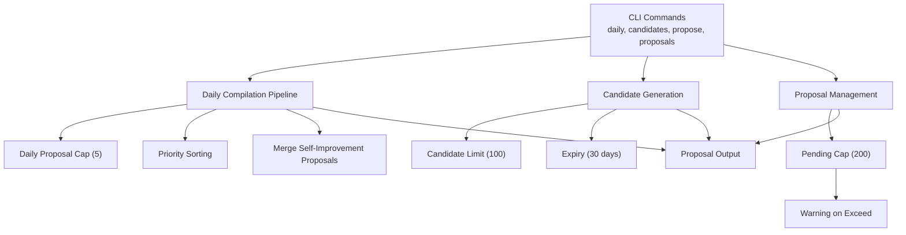
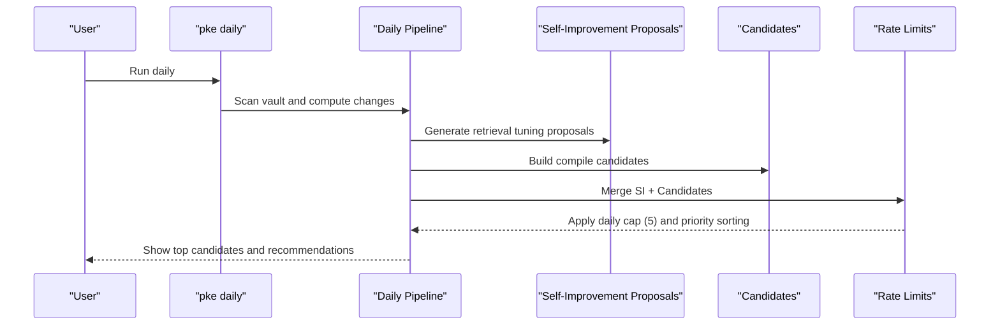
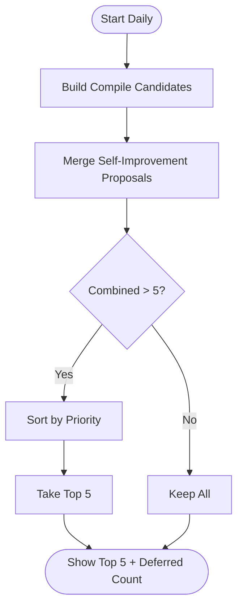
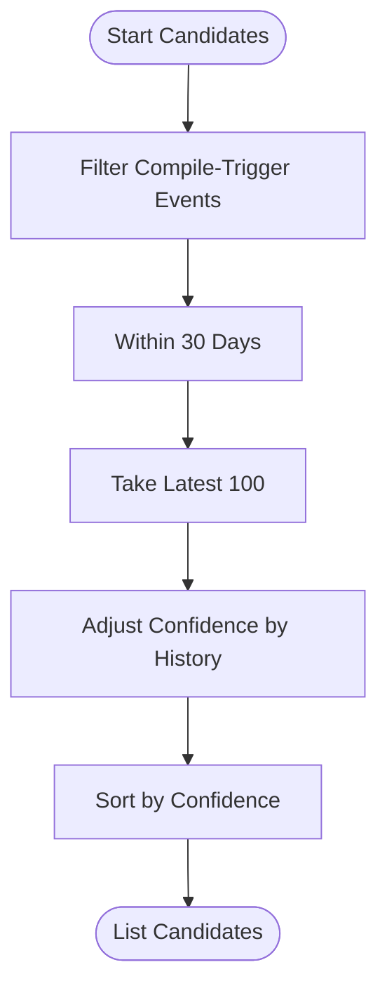
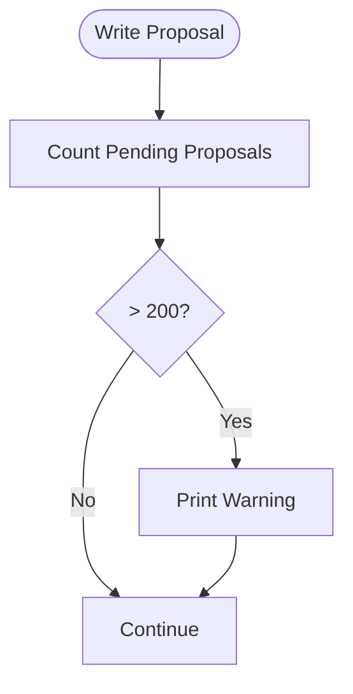
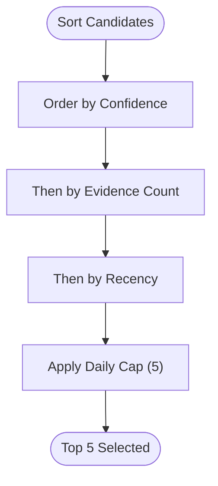
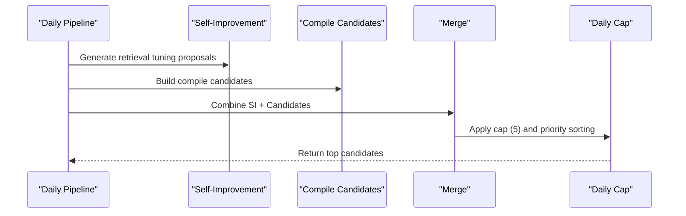
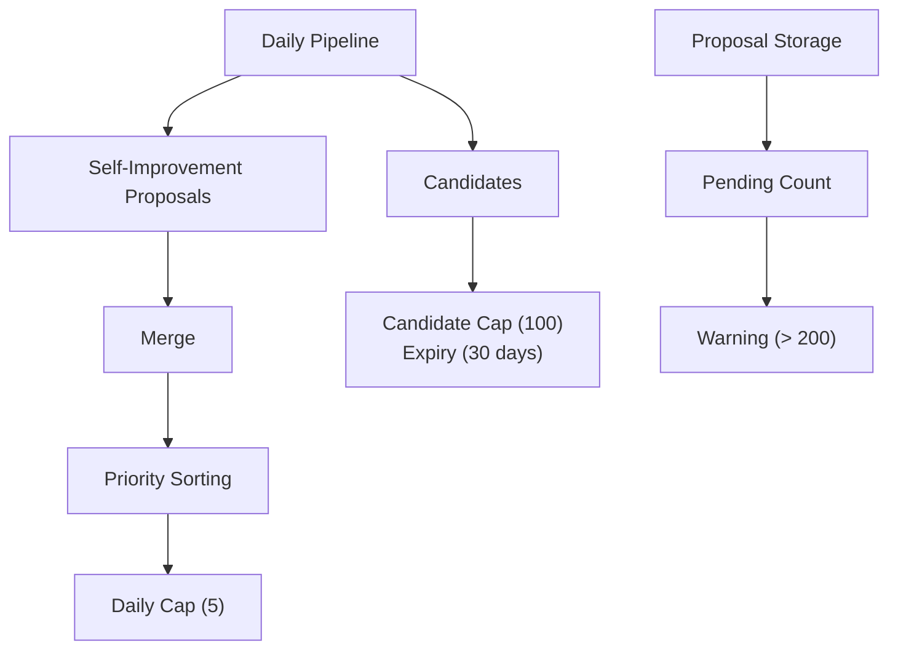

# Rate Limiting and Daily Caps

<cite>
**Referenced Files in This Document**
- [README.md](file://README.md)
- [pke.mjs](file://scripts/pke.mjs)
- [package.json](file://package.json)
- [implementation-notes.md](file://docs/implementation-notes.md)
- [prd.md](file://docs/prd.md)
</cite>

## Table of Contents
1. [Introduction](#introduction)
2. [Project Structure](#project-structure)
3. [Core Components](#core-components)
4. [Architecture Overview](#architecture-overview)
5. [Detailed Component Analysis](#detailed-component-analysis)
6. [Dependency Analysis](#dependency-analysis)
7. [Performance Considerations](#performance-considerations)
8. [Troubleshooting Guide](#troubleshooting-guide)
9. [Conclusion](#conclusion)

## Introduction
This document explains the comprehensive rate limiting and daily caps system that governs proposal generation and compilation in the Personal Knowledge Engine (PKE). It covers:
- Daily proposal caps to prevent overwhelming users with too many suggestions
- Candidate limits with expiration to keep the backlog manageable
- Pending proposal caps with warning notifications
- Priority-based selection during rate-limiting scenarios
- Merge strategy for self-improvement proposals before applying rate limits
- Examples of rate-limiting scenarios and how user control is maintained

## Project Structure
The rate limiting behavior is implemented in the CLI script and documented across the project’s README, PRD, and implementation notes. The key areas are:
- CLI command definitions and governance statements
- Daily compilation pipeline with caps and priority sorting
- Candidate generation with limits and expiry
- Proposal storage and pending cap enforcement with warnings

**Diagram sources**
- [README.md:56-80](file://README.md#L56-L80)
- [pke.mjs:221-285](file://scripts/pke.mjs#L221-L285)
- [pke.mjs:508-547](file://scripts/pke.mjs#L508-L547)
- [pke.mjs:1559-1567](file://scripts/pke.mjs#L1559-L1567)

**Section sources**
- [README.md:56-80](file://README.md#L56-L80)
- [README.md:149-156](file://README.md#L149-L156)
- [pke.mjs:221-285](file://scripts/pke.mjs#L221-L285)
- [pke.mjs:508-547](file://scripts/pke.mjs#L508-L547)
- [pke.mjs:1559-1567](file://scripts/pke.mjs#L1559-L1567)

## Core Components
- Daily proposal cap (5): Limits the number of compile candidates shown during daily review to avoid overload.
- Candidate cap (100) with 30-day expiry: Restricts the number of compile candidates and prunes old ones.
- Pending proposal cap (200) with warning: Prevents proposal accumulation from growing too large and warns users.
- Priority-based selection: During rate limiting, proposals are prioritized by confidence and evidence signals.
- Self-improvement proposal merge: Retrieval tuning proposals are generated and merged with compile candidates before applying caps.

**Section sources**
- [README.md:149-156](file://README.md#L149-L156)
- [pke.mjs:221-285](file://scripts/pke.mjs#L221-L285)
- [pke.mjs:508-547](file://scripts/pke.mjs#L508-L547)
- [pke.mjs:1559-1567](file://scripts/pke.mjs#L1559-L1567)
- [pke.mjs:981-1059](file://scripts/pke.mjs#L981-L1059)

## Architecture Overview
The rate limiting system is integrated into the daily compilation workflow and candidate generation pipeline. It ensures user control by:
- Merging self-improvement proposals first
- Applying daily caps and priority sorting
- Limiting candidate backlog with expiry
- Enforcing pending proposal caps with warnings

**Diagram sources**
- [pke.mjs:221-285](file://scripts/pke.mjs#L221-L285)
- [pke.mjs:981-1059](file://scripts/pke.mjs#L981-L1059)

## Detailed Component Analysis

### Daily Proposal Cap (5)
- Purpose: Prevent overwhelming users with too many suggestions during daily review.
- Behavior:
  - The daily pipeline compiles candidates from changed files and merges in self-improvement proposals.
  - If the combined total exceeds five, the system sorts by priority and selects the top five.
  - The output indicates how many candidates were deferred when capped.

**Diagram sources**
- [pke.mjs:221-285](file://scripts/pke.mjs#L221-L285)
- [pke.mjs:1140-1151](file://scripts/pke.mjs#L1140-L1151)

**Section sources**
- [README.md:149-156](file://README.md#L149-L156)
- [pke.mjs:221-285](file://scripts/pke.mjs#L221-L285)
- [pke.mjs:1140-1151](file://scripts/pke.mjs#L1140-L1151)

### Candidate Limits (100) and 30-Day Expiry
- Purpose: Manage the backlog of compile candidates and ensure relevance.
- Behavior:
  - Candidate generation filters compile-trigger events and slices the most recent 100.
  - Events are filtered to those within the last 30 days.
  - Candidates are sorted and optionally adjusted by confidence based on historical acceptance rates.

**Diagram sources**
- [pke.mjs:508-547](file://scripts/pke.mjs#L508-L547)
- [pke.mjs:924-979](file://scripts/pke.mjs#L924-L979)

**Section sources**
- [README.md:149-156](file://README.md#L149-L156)
- [pke.mjs:508-547](file://scripts/pke.mjs#L508-L547)
- [pke.mjs:924-979](file://scripts/pke.mjs#L924-L979)

### Pending Proposals Cap (200) with Warning
- Purpose: Prevent proposal accumulation from growing too large and warn users.
- Behavior:
  - Each time a proposal is written, the system counts pending proposals.
  - If the count exceeds 200, a warning is printed advising the user to review older proposals.

**Diagram sources**
- [pke.mjs:1559-1567](file://scripts/pke.mjs#L1559-L1567)

**Section sources**
- [README.md:149-156](file://README.md#L149-L156)
- [pke.mjs:1559-1567](file://scripts/pke.mjs#L1559-L1567)

### Priority-Based Selection During Rate Limiting
- Purpose: Ensure high-quality and relevant proposals are surfaced first when caps are applied.
- Behavior:
  - Sorting criteria:
    - Confidence (high > medium > low)
    - Evidence signals (higher evidence counts first)
    - Recency (newer items first)
  - This ordering is applied when reducing the combined candidate set to the daily cap of five.

**Diagram sources**
- [pke.mjs:1140-1151](file://scripts/pke.mjs#L1140-L1151)

**Section sources**
- [pke.mjs:1140-1151](file://scripts/pke.mjs#L1140-L1151)

### Merge Strategy for Self-Improvement Proposals
- Purpose: Proactively improve retrieval quality by generating proposals for topics with frequent events and missing or low-quality wiki pages.
- Behavior:
  - Generates retrieval tuning proposals from recent events.
  - Merges these proposals with compile candidates before applying the daily cap.
  - This ensures high-priority self-improvement updates are considered alongside compile candidates.

**Diagram sources**
- [pke.mjs:221-285](file://scripts/pke.mjs#L221-L285)
- [pke.mjs:981-1059](file://scripts/pke.mjs#L981-L1059)

**Section sources**
- [pke.mjs:221-285](file://scripts/pke.mjs#L221-L285)
- [pke.mjs:981-1059](file://scripts/pke.mjs#L981-L1059)

### Examples of Rate-Limiting Scenarios
- Scenario 1: Too many compile candidates
  - Many files changed and numerous monitor events trigger compile candidates.
  - The system merges self-improvement proposals and sorts by priority.
  - Only the top five are shown; the rest are deferred with a count.
- Scenario 2: Candidate backlog growth
  - Over 100 candidates accumulate; the system prunes to the latest 100 and removes candidates older than 30 days.
- Scenario 3: Pending proposals exceed cap
  - More than 200 pending proposals cause a warning to appear each time a new proposal is written.

**Section sources**
- [pke.mjs:221-285](file://scripts/pke.mjs#L221-L285)
- [pke.mjs:508-547](file://scripts/pke.mjs#L508-L547)
- [pke.mjs:1559-1567](file://scripts/pke.mjs#L1559-L1567)

### Maintaining User Control Over Knowledge Compilation Speed
- The system emphasizes user control:
  - All wiki writes remain proposal-only in the MVP.
  - Users must explicitly approve proposals before any changes occur.
  - Daily compilation is the default maintenance rhythm; users can choose when to review and act on proposals.
  - The dashboard and CLI provide visibility into pending proposals and candidates, enabling informed decisions.

**Section sources**
- [README.md:82-120](file://README.md#L82-L120)
- [implementation-notes.md:18-30](file://docs/implementation-notes.md#L18-L30)
- [implementation-notes.md:74-102](file://docs/implementation-notes.md#L74-L102)

## Dependency Analysis
The rate limiting logic depends on:
- Daily compilation pipeline for building candidates
- Self-improvement proposal generation for retrieval tuning
- Candidate filtering and confidence adjustment
- Proposal storage and pending count enforcement

**Diagram sources**
- [pke.mjs:221-285](file://scripts/pke.mjs#L221-L285)
- [pke.mjs:508-547](file://scripts/pke.mjs#L508-L547)
- [pke.mjs:981-1059](file://scripts/pke.mjs#L981-L1059)
- [pke.mjs:1559-1567](file://scripts/pke.mjs#L1559-L1567)

**Section sources**
- [pke.mjs:221-285](file://scripts/pke.mjs#L221-L285)
- [pke.mjs:508-547](file://scripts/pke.mjs#L508-L547)
- [pke.mjs:981-1059](file://scripts/pke.mjs#L981-L1059)
- [pke.mjs:1559-1567](file://scripts/pke.mjs#L1559-L1567)

## Performance Considerations
- Candidate pruning reduces memory and processing overhead by limiting the number of events considered.
- Priority sorting is efficient due to simple heuristics (confidence, evidence count, recency).
- Pending cap enforcement avoids excessive file I/O by issuing warnings rather than blocking writes.
- The system maintains a balance between responsiveness and user control.

## Troubleshooting Guide
- Warning: Pending proposals exceed 200
  - Action: Review and act on older proposals to reduce the pending count.
  - Location: Warning is printed upon writing a new proposal when pending count exceeds 200.
- Candidates not appearing as expected
  - Verify the candidate window and expiry settings; only the most recent 100 candidates within 30 days are considered.
- Daily cap reduces visible candidates
  - Confirm priority sorting criteria; higher confidence, more evidence, and recency increase visibility.

**Section sources**
- [pke.mjs:1559-1567](file://scripts/pke.mjs#L1559-L1567)
- [pke.mjs:508-547](file://scripts/pke.mjs#L508-L547)
- [pke.mjs:1140-1151](file://scripts/pke.mjs#L1140-L1151)

## Conclusion
The PKE rate limiting and daily caps system is designed to keep users in control while ensuring a steady, prioritized flow of compile candidates and proposals. Through a combination of daily caps, candidate limits with expiry, pending caps with warnings, priority-based selection, and the merge of self-improvement proposals, the system balances productivity with safety and user agency.