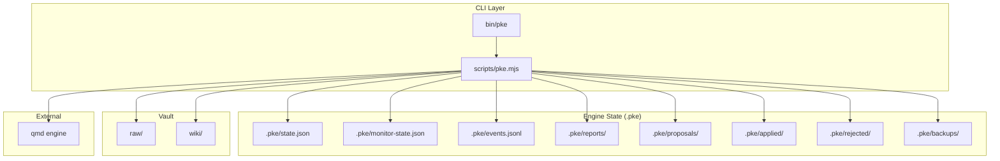
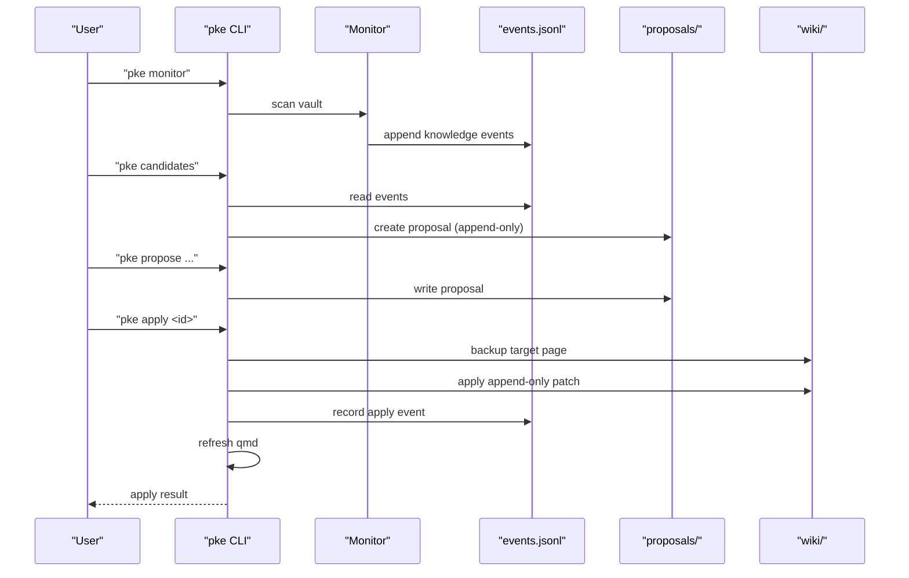
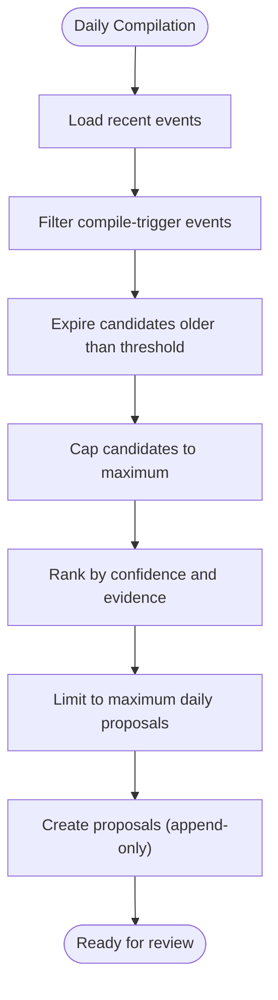
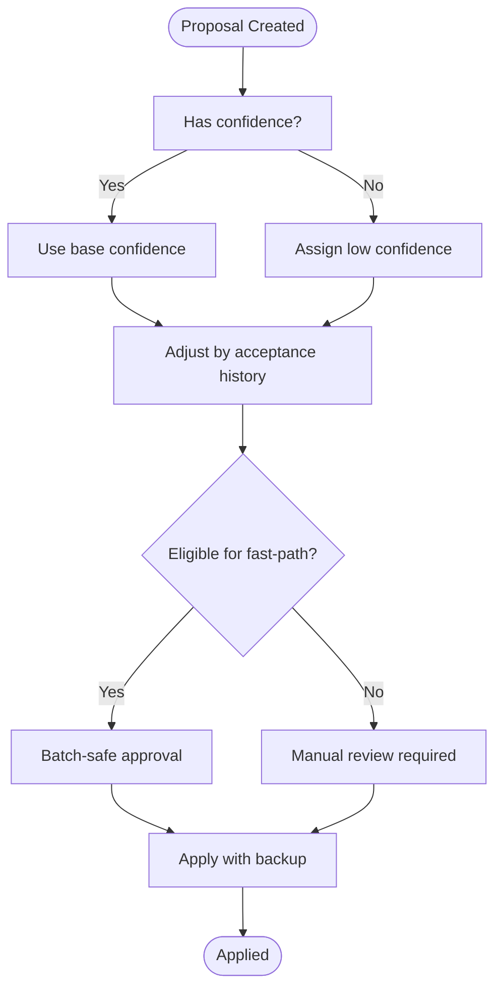
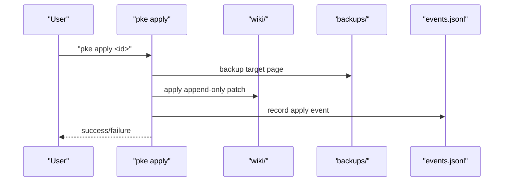
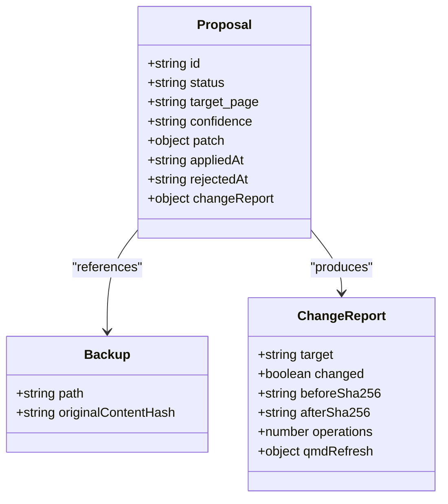
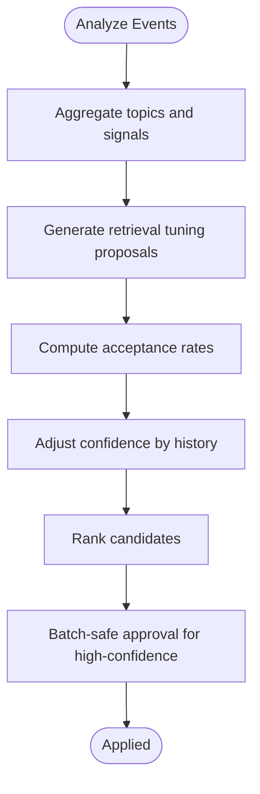
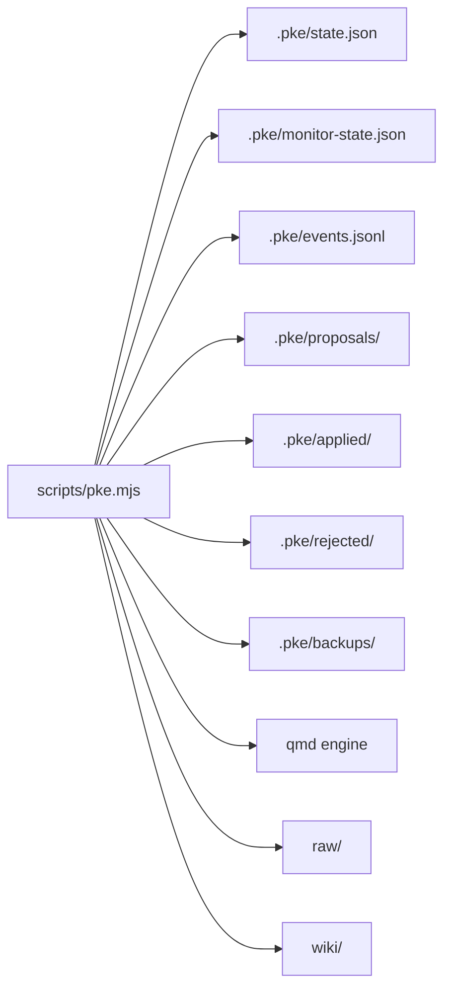

# Safety Controls and Rate Limiting

<cite>
**Referenced Files in This Document**
- [README.md](file://README.md)
- [package.json](file://package.json)
- [bin/pke](file://bin/pke)
- [scripts/pke.mjs](file://scripts/pke.mjs)
- [docs/prd.md](file://docs/prd.md)
- [docs/implementation-notes.md](file://docs/implementation-notes.md)
- [docs/implementation-backlog.md](file://docs/implementation-backlog.md)
</cite>

## Table of Contents
1. [Introduction](#introduction)
2. [Project Structure](#project-structure)
3. [Core Components](#core-components)
4. [Architecture Overview](#architecture-overview)
5. [Detailed Component Analysis](#detailed-component-analysis)
6. [Dependency Analysis](#dependency-analysis)
7. [Performance Considerations](#performance-considerations)
8. [Troubleshooting Guide](#troubleshooting-guide)
9. [Conclusion](#conclusion)

## Introduction
This document explains the comprehensive safety control system implemented in the Personal Knowledge Engine (PKE) MVP. It covers rate limiting, confidence thresholds, append-only validation, built-in safeguards (maximum daily proposals, candidate limits, event retention caps, file size restrictions), confidence-based safety mechanisms (high-confidence automatic application, safe append-only proposal validation, batch-safe processing), audit trails (proposal tracking, approval history, backup mechanisms), governance gates preventing unauthorized wiki modifications, and controlled self-improvement. It also includes examples of safety violations and how the system prevents unauthorized changes.

## Project Structure
The PKE MVP is a Node.js CLI with a small set of core modules:
- CLI entrypoint: a Bash wrapper that invokes the main script.
- Main script: implements all commands, safety controls, governance gates, and audit facilities.
- Documentation: PRD, implementation notes, and backlog define intended safety behavior and enforcement targets.

**Diagram sources**
- [bin/pke](file://bin/pke)
- [scripts/pke.mjs](file://scripts/pke.mjs)
- [docs/prd.md](file://docs/prd.md)

**Section sources**
- [README.md](file://README.md)
- [package.json](file://package.json)
- [bin/pke](file://bin/pke)
- [scripts/pke.mjs](file://scripts/pke.mjs)
- [docs/prd.md](file://docs/prd.md)

## Core Components
- Governance gates: compile, propose, apply, and reject enforce that wiki writes occur only under explicit user control.
- Safety controls: file size limits, event retention caps, proposal caps, and candidate queue limits.
- Confidence-based safety: confidence levels influence proposal ranking and eligibility for fast-path approval.
- Append-only validation: patch operations are restricted to safe sections and types.
- Audit trail: proposals, backups, and change reports track all wiki modifications.
- Controlled self-improvement: retrieval tuning and compile strategy refinement use historical acceptance rates to adjust confidence and reduce friction for high-confidence proposals.

**Section sources**
- [README.md](file://README.md)
- [docs/prd.md](file://docs/prd.md)
- [docs/implementation-backlog.md](file://docs/implementation-backlog.md)
- [scripts/pke.mjs](file://scripts/pke.mjs)

## Architecture Overview
The safety system spans CLI commands, state files, and the qmd engine. The monitor observes vault changes and emits knowledge events. Proposals are generated from events and must be approved before applying. The apply command enforces backup, append-only patching, and qmd refresh.

**Diagram sources**
- [scripts/pke.mjs](file://scripts/pke.mjs)
- [docs/prd.md](file://docs/prd.md)

## Detailed Component Analysis

### Rate Limiting and Built-in Safeguards
- Maximum daily proposals: the system prioritizes candidates and limits to a fixed number per day to avoid overload.
- Candidate limits: candidates queue is capped and expires after a time window.
- Event retention caps: event log rotation is enforced to cap entries.
- File size restrictions: vault scans skip files exceeding a maximum size.

**Diagram sources**
- [scripts/pke.mjs](file://scripts/pke.mjs)
- [docs/implementation-backlog.md](file://docs/implementation-backlog.md)

**Section sources**
- [scripts/pke.mjs](file://scripts/pke.mjs)
- [docs/implementation-backlog.md](file://docs/implementation-backlog.md)

### Confidence Thresholds and Confidence-Based Safety
- Confidence levels: proposals carry a confidence rating used to rank candidates and adjust confidence based on historical acceptance rates.
- High-confidence automatic application: proposals meeting strict criteria can be fast-tracked for batch approval.
- Safe append-only proposal validation: only specific operations and sections are permitted.

**Diagram sources**
- [scripts/pke.mjs](file://scripts/pke.mjs)
- [docs/implementation-backlog.md](file://docs/implementation-backlog.md)

**Section sources**
- [scripts/pke.mjs](file://scripts/pke.mjs)
- [docs/implementation-backlog.md](file://docs/implementation-backlog.md)

### Append-Only Validation and Governance Gates
- Governance gates: wiki writes are gated behind explicit commands and approvals.
- Append-only validation: patch operations are restricted to safe sections and types.
- Atomicity: apply backs up the target page before mutating.

**Diagram sources**
- [scripts/pke.mjs](file://scripts/pke.mjs)
- [docs/prd.md](file://docs/prd.md)

**Section sources**
- [scripts/pke.mjs](file://scripts/pke.mjs)
- [docs/prd.md](file://docs/prd.md)

### Audit Trail System
- Proposal tracking: proposals are stored with full metadata and lifecycle status.
- Approval history: applied and rejected proposals are archived for review.
- Backup mechanisms: pre-apply backups are created and retained.
- Change reports: detailed reports record before/after hashes and qmd refresh outcomes.

**Diagram sources**
- [scripts/pke.mjs](file://scripts/pke.mjs)
- [docs/prd.md](file://docs/prd.md)

**Section sources**
- [scripts/pke.mjs](file://scripts/pke.mjs)
- [docs/prd.md](file://docs/prd.md)

### Controlled Self-Improvement
- Retrieval tuning: proposals are generated to improve coverage for frequently queried topics.
- Compile strategy refinement: historical acceptance rates adjust confidence and ranking.
- Fast-path approval: high-confidence, safe proposals can be batch-applied.

**Diagram sources**
- [scripts/pke.mjs](file://scripts/pke.mjs)
- [docs/implementation-backlog.md](file://docs/implementation-backlog.md)

**Section sources**
- [scripts/pke.mjs](file://scripts/pke.mjs)
- [docs/implementation-backlog.md](file://docs/implementation-backlog.md)

### Examples of Safety Violations and Prevention
- Unauthorized wiki write without approval: prevented by governance gates enforcing proposal-only mode and requiring explicit apply.
- Silent pollution of knowledge: prevented by append-only patches and strict section targeting.
- Overload from excessive proposals: prevented by proposal caps, candidate queue limits, and daily proposal limits.
- Unbounded event growth: prevented by event log rotation and retention policies.
- Large file ingestion: prevented by skipping files larger than the configured maximum size.

**Section sources**
- [README.md](file://README.md)
- [docs/prd.md](file://docs/prd.md)
- [docs/implementation-backlog.md](file://docs/implementation-backlog.md)
- [scripts/pke.mjs](file://scripts/pke.mjs)

## Dependency Analysis
The CLI depends on state files and the qmd engine. The monitor depends on vault snapshots and emits events. Proposals depend on events and governance rules. Apply depends on backups and qmd refresh.

**Diagram sources**
- [scripts/pke.mjs](file://scripts/pke.mjs)
- [docs/prd.md](file://docs/prd.md)

**Section sources**
- [scripts/pke.mjs](file://scripts/pke.mjs)
- [docs/prd.md](file://docs/prd.md)

## Performance Considerations
- File size limits reduce scan overhead and memory pressure.
- Event rotation and retention policies bound storage growth.
- Proposal caps and candidate queue limits bound memory and UI responsiveness.
- Batch-safe approval reduces manual overhead while preserving safety.

[No sources needed since this section provides general guidance]

## Troubleshooting Guide
- Proposal not found: verify the proposal ID and directory.
- Target page missing: ensure the target wiki page exists before applying.
- Not pending: only pending proposals can be applied.
- Exceeded proposal cap: review or archive older proposals.
- Large file skipped: reduce file size or split content.

**Section sources**
- [scripts/pke.mjs](file://scripts/pke.mjs)
- [docs/implementation-backlog.md](file://docs/implementation-backlog.md)

## Conclusion
The PKE MVP implements a robust safety control system centered on governance gates, append-only validation, confidence thresholds, and comprehensive audit trails. Built-in safeguards manage scale and prevent unauthorized changes. Confidence-based mechanisms and controlled self-improvement enable gradual, safe enhancements while maintaining user control over wiki updates.