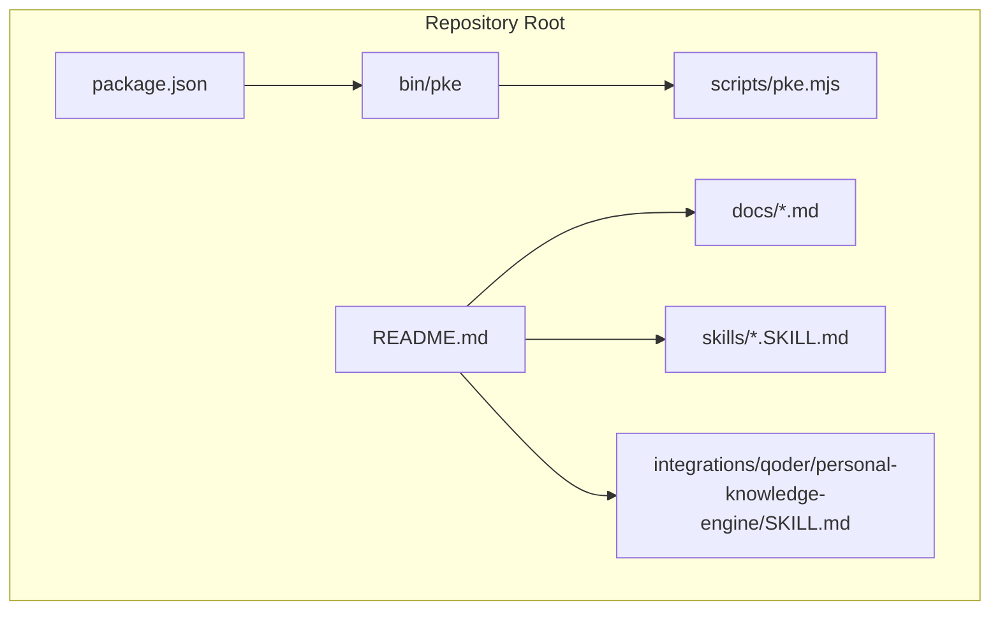
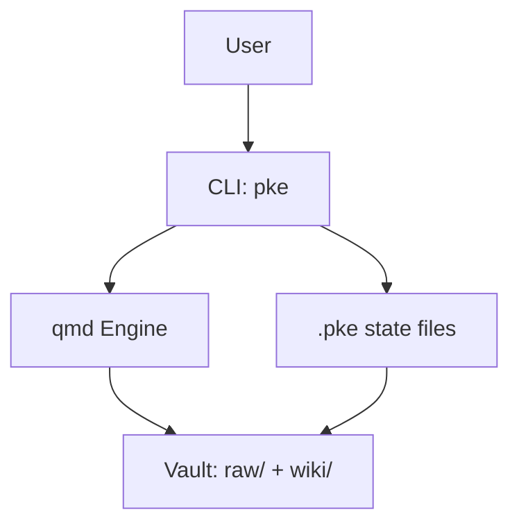
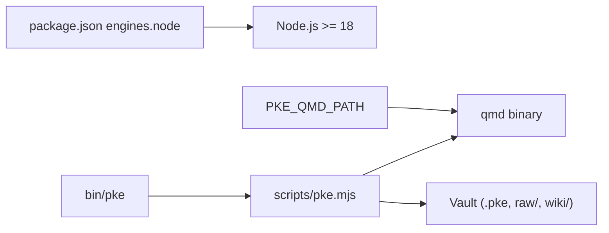

# Troubleshooting and FAQ

<cite>
**Referenced Files in This Document**
- [README.md](file://README.md)
- [package.json](file://package.json)
- [bin/pke](file://bin/pke)
- [scripts/pke.mjs](file://scripts/pke.mjs)
- [skills/personal-knowledge-engine.SKILL.md](file://skills/personal-knowledge-engine.SKILL.md)
- [integrations/qoder/personal-knowledge-engine/SKILL.md](file://integrations/qoder/personal-knowledge-engine/SKILL.md)
- [docs/prd.md](file://docs/prd.md)
- [docs/implementation-notes.md](file://docs/implementation-notes.md)
- [docs/agent-workflow.md](file://docs/agent-workflow.md)
</cite>

## Table of Contents
1. [Introduction](#introduction)
2. [Project Structure](#project-structure)
3. [Core Components](#core-components)
4. [Architecture Overview](#architecture-overview)
5. [Detailed Component Analysis](#detailed-component-analysis)
6. [Dependency Analysis](#dependency-analysis)
7. [Performance Considerations](#performance-considerations)
8. [Troubleshooting Guide](#troubleshooting-guide)
9. [FAQ](#faq)
10. [Migration and Version Guidance](#migration-and-version-guidance)
11. [Conclusion](#conclusion)

## Introduction
This document provides comprehensive troubleshooting and FAQ guidance for the Personal Knowledge Engine (PKE). It covers installation and setup issues, configuration pitfalls, monitoring failures, proposal system problems, qmd integration challenges, vault corruption safeguards, performance tuning, and migration guidance. It also addresses frequently asked questions about the proposal-only architecture, governance model, and workflow limitations.

## Project Structure
The PKE repository centers around a small CLI (pke) that orchestrates local vault scanning, qmd-powered retrieval, event logging, proposal generation, and a lightweight dashboard. The CLI is a thin wrapper around a Node.js script that manages state, events, reports, and proposal lifecycle.

**Diagram sources**
- [bin/pke](file://bin/pke)
- [package.json](file://package.json)
- [scripts/pke.mjs](file://scripts/pke.mjs)
- [README.md](file://README.md)
- [skills/personal-knowledge-engine.SKILL.md](file://skills/personal-knowledge-engine.SKILL.md)
- [integrations/qoder/personal-knowledge-engine/SKILL.md](file://integrations/qoder/personal-knowledge-engine/SKILL.md)
- [docs/prd.md](file://docs/prd.md)

**Section sources**
- [README.md](file://README.md)
- [package.json](file://package.json)
- [bin/pke](file://bin/pke)
- [scripts/pke.mjs](file://scripts/pke.mjs)
- [docs/prd.md](file://docs/prd.md)

## Core Components
- CLI wrapper: Invokes the Node.js script with all arguments.
- Node.js engine: Implements commands, vault scanning, qmd integration, event detection, proposal lifecycle, and dashboard server.
- Vault state: Tracks review baselines, monitor snapshots, and file metadata.
- Event log: Append-only JSONL of knowledge events.
- Reports: Timestamped markdown reports of monitor scans.
- Proposal system: Approval-gated, append-only wiki patch generator and executor.

Key behaviors:
- Proposal-only writes: Wiki updates require explicit approval.
- Scoped monitoring: Watch mode requires a vault-relative path.
- Safety caps: Limits on proposals, candidates, and retention.
- qmd refresh: Automatic update and embed after approved wiki changes.

**Section sources**
- [scripts/pke.mjs](file://scripts/pke.mjs)
- [docs/prd.md](file://docs/prd.md)
- [docs/implementation-notes.md](file://docs/implementation-notes.md)

## Architecture Overview
The PKE engine operates on a local vault with raw and wiki directories. It uses qmd for indexing and retrieval, maintains state and events, and exposes a proposal system for controlled self-improvement.

**Diagram sources**
- [scripts/pke.mjs](file://scripts/pke.mjs)
- [docs/prd.md](file://docs/prd.md)

## Detailed Component Analysis

### CLI and Command Surface
- Wrapper: bin/pke executes the Node.js script.
- Commands: status, use, changed, daily, learn, capture, compile, close-session, stale, monitor, events, report, dashboard, candidates, propose, proposals, proposal, apply, reject, improve.
- Options: vault, collection, state, path, json, save, usage, write, watch, port, auto-scan, target, apply, batch-safe.
- Environment: PKE_VAULT, PKE_QMD_PATH.

Common issues:
- Unknown command or missing arguments.
- Missing qmd binary or wrong PATH.
- Missing vault or scoped path outside vault.
- Exceeded proposal limits.

**Section sources**
- [bin/pke](file://bin/pke)
- [scripts/pke.mjs](file://scripts/pke.mjs)
- [README.md](file://README.md)

### Vault and State Management
- Vault layout: raw/, wiki/, .pke/.
- State files: state.json (baseline), monitor-state.json (snapshot), events.jsonl, reports/, proposals/, applied/, rejected/, backups/.
- Scanning: Walks vault, filters supported files, computes SHA-256, enforces 10 MB file size cap.
- Scoped snapshots: Preserves out-of-scope state across scans.

Common issues:
- Oversized files skipped.
- Missing vault directories.
- Permission errors on .pke directories.

**Section sources**
- [scripts/pke.mjs](file://scripts/pke.mjs)
- [docs/prd.md](file://docs/prd.md)

### qmd Integration
- Execution: Spawns qmd with configured PATH and buffer limits.
- Failures: Non-zero exit codes raise errors unless explicitly allowed.
- Refresh: After apply, attempts qmd update and embed.

Common issues:
- qmd not found or not executable.
- Collection mismatch or missing index.
- Large query output exceeding buffers.

**Section sources**
- [scripts/pke.mjs](file://scripts/pke.mjs)
- [README.md](file://README.md)
- [skills/personal-knowledge-engine.SKILL.md](file://skills/personal-knowledge-engine.SKILL.md)
- [integrations/qoder/personal-knowledge-engine/SKILL.md](file://integrations/qoder/personal-knowledge-engine/SKILL.md)

### Monitoring and Events
- One-shot and watch modes.
- Semantic event classification by wiki section.
- Event retention capped at 100k; older events archived.
- Reports retention enforced; older reports archived.

Common issues:
- Watch requires --path and must be inside vault.
- Missing events.jsonl or corrupted state.
- Excessive events causing rotation warnings.

**Section sources**
- [scripts/pke.mjs](file://scripts/pke.mjs)
- [docs/implementation-notes.md](file://docs/implementation-notes.md)

### Proposal System
- Proposal creation from events or files.
- Append-only patch operations targeting safe sections.
- Approval gates: apply requires pending status and target existence.
- Batch-safe approval for eligible proposals.

Common issues:
- Proposal not found.
- Target page missing.
- Too many pending proposals (>200).
- Applying non-append-only or invalid operations.

**Section sources**
- [scripts/pke.mjs](file://scripts/pke.mjs)
- [docs/prd.md](file://docs/prd.md)

### Dashboard
- Embedded HTTP server serving HTML and JSON APIs.
- Supports scoped scanning and auto-scan.
- Renders metrics, events, and proposals.

Common issues:
- Port already in use.
- Auto-scan scope misconfiguration.
- CORS or mixed content in browsers.

**Section sources**
- [scripts/pke.mjs](file://scripts/pke.mjs)
- [README.md](file://README.md)

## Dependency Analysis
- Node.js runtime requirement: engines.node >= 18.
- qmd binary availability via PATH (default /opt/homebrew/bin).
- Local filesystem access for vault and .pke directories.
- Optional npm link for development.

**Diagram sources**
- [package.json](file://package.json)
- [bin/pke](file://bin/pke)
- [scripts/pke.mjs](file://scripts/pke.mjs)

**Section sources**
- [package.json](file://package.json)
- [scripts/pke.mjs](file://scripts/pke.mjs)

## Performance Considerations
- Scoped monitoring reduces IO and CPU by polling only a subset of the vault.
- File size cap (10 MB) prevents heavy scans.
- Candidate and proposal caps (100, 200) prevent runaway growth.
- Report retention (90 days) keeps storage bounded.
- Consider adjusting watch interval via options if needed.

[No sources needed since this section provides general guidance]

## Troubleshooting Guide

### Installation and Setup
- Node.js version
  - Symptom: Engine refuses to run or crashes early.
  - Resolution: Ensure Node.js satisfies engines.node (>=18).
  - Section sources
    - [package.json](file://package.json)

- qmd availability
  - Symptom: “qmd failed” or “qmd not found”.
  - Resolution: Set PKE_QMD_PATH to a directory containing qmd, or ensure qmd is on PATH. Verify with qmd status.
  - Section sources
    - [scripts/pke.mjs](file://scripts/pke.mjs)
    - [README.md](file://README.md)
    - [skills/personal-knowledge-engine.SKILL.md](file://skills/personal-knowledge-engine.SKILL.md)
    - [integrations/qoder/personal-knowledge-engine/SKILL.md](file://integrations/qoder/personal-knowledge-engine/SKILL.md)

- Vault location
  - Symptom: “vault not found” or empty status.
  - Resolution: Ensure $PKE_VAULT contains raw/ and wiki/ directories. Override with --vault or PKE_VAULT.
  - Section sources
    - [scripts/pke.mjs](file://scripts/pke.mjs)
    - [docs/implementation-notes.md](file://docs/implementation-notes.md)

- npm link
  - Symptom: pke not found after linking.
  - Resolution: Run npm link and verify PATH includes the installed binary.
  - Section sources
    - [README.md](file://README.md)

### Configuration Errors
- Wrong PATH for qmd
  - Symptom: qmd commands fail even though qmd exists.
  - Resolution: Set PKE_QMD_PATH to the directory containing qmd (e.g., /opt/homebrew/bin).
  - Section sources
    - [scripts/pke.mjs](file://scripts/pke.mjs)

- Scoped monitoring path outside vault
  - Symptom: “monitor path must be inside vault”.
  - Resolution: Use a vault-relative path (e.g., wiki/, raw/, raw/meeting-2026-05-01.md).
  - Section sources
    - [scripts/pke.mjs](file://scripts/pke.mjs)

- Oversized files
  - Symptom: Skipped files in logs.
  - Resolution: Split large files or remove non-essential content.
  - Section sources
    - [scripts/pke.mjs](file://scripts/pke.mjs)

### Monitoring Failures
- Missing events.jsonl or corrupted state
  - Symptom: Empty events list or inconsistent reports.
  - Resolution: Remove or repair .pke/monitor-state.json; re-run monitor. Check permissions on .pke/.
  - Section sources
    - [scripts/pke.mjs](file://scripts/pke.mjs)

- Watch mode not triggering
  - Symptom: No events despite file changes.
  - Resolution: Ensure --watch is paired with --path inside vault. Confirm interval/debounce settings.
  - Section sources
    - [scripts/pke.mjs](file://scripts/pke.mjs)

- Excessive events rotation
  - Symptom: Frequent rotation warnings.
  - Resolution: Reduce scope or frequency of scans; archive or prune old reports.
  - Section sources
    - [scripts/pke.mjs](file://scripts/pke.mjs)

### Proposal System Issues
- Proposal not found
  - Symptom: apply/reject fails with “proposal not found”.
  - Resolution: List proposals and confirm ID; ensure proposals directory exists.
  - Section sources
    - [scripts/pke.mjs](file://scripts/pke.mjs)

- Target page missing
  - Symptom: apply fails with “target page not found”.
  - Resolution: Create the target wiki page or specify a valid --target.
  - Section sources
    - [scripts/pke.mjs](file://scripts/pke.mjs)

- Too many pending proposals
  - Symptom: Warning about pending proposals exceeding 200.
  - Resolution: Review and apply/reject pending proposals; archive old ones.
  - Section sources
    - [scripts/pke.mjs](file://scripts/pke.mjs)

- Applying non-append-only operations
  - Symptom: apply fails due to unsupported operation.
  - Resolution: Only append-to-section operations are supported in MVP.
  - Section sources
    - [scripts/pke.mjs](file://scripts/pke.mjs)

### qmd Integration Problems
- qmd query/embed/update failures
  - Symptom: Errors from qmd commands.
  - Resolution: Rebuild index (qmd update) and re-embed (qmd embed -c <collection>). Check collection name and PATH.
  - Section sources
    - [scripts/pke.mjs](file://scripts/pke.mjs)
    - [README.md](file://README.md)

- Large output buffer exceeded
  - Symptom: qmd command truncated or failed.
  - Resolution: Reduce query scope (-n), split inputs, or increase buffer limits if feasible.
  - Section sources
    - [scripts/pke.mjs](file://scripts/pke.mjs)

### Vault Corruption and Safety
- Prevention
  - PKE writes wiki only via approved proposals with backups.
  - Append-only patching minimizes risk.
  - Backups are stored under .pke/backups/.
- Recovery
  - Restore from backups using file names indicating proposal ID and target path.
  - Re-run qmd update/embed after restoring.
- Section sources
  - [scripts/pke.mjs](file://scripts/pke.mjs)
  - [docs/prd.md](file://docs/prd.md)

### Dashboard and UI Issues
- Port already in use
  - Symptom: Cannot start dashboard.
  - Resolution: Change --port or kill the process using the port.
  - Section sources
    - [scripts/pke.mjs](file://scripts/pke.mjs)

- Auto-scan scope mismatch
  - Symptom: Dashboard does not reflect changes.
  - Resolution: Ensure --path points to a vault-relative path; avoid auto-scanning entire vault unintentionally.
  - Section sources
    - [scripts/pke.mjs](file://scripts/pke.mjs)

### Performance Problems
- Slow monitor scans
  - Symptom: Long delays in watch or report generation.
  - Resolution: Use scoped paths (--path), reduce report frequency, or increase interval/debounce.
  - Section sources
    - [scripts/pke.mjs](file://scripts/pke.mjs)

- Memory or CPU spikes
  - Symptom: High resource usage during scans.
  - Resolution: Limit concurrent scans, avoid full-vault watch, and ensure adequate disk I/O.
  - Section sources
    - [scripts/pke.mjs](file://scripts/pke.mjs)

## FAQ

### Why are wiki writes proposal-only?
- Governance: Wiki updates require explicit approval to prevent accidental contamination of durable knowledge.
- Safety: Ensures every change is auditable and reversible via backups.
- Section sources
  - [README.md](file://README.md)
  - [docs/prd.md](file://docs/prd.md)

### How does the proposal system work?
- Monitor detects knowledge events; candidates are generated.
- Proposals are created with exact append-only patches; users review and approve.
- On apply, PKE backs up the target, applies the patch, and refreshes qmd.
- Section sources
  - [scripts/pke.mjs](file://scripts/pke.mjs)
  - [docs/prd.md](file://docs/prd.md)

### Can I auto-update wiki pages?
- MVP: No. Wiki writes are proposal-only.
- Future: Additional write-approved compile commands may be introduced.
- Section sources
  - [docs/prd.md](file://docs/prd.md)

### What are the safety caps and limits?
- Pending proposals: capped at 200; warning when exceeded.
- Candidates: capped at 100 with 30-day expiry.
- Daily proposals: rate-limited by priority.
- Event retention: 100k events; older archived.
- Report retention: 90 days; older archived.
- Section sources
  - [scripts/pke.mjs](file://scripts/pke.mjs)

### How do I recover from a bad wiki change?
- Use backups stored under .pke/backups/.
- Restore the file and re-run qmd update/embed.
- Section sources
  - [scripts/pke.mjs](file://scripts/pke.mjs)

### What is the difference between raw and wiki?
- Raw: Evidence files (notes, transcripts, drafts). Rarely edited.
- Wiki: Structured knowledge pages with 7-section template and front matter.
- Section sources
  - [docs/prd.md](file://docs/prd.md)

### How do I run the dashboard?
- Start with pke dashboard [--port 8787] [--path <vault-relative>] [--auto-scan].
- Use Scan Now to trigger a monitor scan; use filters to focus on event types.
- Section sources
  - [scripts/pke.mjs](file://scripts/pke.mjs)
  - [README.md](file://README.md)

### How do I close a session and promote durable insights?
- Use pke close-session transcript.md to identify durable signals.
- Review and propose wiki updates; apply only with explicit approval.
- Section sources
  - [scripts/pke.mjs](file://scripts/pke.mjs)
  - [docs/prd.md](file://docs/prd.md)

## Migration and Version Guidance

### Upgrading Node.js
- Ensure engines.node requirement is met (>=18).
- Reinstall dependencies if necessary.
- Section sources
  - [package.json](file://package.json)

### Changing Vault Location
- Set PKE_VAULT to the new path or pass --vault to commands.
- Ensure raw/ and wiki/ exist; re-run monitor to rebuild state.
- Section sources
  - [scripts/pke.mjs](file://scripts/pke.mjs)
  - [docs/implementation-notes.md](file://docs/implementation-notes.md)

### qmd Collection Changes
- Update --collection or PKE collection name consistently across commands.
- Re-run qmd update and qmd embed after changing collection.
- Section sources
  - [scripts/pke.mjs](file://scripts/pke.mjs)
  - [README.md](file://README.md)

### Proposal Workflow Updates
- As the system evolves, new commands may support write-approved compilation.
- Stay aligned with proposal-only practices until otherwise documented.
- Section sources
  - [docs/prd.md](file://docs/prd.md)

## Conclusion
This guide consolidates practical troubleshooting steps, configuration tips, and operational guidance for the Personal Knowledge Engine. By following the diagnostic flows, respecting the proposal-only architecture, and leveraging safety mechanisms like backups and scoped monitoring, you can maintain a robust, governed knowledge workflow.