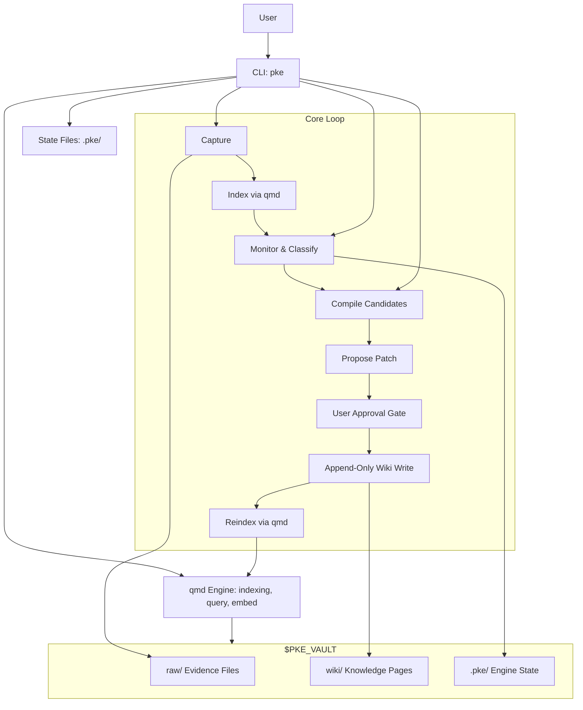
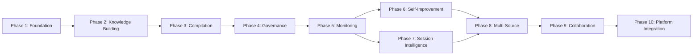

# Personal Knowledge Engine — Product Requirements Document

## 1. Executive Summary

Personal Knowledge Engine (PKE) is a local-first agentic knowledge product that transforms raw personal information—notes, meeting transcripts, AI drafts, project documents—into governed, reusable, compounding knowledge. It is designed for knowledge workers who accumulate vast archives but struggle to synthesize and retrieve durable conclusions from them. The MVP delivers a CLI-driven workflow operating exclusively on local files, proving the core knowledge loop: capture evidence, compile knowledge, and use knowledge naturally. All wiki writes are approval-gated, ensuring the knowledge base remains trustworthy and free from silent pollution.

## 2. Problem Statement & Motivation

Knowledge workers accumulate enormous volumes of information across years of work—meeting notes, strategy memos, product decisions, research articles, chat transcripts, personal reflections, and project documents. Yet when they need to reason from this accumulated knowledge, they face a fundamental gap: raw notes are scattered, contradictory, stale, and poorly synthesized. The knowledge exists, but it is not usable at the speed of thought.

Existing tools fail to solve this problem. Note-taking applications like DingTalk Docs, Notion, and Obsidian are excellent capture surfaces but provide no synthesis layer. They accumulate fragments without judging what is current, what conflicts, or what has become stale. Search tools like `qmd` enable retrieval but return raw fragments rather than durable conclusions. The user must repeatedly rediscover and re-synthesize the same knowledge across sessions, projects, and decisions.

The opportunity is a governed, local-first personal knowledge engine that helps users think and work from their accumulated knowledge without polluting the knowledge base. Following Karpathy's LLM Wiki direction, durable conclusions should be compiled into wiki pages so future work starts from stronger knowledge artifacts rather than repeatedly rediscovering fragments from raw documents. PKE fills the gap between capture tools (DingTalk, Notion, Obsidian, local files) and the user's need for synthesized, auditable, living knowledge—with explicit governance that prevents AI-generated noise from corrupting the knowledge base.

## 3. Target Users & Use Cases

### 3.1 Target Users

The initial user is a knowledge worker with a large personal archive:

- Founder / product thinker
- Strategy researcher
- AI product builder
- Investor / operator
- Person with years of notes, meetings, reflections, and project documents

### 3.2 Primary Use Cases (Jobs To Be Done)

- "When I ask a question, use my existing knowledge without making me search."
- "When a conversation produces a real conclusion, compile it into my wiki."
- "When new information arrives, capture it as evidence without treating it as truth."
- "When old assumptions become stale, expose them."
- "When I make a decision, show evidence, assumptions, risks, and what would change my mind."

## 4. Product Vision & Principles

### 4.1 Product Model

The product has three user-facing loops.

#### Capture

Capture stores incoming material as evidence.

Inputs:

- raw notes
- meeting notes
- chat/session summaries
- articles
- project docs
- user feedback
- personal ideas
- local AI drafts
- local final documents manually edited by the user

Capture output:

- raw evidence file or append-only evidence record
- metadata: date, source, topic, related pages
- possible wiki links
- changed-file record for daily compilation

Capture must not:

- rewrite conclusions into wiki
- mark new information as current truth
- overwrite existing raw evidence

#### Compile

Compile turns evidence into knowledge.

Compile triggers:

- explicit user command: update, save, write, revise, ingest, upgrade, compile
- explicit approval of a proposed update
- session close summary with update permission
- daily compilation
- staleness review

Compile output:

- updated or newly created wiki page
- evidence links
- marked conflicts
- stale/risky claims
- open questions
- page status and confidence
- explicit change report showing what changed
- reindexed and embedded qmd state
- optional document-learning summary when comparing draft vs final

Compile must not:

- invent unsupported conclusions
- silently upgrade draft to current
- hide contradictions
- edit raw notes except for ingestion, metadata, mechanical repair, or append-only processing notes

#### Use

Use is the default behavior during normal work.

The user asks naturally:

```text
QoderWork should be 2B or 2C?
```

The agent automatically:

- retrieves relevant wiki pages
- reads raw evidence when needed
- answers from current understanding
- identifies uncertainty
- proposes wiki updates when durable knowledge appears

Use must not:

- require the user to say "Use my Personal Knowledge Engine"
- update wiki without a definite update clue
- treat raw notes as truth

### 4.2 Key Principles

- Raw is evidence, not truth.
- Wiki is current judged knowledge, not a pile of summaries.
- Use should be automatic and invisible during normal work.
- Compile requires a definite trigger.
- Raw files are rarely edited.
- Wiki updates are cautious, evidence-linked, and status-aware.
- The system should expose conflict and uncertainty instead of hiding them.
- Daily compilation is the default maintenance rhythm.
- Product simplicity matters: the user should experience three loops, not a complex architecture.
- Self-improvement must be approval-gated: the engine may create proposals automatically, but wiki writes require approval.

### 4.3 Product Scope

#### Product Name

Personal Knowledge Engine, abbreviated as PKE.

#### Product Type

Local-first agentic knowledge engine for personal and professional thinking.

#### MVP Scope

The MVP is a **local-file Personal Knowledge Engine**.

In scope:

- `$PKE_VAULT/raw`
- `$PKE_VAULT/wiki`
- local Markdown files
- local text exports
- local AI draft documents
- local human-edited final documents
- local session transcripts
- qmd indexing, search, query, get, embed, lint
- a small `pke` CLI

Out of scope for MVP:

- DingTalk connector
- DingTalk Docs connector
- Qoder native plugin
- QoderWork native plugin
- Cursor plugin
- Anthropic CoWork connector
- browser automation for cloud documents
- always-on background daemon
- mobile app
- full UI/dashboard
- automatic raw-note rewriting
- unapproved wiki updates
- external web fact verification unless explicitly requested
- multi-user collaboration

Future integrations should be built as adapters after the local-file loop works.

## 5. Detailed Feature Specification

### 5.1 Core Capabilities Overview

| # | Capability | Purpose | Key Behaviors | Constraints |
|---|-----------|---------|---------------|-------------|
| 1 | **Evidence Store** | Ingest and preserve raw personal information as immutable evidence records. | Copies source files into `$PKE_VAULT/raw/_captures/` with timestamped filenames; indexes files via `qmd update` and `qmd embed`; records file metadata (size, sha256, mtime) in `state.json`. | Raw files are rarely edited. No rewriting of content except for mechanical repair, metadata fixes, or append-only processing notes. New captures never overwrite existing evidence. |
| 2 | **Knowledge Wiki** | Maintain structured, living knowledge pages that represent current judged understanding. | Each wiki page follows the 7-section template (Current Understanding, Key Principles, Evidence, Conflicts / Evolution, Stale Or Risky Claims, Open Questions, Related Pages) with YAML front matter. Pages are stored in `$PKE_VAULT/wiki/`. Template compliance is checked via `pke status`. | Wiki writes require a definite update clue (explicit command, approval of proposal, session close with permission, or scheduled compilation). No silent or opportunistic writes. |
| 3 | **Retrieval** | Enable natural-language knowledge discovery with wiki-first, raw-fallback semantics. | `pke use "question"` delegates to `qmd query` against the indexed collection. Wiki pages are preferred for current understanding; raw notes serve as supporting evidence. Conflicts between wiki and raw are surfaced, not silently resolved. | Retrieval must not trigger wiki writes. Results should expose uncertainty rather than hide it. |
| 4 | **Compile Engine** | Transform evidence into knowledge through a proposal-only, approval-gated pipeline. | Generates compile candidates from changed files and monitor events. Produces proposals with append-only patch operations targeting safe wiki sections. Proposals include source links, confidence levels, and detected signals. Every compile run outputs a change report. | Proposal-only in MVP — no automatic wiki writes. Proposals require explicit user approval before application. Must not invent unsupported conclusions, silently upgrade drafts, or hide contradictions. |
| 5 | **Agent Workflow** | Detect user intent and govern the boundary between reading and writing knowledge. | Automatically activates retrieval when requests touch knowledge-base topics. Detects update intent from explicit commands (update, save, write, revise, compile). Enforces update permission gate — without a definite clue, the agent answers and may propose but must not write. Quality gate ensures wiki updates follow the 7-section template and link evidence. | The user should never need to say "Use my Personal Knowledge Engine." Update governance must never be bypassed. |
| 6 | **Evaluation & Maintenance** | Score retrieval quality, detect staleness, and maintain knowledge health over time. | `pke stale` reviews topics for outdated claims. `pke monitor` detects file changes and classifies knowledge events (conclusions, conflicts, stale claims, open questions). `pke dashboard` provides a browser-based view of knowledge health. Daily compilation reviews changed files and generates compile candidates. | Evaluation is observational — it reports but does not write. Stale claims are flagged, not auto-corrected. |

### 5.2 User Stories with Acceptance Criteria

**US-01: Capture a New Knowledge Artifact**
As a knowledge worker, I want to capture a new document into my evidence store, so that it is preserved as immutable evidence and available for future retrieval.

Acceptance Criteria:
- [ ] `pke capture path/to/source.md` previews the capture target without writing by default.
- [ ] `pke capture path/to/source.md --write` copies the file into `$PKE_VAULT/raw/_captures/` with a timestamped filename.
- [ ] The wiki is not modified by the capture command.
- [ ] The capture output confirms the source path, target path, and write status.
- [ ] If the source file does not exist, the command exits with an error message.

**US-02: Query Existing Knowledge**
As a knowledge worker, I want to ask a natural-language question and get answers from my knowledge base, so that I can reason from accumulated knowledge without manual searching.

Acceptance Criteria:
- [ ] `pke use "question"` returns relevant results from the indexed collection via `qmd query`.
- [ ] Wiki pages are prioritized over raw notes in the retrieval results.
- [ ] The command does not modify any wiki or raw files.
- [ ] If no query string is provided, the command exits with a usage error.

**US-03: Review Daily Compilation Candidates**
As a knowledge worker, I want to see which files changed since my last review and what compile candidates exist, so that I can decide what knowledge to compile.

Acceptance Criteria:
- [ ] `pke daily` reports added, modified, and removed files since the saved baseline.
- [ ] Compile candidates are listed with file path, kind (raw/wiki), and contextual hints.
- [ ] The output includes actionable recommendations (review, compile, save baseline, reindex).
- [ ] The mode is clearly labeled as "proposal-only" — no wiki files are changed.
- [ ] `pke daily --save` updates the baseline after review.

**US-04: Learn from Classified Knowledge Events**
As a knowledge worker, I want to compare a draft and final document to learn what changed, so that I can identify durable knowledge signals from my editing patterns.

Acceptance Criteria:
- [ ] `pke learn draft.md final.md` computes a line-level diff between draft and final.
- [ ] Changes are classified into Product Judgment, Factual Corrections, Style Preferences, and Other.
- [ ] A proposed compile action is generated based on the classification.
- [ ] No wiki files are changed by this command.
- [ ] If either file is missing, the command exits with a usage error.

**US-05: Compile Knowledge into Wiki**
As a knowledge worker, I want to compile knowledge about a topic into a wiki page, so that durable conclusions are captured in my knowledge base.

Acceptance Criteria:
- [ ] `pke compile "topic"` queries the collection for relevant context.
- [ ] A change report is produced showing files changed by the command and since the baseline.
- [ ] The mode is "proposal-only" — the command does not write wiki pages in the MVP.
- [ ] The output includes a next-step instruction to review and approve an exact wiki update.
- [ ] Knowledge writes and evidence writes are reported as zero in the MVP.

**US-06: Monitor Vault for Changes**
As a knowledge worker, I want to monitor my vault for file changes and knowledge events, so that I am aware of what has changed and what needs attention.

Acceptance Criteria:
- [ ] `pke monitor` performs a one-shot scan comparing current files against the previous monitor snapshot.
- [ ] `pke monitor --path wiki/` scopes the scan to a vault-relative path without reporting out-of-scope files as removed.
- [ ] `pke monitor --watch --path wiki/` enters a scoped polling loop that detects changes in near-realtime.
- [ ] Watch mode requires `--path`; running without it exits with an error.
- [ ] Detected events are appended to `$PKE_VAULT/.pke/events.jsonl` and a markdown report is written to `$PKE_VAULT/.pke/reports/`.
- [ ] Events are semantically classified by wiki section (conclusion_added, conflict_detected, stale_claim_detected, open_question_added, evidence_added, etc.).

**US-07: Review Proposed Wiki Updates**
As a knowledge worker, I want to generate and review compile proposals from monitor events, so that I can decide which knowledge changes to approve.

Acceptance Criteria:
- [ ] `pke candidates` lists compile-trigger events with source file, event type, reason, and suggested target page.
- [ ] `pke propose --path raw/note.md --target wiki/page.md` creates a proposal with append-only patch operations.
- [ ] `pke propose --event event-id` creates a proposal from an existing monitor event.
- [ ] `pke proposals` lists all proposals with id, status, source, target, and reason.
- [ ] `pke proposal <id>` shows full proposal details including patch operations.

**US-08: Apply or Reject a Proposal**
As a knowledge worker, I want to approve or reject a proposed wiki update, so that only vetted knowledge enters my wiki.

Acceptance Criteria:
- [ ] `pke apply <id>` backs up the target wiki page, applies the append-only patch, updates proposal status to "applied", and attempts `qmd update` + `qmd embed`.
- [ ] If the proposal is not in "pending" status, the command exits with an error.
- [ ] If the target page does not exist, the command exits with an error.
- [ ] `pke reject <id>` sets the proposal status to "rejected" and copies it to the rejected directory.
- [ ] Applied proposals are archived in `$PKE_VAULT/.pke/applied/`; rejected in `$PKE_VAULT/.pke/rejected/`.
- [ ] If qmd refresh fails after apply, the wiki patch remains applied and the failure is recorded.

**US-09: View Knowledge Dashboard**
As a knowledge worker, I want a browser-based dashboard showing my knowledge health, so that I can monitor events, proposals, and reports at a glance.

Acceptance Criteria:
- [ ] `pke dashboard --port 8787` starts a local HTTP server with a browser UI at `/`.
- [ ] The dashboard displays metrics: event totals, scan results, conflicts, stale claims, open questions.
- [ ] Event filtering by type (conclusions, conflicts, stale, questions) is supported.
- [ ] Pending proposals can be approved or rejected directly from the dashboard.
- [ ] "Scan Now" button triggers a monitor scan via `/api/scan`.
- [ ] `pke dashboard --path raw/ --auto-scan` enables automatic scanning of the scoped path on each refresh.

**US-10: Close a Work Session**
As a knowledge worker, I want to close a work session by scanning a transcript for durable signals, so that valuable conclusions are not lost.

Acceptance Criteria:
- [ ] `pke close-session transcript.md` reads the transcript and identifies lines containing durable-signal keywords (decision, conclusion, should, must, update, etc.).
- [ ] Possible durable signals are listed in the output.
- [ ] The mode is "proposal-only" — no wiki files are changed.
- [ ] If the transcript file is missing, the command exits with a usage error.

### 5.3 Workflows

#### Workflow A: Retrieval (Use)

**Trigger:** User asks a natural-language question during normal work.

**Steps:**
1. Parse the user query.
2. Execute `qmd query "<question>" -c <collection> -n 8` to retrieve relevant documents.
3. Prioritize wiki pages for current understanding.
4. Fall back to raw notes as supporting evidence.
5. If wiki and raw notes conflict, surface the conflict explicitly.
6. Return the answer with current understanding, evidence, conflicts, and open questions.

**Acceptance Criteria:**
- [ ] Wiki pages are returned before raw notes when both are relevant.
- [ ] Conflicts between sources are exposed, not silently resolved.
- [ ] No files are modified during retrieval.
- [ ] Low-confidence or missing knowledge is reported as uncertainty.

**Constraints:**
- Retrieval must not trigger wiki writes.
- The user should not need to explicitly activate the knowledge engine.
- Raw notes are treated as evidence, not truth.

#### Workflow B: Knowledge Capture

**Trigger:** User runs `pke capture <source>` or a new file is detected in the vault.

**Steps:**
1. Validate the source file exists.
2. Generate a timestamped target path in `$PKE_VAULT/raw/_captures/`.
3. In preview mode (default), display source, target, and write status without copying.
4. With `--write`, copy the file to the target path.
5. Record the capture event for future compilation review.

**Acceptance Criteria:**
- [ ] Source files are copied, not moved.
- [ ] Target filenames include ISO timestamps to prevent collisions.
- [ ] The wiki is never modified by capture.
- [ ] Preview mode is the default; writing requires `--write`.

**Constraints:**
- Capture stores evidence, not conclusions.
- New information must not be marked as current truth.
- Existing raw evidence must not be overwritten.

#### Workflow C: Compile (Proposal)

**Trigger:** User runs `pke compile "topic"`, `pke propose`, or approves a compile candidate.

**Steps:**
1. Query the collection for relevant context about the topic.
2. Scan the vault before and after to detect changes.
3. Diff against the saved baseline to identify changes since last review.
4. Generate a change report (files changed by command, files changed since baseline, knowledge writes, evidence writes).
5. Output proposal-only results with next-step instructions.
6. If a proposal is created (`pke propose`), generate append-only patch operations targeting safe sections.
7. On approval (`pke apply`), back up the target page, apply the patch, update proposal status, and refresh qmd.

**Acceptance Criteria:**
- [ ] Every compile run produces a change report.
- [ ] Compile is proposal-only in MVP — zero wiki writes unless explicitly approved.
- [ ] Patch operations are append-only and target safe sections (Evidence, Open Questions, Conflicts / Evolution, Stale Or Risky Claims).
- [ ] Applied patches include backup, audit record, and qmd refresh attempt.

**Constraints:**
- Must not invent unsupported conclusions.
- Must not silently upgrade draft status to current.
- Must not hide contradictions.
- Must not edit raw notes except for ingestion, metadata repair, or append-only processing notes.

#### Workflow D: Daily Compilation

**Trigger:** User runs `pke daily` as part of a maintenance routine.

**Steps:**
1. Scan the vault to build the current file snapshot.
2. Diff against the saved baseline to find added, modified, and removed files.
3. Generate compile candidates from changed files, annotated with kind and contextual hints.
4. Output a daily compilation proposal with change counts, candidates, and recommendations.
5. Optionally save the new baseline with `--save`.

**Acceptance Criteria:**
- [ ] All changed files since the baseline are reported.
- [ ] Compile candidates include contextual hints (e.g., "changed evidence; review before compiling").
- [ ] Active product/strategy topics are flagged when file paths match known patterns.
- [ ] Mode is clearly labeled "proposal-only."
- [ ] Recommendations guide the user through the review-compile-reindex workflow.

**Constraints:**
- Daily compilation does not write wiki pages.
- One-off information should be left as raw evidence.
- The user must explicitly approve any wiki updates.

#### Workflow E: Knowledge Monitor

**Trigger:** User runs `pke monitor`, `pke monitor --watch --path <path>`, or a dashboard scan.

**Steps:**
1. Read the previous monitor state from `$PKE_VAULT/.pke/monitor-state.json`.
2. Scan the vault (or scoped path) to build the current file snapshot.
3. Diff against the previous snapshot to detect added, modified, and removed files.
4. For changed wiki files, parse markdown sections and compare against previous section snapshots.
5. Classify changes into semantic event types based on the wiki section affected.
6. Append events to `$PKE_VAULT/.pke/events.jsonl`.
7. Write a markdown report to `$PKE_VAULT/.pke/reports/`.
8. Update `monitor-state.json` with the new snapshot.
9. In watch mode, repeat on a polling interval (default 2000ms).

**Acceptance Criteria:**
- [ ] File-level events are emitted for added, modified, and removed files.
- [ ] Knowledge-level events are emitted for section changes (conclusion_added, conflict_detected, stale_claim_detected, open_question_added, evidence_added, evidence_link_added, conclusion_changed, knowledge_section_updated).
- [ ] Scoped monitoring preserves out-of-scope state (e.g., `--path wiki/` does not report `raw/` removals).
- [ ] Watch mode requires `--path` and polls at a configurable interval.
- [ ] Reports and events are persisted for history and dashboard consumption.

**Constraints:**
- The monitor is an observability layer, not a writer.
- Watch paths must be inside the vault.
- Scoped polling is used instead of platform-specific filesystem watchers.
- The monitor must not watch unrelated files outside the configured scope.

## 6. Data Model & Architecture

### 6.1 Vault Layout & File Structure

```
$PKE_VAULT/
├── raw/                        # Source knowledge artifacts
│   ├── _captures/              # Evidence files ingested via `pke capture --write`
│   ├── meeting-notes/          # Meeting transcripts, session records
│   ├── articles/               # Saved articles, research papers
│   └── ...                     # PDFs, notes, screenshots, AI drafts, etc.
├── wiki/                       # Structured knowledge pages (Markdown + YAML front matter)
│   ├── topic-page.md           # Each file follows the 7-section template
│   └── ...
└── .pke/                       # PKE engine state (git-ignored)
    ├── state.json              # Review baseline and tracked file snapshot
    ├── monitor-state.json      # Monitor snapshot, section state, removal tombstones
    ├── events.jsonl            # Append-only knowledge event log
    ├── candidates/             # (Reserved) Generated compile candidates
    ├── proposals/              # Pending compile proposals (JSON)
    ├── applied/                # Archive of applied proposals
    ├── rejected/               # Archive of rejected proposals
    ├── backups/                # Pre-apply wiki page backups
    └── reports/                # Markdown monitor reports (timestamped)
```

Supported file types: `.md`, `.txt`, `.markdown`. Files starting with `.` (except `.pke`) are ignored during vault scans.

### 6.2 Knowledge Page Schema

Every wiki page follows a standardized template with YAML front matter and seven required sections.

#### YAML Front Matter

```yaml
---
status: current | draft | stale | deprecated
confidence: high | medium | low
last_reviewed: YYYY-MM-DD
page_type: knowledge | workflow | index | reference
engine_layer: capture | compile | use | agent | evaluation
source_count: <number>          # Count of linked evidence sources
---
```

| Field | Type | Description |
|-------|------|-------------|
| `status` | enum | Page lifecycle stage. `current` = actively maintained; `draft` = incomplete; `stale` = needs review; `deprecated` = superseded. |
| `confidence` | enum | Editorial confidence in the page's claims. |
| `last_reviewed` | date | ISO date of most recent human review. |
| `page_type` | enum | Classification for retrieval and organization. |
| `engine_layer` | enum | Which PKE layer this page primarily serves. |
| `source_count` | integer | Number of evidence sources linked from the page. |

#### Required Sections (7-Section Template)

```markdown
## Current Understanding
<!-- Durable thesis — what we currently believe and why. -->

## Key Principles
<!-- Reusable rules, frameworks, or mental models derived from evidence. -->

## Evidence
<!-- Links to raw sources and supporting material. Each entry should cite a specific file. -->

## Conflicts / Evolution
<!-- Contradictions between sources, changed beliefs, and how understanding evolved. -->

## Stale Or Risky Claims
<!-- Time-sensitive assumptions, unverified claims, and facts that may have expired. -->

## Open Questions
<!-- Unresolved questions that would change current understanding if answered. -->

## Related Pages
<!-- Wiki-links to related knowledge pages. -->
```

Template compliance is validated by `pke status`, which reports the count of compliant vs. non-compliant wiki pages and lists missing sections.

### 6.3 State & Event Data Models

#### `state.json` — Review Baseline

Tracks the last review checkpoint and a snapshot of all indexed files.

```json
{
  "baselineAt": "2026-05-06T10:30:00.000Z",
  "files": {
    "raw/meeting-2026-05-01.md": {
      "kind": "raw",
      "size": 4096,
      "mtimeMs": 1746532200000,
      "sha256": "a1b2c3d4..."
    },
    "wiki/topic-page.md": {
      "kind": "wiki",
      "size": 2048,
      "mtimeMs": 1746532200000,
      "sha256": "e5f6g7h8..."
    }
  }
}
```

| Field | Type | Description |
|-------|------|-------------|
| `baselineAt` | ISO 8601 timestamp | When the baseline was last saved via `--save`. |
| `files` | object | Map of vault-relative paths to file metadata. |
| `files[path].kind` | `"raw"` \| `"wiki"` \| `"other"` | Classification based on directory. |
| `files[path].size` | integer | File size in bytes. |
| `files[path].mtimeMs` | integer | Last modification time in milliseconds. |
| `files[path].sha256` | string | SHA-256 hash of file content for change detection. |

#### `events.jsonl` — Knowledge Event Log

Append-only log of knowledge events detected by the monitor. One JSON object per line.

```json
{
  "id": "2026-05-06T10:30:00.000Z-a1b2c3d4",
  "time": "2026-05-06T10:30:00.000Z",
  "event_type": "conclusion_added",
  "path": "wiki/topic-page.md",
  "kind": "wiki",
  "source": "monitor",
  "summary": "New conclusion about product strategy.",
  "approval_status": "observed",
  "section": "Current Understanding",
  "line": "New conclusion about product strategy."
}
```

| Field | Type | Description |
|-------|------|-------------|
| `id` | string | Unique event ID: `<ISO timestamp>-<random hex>`. |
| `time` | ISO 8601 timestamp | When the event was detected. |
| `event_type` | string | Semantic classification (see Event Types below). |
| `path` | string | Vault-relative file path. |
| `kind` | `"raw"` \| `"wiki"` \| `"other"` | File classification. |
| `source` | string | Detection source: `"monitor"`, `"watch"`, `"dashboard"`, `"manual"`. |
| `summary` | string | Human-readable description of the event. |
| `approval_status` | `"observed"` \| `"pending"` | Whether the event implies a pending approval. |
| `section` | string (optional) | Wiki section that triggered the event. |
| `line` | string (optional) | Specific content line that triggered the event. |

**Event Types:**

| Event Type | Trigger Section | Description |
|-----------|----------------|-------------|
| `raw_added` | — | New raw evidence file detected. |
| `raw_modified` | — | Existing raw file content changed. |
| `raw_removed` | — | Raw file removed from vault. |
| `wiki_added` | — | New wiki page detected. |
| `wiki_modified` | — | Existing wiki page content changed. |
| `wiki_removed` | — | Wiki page removed from vault. |
| `conclusion_added` | Current Understanding, Key Principles | New conclusion or principle added. |
| `conclusion_changed` | Current Understanding | Existing conclusion modified (lines added and removed). |
| `evidence_added` | Evidence | New evidence text added. |
| `evidence_link_added` | Evidence | New wiki-link (`[[...]]`) added to evidence. |
| `conflict_detected` | Conflicts / Evolution | Contradiction or belief evolution recorded. |
| `stale_claim_detected` | Stale Or Risky Claims | Time-sensitive or risky claim flagged. |
| `open_question_added` | Open Questions | New unresolved question added. |
| `knowledge_section_updated` | Related Pages, other | Other knowledge section changed. |

#### `monitor-state.json` — Monitor Snapshot

Tracks the monitor's view of the vault for incremental change detection.

```json
{
  "checkedAt": "2026-05-06T10:30:00.000Z",
  "scope": "wiki/",
  "files": {
    "wiki/topic-page.md": {
      "kind": "wiki",
      "size": 2048,
      "mtimeMs": 1746532200000,
      "sha256": "e5f6g7h8..."
    }
  },
  "wikiSections": {
    "wiki/topic-page.md": {
      "Current Understanding": ["Thesis line 1", "Thesis line 2"],
      "Key Principles": ["Principle 1"],
      "Evidence": ["[[source-a]]"],
      "Conflicts / Evolution": [],
      "Stale Or Risky Claims": [],
      "Open Questions": ["What would change this?"],
      "Related Pages": ["[[related-topic]]"]
    }
  },
  "removedFiles": {},
  "latestReport": { "...serialized report summary..." },
  "latestActivityReport": { "...last report with events..." }
}
```

| Field | Type | Description |
|-------|------|-------------|
| `checkedAt` | ISO 8601 timestamp | When the last monitor scan completed. |
| `scope` | string | Vault-relative scope of the last scan, or `"vault"` for full scans. |
| `files` | object | Same schema as `state.json` files — merged across scoped and full scans. |
| `wikiSections` | object | Map of wiki paths to parsed section content (array of non-empty trimmed lines per section). |
| `removedFiles` | object | Tombstones for removed files to prevent false re-detection across scoped scans. |
| `latestReport` | object | Serialized summary of the most recent monitor report. |
| `latestActivityReport` | object | Serialized summary of the most recent report that contained events. |

#### Proposal Format

Proposals are JSON files stored in `$PKE_VAULT/.pke/proposals/`.

```json
{
  "id": "proposal-2026-05-06T10-30-00-000Z-a1b2c3",
  "createdAt": "2026-05-06T10:30:00.000Z",
  "status": "pending",
  "trigger": "raw_added",
  "source_event_ids": ["2026-05-06T10:30:00.000Z-a1b2c3d4"],
  "source_files": ["raw/meeting-notes.md"],
  "target_page": "wiki/topic-page.md",
  "reason": "new raw evidence needs review before promotion",
  "confidence": "medium",
  "requires_user_approval": true,
  "detected_signals": {
    "new_conclusions": [],
    "conflicts": [],
    "stale_claims": [],
    "open_questions": []
  },
  "patch": {
    "target_page": "wiki/topic-page.md",
    "operations": [
      {
        "type": "append_to_section",
        "section": "Evidence",
        "content": "- [[meeting-notes]]: raw evidence added on 2026-05-06."
      },
      {
        "type": "append_to_section",
        "section": "Open Questions",
        "content": "- Which claims from [[meeting-notes]] should be promoted into current understanding?"
      }
    ]
  }
}
```

| Field | Type | Description |
|-------|------|-------------|
| `id` | string | Unique proposal ID with timestamp and random suffix. |
| `createdAt` | ISO 8601 timestamp | When the proposal was created. |
| `status` | `"pending"` \| `"applied"` \| `"rejected"` | Lifecycle state. |
| `trigger` | string | Event type that triggered the proposal. |
| `source_event_ids` | string[] | IDs of events that contributed to this proposal. |
| `source_files` | string[] | Vault-relative paths of source evidence. |
| `target_page` | string \| null | Target wiki page for the patch. |
| `reason` | string | Human-readable reason for the proposal. |
| `confidence` | `"high"` \| `"medium"` \| `"low"` | Confidence that the proposal is correct. |
| `requires_user_approval` | boolean | Always `true` in MVP. |
| `detected_signals` | object | Classified signals: conclusions, conflicts, stale claims, open questions. |
| `patch.operations[]` | object | Ordered list of append-only patch operations. |
| `patch.operations[].type` | `"append_to_section"` | Operation type (only `append_to_section` in MVP). |
| `patch.operations[].section` | string | Target section name within the wiki page. |
| `patch.operations[].content` | string | Markdown content to append. |

On apply, the proposal gains additional fields: `appliedAt`, `backupPath`, and `changeReport` (with `target`, `changed`, `beforeSha256`, `afterSha256`, `operations` count, and `qmdRefresh` status). On reject, it gains `rejectedAt`.

### 6.4 System Architecture Diagram



## 7. CLI API Reference

### 7.1 Command Specifications

#### `pke help`

**Purpose:** Display usage information and all available commands.

**Synopsis:**
```
pke help
pke --help
pke -h
```

**Arguments:** None.

**Options:** None.

**Behavior:**
- Prints the full command list, global options, and governance principles to stdout.
- Exits with code 0.

**Example:**
```bash
$ pke help
> Personal Knowledge Engine CLI
> Usage: ...
```

---

#### `pke status`

**Purpose:** Display vault health, qmd connectivity, baseline state, and template compliance.

**Synopsis:**
```
pke status [--json]
```

**Options:**
| Flag | Description |
|------|-------------|
| `--json` | Output as JSON |

**Behavior:**
- Runs `qmd status` to verify qmd connectivity.
- Scans `$PKE_VAULT/wiki/` for template compliance (7-section check).
- Reads `state.json` for baseline and tracked-file counts.
- Reports vault path, state path, baseline timestamp, tracked file count, wiki page count, and compliant/non-compliant pages.

**Output:**
- Human-readable: Multi-line status summary.
- JSON (`--json`): Object with fields `vault`, `wikiDir`, `rawDir`, `statePath`, `baselineAt`, `trackedFiles`, `templateCoverage`, `qmdStatus`, `qmdError`.

**Example:**
```bash
$ pke status
> qmd: running (collection: myknowledge)
>
> PKE
>   Vault:        /Users/user/MyKnowledge
>   State:        /Users/user/MyKnowledge/.pke/state.json
>   Baseline:     2026-05-06T10:30:00.000Z
>   Tracked:      42 files
>   Wiki pages:   8
>   Template:     7/8 compliant
>   Missing:      1 page(s)
```

---

#### `pke use <query>`

**Purpose:** Query the knowledge base using natural language and retrieve relevant wiki/raw content.

**Synopsis:**
```
pke use "question"
```

**Arguments:**
| Argument | Required | Description |
|----------|----------|-------------|
| `query` | Yes | Natural-language question (remaining args joined with spaces) |

**Options:**
| Flag | Description |
|------|-------------|
| `--n <number>` | Number of results to retrieve (default: 8) |

**Behavior:**
- Executes `qmd query "<query>" -c <collection> -n <n>`.
- Streams qmd stdout directly to the terminal.
- If qmd returns stderr, it is written to stderr.
- Does not modify any files.

**Output:**
- Human-readable: Raw qmd query results streamed to stdout.

**Error Conditions:**
- If no query is provided, throws: `usage: pke use "question"`.
- If qmd fails, throws with qmd stderr.

**Example:**
```bash
$ pke use "What is our product strategy?"
> [qmd retrieval results from wiki and raw files]
```

---

#### `pke capture <path>` [--write]

**Purpose:** Capture a source file into the evidence store as an immutable timestamped copy.

**Synopsis:**
```
pke capture path/to/source.md [--write] [--json]
```

**Arguments:**
| Argument | Required | Description |
|----------|----------|-------------|
| `path` | Yes | Path to the source file to capture |

**Options:**
| Flag | Description |
|------|-------------|
| `--write` | Actually copy the file (default is preview-only) |
| `--json` | Output as JSON |

**Behavior:**
- Resolves the source file to an absolute path.
- Validates that the source file exists (exits with error if not found).
- Generates a target path: `$PKE_VAULT/raw/_captures/<ISO-timestamp>-<basename>`.
- In preview mode (default): displays source, target, and write status without copying.
- With `--write`: creates the `_captures/` directory if needed and copies the file.
- The wiki is never modified.

**Output:**
- Human-readable: Source, target, write status, and wiki status.
- JSON (`--json`): Object with fields `source`, `target`, `write`, `rule`.

**Example:**
```bash
$ pke capture notes/meeting.md
> Capture
>   Source: /path/to/notes/meeting.md
>   Target: /Users/user/MyKnowledge/raw/_captures/2026-05-06T10-30-00-000Z-meeting.md
>   Write:  no, preview only
>   Wiki:   not updated
```

---

#### `pke changed` [--save] [--json]

**Purpose:** Show files that changed since the last saved baseline.

**Synopsis:**
```
pke changed [--save] [--json]
```

**Options:**
| Flag | Description |
|------|-------------|
| `--save` | Save current snapshot as the new baseline |
| `--json` | Output as JSON |

**Behavior:**
- Scans the vault (raw/ and wiki/) to build a current file snapshot with SHA-256 hashes.
- Reads the saved baseline from `state.json`.
- Computes added, modified, and removed files by comparing hashes.
- With `--save`, writes the current snapshot as the new baseline.

**Output:**
- Human-readable: Counts of added/modified/removed files, followed by file lists.
- JSON (`--json`): Object with fields `vault`, `baselineAt`, `checkedAt`, `counts`, `changes`, `saved`.

**Example:**
```bash
$ pke changed
> Changed Files
>   Added:     3
>   Modified:  1
>   Removed:   0
>   Total:     4
>
> Added
>   - raw/new-note.md
>   - raw/article.md
>   - wiki/new-topic.md
>
> Modified
>   - wiki/existing-topic.md
```

---

#### `pke daily` [--save] [--json]

**Purpose:** Produce a daily compilation proposal showing changes and compile candidates.

**Synopsis:**
```
pke daily [--save] [--json]
```

**Options:**
| Flag | Description |
|------|-------------|
| `--save` | Save current snapshot as new baseline after review |
| `--json` | Output as JSON |

**Behavior:**
- Scans the vault and diffs against the saved baseline.
- Generates compile candidates from changed files, annotated with kind (raw/wiki) and contextual hints.
- Outputs a daily compilation proposal with change counts, candidates, and recommendations.
- Mode is always "proposal-only" — no wiki writes.

**Output:**
- Human-readable: Mode, baseline, checked timestamp, change counts, compile candidates with hints, and recommendations.
- JSON (`--json`): Object with fields `mode`, `checkedAt`, `baselineAt`, `changed`, `candidates`, `recommendations`, `saved`.

**Example:**
```bash
$ pke daily
> Daily Compilation Proposal
>   Mode:      proposal-only
>   Baseline:  2026-05-05T08:00:00.000Z
>   Checked:   2026-05-06T10:30:00.000Z
>
> Changed Files
>   Added: 2  Modified: 1  Removed: 0  Total: 3
>
> Compile Candidates
>   - raw: raw/new-evidence.md
>       changed evidence; review before compiling any wiki update
>
> Recommendations
>   - Review changed raw files as evidence only.
>   - Compile wiki only when you explicitly approve a proposed update.
>   - Run `pke changed --save` after reviewing to set a new baseline.
>   - Run `PATH=/opt/homebrew/bin:$PATH qmd update` and `qmd embed -c myknowledge` after approved wiki edits.
```

---

#### `pke learn <draft> <final>` [--json]

**Purpose:** Compare a draft and final document to classify what changed and propose compile actions.

**Synopsis:**
```
pke learn draft.md final.md [--json]
```

**Arguments:**
| Argument | Required | Description |
|----------|----------|-------------|
| `draft` | Yes | Path to the draft document |
| `final` | Yes | Path to the final (human-edited) document |

**Options:**
| Flag | Description |
|------|-------------|
| `--json` | Output as JSON |

**Behavior:**
- Reads both files and computes a line-level diff.
- Classifies added lines into four categories: Product Judgment / Scope Changes, Factual Corrections, Style Preferences, Other Added Final Text.
- Generates proposed compile actions based on the classification.
- No wiki files are changed.

**Output:**
- Human-readable: Draft/final paths, added/removed line counts, classified changes, proposed compile actions.
- JSON (`--json`): Object with fields `draft`, `final`, `summary`, `classifications`, `proposedCompile`, `updateRule`.

**Error Conditions:**
- If either file path is missing, throws: `usage: pke learn draft.md final.md`.
- If a file does not exist, throws a file-not-found error.

**Example:**
```bash
$ pke learn ai-draft.md human-final.md
> Draft-Final Learning Proposal
>   Draft: /path/to/ai-draft.md
>   Final: /path/to/human-final.md
>   Added lines:   15
>   Removed lines: 8
>
> Product Judgment / Scope Changes
>   - We should focus on 2B users first...
>
> Proposed Compile
>   - Review product judgment changes for possible wiki compile.
>
> No wiki files were changed.
```

---

#### `pke compile <topic>` [--json]

**Purpose:** Query knowledge about a topic and produce a proposal-only compile plan.

**Synopsis:**
```
pke compile "topic or page" [--json]
```

**Arguments:**
| Argument | Required | Description |
|----------|----------|-------------|
| `topic` | Yes | Topic or page name to compile knowledge about |

**Options:**
| Flag | Description |
|------|-------------|
| `--json` | Output as JSON |

**Behavior:**
- Scans the vault before executing.
- Queries `qmd query "<topic>" -c <collection> -n 8` for relevant context.
- Scans the vault after to detect any changes made by the qmd call.
- Diffs both against baseline and before/after the command.
- Produces a change report with mode "proposal-only".
- Does not write wiki pages in the MVP.

**Output:**
- Human-readable: Topic, mode, relevant context from qmd, change report, and next-step instruction.
- JSON (`--json`): Object with fields `topic`, `collection`, `relevantContext`, `changeReport`, `nextStep`.

**Error Conditions:**
- If no topic is provided, throws: `usage: pke compile "topic or page"`.

**Example:**
```bash
$ pke compile "product strategy"
> Compile Plan
>   Topic: product strategy
>   Mode:  proposal-only
>
> Relevant Context
>   [qmd retrieval results]
>
> Change Report
>   Mode:             proposal-only
>   Knowledge writes: 0
>   Evidence writes:  0
>
> Next Step
>   Review the target page and approve an exact wiki update before writing.
```

---

#### `pke close-session <transcript>` [--json]

**Purpose:** Scan a session transcript for durable knowledge signals.

**Synopsis:**
```
pke close-session transcript.md [--json]
```

**Arguments:**
| Argument | Required | Description |
|----------|----------|-------------|
| `transcript` | Yes | Path to the session transcript file |

**Options:**
| Flag | Description |
|------|-------------|
| `--json` | Output as JSON |

**Behavior:**
- Reads the transcript file.
- Filters non-empty lines for durable-signal keywords (decide, conclusion, therefore, update, should, must, and Chinese equivalents).
- Reports up to 30 possible durable signals.
- Mode is "proposal-only" — no wiki files are changed.

**Output:**
- Human-readable: Transcript path, line count, possible durable signals.
- JSON (`--json`): Object with fields `transcript`, `lineCount`, `possibleDurableSignals`, `rule`.

**Error Conditions:**
- If no transcript file is provided, throws: `usage: pke close-session transcript.md`.
- If the file does not exist, throws a file-not-found error.

**Example:**
```bash
$ pke close-session session-2026-05-06.md
> Session Compile Proposal
>   Transcript: /path/to/session-2026-05-06.md
>   Lines:      142
>
> Possible Durable Signals
>   - We should prioritize local-first architecture...
>   - Decision: use append-only patches for wiki updates...
>
> No wiki files were changed.
```

---

#### `pke stale <topic>`

**Purpose:** Query for stale, risky, or outdated claims about a topic.

**Synopsis:**
```
pke stale "topic or page"
```

**Arguments:**
| Argument | Required | Description |
|----------|----------|-------------|
| `topic` | Yes | Topic or page name to review for staleness |

**Behavior:**
- Executes `qmd query "<topic> stale risky claims assumptions" -c <collection> -n 8`.
- Streams the results to stdout with a "proposal-only" mode label.
- Does not support `--json` output.
- Does not modify any files.

**Output:**
- Human-readable: Topic, mode label, and qmd retrieval results related to stale/risky claims.

**Error Conditions:**
- If no topic is provided, throws: `usage: pke stale "topic or page"`.

**Example:**
```bash
$ pke stale "market assumptions"
> Staleness Review Context
>   Topic: market assumptions
>   Mode:  proposal-only
>
> [qmd results about stale/risky claims]
```

---

#### `pke monitor` [--path] [--watch] [--json]

**Purpose:** Scan the vault for file changes and classify knowledge events.

**Synopsis:**
```
pke monitor [--path <vault-relative-path>] [--watch] [--json]
```

**Options:**
| Flag | Description |
|------|-------------|
| `--path <path>` | Scope the scan to a vault-relative path |
| `--watch` | Enter a polling loop for realtime monitoring (requires `--path`) |
| `--json` | Output as JSON (one-shot mode only) |
| `--interval <ms>` | Polling interval in milliseconds (default: 2000, watch mode only) |
| `--verbose` | Print summary on every poll cycle even when no events (watch mode only) |

**Behavior (one-shot):**
- Reads previous monitor state from `$PKE_VAULT/.pke/monitor-state.json`.
- Scans the vault (or scoped path) and computes added/modified/removed files.
- For changed wiki files, parses markdown sections and compares against previous section snapshots.
- Classifies changes into semantic event types (conclusion_added, conflict_detected, stale_claim_detected, open_question_added, evidence_added, etc.).
- Appends events to `$PKE_VAULT/.pke/events.jsonl`.
- Writes a markdown report to `$PKE_VAULT/.pke/reports/`.
- Updates `monitor-state.json` with new snapshot.

**Behavior (watch mode):**
- Requires `--path` (exits with error if omitted).
- Validates the watch path exists inside the vault.
- Runs the monitor scan on a polling interval.
- Prints a timestamped summary when events are detected.
- Runs until interrupted with Ctrl-C.

**Output:**
- Human-readable (one-shot): Full monitor report with file changes, events, and summary.
- JSON (`--json`, one-shot): Full report object with fields `checkedAt`, `scope`, `monitorStatePath`, `eventsPath`, `reportsDir`, `counts`, `changes`, `summary`, `events`, `reportPath`.
- Watch mode: Timestamped event summaries printed on each cycle with activity.

**Error Conditions:**
- `--watch` without `--path` throws: `realtime watch requires --path`.
- Path outside the vault throws: `monitor path must be inside vault`.

**Example:**
```bash
$ pke monitor --path wiki/
> # Knowledge Monitor Report
> - Checked: 2026-05-06T10:30:00.000Z
> - Scope: wiki/
> - Events: 3
> - Files changed: 2
> ...

$ pke monitor --watch --path wiki/
> Knowledge Monitor Watch
>   Vault: /Users/user/MyKnowledge
>   Path:  wiki/
>   Mode:  scoped polling every 2000ms
>   Press Ctrl-C to stop.
>
> [10:30:05] 2 event(s), 1 file change(s)
>   - conclusion_added: wiki/topic.md - New thesis statement...
```

---

#### `pke events` [--limit] [--json]

**Purpose:** Display recent knowledge events from the event log.

**Synopsis:**
```
pke events [--limit <number>] [--json]
```

**Options:**
| Flag | Description |
|------|-------------|
| `--limit <number>` | Number of most recent events to show (default: 20) |
| `--json` | Output as JSON |

**Behavior:**
- Reads `$PKE_VAULT/.pke/events.jsonl`.
- Returns the last N events (controlled by `--limit`).
- If no events exist, reports "none".

**Output:**
- Human-readable: List of events with timestamp, event type, path, and summary.
- JSON (`--json`): Array of event objects.

**Example:**
```bash
$ pke events --limit 5
> Knowledge Events
> - 2026-05-06T10:30:00.000Z conclusion_added wiki/topic.md
>     New conclusion about product strategy.
> - 2026-05-06T10:28:00.000Z raw_added raw/meeting.md
>     Added raw file.
```

---

#### `pke report <which>` [--json]

**Purpose:** Display saved monitor reports.

**Synopsis:**
```
pke report latest|today [--json]
```

**Arguments:**
| Argument | Required | Description |
|----------|----------|-------------|
| `which` | Yes | `latest` (most recent report) or `today` (all reports from today) |

**Options:**
| Flag | Description |
|------|-------------|
| `--json` | Output as JSON |

**Behavior:**
- Lists all markdown reports in `$PKE_VAULT/.pke/reports/`.
- For `latest`: selects the most recent report.
- For `today`: selects reports whose filenames start with today's ISO date.
- Outputs the raw markdown content of selected reports.

**Output:**
- Human-readable: Raw markdown content of matching reports.
- JSON (`--json`): Array of objects with fields `path` and `text`.

**Error Conditions:**
- If argument is neither `latest` nor `today`, throws: `usage: pke report latest|today`.

**Example:**
```bash
$ pke report latest
> # Knowledge Monitor Report
> - Checked: 2026-05-06T10:30:00.000Z
> - Scope: wiki/
> ...
```

---

#### `pke dashboard` [--port] [--path] [--auto-scan]

**Purpose:** Start a local browser-based knowledge dashboard.

**Synopsis:**
```
pke dashboard [--port <number>] [--path <vault-relative-path>] [--auto-scan] [--host <address>]
```

**Options:**
| Flag | Description |
|------|-------------|
| `--port <number>` | HTTP server port (default: 8787) |
| `--host <address>` | Bind address (default: 127.0.0.1) |
| `--path <path>` | Scope auto-scan to a vault-relative path |
| `--auto-scan` | Automatically run a monitor scan on dashboard refresh |

**Behavior:**
- Starts an HTTP server with the following endpoints:
  - `GET /` — HTML dashboard UI.
  - `GET /api/dashboard` — JSON dashboard data (events, reports, proposals, metrics).
  - `GET /api/scan` — Triggers a monitor scan and returns updated dashboard data.
  - `GET /api/propose?event=<id>[&target=<page>]` — Creates a proposal from an event.
  - `GET /api/apply?id=<proposal-id>` — Applies a pending proposal.
  - `GET /api/reject?id=<proposal-id>` — Rejects a proposal.
- With `--auto-scan`, each `/api/dashboard` request runs a scoped monitor scan.
- The dashboard displays metrics, event filtering, pending proposals (with approve/reject actions), and reports.
- Runs until interrupted with Ctrl-C.

**Output:**
- Console: URL, vault path, scope, scan mode, events path, reports path.

**Example:**
```bash
$ pke dashboard --port 8787 --path raw/ --auto-scan
> PKE Dashboard
>   URL:     http://127.0.0.1:8787
>   Vault:   /Users/user/MyKnowledge
>   Scope:   raw/
>   Scan:    auto on refresh
>   Events:  /Users/user/MyKnowledge/.pke/events.jsonl
>   Reports: /Users/user/MyKnowledge/.pke/reports
>   Press Ctrl-C to stop.
```

---

#### `pke candidates` [--json]

**Purpose:** List compile candidates derived from recent knowledge events.

**Synopsis:**
```
pke candidates [--json]
```

**Options:**
| Flag | Description |
|------|-------------|
| `--json` | Output as JSON |

**Behavior:**
- Reads the event log and filters for compile-trigger event types: `raw_added`, `raw_modified`, `wiki_modified`, `conflict_detected`, `stale_claim_detected`, `open_question_added`, `conclusion_added`, `conclusion_changed`.
- Takes the most recent 50 matching events (reversed to show newest first).
- Maps each event to a candidate with: event_id, event_type, source_file, suggested_target, and reason.
- Suggests a target wiki page by matching filenames, wiki-links in source content, or known topic patterns.

**Output:**
- Human-readable: List of candidates with event type, source file, reason, and suggested target.
- JSON (`--json`): Array of candidate objects with fields `event_id`, `event_type`, `source_file`, `suggested_target`, `reason`.

**Example:**
```bash
$ pke candidates
> Compile Candidates
> - raw_added: raw/new-evidence.md
>     reason: new raw evidence needs review before promotion
>     suggested target: wiki/related-topic.md
> - conflict_detected: wiki/strategy.md
>     reason: conflict section changed and may need an approved knowledge update
>     suggested target: wiki/strategy.md
```

---

#### `pke propose` --path|--event [--target] [--json]

**Purpose:** Create a compile proposal from a source file or an existing monitor event.

**Synopsis:**
```
pke propose --path <vault-relative-path> [--target <wiki-page>] [--json]
pke propose --event <event-id> [--target <wiki-page>] [--json]
```

**Options:**
| Flag | Description |
|------|-------------|
| `--path <path>` | Vault-relative path to the source file |
| `--event <id>` | ID of an existing event from events.jsonl |
| `--target <page>` | Target wiki page for the proposal (optional; auto-suggested if omitted) |
| `--json` | Output as JSON |

**Behavior:**
- Requires either `--path` or `--event` (exits with error if neither is provided).
- If `--event` is specified, looks up the event by ID in the event log.
- If `--path` is specified, creates a synthetic event from the file.
- Generates a proposal with a unique timestamped ID.
- Builds append-only patch operations targeting safe wiki sections (Evidence, Open Questions, Conflicts / Evolution, Stale Or Risky Claims, or Current Understanding for conclusion events).
- Writes the proposal JSON to `$PKE_VAULT/.pke/proposals/`.
- If no target can be determined and none is provided, the proposal has no patch operations.

**Output:**
- Human-readable: Proposal ID, status, trigger, source, target, reason, confidence, and patch operations.
- JSON (`--json`): Full proposal object.

**Error Conditions:**
- Neither `--path` nor `--event` provided: throws usage error.
- `--event` with an ID not found in the log: throws `event not found: <id>`.

**Example:**
```bash
$ pke propose --path raw/meeting-notes.md --target wiki/product-strategy.md
> Proposal proposal-2026-05-06T10-30-00-000Z-a1b2c3
>   Status: pending
>   Trigger: raw_modified
>   Source: raw/meeting-notes.md
>   Target: wiki/product-strategy.md
>   Reason: raw evidence changed since the saved review baseline
>   Confidence: medium
>
> Patch
>   - append_to_section -> Evidence
>     - [[meeting-notes]]: raw evidence updated on 2026-05-06.
>   - append_to_section -> Open Questions
>     - Which claims from [[meeting-notes]] should be promoted into current understanding?
```

---

#### `pke proposals` [--status] [--json]

**Purpose:** List all compile proposals.

**Synopsis:**
```
pke proposals [--status <status>] [--json]
```

**Options:**
| Flag | Description |
|------|-------------|
| `--status <status>` | Filter by proposal status (pending, applied, rejected) |
| `--json` | Output as JSON |

**Behavior:**
- Reads all proposal JSON files from `$PKE_VAULT/.pke/proposals/`.
- Optionally filters by status.
- Lists proposals sorted by creation time.

**Output:**
- Human-readable: List of proposals with ID, status, source files, target page, and reason.
- JSON (`--json`): Array of full proposal objects.

**Example:**
```bash
$ pke proposals
> Compile Proposals
> - proposal-2026-05-06T10-30-00-000Z-a1b2c3 [pending]
>     source: raw/meeting-notes.md
>     target: wiki/product-strategy.md
>     reason: new raw evidence needs review before promotion
```

---

#### `pke proposal <id>` [--json]

**Purpose:** Display full details of a specific proposal.

**Synopsis:**
```
pke proposal <proposal-id> [--json]
```

**Arguments:**
| Argument | Required | Description |
|----------|----------|-------------|
| `id` | Yes | The proposal ID |

**Options:**
| Flag | Description |
|------|-------------|
| `--json` | Output as JSON |

**Behavior:**
- Reads the proposal JSON file from `$PKE_VAULT/.pke/proposals/<id>.json`.
- Displays all proposal fields including patch operations.

**Output:**
- Human-readable: Full proposal details with status, trigger, source, target, reason, confidence, and patch operations.
- JSON (`--json`): Full proposal object.

**Error Conditions:**
- If the proposal file does not exist, throws: `proposal not found: <id>`.
- If no ID is provided, throws: `usage: pke proposal proposal-id`.

**Example:**
```bash
$ pke proposal proposal-2026-05-06T10-30-00-000Z-a1b2c3
> Proposal proposal-2026-05-06T10-30-00-000Z-a1b2c3
>   Status: pending
>   Trigger: raw_added
>   Source: raw/meeting-notes.md
>   Target: wiki/product-strategy.md
>   Reason: new raw evidence needs review before promotion
>   Confidence: medium
>
> Patch
>   - append_to_section -> Evidence
>     - [[meeting-notes]]: raw evidence added on 2026-05-06.
```

---

#### `pke apply <id>` [--json]

**Purpose:** Approve and apply a pending proposal's patch to the target wiki page.

**Synopsis:**
```
pke apply <proposal-id> [--json]
```

**Arguments:**
| Argument | Required | Description |
|----------|----------|-------------|
| `id` | Yes | The proposal ID to apply |

**Options:**
| Flag | Description |
|------|-------------|
| `--json` | Output as JSON |

**Behavior:**
- Reads the proposal and validates it is in "pending" status.
- Validates the target page exists.
- Validates the proposal has patch operations.
- Creates a backup of the target page in `$PKE_VAULT/.pke/backups/`.
- Applies each patch operation (append_to_section) sequentially.
  - If the target section exists, appends content before the next section.
  - If the target section does not exist, appends it at the end of the file.
  - Skips operations whose content already exists in the file (idempotent).
- Writes the modified file.
- Runs `qmd update` and `qmd embed -c <collection>` to refresh the index.
- Updates proposal status to "applied" with timestamp and change report.
- Archives the proposal to `$PKE_VAULT/.pke/applied/`.

**Output:**
- Human-readable: Proposal ID, target page, backup path, whether content changed, qmd refresh status.
- JSON (`--json`): Object with fields `proposal`, `backupPath`, `changed`, `qmdRefresh`.

**Error Conditions:**
- Proposal not in "pending" status: throws `proposal is not pending: <status>`.
- No target page set: throws `proposal has no target_page`.
- No patch operations: throws `proposal has no patch operations`.
- Target page file missing: throws `target page not found: <path>`.
- If no ID is provided, throws: `usage: pke apply proposal-id`.

**Example:**
```bash
$ pke apply proposal-2026-05-06T10-30-00-000Z-a1b2c3
> Applied Proposal
>   Proposal: proposal-2026-05-06T10-30-00-000Z-a1b2c3
>   Target:   wiki/product-strategy.md
>   Backup:   /Users/user/MyKnowledge/.pke/backups/proposal-...-wiki__product-strategy.md
>   Changed:  yes
>   qmd update: ok
>   qmd embed:  ok
```

---

#### `pke reject <id>` [--json]

**Purpose:** Reject a proposal, marking it as rejected and archiving it.

**Synopsis:**
```
pke reject <proposal-id> [--json]
```

**Arguments:**
| Argument | Required | Description |
|----------|----------|-------------|
| `id` | Yes | The proposal ID to reject |

**Options:**
| Flag | Description |
|------|-------------|
| `--json` | Output as JSON |

**Behavior:**
- Reads the proposal file.
- Sets status to "rejected" and records `rejectedAt` timestamp.
- Writes the updated proposal back to the proposals directory.
- Copies the proposal to `$PKE_VAULT/.pke/rejected/`.

**Output:**
- Human-readable: Confirmation message with proposal ID.
- JSON (`--json`): Full updated proposal object.

**Error Conditions:**
- If the proposal file does not exist, throws: `proposal not found: <id>`.
- If no ID is provided, throws: `usage: pke reject proposal-id`.

**Example:**
```bash
$ pke reject proposal-2026-05-06T10-30-00-000Z-a1b2c3
> Rejected proposal: proposal-2026-05-06T10-30-00-000Z-a1b2c3
```

---

### 7.2 Output Formats

PKE commands support two output modes:

#### Human-Readable (Default)

Formatted for terminal display with indented labels, grouped sections, and concise summaries. Lists are truncated at reasonable limits (50 items for file lists, 30 for candidates, 20 for signals). This mode is designed for interactive use.

#### JSON (`--json` Flag)

Structured output for scripting, piping, and programmatic consumption. Enabled by passing `--json` as a global flag. Not all commands support JSON output — the following commands do:

| Command | JSON Supported |
|---------|---------------|
| `pke status` | Yes |
| `pke capture` | Yes |
| `pke changed` | Yes |
| `pke daily` | Yes |
| `pke learn` | Yes |
| `pke compile` | Yes |
| `pke close-session` | Yes |
| `pke monitor` (one-shot) | Yes |
| `pke events` | Yes |
| `pke report` | Yes |
| `pke candidates` | Yes |
| `pke propose` | Yes |
| `pke proposals` | Yes |
| `pke proposal` | Yes |
| `pke apply` | Yes |
| `pke reject` | Yes |
| `pke use` | No (streams raw qmd output) |
| `pke stale` | No (streams raw qmd output) |
| `pke dashboard` | No (starts HTTP server) |
| `pke help` | No |

#### Key JSON Schemas

**`pke daily --json`:**
```json
{
  "mode": "proposal-only",
  "checkedAt": "<ISO 8601>",
  "baselineAt": "<ISO 8601 | null>",
  "changed": {
    "added": [{ "path": "<string>", "kind": "<raw|wiki>", "size": 0, "mtimeMs": 0, "sha256": "<hex>" }],
    "modified": [{ "path": "<string>", "before": {}, "after": {} }],
    "removed": [{ "path": "<string>", "kind": "<raw|wiki>" }]
  },
  "candidates": [{ "path": "<string>", "kind": "<raw|wiki>", "hints": ["<string>"] }],
  "recommendations": ["<string>"],
  "saved": false
}
```

**`pke candidates --json`:**
```json
[
  {
    "event_id": "<ISO timestamp>-<hex>",
    "event_type": "<string>",
    "source_file": "<vault-relative path>",
    "suggested_target": "<wiki path | null>",
    "reason": "<string>"
  }
]
```

**`pke events --json`:**
```json
[
  {
    "id": "<ISO timestamp>-<hex>",
    "time": "<ISO 8601>",
    "event_type": "<string>",
    "path": "<vault-relative path>",
    "kind": "<raw|wiki|other>",
    "source": "<monitor|watch|dashboard|manual>",
    "summary": "<string>",
    "approval_status": "<observed|pending>"
  }
]
```

**`pke compile --json`:**
```json
{
  "topic": "<string>",
  "collection": "<string>",
  "relevantContext": "<qmd output string>",
  "changeReport": {
    "mode": "proposal-only",
    "changedByThisCommand": { "added": [], "modified": [], "removed": [] },
    "changedSinceBaseline": { "added": [], "modified": [], "removed": [] },
    "knowledgeWrites": [],
    "evidenceWrites": [],
    "unresolvedItems": ["<string>"]
  },
  "nextStep": "<string>"
}
```

**`pke learn --json`:**
```json
{
  "draft": "<absolute path>",
  "final": "<absolute path>",
  "summary": { "addedLines": 0, "removedLines": 0, "unchangedLines": 0 },
  "classifications": [
    { "label": "<category name>", "test": {}, "items": ["<string>"] }
  ],
  "proposedCompile": ["<string>"],
  "updateRule": "proposal-only; wiki update requires explicit approval"
}
```

---

### 7.3 Exit Codes & Error Handling

#### Exit Codes

| Code | Meaning |
|------|---------|
| 0 | Success — command completed normally |
| 1 | General error — command failed (catch-all for unhandled exceptions) |

The CLI uses a single error-handling pattern: the `main()` async function is wrapped in `.catch()`, which prints the error message prefixed with `pke:` and sets `process.exitCode = 1`.

#### Error Handling Behavior

**qmd not available or fails:**
- Commands that call qmd (`use`, `compile`, `stale`, `status`) will throw with the qmd stderr output.
- `status` uses `allowFailure: true`, so it reports qmd errors without crashing.
- `compile` and `stale` use `allowFailure: true` for the query call.
- `use` uses `allowFailure: false` — qmd failure causes exit code 1.

**Vault not found or not initialized:**
- Commands that scan the vault gracefully handle missing `raw/` or `wiki/` directories (they produce empty snapshots).
- Commands that read state files (`state.json`, `monitor-state.json`) fall back to empty objects if files don't exist.
- `pke capture` explicitly validates source file existence and throws if not found.

**Invalid arguments:**
- Missing required arguments produce a usage error (e.g., `usage: pke use "question"`).
- Unknown commands produce: `unknown command "<cmd>". Run: pke help`.

**Proposal errors:**
- `apply` validates: proposal must be pending, must have a target page, target file must exist, and must have patch operations.
- `reject` and `proposal` validate that the proposal file exists.

**File system errors:**
- Directory creation uses `{ recursive: true }` to avoid ENOENT errors.
- File reads that fail (corrupt JSON, missing files) throw with descriptive messages.

---

### 7.4 Environment Variables & Configuration

#### Environment Variables

| Variable | Default | Description |
|----------|---------|-------------|
| `PKE_VAULT` | `~/MyKnowledge` | Root vault directory containing `raw/`, `wiki/`, and `.pke/`. Configurable via `--vault` flag. |
| `PATH` | Must include `/opt/homebrew/bin` (or qmd binary location) | The CLI prepends `/opt/homebrew/bin` to PATH when spawning qmd processes. |

#### Global CLI Options

These options apply to all commands and override defaults:

| Flag | Description | Default |
|------|-------------|--------|
| `--vault <path>` | Override the vault root directory | `~/MyKnowledge` |
| `--collection <name>` | Override the qmd collection name | `myknowledge` |
| `--state <path>` | Override the state file path | `$PKE_VAULT/.pke/state.json` |
| `--json` | Output structured JSON (where supported) | `false` |

#### Derived Paths

All internal paths are derived from the vault root:

| Path | Derivation | Purpose |
|------|-----------|--------|
| `$PKE_VAULT/.pke/` | `path.dirname(statePath)` | Engine state directory |
| `$PKE_VAULT/.pke/state.json` | `--state` or default | Review baseline and file snapshot |
| `$PKE_VAULT/.pke/monitor-state.json` | `<pkeDir>/monitor-state.json` | Monitor snapshot |
| `$PKE_VAULT/.pke/events.jsonl` | `<pkeDir>/events.jsonl` | Append-only event log |
| `$PKE_VAULT/.pke/reports/` | `<pkeDir>/reports/` | Markdown monitor reports |
| `$PKE_VAULT/.pke/proposals/` | `<pkeDir>/proposals/` | Pending proposal JSON files |
| `$PKE_VAULT/.pke/applied/` | `<pkeDir>/applied/` | Applied proposal archive |
| `$PKE_VAULT/.pke/rejected/` | `<pkeDir>/rejected/` | Rejected proposal archive |
| `$PKE_VAULT/.pke/backups/` | `<pkeDir>/backups/` | Pre-apply wiki page backups |
| `$PKE_VAULT/wiki/` | `<vault>/wiki/` | Knowledge pages |
| `$PKE_VAULT/raw/` | `<vault>/raw/` | Evidence files |

#### Configuration Notes

- There is no separate configuration file in the MVP. All configuration is passed via CLI flags or environment conventions.
- The qmd binary must be accessible in PATH. The CLI ensures `/opt/homebrew/bin` is prepended for macOS Homebrew installations.
- Supported file extensions for vault scanning: `.md`, `.txt`, `.markdown`.
- Files and directories starting with `.` (except `.pke`) are excluded from vault scans.
- The `--vault`, `--collection`, `--state`, `--monitorState`, `--events`, `--reports`, `--proposals`, `--applied`, `--rejected`, and `--backups` flags can all override their respective default paths.

## 8. Non-Functional Requirements

### 8.1 Performance

| Operation | Target | Conditions |
|-----------|--------|------------|
| `pke use` query response | < 2 seconds | Vault up to 10,000 indexed files; qmd warm |
| `pke compile` full cycle | < 5 seconds | Single topic compilation with qmd query |
| `pke changed` / `pke daily` scan | < 10 seconds | Vault up to 50,000 files |
| Incremental qmd re-index | < 30 seconds | Up to 10,000 files changed since last embed |
| `pke monitor` single scan | < 15 seconds | Scoped to directory with up to 5,000 files |
| Monitor watch polling interval | Configurable; default 2,000 ms | Scoped path only |
| `pke dashboard` page render | < 1 second | Vault up to 1,000 wiki pages; 200 recent events |
| `pke status` | < 1 second | Any vault size |

### 8.2 Scalability

| Dimension | Limit | Notes |
|-----------|-------|-------|
| Maximum raw files | 50,000 | Files in `$PKE_VAULT/raw/` tree |
| Maximum wiki pages | 10,000 | Files in `$PKE_VAULT/wiki/` tree |
| Maximum single file size | 10 MB | Larger files skipped with warning |
| Events retention (`events.jsonl`) | 100,000 events | Rotation recommended beyond this; oldest events archived |
| Pending candidates queue | 100 candidates | Oldest auto-expire after 30 days |
| Pending proposals | 200 proposals | Older proposals auto-flagged for review |
| Report history | 90 days retained | Reports older than 90 days eligible for archival |
| Dashboard event display | 200 most recent | Paginated via API if needed |
| State file size (`state.json`) | Proportional to tracked files | ~100 bytes per tracked file |

> **Implementation Note:** The scalability limits above are target specifications. File size enforcement (10 MB), event rotation (100,000), candidates queue cap (100), proposal limit (200), and report retention (90 days) are planned for implementation in **Phase 5 (Monitoring & Analytics)** as part of the operational health tooling. Until then, these limits serve as design targets that inform architecture decisions. The dashboard event display limit (200) is enforced in the current implementation.

### 8.3 Reliability & Recovery

| Scenario | Behavior |
|----------|----------|
| State file corruption | Detected via JSON parse error; falls back to empty state `{}`; last known-good backup preserved in `$PKE_VAULT/.pke/backups/` |
| Monitor state corruption | Same detection; monitor resumes with fresh baseline on next scan |
| Interrupted `pke apply` | Atomic write pattern: write to temp file, then rename; original backed up before any mutation |
| Interrupted `pke compile` / `pke propose` | No side effects until explicit `pke apply`; safe to re-run |
| qmd failures | Graceful degradation with clear error message; CLI exits with non-zero code but never crashes |
| Crash recovery | No data loss — worst case is losing an in-progress proposal draft (re-runnable via `pke propose`) |
| File system full | Operations fail gracefully with descriptive error; no partial writes left behind |
| Concurrent CLI invocations | Not supported; single-user sequential access assumed; no file locking implemented |

### 8.4 Security & Privacy

| Requirement | Specification |
|-------------|---------------|
| Network access | **NONE** — PKE NEVER makes network calls; all processing is strictly local |
| Telemetry | Zero data collection; zero phone-home behavior; no analytics |
| Credential storage | PKE stores no passwords, tokens, API keys, or secrets |
| File permissions | Vault files use user's default umask; no elevated permissions required; no `sudo` |
| Sensitive data handling | Raw files may contain sensitive content; dashboard shows metadata summaries unless explicitly queried |
| Audit trail | All knowledge mutations logged in `events.jsonl` with timestamp, source, and approval status |
| Proposal-only safety model | Wiki writes NEVER occur without explicit user approval via `pke apply`; all compile outputs are proposals |
| Backup before mutation | Every `pke apply` creates a backup of the target page before writing |

### 8.5 Compatibility & Environment

| Requirement | Specification |
|-------------|---------------|
| Node.js | >= 18.0.0 (LTS recommended; tested on 18.x and 20.x) |
| qmd | Compatible version installed and available on `PATH` (typically `/opt/homebrew/bin/qmd` on macOS) |
| Operating System | macOS (primary development target), Linux (supported), Windows (untested, may work with WSL) |
| Shell | bash, zsh, or any POSIX-compatible shell |
| File system | Case-sensitive or case-insensitive; UTF-8 filenames required; symlinks not followed |
| Terminal | Any terminal emulator supporting ANSI escape codes |
| Disk space | Vault size + ~2x overhead for `.pke/` state, backups, and reports |
| Memory | < 256 MB RSS for CLI operations; dashboard server < 128 MB |
| `PATH` configuration | `/opt/homebrew/bin` automatically prepended for qmd discovery on macOS |

### 8.6 Maintainability & Observability

| Requirement | Specification |
|-------------|---------------|
| Single-file architecture | Entire CLI implemented in one file (`scripts/pke.mjs`) for simplicity |
| Zero external npm dependencies | Only Node.js built-in modules (`fs`, `path`, `crypto`, `http`, `child_process`) |
| JSON output mode | All commands support `--json` flag for programmatic consumption |
| Event log format | Newline-delimited JSON (`events.jsonl`) — append-only, machine-readable |
| Report format | Markdown files in `$PKE_VAULT/.pke/reports/` — human-readable |
| State inspection | `pke status` provides full health check; `pke events` shows recent activity |
| Error messages | All errors include actionable context (file paths, command suggestions) |

## 9. Success Metrics & KPIs

### 9.1 Retrieval Quality

| Metric | Target | Measurement Method |
|--------|--------|--------------------|
| Wiki-first hit rate | >= 70% of queries return a relevant wiki page in top 3 results | Manual benchmark: 50 test queries scored monthly |
| Raw fallback relevance | >= 80% of fallback results contain useful information | Spot-check 20 fallback queries weekly |
| Zero-result rate | < 10% of queries return no useful results | Automated logging via `pke use --json` output analysis |
| Synthesis preference | Wiki results preferred over raw 4:1 by user | Weekly subjective rating (1-5 scale) logged as knowledge event |
| Query latency satisfaction | >= 90% of queries feel "instant" (< 3s perceived) | Subjective timing logged per session |

### 9.2 Knowledge Quality

| Metric | Target | Measurement Method |
|--------|--------|--------------------|
| Learn accuracy | >= 70% of `pke learn` extracted signals accepted in subsequent proposals | Track learn-derived candidates vs. proposal acceptance rate over time |
| Capture-to-compile conversion | >= 30% of captured files contribute to at least one accepted proposal | `pke events --json` analysis: capture events linked to subsequent compile/apply events |
| Wiki coverage | >= 60% of active knowledge domains have wiki pages | Domain audit monthly; domains defined by user |
| Staleness rate | < 15% of wiki pages flagged stale at any point | `pke stale --json` weekly scan |
| Conflict resolution time | < 7 days from detection to resolution | Event log analysis: time between `conflict_detected` and resolution event |
| Compile acceptance rate | >= 50% of proposals accepted | `pke proposals --json` tracking: accepted / (accepted + rejected) |
| Template compliance | >= 90% of wiki pages follow 7-section template | `pke status --json` templateCoverage field |
| Evidence linkage | >= 80% of wiki pages have at least 2 evidence links | Automated audit of Evidence sections |

### 9.3 User Experience

| Metric | Target | Measurement Method |
|--------|--------|--------------------|
| Daily engagement | `pke` used >= 3 times per workday | Event log frequency analysis |
| Compilation cadence | At least 1 `pke daily` run per workday | `pke daily` event frequency in logs |
| Session capture rate | >= 80% of work sessions produce knowledge events | `close-session` frequency vs. estimated work hours |
| Time-to-answer | < 30 seconds from question to useful `pke use` result | Subjective timing per query |
| Workflow friction | Zero manual steps required beyond CLI commands | Qualitative assessment; no external tool switching needed |
| Error recovery time | < 2 minutes to recover from any CLI error | Subjective; errors include actionable next-step guidance |

### 9.4 Measurement Methodology

**Automated Metrics:**
- Collected via `--json` output piped to event logs
- Analyzed via `pke report` and `pke events` commands
- Dashboard displays real-time totals and trends

**Manual Benchmarks:**
- 50-query benchmark suite maintained as a raw evidence file
- Run monthly; each result scored 1–5 for relevance
- Results tracked over time to measure improvement

**Subjective Ratings:**
- Weekly self-assessment logged as knowledge events via `pke capture`
- Covers: retrieval satisfaction, compilation quality, workflow smoothness

**Baseline Establishment:**
- Establish baseline metrics during Phase 2 (Knowledge Building)
- Improvement measured from Phase 3 onward
- Targets adjusted quarterly based on vault growth and usage patterns

### 9.5 Launch Readiness Criteria

Phase advancement requires ALL gate criteria to be met:

| Gate | Criteria |
|------|----------|
| Phase 1 → 2 | All core CLI commands functional (`use`, `capture`, `changed`, `status`); qmd integration working; vault initialized with `raw/` and `wiki/` directories |
| Phase 2 → 3 | 50+ raw files indexed; 10+ wiki pages created; daily workflow (`pke daily`) established and run for 5+ consecutive workdays |
| Phase 3 → 4 | Retrieval hit rate >= 50%; compile proposals generating correctly; `pke propose` / `pke apply` / `pke reject` working end-to-end |
| Phase 4 → 5 | Compile acceptance rate >= 40%; staleness detection working; quality gates preventing bad writes |
| Phase 5 → 6 | All success metrics tracked automatically; dashboard operational; monitor running reliably for 2+ weeks |
| Phase 6 → 7 | At least one approved self-improvement proposal applied; retrieval tuning demonstrated |
| Phase 7 → 8 | Session boundaries detected with >= 80% accuracy; `pke close-session` producing useful compile candidates |
| Phase 8 → 9 | At least one external source adapter feeding into `raw/`; adapter interface documented |
| Phase 9 → 10 | Knowledge exportable and selectively shareable; merge conflicts handled gracefully |

## 10. Release Plan & Timeline

### 10.1 Phase Definitions

#### Phase 1: Foundation (Week 1–2)

- **Purpose:** Establish core CLI infrastructure, vault structure, and qmd integration.
- **Key Deliverables:**
  - `pke use` — query the knowledge base via qmd
  - `pke capture` — store evidence into `$PKE_VAULT/raw/`
  - `pke changed` — detect file changes against saved baseline
  - `pke status` — display vault health and qmd connectivity
  - Vault initialization with `raw/` and `wiki/` directories
  - `.pke/` state directory with `state.json`
- **Entry Criteria:** Development environment ready; Node.js >= 18 installed; qmd installed and on PATH.
- **Exit Criteria:** Basic capture → index → query loop working end-to-end; `pke status` confirms healthy state.
- **Duration:** 2 weeks

#### Phase 2: Knowledge Building (Week 3–4)

- **Purpose:** Populate the vault with sufficient content for meaningful retrieval testing.
- **Key Deliverables:**
  - 50+ raw files indexed in qmd
  - 10+ manually-created wiki pages following the 7-section template
  - `pke daily` command operational for daily change review
  - `pke changed --save` baseline management working
- **Entry Criteria:** Phase 1 exit criteria met.
- **Exit Criteria:** Vault populated; retrieval returns relevant results for common queries; daily workflow habituated.
- **Duration:** 2 weeks

#### Phase 3: Compilation Engine (Week 5–7)

- **Purpose:** Implement automated knowledge synthesis via the proposal workflow.
- **Key Deliverables:**
  - `pke compile` — generate compile context for a topic
  - `pke learn` — compare draft vs. final for durable signals
  - `pke candidates` — list events eligible for compilation
  - `pke propose` — create a formal wiki update proposal from evidence
  - `pke apply` / `pke reject` — approve or decline proposals
  - Atomic write pattern with backup-before-mutation
  - qmd refresh after successful apply
- **Entry Criteria:** Phase 2 exit criteria met.
- **Exit Criteria:** Compile pipeline producing acceptable proposals at >= 40% acceptance rate.
- **Duration:** 3 weeks

#### Phase 4: Governance & Quality (Week 8–9)

- **Purpose:** Implement quality gates, staleness detection, and conflict management.
- **Key Deliverables:**
  - `pke stale` — review staleness of a topic or page
  - Template compliance checking in `pke status`
  - Quality scoring for proposals (confidence levels)
  - Update permission gates (proposal-only enforcement)
  - Conflict detection in wiki section diffs
- **Entry Criteria:** Phase 3 exit criteria met.
- **Exit Criteria:** Governance preventing bad writes; staleness alerts functioning; template compliance >= 80%.
- **Duration:** 2 weeks

#### Phase 5: Monitoring & Analytics (Week 10–12)

- **Purpose:** Continuous vault observation, event classification, and knowledge health reporting.
- **Key Deliverables:**
  - `pke monitor` — single-scan vault observation with event generation
  - `pke monitor --watch` — real-time scoped file watching
  - `pke events` — browse the knowledge event log
  - `pke report` — view monitor reports (latest, today)
  - `pke dashboard` — web-based knowledge health dashboard
  - Event classification (conclusions, conflicts, stale claims, open questions)
  - Scoped monitoring with `--path` parameter
- **Entry Criteria:** Phase 4 exit criteria met.
- **Exit Criteria:** Monitor running reliably in watch mode for 2+ weeks; dashboard showing health metrics; all events classified correctly.
- **Duration:** 3 weeks

#### Phase 6: Self-Improvement (Week 13–14)

- **Purpose:** PKE learns from usage patterns to improve retrieval and compilation quality.
- **Key Deliverables:**
  - Retrieval tuning proposals based on query patterns
  - Compile strategy refinement based on acceptance/rejection history
  - Self-improvement proposals subject to same approval gates
  - Usage pattern analysis from event logs
- **Entry Criteria:** Phase 5 exit criteria met; 4+ weeks of accumulated usage data.
- **Exit Criteria:** At least one approved self-improvement proposal applied; measurable quality improvement demonstrated.
- **Duration:** 2 weeks

#### Phase 7: Session Intelligence (Week 15–16)

- **Purpose:** Automatic session boundary detection and session-scoped knowledge capture.
- **Key Deliverables:**
  - `pke close-session` with improved signal detection
  - Automatic identification of durable conclusions from session transcripts
  - Session-based learning integration with compile pipeline
  - Heuristic session boundary detection (time gaps, topic shifts)
- **Entry Criteria:** Phase 6 exit criteria met.
- **Exit Criteria:** Session boundaries detected with >= 80% accuracy; session-derived proposals generating useful compile candidates.
- **Duration:** 2 weeks

#### Phase 8: Multi-Source Adapters (Week 17–20)

- **Purpose:** Extend capture beyond local files to external knowledge sources.
- **Key Deliverables:**
  - Adapter interface definition (input format, metadata schema, output to `raw/`)
  - First adapter implementation (e.g., DingTalk export, browser bookmarks, or clipboard)
  - Adapter configuration in `$PKE_VAULT/.pke/adapters.json`
  - Automated capture scheduling for adapter sources
- **Entry Criteria:** Phase 7 exit criteria met.
- **Exit Criteria:** At least one external source reliably feeding into `$PKE_VAULT/raw/` with proper metadata.
- **Duration:** 4 weeks

#### Phase 9: Collaboration & Sharing (Week 21–24)

- **Purpose:** Optional, selective knowledge sharing with trusted collaborators.
- **Key Deliverables:**
  - Export formats (Markdown bundle, JSON knowledge graph)
  - Selective page sharing (allowlist-based)
  - Import and merge from external PKE instances
  - Merge conflict resolution for shared pages
- **Entry Criteria:** Phase 8 exit criteria met.
- **Exit Criteria:** Knowledge can be exported, selectively shared, and merged without data corruption.
- **Duration:** 4 weeks

#### Phase 10: Platform Integration (Week 25+)

- **Purpose:** Deep integration with development tools for real-time knowledge augmentation.
- **Key Deliverables:**
  - IDE plugin interface definition (Qoder, Cursor, VS Code)
  - Real-time knowledge suggestions during coding/writing
  - Context-aware `pke use` invocation from editor
  - Bi-directional sync between IDE sessions and PKE vault
- **Entry Criteria:** Phase 9 exit criteria met.
- **Exit Criteria:** PKE suggestions appearing in at least one IDE workflow; latency < 2s for in-editor queries.
- **Duration:** Open-ended (4+ weeks)

### 10.2 Phase Dependencies



Phases 6 and 7 can execute in parallel after Phase 5 completes. Phase 8 requires both Phase 6 and Phase 7 to be complete. All other phases are strictly sequential.

### 10.3 Milestone Timeline

| Phase | Duration | Start Week | Key Milestone |
|-------|----------|------------|---------------|
| Phase 1: Foundation | 2 weeks | Week 1 | End-to-end capture → query loop working |
| Phase 2: Knowledge Building | 2 weeks | Week 3 | 50+ raw files, 10+ wiki pages, daily workflow established |
| Phase 3: Compilation Engine | 3 weeks | Week 5 | Proposal pipeline operational at >= 40% acceptance |
| Phase 4: Governance & Quality | 2 weeks | Week 8 | Staleness detection and quality gates active |
| Phase 5: Monitoring & Analytics | 3 weeks | Week 10 | Dashboard live; monitor reliable for 2+ weeks |
| Phase 6: Self-Improvement | 2 weeks | Week 13 | First approved self-improvement proposal |
| Phase 7: Session Intelligence | 2 weeks | Week 13 | Session boundary detection >= 80% accuracy |
| Phase 8: Multi-Source Adapters | 4 weeks | Week 17 | First external adapter feeding raw/ |
| Phase 9: Collaboration & Sharing | 4 weeks | Week 21 | Selective export and merge working |
| Phase 10: Platform Integration | 4+ weeks | Week 25 | IDE plugin delivering real-time suggestions |

**Total estimated timeline:** 25+ weeks (~6 months) for a solo developer working part-time (10–15 hours/week).

### 10.4 Go/No-Go Criteria

Before advancing to any subsequent phase:

1. **Exit criteria satisfied** — All exit criteria for the current phase must be demonstrably met.
2. **No critical bugs** — Zero known critical bugs in current phase features; minor issues documented but non-blocking.
3. **Regression passing** — All features from prior phases continue functioning correctly after new phase delivery.
4. **User approval** — The user (product owner) explicitly approves phase completion and authorizes advancement.
5. **Metrics baseline** — From Phase 3 onward, relevant success metrics must be measured and recorded before advancing.
6. **Documentation current** — Implementation notes updated to reflect any architectural decisions made during the phase.

## 11. Risks & Mitigation

| ID | Risk | Likelihood | Impact | Mitigation |
|----|------|-----------|--------|------------|
| R-01 | **qmd dependency** — single external tool dependency; if qmd breaks, changes API, or becomes unmaintained, PKE's retrieval and indexing layer is blocked | Medium | Critical | Pin to a tested qmd version; abstract qmd interactions behind a thin adapter interface (`scripts/pke.mjs` already wraps calls); monitor qmd release notes; maintain a fallback to raw `grep`-based retrieval for emergency use |
| R-02 | **Knowledge quality drift** — wiki pages may accumulate incorrect synthesis over time as evidence evolves but compiled conclusions are not revisited | Medium | High | Staleness detection via `pke stale`; confidence scores on every wiki page; time-based review triggers (pages not reviewed in 30+ days flagged); append-only `Stale Or Risky Claims` section forces visibility |
| R-03 | **Proposal fatigue** — user may stop reviewing proposals if volume is too high or quality too low | Medium | High | Rate-limit proposals to max 5 per daily compilation; prioritize proposals by confidence score and evidence strength; provide batch approve/reject in future phases; track acceptance rate and reduce volume if rate drops below 30%. *Implementation status: rate-limiting planned for Phase 5; prioritization and acceptance tracking active.* |
| R-04 | **Over-engineering governance** — safety gates may make the system too slow to be useful, discouraging adoption | Low | High | Governance gates are lightweight (single CLI command to approve); `pke apply` is one command; no multi-step approval chains; fast-path for high-confidence proposals considered for Phase 6; measure time-from-proposal-to-resolution |
| R-05 | **Scope creep** — multi-source adapters (Phase 8) and platform integration (Phase 10) may dilute focus on core compile loop quality | Medium | Medium | Strict phase gating — no advancement without exit criteria met; Phases 8–10 explicitly deferred; core loop (capture/compile/use) must reach quality targets before expansion; each new adapter requires demonstrated value |
| R-06 | **Single-user bottleneck** — all approval goes through one person; no delegation possible in current architecture | Low | Medium | Acceptable for MVP (single-user product); Phase 9 introduces collaboration primitives; future: trusted-reviewer role, auto-approve for low-risk append-only changes below a confidence threshold |
| R-07 | **Stale detection false positives** — marking valid content as stale frustrates users and erodes trust in the system | Medium | Medium | Conservative staleness heuristics (only flag when contradicting evidence exists or time threshold exceeded); user can dismiss stale flags; false-positive rate tracked as quality metric; tunable sensitivity parameter. *Implementation status: core heuristics and dismiss flags active; tunable sensitivity CLI parameter (`--sensitivity`) planned for Phase 5.* |
| R-08 | **Context window limits** — LLM-based compilation may miss important connections in large vaults when evidence exceeds model context | High | Medium | Retrieval-first architecture (qmd returns ranked chunks, not entire vault); compile operates on focused topic scope; chunking strategy limits input to top-N relevant fragments; user can scope compilation to specific paths |
| R-09 | **Local-only limitation** — no backup/sync means data loss risk from hardware failure | Medium | Critical | Document backup responsibility clearly; vault is plain files (compatible with git, Syncthing, Time Machine, rsync); recommend `git init` in vault for version history; Phase 9 adds export capabilities; `.pke/backups/` provides mutation-level recovery |
| R-10 | **Adoption friction** — CLI-only interface may deter non-technical knowledge workflows or reduce usage frequency | Medium | Medium | Dashboard provides visual interface for monitoring; IDE integration planned for Phase 10; CLI design emphasizes discoverability (`pke help`, actionable error messages); commands named for intent (`use`, `capture`, `learn`) not implementation |
| R-11 | **Wiki pollution** — agent or automated process writes low-quality content to wiki without proper governance | Low | Critical | Proposal-only architecture enforces approval gate for ALL wiki writes; no code path exists to write wiki without `pke apply`; compile outputs are always proposals; audit trail in `events.jsonl` |
| R-12 | **Raw evidence corruption** — accidental modification or deletion of raw evidence files destroys provenance | Low | High | Raw files treated as append-only; `pke capture --write` is the only sanctioned write path; file permissions can be set to read-only after capture; monitor detects unexpected raw modifications |
| R-13 | **False confidence** — wiki pages with high confidence scores may still contain errors, creating unwarranted trust | Medium | High | Confidence is explicitly displayed (never hidden); evidence links required for high-confidence claims; `Stale Or Risky Claims` section forces uncertainty documentation; confidence auto-degrades over time without review. *Implementation status: explicit display and evidence links active; automatic time-based confidence degradation planned for Phase 4 (Governance & Quality).* |
| R-14 | **Daily review noise** — `pke daily` may surface too many low-value changes, making the daily workflow tedious | Medium | Medium | Classification filters out trivial changes (whitespace, formatting); priority ordering by semantic significance; `--save` baseline prevents re-surfacing already-reviewed changes; configurable change threshold |
| R-15 | **Draft-final diff misclassification** — `pke learn` may extract incorrect signals from draft-to-final comparisons | Low | Low | Conservative extraction (only clear structural changes flagged); user reviews all proposals before application; misclassification tracked as rejected proposals; heuristics tuned based on rejection patterns |

## 12. Design Decisions & Evolution

### 12.1 Architecture Decision Records (ADRs)

**ADR-01: Proposal-Only Compilation (Never Auto-Write Wiki)**
- Status: Accepted
- Context: The core risk of any AI-augmented knowledge system is silent pollution—the agent writes something plausible but wrong, and the user doesn't notice until the bad knowledge propagates into decisions. Early prototypes showed that auto-write, even with high confidence thresholds, produced wiki content the user hadn't internalized.
- Decision: All compilation output is a proposal. Wiki pages are NEVER written without explicit user approval via `pke apply`. There is no auto-write mode, no confidence threshold that bypasses approval, and no scheduled write without human confirmation.
- Consequences: Slower knowledge accumulation; higher user friction per write; but knowledge base remains trustworthy. The user can batch-approve, but cannot delegate to the machine. Acceptance rate becomes a key quality metric.

**ADR-02: qmd as Sole Indexing/Query Engine (Not Building Custom)**
- Status: Accepted
- Context: Building a custom embedding + retrieval system would require maintaining vector storage, chunking logic, embedding model management, and search ranking. qmd (MinerU Document Explorer) already provides local semantic search, keyword search, collection management, and embedding.
- Decision: Delegate ALL retrieval to qmd. PKE does not maintain its own index, embeddings, or search infrastructure. PKE wraps qmd commands with `PATH=/opt/homebrew/bin:$PATH` prefix for reliable execution.
- Consequences: Hard dependency on qmd (Risk R-01); limited control over ranking; but dramatically reduced implementation scope. If qmd changes API, only the thin wrapper in `scripts/pke.mjs` needs updating.

**ADR-03: Local-First, No-Network Architecture**
- Status: Accepted
- Context: Knowledge bases contain sensitive personal and business information. Cloud sync introduces data sovereignty concerns, network dependency, and vendor lock-in. The target user (solo knowledge worker) values control over convenience.
- Decision: PKE operates exclusively on local files. No network calls, no cloud sync, no remote APIs in the core product. All data stays on the user's machine within `$PKE_VAULT`.
- Consequences: No collaboration in MVP (deferred to Phase 9); no automatic backup (user responsibility); no mobile access; but complete privacy, zero latency for local operations, and zero ongoing cost.

**ADR-04: Append-Only Zones for Evidence/Conflicts/Stale Claims**
- Status: Accepted
- Context: Knowledge evolves but history matters. Rewriting wiki pages to reflect only the latest understanding erases the evolution of thought. Conflicts and stale claims are valuable metadata, not errors to delete.
- Decision: Wiki sections `Evidence`, `Conflicts / Evolution`, `Stale Or Risky Claims`, and `Open Questions` are append-only in the MVP proposal system. `pke apply` appends to these sections rather than rewriting them. Only `Current Understanding` and `Key Principles` may be rewritten (with full backup).
- Consequences: Pages grow over time; eventual manual cleanup needed; but complete audit trail of how knowledge evolved. The conservative first patch strategy never rewrites `Current Understanding` from raw evidence without explicit approval.

**ADR-05: 7-Section Knowledge Page Template**
- Status: Accepted
- Context: Unstructured wiki pages become indistinguishable from raw notes over time. A consistent template ensures every page has the same affordances: current state, principles, evidence, conflicts, staleness, questions, and connections.
- Decision: Every wiki page follows the template: Current Understanding, Key Principles, Evidence, Conflicts / Evolution, Stale Or Risky Claims, Open Questions, Related Pages. Template compliance is tracked as a quality metric.
- Consequences: Rigid structure may feel constraining for some topics; not all sections will be populated for every page; but enables automated section-level semantic classification, consistent quality auditing, and predictable navigation.

**ADR-06: Single CLI Entry Point (Not Daemon/Service)**
- Status: Accepted
- Context: Background services add operational complexity (crash recovery, process management, startup configuration, resource consumption). The target user is comfortable with CLI but shouldn't need to manage a service.
- Decision: PKE is a stateless CLI invoked on demand. No background daemon. `pke monitor --watch` uses polling (not a persistent service) and runs in the foreground. The dashboard is a lightweight HTTP server started explicitly.
- Consequences: No push notifications; no real-time triggers without manual invocation; but zero operational overhead, no crash recovery needed, and trivial to understand/debug.

**ADR-07: Event-Based Monitoring Over Polling**
- Status: Accepted (Hybrid)
- Context: File system events (FSEvents, inotify) are platform-specific, unreliable for recursive watching, and require native dependencies. Pure polling wastes resources on large vaults.
- Decision: Hybrid approach — `pke monitor` does one-shot hash comparison (efficient for periodic use); `pke monitor --watch` uses scoped polling on a specific `--path` within the vault. Watch mode requires explicit path scoping to avoid watching the entire vault.
- Consequences: Watch mode is not instant (polling interval determines latency); but works consistently across platforms without native dependencies; scoping prevents resource waste.

**ADR-08: Classification-Before-Compile Workflow**
- Status: Accepted
- Context: Not all file changes warrant compilation. A raw note addition may be pure evidence that doesn't affect any wiki page. Running compile on every change would produce noise and waste user attention.
- Decision: Changes flow through classification first: `pke changed` detects modifications → `pke candidates` identifies which changes are compilation-worthy → `pke propose` creates targeted proposals. Each step filters, ensuring only meaningful signals reach the user.
- Consequences: Multi-step workflow is more complex than "just compile everything"; but dramatically reduces noise; user only sees proposals for changes that actually affect their synthesized knowledge.

### 12.2 Open Questions

| ID | Question | Status | Notes |
|----|----------|--------|-------|
| OQ-1 | Should `pke compile` eventually support auto-approve for append-only changes below a confidence threshold? | Open | Would reduce friction but may erode trust; needs usage data from Phase 6 |
| OQ-2 | How should PKE handle very large raw files (>100KB) that exceed typical LLM context windows? | Open | Current approach: qmd chunking handles this at retrieval; compile operates on retrieved chunks, not full files |
| OQ-3 | Should wiki pages have a maximum size before splitting? | Open | Large pages with many evidence links may become unwieldy; no current limit imposed |
| OQ-4 | How should conflicting proposals for the same wiki page be handled? | Open | Current: last-applied wins; future: conflict detection and merge strategy needed |
| OQ-5 | Should `pke daily` be time-triggered (cron) or remain purely manual? | Open | Current: manual invocation; user may forget; but cron adds operational complexity |
| OQ-6 | What is the ideal proposal expiry policy? | Open | Proposals currently persist indefinitely; stale proposals may accumulate |
| OQ-7 | Should PKE support multiple vaults or remain single-vault? | Open | Multiple vaults enable work/personal separation but add configuration complexity |
| OQ-8 | How should the system handle non-Markdown raw files (PDFs, images, audio transcripts)? | Open | Current: only Markdown files processed; future adapters may produce Markdown from other formats |

### 12.3 Evolution History

- **2026-05-03 — Initial concept:** Started from Karpathy's LLM Wiki direction. Original design was a fully automated wiki compiler that would run continuously. Quickly identified that auto-write without governance would pollute the knowledge base.
- **2026-05-03 — Governance model added:** Introduced the "definite update clue" concept from agent workflow design. Wiki writes gated behind explicit user intent. This became the foundational safety property.
- **2026-05-04 — qmd integration decided:** Evaluated building custom embeddings vs. using qmd. Chose qmd for speed-to-value; accepted the dependency risk.
- **2026-05-04 — 7-section template formalized:** Derived from existing wiki pages in the vault. Standardized the structure to enable automated section-level classification.
- **2026-05-05 — Proposal system designed:** Moved from "compile-and-write" to "compile-and-propose." Added `pke propose` / `pke apply` / `pke reject` as the atomic unit of knowledge mutation.
- **2026-05-05 — Monitor layer added:** Recognized that without observability, the user cannot know if the knowledge base is healthy. Added event logging, section-level semantic detection, and scoped monitoring.
- **2026-05-05 — Dashboard added:** Browser-based view of knowledge health for quick visual assessment without reading raw event logs.
- **2026-05-06 — Self-improvement proposals:** Extended the proposal system to allow PKE to propose improvements to its own retrieval and compilation strategies, subject to the same approval gates.
- **2026-05-06 — Scoped monitoring:** Learned that watching the entire vault is expensive and noisy. Added `--path` scoping to focus monitoring on relevant subsets.

## 13. Glossary

| Term | Definition |
|------|------------|
| Approval Gate | The governance mechanism requiring explicit user confirmation (`pke apply`) before any wiki page is written or modified. |
| Candidate | A file change or monitor event that has been classified as worthy of compilation into a wiki proposal. Identified by `pke candidates`. |
| Capture | The act of storing incoming material (notes, transcripts, articles) as raw evidence in `$PKE_VAULT/raw/` without treating it as compiled truth. |
| Compile / Compilation | The process of synthesizing raw evidence into structured wiki knowledge. Always produces a proposal, never writes directly. |
| Confidence Score | A metadata field on wiki pages indicating the reliability of the page's current understanding (low/medium/high). Degrades over time without review. |
| Daily Compilation | A scheduled review workflow (`pke daily`) that identifies recent changes, clusters them by topic, and generates compile candidates for the user to review. |
| Evidence | Raw information artifacts (notes, transcripts, articles) stored in `$PKE_VAULT/raw/` that support or contradict wiki conclusions. Evidence is append-only and rarely modified. |
| Event (Knowledge Event) | A structured record in `.pke/events.jsonl` documenting a knowledge-relevant change: file additions, section modifications, conflicts detected, stale claims identified, or proposals applied. |
| Governance | The set of rules and gates that control when and how wiki knowledge is modified. Ensures no silent writes, maintains audit trail, and requires human approval for all mutations. |
| Knowledge Page | A wiki page in `$PKE_VAULT/wiki/` following the 7-section template. Represents the user's current synthesized understanding of a topic. |
| Monitor | The observability layer (`pke monitor`) that detects file changes, classifies them semantically, and emits structured events for tracking knowledge evolution. |
| Open Question | A tracked uncertainty or unresolved issue documented in a wiki page's "Open Questions" section. Represents gaps in current knowledge that require investigation. |
| Proposal | A formal, reviewable suggestion to modify a wiki page, created by `pke propose`. Contains the exact patch to apply, source evidence, and classification. Stored in `.pke/proposals/`. |
| Raw File | Any file in `$PKE_VAULT/raw/` — evidence records that are rarely modified after initial capture. Represents what was seen, thought, or discussed at a point in time. |
| Related Pages | The final section of a knowledge page containing wikilinks to other wiki pages on connected topics. Enables graph-based navigation of the knowledge base. |
| Retrieval | The act of querying the knowledge base via qmd to find relevant wiki pages and raw evidence. Performed by `pke use`. |
| Section (of a knowledge page) | One of the 7 standardized parts of a wiki page: Current Understanding, Key Principles, Evidence, Conflicts / Evolution, Stale Or Risky Claims, Open Questions, Related Pages. |
| Session | A bounded period of user work (conversation, research, decision-making) that may produce durable knowledge. Closed via `pke close-session`. |
| Staleness / Stale Claim | A conclusion or assertion in a wiki page that may no longer be accurate due to elapsed time, contradicting new evidence, or changed circumstances. Tracked in the "Stale Or Risky Claims" section. |
| Use | The act of querying PKE for knowledge (`pke use "question"`). Returns synthesized wiki content first, raw evidence as fallback, with uncertainty made explicit. |
| Vault | The root directory (`$PKE_VAULT`) containing all PKE data: `raw/` evidence files, `wiki/` knowledge pages, and `.pke/` operational state. |
| Wiki | The collection of knowledge pages in `$PKE_VAULT/wiki/`. Represents governed, compiled, human-approved knowledge — distinct from raw evidence. |
| Baseline | A saved snapshot of file modification timestamps (via `pke changed --save`) used as the reference point for detecting subsequent file changes. Baselines enable incremental change detection without full vault rescans. |
| Collection | A qmd organizational unit that groups indexed files for scoped retrieval. PKE uses collections to separate `raw/` evidence from `wiki/` knowledge pages during search operations. |
| Patch / Patch Operation | A structured modification to a specific section of a wiki page, defined in a proposal's `patches` array. Each patch specifies a target section and the content to append or replace, enabling granular, auditable wiki updates. |
| Tombstone | A marker entry in `state.json`'s `removedFiles` set indicating a file that was previously tracked but has been deleted from the vault. Tombstones prevent re-processing of removed files and maintain change detection integrity. |
| Wikilink | A double-bracket link (`[[page-name]]`) connecting related wiki pages. Used in the Related Pages section and inline references. Enables graph-based knowledge navigation. |

## 14. Appendices

### 14.1 Evidence & References

**Conceptual Foundation:**
- Andrej Karpathy's LLM Wiki concept — the idea that LLMs should compile durable conclusions into wiki pages rather than repeatedly rediscovering knowledge from raw documents. PKE's entire compilation model derives from this direction.

**Technical Dependencies:**
- [qmd (MinerU Document Explorer)](https://github.com/nicepkg/qmd) — local semantic search, keyword search, collection management, and embedding engine. PKE's sole retrieval infrastructure dependency.

**Internal Knowledge Artifacts (Evidence Sources):**
- `[[personal-knowledge-engine]]` — the foundational wiki page describing PKE's design philosophy, governance model, and product loops
- `[[knowledge-page-template]]` — the 7-section template standard that all wiki pages must follow
- `[[personal-knowledge-engine-workflows]]` — agent operating manual defining Research, Upgrade, Ingest, Decision, Staleness Review, and Daily Compilation modes
- `[[qoderwork商业化思考]]` — business strategy context that motivated the need for a governed personal knowledge system

**Design Artifacts:**
- `docs/agent-workflow.md` — detailed agent behavior specification including update governance rules and mode definitions
- `docs/implementation-notes.md` — technical implementation decisions, safety model, and expected workflow
- `scripts/pke.mjs` — single-file CLI implementation (reference implementation)

### 14.2 Competitive Context

| Alternative | Why Not Chosen |
|-------------|----------------|
| Obsidian plugins | No governance model; manual-only synthesis; plugin ecosystem fragility; no automated compilation pipeline; no quality gates over what gets written |
| Vector databases (Pinecone, Chroma) | Over-engineering for personal use; adds infrastructure complexity and operational burden; doesn't solve the synthesis problem (retrieval ≠ compilation); requires embedding model management |
| Web services (Notion AI, Mem.ai) | Data leaves the local machine; vendor lock-in; subscription costs; no governance over what AI writes to your knowledge base; no audit trail; service may change or shut down |
| Zettelkasten tools (Logseq, Roam) | Manual linking only; no automated compilation; no quality gates; no staleness detection; graph grows but knowledge doesn't compound without synthesis |
| RAG-only solutions | Retrieval without synthesis; no persistent knowledge improvement; no wiki structure; every query starts from scratch; no governance over what's returned; no durable conclusions |
| Custom embedding + search | High implementation effort; maintenance burden for embedding models, vector storage, and ranking; qmd already provides this with zero additional infrastructure |
| LangChain / agent frameworks | Over-abstraction for a focused local tool; adds dependencies and complexity; PKE needs simple file I/O and shell commands, not an agent orchestration framework |

### 14.3 Document History

| Date | Version | Changes |
|------|---------|----------|
| 2026-05-04 | 0.1 | Initial draft — product concept, basic feature list, and governance model |
| 2026-05-05 | 0.5 | Added monitoring, self-improvement, and proposal system specifications |
| 2026-05-06 | 1.0 | Full PRD restructure: 14-section professional format with executive summary, detailed feature specifications, data model, CLI reference, NFRs, success metrics, release plan, risk register, ADRs, glossary, and appendices |
